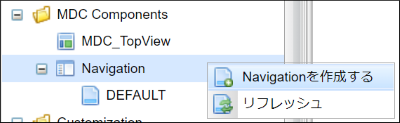
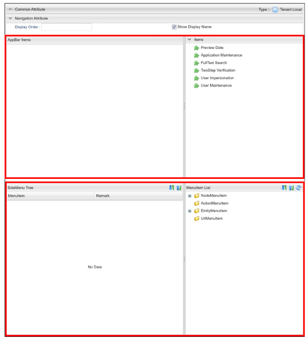
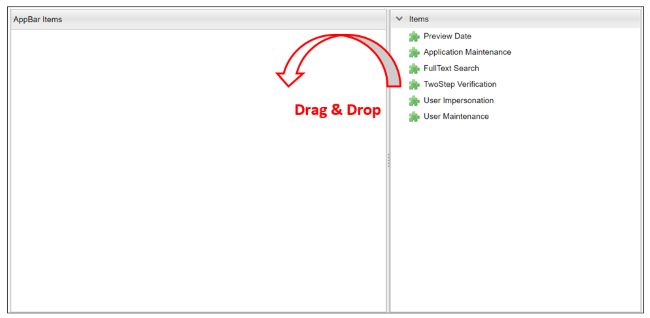
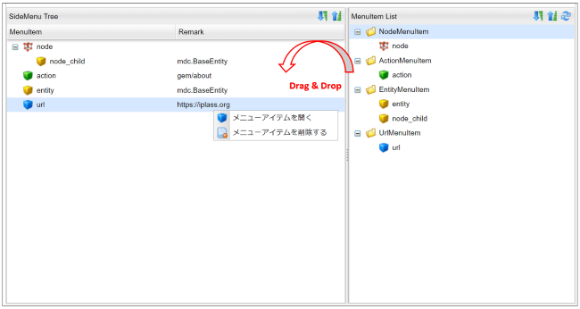
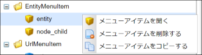

[[management]]
== Navigationの管理

[[create_navigation]]
=== Navigationの作成
AdminConsoleのメニューから `Navigation` を右クリックし、 `Navigationを作成する` を選択します。
表示されたダイアログの `Name` には対応するロールコードを設定して下さい。

[[navigation_setting]]
=== 設定
画面上の上半分がアプリケーションバーの設定、下半分がサイドメニューの設定という構成になっています。

Navigationでの設定項目です。

[cols="1,1,6a", options="header"]
|===
|設定項目
|利用箇所
|説明

|Display Order
|ナヴィゲーション切り替え
|ナヴィゲーション切り替えでの表示順序を指定します。

以下の順番によりソートを行います。
[cols="2,1,1,3a", options="header"]
!===
!設定元!設定項目!昇順/降順!備考
!Navigation定義!Display Order!昇順!
!ロール!優先度!降順!
!ロール/Navigation定義!Name!昇順!
`Show Display Name` がチェックされた場合、Navigation定義の表示名でソートします
!===
|Show Display Name
|ナヴィゲーション切り替え
|ナヴィゲーション切り替えで表示する名称をNavigation定義の表示名にします。未チェック時はロール名( = Navigation定義名)を表示します。
|===

==== アプリケーションバー

左側のドロップ可能領域に対して、右側の `Items` からパーツをドラッグ&ドロップしてパーツの配置/編集を行います。

標準提供するパーツには以下のものがあります。いずれのパーツも複数配置することはできません。 +

[cols="1,3", options="header"]
|===
|パーツ名|説明

|Preview Date
|プレビュー日付機能へのリンクを表示する場合に設定するパーツです。

|Application Maintenance
|アプリケーション管理機能へのリンクを表示する場合に設定するパーツです。

|FullText Search
|全文検索の設定を行うパーツです。

|TwoStep Verification
|2段階認証の設定を行うパーツです。

|User Impersonation
|代理ログインの設定を行うパーツです。

|User Maintenance
|ユーザー情報変更でユーザー自身に情報を変更させる場合に設定するパーツです。
|===

各パーツのアイコンをクリックすることで、パーツの詳細設定ができます。
ここからは各パーツの詳細設定について説明します。

[[previewdate]]
===== Preview Date
テナント設定の `日付プレビュー表示機能` が有効になっている場合、特定の日時を現在日時としてプレビューすることができます。 +
特定の日時における表示を確認したい場合に利用します。

[cols="1,3a", options="header"]
|===
|設定項目|設定内容
|Title
|タイトルをカスタマイズしたい場合に設定します。未指定の場合のデフォルトは、 `プレビュー日付` です。
|Use Preview Date
|プレビュー日付の管理機能を有効化するかを指定します。
|===

[[applicationmaintenance]]
===== Application Maintenance
ユーザーメニューでアプリケーション管理機能へのリンクを表示する場合に設定を行います。 +
アプリケーションの管理画面では、ユーザーに設定されているOAuthのクライアント情報の閲覧とメンテナンス(削除)、有効なRememberMe設定の閲覧とメンテナンス(無効化)、個人アクセストークンのメンテナンス(生成/削除)が可能です。 +
個人アクセストークンとは、iPLAssで定義したWeb APIへのBearer Tokenによる認証でID/パスワードの代わりに使用できる認証トークンです。

[cols="1,3a", options="header"]
|===
|設定項目|設定内容
|Title
|タイトルをカスタマイズしたい場合に設定します。未指定の場合のデフォルトは、 `アプリケーション管理` です。
|Use Personal access token
|個人アクセストークンの管理機能を有効化するかを指定します。
|===

[[fulltextsearch]]
===== FullText Search
MDCモジュールで全文検索機能を利用する場合に設定します。 +
全文検索のクロール対象とした各Entityに対して、表示可否やEntityViewの対象Viewを指定します。

[cols="1,3", options="header"]
|===
|設定項目|設定内容
|Show FullTextSearch Window
|チェックを入れると、アプリケーションバーに全文検索用のアイコンが表示されます。
|Entity Name
|全文検索のクロール対象としたEntityの表示名が表示されます。編集不可な項目です。
|View Name
|全文検索の結果表示で利用するEntityViewのView名を指定します。Entity毎に設定可能です。
|Show in search list
|チェックを入れると、全文検索の対象となります。Entity毎に設定可能です。
|===

[[twostepverification]]
===== TwoStep Verification
2段階認証の情報を表示します。また、2段階認証設定の有効化/無効化の切り替えが利用できるようになります（2段階認証の有効化/無効化は認証ポリシーの切り替えによって実現する仕組みです）。 +
`Authentication Policy Without TwoStep Verification` と `Authentication Policy With TwoStep Verification` の両方が設定されている場合、2段階認証設定の有効化/無効化（認証ポリシーの切り替え）を利用することができます。

[cols="1,3", options="header"]
|===
|設定項目|設定内容
|Authentication Policy Without TwoStep Verification
|2段階認証ポリシーが設定されていない認証ポリシーを設定します。
|Authentication Policy With TwoStep Verification
|2段階認証ポリシーが設定されている認証ポリシーを設定します。
|===

[[userimpersonation]]
===== User Impersonation
ユーザーメニューで代理ログイン機能(代理ログイン許可ユーザーの選択)へのリンクを表示する場合に設定を行います。

[cols="1,3a", options="header"]
|===
|設定項目|設定内容
| Can Impersonation To | 代理ログイン許可ユーザーの設定可否を指定します。
| User View | ユーザーを検索する際に用いるユーザー情報（ `mtp.auth.User` ）のEntityViewの対象Viewを選択します。
|===

初期状態では、ユーザー情報にMDC用のEntityViewは登録されていません。必要に応じてユーザー情報のEntityViewを作成してください。

[[usermaintenance]]
===== User Maintenance

ユーザーメニューでユーザー情報変更を選択した際に、ユーザー自身に情報を変更させるための設定を行います。 +
ユーザーが編集可能な項目は設定したViewの内容に依存します。パーツ未指定時はパスワードの変更のみ可能です。

[cols="1,3a", options="header"]
|===
|設定項目|設定内容
|User View
|ユーザーが自身の情報を変更するための画面で用いるユーザー情報（ `mtp.auth.User` ）のEntityViewの対象Viewを選択します。
|===

初期状態では、ユーザー情報にMDC用のEntityViewは登録されていません。ユーザーが自身の情報を変更するための画面で利用するユーザー情報のEntityViewを作成してください。 +
なお、ユーザーに権限に絡む項目など必要以上の項目を編集させないように注意してください。

==== サイドメニュー

左側のドロップ可能領域に対して、右側のメニューアイテムリストからメニューアイテムをドラッグ&ドロップして編集を行います。また、配置したメニューアイテムをドロップ可能領域内でドラッグ&ドロップすることで、順序を変更することができます。 +
ドロップ可能領域に追加したメニューアイテムの編集や削除（ドロップ可能領域からの削除）は右クリックで表示されるコンテキストメニューから実行します。また、各メニューアイテムをダブルクリックした場合は、該当メニューアイテムの編集画面が表示されます。

メニューアイテム自体を追加したい場合は、メニューアイテムリスト領域で、`NodeMenuItem` 、 `ActionMenuItem` 、 `EntityMenuItem` 、 `UrlMenuItem` から追加したいメニューアイテムのフォルダを右クリックし、表示されるコンテキストメニューから実行します。

メニューアイテム自体を編集/削除したい場合は、メニューアイテムリスト領域で、対象のメニューアイテムを右クリックして表示されるコンテキストメニューから実行します。各アイテムをダブルクリックした場合は該当メニューアイテムの編集画面が表示されます。

AdminConsole上からエンティティを新規で作成した場合、 `DEFAULT` 定義の一番下に自動的にEntityMenuItemが追加されます。

.メニューアイテムの編集
メニューアイテムは `NodeMenuItem` 、 `ActionMenuItem` 、 `EntityMenuItem` 、 `UrlMenuItem` の４種類に分類されます。
登録済のメニューアイテムをダブルクリックするか、右クリックでコンテキストメニューからメニューアイテムを編集します。

編集した内容は利用されているドロップ可能領域にも反映されます。 また。メニューアイテムを削除した場合も利用されているドロップ可能領域から削除されます。

[[nodemenuitem]]
===== NodeMenuItem
階層を表すメニューアイテムです。このメニューアイテムの下に他のメニューアイテムを配置できます。 +
最大3階層までネストすることが可能です（ `NodeMenuItem` を2つまでネストして利用可能です）。

[cols="1,3a",options="header"]
|===
|項目
|内容

|Name
|識別名です。
`/` により階層化して管理することが可能です。

|Display Name
|サイドメニューに表示される名称です。

|Description
|説明を記載します。

|Icon URL
|メニューアイテムの先頭に付与するアイコンをURLで指定します。
以下のルールによりパスを判断します。

`/` で始まる場合:: 静的コンテキストパスからの指定と判断
`http` で始まる場合:: 外部リソースと判断
上記以外（actionなどの指定含む）の場合:: テナントコンテキストパスからの指定と判断

|Icon Tag
|link:https://materialdesignicons.com/[Material Design Icons^]のアイコンタグを設定できます。（例:mdi-note）

|Image Color
|`Icon Tag` で指定したアイコンの色を指定できます。カラーコードまたはマテリアルカラー名（例:red）を指定してください。
|===

[[actionmenuitem]]
===== ActionMenuItem
定義された任意のActionを実行する為のメニューアイテムです。

[cols="1,3a",options="header"]
|===
|項目
|内容

|Name
|識別名です。
`/` により階層化して管理することが可能です。

|Display Name
|サイドメニューに表示される名称です。

|Description
|説明を記載します。

|Icon URL
|メニューアイテムの先頭に付与するアイコンをURLで指定します。
以下のルールによりパスを判断します。

`/` で始まる場合:: 静的コンテキストパスからの指定と判断
`http` で始まる場合:: 外部リソースと判断
上記以外（actionなどの指定含む）の場合:: テナントコンテキストパスからの指定と判断

|Icon Tag
|link:https://materialdesignicons.com/[Material Design Icons^]のアイコンタグを設定できます。（例:mdi-note）

|Image Color
|`Icon Tag` で指定したアイコンの色を指定できます。カラーコードまたはマテリアルカラー名（例:red）を指定してください。

|Execute Action
|メニューがクリックされた際に実行するAction定義を選択します。

|Parameter
|実行Actionに渡すパラメータを指定します。
（例：defName=OrderItemAggregate）

|Dynamic Customize Setting
|実行時にメニューアイテムの設定をカスタマイズするGroovyScriptを設定します。
以下の項目がバインドされており、設定のカスタマイズは下記項目を変更することで行えます。

menuItem.actionName:: Execute Actionで選択したAction定義の名前
menuItem.parameter:: Parameterで設定した値
|===

[[entitymenuitem]]
===== EntityMenuItem
別途定義された任意のエンティティの検索画面を表示する為のメニューアイテムです。
AdminConsole上からエンティティを作成した場合は、自動的に対応するEntityMenuItemが作成されます。

ツールやパッケージ機能でエンティティ定義のみをインポートした場合は自動的には作成されません。
インポートしたエンティティに対してメニューを表示したい場合は、手動でEntityMenuItemを作成してください。

[cols="1,3a",options="header"]
|===
|項目
|内容

|Name
|識別名です。
`/` により階層化して管理することが可能です。

|Display Name
|サイドメニューに表示される名称です。未指定の場合、エンティティの表示名が利用されます。

|Description
|説明を記載します。

|Icon URL
|メニューアイテムの先頭に付与するアイコンをURLで指定します。
以下のルールによりパスを判断します。

`/` で始まる場合:: 静的コンテキストパスからの指定と判断
`http` で始まる場合:: 外部リソースと判断
上記以外（actionなどの指定含む）の場合:: テナントコンテキストパスからの指定と判断

|Icon Tag
|link:https://materialdesignicons.com/[Material Design Icons^]のアイコンタグを設定できます。（例:mdi-note）

|Image Color
|`Icon Tag` で指定したアイコンの色を指定できます。カラーコードまたはマテリアルカラー名（例:red）を指定してください。

|Entity
|メニューアイテムがクリックされた際に操作対象とするエンティティを選択します。

|View Name
|表示するEntityViewのView名を指定します。
未指定の場合、Parameterでの設定があればそれを優先し、Parameterにも無い場合はデフォルトのViewを表示します。

|Parameter
|検索画面表示時のリクエストパラメータを指定することが可能です。

viewName=XXX:: デフォルト以外の指定した画面定義を利用
sc_プロパティ名=YYY:: 検索条件にYYYを自動で設定
es=t:: 画面表示時に検索を実行

`View Name` を直接指定した場合は、viewNameパラメータを指定しないでください。

`show with execute search` にチェックした場合は、esパラメータを指定しないでください。

|show with execute search
|画面表示時に検索を実行します。

|Dynamic Customize Setting
|実行時にメニューアイテムの設定をカスタマイズするGroovyScriptを設定します。
以下の項目がバインドされており、設定のカスタマイズは下記項目を変更することで行えます。

menuItem.defName:: Entityで選択したEntity定義の名前
menuItem.viewName:: View Nameで選択した値
menuItem.parameter:: Parameterで設定した値
menuItem.executeSearch:: show with execute searchで設定した値
|===

[[urlmenuitem]]
===== UrlMenuItem
任意のURLを表示する為のメニューアイテムです。

[cols="1,3a",options="header"]
|===
|項目
|内容

|Name
|識別名です。
`/` により階層化して管理することが可能です。

|Display Name
|サイドメニューに表示される名称です。

|Description
|説明を記載します。

|Icon URL
|メニューアイテムの先頭に付与するアイコンをURLで指定します。
以下のルールによりパスを判断します。

`/` で始まる場合:: 静的コンテキストパスからの指定と判断
`http` で始まる場合:: 外部リソースと判断
上記以外（actionなどの指定含む）の場合:: テナントコンテキストパスからの指定と判断

|Icon Tag
|link:https://materialdesignicons.com/[Material Design Icons^]のアイコンタグを設定できます。（例:mdi-note）

|Image Color
|`Icon Tag` で指定したアイコンの色を指定できます。カラーコードまたはマテリアルカラー名（例:red）を指定してください。

|URL
|表示対象のURLを設定します。
URLのパスはIcon URLと同様のルールで判断されます。

|Parameter
|URLに付与するクエリ文字列を設定します。
（例：name=aaaa&value=bbbb....）

|show new window
|メニューアイテムクリック時に新しいページ（ウィンドウまたはタブ）で開きます。

|Dynamic Customize Setting
|実行時にメニューアイテムの設定をカスタマイズするGroovyScriptを設定します。
以下の項目がバインドされており、設定のカスタマイズは下記項目を変更することで行えます。

menuItem.url:: URLで設定した値
menuItem.parameter:: Parameterで設定した値
menuItem.showNewWindow:: show new windowで設定した値
|===
