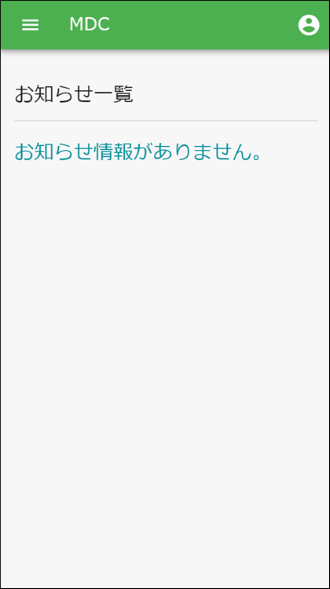
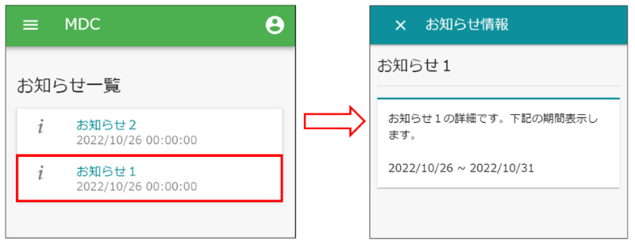
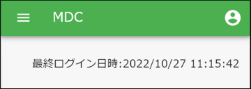

[[operation_guide]]
== 操作説明

=== Top画面
MDCモジュールにおけるTop画面です。

[[topview_parts]]
=== パーツ
Top画面のコンテンツ部分に表示するパーツです。

==== お知らせ一覧
アプリケーション管理者やシステム管理者が登録したお知らせ情報を一覧で表示するパーツです。
一覧のアイテムをクリックするとお知らせ情報の詳細が表示されます。 +
お知らせ情報は、 `mtp.Information` エンティティで管理されています。

==== 最終ログイン日時
現在ログイン中のユーザーが最後にログインした日時を表示するパーツです。

