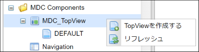
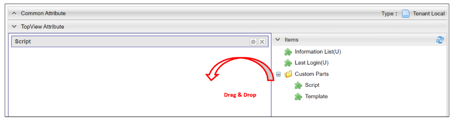

[[management]]
== TopViewの管理

[[create_topview]]
=== TopViewの作成
AdminConsoleのメニューから `MDC_TopView` を右クリックし、 `TopViewを作成する` を選択します。
表示されたダイアログの `Name` には対応するロールコードを設定して下さい。

[[topview_setting]]
=== 設定
左側のドロップ可能領域に対して、右側の `Items` からパーツをドラッグ&ドロップしてパーツの配置/編集を行います。
また、配置したパーツをドロップ可能領域内でドラッグ&ドロップすることで、パーツの順序を変更できます。

標準提供するパーツには以下のものがあります。 +
パーツには複数配置可能なものと不可能なものがあり、AdminConsole上でパーツの右側に `(U)` と表示されているパーツは、複数配置することができないUniqueなパーツです。

[cols="1,1,5,1", options="header"]
|===
2+|パーツ名|説明|複数配置可能か

2+|Information List
|お知らせ情報で登録したデータを表示します。|×

2+|Last Login
|最終ログイン日時を表示します。|×

.2+|Custom Parts
|Script
|GroovyTemplateで記述されたテンプレートを表示します。|○

|Template
|登録済みのテンプレートを表示します。|○
|===

各パーツのアイコンをクリックすることで、パーツの詳細設定ができます。
ここからは各パーツの詳細設定について説明します。

[[informationlist]]
==== Information List
Top画面でお知らせ一覧を表示するパーツです。パスワード有効期限が近づいてきた際に警告メッセージを表示することも可能です。

[cols="1,2a", options="header"]
|===
|設定項目|設定内容

|Title
|タイトルをカスタマイズしたい場合に指定します。
未設定の場合は `お知らせ情報` と表示されます。

|Icon Tag
|タイトルの前に表示するアイコンを設定できます。 +
link:https://materialdesignicons.com/[Material Design Icons^]のアイコンタグを設定できます。（例:mdi-note）

|Class
|スタイルシートのクラス名を指定します。複数指定する場合は半角スペースで区切って下さい。

|Time Display Range
|一覧上の時間部分の表示範囲を指定します。

default:: 日付のみ表示します。
SEC:: 秒まで表示します
MIN:: 分まで表示します。
HOUR:: 時まで表示します。
NONE:: 日付のみ表示します。

|Scroll display number
|お知らせ一覧がスクロール表示となるお知らせ件数の閾値を指定します。 +
未指定の場合は、スクロール表示になりません。

|Enable Html Tag
|本項目がチェックされている場合、お知らせ情報の詳細表示時にHTMLタグが有効になります。

|Information Detail Custom Style
|お知らせ詳細のメッセージ表示部分に対して、直接style属性をGroovyScriptで指定することが可能です。 お知らせ内容によって表示を強調させたい場合などに利用します。

以下のオブジェクトがバインドされています。

====
today:: 現在の日付。 `java.sql.Timestamp` のインスタンス
entity:: 詳細表示中のお知らせ情報エンティティ
====

|Show warning message of the password expiration date
|本項目がチェックされている場合、パスワード有効期間に対する警告メッセージを表示します。

|Remain days threshold
|有効期限の何日前から警告を表示するかの閾値を設定します。

|Custom warning message
|警告メッセージの文言をカスタマイズしたい場合に指定します。

|Custom alert message style
|警告メッセージ表示領域のスタイルをカスタマイズしたい場合に指定します。Vuetify.jsのアラートコンポーネントを使用します。 `info` 、 `warning` 、 `error` 、 `info(outline)` 、 `warning(outline)` 、 `error(outline)` からスタイルを選択可能です。未指定の場合のデフォルトは、 `warning` です。

|Custom alert icon
|警告メッセージ表示領域のアイコンをカスタマイズしたい場合に指定します。
link:https://materialdesignicons.com/[Material Design Icons^]のアイコンタグを設定できます。（例:mdi-alert）
|===

[[lastlogin]]
==== Last Login
Top画面にログイン中のユーザーの最終ログイン日時を表示します。

[cols="1,2a", options="header"]
|===
|設定項目|設定内容

|Class
|スタイルシートのクラス名を指定します。複数指定する場合は半角スペースで区切って下さい。
|===

[[script]]
==== Script
Top画面にGroovyTemplateで記述されたテンプレートを表示します。 +
HTMLやスクリプト、Vue.jsのSFC形式（単一ファイルコンポーネント形式）などでテンプレートを記述できます。 +
テンプレートの実装方法の詳細については、link:../../../storybook/index.html?path=/docs/開発者ドキュメント-オリジナルテンプレート[コンポーネントカタログ^]を参照してください。

[cols="1,2a", options="header"]
|===
|設定項目|設定内容
|Template Interpret Type
|記述されたテンプレート文字列の解釈タイプです。以下の３つから選択できます。

HTML:: HTMLとして解釈します。HTMLやスクリプトの記述が可能です。
VUE_SFC:: Vue.jsのSFC形式（単一ファイルコンポーネント形式）で記述されたコンポーネントとして解釈します。
VUE_SFC_LIKE:: Vue.jsのランタイムを用いてコンポーネントとして解釈します。MDCでは、Vue.jsのランタイムに加えてコンパイラもバンドルしており、Vue.jsのテンプレート構文を利用することが可能です。
|ComponentName
|コンポーネント名を設定します。 コンポーネント名は、英文字とハイフン(-)のみを利用したパスカルケースでの命名を推奨します。
`Template Interpret Type` が `VUE_SFC_LIKE` の場合、コンポーネント名の指定は必須です。 `Template Interpret Type` が `VUE_SFC` でコンポーネント名が未入力の場合、自動でランダムなコンポーネント名を割り当てます。
|Script
|スクリプト編集画面を表示してGroovyTemplateの文法に従って記述します。
詳細は<<../../customizing/index.adoc#groovytemplate, GroovyTemplate>>を参照してください。
|===

.VUE_SFC形式、VUE_SFC_LIKE形式の場合のコンポーネントとのデータ受け渡し（props/emit）

以下のデータがpropsとしてコンポーネントに引き渡されます。
====
contextMap:: コンテキストマップ。リアクティブな空のMapオブジェクト。 +
コンテキストマップにデータを格納することで、複数のパーツ（コンポーネント）間でリアクティブにデータを共有することが可能です。
====

[[template]]
==== Template
Top画面に登録済みのテンプレートを表示します。 +
テンプレートの実装方法の詳細については、link:../../../storybook/index.html?path=/docs/開発者ドキュメント-オリジナルテンプレート[コンポーネントカタログ^]を参照してください。

[cols="1,2a", options="header"]
|===
|設定項目|設定内容

|Template Interpret Type
|テンプレートの解釈タイプです。以下の３つから選択できます。

HTML:: HTMLとして解釈します。HTMLやスクリプトの記述が可能です。
VUE_SFC:: Vue.jsのSFC形式（単一ファイルコンポーネント形式）で記述されたコンポーネントとして解釈します。
VUE_SFC_LIKE:: Vue.jsのランタイムを用いてコンポーネントとして解釈します。MDCでは、Vue.jsのランタイムに加えてコンパイラもバンドルしており、Vue.jsのテンプレート構文を利用することが可能です。

|ComponentName
|コンポーネント名を設定します。 コンポーネント名は、英文字とハイフン(-)のみを利用したパスカルケースでの命名を推奨します。
`Template Interpret Type` が `VUE_SFC_LIKE` の場合、コンポーネント名の指定は必須です。 `Template Interpret Type` が `VUE_SFC` でコンポーネント名が未入力の場合、自動でランダムなコンポーネント名を割り当てます。

|Template
|登録済みのテンプレートを選択します。
|===

.VUE_SFC形式、VUE_SFC_LIKE形式の場合のコンポーネントとのデータ受け渡し（props/emit）

以下のデータがpropsとしてコンポーネントに引き渡されます。
====
contextMap:: コンテキストマップ。リアクティブな空のMapオブジェクト。 +
コンテキストマップにデータを格納することで、複数のパーツ（コンポーネント）間でリアクティブにデータを共有することが可能です。
====