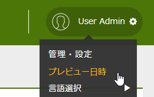
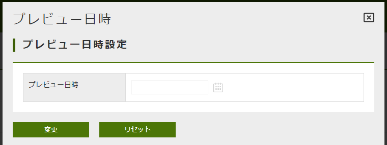

== テナント管理
テナント単位の設定情報はAdminConsoleから設定します。
以下にテナント単位で設定可能な項目について説明します。

[[path_definition]]
=== パスについて
==== パスの種類
説明文中にiPLAssで定義するURL、パスの種類がいくつかあります。以下に説明します。

.servletContextPath（サーブレットコンテキストパス）
Servlet仕様で定義されるcontextPathです。
`HttpServletContext#getContextPath()` メソッドで取得されるパスです。

.tenantURL（テナントURL）
テナントURLはテナント単位に一意のURL文字列（パス）です。

.tenantContextPath（テナントコンテキストパス）
`ServletContextPath + tenantURL` +
で定義されます。
APサーバ上でテナントまでを特定するルート相対パスです。

.staticContentPath（静的コンテンツパス）
JavaScriptファイル、CSSファイルなどの静的コンテンツを格納するルートパスです。
通常はservletContextPathと同一ですが、WebFrontendServiceの設定で変更することが可能です。

[[url_definition]]
==== URLの指定
指定するURLには以下のルールがあります。

.「/」始まりの場合
staticContentPath以降の指定とみなします。 +
`staticContentPath + 指定パス`

.「http」始まりの場合
外部リソースを指定したとみなします。(指定パスをそのまま利用)

.上記以外の場合
テナントコンテキストパス以降の指定とみなします。
Action経由でStreamやStaticResourceを利用する場合は、Action名を設定することでこのパターンとして動作します。 +
`tenantContextPath + "/" + 指定パス`

=== テナントの設定項目

==== 基本設定
テナントに関する基本的な設定です。
[cols="3,10a",options="header"]
|===
| 項目 | 設定内容
| テナントID | テナントのIDです。テナント作成時に決定されます。変更はできません。
| テナント名 | テナント名です。テナント作成時に決定されます。変更はできません。
| テナントURL | テナントのURLです。テナント作成時に決定されます。変更はできません。
| 表示名 | テナントの表示名称を設定します。
| 概要 | テナントの概要を設定可能です。
| 有効開始日、有効終了日 |
このテナントが有効な期間を示します。
有効期間の判定は、「有効開始日≦現在日付＜有効終了日」となっており、
ログイン可能なのは、有効終了日の１日前までです。
|===

[[tenant_auth]]
==== 認証設定
認証に関する設定です。
[cols="3,10a",options="header"]
|===
| 項目 | 設定内容
| RememberMe機能を利用する |
ログイン状態を一定期間保持する機能を利用するかを指定します。 +
利用する場合は、認証ポリシーの<<../authentication/index.adoc#ref_rememberme_policy, Remember Me>>を設定してください。
| ユーザー管理者ロール | ユーザー管理者ロールに指定されたロールを保持するユーザーは
ユーザーのパスワードリセット、ユーザーのアカウントポリシーの変更など、ユーザーの管理をすることが可能となります。 +
GEMのユーザー編集機能は、この設定をもとにリセットボタンの表示制御を行っています。
|===

==== 画面表示設定（GEM）

===== GEMモジュールの画面表示設定

GEMモジュールの汎用画面表示に関する設定です。
[cols="3,10a",options="header"]
|===
| 項目 | 設定内容
| ロゴURL |
標準レイアウトを利用した画面で、ヘッダ上にロゴ画像を表示する場合に設定します。
設定する値は画像のURLです。 +
URLの指定方法については、<<url_definition, URLの指定>>を参照してください。

スキン設定がFlatの場合で、未指定の時はデフォルトのロゴが表示されます。

| ロゴURL(小) |
スキン設定がFlatの場合の設定です。 +
メニューを縮小した際に表示するロゴ画像を設定します。
未指定の時はデフォルトのロゴが表示されます。

| ロゴURL(大) |
スキン設定がFlatの場合の設定です。 +
ログイン画面に表示するロゴ画像を設定します。
未指定の時はデフォルトのロゴが表示されます。

| アイコンURL |
標準レイアウトを利用した画面で、headerにiconタグを設定します。ico、png、gifに対応します。

| 画面タイトル表示 |
標準レイアウトを利用した画面で、ヘッダ上に「画面タイトル」を表示するかを設定します。
テナントロゴを指定している場合に、画面タイトルを出力したくない時に「表示しない」に設定することを想定しています。

| 画面タイトル・ロゴ表示 (ログイン・エラー画面) |
ログイン画面、エラー画面に画面タイトル、テナントロゴを表示するかを設定します。
スキン設定がFlatの場合とそれ以外の場合で動作が異なります。

Flatの場合 ::
ログイン画面には画面タイトルは表示されません。「ロゴURL(大)」の設定によってロゴが出力されます。 +
エラー画面は「画面タイトル表示」、「ロゴURL」の設定によって表示が決定されますが、
「表示しない」を設定した場合、ロゴについては「ロゴURL」の指定に関係なくデフォルトのロゴが出力されます。

Flat以外の場合 ::
ログイン画面、エラー画面ともに「画面タイトル表示」、「ロゴURL」の設定によって表示が決定されますが、
「表示しない」を設定した場合、画面タイトルにはservice-configで設定された「TenantContextService」の「defaultTenantName」が表示されます。
ロゴは「ロゴURL」の設定に関係なく表示されなくなります。 +
service-configの設定については<<../../serviceconfig/index.adoc#TenantContextService,TenantContextService>>を参照してください。 +
デフォルトでは `iPLAss` が設定されています。

ログイン画面やエラー画面で画面タイトルやテナントロゴを隠したい場合は「表示しない」を選択してください。

| 画面タイトル | 画面タイトルを返却するGroovyTemplateを指定します。未指定の場合は、表示名（テナント名）が利用されます。また、指定したGroovyTemplateでエラーが発生した場合も表示名（テナント名）が利用されます。

| スキン名 | GEMで提供されている画面レイアウトを指定します。
未指定の場合は、デフォルト設定（Flat）が利用されます。

| テーマ名 |GEMで提供されている画面テーマカラーを指定します。
未指定の場合は、デフォルト設定が利用されます。

| テナントJavaScript URL |
GEMで提供している標準レイアウト(gem/layout/defaultLayout)、
ポップアップレイアウト(gem/layout/popupLayout)に組み込むカスタムのJavaScriptのURLを指定します。

|テナントStyleSheet URL |
GEMで提供している標準レイアウト(gem/layout/defaultLayout)、ポップアップレイアウト(gem/layout/popupLayout)に組み込むカスタムのCSSのURLを指定します。
|===

===== [.eeonly]#MDCモジュールの画面表示設定#

モバイルファーストなMDCモジュールの汎用画面表示に関する設定です。
[cols="3,10a",options="header"]
|===
| 項目 | 設定内容
| アプリケーションバーロゴURL | 標準レイアウトを利用した画面で、アプリケーションバーにロゴ画像を表示する場合に設定します。
設定する値は画像のURLです。 +
URLの指定方法については、<<url_definition, URLの指定>>を参照してください。
| ログイン画面ロゴURL | ログイン画面に表示するロゴ画像を設定します。設定しなかった場合はデフォルトのロゴ画像が表示されます。
設定する値は画像のURLです。 +
URLの指定方法については、<<url_definition, URLの指定>>を参照してください。
| ファビコンURL | ファビコンとして設定する画像のURLを設定します。 +
URLの指定方法については、<<url_definition, URLの指定>>を参照してください。
| アップルタッチアイコンURL | アップルタッチアイコンとして設定する画像のURLを設定します。 +
URLの指定方法については、<<url_definition, URLの指定>>を参照してください。
| テナントJavaScript URL |
MDCで提供している標準レイアウトに組み込むカスタムのJavaScriptのURLを指定します。
|テナントStyleSheet URL |
MDCで提供している標準レイアウトに組み込むカスタムのCSSのURLを指定します。
| 画面タイトル表示 |
標準レイアウトを利用した画面で、ヘッダ上に「画面タイトル」を表示するかを設定します。
テナントロゴを指定している場合に、画面タイトルを出力したくない時に「表示しない」に設定することを想定しています。
| 画面タイトル | 画面タイトルを返却するGroovyTemplateを指定します。未指定の場合は、表示名（テナント名）が利用されます。また、指定したGroovyTemplateでエラーが発生した場合も表示名（テナント名）が利用されます。
| テーマ名 | MDCで提供している画面テーマカラーを指定します。 <<../../serviceconfig/index.adoc#MdcConfigService,MdcConfigService>> で独自のテーマ、テーマ配色を設定可能です。
未指定の場合は、デフォルト設定が利用されます。
|===

==== 画面遷移設定
画面遷移に関する設定です。
[cols="3,10a",options="header"]
|===
| 項目 | 設定内容
| ログイン画面Action制御Script | ログイン画面を切り替えるためのScriptを設定します。

認証が必要なActionに対してリクエストされた場合に、このScriptの戻り値として返ってきたAction名を利用して
ログイン画面を表示します。

link:#ref_tenant_loginUrlSelector[ログイン画面Action制御Scriptの設定]

※この制御ScriptではAction名を返します。

| 再認証URL制御Script |
信頼された認証を必要とする重要なページにアクセスした際、再度認証が必要な場合に表示する認証画面を切り替えるためのScriptを設定します。

設定内容についてはログイン画面Action制御Scriptを参照してください。

※この制御ScriptではAction名を返します。

| エラー画面Template制御Script |
システム内で例外が発生した場合のエラー画面を切り替えるためのScriptを設定します。

link:#ref_tenant_applicationErrorUrlSelector[エラー画面Template制御Scriptの設定]

※この制御ScriptではTemplate名を返します。

| TOP画面URL |
TOP画面として表示するURL（アクション名）を指定します。
初期値として `gem/` が設定されています。

ここで指定したURLは以下のタイミングで参照されます。

.tenantContextPath + "/"が呼び出された場合

例えば、servletContextPathがiplass、テナントURLが `/sampleTenant` の場合、TOP画面URLに「gem/」が設定されていた場合 +
`http://localhost:8080/iplass/sampleTenant/` +
にアクセスすると、 +
`http://localhost:8080/iplass/sampleTenant/gem/` +
にリダイレクトします。

| リクエストパス構築用テナントURL |
APサーバの前段にプロキシサーバが存在し、URLのリライティングを行っているような場合に、設定された値でtenantContextPathをリライトできます。

例えば、ServletContextPathが `iplass` 、テナントURLが `/sampleTenant` の場合、 +
APサーバにダイレクトにアクセスする場合、
`http://localhost:8080/iplass/sampleTenant/` +
と呼び出せますが、
前段のプロキシサーバで +
`/ -> /iplass/sampleTenant/` +
のようなパス変換を行っている場合、リクエストパス構築用テナントURLに `/` を設定します。

この設定を行うことで、 +
`http://localhost:8080/` +
で呼び出すことが可能になります。
|===

[[ref_tenant_loginUrlSelector]]
===== ログイン画面Action制御Scriptの設定

.バインド変数
Scriptには以下の変数がバインドされます。

[cols="1,6"]
|===
| request | RequestContextのインスタンス（org.iplass.mtp.command.RequestContextWrapperのインスタンス）
| path | リクエストされたパス。ただし、テナントコンテキストパスを除く(アクション名を表します)
|===

[[ref_tenant_applicationErrorUrlSelector]]
===== エラー画面Template制御Scriptの設定

.バインド変数
Scriptには以下の変数がバインドされます。

[cols="1,6"]
|===
| exception | Exceptionのインスタンス
| request | RequestContextのインスタンス
| path | リクエストされたパス。ただし、テナントコンテキストパスを除く(アクション名を表します)
|===

.エラー画面表示に関する優先度
エラー画面は以下の優先度で決定されます。

. Tenantに設定された「エラー画面Template制御Script」が返すTemplate名
. service-configの `WebFrontendService#errorUrlSelector` で設定されたSelectorが返すTemplate名 +

service-configの設定については<<../../serviceconfig/index.adoc#ErrorUrlSelector,ErrorUrlSelector>>を参照してください。 +
デフォルトでは次のように設定されています。 +

* NoPermissionExceptionの場合、`gem/auth/PermissionError`
* ApplicationExceptionの場合、`gem/generic/error`
* UnavailableExceptionの場合、`gem/error/unavailable`
* それ以外の例外の場合、`gem/error/system`

[.eeonly]#MDCモジュール# を有効化した場合、 `mdc/` で始まるアクションについては、以下のようなエラーTemplateが設定されます。 +

* UnavailableExceptionの場合、`mdc/error/Unavailable`
* それ以外の例外の場合、`mdc/error/System`

==== 多言語設定
多言語に関する設定です。
[cols="3,10a",options="header"]
|===
| 項目 | 設定内容
| 多言語利用 |
GEMを利用した画面で、ヘッダ上に「言語選択」を表示するかを設定します。
「利用する」に設定した場合は、「利用可能言語」を設定する必要があります。

| 利用可能言語 |
標準レイアウトを利用した画面で、ヘッダ上の「言語選択」で選択可能な言語を指定します。

| デフォルトロケール |
テナントのデフォルトロケールを設定します。未指定の場合、サーバのロケールが利用されます。
| デフォルトタイムゾーン |
テナントのデフォルトタイムゾーンを設定します。未指定の場合、サーバのタイムゾーンが利用されます。
| Date出力Format |
Date型のデータを画面やCSVファイルなどに出力する際のフォーマットを設定します。
未指定の場合は、ロケールに従ってservice-configで定義されたフォーマットで出力されますが、
テナントでカスタマイズしたい場合に設定してください。

書式は、 <<ref_tenant_dateFormat>> を参照してください。

| Date画面入力Format |
Date型のデータを画面上で入力する際のフォーマットを設定します。
未指定の場合は、ロケールに従ってservice-configで定義されたフォーマットで出力されますが、
テナントでカスタマイズしたい場合に設定してください。

書式は、 <<ref_tenant_dateFormat>> を参照してください。

|===

[[ref_tenant_dateFormat]]
===== 日付Format設定書式

[cols="3,10",options="header"]
|===
| 書式 | 出力内容
| yyyy | 年(4桁の数字)
| MM | 月(2桁に0埋めした数字)
| MMM | 省略した月名 ex. Jan
| MMMM | 月名 ex. January
| dd | 日(2桁に0埋めした数字)
|===

※MMM、MMMMについては、ロケールがen、en_XXの場合のみ正常に動作します。 +
※画面入力のFormatではMMM、MMMMはサポートしていません。

==== メール送信設定
メール送信に関する設定です。
[cols="3,10a",options="header"]
|===
| 項目 | 設定内容
| メールの送信 |
「メール」機能を利用してメール送信処理を実行した場合に、実際にメールを送信するかを設定します。

開発環境などでメールサーバがない場合など、メール送信処理の確認のみを行いたい場合に
「送信しない」に設定することで、実際のメール送信は実行されなくなります。
開発環境においては、デバッグログに出力されるメール文面を確認することが可能です。

| Fromアドレス |
デフォルトの送信Fromアドレスを設定します。
メール送信時にFromが設定されていない場合、ここで指定されたアドレスをセットします。

| Fromアドレス個人名 | デフォルトの送信Fromアドレスの個人名
( `InternetAddress#personal` )を設定します。(任意)

| ReplyToアドレス |
デフォルトの送信ReplyToアドレスを設定します。未指定の場合はFromアドレスをセットします。

| ReplyToアドレス個人名 | デフォルトの送信ReplyToアドレスの個人名
( `InternetAddress#personal` )を設定します。(任意)
|===

==== 拡張機能設定
拡張機能に関する設定です。
[cols="3,10a",options="header"]
|===
| 項目 | 設定内容
| 日付プレビュー表示機能 |
システム内で利用するシステム日時を一時的に変更して、画面動作・Entity検索結果を確認することができます。
Entityのバージョン管理にて時間ベースのバージョン管理を行っている場合、ここで指定した日付でデータのプレビューを行うことが可能です。

ONにすることで、GEM画面で、ヘッダ上に「プレビュー日時変更」が表示されます。

このダイアログで設定した日時は、設定を実行したユーザーのSession情報に格納されます。
(そのSessionのみで有効)

システム日時を取得する下の２つのAPIは、プレビュー日付が設定されている場合はその値を返します。

`TemplateUtil#getCurrentTimestamp()` Templateでの利用を想定 +
`EntityManager#getCurrentTimestamp()` CommandなどのServerロジックでの利用を想定

※EQLでバインドされる `date` 変数もこの値を返します。
逆に上記APIを利用していない箇所は、設定しても効きません。
|===
