[Report]
= 帳票出力（Jasper/JXLS/POI）
:_hreflang-path: developerguide/report/index.html
:_relative-root-path: ../../

== 帳票出力（Jasper/JXLS/POI）
Templateの編集画面でExcelやPDFの出力定義を設定することで帳票出力機能を利用することが出来ます。

[[Report-Usage]]
== 帳票出力の作成

帳票出力機能を利用するために、Template定義に以下の設定を行わなければなりません。

. 帳票定義のTemplateを呼び出すActionクラスを作成します。
. JasperReports(PDF)、JXLS(Excel)、またはApache POI(Excel)用のテンプレートファイルを作成しておきます。
. Template定義の編集画面でテンプレートタイプに `Report` を選択、 `Report Type` に `JasperReports`、 `JXLS`、または `POI` のいずれかを選択し、作成したテンプレートファイルをアップロードします。
** JasperReportsを利用する場合、Template定義で `DataSource`、`Parameters` の設定項目 にRequestContextまたはSessionContextに値をセットしたAttribute名を設定します。
** JXLSを利用する場合、Template定義で `Context Parameter Mappings` の設定項目にテンプレートファイルに設定したパラメータ名、RequestContextまたはSessionContextに値をセットしたAttribute名を設定します。また、帳票出力処理をカスタマイズしたい場合、JavaまたはGroovyを利用してOutput Logicを実装し、 `Custom OutPut Logic` に設定します。
** POIを利用する場合、JavaまたはGroovyを利用してOutput Logicを実装し、Template定義の `OutPut Logic` に設定します。
. Actionクラスが呼び出されるときに、帳票出力処理が実行されます。

[[Report-Settings]]
== 設定

Template定義の編集画面での設定項目

[cols="1,3",options="header"]
|===
|項目|内容
|Report Type a|
出力ライブラリー形式を設定します。

以下の形式をサポートしてます。

JasperReports :: JasperReports形式
JXLS :: JXLS形式
POI :: POI形式

|Format a|
出力するファイルの形式を設定します。 +
ReportTypeにより、選択可能な形式が異なります。

JasperReportsの場合 ::
PDF(Jasper) +
XLS(Jasper) +
XLSX(Jasper)

JXlSの場合 ::
XLS(JXLS) +
XLSX(JXLS) +
XLSX(JXLS Streaming) ※POIのSXSSFWorkbook形式のWorkbookを生成します。

POIの場合 ::
XLS(POI)			※POIのHSSFWorkbook形式のWorkbookを生成します。 +
XLSX(POI)			※POIのXSSFWorkbook形式のWorkbookを生成します。 +
XLSX(POI Streaming)	※POIのSXSSFWorkbook形式のWorkbookを生成します。

※PDF出力はJasperReports形式のみ対応しています。
|File|
各ReportTypeに対応したテンプレートファイルを設定します。 +
テンプレートファイルを変更する必要がない場合は選択する必要はありません。 +
未指定の場合は、既に登録済の「Saved File」が利用されます。

|Password Attribute Name|
出力するレポートに対してパスワードを設定する場合に、そのパスワード値をセットしたRequestのAttribute名を指定します。

パスワードは、ユーザーに画面上で指定させてリクエストでもらったり、システム内部で固定したり、ランダムで設定してメール通知したり要件に応じて実装し、このTemplateを利用する前のCommandでここで指定したAttributeに対して、パスワードをセットしてください。

※パスワードは、いずれのReportTypeにおいてもXLS形式には対応していません。Excelに対してパスワード指定する場合はXLSX形式を利用してください。

|DataSource Attribute Name|
Report Typeが `JasperReports` 形式用の設定です。 +
JasperFillManager.fillReport実行時のデータソースを設定することができます。

詳細は「<<Report-Template-DataSourceAttributeName>>」を参照してください。

|Parameters|
Report Typeが `JasperReports` 形式用の設定です。 +
JasperReportsに対するパラメータが設定できます。

詳細は「<<Report-Template-Parameters>>」を参照してください。

|Context Parameter Mappings|
Report Typeが `JXLS` 形式用の設定です。 +
JXLS形式のテンプレートに対するパラメータのマッピングを設定できます。

詳細は「<<Report-Template-ContextParameterMappings>>」を参照してください。

|Custom OutPut Logic|
Report Typeが `JXLS` 形式用の任意の設定項目です。 +
独自の出力ロジックをJavaまたはGroovyを利用して設定できます。 +
設定しなかった場合、デフォルトでは、JxlsHelper.processTemplateを用いて帳票出力処理が実行されます。

詳細は「<<Report-Template-CustomOutputLogic>>」を参照してください。

|OutPut Logic|
Report Typeが `POI` 形式用の設定です。 +
出力ロジックをJavaまたはGroovyを利用して設定できます。

詳細は「<<Report-Template-OutputLogic>>」を参照してください。
|===

=== JasperReports設定

[[Report-Template-DataSourceAttributeName]]
==== JasperReports DataSource設定
JasperFillManager.fillReport実行時のデータソースを指定することができます。

このTemplateを利用する前のCommandでJRDataSourceを実装したクラスのインスタンスをAttributeにセットしてください。
そのAttribute名をここで指定することで、JasperFillManager.fillReport実行時にデータソースをセットします。
未設定の場合、JREmptyDataSourceをJasperFillManager.fillReportに渡します。

またEntityの検索結果などをデータソースとして利用したい場合は、
----
org.iplass.mtp.web.template.report.JasperReportingEntityDataSource
----
を利用することも可能です。
EntityのJava Mapping Classを利用していない場合、各Entityで個別に追加したプロパティに対しては、getXXXというメソッドがない為、JRBeanCollectionDataSourceを使うのが難しくなります。
JasperReportingEntityDataSourceを利用することで、EntityのListをそのまま指定し、
Fieldとして利用することができます。

.(例)

* Entity
+
テスト用のEntity定義を登録しておきます。 +
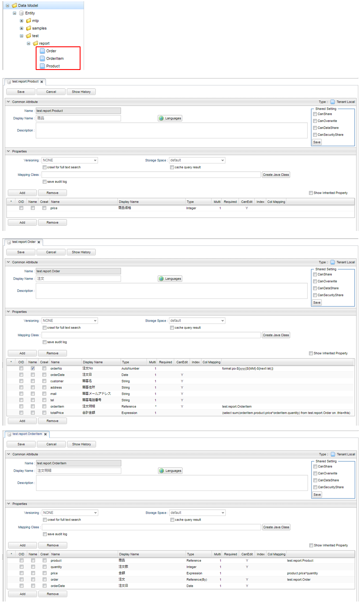

* Command
+
[source,groovy]
----
/**
 * 検索結果をJasperReportingEntityDataSourceとして「orderItems」Attributeにセット。
 */
import org.iplass.mtp.ManagerLocator;
import org.iplass.mtp.entity.Entity;
import org.iplass.mtp.entity.EntityManager;
import org.iplass.mtp.entity.query.Query;
import org.iplass.mtp.entity.SearchResult;
import org.iplass.mtp.entity.LoadOption;
import org.iplass.mtp.entity.query.condition.predicate.Equals;
import org.iplass.mtp.web.template.report.JasperReportingEntityDataSource;

String oid = request.getParam("oid");
request.setAttribute("oid", oid);

EntityManager em = ManagerLocator.manager(EntityManager.class);

//Order検索(OrderItemは別で取得するのでReferenceは取得しない)
Entity order = em.load(oid, "test.report.Order", new LoadOption(false, false));
request.setAttribute("order", order);

//OrderItem検索
Query query = new Query()
    .select("price", "quantity", "product.name", "product.price")
    .from("test.report.OrderItem")
    .where(new Equals("order.oid", oid));
SearchResult<Entity> orderItems = em.searchEntity(query);

//JasperReportingEntityDataSourceとしてEntityのListを格納
request.setAttribute("orderItems", new JasperReportingEntityDataSource(orderItems.getList())); <1>
----
<1> JasperReportingEntityDataSourceとして「orderItems」Attributeにセット。

* Template
+
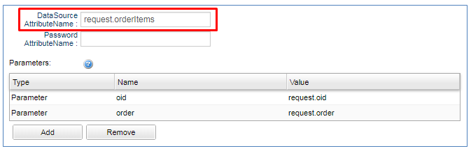

* JasperReports
+
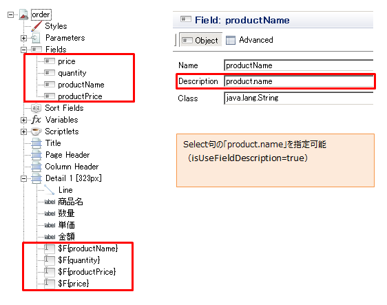

[[Report-Template-Parameters]]
==== JasperReports Parameters設定
JasperFillManager.fillReport実行時のパラメータにセットする値を指定することができます。

[cols="1,3a",options="header"]
|===
|項目|内容
| Value Type | パラメータとして渡す変数タイプを設定をします。

以下の形式をサポートしてます。

Parameter ::
通常のパラメータです。設定されている値をパラメータとして渡します。
SubReport ::
サブレポート用に別のTemplateとして登録したファイルをコンパイルしてパラメータで渡します。
| Name | パラメータとして渡すMapに設定するKey名を指定します。
| Value | Value Typeが `Parameter` の場合に、
パラメータとして渡す値が格納されているAttribute名を指定します。
このTemplateを利用する前のCommandでこのAttributeに対して値をセットしてください。

(例) `request.hoge`
| Template | Value Typeが `SubReport` の場合に、
サブレポート用のJasperReportsテンプレートがセットされているTemplate名を指定します。

パラメータとしてJasperReport形式にコンパイルした結果をセットします。
|===

* Template
+
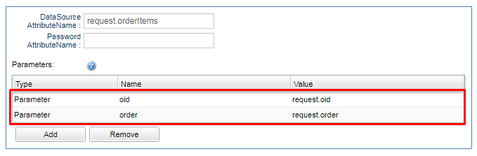

* JasperReports
+
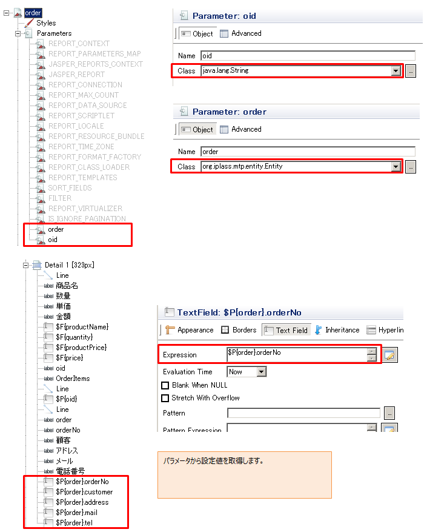

==== 表示方法

作成したCommandクラスとTemplateを呼び出すActionクラスを作成します。

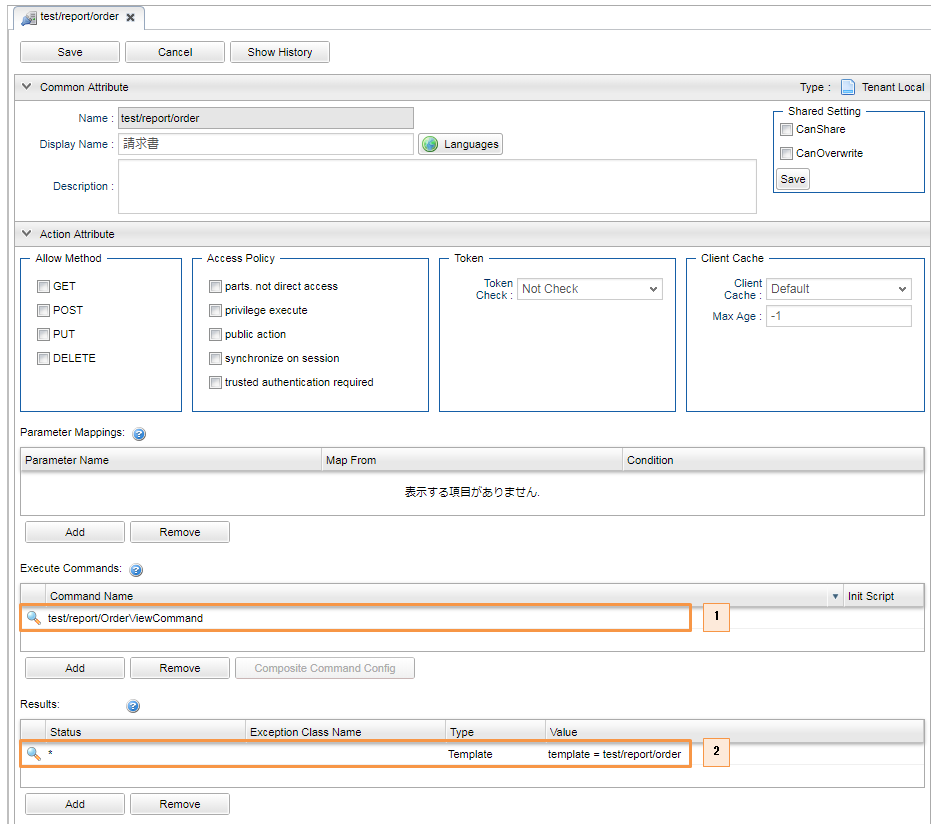

. 作成したCommandクラス
. 帳票出力Template定義

管理画面にログインし、以下のURLにアクセスすると、帳票出力処理が実行されます。 +
[source,url]
----
http://hostname:port/{コンテキスト名}/{テナント名}/test/report/order?oid=xxx
----

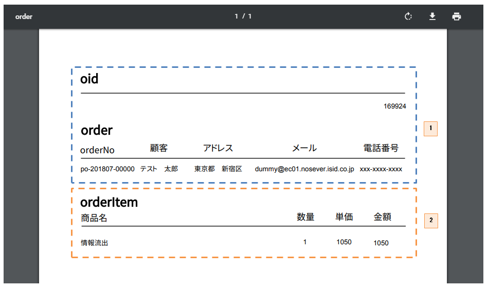

. パラメータとして指定されている部分
. データソースとして指定されている部分

=== JXLS設定
JXLS形式で帳票出力を行うために最低限必要な準備は、JXLS用のExcelテンプレートファイルを用意し、パラメータとして渡すContextに設定するKeyとValue(値が格納されているRequestContext、またはSessionContextのAttribute名)を設定することです。デフォルトでは、JxlsHelper.processTemplateを用いてExcel帳票の生成を実行しています。帳票出力のロジックは、独自にカスタマイズすることも可能です。また、iPLAssでは、JXLSの式評価エンジンとしてGroovyScriptを利用しています。

JXLSの仕様については、以下のサイトを参照してください。 +
link:http://jxls.sourceforge.net[http://jxls.sourceforge.net^]

WARNING: 注意点として、JXLSのEach-Commandなどを利用して大量のセルにデータを書き込む場合、性能が極端に低下する可能性があります。大まかな目安として、Each-Commandなどを利用してデータを書き込むセル数 (行と列の積) が10,000を超えるような場合には `POI` の利用を検討してください。

[[Report-Template-ContextParameterMappings]]
==== Context Parameter Mappings設定
テンプレートファイルからExcel帳票の生成を実行する際のパラメータマッピングを設定します。

[cols="1,3a",options="header"]
|===
|項目|内容
| Key | パラメータとして渡すContextに設定するKey名を指定します。 +
テンプレートファイルに設定したパラメータ名と同一の値を指定してください。

| Value | パラメータとして渡すContextに設定する値が格納されているAttribute名を指定します。
このTemplateを利用する前のCommandでRequestContext、またはSessionContextの指定したAttributeに対して値をセットしてください。

(例) `request.hoge`

| To Map | このオプションが有効の場合、Contextに値をセットする際にGenericEntityのインスタンス、もしくはそのListをMap形式に変換します。 +

EntityのJava Mapping Classを利用していない場合、各Entityで個別に追加したプロパティ(以下、個別プロパティ)に対しては、getXXXというメソッドがない為、JXLSの帳票出力処理において値が取得できない場合があります。

* Map形式への変換が不要な処理 +
iPLAssでは、JXLSの式評価エンジンとして独自に拡張したGroovyScriptを利用している為、 `${entity.propA}` や `${entity.refEntity.propB}` の様にテンプレートファイルにプロパティ式を記述することで、個別プロパティの場合でも値の取得/出力が可能です。
また、 link:http://jxls.sourceforge.net/reference/if_command.html[If-Command^]におけるcondition(条件式)の評価にもGroovyScriptの式評価エンジンが利用される為、個別プロパティの値を条件式に組み込むことが可能です。

* Map形式への変換が必要な処理 +
 プログラム内や各Commandの属性に個別プロパティを指定する様なケースでは、GenericEntityをMap形式に変換する必要があります。具体的には、 link:http://jxls.sourceforge.net/reference/each_command.html[Each-Command^]において並び替え(OrderBy)やグループ化(GroupBy)の基準とする属性に個別プロパティを指定したいケースや、 link:http://jxls.sourceforge.net/reference/grid_command.html[Grid-Command^]のProps属性に個別プロパティを含めたいケース等が該当します。
|===

.(例)

* Entity
+
テスト用のEntity定義を登録します。 +
この例では、 <<Report-Template-DataSourceAttributeName>> での例と同一のEntity定義を利用します。

* Command
+
[source,groovy]
----
import org.iplass.mtp.ManagerLocator;
import org.iplass.mtp.entity.Entity;
import org.iplass.mtp.entity.EntityManager;
import org.iplass.mtp.entity.query.Query;
import org.iplass.mtp.entity.SearchResult;
import org.iplass.mtp.entity.LoadOption;
import org.iplass.mtp.entity.query.condition.predicate.Equals;

String oid = request.getParam("oid");
request.setAttribute("oid", oid);

EntityManager em = ManagerLocator.manager(EntityManager.class);

//Order検索(OrderItemは別で取得するのでReferenceは取得しない)
Entity order = em.load(oid, "test.report.Order", new LoadOption(false, false));
request.setAttribute("order", order);

//OrderItem検索
Query query = new Query()
    .select("price", "quantity", "product.name", "product.price")
    .from("test.report.OrderItem")
    .where(new Equals("order.oid", oid));
SearchResult<Entity> orderItems = em.searchEntity(query);

//EntityのListを格納
request.setAttribute("orderItems", orderItems.getList());
----

* テンプレートファイル
+
JXLS用のExcelテンプレートファイルを作成します。

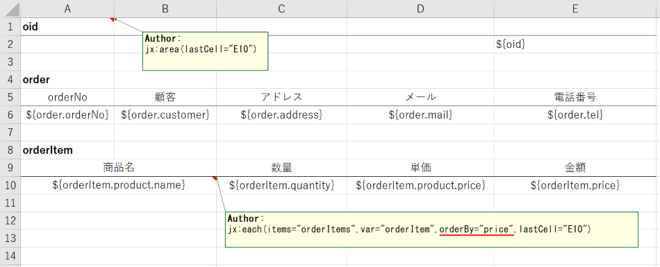

* Template
+
Template定義を設定します。

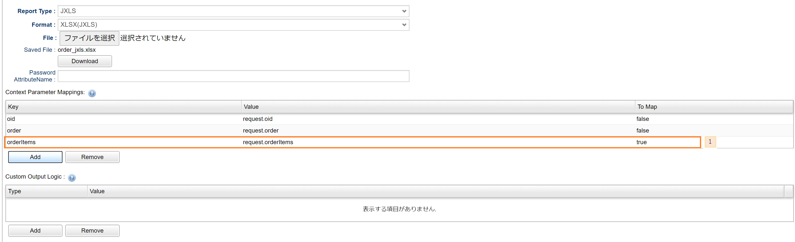

. OrderItemの繰り返し出力の並び替え属性に、個別に追加したプロパティ(price)を指定した為、 `To Map` を有効にします。

==== 表示方法(シンプル)
* Action
+
作成したCommandクラスとTemplateを呼び出すActionクラスを作成します。

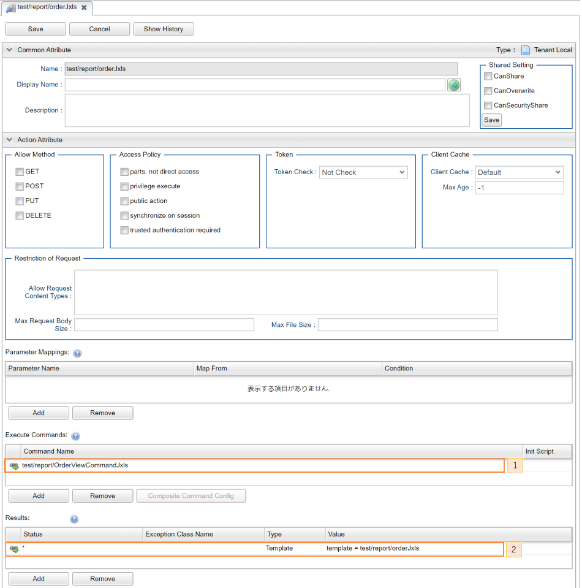

. 作成したCommandクラス
. 帳票出力Template定義

管理画面にログインし、以下のURLにアクセスすると、帳票出力処理が実行されます。 +
[source,url]
----
http://hostname:port/{コンテキスト名}/{テナント名}/test/report/orderJxls?oid=xxx
----

* 出力結果
+
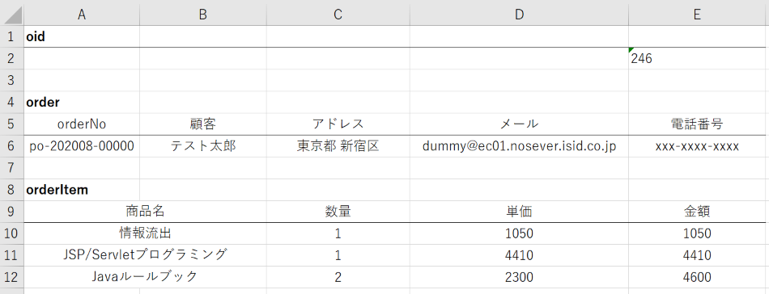

[[Report-Template-CustomOutputLogic]]
==== Custom Output Logic設定
帳票出力の処理を独自にカスタマイズしたい場合、JavaまたはGroovyを利用してJXLS用のOutput Logicを実装し、設定することが可能です。デフォルトでは、JxlsHelpler.processTemplateによって帳票出力が実行されます。JxlsHelperの他のメソッドを利用して帳票出力を実行したい場合、それらに対応したメソッドをデフォルトメソッドとして実装しています。

===== JavaクラスによるOutput Logicの実装
必ず `org.iplass.mtp.web.template.report.JxlsReportOutputLogic` インターフェースクラスをimplementsし、実装して下さい。

.サンプル
[source,java]
----
import java.io.IOException;

import org.iplass.mtp.web.template.report.JxlsReportOutputLogic;
import org.iplass.mtp.web.template.report.ReportOutputException;
import org.jxls.common.Context;
import org.jxls.transform.Transformer;

public class SampleOutputLogicJXLS implements JxlsReportOutputLogic {

	@Override
	public void reportWrite(Transformer transformer, Context context) {
		try {
			// JxlsReportOutputLogicに定義されたデフォルトメソッドを用いて処理
			processGridTemplateAtCell(transformer, context, "propA, propB, propC"); <1>

			// Contextに格納した値の取得
			Object obj = context.getVar("Key");  <2>
		} catch (IOException e) {
			throw new ReportOutputException(e);
		}
	}

}
----
<1> JxlsReportOutputLogicに定義されたデフォルトメソッドを用いて帳票出力を実行可能です。詳細はJavaDocを参照してください。より複雑な出力が必要な場合、引数のTransformerとContextを用いて独自に出力処理を実装することも可能です。
<2> Contextに格納した値を取得して、処理に組み込むことが可能です。

===== GroovyによるOutput Logicの実装
Groovyの記述形式で実装する事ができます。 `org.iplass.mtp.web.template.report.JxlsReportOutputLogic` インターフェースクラスのように以下のバインド変数、およびメソッド(詳細はJavaDocを参照)がGroovyScript内で利用可能です。

[cols="1,3", options="header"]
|===
|バインド変数|内容
|transformer|トランスフォーマー(Apache POIベースのTransformerを利用)
|context|パラメータが格納されたContext
|===

==== 表示方法(カスタム)

.(例)
この例では、Grid-Commandを利用して、動的な列/行数のグリッドを出力する方法を示します。

* Command
+
[source,groovy]
----
import org.iplass.mtp.ManagerLocator;
import org.iplass.mtp.entity.Entity;
import org.iplass.mtp.entity.EntityManager;
import org.iplass.mtp.entity.query.Query;
import org.iplass.mtp.entity.SearchResult;
import org.iplass.mtp.entity.LoadOption;
import org.iplass.mtp.entity.query.condition.predicate.Equals;

String oid = request.getParam("oid");
request.setAttribute("oid", oid);

EntityManager em = ManagerLocator.manager(EntityManager.class);

//Order検索(OrderItemは別で取得するのでReferenceは取得しない)
Entity order = em.load(oid, "test.report.Order", new LoadOption(false, false));
request.setAttribute("order", order);

//OrderItem検索
Query query = new Query()
    .select("price", "quantity", "product.name", "product.price")
    .from("test.report.OrderItem")
    .where(new Equals("order.oid", oid));
SearchResult<Entity> orderItems = em.searchEntity(query);

//Header部分の指定
request.setAttribute("headers", Arrays.asList("商品名", "数量", "単価", "金額"))

//Data部分(EntityのList)の指定
request.setAttribute("data", orderItems.getList());
----

* テンプレートファイル
+
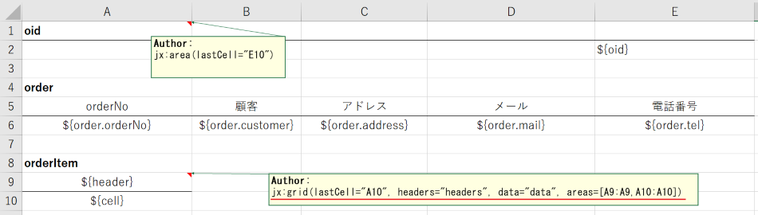

* Template
+
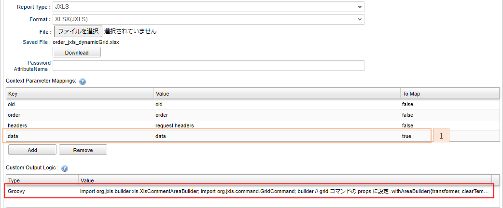

. OutputLogicのプログラム内で直接個別プロパティを指定する為、 `To Map` を有効にします。

.OutputLogicの実装(GroovyScript)
[source,groovy]
----
import org.iplass.mtp.web.template.report.ReportOutputException;

try {
    // 出力するプロパティを指定
    String objectProps = "product.name, quantity, product.price, price";

	// バインド済みのメソッドを用いて帳票出力を実行
	processGridTemplate(transformer, context, objectProps); <1>
} catch (IOException e) {
    throw new ReportOutputException(e);
}
----
<1> JxlsHelper.processGridTemplate(InputStream, OutputStream, Context, String)に対応したメソッドです。

管理画面にログインし、以下のURLにアクセスすると、帳票出力処理が実行されます。 +
[source,url]
----
http://hostname:port/{コンテキスト名}/{テナント名}/test/report/orderJxls?oid=xxx
----

* 出力結果
+
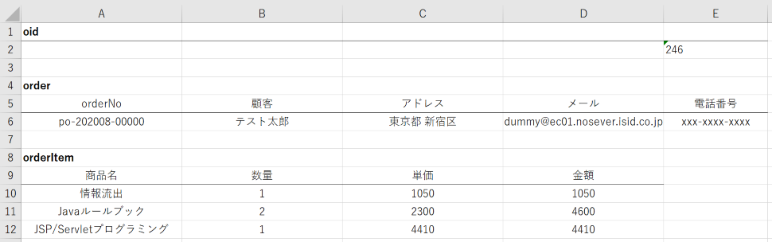

=== Apache POI設定

[[Report-Template-OutputLogic]]
==== Poi Output Logic設定
Poi用のOutput Logicの実装方法は２種類あります。

===== JavaクラスによるOutput Logicの実装

必ず `org.iplass.mtp.web.template.report.PoiReportOutputLogic` インターフェースクラスをimplementsし、実装して下さい。

.サンプル
[source,java]
----
import  org.iplass.mtp.command.RequestContext;
import  org.iplass.mtp.web.template.report.PoiReportOutputLogic;
import  org.apache.poi.ss.usermodel.Workbook;

public class TutorialReportLogic  implements  PoiReportOutputLogic {

     @Override
     public void reportOutput(RequestContext context, Workbook book) {

        // 処理
        def sheet = book.getSheet("シート名"); <1>
        sheet.getRow(XXX).getCell(YYY).setCellValue("セルの値"); <2>
    }
}
----
<1> シート名でテンプレートファイルのシートを取得します。
<2> テンプレートシートのXXXの行のYYYのセルに値をセットします。 +
※SXSSFWorkbookの場合、テンプレートとして設定してあるExcelに既に存在するRowを取得しようとしてもnullが返ってくるので、 +
「テンプレートのXXXのセルに値を設定する」といった利用はできません。Sheet#createRow(rowIndex)やRow#createCell(colIndex)
を利用して、データをExcelに出力する時に利用されます。
詳しくは
link:https://poi.apache.org/apidocs/org/apache/poi/xssf/streaming/SXSSFWorkbook.html#SXSSFWorkbook--[SXSSFWorkbookのConstructor Detail^]を参照してください。

===== GroovyによるOutput Logicの実装

Groovyの記述形式で実装する事ができます。`org.iplass.mtp.web.template.report.PoiReportOutputLogic` インターフェースクラスのように以下のバインド変数がGroovyScriptで利用可能です。 +

[cols="1,3", options="header"]
|===
|バインド変数|内容
|context|リクエストコンテキスト
|book|ワークブック
|===

==== 表示方法

.(例)

* Template
+
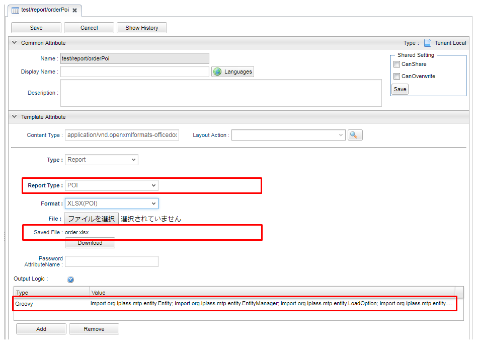
+
OutputLogicの実装
+
[source,groovy]
----
import org.iplass.mtp.entity.Entity;
import org.iplass.mtp.entity.EntityManager;
import org.iplass.mtp.entity.LoadOption;
import org.iplass.mtp.entity.SearchResult;
import org.iplass.mtp.entity.query.Query;
import org.iplass.mtp.entity.query.condition.predicate.Equals;

def sheet = book.getSheet("order");
String oid = context.getParam("oid");

int rowNo = 1;
def row = sheet.getRow(rowNo);
row.getCell(4).setCellValue(oid);

EntityManager em = manager(EntityManager.class);
// Order検索(OrderItemは別で取得するのでReferenceは取得しない)
Entity order = em.load(oid, "test.report.Order", new LoadOption(false, false));

rowNo = 5;
row = sheet.getRow(rowNo);
row.getCell(0).setCellValue(order.orderNo);
row.getCell(1).setCellValue(order.customer);
row.getCell(2).setCellValue(order.address);
row.getCell(3).setCellValue(order.mail);
row.getCell(4).setCellValue(order.tel);

// OrderItem検索
Query query = new Query().select("price", "quantity", "product.name", "product.price")
		.from("test.report.OrderItem").where(new Equals("order.oid", oid));
SearchResult<Entity> orderItems = em.searchEntity(query);

rowNo = 9;
for (Entity item : orderItems.getList()) {
	row = sheet.getRow(rowNo);
	row.getCell(0).setCellValue(item.product.name);
	row.getCell(2).setCellValue(item.quantity);
	row.getCell(3).setCellValue(item.product.price);
	row.getCell(4).setCellValue(item.price);
	rowNo++;
}
----

* Action
+
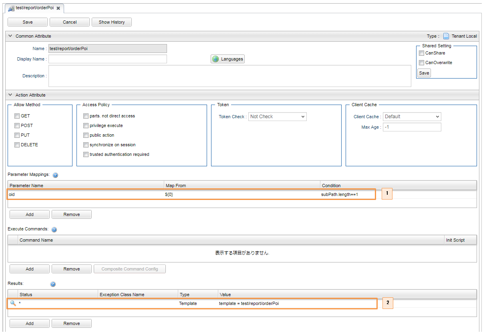

. 今回はParameterMappingsを利用し、パスから `oid` を取得します。
. 作成した帳票出力Template定義。

管理画面にログインし、以下のURLにアクセスすると、帳票出力処理が実行されます。 +
[source,url]
----
http://hostname:port/{コンテキストパス}/{テナント名}/test/report/orderPoi/xxx
----

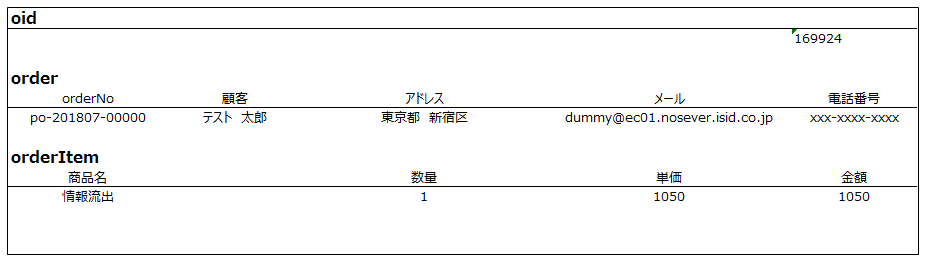
