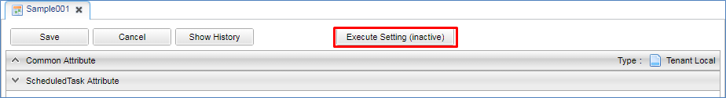
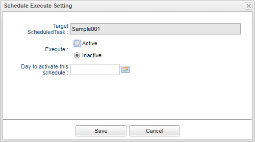

[[schedule]]
= スケジューラ
:_hreflang-path: developerguide/schedule/index.html
:_relative-root-path: ../../
:_menu-title-ee-only: true

== スケジューラ
CommandやWorkflowの処理をスケジュール設定(日時や周期など)して実行する機能です。

=== スケジュールの作成
ScheduleTaskアイコンを右クリックして `ScheduleTaskを作成する` を選択してください。
実行するタスクのType（Command/Workflow）を選択してください。

=== 設定
==== Execute Settings
タスクの実行に関する設定です。
[cols="1,3a", options="header"]
|===
|項目
|内容

|Execute User Expression Type
|タスクを実行するユーザーを定義する方法を設定します。
以下の中から選択します。

NONE:: ユーザー未指定（システムユーザーとして特権で実行されます）
BY_SCRIPT:: Scriptの戻り値としてユーザーID（String）を返してください。
BY_SQL:: User Entityに対するWhere条件を指定してください。
BY_STRING:: GroovyTemplateとして、ユーザーIDを指定してください。

|Execute User Expression
|Execute User Expression Typeにあわせて入力します。

|Queue Name
|タスクをプールするキューを指定します。
未指定の場合はデフォルトキューを利用します。

選択可能なQueue Nameは<<../../serviceconfig/index.adoc#RdbQueueService,RdbQueueService>>の `queue` に設定された値になります。
`useQueue` がfalseの場合は表示されません。

|Exception Handling Mode
|タスクの処理中に例外が発生した場合の挙動を指定するモードです。
以下の3つから選択します。

RESTART:: 非同期コマンドの処理をロールバックした後に再実行します。
ABORT:: 非同期コマンドの処理を中断します。
ABORT_LOG_FATAL:: 非同期コマンドの処理を中断し、FATALとしてログ出力します。

|History Logging
|タスク実行をログに出力するかを指定します。
チェックを入れるとログ出力します。
|===

==== Schedule Type Settings
タスク実行のタイミングに関する設定です。

.Schedule Type
タスクを実行するスケジュールを設定します。
選択内容に合わせて設定する内容が変わります。

Cron Expression:: タスクの実行タイミングをCron書式で指定します。
+
.設定可能な書式の説明
[cols="1,1,1,1", options="header"]
|===
|フィールド|必須|値|特殊文字
|秒|○|0-59|, - * /
|分|○|0-59|, - * /
|時|○|0-23|, - * /
|日|○|1-31|, - * ? / L W
|月|○|1-12 or JAN-DEC|, - * /
|曜日|○|1-7 or SUN-SAT|, - * ? / L #
|年||1970-2099|, - * /
|===
+
.特殊文字の説明
[cols="1,3", options="header"]
|===
|特殊文字|説明
|,|複数の値を指定する場合利用します。 +
例：0,12
|-|範囲を指定する場合利用します。 +
例：MON-FRI
|*|すべての値を表します。
|/|増分値を指定する場合利用します。 +
例：0/15
|?|任意の値を表します。
日と曜日は同時に指定できません。
日を指定した場合、曜日には?を指定します。
|L|月に指定された場合、月末を表します。
曜日に指定された場合土曜日を表します。
|W|平日を表します。
15Wと指定した場合、15日に一番近い平日を示します。
LWとした場合、月末に一番近い平日を示します。
|#|その月の第～曜日を示します。
例えば6#3は第3金曜日（※金曜日=6）を示します。
|===
+
以下、記述例になります。
+
----
0 0 * * * ? : 毎時に実行
0 0/30 * * * ? : 30分毎に実行
0 0 7-9 * * ? : 毎日の7,8,9時に実行
0 0 18 ? * MON-FRI : 月～金の18時に実行
0 15 10 * * ? 2018 : 2018年の間、毎日 10時15分に実行
----
Custom Script:: 次回の実行日時をGroovyScriptを利用して指定します。
タスク実行の都度、設定されたScriptが呼び出されるので、次回の実行日時をjava.util.Date形式もしくはUTCのlongのミリ秒値で返却するように実装します。
以下の変数がバインドされます。
+
----
scheduledTime ・・・ 今回実行したタスクのスケジュールされた日時
actualStartTime ・・・ 今回実行したタスクが実際に実行開始された日時
actualEndTime ・・・ 今回実行したタスクが実際に実行完了した日時
----
Fixed Delay:: 次回実行時間を遅延時間として指定します。
+
[cols="1,3a", options="header"]
|===
|項目
|内容

|Time Unit
|Fixed Delay Periodに指定する時間の単位を以下から選択します。
----
SECONDS ・・・ 秒単位
MINUTES ・・・ 分単位
HOURS ・・・ 時間単位
DAYS ・・・ 日単位
----

|Fixed Delay Period
|遅延時間をTime Unitで選択した単位に従い設定します。
|===

Fixed Rate:: 次回実行時間までの間隔を指定します。
+
[cols="1,3a", options="header"]
|===
|項目
|内容

|Time Unit
|Fixed Rate Periodに指定する時間の単位を以下から選択します。
----
SECONDS ・・・ 秒単位
MINUTES ・・・ 分単位
HOURS ・・・ 時間単位
DAYS ・・・ 日単位
----

|Fixed Rate Period
|時間間隔をTime Unitで選択した単位に従い設定します。
|===

==== Task Type Settings
実行するタスクの内容に関する設定です。

[cols="1,3a", options="header"]
|===
|項目
|内容

|Task Type
|実行するタスクの種類を設定します。
CommandまたはWorkflowを実行することができます。
Command、Workflowにはタスクの実行時間がバインドされます。

Command:: RequestContextのAttributeに `ScheduledTaskRequestConstants.SCHEDULED_TIME` で設定されます。
Workflow:: 開始パラメータとして `ScheduledTaskRequestConstants.SCHEDULED_TIME` で設定されます。

org.iplass.mtp.scheduling.ScheduledTaskRequestConstant

|Execute Commands
|Task TypeがCommandの場合に設定します。
実行するコマンドを選択します。

|Workflow
|Task TypeがWorkflowの場合に設定します。
実行するWorkflowを選択します。

|Start Parameter Script
|Task TypeがWorkflowの場合に設定します。
Workflowの開始時のパラメータを指定することができます。
startParamMapとしてバインドされているマップにパラメータを指定してください。
|===

==== RdbQueueService
スケジュール機能を利用する場合、RdbQueueServiceのuseQueueをtrueにする必要があります。
詳細は<<../../serviceconfig/index.adoc#RdbQueueService,RdbQueueService>>を参照してください。

=== 利用方法
==== スケジュールの実行設定
スケジュールの作成を終えただけでは実際に実行されません。
以下の設定を行う事で実際にスケジュールに従って実行されるようになります。

[cols="1,3a", options="header"]
|===
|項目|内容
|Execute
|Active、Inactiveから選択します。
Activeを選択しないとスケジュールは実行されません。

|Day to activate this schedule
|スケジュール設定の有効開始日を設定します。
日付未指定の場合は現在時刻で設定されます。
また、日付を設定し再度開いても初回実行日付は再表示されません。
|===

Active設定後は指定されたQueueへ実行の予約を行います。
この予約情報はサーバが停止されても保持されます。
サーバ起動後に実行予定日時を超過している予約情報があった場合、それらは時間外でも実行対象となります。

[[executestatus]]
==== 実行状況の確認
AdminConsoleのToolsに用意されているQueueExplorerを利用することで、予約されたタスクや実行済みのタスク等の状況を確認することが出来ます。
詳細は<<../support/index.adoc#tools_queueexplorer,QueueExplorer>>を参照してください。

