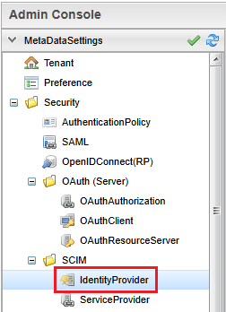
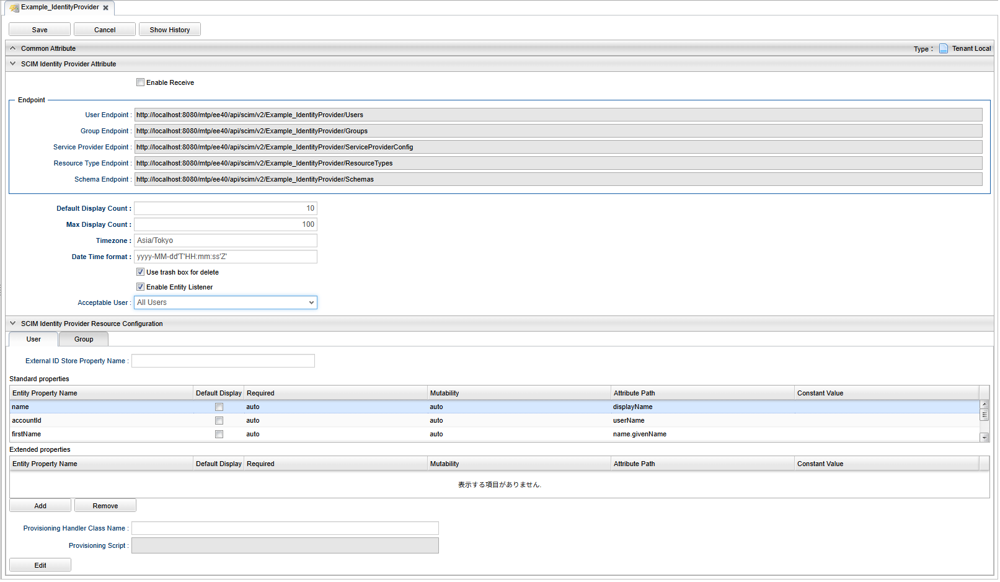

[[scim_idp]]
== Identity Provider 機能

Identity Provider 機能では外部のサービスからユーザー・グループ情報の更新を受け付けます。 +
WebAPI でリクエストを受信し、受信したリクエストに基づいてユーザー・グループ情報の登録、更新、削除を行います。

.SCIM Identity Provider 機能概要図
image::./images/scim_idp.svg[]
① 外部サービスがSCIMリクエストを送信 +
② WebAPI でリクエストを受信 +
③ リクエストの内容に沿ってユーザー・グループ情報の登録、更新、削除

[[scim_idp_configure]]
=== 設定

Identity Provider 機能を利用するためには、以下の設定が必要となります。 +

. <<scim_idp_configure_service_config>>
. <<scim_idp_configure_metadata>>: <<scim_idp_configure_metadata_scim_idp>>
. <<scim_idp_configure_auth>>

[[scim_idp_configure_service_config]]
==== Service-Config
. ScimIdentityProviderService の設定
.. Identity Provider 機能の動作を設定します。設定の詳細については link:../../serviceconfig/index.html#ScimIdentityProviderService[設定（service-config）リファレンス^] を参照してください。

[[scim_idp_configure_metadata]]
==== メタデータ
メタデータは Admin Console で作成します。

[[scim_idp_configure_metadata_scim_idp]]
===== Security/SCIM/IdentityProvider
Identity Provider 機能のメタデータは Admin Console メニューの `Security > SCIM > Identity Provider` から作成します。

.Admin Console メニュー（IdentityProvider）

設定画面は、全体設定、リソース設定、リソースプロパティ設定から構成されます。

.全体設定
Identity Provider 機能全体の機能の振る舞いを設定します。

.リソース設定
リソースタイプに関する振る舞いを設定します。
以下のタブが存在しており、それぞれの設定項目は同じです。

* User タブ
** User エンドポイントにリクエストされたときの動作を設定します。
** mtp.auth.User エンティティに対応します。
* Group タブ
** Group エンドポイントにリクエストされたときの動作を設定します。
** mtp.auth.Group エンティティに対応します。

.リソースプロパティ設定
リソースのプロパティに関する設定を行います。 +
受け付けたリクエストの本文を、該当するエンティティに変換する際の設定を行います。

[[scim_idp_configure_metadata_scim_idp_attribute]]
.Section: SCIM Identity Provider Attribute（全体設定）
[cols="2,5", options="header"]
|===
|設定項目
|説明

|Enable Receive
|チェックすることで Identity Provider 機能が有効になり、外部サービスからのリクエストを受信が可能となります。

|Endpoint
|User, Group などのリクエストを受信するエンドポイントとなります。表示のみの項目です。

|Default Display Count
|一度に表示するデータの件数のデフォルト値を設定します。初期値は 10 が設定されます。

|Max Display Count
|一度に表示するデータの件数の最大値を設定します。初期値は 100 が設定されます。

|Timezone
|日時データをUTCフォーマットに変更する際のタイムゾーンを指定します。初期値はシステムのタイムゾーンが設定されます。

|Date Time format
|日時データのフォーマットを指定します。初期値は `yyyy-MM-dd'T'HH:mm:ss.SSSZ` が設定されます。

|Use trashbox for delete
|削除リクエストを受け付けた際に、データ削除時にゴミ箱を利用するか設定します。チェックすることでゴミ箱を利用します。

|Enable Entity Listener
|エンティティにレコードの登録・更新・削除を行った際に、当該エンティティに設定されているリスナーを有効にするか設定します。チェックすることでレコードの更新がリスナーに通知されます。

|Acceptable User
|レコード更新操作を行うユーザーを指定します。指定したユーザーのみがレコードの更新操作を行うことができます。特に指定しない場合は `All Users` を設定してください。
|===

.Section: SCIM Identity Provider Resource Configuration（リソース設定）
[cols="2,5", options="header"]
|===
|設定項目
|説明

|External ID Store Property Name
|SCIM リクエストを受信した際、リクエストに含まれる外部 ID を保持するプロパティを指定します。

|Standard properties
a|mtp.auth.User, mtp.auth.Group エンティティの標準的なプロパティを設定します。プロパティの設定項目については、<<scim_idp_configure_metadata_scim_idp_resource_properties>> を参照してください。 +
ここに設定される行はエンティティに定義されている標準的なプロパティのため、Entity Property Name の変更、行の削除はできません。 +
独自に追加したプロパティは、Extended properties に設定します。

SCIM 2.0 のスキーマ仕様については、以下をご確認ください。

- link:https://www.rfc-editor.org/rfc/rfc7643.html#section-3[RFC7643 - SCIM Resources^]
- link:https://www.rfc-editor.org/rfc/rfc7643.html#section-4.1[RFC7643 - "User" Resource Schema^]
- link:https://www.rfc-editor.org/rfc/rfc7643.html#section-4.2[RFC7643 - "Group" Resource Schema^]

|Extended properties
a|mtp.auth.User, mtp.auth.Group エンティティで独自に追加したプロパティを設定します。プロパティの設定項目については、<<scim_idp_configure_metadata_scim_idp_resource_properties>> を参照してください。 +
グリッド下部の `Add` ボタンで行を追加、 `Remove` ボタンで選択行を削除します。

SCIM 2.0 のスキーマ仕様については、以下をご確認ください。

- link:https://www.rfc-editor.org/rfc/rfc7643.html#section-3[RFC7643 - SCIM Resources^]
- link:https://www.rfc-editor.org/rfc/rfc7643.html#section-4.1[RFC7643 - "User" Resource Schema^]
- link:https://www.rfc-editor.org/rfc/rfc7643.html#section-4.2[RFC7643 - "Group" Resource Schema^]

|Provisioning Handler Class Name
|リクエストによってレコード登録・更新・削除を行う前に、リソース設定によって作成されたエンティティ情報の更新や、拡張操作を実現するための完全修飾クラス名を指定します。 +
設定するクラスは `org.iplass.mtp.webapi.scim.ScimProvisioningHandler` を実装する必要があります。

|Provisioning Script
|リクエストによってレコード登録・更新・削除を行う前に、リソース設定によって作成されたエンティティ情報の更新や、拡張操作を実現するためのスクリプトを指定します。 +
スクリプトは Groovy 言語で記述します。 Provisioning Handler Class name と同時に設定された場合は、スクリプトが優先されます。
|===

[[scim_idp_configure_metadata_scim_idp_resource_properties]]
.Section: SCIM Identity Provider Resource Configuration（リソースプロパティ設定）
[cols="2,5", options="header"]
|===
|設定項目
|説明

|Entity Property Name
|mtp.auth.User, mtp.auth.Group エンティティのプロパティ名を設定します。

|Default Display
|検索リクエストされた際に、レスポンスに当該プロパティの値をデフォルトで含める場合にチェックを入れます。 +
チェックが無い場合は、リクエストのクエリパラメータ attributes に属性が設定された場合に表示されます。

|Required
a|SCIM スキーマの属性の必須を設定します。 選択可能な値は以下の通りです。

// nest table start
[cols="2,5" options="header"]
!===
!設定値
!説明

!`auto`
!エンティティのプロパティ定義を確認し、自動で設定します。

!`required`
!属性値は必須です。

!`optional`
!属性値は任意です。
!===
// nest table end

|Mutability
a|SCIM スキーマ属性の可変性を設定します。選択可能な値と設定した値の動作は以下の通りです。

// nest table start
[cols="2,5,1,1,1,1" options="header"]
!===
!設定値
!説明
!読み取り
!新規登録
!更新 +
（null +
-> 有効値）
!更新 +
（有効値 +
-> 有効値）

! `auto`
! エンティティのプロパティ定義を確認し、自動で設定します。
!-
!-
!-
!-

! `readOnly`
!読み取り専用です。
!〇
!〇
!×
!×

! `readWrite`
!読み書き可能です。
!〇
!〇
!〇
!〇

!`immutable`
!値が存在している場合は、変更することはできません。
!〇
!〇
!〇
!×

!`writeOnly`
!書き込み専用です。
!×
!〇
!〇
!〇
!===
// nest table end

|Attribute Path
a|SCIM スキーマの属性のパスを設定します。属性パスには以下のようなパターンのパスが指定できます。

// nest table start
[cols="2,5" options="header"]
!===
!設定パターン
!設定例

!通常属性
!`name`

!サブパス
!`name.familyName`

!配列（通常）
!`emails[0].value`

!配列（条件）
!`emails[type eq "work"].value`
!===
// nest table end

CAUTION: 配列（条件）のオペレータは `eq` のみサポートします。`and`, `or` など他のオペレータはサポートしていません。

|Constant Value
|プロパティに値が無い場合、Entity Property Name の設定が無い場合に設定される固定値を指定します。
|===

.SCIM/IdentityProvider設定画面

[[scim_idp_configure_auth]]
==== 認証設定
リクエストを受け付けるための認証設定が必要となります。以下の認証方法をサポートしています。

.個人アクセストークン（Bearer トークンによる認証）
link:../genericentitymanager/topview/index.html#_アプリの管理[GEM(TopView) - アプリの管理^] を参照し個人アクセストークンを発行してください。 +
発行した個人アクセストークンは、リクエストヘッダーの `Authorization` に `Bearer` トークンとして設定してください。

.BASIC認証
service-config の設定を行い、BASIC認証を有効化する必要があります。 +
設定方法については link:../../serviceconfig/index.html#IdPasswordAutoLoginHandler[AuthService - IdPasswordAutoLoginHandler^] を参照してください。

[[scim_idp_usage]]
=== 利用方法

[[scim_idp_usage_endpoint]]
==== エンドポイント

メタデータを作成することで、エンドポイントが作成されます。 +
エンドポイントのベースは以下のようになります。

(http{vbar}https)://<host><:port>/<context>/<tenant>/api/scim/v2/<metaName>

.構成要素の説明
- <host>: ホスト名
- <:port>: ポート番号 (省略可能)
- <context>: アプリケーションコンテキスト。サーバー構築時の設定により異なります。
- <tenant>: テナント名。テナント構築時に設定したテナント名を指定します。
- <metaName>: Identity Provider メタデータ作成時の名前を指定します。

URL 例： `https://example.com/iplass/tenant/api/scim/v2/idpMetaName/`

リソースタイプに応じたエンドポイントは以下のような形式となります。

.エンドポイントの説明
[cols="1,4,1,2", options="header"]
|===
|リソースタイプ
|URL
|対応メソッド
|説明

|User
|(http{vbar}https)://<host><:port>/<context>/<tenant>/api/scim/v2/<metaName>/Users
|GET, POST, PUT, DELETE
|ユーザーリソースを操作します。

|Group
|(http{vbar}https)://<host><:port>/<context>/<tenant>/api/scim/v2/<metaName>/Groups
|GET, POST, PUT, DELETE
|グループリソースを操作します。

|ServiceProviderConfig
|(http{vbar}https)://<host><:port>/<context>/<tenant>/api/scim/v2/<metaName>/ServiceProviderConfig
|GET
|利用可能なSCIM仕様機能を取得します。

|Schema
|(http{vbar}https)://<host><:port>/<context>/<tenant>/api/scim/v2/<metaName>/Schemas
|GET
|サポートするリソーススキーマに関する情報を取得します。

|ResourceType
|(http{vbar}https)://<host><:port>/<context>/<tenant>/api/scim/v2/<metaName>/ResourceTypes
|GET
|利用可能なリソースのタイプ（ユーザーやグループなど）を検出します。
|===

以下の資料も合わせて確認ください。

- link:https://www.rfc-editor.org/rfc/rfc7644.html#section-3[RFC7644 - SCIM Protocol]
- link:https://www.rfc-editor.org/rfc/rfc7644.html#section-4[RFC7644 - Service Provider Configuration Endpoints]

[CAUTION]
====
以下の操作はサポートされていません。

- PATCH メソッドを利用した更新
- /bulk エンドポイントを利用した操作
====

[[scim_idp_usage_search]]
==== 検索

ユーザー・グループのリソースエンドポイントに対して GET メソッドを実行することで、情報を取得することができます。 +
検索は、一覧検索と詳細検索があります。

[[scim_idp_usage_search_list]]
===== 一覧検索
リソースエンドポイントに対して GET リクエストを行います。

.リクエスト例
[source,text]
----
GET https://example.com/iplass/tenant/api/scim/v2/idpMetaName/Users
content-type: application/scim+json;charset=UTF-8
 :
 :
----

.レスポンス例
[source,text]
----
HTTP/1.1 200 OK
content-type: application/scim+json;charset=UTF-8
 :
 :

{
    "schemas": [
        "urn:ietf:params:scim:api:messages:2.0:ListResponse"
    ],
    "totalResults": 100,
    "resources": [
        {
            "id": "1"
        },
        :
        :
        :
        {
            "id": "99999"
        }
    ]
}
----

一覧検索では、検索オプションを設定することができます。 +
検索オプションは、クエリパラメータとしてリクエストに含めます。

[[scim_idp_usage_search_list_option]]
.検索オプション
[cols="1,4,2", options="header"]
|===
|オプション名
|説明
|クエリーパラメータ例

|filter
a|検索時の条件を設定します。左辺はSCIMスキーマの属性名を設定します。右辺は属性に対応する値をダブルクオートで囲み設定します。

CAUTION: 検索条件オペレータは `eq` のみサポートしています。`and`, `or` など他のオペレータはサポートしていません。
|`?filter=name.familyName eq "ユーザー"`

|sortBy
|ソート列を指定します。条件にはSCIMスキーマの属性名を１つだけ設定します。未設定の場合は id 属性でソートされます。
|`?sortBy=userName`

|sortOrder
|ソート順を指定します。昇順は `ascending` 、降順は `descending` を設定します。未設定の場合は昇順でソートされます。 +
本オプションは sortBy と合わせて設定してください。
|`?sortBy=userName&sortOrder=descending`

|startIndex 
|一覧取得時の開始位置を指定します。1から始まる整数値を設定してください。未設定の場合は先頭(1)から取得します。
|`?startIndex=1`

|count
|一覧取得時の取得件数を指定します。1から始まる整数値を設定してください。 +
未設定時には <<scim_idp_configure_metadata_scim_idp_attribute>> の Default Display Count で設定した件数が表示されます。
<<scim_idp_configure_metadata_scim_idp_attribute>> の Max Display Count で設定した件数を超える値は設定できません。 +
本オプションを startIndex と合わせて設定することでページネーションできます。
|`?startIndex=401&count=200`

|attributes
|一覧に表示する属性を指定します。<<scim_idp_configure_metadata_scim_idp_resource_properties>> の Mutability が writeOnly もしくは auto で writeOnly に設定される属性を表示することはできません。
attributes は複数の値を設定することができます。複数値を設定する場合は、カンマ区切りで複数指定してください。
|`?attributes=userName,displayName`

|excludedAttributes
|一覧から除外する属性を指定します。常に表示する属性（id など）は除外できません。
excludedAttributes は複数の値を設定することができます。複数値を設定する場合は、カンマ区切りで複数指定してください。
|`?excludedAttributes=userName,displayName`
|===

.リクエスト例
[source,text]
----
GET https://example.com/iplass/tenant/api/scim/v2/idpMetaName/Users?sortBy=userName&sortOrder=descending&startIndex=2&count=10&attributes=userName,displayName
content-type: application/scim+json;charset=UTF-8
 :
 :
----

.レスポンス例
[source,text]
----
HTTP/1.1 200 OK
content-type: application/scim+json;charset=UTF-8
 :
 :

{
    "schemas": [
        "urn:ietf:params:scim:api:messages:2.0:ListResponse"
    ],
    "totalResults": 100,
    "itemsPerPage": 10,
    "startIndex": 2,
    "resources": [
        {
            "displayName": "ユーザー ネーム９９９９８",
            "id": "99998",
            "userName": "username99998"
        },
        :
        :
        :
        {
            "displayName": "ユーザー ネーム１",
            "id": "1",
            "userName": "username1"
        }
    ]
}
----

リソースの検索エンドポイントに POST リクエストすることでも検索が可能です。 +
検索エンドポイントは `/.search` をリソースエンドポイントに追加します。 +
検索エンドポイントを利用する場合は、検索オプションは JSON をボディとしてリクエストに含めます。 +
検索オプションの内容は、上記の<<scim_idp_usage_search_list_option>>と同様です。

.リクエスト例（上述のリクエスト例と同等のリクエスト）
[source,text]
----
POST https://example.com/iplass/tenant/api/scim/v2/idpMetaName/Users/.search
content-type: application/scim+json;charset=UTF-8
 :
 :

{
    "schemas": [
        "urn:ietf:params:scim:api:messages:2.0:SearchRequest"
    ],
    "sortBy": "userName",
    "sortOrder": "descending",
    "startIndex": 2,
    "count": 10,
    "attributes": ["userName", "displayName"]
}
----

.詳細検索
リソースエンドポイントに続けて、末尾に id を指定して GET リクエストを行います。

.リクエスト例
[source,text]
----
GET https://example.com/iplass/tenant/api/scim/v2/idpMetaName/Users/1
content-type: application/scim+json;charset=UTF-8
 :
 :
----

.レスポンス例
[source,text]
----
HTTP/1.1 200 OK
content-type: application/scim+json;charset=UTF-8
 :
 :

{
    "schemas": [
        "urn:ietf:params:scim:schemas:core:2.0:User"
    ],
    "id": "1",
    "userName": "username1",
    "displayName": "ユーザー ネーム１",
    "name": {
        "givenName": "ネーム１",
        "familyName": "ユーザー"
    },
    "emails": [
        {
            "type": "work",
            "value": "username1@example.com"
        }
    ],
    "meta": {
        "resourceType": "User",
        "created": "2025-02-13T12:25:02Z",
        "lastModified": "2025-02-13T12:25:02Z",
        "location": "https://example.com/iplass/tenant/api/scim/v2/idpMetaName/Users/1"
    }
}
----

==== 登録
ユーザー・グループのリソースエンドポイントに対して POST メソッドを実行することで、登録することができます。 +

.リクエスト例
[source,text]
----
POST https://example.com/iplass/tenant/api/scim/v2/idpMetaName/Users
content-type: application/scim+json;charset=UTF-8
 :
 :

{
    "schemas": [
        "urn:ietf:params:scim:schemas:core:2.0:User"
    ],
    "externalId": "XXX",
    "userName": "usernameXXX",
    "displayName": "ユーザー ネームＸＸＸ",
    "name": {
        "givenName": "ネームＸＸＸ",
        "familyName": "ユーザー"
    },
    "emails": [
        {
            "type": "work",
            "value": "usernameXXX@example.com"
        }
    ]
}
----

.レスポンス例
[source,text]
----
HTTP/1.1 201 Created
content-type: application/scim+json;charset=UTF-8
 :
 :

{
    "schemas": [
        "urn:ietf:params:scim:schemas:core:2.0:User"
    ],
    "id": "10321",
    "externalId": "XXX",
    "userName": "usernameXXX",
    "displayName": "ユーザー ネームＸＸＸ",
    "name": {
        "givenName": "ネームＸＸＸ",
        "familyName": "ユーザー"
    },
    "emails": [
        {
            "type": "work",
            "value": "usernameXXX@example.com"
        }
    ],
    "meta": {
        "resourceType": "User",
        "created": "2025-03-14T09:03:44Z",
        "lastModified": "2025-03-14T09:03:44Z",
        "location": "https://example.com/iplass/tenant/api/scim/v2/idpMetaName/Users/10321"
    }
}
----

==== 更新
ユーザー・グループのリソースエンドポイントの末尾に id 属性の値を設定し、PUT メソッドを実行することで、削除することができます。 +

.リクエスト例
[source,text]
----
PUT https://example.com/iplass/tenant/api/scim/v2/idpMetaName/Users/10321
content-type: application/scim+json;charset=UTF-8
 :
 :

{
    "schemas": [
        "urn:ietf:params:scim:schemas:core:2.0:User"
    ],
    "id": "10321",
    "externalId": "XXX",
    "userName": "usernameXXX",
    "displayName": "利用者 名前ＸＸＸ",
    "name": {
        "givenName": "名前ＸＸＸ",
        "familyName": "利用者"
    },
    "emails": [
        {
            "type": "work",
            "value": "usernameXXX@example.com"
        }
    ]
}
----

.レスポンス例
[source,text]
----
HTTP/1.1 201 Created
content-type: application/scim+json;charset=UTF-8
 :
 :

{
    "schemas": [
        "urn:ietf:params:scim:schemas:core:2.0:User"
    ],
    "id": "10321",
    "externalId": "XXX",
    "userName": "usernameXXX",
    "displayName": "利用者 名前ＸＸＸ",
    "name": {
        "givenName": "名前ＸＸＸ",
        "familyName": "利用者"
    },
    "emails": [
        {
            "type": "work",
            "value": "usernameXXX@example.com"
        }
    ],
    "meta": {
        "resourceType": "User",
        "created": "2025-03-14T09:03:44Z",
        "lastModified": "2025-03-14T12:55:20Z",
        "location": "https://example.com/iplass/tenant/api/scim/v2/idpMetaName/Users/10321"
    }
}
----

==== 削除
ユーザー・グループのリソースエンドポイントの末尾に id 属性の値を設定し、DELETE メソッドを実行することで、削除することができます。 +

.リクエスト例
[source,text]
----
DELETE https://example.com/iplass/tenant/api/scim/v2/idpMetaName/Users/10321
content-type: application/scim+json
 :
 :
----

.レスポンス例
[source,text]
----
HTTP/1.1 204 No Content
content-type: application/scim+json
 :
 :
----
