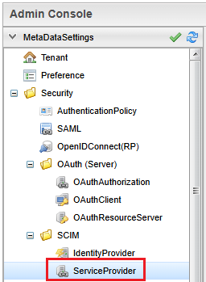

[[scim_sp]]
== Service Provider 機能

Service Provider 機能では当システムのユーザー・グループ情報の更新を外部サーバーへ連携します。 +
変更した情報をサーバー内で記録しておき、定期的に外部サービスへリクエストを送信します。

.SCIM Service Provider 機能概要図
image::./images/scim_sp.svg[]
① ユーザー・グループ情報の変更を記録する +
② 記録された変更情報を確認し、変更情報が処理する +
③ 変更情報に従って外部サービスへリクエストする

[[scim_sp_configure]]
=== 設定

Service Provider 機能を利用するためには、以下の設定が必要となります。 +

. <<scim_sp_configure_service_config>>
. <<scim_sp_configure_metadata>>: <<scim_sp_configure_metadata_scim_sp>>
. <<scim_sp_configure_metadata>>: <<scim_sp_configure_metadata_entity_event_listener>>
. <<scim_sp_configure_metadata>>: <<scim_sp_configure_metadata_scheduled_task>>

[[scim_sp_configure_service_config]]
==== Service-Config
. ScimServiceProviderService の設定
.. Service Provider 機能の動作を設定します。設定の詳細については link:../../serviceconfig/index.html#ScimServiceProviderService[設定（service-config）リファレンス^] を参照してください。
. スケジューラの有効化
.. 配信機能は link:../schedule/index.html[スケジューラ^] を利用します。スケジューラの機能を有効化するために link:../../serviceconfig/index.html#RdbQueueService[RdbQueueService^] の useQueue を true にする必要があります。

[[scim_sp_configure_metadata]]
==== メタデータ

[[scim_sp_configure_metadata_scim_sp]]
===== Security/SCIM/ServiceProvider
Service Provider 機能のメタデータは Admin Console メニューの `Security > SCIM > Service Provider` から作成します。

.Admin Console メニュー（ServiceProvider）

設定画面は、全体設定、リソース設定、リソースプロパティ設定から構成されます。

.全体設定
Service Provider 機能全体の機能の振る舞いを設定します。

.リソース設定
リソースタイプに関する振る舞いを設定します。
以下のタブが存在しており、それぞれの設定項目は同じです。

* User タブ
** User リソースに対応するエンティティが更新された際の動作を設定します。
* Group タブ
** Group リソースに対応するエンティティが更新された際の動作を設定します。

.リソースプロパティ設定
リソースのプロパティに関する設定を行います。 +
エンティティが更新された場合に、SCIM サービスプロバイダへリクエストへ変換する際の設定を行います。

[[scim_sp_configure_metadata_scim_sp_configure_metadata_attribute]]
.Section: SCIM Service Provider Attribute（全体設定）
[cols="2,5", options="header"]
|===
|設定項目
|説明

|Endpoint URL without Resource Type
|SCIM リクエストを行うURLを設定します。設定するURLには、リソースタイプを含めない形式で設定します。

ユーザーリソースエンドポイントが、 `https://example.com/scim/v2/Users` の場合、 `https://example.com/scim/v2/` を設定します。

|Authorization Type
a|エンドポイントへリクエストを行う際の認可設定を行います。選択可能な値は以下の通りです。

// nest table start
[cols="2,3,2" options="header"]
!===
!設定値
!説明
!選択時の入力項目説明

!OAuth Bearer
!Authorization ヘッダーに Bearer トークンを設定します。
!<<scim_sp_configure_metadata_attribute_authorization_oauth_bearer>>

!OAuth 2.0 Client Credentials
!Client Credentials Flow で認可を行います。
!<<scim_sp_configure_metadata_attribute_authorization_oauth_20_client_credentials>>

!HTTP Basic
!BASIC 認証を行います。
!<<scim_sp_configure_metadata_attribute_authorization_http_basic>>

!Custom
!任意のカスタム処理を行います。
!<<scim_sp_configure_metadata_attribute_authorization_custom>>
!===
// nest table end

|Timezone
|日時データをUTCフォーマットに変更する際のタイムゾーンを指定します。初期値はシステムのタイムゾーンが設定されます。

|Date Time format
|日時データのフォーマットを指定します。初期値は `yyyy-MM-dd'T'HH:mm:ss.SSSZ` が設定されます。

|Request Interval(millis)
|バックグラウンドでリクエストを実行する際に、リクエストを実行する間隔を指定します。単位はミリ秒です。初期値は 150(ミリ秒) が設定されます。

|Maintenance Retention Period(days)
|配信時のエンティティメッセージの経過期間を指定します。指定された期間を過ぎた場合にエンティティに登録されているデータを消します。単位は日です。初期値は 90(日) が設定されます。
|===

[[scim_sp_configure_metadata_attribute_authorization_oauth_bearer]]
.Section: SCIM Service Provider Attribute（全体設定 OAuth Bearer 選択時の入力項目）
[cols="2,5", options="header"]
|===
|設定項目
|説明

|Bearer Token
|Authorization ヘッダーに設定するアクセストークンを設定します。エンドポイントから指定された値を設定してください。
|===

[[scim_sp_configure_metadata_attribute_authorization_oauth_20_client_credentials]]
.Section: SCIM Service Provider Attribute（全体設定 OAuth 2.0 Client Credentials 選択時の入力項目）
[cols="2,5", options="header"]
|===
|設定項目
|説明

|Token Endpoint
|Client Credentials Flow でアクセストークンを取得する為のエンドポイントを設定します。

|Client ID
|Client Credentials Flow の client_id パラメータに設定する値です。トークン取得先から発行された値を設定します。

|Client Secret
|Client Credentials Flow の client_secret パラメータに設定する値です。トークン取得先から発行された値を設定します。

|Token Refresh Interval(minute)
|トークンを再取得するまでの間隔を指定します。単位は分です。
|===

[[scim_sp_configure_metadata_attribute_authorization_http_basic]]
.Section: SCIM Service Provider Attribute（全体設定 HTTP Basic 選択時の入力項目）
[cols="2,5", options="header"]
|===
|設定項目
|説明

|User ID
|ベーシック認証で利用するユーザーIDを設定します。

|Password
|ベーシック認証で利用するパスワードを設定します。
|===

[[scim_sp_configure_metadata_attribute_authorization_custom]]
.Section: SCIM Service Provider Attribute（全体設定 Custom 選択時の入力項目）
[cols="2,5", options="header"]
|===
|設定項目
|説明

|Class Name
|カスタム処理を実装した完全修飾クラス名を設定します。クラスは `org.iplass.mtp.webapi.scim.ScimAuthorizationApplier` を実装する必要があります。 +
パラメータ、シークレットを受け付ける必要がある場合、 `org.iplass.mtp.webapi.scim.ScimAuthorizationApplierParameterAware` を実装してください。

|Parameter
|Class Name に設定したクラスの初期化に利用されるパラメータを設定します。

|Secret
|Class Name に設定したクラスの初期化に利用されるシークレットを設定します。
|===

[[scim_sp_configure_metadata_scim_sp_configure_metadata_resource]]
.Section: SCIM Service Provider Resource Configuration（リソース設定）
[cols="2,5", options="header"]
|===
|設定項目
|説明

|Enable Distribute
|チェックすることで、Entity Definition Name に設定したエンティティを更新した際に、サービスプロバイダへリクエストを送信します。 +
サービスプロバイダへリクエストを送信するためには、エンティティリスナーを設定する必要があります。こちらを参照してください。

|Endpoint Path
|<<scim_sp_configure_metadata_scim_sp_configure_metadata_attribute>> の Endpoint URL without Resource Type に続くパスを設定します。 +
初期値として User タブは `/Users` 、 Group タブは `/Groups` が設定されます。

|Resource Schema
|User, Group のリクエスト実行時に、リクエスト本文の `schemas` 属性に設定する値を指定します。 +
初期値として User タブは `urn:ietf:params:scim:schemas:core:2.0:User` 、 Group タブは `urn:ietf:params:scim:schemas:core:2.0:Group` が設定されます。 +
カンマ区切りで複数設定することが可能です。

|Entity Definition Name
|User, Group のリソース変更を検知するエンティティ名を指定します。 +
初期値として User タブは `mtp.auth.User` 、 Group タブは `mtp.auth.Group` が設定されます。 +
指定したエンティティに対して、イベントリスナーを追加する必要があります。詳しくは <<scim_sp_configure_metadata_entity_event_listener>> を参照してください。

|ID Store Property Name
|SCIM 登録リクエストを送信後のレスポンスに含まれる ID を保持するプロパティを指定します。 +
Entity Definition Name で設定したエンティティに独自にプロパティを追加し、追加したプロパティ名を設定してください。

|Update Method
a|エンティティの更新時に、サービスプロバイダへリクエストを送信する方法を指定します。選択可能な値は以下の通りです。

// nest table start
[cols="2,5" options="header"]
!===
!選択値
!説明

!PUT
!Attribute Mapping の設定に従ってリクエスト本文作成し、PUT リクエストを送信します。

!GET_BASE_PUT
!先にサービスプロバイダへ GET リクエストを送信し、取得した情報をベースに PUT リクエストを送信します。 +
エンティティで更新されたプロパティを GET リクエストで取得した情報に適用し、PUT 時のリクエスト本文とします。
!===
// nest table end

CAUTION: PATCH メソッドを利用した更新はサポートしていません。

|Attribute Mapping
a|サービスプロバイダへリクエストを送信する際の、リクエスト本文を作成するための設定を行います。マッピングの設定項目については、<<scim_sp_configure_metadata_scim_sp_configure_metadata_resource_properties>> を参照してください。 +
グリッド下部の `Add` ボタンで行を追加、 `Remove` ボタンで選択行を削除します。 +

SCIM 2.0 のスキーマ仕様については、以下をご確認ください。

- link:https://www.rfc-editor.org/rfc/rfc7643.html#section-3[RFC7643 - SCIM Resources^]
- link:https://www.rfc-editor.org/rfc/rfc7643.html#section-4.1[RFC7643 - "User" Resource Schema^]
- link:https://www.rfc-editor.org/rfc/rfc7643.html#section-4.2[RFC7643 - "Group" Resource Schema^]

|Provisioning Handler Class Name
|エンティティの更新によってサービスプロバイダへ登録・更新・削除のリクエストを行う前に、リソース設定によって作成されたリクエスト本文の更新や、拡張操作を実現するための完全修飾クラス名を指定します。 +
設定するクラスは `org.iplass.mtp.webapi.scim.ScimProvisioningHandler` を実装する必要があります。

|Provisioning Script
|エンティティの更新によってサービスプロバイダへ登録・更新・削除のリクエストを行う前に、リソース設定によって作成されたリクエスト本文の更新や、拡張操作を実現するためのスクリプトを指定します。 +
スクリプトは Groovy 言語で記述します。 Provisioning Handler Class name と同時に設定された場合は、スクリプトが優先されます。
|===

[[scim_sp_configure_metadata_scim_sp_configure_metadata_resource_properties]]
.Section: SCIM Service Provider Resource Configuration（リソースプロパティ設定）
[cols="2,5", options="header"]
|===
|設定項目
|説明

|Attribute Path
a|SCIM スキーマの属性のパスを設定します。属性パスには以下のようなパターンのパスが指定できます。

// nest table start
[cols="2,5" options="header"]
!===
!設定パターン
!設定例

!通常属性
!`name`

!サブパス
!`name.familyName`

!配列（通常）
!`emails[0].value`

!配列（条件）
!`emails[type eq "work"].value`
!===
// nest table end

CAUTION: 配列（条件）のオペレータは `eq` のみサポートします。`and`, `or` など他のオペレータはサポートしていません。

|Entity Property Name
|Entity Definition Name で設定したエンティティのプロパティ名を設定します。

|Constant Value
|プロパティに値が無い場合、Entity Property Name の設定が無い場合に設定される固定値を指定します。

|Value Type
a|Constant Value を利用し、Entity Property Name の指定が無い（常に固定値を設定）する場合、Constant Value のデータ型を設定します。 +
設定可能な値は以下の通りです。

// nest table start
[cols="2,5" options="header"]
!===
!設定値
!説明

!`string`
!Constant Value を文字列として設定します。

!`number`
!Constant Value を数値として設定します。

!`boolean`
!Constant Value を真理値として設定します。
!===
// nest table end
|===

.SCIM/IdentityProvider設定画面

[[scim_sp_configure_metadata_entity_event_listener]]
===== Entity (Event Listener)
<<scim_sp_configure_metadata_scim_sp_configure_metadata_resource>> のメタデータ設定時に User タブ、Group タブで指定したエンティティに対して、イベントリスナーを追加する必要があります。 +
追加するイベントリスナーは JavaClass タイプで、クラス名は `org.iplass.mtp.impl.webapi.scim.distribute.ScimServiceProviderDistributeEntityEventListener` を設定します。

イベントリスナーについては link:../datamanagement/index.html#ref_entity_event_listener[データ管理 - 高度な設定 - EventListener^] を参照してください。

.Entity のイベントリスナー設定画面

[[scim_sp_configure_metadata_scheduled_task]]
===== ScheduledTask
サービスプロバイダへのリクエストを実行するには、スケジューラでタスクを有効化する必要があります。
標準で以下の SCIM 用タスクを提供します。

.mtp.scim.v2.ScimServiceProviderDistributeTask
エンティティの更新内容に沿って、サービスプロバイダへリクエストを送信します。 +
標準タスクでは 60 分間隔でメッセージキューに登録されたメッセージを送信します。

.mtp.scim.v2.ScimServiceProviderMessageMaintenanceTask
配信時のエンティティメッセージの保存期間を超えたメッセージを削除します。 +
標準タスクでは日次で20:00にメンテナンス処理が実行されます。

スケジュールを独自に設定する場合は、標準タスクの設定を修正し保存してください。 +
スケジューラについては link:../schedule/index.html[スケジューラ^] を参照してください。

.標準 SCIM 用タスク

IMPORTANT: <<scim_sp_configure_service_config, Service Provider 機能 - 設定 - Service-Config>> が未設定の場合は、タスクの実行設定ができないのでご注意ください。

[[scim_sp_usage]]
=== 利用方法

==== 情報を更新する

<<scim_sp_configure_metadata_scim_sp_configure_metadata_resource>> の Entity Definition Name で設定したエンティティを更新することで、サービスプロバイダへ送信する為の情報が作成されます。 +
作成された情報をもとに、スケジューラで定期的にサービスプロバイダへリクエストを送信します。

==== リクエストの状況確認

リクエストの状況は Admin Console の `Tools > EntityExplorer > mtp.scim.v2.ScimServiceProviderDistributeTarget` から確認してください。 +
配信状況は distributeState 列の値で確認できます。

.distributeState の状況
[cols="2,5", options="header"]
|===
|値
|説明

|READY
|リクエストを送信する準備ができています。

|IN_PROCESS
|リクエストを送信中です。

|REQUESTED
|完了ステータスです。リクエストを送信が完了しました。

|NOREQUEST
|完了ステータスです。リクエストを送信する必要がありませんでした。

|FAILED
|完了ステータスです。リクエストの送信に失敗しました。
|===
