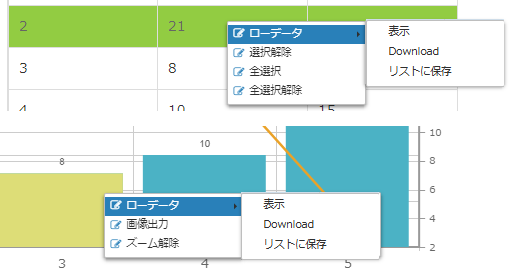

[[operationguide]]
== 操作説明

=== キューブ集計
ユーザー自身が集計の軸や項目を操作して、キューブ（データソース）のデータを自由に集計できる画面です。

.A.アイテム
キューブ集計では `集計軸と集計項目` にアイテムをドラッグ&ドロップすることで、グラフや集計表を作成します。

右上の `+` をクリックすると、 `新しいアイテム` と `新しいフォルダ` を作成できます。
`新しいアイテム` では利用可能なアイテムや関数を組み合わせて独自のアイテムを作成できます。
`新しいフォルダ` では複数のアイテムをグループ化して表示します。
フォルダ自体はドラッグ&ドロップすることはできませんが、日付などのアイテムのように、アイテムの配下にアイテムを持つものはドラッグ&ドロップできます。

詳細については `新しいアイテム` 作成時のダイアログに表示されるヘルプを参照してください。

.B.独自の集計関数
`集計軸と集計項目` にドロップされたアイテムの内、集計項目となるアイテムには、合計や平均といった集計関数が利用できるようになります。
独自の集計関数で演算や関数を利用した式を独自に定義することで、集計項目に集計関数を追加できます。

詳細については `新しい集計関数` 作成時のダイアログに表示されるヘルプを参照してください。

.C.表示設定
グラフや集計表の表示に関する設定です。
`表示方法` を変更すると、併せて設定可能な項目も変わります。

.D.集計軸と集計項目
グラフや集計表を構成する要素を、`アイテム`  からドラッグ&ドロップして配置します。
`表示方法` によって集計軸と集計項目の種類が変わります。

配置したアイテムの左側のアイコンをクリックするとメニューが表示されます。
ソートや関数（集計項目のみ）を指定してグラフや集計表を操作できます。

.E.フィルター条件
集計前のデータをフィルタリングします。
アイテムをドラッグ&ドロップすることで条件を追加できます。
また条件式を設定することで、複数の条件を自由に組み合わせることができます。

.F.絞り込み条件
集計後のデータを絞り込みます。
クリックすると絞り込み条件を指定するダイアログが表示されます。
`集計軸と集計項目` に指定したアイテムが項目として表示されるので、フィルター条件にドラッグ&ドロップします。
条件設定後、 `確定` することでグラフや集計表のデータが絞り込まれます。

.G.保存
現在の状態（ `表示設定` 、 `集計軸と集計項目` 、 `フィルタ条件` 、 `絞り込み条件`）を保存します。
`アイテム` や `独自の集計関数` で独自に追加した内容も含まれます。

保存した内容は保存リストから参照・復元できます。

.H.グラフ
`表示方法` で指定したグラフを `集計軸と集計項目` を元に表示します。
`表示設定` のグラフ設定項目を操作することで、見た目のカスタマイズができます。

なお、 `表示方法` で `単純集計` 、 `クロス集計` 、 `ローデータ` を選択した場合はグラフは表示できません。

.I.集計表
`集計軸と集計項目` にあわせた集計結果を表示します。
`表示方法` で `クロス集計` を指定した場合はクロス集計表と単純集計表、 `ローデータ` を指定した場合は集計データのローデータを表示します。
それ以外を指定した場合は単純集計表を表示します。

`CSV Download` をクリックすると、単純集計表の内容（クロス集計表は出力されません）をCSVファイルに出力します。
`ローデータ` の場合はそのままローデータを出力します。

.右クリックメニュー
集計表やグラフのデータ部分を選択し、右クリックするとメニューが表示されます。

.ローデータ
集計データの元となったローデータに関する操作です。

* 表示 +
選択した集計データの元となったローデータを画面に表示します。

* CSV Download +
選択した集計データの元となったローデータをCSVファイルとしてダウンロードします。

* リストに保存 +
集計時の情報（フィルタ条件や選択行、選択セル）を保存します。
保存した内容は保存リストから参照・復元できます。

.選択解除
集計表の選択行を未選択状態にします。

.全選択
集計表の全行を選択状態にします。

.全選択解除
集計表の全行を未選択状態にします。

.画像出力
グラフをpng画像としてダウンロードします。

.ズーム解除
クリックや範囲選択で拡大したグラフを元に戻します。

