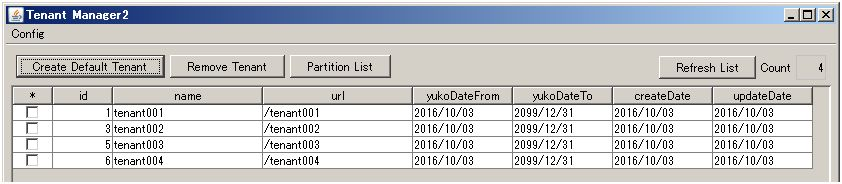
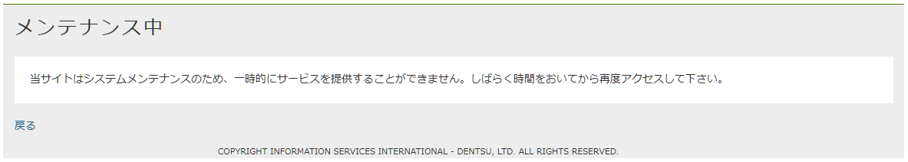
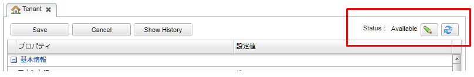

[[tenant]]
== テナント管理ツール
iPLAssを動かすために必要なテナントの作成は<<TenantManager>>を利用します。

[[tenantmanager]]
=== TenantManager

テナントマネージャーは、テナントの新規作成、削除、一覧表示の機能を持っています。

Swingで作成されたGUI版と、バッチ・シェルで作成されたCUI版があります。
GUI版では上の３つの機能全てを提供しています。
CUI版では新規作成、削除機能のみを提供しています。
AWS環境などへtelnet接続して利用する場合は、CUI版を利用してください。

.環境設定
どちらの形式もバッチを実行して起動します。
バッチを実行するには<<batch_common, バッチの共通設定>>を参照して環境を設定してください。

=== TenantManager(GUI版)
GUI版を起動する場合は、 `tenant_gui.bat` （シェル版はありません）から実行します。

.（例）GUIモードで起動した場合
画面が起動すると登録されているテナントの一覧が表示されます。
`Partition List` ボタンは、MySQL及びPostgreSQLの場合のみ表示されます。

.テナントの作成
`Create Default Tenant` ボタンをクリックして新規作成ダイアログを表示します。

設定可能な項目は以下の通りです。
[cols="1,4a",options="header"]
|===
|変数|設定値
|name|テナント名を指定します。
|Admin User Id|管理者ユーザーIDを指定します。
|Admin User Password|管理者ユーザーパスワードを指定します。
|Confirm Password|確認用の管理者ユーザーパスワードを指定します。
|url|テナントを識別するURLを指定します。通常「/{name}」を設定します。
ここで設定する値は一意である必要があります。
|displayName|テナント表示名を指定します。
|TopUrl|テナントのTOP画面のURLを指定します。
|UseLanguages|利用可能言語を指定します。
複数指定する場合はカンマ区切りで指定してください。
先頭をテナントのデフォルト言語に設定します。
未指定の場合は多言語利用をしない設定で作成します。
|create blank Tenant|テナント情報と管理者ユーザーのみ作成するブランクテナントの作成を指定します。
デフォルトは未チェックです。
別環境から全てのメタデータを移行し、同様の環境（テスト環境など）を作成する場合などに指定します。
|Sub-Partition size|サブパーティション数を指定します。
未指定の場合のサブパーティション数は「8」となります。
「0」が指定された場合はサブパーティションを利用しません。
PostgreSQLの場合のみ表示されます。
|===

.テナントの削除
一覧から削除したいテナントを選択し、 `Remove Tenant` ボタンをクリックします。

.MySQLパーティション管理
MySQLの場合、内部で利用しているデータベーステーブルに対して、テナントIDごとにパーティションを作成します。
通常、テナントを新規で作成する際にパーティションを作成します。
ただしパーティションの作成処理はテーブルロックを伴うため、複数のテナントを運用している環境などでは、
パーティション作成処理中に他のテナントに対しても影響が発生します。
これを回避するために、データベースの初期構築時やAPサーバがオフラインのとき、
ユーザーアクセスが少ない時間帯に前もってパーティションを作成できるようにする機能が `Partition List` です。

`Partition List` ボタンをクリックすると、テーブルに対してすでに作成されているパーティション情報を表示します。
`Max Tenant Id` には、すでに作成済みのパーティション最大のテナントIDが表示されます。
`Tenant List` ボタンをクリックすることでテナントの一覧画面に戻ります。

パーティションを作成する場合、 `Create Partition` ボタンをクリックします。

`Max Tenant ID` に作成する最大のテナントID(数値)を指定して、
`Create` ボタンをクリックすると、すでに登録済みのパーティションから１ずつ増やしたパーティションを作成します。

例えば `10` を入力した場合、すでに `6` まで作成されていれば、 `7、8、9、10` 用のパーティションが作成されます。
この実行の間、テーブルロックが発生します。

[cols="1,4a",options="header"]
|===
|変数|設定値
|Max Tenant ID|作成するパーティションの最大のIDを指定します。
|===

.PostgreSQLパーティション管理
パーティション対応のPostgreSQLの場合、内部で利用しているデータベーステーブルに対して、テナントIDごとにパーティションを作成します。
通常、テナントを新規で作成する際にパーティションを作成しますが、前もってパーティションを作成できるようにする機能が `Partition List` です。

`Partition List` ボタンをクリックすると、パーティション対応のテーブルに対してすでに作成されているパーティション情報を表示します。
`Max Tenant Id` には、すでに作成済みのパーティション最大のテナントIDが表示されます。PostgreSQLではテナントIDの採番はシーケンスで行われるため、
表示されているテナントIDが最終のテナントIDとは限りません（最後に作成されたテナントが削除された場合など）。
`Tenant List` ボタンをクリックすることでテナントの一覧画面に戻ります。

パーティションを作成する場合、 `Create Partition` ボタンをクリックします。

`Max Tenant ID` に作成する最大のテナントID(数値)を指定して、
`Create` ボタンをクリックすると、すでに登録済みのパーティションから１ずつ増やしたパーティションを作成します。

例えば `10` を入力した場合、すでに `6` まで作成されていれば、 `7、8、9、10` 用のパーティションが作成されます。

[cols="1,4a",options="header"]
|===
|変数|設定値
|Max Tenant ID|作成するパーティションの最大のIDを指定します。
|SubPartition Size|作成するサブパーティション数を指定します。「0」が指定された場合はサブパーティションを利用しません。
|===

=== TenantManager(CUI版)
.テナント作成
CUI版のテナント作成バッチを起動する場合は、 `tenant_create.bat（sh）` から実行します。
環境情報が表示された状態で止まるので、何かKEYを入力してください。

ここからテナント作成に必要な情報をウィザード形式で入力します。
表示されるメッセージに従って設定値を入力してください。

- `-show` と入力すると、登録されているテナントの一覧を出力します。
- `-env` と入力すると、実行している環境が出力されます。

全て設定が終わると、実行前に確認メッセージが表示されます。
yesでテナントの作成を開始します。

正常に作成されると `SUCCESS` が出力されます。
何かキーを入力して終了します。

.テナント削除
CUI版のテナント削除バッチを起動する場合は、 `tenant_delete.bat（sh）` から実行します。
環境情報が表示された状態で止まるので、なにかKEYを入力してください。

ここからテナント削除に必要な情報をウィザード形式で入力します。
表示されるメッセージに従って設定値を入力してください。

テナント作成同様、 `-show` 、 `-env` が利用できます。

全て設定が終わると、実行前に確認メッセージが表示されます。
yesでテナントの削除を開始します。

正常に削除されると `SUCCESS` が出力されます。
何かキーを入力して終了します。

.MySQLパーティション作成
CUI版のMySQL用パーティション作成バッチを起動する場合は、 `mysql_partition.bat（sh）` から実行します。
環境情報が表示された状態で止まるので、なにかKEYを入力してください。

ここからパーティション作成に必要な情報をウィザード形式で入力します。
表示されるメッセージに従って設定値を入力してください。

テナント作成同様、 `-show` 、 `-env` が利用できます。

全て設定が終わると、実行前に確認メッセージが表示されます。
yesでパーティション作成を開始します。

正常に作成されると `SUCCESS` が出力されます。
何かキーを入力して終了します。

.PostgreSQLパーティション作成
CUI版のPostgreSQL用パーティション作成バッチを起動する場合は、 `postgres_partition.bat（sh）` から実行します。
環境情報が表示された状態で止まるので、なにかKEYを入力してください。

ここからパーティション作成に必要な情報をウィザード形式で入力します。
表示されるメッセージに従って設定値を入力してください。

テナント作成同様、 `-show` 、 `-env` が利用できます。

全て設定が終わると、実行前に確認メッセージが表示されます。
yesでパーティション作成を開始します。

正常に作成されると `SUCCESS` が出力されます。
何かキーを入力して終了します。

.サイレント形式
サイレント形式によるテナント作成バッチを起動する場合は、 `tenant_silent.bat（sh）` から実行します。
サイレント形式では、実行前の確認は行わず即座にテナントの作成を行います。

サイレント形式の場合、実行に必要な情報は設定ファイルで指定します。

設定ファイルは、 `conf/tenant-create-config.properties` として配布しています。
必要に応じて編集してください。

もし設定ファイルのパスやファイル名を変更した場合は、パッチの `TENANT_CONFIG` を変更してください。

正常に作成されると `SUCCESS` が出力されます。

[[migration]]
=== iPLAssのデータ移行
各環境間でテナントに対するデータを移行する場合、iPLAssではメタデータとエンティティデータが対象になります。
メタデータ、エンティティデータそれぞれに移行ツールを提供しています。

ツールは、<<adminconsole, AdminConsoleのTools>>と<<batch, バッチやシェル>>の形式で提供していますので、
利用場面に応じて選択してください。

.メタデータの移行
メタデータの移行には、AdminConsoleのMetaDataExplorerを利用します。
MetaDataExplorerの詳細については<<tools_metadataexplorer, MetaDataExplorer>>を参照してください。 +
メタデータのエクスポート、インポートについては、<<batch_meta, バッチ>>も提供しています。

.エンティティデータの移行
エンティティデータの移行には、AdminConsoleのEntityExplorerを利用します。
エンティティデータに含まれるバイナリファイルも一緒に移行したい場合は、Packaging機能を利用してください。
EntityExplorerの詳細については<<tools_entityexplorer, EntityExplorer>>を参照してください。

.メタデータとエンティティデータを一緒に移行
メタデータとエンティティデータを一緒に移行する場合は、AdminConsoleのPackagingを利用します。
Packagingの詳細については<<tools_packaging, Packaging>>を参照してください。 +
Pacakageのエクスポート、インポートについては、<<batch_package, バッチ>>も提供しています。

[[service_obstruction]]
=== [.eeonly]#サービス閉塞機能#

メタデータの更新作業の際などに、テナントで提供しているサービス（画面やWebApi）を一時的に利用不可にできる機能です。
サービスは以下の単位で利用不可できます。

- 画面機能の利用停止 +
Action単位で利用不可にできます。

- WebApiに対する利用停止 +
WebApi単位で利用不可にできます。

- Entityに対する更新処理の停止（データリードオンリー） +
Entity単位で利用不可にできます。

それぞれの利用停止範囲は、ログインユーザー情報やアクセスパス（対象Action、対象WebApi、対象Entity）を参照して、GroovyScriptで制御できます。

==== 設定方法
利用可否設定の確認・編集は、AdminConsoleのTenant設定から行います。

テナント情報の右上に現在のステータスが表示されます。
また編集ボタンから設定を変更できます。

設定画面は、上部の「ステータスの設定」と下部の「利用可否条件の設定」に分かれます。

- ステータスの設定 +
テナント自体のサービス利用可否を設定します。
- 利用可否条件の設定 +
ステータスが利用不可状態の場合にActionやWebApi、Entity等へのアクセス可否を判定するためのスクリプトを設定します。

まず利用不可にしたい条件をあらかじめ作成しておいて、実際に利用不可にしたいタイミングでステータスを更新することで、利用可否条件が有効になります。
「ステータスの設定」と「利用可否条件の設定」で保存タイミング（Saveボタン）が異なります。

.ステータスの設定
ステータスは次の３つから選択します。

[cols="1,4a",options="header"]
|===
|ステータス|内容
|Available|テナントの全ての機能が利用可能な状態です。
|UnAvailable
|テナントの画面、WebApiを利用不可にします。
対象の画面（Action）やWebApiは指定されている条件により制御します。

なお、この状態でも管理者ユーザー（user.isAdmin() == true）は全ての機能が利用可能になります。
|DataReadOnly
|Entityの更新処理（InsertやUpdate、Delete、UpdateAllなど）ができない状態です。
参照のみ可能です。
対象のEntityは指定されている条件により制御します。

なお、この状態でも管理者ユーザー（user.isAdmin() == true）は更新可能になります。
|===

.利用可否条件の設定
複数の条件パターンを登録しておいて、そのどれを利用するかを指定する構成になっています。

.有効にする条件の指定
予め作成しておいた条件パターンから、有効にする条件を選択します。
未指定の場合、以下の動作となります。

[cols="1,4a", options="header"]
|===
|ステータス|内容
|UnAvailable|全ての画面（Action）やWebApiが利用不可になります。
|DataReadOnly|全てのEntityの更新処理（InsertやUpdate、Delete、UpdateAllなど）ができない状態になります。
|===

- 条件パターン +
現在定義している条件パターンが表示されます。
条件パターンをダブルクリックすると右の条件に内容を表示します。

- 条件 +
条件として以下の項目を設定できます。

[cols="4,8a",options="header"]
|===
|設定項目|設定値
|Name|条件名です。
|Action Filter Script
|Actionに対する利用可否をGroovyScript形式で定義します。
未指定の場合、全てが利用不可となります。
対象のAction名がバインドされるので、それをもとにtrue(利用可)/false(利用不可)を返すように定義します。
利用可能なバインド変数は、編集ダイアログの「Notes」を参照してください。

[source,groovy]
----
/* samples/ec01/配下を利用不可に設定 */
if (path.startsWith("samples/ec01/")) {
    return false;
}
return true;
----

|Action Unavailable Customize Message
|Actionが利用不可の場合にメンテナンスエラー画面に表示するメッセージをGroovyTemplate形式（HTMLタグ可）でカスタマイズできます。
未指定の場合、標準のメッセージが表示されます。
もしメンテナンスエラー画面(Template)自体を変えたい場合は、テナントの「エラー画面Template制御Script」で制御します。

発生する例外は `org.iplass.mtp.tenant.available.UnavailableException` です。

詳細は <<../multitenant/index.adoc#ref_tenant_applicationErrorUrlSelector, エラー画面Template制御Scriptの設定>> を参照してください。

|WebApi Filter Script
|WebApiに対する利用可否をGroovyScript形式で定義します。
未指定の場合、全てが利用不可となります。
対象のWebApi名がバインドされるので、それをもとにtrue(利用可)/false(利用不可)を返すように定義します。
利用可能なバインド変数は、編集ダイアログの「Notes」を参照してください。

[source,groovy]
----
/* WebApiは利用可能 */
return true;
----

|WebApi Unavailable Exception Customize Message
|WebApiが利用不可の場合にレスポンスのJSONオブジェクトに設定するエラーメッセージをGroovyTemplate形式でカスタマイズできます。
なお、WebApiが利用不可の場合はHTTPステータスコードは503を返します。
|Read Only Entity Filter Script
|Entityに対する更新可否をGroovyScript形式で定義します。
未指定の場合、全てが更新不可となります。
対象のEntity名がバインドされるので、それをもとにtrue(ReadOnly＝更新不可)/false(更新可)を返すように定義します。
利用可能なバインド変数は、編集ダイアログの「Notes」を参照してください。

[source,groovy]
----
/* samples.ec01配下を更新不可に設定 */
if (entityName.startsWith("samples.ec01.")) {
	return true;    //trueがReadOnlyなので注意
}
return false;
----

|Entity Read Only Customize Message
|Entityが更新不可の場合に発生する `EntityReadOnlyException` に対してメッセージをGroovyTemplate形式で指定できます。

汎用画面の場合、 `ApplicationException` が発生すると画面上（登録ボタン上部）にエラーメッセージを表示するようになっており、
設定したメッセージはここに表示されます。
汎用画面以外の場合はそれぞれのテンプレート内で制御するか、テナントの「エラー画面Template制御Script」で呼び出すテンプレート自体を制御します。

発生する例外は `org.iplass.mtp.entity.available.EntityReadOnlyException` です。

詳細は <<../multitenant/index.adoc#ref_tenant_applicationErrorUrlSelector, エラー画面Template制御Scriptの設定>> を参照してください。
|===
