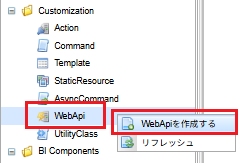
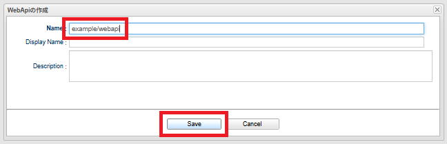
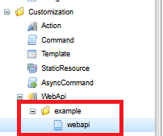
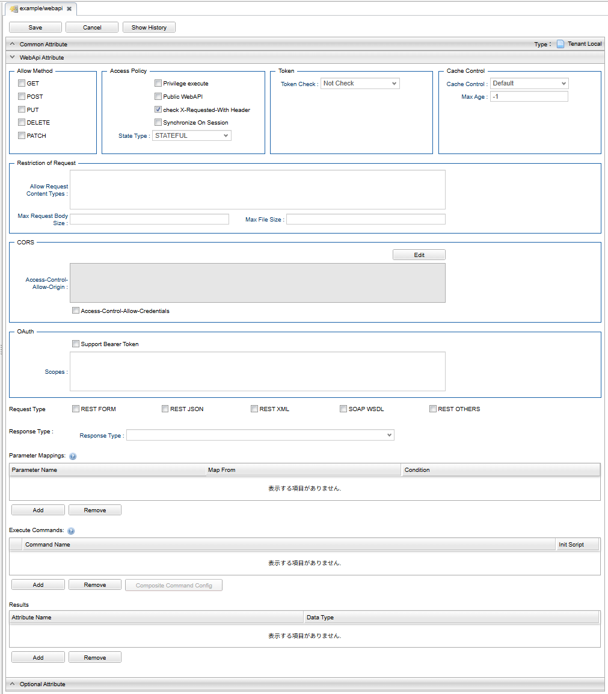
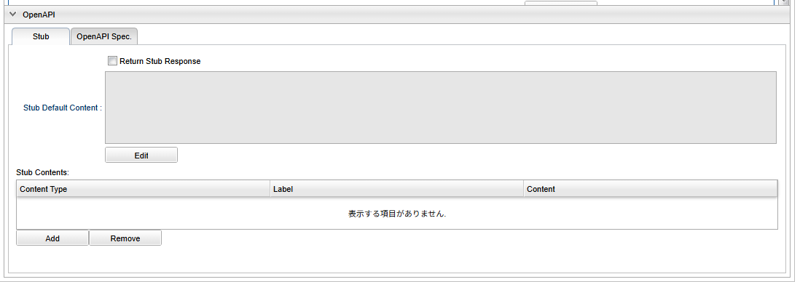
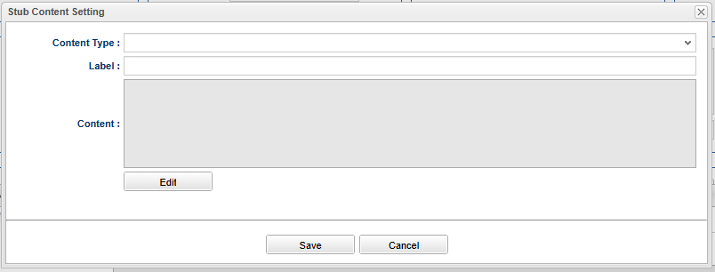
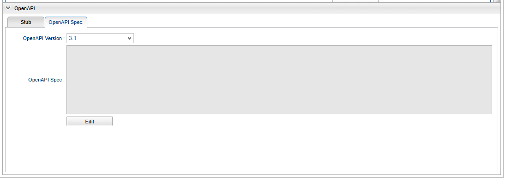

== カスタム WebApi
カスタマイズで作成したCommandをWeb API経由で実行可能にするには、WebApiメタデータを定義します。

=== WebApi定義（AdminConsole）

==== WebApi定義の作成
WebApiアイコンを右クリックして「WebApiを作成する」を選択してください。 +
その後、WebApiの定義情報を入力しWebApiを作成することができます。

.WebApi作成：WebApiを作成する

.WebApi作成：定義情報の入力

.WebApi作成：作成後の画面

==== WebApiの設定項目

.WebApi設定画面

===== 共通設定
`name` はAPIを呼び出す際のURLのパスとなります。

呼び出し時のパスは以下となります。
[source,url]
----
http(s)://[server]/[tenantContextPath]/api/[nameで指定したパス]
----

また、 `name` の最後に許可するMETHODを付けることも可能です。 +
例えば、Web API名として `mtp/entity/GET` 、`mtp/entity/PUT` と２つ定義した場合、以下のリクエストが対象になります。 +

NOTE: `name` の最後に許可するMETHODを付与する方式で定義されたWebAPIにおいてCORSの設定を行いたい場合、その定義方法は特殊になります。例えば、Web API名として `mtp/entity/GET` 、`mtp/entity/PUT` と２つ定義した場合、末尾のメソッド名を抜いた `mtp/entity` という名前の空のWebApi定義を作成し、当該WebAPI定義にてCORSの設定を行ってください（<<../../serviceconfig/index.adoc#WebFrontendService,WebFrontendService>>のrequestRestrictionでCORSの設定を行うことも可能です）。

[source,url]
----
GET http(s)://[server]/[tenantContextPath]/api/mtp/entity
⇒ mtp/entity/GET が実行される
----

[source,url]
----
PUT http(s)://[server]/[tenantContextPath]/api/mtp/entity
⇒ mtp/entity/PUT が実行される
----

===== 固有設定
.AllowMethod
[cols="1,3a",options="header"]
|===
|項目
|内容

|Allow Method
|アクセス可能なHTTPメソッド（GET, POST, PUT, DELETE, PATCH）を指定します。 +
全てチェックされていない場合は全メソッドでのアクセスが可能です。
デフォルトでは全てチェックされていない状態となります。 +
ひとつでもチェックされている場合は、チェックされているメソッドのみアクセスが可能となります。

CAUTION: SOAP 形式は PATCH メソッドに対応していません。
|===
[[synchronize_on_session]]
.Access Policy
[cols="1,3a",options="header"]
|===
|項目|内容
|privilege execute|
WebApi内の処理において、権限の制約を一切受けずに（特権として）実行する事ができます。

|public webapi|
未ログインユーザーでもアクセス可能になります。 +
通常、未ログインユーザーでも実行可能にするにはWebApi権限の定義が必要ですが、
これをチェックすることでWebApi権限のチェックを省略することができます。

NOTE: public webapi と privilege execute の違い +
public webapiは、WebApiを誰でも呼び出せるようにするだけです。Entity検索などの際には、Entity権限が適用されます。 +
一方、privilege executeは、WebApi実行中は、権限チェックを全く行いません。Entity操作なども特権で実行されます。

|check X-Requested-With header|
`X-Requested-With` ヘッダを確認します。

`X-Requested-With` ヘッダに設定されている値がservice-configのWebApiServiceに設定されている値に一致する場合のみ
アクセスを許可します。標準では、 `XMLHttpRequest` が設定されています。 +
設定については、<<../../serviceconfig/index.adoc#WebApiService, WebApiService>>を参照してください。

|synchroize on session|
同一Sessionのリクエストを同期します。 +
このフラグがONにされた場合、Session単位に単一のロック用Objectにてsynchronizeされた上で、WebApiの処理が実行されます。

NOTE: 可能であればCommand内にて必要な箇所で明示的に同期することを推奨します。

|State Type|
STATEFUL:: セッション情報は保存されます。
STATELESS:: セッション情報は保存されません。 +
ただし、当該WebApi呼び出し前にStatefulなセッションが確立されている場合は、セッション情報の参照、保存は可能です。
|===
[[csrf_token_check]]
.Token Check
[cols="1,3a",options="header"]
|===
|項目|内容
|Token Check|
CSRF(XSRF)対策用Tokenのチェックを行うか否かを設定します。 +
また設定により、このTokenを重複サブミット（トランザクションの重複起動）対策として利用することも可能です。

No Check:: Tokenのチェックを行いません。
Check:: 呼び出し元で指定したTokenを利用し不正な遷移や重複サブミットを検出します。

Tokenのチェックを行う場合は、Tokenの値を送信元画面に埋め込み、リクエストパラメータで送信する必要があります。
詳しくは<<Token,Tokenチェック>>を参照してください。

|use fixed Token|
Tokenチェックに、セッション単位に固定に払いだされる固定Tokenを利用します。
CSRF(XSRF)対策のみ必要な場合は固定Tokenを利用可能です。

固定Tokenを利用する場合、送信元画面には固定Tokenの値を埋め込む必要があります。

|consume a Token|
このWebApi実行時にチェックしたTokenを消費します。 +
消費されたTokenは再利用できません(同一Tokenでリクエストが来た場合、エラーになります)。 +
重複リクエスト（トランザクションの重複起動）を防ぐためには、このフラグをONにします。

|rollback on exception|
Exception発生時にTokenを消費しません。
|===

.Cache Control
[cols="1,3a",options="header"]
|===
|項目|内容
|Cache Control |
レスポンスのキャッシュ設定を指定します。

Cache:: クライアントへ当該レスポンスのキャッシュを許可します。具体的には `Cache-Control` ヘッダに `private` を指定します。

Cache Public:: 共有キャッシュへ当該レスポンスのキャッシュを許可します。具体的には `Cache-Control` ヘッダに `public` を指定します。

CAUTION: Cache Publicを設定する場合、プロキシサーバやCDNがキャッシュする可能性があり、キャッシュのコントロールが難しくなります。
不特定多数のユーザーに対して同一のキャッシュが返却されるので、注意が必要です。 +
例えば、ログイン後のユーザーの個人情報が表示されるページをCache Publicしてしまった場合、そのユーザー以外の人が同一URLにアクセスした場合、本来参照できないはずの別ユーザーの個人情報が参照できてしまいます。

Not Cache:: クライアントへ当該レスポンスをキャッシュしないように指示します。具体的には `Cache-Control` ヘッダに `private, no-store, no-cache, must-revalidate` を指定します。

Default:: service-config内の <<../../serviceconfig/index.adoc#WebFrontendService,WebFrontendService>> の `defaultCacheControlType` の設定が適用されます。

CAUTION: Max Ageの値を指定しない場合、ブラウザにより挙動が異なりますのでご注意ください。

|Max Age |
クライアントへ当該コンテンツのキャッシュ有効期間（秒）を通知します。 +
0未満の値は未設定とみなされます。

レスポンスのキャッシュが許可された場合（ `Cache-Control` が `private` の場合 ）、`Cache-Control` ヘッダに `max-age` 属性を追加します。
|===

.Restriction of Request
[cols="1,3a",options="header"]
|===
|項目
|内容

|Allow Request Content Types
|許可するContent-Typeを指定します。未指定の場合は全て許可します。 +
複数のContent-Typeを指定する場合は、半角スペースで区切ってください。

NOTE: REST OTHERS 形式の WebAPIで本項目を設定しない場合、`applicaiton/json` `applicaiton/xml` `application/x-www-form-urlencoded` `multipart/form-data` 以外の全ての Content-Type を許容する設定となります。
REST OTHERS を利用する場合は、必要な Content-Type に限定することを推奨します。

|Max Request Body Size
|リクエストボディの最大サイズ(Byte)を指定します。 +
Content-Typeが `application/x-www-form-urlencoded` の場合は適用されません。

|Max File Size
|リクエストされるファイルの最大サイズ(Byte)を指定します。
|===

.CORS
[cols="1,3a",options="header"]
|===
|項目|内容
|Access-Control-Allow-Origin|
CORS (Cross-Origin Resource Sharing) の設定です。 +
アクセスを許可するドメイン名、または `\*` （アスタリスク）を設定します。 +
`*` （アスタリスク）が設定されていた場合は、すべてのドメイン名からの接続を許可します。 +
複数のドメイン名を登録する場合は、半角スペースで区切ってください。 +
また、 `*.dentsusoken.com` のように、ワイルドカードを指定することもできます。

|Access-Controll-Allow-Credentials|
CORS (Cross-Origin Resource Sharing) の設定です。 +
当該WebApi呼び出し時に認証情報（Cookie、Authorizationヘッダー等）を必要とする場合は、有効化します。　
|===

.OAuth
[cols="1,3a",options="header"]
|===
|項目|内容
|support Bearer Token|
RFC6750規格に基づいたBearer Tokenによる認証を許可します。

|Scopes |
OAuth2.0 のScopeを定義します。AccessTokenベースでのアクセスの際、当該Scopeを保持するClientのみアクセス可能となります。
AdminConsoleで指定する場合、scopeをスペースで区切った場合、ANDを意味し、改行で区切った場合ORを意味します。

====
scopeA scopeB +
scopeC
====

上記の定義をした場合、
このWebApiにアクセスするためには、
 `scopeA` 且つ `scopeB` を保持しているか、もしくは `scopeC` を保持している必要があります。

|===

.個別設定
[cols="1,3a",options="header"]
|===
|項目|内容
|Request Type|許可するリクエストの種類を選択します。 +
REST FORM、REST JSON、REST XML、[.eeonly]#SOAP WSDL#、REST OTHERS の5種類が選択可能です。 +
デフォルトでは全てチェックされていない状態となります。

全てチェックされていない場合は REST FORM、REST JSON、REST XML、[.eeonly]#SOAP WSDL# でのアクセスが可能です。 +
ひとつでもチェックされている場合は、チェックされているメソッドのみアクセスが可能となります。 +
REST OTHERS に該当するリクエストを許可する場合は、明示的にチェックが必要となります。

|REST JSON parameter|
`Request Type` で `REST JSON` を選択した場合のみ設定可能です。

リクエストに含まれるJSON文字列をオブジェクトに変換する処理の設定です。
WebApiのクライアントからは、JSONは次の形で指定します。

GET, DELETEの場合:: `parameter name` に指定した名前でクエリストリングに指定します
POST, PUT, PATCHの場合:: リクエストボディにJSON文字列を指定します

サーバ側では、JSON文字列を、 `parameter type` で指定したクラスに変換します。 `parameter type` 未指定の場合は `java.util.Map` として変換されます。
`parameter type` に `java.io.Reader` を指定した場合はJSON文字列をReader経由でそのまま取得可能です。

変換されたオブジェクトは、RequestContextから `parameter name` で指定したキー名でattributeから取得可能です。

.例
parameter nameにvalueXを指定し、parameter typeにSomeTypeを指定した場合、
----
SomeType valueX = (SomeType) request.getAttribute("valueX")
----
で取得可能です。

NOTE: `parameter name` の設定値が `param` 且つ `parameter type` が `java.util.Map` （もしくは未指定）の場合、 +
`request.getParam("keyX")` でMap内の値を取得することが可能です。

`Acceptable Content Type` は `application/json` 以外の Content-Type を受け付ける場合に設定します。複数指定する場合はカンマ区切りで設定します。 +
（設定例： `application/vnd.api+json, application/vnd.collection+json`）

|REST XML Parameter|
`Request Type` で `REST XML` を選択した場合のみ設定可能です。

リクエストに含まれるXML文字列をオブジェクトに変換する処理の設定です。
WebApiのクライアントからは、XMLは次の形で指定します。

GET, DELETEの場合:: `parameter name` に指定した名前でクエリストリングに指定します
POST, PUT, PATCHの場合:: リクエストボディにXML文字列を指定します

サーバ側ではXML文字列をJAXBにより変換します。
変換可能なオブジェクトはservice-configのWebApiJAXBServiceに設定されたクラスとなります。
設定については、 <<../../serviceconfig/index.adoc#WebApiJaxbService,WebApiJAXBService>> を参照してください。

また、サーバ側でXMLをマッピングするクラスを明示的に指定したい場合は、`parameter type`  にクラス名を指定します。
`parameter type` に `java.io.Reader`  を指定した場合はXML文字列をReader経由でそのまま取得可能です。

変換されたオブジェクトは、RequestContextから `parameter name` で指定したキー名でattributeから取得可能です。

.例
parameter nameにvalueXを指定し、SomeTypeがWebApiJAXBServiceに設定される場合、
----
SomeType valueX = (SomeType) request.getAttribute("valueX")
----
で取得可能です。

`Acceptable Content Type` は `application/xml` 以外の Content-Type を受け付ける場合に設定します。複数指定する場合はカンマ区切りで設定します。 +
（設定例： `application/xhtml+xml, application/svg+xml`）

|Response Type|
許可するレスポンスのタイプを指定します。 +
複数ある場合はカンマで区切ってください。
未指定の場合、 `application/json` と `application/xml` を許可します。
|===

.Parameter Mappings
[cols="1,3",options="header"]
|===
|項目|内容
|Parameter Name |
パラメータマッピング機能における、パラメータ名を指定します。 +
<<WebApi-Param-Mapping,パラメータマッピング>> を参照ください。
|Map From |
パラメータマッピング機能における、マッピング元を指定します。
|Condition |
パラメータマッピング機能における、マッピング処理を行う条件を指定します。
|===

.Execute Commands
[cols="1,3a",options="header"]
|===
|項目|内容
|Command Name|
WebApi呼び出し時に実行されるCommandです。 +
<<WebApi-Command,Commandの設定>>を参照ください。

|Init Script|Commandのインスタンスの初期化ロジックが設定されているか否かを表示します。
|===

[[webapi_configuration_results]]
.Results
[cols="1,3a",options="header"]
|===
|項目
|内容

|Attribute Name
|レスポンスとして返すアトリビュート名を設定します。 +
Command内で `RequestContext#setAttribute(attribute name)` で値を設定してください。

返却可能な型は以下となります。 

* プリミティブ型（やそれに近しいクラス群、String、Date等）とその配列
* Entity（GenericEntity）とその配列
* Entityのプロパティで定義される型とその配列
* 設定ファイルに定義された、JAXBでシリアライズ/デシリアライズ可能なアプリ側で定義したクラス

レスポンスとして返却するデータ構造をカスタマイズすることが可能です。 +
カスタマイズについては<<WebApi-Result,返却値について>>を参照ください。

|Data Type
|任意の設定項目です。レスポンスとして返すデータの型を指定します。 + 
設定する値は、Java の完全修飾クラス名を指定してください。 +
設定することで OpenAPI 出力時にレスポンスのデータ型に反映されます。

OpenAPIの出力については、link:../support/index.html#tools_openapi_support[開発・運用サポート - OpenAPISupport^] を参照してください。
|===

[[webapi_openapi_configuration]]
===== OpenAPI設定（任意設定項目）
WebAPI 設定画面の OpenAPI セクションで設定する項目です。 +
本セクションでは、WebAPIの動作に直接影響しない設定項目や、開発用の設定項目を管理します。

[[webapi_openapi_configuration_stub]]
====== スタブ
WebAPI のスタブを有効化することで、コマンドの実装・設定をせずに任意のレスポンスを返却することが可能です。 +
本設定項目は、開発時に利用することを想定しています。 +
スタブ機能を利用するには、link:../../serviceconfig/index.html#WebApiService[Service-Config - WebApiService^] の enableStubResponse を設定する必要があります。

.スタブ設定画面

.Stub Contents設定画面

.スタブ設定項目
[cols="1,3a",options="header"]
|===
|項目
|内容

| Return Stub Response
| チェックされている場合、WebAPI が実行された際に Stub Default Content, Stub Contents に設定した値を利用してレスポンスを返却します。

| Stub Default Content
| スタブレスポンスのデフォルトコンテンツ設定します。 Response Type で指定したいずれかの形式に合わせてスタブコンテンツを設定してください。 +
本設定値は、Stub Contents に該当するレスポンスが設定されていない場合のデフォルト値として利用されます。

| Stub Contents
| スタブコンテンツを設定します。コンテンツは以下の項目で構成されおり、全て入力が必須です。

[cols="1,3",options="header"]
!===
!項目
!内容

! Content Type
! スタブの Content Type を設定します。Response Type に設定されている Content Type のいずれかを設定してください。

! Label
! スタブコンテンツの識別用ラベルです。 +
Content Type 当たりのスタブレスポンスを複数設定する場合、リクエストのクエリ文字列 `mtp_stub_label` に設定した値が使用されます。 +
リクエストのクエリ文字列 `mtp_stub_label` の設定が無い場合や、`mtp_stub_label` に該当する値が存在しない場合はランダムに選択されます。

クエリ文字列の例： ?mtp_stub_label=stubJson1 +
リクエストに適用した例： https://example.com/iplass/tenant/api/stubApi?mtp_stub_label=stubJson1

! Content
! スタブのレスポンス本体を設定します。Response Type に設定されている形式に合わせて記載してください。
!===
|===

[[webapi_openapi_configuration_openapispec]]
====== OpenAPI Spec.
WebAPI の OpenAPI を管理することが可能です。本設定項目は WebAPI の動作に影響しません。 +
記載した OpenAPI は、link:../support/index.html#tools_openapi_support[開発・運用サポート - OpenAPISupport^] から出力することが可能です。

.OpenAPI設定画面

.OpenAPI 設定項目
[cols="1,3a",options="header"]
|===
|項目
|内容

| OpenAPI Version
| OpenAPI のバージョンを指定します。3.1, 3.0 のいずれかを選択します。

| OpenAPI Spec
| OpenAPI 仕様を指定します。YAML, JSON のいずれかの形式で指定可能です。
|===

[[WebApi-Param-Mapping]]
=== パラメータマッピング
リクエストに含まれるパラメータを別名にマッピングしたり、URLのパスの一部をパラメータにマッピングすることが可能です。

Parameter Nameに指定したパラメータ名に、Map Fromで指定されたパス、もしくは別パラメータをマッピングします。
Map Fromには、リクエストURLのパスの一部を表すパターン文字列、もしくは別パラメータ名を指定することが可能です。

==== パスのマッピング
パスをマッピングする場合、特別なパターン文字列を利用します。

${n}::
+
`${n}` 形式でパス階層の一部をマッピング可能です。 +
nはWebApi名以降のパスの階層数を示します。 +
`${0}` とした場合WebApi名より1階層下層のパスの値が、
`${1}` とした場合WebApi名より2階層下層のパスの値がマップされます。

${paths}::
+
`${paths}` とした場合、WebApi名以降のサブパスがマップされます。

.パスマッピング例
WebApi名が `sample/webApi1` の場合、
`sample/webApi1/path1/path2/path3?paramX=fuga` を呼び出した場合、Map Fromに設定した値によって、 それぞれ次の値がパラメータにマップされます。

* ${0} -> path1
* ${1} -> path2
* ${paths} -> path1/path2/path3

==== マッピング条件の指定
Conditionを指定することにより、パラメータマッピングを実行する条件を指定することが可能です。 Conditionはgroovy Scriptで記述可能です。

次の変数がバインドされており条件判断に利用可能です。
[cols="1,3",options="header"]
|===
|変数名 |説明
|subPath |webApi名より下層のサブパスを/で分割したString配列
|fullPath |webApi名含めたフルパスを/で分割したString配列
|paramMap |リクエストパラメータのMap
|===

たとえば、次のようなパラメータマッピング定義がある場合、
[cols="1,1,2",options="header"]
|===
|Name |Map From |Condition
|defName |${0} |subPath.length==1
|viewName |${0} |subPath.length==2
|defName |${1} |subPath.length==2
|===

webApi1に対するリクエストパスが、

webApi1/hogeだった場合::
defName=hoge
webApi1/hoge/fugaだった場合::
viewName=hoge, defName=fuga

となります。

[[webapi-attributes]]
=== 属性値
属性値として値を保持しています。属性値のスコープはリクエストスコープとなります。 +
保持している値は、HttpServletRequest や Httpヘッダーなどがあります。

[[webapi-attributes-get]]
==== 属性値の取得
属性値を取得するには、 `RequestContext#getAttribute` メソッドを使用します。 +
WebApi から実行されるコマンドで一般的に取得可能な属性値のキーは `org.iplass.mtp.webapi.WebApiRequestConstants` に定義されています。詳細は当該クラスのJavadocを参照してください。

.属性値の取得例
[source,java]
----
import org.iplass.mtp.command.Command;
import org.iplass.mtp.command.RequestContext;

public class CommandImpl implements Command {
    public String execute(RequestContext request) {
        Object attributeValue = request.getAttribute("attributeName"); // <1>

        // : 
        // :

        return "SUCCESS";
    }
}
----
<1> "attributeName" で指定した属性値を取得します。

[[webapi-attributes-get-request-body-rest-others]]
==== リクエスト本文取得（REST 形式 REST_OTHERS）
REST 形式 REST_OTHERS の場合、リクエスト本文は Command の処理でパースする必要があります。 +
リクエスト本文は以下のように取得することができます。

.REST_OTHERSのリクエスト本文の取得方法
[source,java]
----
import java.io.InputStream;

import org.iplass.mtp.command.Command;
import org.iplass.mtp.command.RequestContext;
import org.iplass.mtp.webapi.WebApiRequestConstants;

public class RestOthersCommandImpl implements Command {
    public String execute(RequestContext request) {
        try (InputStream body = (InputStream)request.getAttribute(WebApiRequestConstants.REQUEST_BODY)) { // <1>
            String characterEncoding = (String)request.getAttribute(WebApiRequestConstants.REQUEST_CHARACTER_ENCODING); // <2>

            // requestBody, characterEncoding を利用してリクエスト本文をパースし処理を行う

            return "SUCCESS";

        } catch (IOException e) {
            // 例外時の処理
            return "FAIL";
        }
    }
}
----
<1> HttpServletRequest#getInputStream() と同等の InputStream を取得できます。
<2> リクエスト本文の文字エンコーディングを取得できます。

[[WebApi-Command]]
=== Commandの設定
APIが呼ばれた際に実行するCommandとその処理方法を設定します。

[cols="1,3a",options="header"]
|===
|項目 | 内容
|Execute Command |APIを呼び出された際に実行するCommandです。
|Transaction Propagation |このCommand実行時のトランザクション制御方法を指定します。
次のいずれかを指定します。デフォルト値はREQUIREDです。

REQUIRED::
トランザクションが開始されていなかったら、開始（およびコミット/ロールバック）します。
すでにトランザクションが開始されている場合は、そのトランザクションのコンテキストで実行されます。
REQUIRES_NEW::
新規にトランザクションを開始（およびコミット/ロールバック）します。
既存のトランザクションが存在した場合は、一旦サスペンドされ当該処理完了後、レジュームされます。
NOT_SUPPORTED::
トランザクション制御をしません。既存のトランザクションが開始されている場合は、
一旦そのトランザクションがサスペンドされ当該処理完了後、レジュームされます。
SUPPORTS::
トランザクションが開始されていない場合は、トランザクション制御しません。
既にトランザクションが開始されている場合は、そのトランザクションのコンテキストで実行されます。

|Rollback when exception |Command実行時に例外がスローされた場合、
自動的にトランザクションをロールバックするか否かを指定します。
|Throw Exception if setRollbackOnly |トランザクションが本Command処理用に新規作成された際、
且つCommand処理中にsetRollbackOnlyされた場合、かつ明示的に例外がスローされなかった場合、iPLAss側で例外扱い（ `org.iplass.mtp.transaction.RollbackException` をスロー）にするか否かの設定です。
|Init Script | Commandのインスタンスの初期化Script（Groovy Script）を指定可能です。

対象となるCommandのインスタンスは `cmd` としてバインドされています。 +
初期化Scriptの例を示します。

[source,groovy]
----
cmd.propA = 1000;
cmd.propB = true;
----

NOTE: 通常はインスタンスが複数のリクエストで共有されるため、この初期化処理は一度のみ実行されます。 +
ただしCommand定義にて、`instantiated for each request` 設定を有効化している場合、リクエストの都度、初期化処理が実行されます。
|===

==== 複合Commandの設定
1つのAPIに対して複数のCommandを紐付けすることが可能です。

複数のCommandが紐付けされた場合、デフォルトでは次のような動作になります。

* 定義された順番にCommandを実行
* 最後に定義されたCommandの実行結果ステータスを全体の実行結果ステータスとする

条件により、処理順を変更するなど複雑な制御が必要な場合、Composite Command Configにて制御Scriptを記述可能です。

===== Composite Command Configの設定
[cols="1,3a",options="header"]
|===
|項目 | 内容
|Transaction Propagation|この複合Command実行時のトランザクション制御方法を指定します。

指定可能な値は、単一のCommand設定のTransaction Propagationの値と同様です。
デフォルト値はREQUIREDです。

|Rollback when exception |この複合Command実行時に例外がスローされた場合、
自動的にトランザクションをロールバックするか否かを指定します。

|Throw Exception if setRollbackOnly |トランザクションが本複合Command処理用に新規作成された際、
且つCommand処理中にsetRollbackOnlyされた場合、かつ明示的に例外がスローされなかった場合、iPLAss側で例外扱い（ `org.iplass.mtp.transaction.RollbackException` をスロー）にするか否かの設定です。

|Initialize Script |
複数のCommandの初期化処理のスクリプトを設定可能です。
あらかじめ変数の `cmd` にCommandのインスタンスが配列でバインドされています。

.設定例
[source,groovy]
----
cmd[0].propA = 10
cmd[1].propB = 'hoge'
----

上記の場合、一覧の1番目(配列のindex=0)のCommandのプロパティpropAに10、
2番目(配列のindex=1)のコマンドのプロパティpropBにhogeといった値が設定されます。

NOTE: 複合Commandを構成しているCommand定義にて、`instantiated for each request` 設定を
有効化しているものがひとつでも存在する場合、リクエストの都度、初期化処理が実行されます。

|Execute Rule Script | Commandが複数定義された場合に、Commandの実行順やステータスによる処理分岐などの制御を
GroovyScriptで記述することが可能です。 +
実行スクリプトが未指定の場合は定義されたCommandの順番に実行され、
実行結果ステータスは最後のCommandの戻り値が利用されます。 +

あらかじめ変数の `cmd` にCommandのインスタンスが配列でバインドされています。
また、`request` の変数名でRequestContextのインスタンスがバインドされています。

.記述例
[source,groovy]
----

if (cmd[0].execute(request) == 'OK') {
    return cmd[1].execute(request)
} else {
    return cmd[2].execute(request)
}
----

|===

[[WebApi-Result]]
=== 返却値について
以下の内容をレスポンスタイプの各形式にて返却します。

.共通項目
[cols="1,3a",options="header"]
|===
|項目 | 内容
|status|Commandで実装した戻り値がセットされます。 +
エラーが発生した場合は、 `FAILURE` がセットされます。
|exceptionType|エラーが発生した場合に、発生したExceptionのクラス名がセットされます。 +
エラーがApplicationExceptionの場合はそのまま設定され、それ以外の場合は `WebApiRuntimeException` をセットします。
|exceptionMessage|エラーが発生した場合に、発生したExceptionに設定されているメッセージがセットされます。 +
エラーがApplicationExceptionの場合はそのまま設定され、それ以外の場合は固定メッセージがセットされます。
|===

これ以外に、Resultsで設定したnameに一致するデータをRequestContextから取得し、返します。

.例
* Results設定 +
+
----
test1 , test2 を設定
----

* Command +
+
[source,groovy]
----
request.setAttribute("test1", 1000);
request.setAttribute("test2", "string1");
request.setAttribute("test3", "string2"); //これは無視される

return "SUCCESS";
----

* 結果 +
+
[source,json]
----
{
	"status": "SUCCESS",
	"test1": 1000,
	"test2": "string1"
}
----

==== レスポンスのカスタマイズ
以下の条件に一致する場合は、レスポンス内容を自由にカスタマイズすることが可能です。

* 返却値が１つである
* 上記の返却値に設定されたオブジェクトが、以下のいずれかであること

- jakarta.ws.rs.core.StreamingOutput
- jakarta.ws.rs.core.Response.ResponseBuilder

NOTE: ResponseBuilderにおいては、HTTPステータスやContent-Typeもカスタマイズすることが可能です。

.例 : jakarta.ws.rs.core.StreamingOutput +
* ソース +
+
[source,groovy]
----
import java.io.BufferedWriter;
import java.io.IOException;
import java.io.OutputStream;
import java.io.OutputStreamWriter;

import jakarta.ws.rs.WebApplicationException;
import jakarta.ws.rs.core.StreamingOutput;

...

request.setAttribute("result1", new StreamingOutput() {

    @Override
    public void write(OutputStream out) throws IOException, WebApplicationException {

        try (OutputStreamWriter osw = new OutputStreamWriter(out, "UTF-8");
            BufferedWriter writer = new BufferedWriter(osw);
        ){
            writer.write("test1");
        }
    }
});

return "SUCCESS";
----

* 結果 +
+
[source,json]
----
test1
----

.例 : jakarta.ws.rs.core.Response.ResponseBuilder +
* ソース +
+
[source,groovy]
----
import jakarta.ws.rs.core.MediaType;
import jakarta.ws.rs.core.Response;
import jakarta.ws.rs.core.Response.ResponseBuilder;
import jakarta.ws.rs.core.Response.Status;

...

ResponseBuilder builder = Response.ok("test1");

//ResponseBuilder builder = Response.status(Status.SERVICE_UNAVAILABLE).entity("UNAVAILABLE").type(MediaType.APPLICATION_JSON);
//ResponseBuilder builder = Response.status(500).entity("test1").type(MediaType.APPLICATION_XML);

request.setAttribute("result1", builder);

return "SUCCESS";
----

* 結果 +
+
[source,json]
----
test1
----

[[WebApi-Annotation]]
=== WebApi定義（アノテーション）
JavaにてCommandを実装する場合、クラス自体にアノテーションでWebApi定義を設定することが可能です。
単一のCommandに複数のWebApiをアノテーションすることも可能です。

NOTE: アノテーションで定義されたWebApi定義はすべてのテナントで有効化されます。

WebApi定義を行うためのアノテーションは `@WebApi` です。設定可能な要素はAdminConsoleでの設定項目に準じます。
詳細はjavadocを参照ください。

NOTE: Commandクラス以外のクラス、インタフェースに対して@WebApi定義することも可能です。ただし、この場合command属性にてcommandClassを明示的に指定する必要があります。

.アノテーションによる定義のサンプル
[source,java]
----
import org.iplass.mtp.command.annotation.webapi.WebApi;
:

@WebApi(name="tutorial",
    displayName="チュートリアルWebApi",
	accepts={RequestType.REST_FORM},
	methods={MethodType.GET, MethodType.POST},
	results={"resultValue", "anotherValue"}
)
@CommandClass(name="tutorial")
public class TutorialCommand implements Command {
    @Override
    public String execute(RequestContext request) {

        // 処理
        
        request.setAttribute("resultValue", someValue);
        request.setAttribute("anotherValue", anotherResultValue);

        if ( ... ) {
            return "NG";
        } else {
            return "OK";
        }
    }
}
----

