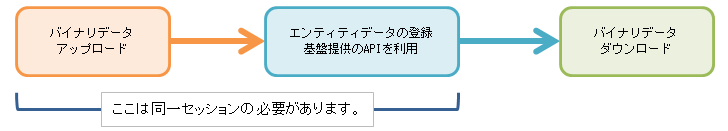

== 共通設定

[[WebAPI-Usage-RequestHead]]
=== リクエストヘッダ
Web APIを利用する際に必要なリクエストヘッダの項目について説明します。
大きく分けてREST形式の場合とSOAP形式の２種類があります。

[[WebAPI-Usage-RequestHead-REST]]
==== REST形式
以下の項目を必要に応じてHTTPリクエストヘッダに設定します。

[cols="1,1,3a",options="header"]
|===
|項目名|name|value
|ユーザーID|X-Auth-Id|認証用のユーザーIDを指定するカスタムヘッダです。

CAUTION: セッションが有効でログイン済みの場合、デフォルトではログイン済みのセッションが優先されます。 +
<<../../serviceconfig/index.adoc#IdPasswordAutoLoginHandler, IdPasswordAutoLoginHandler>> の設定を参照ください。

|パスワード|X-Auth-Password|認証用のユーザーのパスワードを指定するカスタムヘッダです。X-Auth-Idと同時に設定します。
|認可要求|Authorization|認証・認可要求をする際に指定可能です。
iPLAssは以下の認可要求タイプをサポートします。

NOTE: 同時にカスタム認証ヘッダ（X-Auth-Id/X-Auth-Password）が指定される場合はそちらが優先されます

Basic:: ベーシック認証方式によるユーザーID/パスワードの指定が可能です。
+

CAUTION: セッションが有効でログイン済みの場合、デフォルトではログイン済みのセッションが優先されます。 +
また、デフォルトの設定ではBasic認証方式は有効化されていません。 +
<<../../serviceconfig/index.adoc#IdPasswordAutoLoginHandler, IdPasswordAutoLoginHandler>> の設定を参照ください。

Bearer:: Bearer Token（RFC6750）による認証／認可が可能です。
Bearer Tokenを利用する場合はそれぞれのWeb API定義にて有効化する必要があります。
+
CAUTION: セッションが有効でログイン済みの場合、デフォルトではログイン済みのセッションが優先されます。 +
<<../../serviceconfig/index.adoc#BearerTokenAutoLoginHandler, BearerTokenAutoLoginHandler>> の設定を参照ください。

|クッキー（セッションIDなど）|Cookie|ステートフルなWeb APIを呼び出す際にはセッションIDなどが設定されているCookieを有効化する必要があります。

|アクセプト|Accept|返却値のメディアタイプ形式を設定する項目です。 `application/json` か `application/xml` もしくはカスタムWeb APIで定義するメディアタイプを指定します。

|コンテントタイプ|Content-Type|リクエスト送信時にどのタイプで送信するかを設定する項目です。
Web API定義で許可しているコンテントタイプを設定して下さい。
次のいずれかを設定します。

application/x-www-form-urlencoded::
multipart/form-data:: リクエストはREST FORMとして処理されます
application/json:: リクエストはREST JSONとして処理されます
application/xml:: リクエストはREST XMLとして処理されます
未指定の場合:: リクエストがGET/DELETE時はREST FORMとして処理されます

|Token|X-Transaction-Token| トランザクションToken（もしくはCSRF(XSRF)対策用Token）を設定する項目です。

また、
Web APIのヘッダにユーザーID/パスワードを設定してログインした場合、且つWeb APIがステートフルの場合、そのAPI呼び出しのレスポンス
 （HTTPヘッダ：ヘッダ名 `X-Transaction-Token` )として、そのログインセッション内で有効な固定Tokenを返却します。
|===

[[WebAPI-Usage-RequestHead-SOAP]]
==== SOAP形式
以下の項目を必要に応じてリクエストのSOAPヘッダ/HTTPヘッダに設定する必要があります。

.SOAPヘッダ
[cols="1,1,1,3a",options="header"]
|===
|項目名|namespace|name|value
|ユーザーID| \http://iplass.org/webapi/credential|id
|認証用のユーザーIDを指定する項目です。

CAUTION: セッションが有効でログイン済みの場合、デフォルトではログイン済みのセッションが優先されます。 +
<<../../serviceconfig/index.adoc#IdPasswordAutoLoginHandler, IdPasswordAutoLoginHandler>> の設定を参照ください。

|パスワード| \http://iplass.org/webapi/credential|password
|認証用のユーザーのパスワードを指定します。
|===

.HTTPヘッダ
[cols="1,1,3a",options="header"]
|===
|項目名|name|value
|クッキー（セッションIDなど）|Cookie|ステートフルなWeb APIを呼び出す際にはセッションIDなどが設定されているCookieを有効化する必要があります。

|Token|X-Transaction-Token| トランザクションToken（もしくはCSRF(XSRF)対策用Token）を設定する項目です。

SOAPヘッダにユーザーID/パスワードを設定してログインした場合、且つWeb APIがステートフルの場合、そのAPI呼び出しの返却値
 （HTTPヘッダ：ヘッダ名 `X-Transaction-Token` )として、そのログインセッション内で有効な固定Tokenを返却します。
|===

[[WebAPI-Usage-Session]]
=== Session
Web API定義にてステートフル、ステートレスの指定が可能です。
ステートフルの場合は、Cookieを利用しセッションが維持されます。
同一ユーザーにて複数回連続でWeb APIを呼び出す場合、セッションを利用すると、認証状態が維持され2回目以降のアクセスの際に認証処理が不要となります。
認証は比較的重い処理の為、前記のような場合はセッションの利用を推奨しています。

また、バイナリデータアップロードからエンティティデータの登録までは同一セッションである必要があります。
この処理を例にセッション維持の例について解説します。

[[WebAPI-Usage-Session-BinaryData]]
.バイナリデータをエンティティデータとして登録するには
バイナリデータアップロードAPIを利用した場合、バイナリデータはテンポラリ状態として保存され、汎用画面から利用可能な状態ではありません。
ファイルアップロードの返却値にあるlobIdを利用し、エンティティデータとして使える形式に変換後、エンティティデータとして登録する必要があります。 +

* バイナリデータアップロード～ダウンロードまで
+

==== REST形式
下記は「HTTP Client」を利用した場合の例を記載しています。
[source,java]
----
// １．セッション情報を保存する為の下準備
CookieStore cookieStore = new BasicCookieStore();
HttpContext httpContext = new BasicHttpContext();

// ２．セッションを保存する為にコンテキストを作成
httpContext.setAttribute(ClientContext.COOKIE_STORE, cookieStore);

// ３．バイナリデータアップロードAPI呼び出し時に上記作成したコンテキストをセット
HttpResponse response = httpClient.execute(httpPost, httpContext);

// ４．下記コマンドでセッションを切ります
httpClient.getConnectionManager().shutdown();

// ５．コンテキストを利用して再接続
HttpResponse response = httpClient.execute(httpPost, httpContext);
----
上記ソースの１～３を実施しないと４でセッションが切断され、５で接続した際には別セッションとなります。

==== SOAP形式
下記では「JAX-WS（Metoro）」を利用した場合の例を記載しています。

[source,java]
----
// １．BindingProviderの作成
WSBindingProvider bp = (WSBindingProvider) port;

// ２．セッション利用の設定
((BindingProvider) port).getRequestContext().put(BindingProvider.SESSION_MAINTAIN_PROPERTY, true);

// ３．バイナリデータアップロード処理の呼び出し
WebApiResponse result = port.upload("uploadFile", "sample.jpg", dhandler);

// ４．呼び出し後にセッション情報を取得
com.sun.xml.ws.transport.Headers headers = (com.sun.xml.ws.transport.Headers)
    bp.getResponseContext().get(MessageContext.HTTP_RESPONSE_HEADERS);
Object cookie = headers.get("Set-Cookie");

// ５．新規BindingProviderの作成
WSBindingProvider commandbp = (WSBindingProvider) commandPort;

// ６．セッション情報をセット
Map<String, List<String>> customHeaders = new HashMap<String, List<String>>();
customHeaders.put("Cookie", Arrays.asList(cookie.toString()));
((BindingProvider) commandp).getRequestContext()
    .put(MessageContext.HTTP_REQUEST_HEADERS, customHeaders);
----
上記ソースの１～５を実施しないと３完了後にセッションが切断され、６で接続した際には別セッションとなります。

[[Token]]
=== Tokenチェック
Token（CSRF対策、トランザクション重複起動対策）のチェックを行う場合は、Tokenの値をリクエストパラメータで送信する必要があります。
またTokenの値をあらかじめ取得しておく必要があります。

.Web API呼び出し時のTokenの設定方法 +
以下のいずれか方法でWeb API呼び出し時に設定します。

* HTTPヘッダ（SOAPの場合はSOAPヘッダでも可）に `X-Transaction-Token` のヘッダ名にて設定
* Web API呼び出し時のパラメータとして `_t` のパラメータ名にて設定

.クライアントへのTokenの受け渡し方法 +
次のいずれかの方法を利用して下さい。

* Web APIを呼び出す直前の画面にサーバ側の処理（JSP、GroovyTemplate）でHTML内に直接埋め込み
* Tokenを伴ったWeb API呼び出しの返却値として新たなTokenを発行
* （CSRF対策として利用可能な固定Tokenの場合）ログイン処理のレスポンスとしてクライアントへTokenを返却し、
Cookie保存などの方法によりクライアント内にセキュアに保持し、それを利用する

TemplateにてTokenの値を埋め込むためのユーティリティを提供しています。 +
詳細は<<../customizing/index.adoc#JSPTag-EL,JSPカスタムタグ・EL関数>> 、
<<../customizing/index.adoc#groovytemplate,GroovyTemplate>>を参照してください。

=== SOAPエンドポイント
SOAP/WSDLを利用する場合、iPLAssはMetro（JAX-WS RI）を基盤として利用します。
SOAPエンドポイントを有効化するためには、web.xmlにてMetroをWeb Applicaitonに組み込みます。

[source,xml]
----
<?xml version="1.0" encoding="UTF-8"?>
<web-app xmlns:xsi="http://www.w3.org/2001/XMLSchema-instance"
  xmlns="https://jakarta.ee/xml/ns/jakartaee"
  xsi:schemaLocation="https://jakarta.ee/xml/ns/jakartaee https://jakarta.ee/xml/ns/jakartaee/web-app_6_0.xsd"
  version="6.0">

    :

	<listener>
		<listener-class>com.sun.xml.ws.transport.http.servlet.WSServletContextListener</listener-class>
	</listener>

	<servlet>
		<description>JAX-WS endpoint</description>
		<display-name>JAX-WS Endpoint</display-name>
		<servlet-name>webserviceEndpoint</servlet-name>
		<servlet-class>com.sun.xml.ws.transport.http.servlet.WSServlet</servlet-class>
		<load-on-startup>1</load-on-startup>
	</servlet>
	<servlet-mapping>
		<servlet-name>webserviceEndpoint</servlet-name>
		<url-pattern>/soap/*</url-pattern>
	</servlet-mapping>

    :
    
</web-app>
----

また、合わせて以下の内容のsun-jaxws.xmlをWEB-INFへ格納します。

[source,xml]
----
<?xml version="1.0" encoding="UTF-8"?>
<endpoints xmlns='http://java.sun.com/xml/ns/jax-ws/ri/runtime' version='2.0'>
    <endpoint implementation="org.iplass.mtp.impl.webapi.soap.CommandInvokerWebService" name="CommandInvoker" url-pattern="/soap/command" />
    <endpoint implementation="org.iplass.mtp.impl.webapi.soap.BinaryWebService" name="BinaryService" url-pattern="/soap/bin" enable-mtom="true" />
</endpoints>
----
