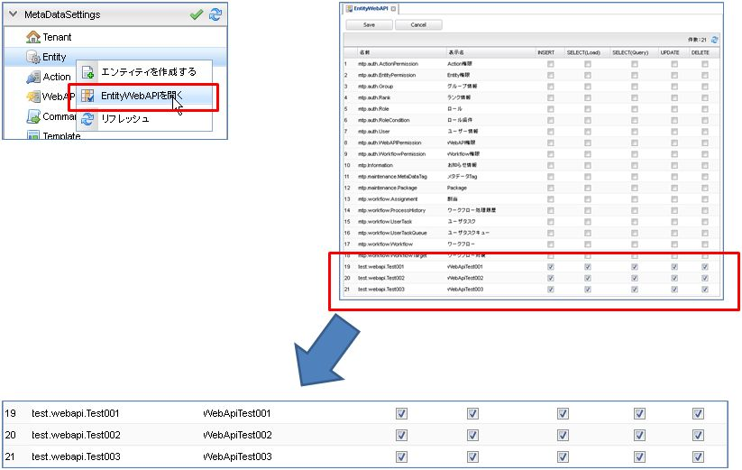

[[entity_crud_api]]
== Entity CRUD API

Entityデータに対する操作（Load, Query, Insert, Update, Delete、CSV Upload）を提供します。REST形式にのみ対応しています。

基本となるURLは以下です。
[source,url]
----
http(s)://[server]/[tenantContextPath]/api/mtp/entity
----

METHODやパスによって実行される処理が判定されます。

[cols="1,1a",options="header"]
|===
|METHOD + パス|処理
|GET api/mtp/entity/[Entity定義名]/[oid] |oid指定でロード
|GET api/mtp/entity/[Entity定義名]/[oid]/[version] |oid,version指定でロード
|GET api/mtp/entity/[Entity定義名]?filter=[where条件] |where句指定して検索。csv形式も可能
|GET api/mtp/entity?query=[EQL] |EQL文を指定して検索。csv形式も可能
|POST api/mtp/entity/[Entity定義名] |Insert
|PUT api/mtp/entity/[Entity定義名]/[oid] |Update
|PUT api/mtp/entity/[Entity定義名]/[oid]/[version] |バージョン指定でUpdate
|DELETE api/mtp/entity/[Entity定義名]/[oid] |Delete
|POST api/mtp/entity/[Entity定義名] |CSVによる一括更新 (multipart/form-data形式)
|===

[[entity_crud_api_permission]]
=== 権限設定
操作対象Entityに対してどの操作を許可するかといった権限の設定が必要になります。

権限の設定は「Entity」を右クリックして、「EntityWebApiを開く」を選択してください。

登録済のEntity一覧が表示され、それぞれにINSERT、SELECT（Load）、SELECT（Query）、UPDATE、DELETEのチェックボックスが存在します。
操作対象Entityの許可したい処理をチェックして保存してください。

上記の例の場合、test.webapi.Test001、test.webapi.Test002、test.webapi.Test003に対して全ての処理が許可されている状態になっています。

=== 検索処理
Entityに対する検索処理はGETを利用します。

==== Load
Entityデータをロードする場合は以下のAPIを利用します。

[cols="1,1a",options="header"]
|===
|METHOD + パス|処理
|GET api/mtp/entity/[Entity定義名]/[oid] |oid指定でロード
|GET api/mtp/entity/[Entity定義名]/[oid]/[version] |oid,version指定でロード
|===

* パラメータ +
+
[cols="1,5a",options="header"]
|===
|パラメータ名|内容
|withMappedByReference | 参照プロパティのうち、被参照プロパティを取得するか否かを指定します。
未指定時のデフォルトは `false` です。
デフォルト値は <<../../serviceconfig/index.adoc#EntityWebApiService, EntityWebApiService>> で設定可能です。
|===

* 返却値 +
+
[cols="1,5",format="dsv",options="header"]
|===
項目:内容
entity:ロードされたEntityデータがセットされます
|===
+
この他に<<WebApi-Result,共通の返却値>>があります。

==== Query(searchEntity)
Entityデータに対するQuery検索は２種類あります。
Entityを指定して検索する方法とEQLを指定する方法です。

[cols="1,1a",options="header"]
|===
|METHOD + パス|処理
|GET api/mtp/entity/[Entity定義名]?filter=[where条件] |where句指定して検索
|GET api/mtp/entity?query=[EQL] |EQL文を指定して検索
|===

* パラメータ +
** Entity名指定 +
+
[cols="1,5a",options="header"]
|===
|パラメータ名|内容
|filter |パスで指定したEntityに対するwhere句を指定します
|withMappedByReference | 参照プロパティのうち、被参照プロパティを取得するか否かを指定します。
未指定時のデフォルトは `false` です。
デフォルト値は <<../../serviceconfig/index.adoc#EntityWebApiService, EntityWebApiService>> で設定可能です。
|===
+
** Entity未指定 +
+
[cols="1,5a",options="header"]
|===
|パラメータ名|内容
|query |EQLを指定します
|===
+
** 共通 +
+
[cols="1,5a",options="header"]
|===
|パラメータ名|内容
|tabular |trueが設定されている場合、表形式で検索します。
`SearchOption#setReturnStructuredEntity(false)` で検索します。

`tabular=false` もしくは未指定の場合、検索件数には制限があります。
最大件数、また、最大件数に達した場合の挙動（エラーとするか否か）は <<../../serviceconfig/index.adoc#EntityWebApiService, EntityWebApiService>> に定義されます。

NOTE: Acceptが `application/json` もしくは `application/xml` の場合に有効なフラグです。
|countTotal |trueが設定されている場合、 `SearchOption#setCountTotal(true)` で検索します。

NOTE: Acceptが `application/json` もしくは `application/xml` の場合に有効なフラグです。
|===

* 返却値 +
** リクエストヘッダのAcceptが `text/csv` の場合 +
CSV形式の結果が返ります。
+
** 上記以外の場合
+
[cols="1,5a",options="header"]
|===
|項目|内容
|list|検索結果がセットされます
|listHeader| `tabular=true` が設定された場合、listで返却される表の各カラム名がセットされます
|count| `countTotal=true` で検索した場合に、件数がセットされます
|===
+
この他に<<WebApi-Result,共通の返却値>>があります。

=== 更新処理
Entityデータを更新する場合は、以下のAPIを利用します。

[cols="1,1a",options="header"]
|===
|METHOD + パス|処理
|POST api/mtp/entity/[Entity定義名] |Insertを実行
|PUT api/mtp/entity/[Entity定義名]/[oid] |Updateを実行
|PUT api/mtp/entity/[Entity定義名]/[oid]/[version] |バージョン指定でUpdateを実行
|DELETE api/mtp/entity/[Entity定義名]/[oid] |Deleteを実行
|POST api/mtp/entity/[Entity定義名] |複数件の一括更新（csv形式で）
|===

==== Insert
Entityデータを登録する場合は以下のAPIを利用します。

[cols="1,1a",options="header"]
|===
|METHOD + パス|処理
|POST api/mtp/entity/[Entity定義名] |Insertを実行
|===

* パラメータ +
+
[cols="1,5a",options="header"]
|===
|パラメータ名|内容
|entity |登録するEntityデータをセットします
|withValidation |Entity登録時のオプション、バリデーションを行うかを `true/false` で指定します。デフォルトは `true` です。
|notifyListeners |Entity登録時のオプション、EntityEventListenerに通知するかを `true/false` で指定します。デフォルトは `true` です。
|enableAuditPropertySpecification |Entity登録時のオプション、createBy,createDate,updateBy,updateDateの値を指定してその値のまま登録するかを `true/false` で指定します。デフォルトは `false` です。
|regenerateOid |Entity登録時のオプション、常に（oidがEntityに指定してあった場合でも）oidを新規生成するかを `true/false` で指定します。デフォルトは `true` です。
|regenerateAutoNumber |Entity登録時のオプション、常に（autoNumber項目がセットされていた場合でも）autoNumber項目を新規生成するかを `true/false` で指定します。デフォルトは `false` です。
|versionSpecified |Entity登録時のオプション、バージョン管理されているEntityを登録する際に、指定したバージョン番号のデータとして登録するかを `true/false` で指定します。デフォルトは `false` です。
|localized |Entity登録時のオプション、localized項目を更新対象とするかを `true/false` で指定します。デフォルトは `false` です。
|===
+
NOTE: Entity登録時のオプションについては、<<../../serviceconfig/index.adoc#EntityWebApiService, EntityWebApiService>> の `permitEntityCrudApiOptionsRoles` で指定したロールのユーザか、Adminユーザーの場合に有効になります。

* 返却値 +
+
[cols="1,5a",format="dsv",options="header"]
|===
項目:内容
oid:登録したEntityの `oid` がセットされます
|===
+
この他に<<WebApi-Result,共通の返却値>>があります。

==== Update
Entityデータを更新する場合は以下のAPIを利用します。

[cols="1,1a",options="header"]
|===
|METHOD + パス|処理
|PUT api/mtp/entity/[Entity定義名]/[oid] |Updateを実行
|PUT api/mtp/entity/[Entity定義名]/[oid]/[version] |バージョン指定でUpdateを実行
|===

* パラメータ +
+
[cols="1,5a",options="header"]
|===
|パラメータ名|内容
|entity |更新するEntityデータをセットします
|withValidation |Entity更新時のオプション、バリデーションを行うかを `true/false` で指定します。デフォルトは `true` です。
|notifyListeners |Entity更新時のオプション、EntityEventListenerに通知するかを `true/false` で指定します。デフォルトは `true` です。
|localized |Entity更新時のオプション、localized項目を更新対象とするかを `true/false` で指定します。デフォルトは `false` です。
|forceUpdate |Entity更新時のオプション、変更項目が一つもなくとも、強制的に更新処理をする（結果、タイムスタンプ、更新者が更新される）かを `true/false` で指定します。デフォルトは `false` です。
|updateProperties |Entity更新時のオプション、更新対象のプロパティを設定します。複数の項目がある場合はカンマ区切りで指定します。
|checkTimestamp |Entity更新時のオプション、更新時にタイムスタンプチェックを行うかを `true/false` で指定します。デフォルトは `true` です。
|targetVersion |Entity更新時のオプション、バージョン管理時、更新対象のバージョン（ `CURRENT_VALID/SPECIFIC/NEW` ）を指定します。デフォルトは `CURRENT_VALID` です。
|purgeCompositionedEntity |Entity更新時のオプション、参照関係がCOMPOSITIONと定義されている参照先Entityが、参照から削除された場合に物理削除するかを `true/false` で指定します。デフォルトは `true` です。
|checkLockedByUser |Entity更新時のオプション、ユーザーによってロックされている場合、更新エラー(EntityLockedByUserException)とするかを `true/false` で指定します。デフォルトは `true` です。
|===
+
NOTE: Entity更新時のオプションについては、<<../../serviceconfig/index.adoc#EntityWebApiService, EntityWebApiService>> の `permitEntityCrudApiOptionsRoles` で指定したロールのユーザか、Adminユーザーの場合に有効になります。

* 返却値 +
+
[cols="1,5a",format="dsv",options="header"]
|===
項目:内容
oid:更新したEntityの `oid` がセットされます
version:Version管理している場合、更新したEntityの `version` がセットされます
|===
+
この他に<<WebApi-Result,共通の返却値>>があります。

==== Delete
Entityデータを削除する場合は以下のAPIを利用します。

[cols="1,1a",options="header"]
|===
|METHOD + パス|処理
|DELETE api/mtp/entity/[Entity定義名]/[oid] |Deleteを実行
|===

* パラメータ +
+
[cols="1,5a",options="header"]
|===
|パラメータ名|内容
|timestamp |削除対象Entityの更新日時が設定されている場合、 `DeleteOption#setCheckTimestamp(true)` で削除します。
|===

* 返却値 +
<<WebApi-Result,共通の返却値>>のみ返ります。

==== CSVアップロード
CSV形式でEntityデータを一括で更新する場合は以下のAPIを利用します。

[cols="1,1a",options="header"]
|===
|METHOD + パス|処理
|POST api/mtp/entity/[Entity定義名] |CSVによる一括更新 (multipart/form-data形式)
|===

* パラメータ +
+
[cols="1,5a",options="header"]
|===
|パラメータ名|内容
|uploadFile |アップロードするファイルをセットします
|uniqueKey| UniqueKeyとして利用するプロパティ名をセットします
|asyncUpload| trueが設定されている場合、非同期で実行します
|truncate| CSVアップロードのオプション、既存データをすべて削除するかを `true/false` で指定します。デフォルトは `false` です。
|bulkUpdate| CSVアップロードのオプション、BulkUpdateで更新するかを `true/false` で指定します。デフォルトは `false` です。
|errorSkip| CSVアップロードのオプション、エラーデータはSkipし処理を続行するかを `true/false` で指定します。デフォルトは `false` です。
|ignoreNotExistsProperty| CSVアップロードのオプション、存在しないプロパティは無視してデータを取込むかを `true/false` で指定します。デフォルトは `true` です。
|withValidation| CSVアップロードのオプション、バリデーションを行うかを `true/false` で指定します。デフォルトは `true` です。
|notifyListeners| CSVアップロードのオプション、EntityEventListenerに通知するかを `true/false` で指定します。デフォルトは `true` です。
|updateDisupdatableProperty| CSVアップロードのオプション、更新不可項目を更新対象にするかを `true/false` で指定します。デフォルトは `false` です。
|insertEnableAuditPropertySpecification| CSVアップロードのオプション、InsertするEntityにcreateBy,createDate,updateBy,updateDateの値を指定するかを `true/false` で指定します。デフォルトは `false` です。
|prefixOid| CSVアップロードのオプション、Import時にOIDに付与するPrefixを指定します。
|commitLimit| CSVアップロードのオプション、Commit単位(件数)を指定します。
|fourceUpdate| CSVアップロードのオプション、変更項目が一つもなくとも、強制的に更新処理をする（結果、タイムスタンプ、更新者が更新される）かを `true/false` で指定します。デフォルトは `false` です。
|locale| CSVアップロードのオプション、ファイル出力時のロケールを指定します。
|timezone| CSVアップロードのオプション、ファイル出力時のタイムゾーンを指定します。
|===
+
NOTE: CSVアップロードのオプションについては、<<../../serviceconfig/index.adoc#EntityWebApiService, EntityWebApiService>> の `permitEntityCrudApiOptionsRoles` で指定したロールのユーザか、Adminユーザーの場合に有効になります。

* 返却値 +
** 同期実行の場合 +
+
[cols="1,5a",options="header"]
|===
|項目|内容
|insert| Insert件数がセットされます
|update| Update件数がセットされます
|delete| Delete件数がセットされます
|error| Error件数がセットされます（CSVアップロードのオプションが有効な場合のみ）
|===
+
この他に<<WebApi-Result,共通の返却値>>があります。
+
** 非同期実行の場合 +
+
<<WebApi-Result,共通の返却値>>のみ返ります。

==== Entityプロパティ値の指定
REST FORM、REST JSON、REST XMLのそれぞれの形式にてパラメータを設定して下さい。

[cols="1,5a",options="header"]
|===
|プロパティ型|備考
|AutoNumber|設定可能ですが、基本的には自動採番する項目の為セットしない事を推奨します。
|Binary|lobIdを指定して下さい。
|Boolean|true, falseを設定して下さい。
|Date|FORM::
yyyyMMdd
JSON::
yyyy-MM-dd
XML::
yyyy-MM-dd+09:00
|DateTime|FORM::
yyyyMMddHHmmss
JSON::
getTime()したlong値
XML::
yyyy-MM-ddTHH:mm:ss.000000000+09:00
|Decimal|
|Expression|設定不可項目です。仮に設定しても対象外として処理されます。
|Integer|
|LongText|
|Reference|参照先のOidを設定して下さい。JSON, XMLの場合はDefinitionNameが必須となります。
|Select|SelectValueの値を設定して下さい。
|String|
|Time|FORM::
HH:mm:ss
JSON::
HH:mm:ss
XML::
HH:mm:ss+09:00
|===

