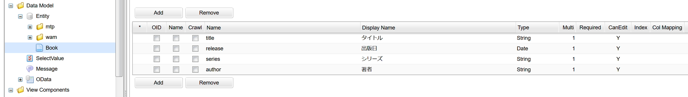

[[OData]]
==  [.eeonly]#OData#
Entityデータの参照が可能なODataサービスエンドポイントおよび、ODataで連携するEntityデータの公開設定を登録/管理する為の機能を提供します。

=== OData定義

==== OData定義の作成
ODataアイコンを右クリックして「ODataを作成する」を選択してください。 +
作成時にODataで連携するEntityデータの公開タイプ(ODataType)を選択してください。

==== ODataサービス
作成されたOData定義は、ODataサービス（OData準拠のRESTエンドポイント）のリソース（エンティティ セット）として公開されます。 +

OData定義の `Name` が、ODataのリソースパスになります。 `/` 区切りで階層化可能です。 +
例えば、Nameを `path1/testResource` と定義した場合、ODataのリソースパスは以下の様になります。

[source,url]
----
http(s)://[server]/[tenantContextPath]/api/mtp/odata/path1/testResource
----

また、ODataサービスは、OData定義の階層パス毎に定義されます。各ODataサービスのサービスルートURLは以下の通りです。 +

[source,url]
----
http(s)://[server]/[tenantContextPath]/api/mtp/odata/[OData定義の階層パス]/
----

.（例）
下図のOData定義を例にした場合、`path1階層` のサービスルートURLは、以下の通りです。

[source,url]
----
http(s)://[server]/[tenantContextPath]/api/mtp/odata/path1/
----

上記URLのODataサービスでは、`path1階層` に存在するOData定義のみ(TestCube1、TestEntity1、TestEQL1)がリソースとして公開され、その他の階層に存在するOData定義(TestCube、TestEntity2等)は公開されません。

各ODataサービスのサービスドキュメントを以下のエンドポイントから取得可能です。
[cols="2", options="header"]
|===
|URL|説明
|GET /api/mtp/odata/[OData定義の階層パス]/
|指定した階層パスのODataサービスにおいて、取得可能な全てのエンティティ セットを示すサービスドキュメントを返却します。
|GET /api/mtp/odata/[OData定義の階層パス]/$metadata
|指定した階層パスのODataサービスにおいて、取得可能な全てのエンティティ セットのデータ構造および操作を示すメタデータドキュメントを返却します。
|===

==== 設定

===== 共通項目

設定可能な項目は以下の通りです。
[cols="2", options="header"]
|===
|設定項目|設定内容
|ODataType a|Entityデータの公開タイプを `ENTITY`, `CUBE`, `EQL` から選択します。 +
OData定義作成時のダイアログでのみ選択可能です。

ENTITY:: Entity定義を指定し、公開対象とする。
CUBE:: Cubeの集計対象データを公開対象とする。
EQL:: 指定したEQLの実行結果を公開対象とする。
|===

===== ENTITY
Entity定義を指定し、公開対象とするタイプ。 +
設定可能な項目は以下の通りです。

[cols="2", options="header"]
|===
|設定項目|設定内容
|Entity|公開対象とするEntity定義を選択してください。
|PrimaryKey a|エンティティ タイプ(OData)のキーとなるプロパティを選択してください。

* 基本となるキープロパティは `oid` ですが、それ以外のプロパティも選択可能です。

CAUTION: `oid` 以外のプロパティを選択する場合、必須項目かつ値が対象のEntity内で一意となるプロパティを選択してください。

|Published Property|選択したEntity定義の各プロパティに対する公開設定です。詳しい設定内容は <<published_property>> を参照してください。

|Navigation Property|選択したEntity定義のReference型プロパティをODataの `Navigation Property` として公開する為の設定です。詳しい設定内容は <<navigation_property>> を参照してください。
|===

[[published_property]]
====== Published Property
[cols="2", options="header"]
|===
|設定項目|説明
|Publish|プロパティを公開するか否かを設定します。チェックを入れたプロパティが公開対象となります。デフォルトでは、いずれのプロパティにもチェックが入っていません。
|Property a|プロパティ名が表示されます。 `編集不可` 。
|Publishing Name a|エンティティ タイプ（OData）のプロパティ名を設定します。設定しない場合、 `Property` の値が使用されます。
|===

[[navigation_property]]
====== Navigation Property
[cols="2", options="header"]
|===
|設定項目|説明
|Property a|プロパティ名が表示されます。 `編集不可` 。
|Display Name a|ODataのNavigation Property名を設定します。設定しない場合、 `Property` の値が使用されます。
|OData Reference|参照先Entityの公開設定を行ったOData定義を選択してください。指定しない場合は、該当のReference型プロパティはNavigation Propertyとして公開されません。
|===

* 以下のエンドポイントが利用可能です。
[cols="2", options="header"]
|===
|URI|説明
|GET /api/mtp/odata/[OData定義名]
|OData定義で指定したEntity定義の全てのEntityデータを返却する

|GET /api/mtp/odata/[OData定義名]('[キー値]')
|キー指定で特定のEntityデータをロード

|GET /api/mtp/odata/[OData定義名]('[キー値]')/[Navigation Property名]
|キー指定で特定のEntityデータのNavigation Property（参照先のEntityデータ）をロード
|===

===== CUBE
Cubeの集計対象データをソースとして、公開対象とするタイプ。 +
設定可能な項目は以下の通りです。

[cols="2", options="header"]
|===
|設定項目|設定内容
|CubeName|対象とするCube定義を選択してください。
|PrimaryKeyName|Cubeのキーとなるプロパティ名を指定します。
|ItemList|選択したCube定義の `Cube Item` に関する公開設定です。詳しい設定内容は <<item_list>> を参照してください。
|===

[[item_list]]
====== ItemList
[cols="2", options="header"]
|===
|設定項目|説明
|Publish|Cube Itemを公開するか否かを設定します。チェックを入れたCube Itemが公開対象となります。
デフォルトでは、いずれのCube Itemにもチェックが入っていません。
|Nullable|Cube Itemがnullableな場合にチェックを入れます。
|Multiple|Cube Itemの多重度が複数の場合にチェックを入れます。
|Item a|Cube Item名が表示されます。 `編集不可` 。
|Publishing Name a|エンティティ タイプ（OData）のプロパティ名を設定します。設定しない場合、`Item` の値が使用されます。
|===

CAUTION: 対象のCube定義でHashKeyに指定したアイテムの欄は、必ず `Publish` にチェックを入れてください。また、 `Nullable` にはチェックを入れないでください。

* 以下のエンドポイントが利用可能です。
[cols="2", options="header"]
|===
|URI|説明
|GET /api/mtp/odata/[OData定義名]
|指定したCubeの集計対象データをソースとして、設定内容に基づきEntityデータを返却する
|===

===== EQL
指定したEQLの実行結果を公開対象とするタイプ。 +
設定可能な項目は以下の通りです。

[cols="2", options="header"]
|===
|設定項目|設定内容
|EQL TEMPLATE|実行するEQLをGroovyTemplate書式を利用して指定します。
|PrimaryKeyName|ODataエンティティ タイプのキーとなるプロパティ名を指定します。
|PropertyGrid| ODataエンティティ タイプのプロパティとEQLの実行結果の紐づけ設定です。 `Add Property` 、 `Delete Property` を押下して、必要に応じて項目を追加、削除してください。編集したい列をクリックすると編集ができます。詳しい設定内容は <<property_grid>> を参照してください。
|===

[[property_grid]]
====== PropertyGrid
[cols="2", options="header"]
|===
|設定項目|設定内容
|Nullable|プロパティがnullableな場合に設定します。
|Multiple|プロパティの多重度が複数の場合に設定します。
|Name|ODataプロパティに紐づけるプロパティ名（EQLのSELECT句に指定したカラム名、Entityのプロパティ名、演算式、ファンクション式、またはリテラル）を指定してください。
|Publishing Name a|エンティティ タイプ（OData）のプロパティ名を設定します。設定しない場合、 `Name` の値が使用されます。
|Type|ODataプロパティのデータ型を選択します。
|===

CAUTION: `PrimaryKeyName` に設定したプロパティは、必ず `PropertyGrid` で公開する様に設定してください。また、 `Nullable` にチェックを入れないでください。

* 以下のODataエンドポイントを利用可能です。
[cols="2", options="header"]
|===
|URI|説明
|GET /api/mtp/odata/[OData定義名]
|指定したEQLの実行結果に基づくEntityデータを返却する
|===

=== Queryオプション
iPLAssで対応しているODataの `Query Options` は以下の通りです。

[cols="2", options="header"]
|===
|コマンド|説明
| $filter| 	結果 (行) をフィルターします。iPLAssで対応している論理演算子については、 <<query_filter>>を参照してください。
| $orderby + 
※ `CUBE` は対応していません。| 結果を指定した並び順でソートします。
| $top| 指定した個数のデータを返却します。
| $skip| 	指定した個数のデータを結果から除外します。
| $expand +
※ `CUBE`、`EQL` は対応していません。| Navigation Propertyで関連づけられたエンティティセットを一緒に返却します。

Navigation Propertyで関連付けされるReferenceプロパティの多重度が複数の場合について、現時点においては対応していません。
| $select| 指定したプロパティのみを返却します。
| $search| 検索条件(フリーテキスト)の単語を指定し、条件に一致した結果を返却します。全てのODataプロパティが検索の対象です。
|===

[[query_filter]]
==== $filter

対応している論理演算子は以下の通りです。

[cols="2", options="header"]
|===
|パラメータ| 論理演算子
|eq| =
|ne| !=
|gt| >
|ge| >=
|lt| <
|le| \<=
|add| +
|sub| -
|mul| *
|div| /
|===

NOTE: mod演算子は未対応です。

=== 利用例
以下では、各ODataTypeの利用例を説明します。

* Entity
+
全ての利用例で共通して用いる動作確認用のEntity定義(Book)を登録します。

==== ENTITY
ODataTypeに `ENTITY` を指定する場合の利用例です。

* OData定義
+
ODataTypeに `ENTITY` を指定してOData定義を作成し、Entity欄に先ほど作成したEntity定義(Book)を指定します。 +
また、公開したいPropertyについては、 <<published_property>> の `Publish` 欄にチェックを入れます。

image::images/odata/OData_Sample_Definition_Entity.png[]

* 動作確認
+
以下のURLにリクエストすると、指定したOData定義に従ってEntityデータを取得できることが確認できます。 +
[source,url]
----
http(s)://[server]/[tenantContextPath]/api/mtp/odata/BookEntity
----

&emsp;&ensp;また、以下の様に <<Queryオプション>> を利用して、データを取得することも可能です。 +
[source,url]
----
// titleの昇順で並び替え、上位5件のデータを取得する
http(s)://[server]/[tenantContextPath]/api/mtp/odata/BookEntity?$orderby=title&$top=5
----

NOTE: 全てのODataTypeにおいて、Personal Access Tokenを利用し、ODataエンドポイントへアクセス時にBearer Tokenによる認証を行うことが可能です。 +
Personal Access Tokenについては <<../genericentitymanager/topview/index.adoc#appmaintenance, Application Maintenance>>を参照してください。 

===== Navigation Property 

以下では、Navigation Propertyを用いて、参照関係にあるEntityデータを取得する例を説明します。

* Entity（参照元）
+
共通で用いるEntity定義(Book)を参照する、新たなEntity定義(Person)を作成します。

* OData定義（参照元）
+
OData定義を作成し、Entity欄に先ほど作成したEntity定義(Person)を指定します。 +
 <<navigation_property>> の `Publishing Name` 欄にNavigation Property名を、`OData Reference` 欄 に参照先Entity(Book)の公開設定を行ったOData定義名を指定してください。

* 動作確認
+
以下のURLにリクエストすると、参照関係にあるEntityデータの取得が可能です。 +
[source,url]
----
http://hostname:port/{コンテキスト名}/{テナント名}/api/mtp/odata/PersonEntity('キー値')/Book
----

&emsp;&ensp;また、 <<Queryオプション>> の$expandを利用して、参照元のEntityデータとNavigation Propertyで関連づけられた参照先のEntityデータを一緒に取得することが可能です。 +
[source,url]
----
http://hostname:port/{コンテキスト名}/{テナント名}/api/mtp/odata/PersonEntity('キー値')?$expand=Book
----

==== CUBE
ODataTypeに `CUBE` を指定する場合の利用例です。

* Cube定義
+
動作確認用のCube定義を作成します。

* OData定義
+
OData定義を作成し、CubeName欄に先ほど作成したCube定義（Book）を指定します。
公開したいItemについては、 <<item_list>> の `Publish` 欄にチェックを入れます。必要に応じて、NullableとMultipleの設定を行います。

* 動作確認
+
以下のURLにリクエストすると、指定したOData定義に従ってEntityデータを取得できることが確認できます。 +
[source,url]
----
http://hostname:port/{コンテキスト名}/{テナント名}/api/mtp/odata/BookCube
----

==== EQL
ODataTypeに `EQL` を指定する場合の利用例です。

* OData定義
+
OData定義を作成し、 `EQL TEMPLATE` に実行したいEQLを指定します。 +
`PrimaryKeyName` にエンティティ タイプ(OData)のキーとなるプロパティ名を入力します。
<<property_grid>>で、EQLの実行結果とODataエンティティ タイプの紐づけ設定を行います。

* 動作確認
+
以下のURLにリクエストすると、指定したOData定義に従ってEntityデータを取得できることが確認できます。 +
[source,url]
----
http://hostname:port/{コンテキスト名}/{テナント名}/api/mtp/odata/BookEql
----
