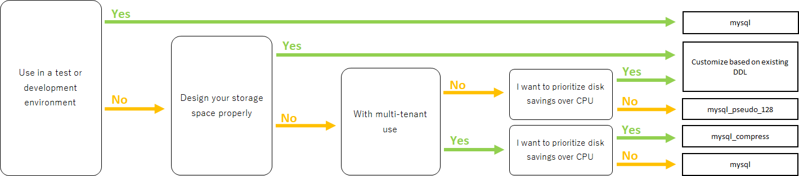
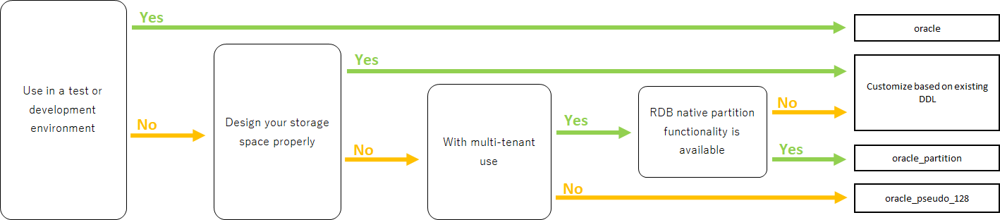
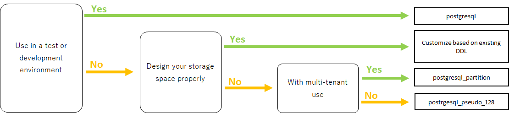
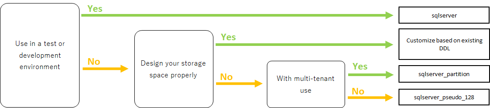
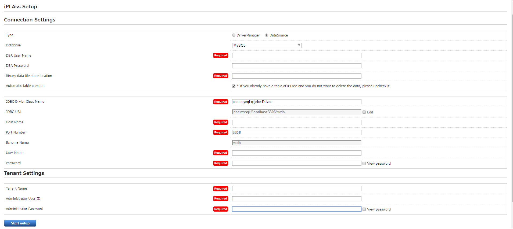

= Environment Settings
:_hreflang-path: environment/index.html
:toclevels: 2

== Operating Environment

=== iPLAss Framework

[cols="1,4"]
|===
|Java|Java 21 or higher
|AP Server|Tomcat 10.1 (web container implementing Servlet 6.0 and JSP 3.1 or higher)
|DB Server|Oracle 19c or higher, MySQL 8.0 or higher, PostgreSQL 12 or higher, SQL Server 2016 or higher (*1), Amazon Aurora (*2)
|===

※1::
SQL Server has the following limitation.
+
====
- Cannot use LOCALTIME variable for EQL.
====
※2::
For Aurora, please make sure to use the original JDBC Driver for MySQL.

==== Supported Browsers

Google Chrome, Safari, Mozilla Firefox, Microsoft Edge

=== Web Account Manager Plugin Module

[cols="1,4"]
|===
|Apache Module|Apache HTTP Server 2.4
|IIS Module|IIS 8.5 or higher +
.Above NET 4.5.1 +
Windows Server 2012R2 or later
|JavaEE Module|Java 21 or higher +
Tomcat 10.1 (web container implementing Servlet 6.0 and JSP 3.1 or higher)
|Serverless(JavaScript) Module|A serverless environment that provides a JavaScript runtime that supports the Fetch API (edge ​​environment that operates in front of a CDN, etc.)
|===

== DB, Creating the Tables
The guide manual for setting up DB and creating the tables for iPLAss can be found from the downloaded link:https://iplass.org/downloads/[iPLAss SDK^]. Please refer to the readme_setup.txt inside the bundles (iplass-server-setup-kit).

Beware that the transaction isolation has to be set to [READ COMMITTED].

=== Oracle
- Please set the Database Character set to [AL32UTF8].

=== MySQL
- Please set the character Encoding to [utf8mb4].
- It is recommended to set collation to [utf8mb4_bin]
+
====
About collation::
Set [utf8mb4_bin] for Case-Sensitive collation and +
[utf8mb4_general_ci] for Case-Insensitive.
====

=== PostgreSQL
- Please set the Character Encoding to [UTF8].

=== SQL Server
- Please select [Japanese_Unicode_CI_AS_KS_WS] as the database collation.

== Notes about Constructing the Environment

=== DB Server Related

==== Inheriting service-config
Please inherit the service-config file corresponding to the DB in use.

[cols="1,3", options="header"]
|===
| DB | service-config File
| Oracle | mtp-core-service-config-oracle.xml
| MySQL 8.0 or higher | mtp-core-service-config-mysql.xml
| MySQL 5.7 | mtp-core-service-config-mysql-5.7.xml
| PostgreSQL | mtp-core-service-config-postgre.xml
| SQL Server | mtp-core-service-config-sqlserver.xml
|===

[CAUTION]
====
If you use DDL to create pseudo-partitions when creating tables, you must use the corresponding service-config file. +
See link:../serviceconfig/index.html#splitting_the_service_config_file[Splitting the service-config File] for more information.
====

[source,xml,caption="",title="Example: When using Oracle DB"]
----
<serviceDefinition>
  <inherits>/mtp-core-service-config-oracle.xml</inherits>
</serviceDefinition>
----

==== Pseudo-Partition
When using a Pseudo-Partition, it is possible to respond by creating a pseudo table and making the following settings in mtp-service-config.xml. +
The targeting table can be found from the <<ref_storage_change_target_tables, List of the tables when changing storage Destination>>.

[source,xml,caption="",title="Example: Adding some content at *1"]
----
<service>
  <interface>org.iplass.mtp.impl.datastore.StoreService</interface>
  <property name="dataStore" class="org.iplass.mtp.impl.datastore.grdb.GRdbDataStore">
    <property name="storageSpace">
      <property name="tableCount" value="3" /> <1>
      <property name="storageSpaceName" value="default" />
      <property name="varcharColumns" value="128" />
        :
    </property>
  </property>
</service>
----

■Naming Convention::
TableName＋__＋IncrementValue
+
[caption="",title="Example: if tableCount is 3"]
====
OBJ_STORE, OBJ_STORE\__1、OBJ_STORE__2
====

==== Changing Storage Destination
In iPLAss, all entities are registered in the same table. If a specific entity has a large amount of data, it is possible to register that entity specifically in another physical table. +
If you want to change the storage destination table, create the table to store the data and make the following changes in mtp-service-config.xml. +
The targeting table can be found from the <<ref_storage_change_target_tables, List of the tables when changing storage Destination>>.

[source,xml,caption="",title="Example: Adding *1 and *2, the example of adding spaces called securespace and fast."]
----
<service>
  <interface>org.iplass.mtp.impl.datastore.StoreService</interface>
  <property name="dataStore" class="org.iplass.mtp.impl.datastore.grdb.GRdbDataStore">
    <property name="storageSpace"> <1>
      <property name="storageSpaceName" value="securespace" />
      <property name="tableNamePostfix" value="S" />
      <property name="varcharColumns" value="128" />
        :
    </property>
    <property name="storageSpace"> <2>
      <property name="storageSpaceName" value="fast" />
      <property name="tableNamePostfix" value="FAST" />
      <property name="varcharColumns" value="128" />
        :
    </property>
      :
  </property>
</service>
----

■Naming Convention::
TableName＋__＋tableNamePostfixValue
+
[caption="",title="Example: if tableNamePostfix value is [s]"]
====
OBJ_STORE__S
====

[[ref_storage_change_target_tables]]
==== List of the tables when changing storage Destination
[cols="^1,5",format="dsv",options="header",caption="",title="The targeting tables when performing Pseudo-Partition and when changing Storage Destination.",width="50%"]
|===
No: TableName
1:OBJ_STORE
2:OBJ_STORE_RB
3:OBJ_REF
4:OBJ_REF_RB
5:OBJ_INDEX_DATE
6:OBJ_INDEX_DBL
7:OBJ_INDEX_NUM
8:OBJ_INDEX_STR
9:OBJ_INDEX_TS
10:OBJ_UNIQUE_DATE
11:OBJ_UNIQUE_DBL
12:OBJ_UNIQUE_NUM
13:OBJ_UNIQUE_STR
14:OBJ_UNIQUE_TS
|===

Table definitions can be created in link:../developerguide/support/index.html#custom_storage_space[Batch Tools - Custom Storage Space].

==== Standard provided DDL
iPLAss provides the following DDLs as standard for each purpose. +
These DDLs are defined with the minimum necessary indexes and partitions.
In a production environment, consider adding and organizing indexes and other performance tuning, taking into consideration the data volume and business characteristics of the target system, and then decide whether to use it as is or customize it. +
When customizing, please refer to link:../developerguide/datamanagement/index.html#ref_storagespace[StorageSpace], which describes how iPLAss data management works.

[cols="1,3a", options="header"]
|===
| DB | Types of DDL
| MySQL |  [cols="1,4a", options="header"]
!===
! Storage folder ! explanation
! mysql ! This is a DDL that generates a table that applies DB native partitioning (composite partitioning of RANGE of tenant ID and LINEAR KEY of Entity definition ID) to the default storage space where Entity data is stored.
! mysql_compless ! This is a DDL that generates a table with page compression applied to a table that is considered to be effective by applying page compression to the mysql DDL.

CAUTION: Although you can expect to save data space and improve search speed, you need to consider the CPU load for decompressing compressed data.
! mysql_pseudo_128 ! This is a DDL that creates 128 pseudo-partitioned tables in the default storage space where Entity data is stored.
If you create a table with this DDL, specify `mtp-core-service-config-mysql_pseudo_128.xml` for the inherited service-config.
! aurora_mysql ! It is available as an additional option when using Amazon Aurora MySQL.
Used when using version 2 or earlier and using parallel query (unnecessary for version 3 or later).

CAUTION: This folder does not contain any DDL files. You need to build a DB environment in advance using one of the above DDLs.
!===
| Oracle | [cols="1,4a", options="header"]
!===
! Storage folder ! explanation
! oracle ! This is a DDL that generates the default storage space where Entity data is stored as a simple single table.
! oracle_partition ! This is a DDL that generates a table with DB native partitioning (composite partitioning of RANGE of tenant ID and HASH of Entity definition ID) applied to the default storage space where Entity data is stored.

CAUTION: Partitioning functionality is currently available only with Oracle Database Enterprise Edition.
! oracle_pseudo_128 ! This is a DDL that creates 128 pseudo-partitioned tables in the default storage space where Entity data is stored.
If you create a table with this DDL, specify `mtp-core-service-config-oracle_pseudo_128.xml` for the inherited service-config.
! oracle_pseudo ! Used when using the pseudo partition function. The basic role is the same as oracle_pseudo_128.

CAUTION: Please do not use it, as it will be removed in a future version.
!===
| PostgreSQL | [cols="1,4a", options="header"]
!===
! Storage folder ! explanation
! postgresql ! This is a DDL that generates the default storage space where Entity data is stored as a simple single table.
! postgresql_partition ! This is a DDL that generates a table with DB native partitioning (composite partitioning of RANGE of tenant ID and HASH of Entity definition ID) applied to the default storage space where Entity data is stored.
! postgresql_pseudo_128 ! This is a DDL that creates 128 pseudo-partitioned tables in the default storage space where Entity data is stored.
If you create a table with this DDL, specify `mtp-core-service-config-postgresql_pseudo_128.xml` for the inherited service-config.
! postgresql_pseudo ! Used when using the pseudo partition function. The basic role is the same as postgresql_pseudo_128.

CAUTION: Please do not use it, as it will be removed in a future version.
!===
| SQL Server | [cols="1,4a", options="header"]
!===
! Storage folder ! explanation
! sqlserver ! This is a DDL that generates the default storage space where Entity data is stored as a simple single table.
! sqlserver_partition ! This is a DDL that generates a table that applies DB native partitioning (partitioning using tenant ID as partitioning column) to the default storage space where Entity data is stored.
! sqlserver_pseudo_128 ! This is a DDL that creates 128 pseudo-partitioned tables in the default storage space where Entity data is stored.
If you create a table with this DDL, specify `mtp-core-service-config-sqlserver_pseudo_128.xml` for the inherited service-config.
! sqlserver_pseudo ! Used when using the pseudo partition function. The basic role is the same as sqlserver_pseudo_128.

CAUTION: Please do not use it, as it will be removed in a future version.
!===
|===

NOTE: The DDL file is included in the appropriate folder of the server setup kit (iplass-server-setup-kit) included in link:https://iplass.org/downloads/[iPLAss SDK^].

==== About DDL used during setup
If you cannot decide which DDL file to use, please refer to the chart below when making your selection.

===== For MySQL

===== For Oracle

===== For PostgreSQL

===== For SQL Server

==== Settings of Lock Timeout
The timeout threshold to wait for a rowlock, the default value is 0(NOWAIT).

■Oracle::
To enable and change the lock timeout threshold, please configure the following item from mtp-service-config.xml and set it to a value larger than 0.
+
[source,xml]
----
<service>
  <interface>org.iplass.mtp.impl.rdb.adapter.RdbAdapterService</interface>
  <property name="adapter" class="org.iplass.mtp.impl.rdb.oracle.OracleRdbAdapter">
    <property name="lockTimeout" value="0" />
  </property>
</service>
----

■MySQL::
MySQL sets the lock timeout threshold in unit of DB, therefore it behaves differently from Oracle DB. For instance, the logic like [select for update nowait] will rise error right after retrieving the lock with Oracle, but the same thing will not happen in MySQL.

■PostgreSQL::
To enable and change the lock timeout threshold,please configure the following item in mtp-service-config.xml and set it to something larger than 0.
PostgreSQL cannot specify the waiting time for the lock. If timeout was set to value larger than 0, the system will wait until acquiring the lock.
+
[source,xml]
----
<service>
  <interface>org.iplass.mtp.impl.rdb.adapter.RdbAdapterService</interface>
  <property name="adapter" class="org.iplass.mtp.impl.rdb.postgresql.PostgreSQLRdbAdapter">
    <property name="lockTimeout" value="0" />
  </property>
</service>
----

■SQL Server::
To enable and change the lock timeout threshold, please change the following items from mtp-service-config.xml and set it to a value larger than 0.
+
[source,xml]
----
<service>
  <interface>org.iplass.mtp.impl.rdb.adapter.RdbAdapterService</interface>
  <property name="adapter" class="org.iplass.mtp.impl.rdb.sqlserver.SqlServerRdbAdapter">
    <property name="lockTimeout" value="0" />
  </property>
</service>
----

==== Oracle's Unique Settings
* About the wildcard in LIKE expressions +
Starting from 11.2.0.3.0, the feature of the wildcard in LIKE expression has changed. +
Since then, full Width ％ and ＿ are not wildcard anymore, they will be perceived as normal character. +
To solve the compatibility issue for older versions due to this changes, we provided a escapeFullwidthWildcard flag in OracleRdbAdapter. +
The default value is false (as 11.2.0.3.0 or higher has no such problem). +
Say, if you are using 11.2.0.2.0, then you should set this flag to true. +
+
[source,xml,caption=""]
----
<service>
  <interface>org.iplass.mtp.impl.rdb.adapter.RdbAdapterService</interface>
  <property name="adapter" class="org.iplass.mtp.impl.rdb.oracle.OracleRdbAdapter">
    <property name="escapeFullwidthWildcard" value="true" />
  </property>
</service>
----

==== MySQL's Unique Settings

* Storage Engine: InnoDB, which require the File Format: Barracuda(with innodb_large_prefix)
+
====
Storage Engine:: InnoDB
File Format:: Barracuda
====
producing you have enabled innodb_large_prefix.

NOTE: For MySQL Version 5.7.7 or higher, the configuration about ``innodb_large_prefix`` is not needed anymore.

* Pleas use [utf8mb4] as the standard character set.
+

+
However, the following restrictions occur when using this character code.

- If "Unique Index" or "Index" is specified in the String property of the Entity, there will be restrictions on the target value size depending on the character code used by MySQL.
- In the case of utf8mb4, if a value exceeding 255 characters is set in the StringProperty value, an error will rise when updating.

+
The character set can be specified as follows in the option file (my.ini / cnf).

[source,ini]
----
[client]
default-character-set=utf8mb4
[mysql]
default-character-set=utf8mb4
[mysqld]
character-set-server=utf8mb4
----

* Disable the query cache +
When query cache is enabled, the table will be locked when writing in.
Updating with time consuming tasks may affect the process form other sessions. So it is necessary to disable query cache.
+
[source,ini]
----
[mysqld]
query_cache_size=0
----

NOTE: For MySQL8.0.1 or higher, this setting is not required anymore.

* Set the storage destination for LOB data +
For MySQL, it is recommended to store LOB data outside RDB. LOB can be stored in the file system, or in the [.eeonly]#AWS S3# storages.
Then it is necessary to change the storage destination, please refer to the part of <<lob_store_dest, LOB Storage Destination>>.

* Using GTID +
To use GTID for group replications, the configuration about temporary table is necessary. +
Under the standard of iPLAss, the temporary tables are created and deleted inside the transactions. However, in the case of GTID, it is impossible to create or delete temporary tables inside the transaction.
Therefore, iPLAss provides the options to perform the creation and deletion of temporary tables outside the transactions, or on the data source side.

+
[source,xml]
.Create/Delete outside the transactions
----
<service>
  <interfaceName>org.iplass.mtp.impl.rdb.adapter.RdbAdapterService</interfaceName>
  <property name="adapter" className="org.iplass.mtp.impl.rdb.mysql.MysqlRdbAdaptor">
    <property name="localTemporaryTableManageOutsideTransaction" value="true" />
  </property>
</service>
----
+
[source,xml]
.Create/Delete on the data source side
----
<service>
  <interfaceName>org.iplass.mtp.impl.rdb.adapter.RdbAdapterService</interfaceName>
  <property name="adapter" className="org.iplass.mtp.impl.rdb.mysql.MysqlRdbAdaptor">
    <property name="localTemporaryTableCreatedByDataSource" value="true" />
  </property>
</service>
----
+
When initializing the connection (session) on the data source side, please execute the following SQL command.
+
[source,sql]
----
CREATE TEMPORARY TABLE `obj_store_tmp` (`obj_id` VARCHAR(64) NOT NULL, `obj_ver` BIGINT(10) DEFAULT 0 NOT NULL) ENGINE = MEMORY;
----

* Settings of internal temporary table +
Starting from MySQL5.7, the storage engine for the internal temporary table is by default``InnoDB``.
For this reason, when using internal temporary tables, there could be errors because of exceeding size. +
This issue can be avoided by switching the storage engine to ``MyISAM``.
+
[source,ini]
----
[mysqld]
internal_tmp_disk_storage_engine=MyISAM
----

NOTE: For MySQL8.0.16 or higher version, this setting is not required.

* Importing Timezone Data +
It is necessary to import timezone data for the system.
For more about importing the timezone, please refer to the MySQL timezone https://dev.mysql.com/downloads/timezones.html[Download Site].

* specifying the timezone +
Connector/J 8.0 or higher require this timezone settings. +
For Windows environment, the system timezone is not employed by MySQL, so it is mandatory to specify the timezone for MySQL. +
For Linux, the system timezone can be utilized by MySQL, therefore there is no need to specify the timezone except changing to a different timezone.
+
There are 3 way to specify the timezone, which are listed below.
+
- Specify by the environment variable [TZ].(recommended) +
Example::
TZ=JST-9

- Specify by the JDBC parameter [serverTimezone].
Example::
jdbc:mysql://<mysqlserver>:3306/mtdb?serverTimezone=Asia%2FTokyo

- Specify by MySQL config files +
The timezone features have to be imported to MySQL beforehand.
Example::
+
[source,ini]
----
[mysqld]
default-time-zone='Asia/Tokyo'
----

IMPORTANT: The specified timezone have to be similar to the timezone of the AP Server.(more accurate:JRE).

* Settings to support window functions +
For MySQL8.0 or higher version, MySQL can use the native window function.
In order to utilize MySQL native Window function feature, the following settings are required.
+
[source,xml]
----
<service>
  <interface>org.iplass.mtp.impl.rdb.adapter.RdbAdapterService</interface>
  <property name="adapter" class="org.iplass.mtp.impl.rdb.mysql.MysqlRdbAdaptor">
    <property name="supportWindowFunction" value="true" />
  </property>
</service>
----
+
To access the window function feature using the version older than MySQL5.7 (which does not support such feature)), please enable the [.eeonly]#Window function emulator mechanics#. +
To enable window function emulator, please perform the following settings.
+
[source,xml]
----
<service>
  <interface>org.iplass.mtp.impl.datastore.StoreService</interface>
  <property name="dataStore" class="org.iplass.mtp.impl.datastore.grdb.EnterpriseGRdbDataStore">
    <property name="enableWindowFunctionEmulation" value="true" />
  </property>
</service>
----

* Settings for using decimal places +
When using the Decimal type as the property type of Entity or the DIV operator in EQL, set the MySQL system variable `div_precision_increment` to the fifth decimal place. +
Even if the Decimal type does not use the DIV operator, it is necessary to set `div_precision_increment` since iPLAss automatically performs DIV to adjust the number of digits internally.

==== PostgreSQL's Unique Settings
* Settings of LOB data storage destination +
For PostgreSQL, it is recommended to store the LOB data outside the RDB system. LOB data can be stored in the file system, or in the [.eeonly]#AWS S3# storages.
To do so, the storage destination should be changed, please refer to the part of <<lob_store_dest, LOB Storage Destination>>.

=== AP Server Related

==== DB Connection
* Settings of connection pool +
In order to config about connection pool, please configure the following items in mtp-service-config.xml.
+
[source,xml]
----
<service>
  <interface>org.iplass.mtp.impl.rdb.connection.ConnectionFactory</interface>
  <class>org.iplass.mtp.impl.rdb.connection.DataSourceConnectionFactory</class>
  <property name="dataSourceName" value="java:comp/env/yourDataSource" />
</service>
----
+
※Set the name of your data source to yourDataSource
+
Also set the data source on the AP server side.
(In the case of Tomcat, set the above data source in Context.xml)
+

* Recommended value for maximum connection pool size [[max_connection_pool_setting]] +
To avoid deadlocks in the connection pool, it is recommended to set the maximum pool size to at least the following value.
+
----
(Tomcat's maximum number of threads) × (Maximum number of connections allocated per thread - 1) + 1 + Number of connections allocated to non-Tomcat threads (such as asynchronous commands)
----
+
In iPLAss, with each thread able to handle up to 2 connections under normal operations, the suggested maximum pool size should be at least the following value.
+
----
(Tomcat's maximum number of threads) + 1 + Number of connections allocated to non-Tomcat threads (such as asynchronous commands)
----
+
.Example Configuration for HikariCP
[source,xml]
+
----
<service>
	<interface>org.iplass.mtp.impl.rdb.connection.ConnectionFactory</interface>
	<class>org.iplass.mtp.impl.rdb.connection.DataSourceConnectionFactory</class>

	<property name="dataSource" class="com.zaxxer.hikari.HikariDataSource">
		<property name="jdbcUrl" value="jdbc:mysql://server:3306/mtdb" />
		<property name="username" value="user" />
		<property name="password" value="pass" />
		<property name="maximumPoolSize" value="100" />
		<property name="minimumIdle" value="10" />
	</property>
</service>
----

==== Web Client Information
* Bypass setting towards JavaServlet environment of web client information +
This setting is to let web client to bypass the JavaServlet environment, when there is Proxy such as HTTP server at the frontal end of AP Server.
+
For the environment of iPLAss,
+
====
ServletRequest#getRemoteAddr() +
ServletRequest#isSecure()
====
+
are utilized. At least, these information should have bypass setting configured.
+
Note when using Tomcat,
+
====
org.apache.catalina.valves.RemoteIpValve
====
+
are used to configure the bypass settings. +
Also, for "isSecure", if all connections are received via HTTPS (and it is SSL terminated by the frontal load balancer), it can be set in the Connector settings.
+

==== Static Contents
* Root path settings for static contents +
If you want to map WebApplicaton name (=war name) into another name by setting the proxy server such as Apache, then this root path should also be changed.
If not set, servletContextPath will be used as the root path for static content.
+
[source,xml]
----
<service>
  <interface>org.iplass.mtp.impl.web.WebFrontendService</interface>
  <class>org.iplass.mtp.impl.web.WebFrontendService</class>
  <property name="staticContentPath" value="/static" />
</service>
----

==== File Uploads
* Temporary storage destination when uploading files +
The place to store the temporary objects when uploading files can be specified.
+
[source,xml]
----
<service>
  <interface>org.iplass.mtp.impl.web.WebFrontendService</interface>
  <class>org.iplass.mtp.impl.web.WebFrontendService</class>
  <property name="tempFileDir" value="/tmp" />
</service>
----
+
Please beware that Without above setting items, the system will use the directory specified by "jakarta.servlet.context.tempdir" from Servlet settings, this may cause the system to store data in unwanted directory.

* Size limit for upload files +
It is possible to restrict the size limit for the files to be uploaded.
+

+

+
The maximum size for the upload files can be configured at mtp-service-config.xml.
+
[source,xml]
----
<service>
  <interface>org.iplass.mtp.impl.web.WebFrontendService</interface>
  <class>org.iplass.mtp.impl.web.WebFrontendService</class>
  <property name="maxUploadFileSize" value="10000" />
</service>
----
+

* Magic byte check for upload file +
If you want to register the file without checking the magic byte (whether the file extension matches the file contents), you can set the following to false. +
(Depending on how the file is created, this magic byte check may rise error even if the file is correct.) +
+
[source,xml]
----
<service>
  <interface>org.iplass.mtp.impl.web.WebFrontendService</interface>
  <class>org.iplass.mtp.impl.web.WebFrontendService</class>
  <property name="isExecMagicByteCheck" value="false" />
</service>
----
+

+

[[lob_store_dest]]
==== LOB Storage Destination
* Settings of LOB Storage Destination +
The data for Binary type and LongText type can be stored either in files, in RDB(as binary data such as BLOB), or in [.eeonly]#AWS S3# storage. +
To change the method to store the data, please do the following configurations. +
+
====
To store in RDB, specify org.iplass.mtp.impl.lob.lobstore.rdb.RdbLobStore +
To store in files, specify org.iplass.mtp.impl.lob.lobstore.file.FileLobStore +
To store in AWS S3, specify org.iplass.mtp.impl.aws.lobstore.s3.S3LobStore
====
+
CAUTION: If the RDB in the context is MySQL or PostgreSQL, we recommend to use FileLobStore or S3LobStore for binaryStore.
As when the DB was accessed via JDBC, the binary data will be processed as data stream, which may cause OutOfMemoryError.
+
[source,xml]
.Example 1
----
<service>
  <interface>org.iplass.mtp.impl.lob.LobStoreService</interface>
  <property name="binaryStore" class="org.iplass.mtp.impl.lob.lobstore.file.FileLobStore">
    <property name="rootDir" value="D:\tmp\fileLobStore" />
  </property>
  <property name="longTextStore" class="org.iplass.mtp.impl.lob.lobstore.rdb.RdbLobStore" />
</service>
----
With this setting, Binary type data is saved in the files under the path of "D:\tmp\fileLobStore" folder, while LongText type data is saved in the DB.
+
[source,xml]
.Example 2
----
<service>
  <interface>org.iplass.mtp.impl.lob.LobStoreService</interface>
  <property name="binaryStore" class="org.iplass.mtp.impl.aws.lobstore.s3.S3LobStore">
    <property name="region" value="ap-northeast-1" />
    <property name="endpoint" value="s3.ap-northeast-1.amazonaws.com" />
    <property name="bucketName" value="yourBucketName" />
  </property>
  <property name="longTextStore" class="org.iplass.mtp.impl.lob.lobstore.rdb.RdbLobStore" />
</service>
----
+
With this setting, Binary type data will be stored in the bucket called yourBucketName in ap-northeast-1 region of S3.

==== Cluster Configuration
* Settings when AP server was made redundant +
To make the AP server redundant, it is necessary to configure iPLAss in addition to the cluster setting on the AP server.
iPLAss caches and stores metadata etc. in the memory of the AP server. Therefore it is necessary to share the cached object and make sure they are synchronized over all clusters.
+
The cluster member notification methods can be set to one of the followings.

- HttpMessageChannel +
This will send asynchronous notification to each AP server based on HTTP request. +
For the configure item of ClusterService, set org.iplass.mtp.impl.cluster.channel.http.HttpMessageChannel.
+
[source,xml]
----
<service>
  <interface>org.iplass.mtp.impl.cluster.ClusterService</interface>
  <property name="messageChannel" class="org.iplass.mtp.impl.cluster.channel.http.HttpMessageChannel">
    <property name="serverUrl" value="http://1stMechineHOSTName/mtp/cmcs" /> <1>
    <property name="serverUrl" value="http://2ndMechineHOSTName/mtp/cmcs" />
    <property name="certKey" value="yourOwnCertKey" /> <2>
    <property name="connectionTimeout" value="300000" />
    <property name="soTimeout" value="300000" />
  </property>
</service>
----
<1> List and indicate cluster members at serverUrl in the format of ``http://[HOSTName]/[appContext]/cmcs``.
<2> yourOwnCertKey is for you to set the common security secret(such as password) for all the clusters.
+
When utilizing HttpMessageChannel, the asynchronous thread pool size should also be configured. The size is recommended to be twice as the amount of real servers.
+
[source,xml]
----
<service name="AsyncTaskServiceForHttpMessageChannel">
  <interface>org.iplass.mtp.impl.async.AsyncTaskService</interface>
  <property name="corePoolSize" value="4" />
  <property name="threadPoolType" value="fixed" />
</service>
----
+
- JGroupsMessageChannel +
Using the JGroups from cluster message utility tools to send the notification messages. +
At ClusterService, specify org.iplass.mtp.impl.cluster.channel.jgroups.JGroupsMessageChannel.
+
[source,xml]
----
<service>
  <interface>org.iplass.mtp.impl.cluster.ClusterService</interface>
  <property name="messageChannel" class="org.iplass.mtp.impl.cluster.channel.jgroups.JGroupsMessageChannel">
    <property name="configFilePath" value="/path/to/jgroups_config_file.xml" />
    <property name="clusterName" value="jgroupsClusterName" />
  </property>
</service>
----
+
JGroups will use the protocol such as multicast and S3_PING to discover the cluster members automatically.
Thus it can be utilized if the number of cluster nodes is unknown, or even if the HOST name is dynamical.

- InfinispanMessageChannel +
Using the Infinispan cluster member notification functions to send the messages. +
At ClusterService, set org.iplass.mtp.impl.infinispan.cluster.channel.InfinispanMessageChannel(producing the InfinispanService itself was configured already.)。
+
[source,xml]
----
<service>
  <interface>org.iplass.mtp.impl.cluster.ClusterService</interface>
  <property name="messageChannel" class="org.iplass.mtp.impl.infinispan.cluster.channel.InfinispanMessageChannel">
    <property name="sync" value="false" />
  </property>
</service>
----
+
Beware that Infinispan is using JGroups internally.
If you want to use Infinispan as CacheStore, please use JGroupsMessageChannel instead.

=== Web Server Related

==== Clickjacking Prevention
* If it is needed to set X-Frame-Options header, please set it to [SAMEORIGIN] directive +
Since iPLAss uses iframe, it should be [SAMEORIGIN] directive when setting the X-Frame-Options header . +

=== Batch related

==== Prerequisite
* Adding the Dependency Library +
Based on the wanted features, please uncomment the commands in build.gradle to add dependency libraries.
* Copying the Dependency Library +
Please run the Gradle task:"copyRuntimeLibs" to copy the necessary libraries to the [lib] directory.
+
[source]
----
gradlew copyRuntimeLibs
----

==== DB Conncetion Settings
* Settings of Batch Based DB Connections +
It is necessary to configure DB to use batches.
+
[source,xml]
----
<service>
  <interface>org.iplass.mtp.impl.rdb.connection.ConnectionFactory</interface>
  <class>org.iplass.mtp.impl.rdb.connection.DriverManagerConnectionFactory</class>
  <property name="url" value="XXXXXXXXXX" />
  <property name="user" value="XXXXX" />
  <property name="password" value="XXXXX" />
  <property name="driver" value="XXXXXXXX" />
</service>
----
+

==== Settings of Environment Definition
* Configure tool_env.sh or tool_env.bat +
It is necessary to modify the following variables from tool_env.sh or tool_env.bat.
+
====
SERVICE_CONFIG_NAME +
MTP_RESOURCE_PATH
====
+

=== Cache Related

==== Redis's Unique Settings
If you want to receive notification of delete event issued when the key is deleted due to expiration based on the settings of cache lifespan(TimeToLive),
then you need to enable Redis' Keyspace notification feature.

Set it so to enable notification of Expired events via 'notify-keyspace-events' in redis.conf.
[source,caption="",title="Example: Enable all Keyspace notifications"]
----
notify-keyspace-events KEA
----
Because of Redis's feature, there is no guarantee that the notification was sent right when key deletion event triggers.
For further information about Keyspace features, please refer to link:https://redis.io/topics/notifications[Redis Keyspace Notifications^].

[[UpgradeToEnterpriseEdition]]
== Upgrading to Enterprise Edition
When upgrading to Enterprise Edition, it is necessary to replace Gradle projects and libraries, and also to add/replace additional tables.

The library and table DDL can be found from the Enterprise Edition SDK.

Either replace the Gradle or replace the library, please only do one of the two.

=== Replacing Gradle Project

Find the [iplass-ee-skeleton] from Enterprise Edition SDK, and use its [build.gradle] and [gradle.properties] to replace the file at current working directory.

Please open the replaced [gradle.properties], and fill [iPLAssMavenRepoUsername] and [iPLAssMavenRepoPassword] with the value of userName and password of Enterprise Edition Maven repository account.

=== Replacing Library

Replace the library under Community Edition by the corresponding library under the Enterprise Edition.
[cols="5,5",format="dsv",options="header",caption="",title="List of the Libraries to be Replaced",width="50%"]
|===
Community Edition:Enterprise Edition
iplass-core:iplass-ee-core
iplass-gem:iplass-ee-gem
iplass-web:iplass-ee-web
iplass-admin:iplass-ee-admin
iplass-tools:iplass-ee-tools
iplass-tools-batch:iplass-ee-tools-batch※
|===

The library files are stored in the [lib] folder in the Enterprise Edition SDK. +
※For iplass-ee-tools-batch, it is in the [lib] folder of[iplass-ee-tools-batch-x.x.x.zip] which is included in the Enterprise Edition SDK.

=== Adding Additional Tables

Please execute the following DDL included in the Enterprise Edition SDK and create the tables.

- audit_log.sql
- sys_stats.sql
- t_available.sql

DDL files is located at [iplass-ee-server-setup-kit-x.x.x.zip] in the Enterprise Edition SDK and is categorized corresponding to different database types.

When using MySQL and and PostgreSQL with partitioning enabled, it is necessary to create additional partitions for [audit_log] table depends on the amount of current tenants.
To create additional partition, please use the partition management features from the tenant management tool: [<<../developerguide/support/index.adoc#tenantmanager,TenantManager>>]

[[Installer]]
== Installer
We will use the installer to set up the iPLAss environments.
The installer will create the iPLAss environments by specifying the necessary information with the interface or by the setting file.

=== Install methods
There are two ways to install. The user can install with our setup interface: [wizard installer]. The user can also install without such interface, instead they will have to fill the necessary information in the preset setting file and so to install the environment, which we denote by [silent install].

==== Wizard Install
This section we will instal via the setup interface.
The first time you access iPLAss deployed on the AP server, a wizard screen will be displayed.

.Procedure
. Access the iPLAss URL. +
Example: http(s)://<server name>:<port>/iplass
. Enter the necessary information on the setup screen and click the ``Start setup`` button.
. Restart the AP server according to the setup page.
. Access the iPLAss URL again.
. The "in preparation" page will show up, then it will redirect to the iPLAss login page.

Setup Page

.Setup Page Input Items(Connection information)
[cols="1,4a"]
|===
| Database | Select the database to use.
| DBA user name | Enter the user name of a user who has DBA privilege for the database.
| DBA password | Enter the password of the user with DBA privilege for the database.
| Binary data file store location | Enter the path of the root directory to save the binary data file.

| Automatic table creation 
| If checked, the table will be created for use in iPLAss. Be sure to check this box if you are setting up a new setup. +
If the table already exists, it will be recreated and the data will be initialized. +
Uncheck this checkbox if you wish to keep the existing data, e.g., for re-setup.

| JDBC URL 
| It will be set automatically when you enter the host name and port number. To edit directly, check "Edit". +
※ When using a database other than Oracle, be sure to set the DB name to "mtdb". +
 +
[NOTE]
====
Notes on using Microsoft JDBC Driver for SQL Server::
TLS connections are enabled by default in 10.2 and later versions.
If you do not want to use TLS connection, you need to add `;encrypt=false` to the end of the JDBC URL.
To do so, you must check the "Edit" checkbox and edit the URL directly. +
+
.Example of JDBC URL Configuration
[source,text]
----
# If you do not use TLS connections with earlier than 10.2 versions.
jdbc:sqlserver://servername:1433;databaseName=mtdb

# If you do not use TLS connections with 10.2 or later versions.
jdbc:sqlserver://servername:1433;databaseName=mtdb;encrypt=false
----
====

| Host Name | Enter the host name or IP address of the database.
| Port Number | Enter the database port number. The default port number is automatically set when you select a database. +
※ If you changed the port number, enter the changed port number.
| Schema name/ Service name/ Database name | Enter only if the database is Oracle.
| User Name | Enter the user name that iPLAss will be using to access database.
| Password | Enter the password for the above User Name. +
※ To display the password, check "View Password". If the browser is IE, the "View Password" checkbox will not be displayed.
|===

.Setup Page Input Items(Tenant information)
[cols="1,2",options="autowidth"]
|===
| Tenant name | Enter the tenant name. (Half-width recommended) +
※ If you unchecked the check box for automatic table creation, new tenant will not be created if a tenant with same name already exists.
| Administrator user ID | Enter the tenant administrator user ID to be used.
| Administrator password | Enter the tenant administrator password to be used. +
※ To display the password, check "View Password". If the browser is IE, the "View Password" checkbox will not be displayed.
|===

.About the Administrator User Id and Password
TIP: User Id require at least 4 characters and can be composed by only [English characters and numbers] along with some special notation:[-] (minus) [@] [_] [.] (period). +
The password have to be at lease 6 characters.

==== Silent Install
By starting the AP server with the installation setting file specified, the installation will be performed automatically based on the specified installation setting file, without the install interface at all.

.Procedure
. Create <<InstallPropertiesFile>>.
. Modify the created install setting file corresponding to the environments.
. Place the created install setting file under the path of ``%USERPROFILE%/.iplass/`` and start the server with JVM option:``-Dmtp.install=＜install setting file path＞``.
. Access iPLAss URL.
. The "in preparation" page will show up, then it will redirect to the iPLAss login page.

[IMPORTANT]
====
When placing the file under ``%USERPROFILE%/.iplass/``, the file name have to be ``install.properties``.
However,``mtp.install``command can specify any file names.
====

.Example with Tomcat
Assuming the created setting file is ``my-install.properties``, and we will specify it with JVM option``mtp.install``

. Create ``setenv.bat`` at ``%CATALINA_HOME%/bin`` directory
. In the created ``setenv.bat`` write the followings:
+
[source,bat]
----
set JAVA_OPTS=%JAVA_OPTS% -Dmtp.install="＜install setting file path＞/my-install.properties"
----

TIP: If ``setenv.bat`` already exists, add the lines behind instead of overwriting.

[[installer_post_install_checklist]]
==== Post-Installation Checklist
After installation is complete, please verify the following items.

. <<installer_post_install_checklist_user_privilege>>

[[installer_post_install_checklist_user_privilege]]
===== Privilege for users created by the installer
The privilege for database users created by the installer are set in a simplified manner. +
When performing system operations, we recommend changing to the appropriate privileges.

For appropriate privileges, refer to the `ddl/${RDBMS_NAME}/readme_en.txt` file of the "iplass-server-setup-kit-x.x.x.zip" file included with the link:https://iplass.org/en/downloads/[iPLAss SDK^]. +
Example: For MySQL, refer to the `ddl/mysql/readme_en.txt` file within the "iplass-server-setup-kit-x.x.x.zip" file.

.Privilege for users created by the installer in each database
[cols="1,3",options="header,autowidth"]
|====
| RDBMS
| Explicitly granted privileges

| MySQL
| ALL PRIVILEGES (For the created database)

| Oracle
| DBA (Roll)、 CONNECT (Roll)、 RESOURCE (Roll)

| PostgreSQL
| - (Default)

| SQL Server
| db_owner (Roll, For the created database)
|====

[[InstallPropertiesFile]]
=== Install Setting File(install.properties)
[source,ini]
----
# DataBase
#
# [MySQL | Oracle_EE_11g | Oracle_EE_12c | Oracle_SE_ONE | PostgreSQL | SQLServer]
#
# MySQL         : MySQL
# Oracle_EE_11g : Oracle Database 11g Enterprise Edition
# Oracle_EE_12c : Oracle Database 12c Enterprise Edition
# Oracle_SE_ONE : Oracle Database Standard Edition One
# PostgreSQL    : PostgreSQL
# SQLServer     : Microsoft SQL Server
connection.db=MySQL

# DBA User Name
#
# Enter the username of a user with DBA privilege
connection.dba.user=root

# DBA Password
#
# Enter the password of the user with DBA privilege
connection.dba.password=rootpass

# Binary data file store location
#
# This will set the storage destination to store the binary data.
# For MySQL and PostgreSQL, Binary typed data will be stored externally as the standard.
# For Oracle and SQLServer, Bindary typed data will be stored externally only when this was defined.
# For MySQL and PostgreSQL this setting is mandatory.
# Back Slash require escape character ('\'->'\\').
binaryStoreRootdir=C:\\iPLAss\\FileLobStore\\MySQL

# Automatic table creation
#
# [true | false]
#
# Set to [true] if you need to create the table.
# If set to [true] any existing table will be overwrote.
# For the situation that you don't want to delete the data, such as reinstalling, please it it to [false].
# If left undefined, it will be perceived as [false].
# *If the database or the table does not exist, then please make sure it is set [true].
tableSetupRequired=false

# JDBC URL
#
# If undefined, the database, host name, port name, schema name will be generated under the following rules.
# Configure this item if you want to use your own database.
# * For database other than Oracle, name(Database schema name) have to be [mtdb].
#
# MySQL         : jdbc:mysql://[<Hostname>|<IP Address>]:3306/mtdb
# Oracle_EE_11g : jdbc:oracle:thin:@[<Hostname>|<IP Address>]:1521:<Service name>
# Oracle_EE_12c : jdbc:oracle:thin:@[<Hostname>|<IP Address>]:1521/<Service name>
# Oracle_SE_ONE : jdbc:oracle:thin:@[<Hostname>|<IP Address>]:1521:<Service name>
# PostgreSQL    : jdbc:postgresql://[<Hostname>|<IP Address>]:5432/mtdb
# SQLServer     : jdbc:sqlserver://[<Hostname>|<IP Address>]:1433;databaseName=mtdb
#connection.jdbc.url=jdbc:mysql://localhost:3306/mtdb

# Host Name
#
# The hostname or ip address of where the database was installed.
connection.jdbc.host=localhost

# Port Number
#
# If undefined, the following port will be used accordingly.
# If you have manually configured the port number, please use the configured port number
#
# MySQL      : 3306
# Oracle     : 1521
# PostgreSQL : 5432
# SQLServer  : 1433
#connection.jdbc.port=3306

# Schema Name
#
# Set the name of the Database(service Name)
# Needed only for Oracle DB.
# For circumstance other than Oracle, this setting item take no effects.
#connection.jdbc.name=orcl

# User Name
#
# Set the user name for the created iPLAss database.
connection.jdbc.user=mtpusr

# Password
#
# Set the password Name for the created iPLAss database.
connection.jdbc.password=mtpusrpass

# Initial Tenant Name
#
# Set the name for the Tenant that will be created
# If there already exist such tenant with same name, then the system will not create tenant.
tenant.name=myTenant

# Initial Tenant Administrator ID
#
# Set the ID of the primary administrator for the initial tenant
tenant.admin.id=admin

# Initial Tenant Administrator Password
#
# Set the Password of the primary administrator for the initial tenant
tenant.admin.password=password
----

=== iPLAss Home Directory
After setup is complete, the iPLAss home directory will be created. +
If the environment variable "IPLASS_HOME" is specified, that directory will be the iPLAss home directory. +
If not specified, `%USERPROFILE%/.iplass` will be the iPLAss home directory.

TIP: If you want to reset the installer and run the installation again, delete the iPLAss home directory.

Configuration files are stored under the iPLAss home directory. +
`iplass-service-config.xml` is the main configuration file that determines the behavior of iPLAss. +
For details about the configuration file, see <<../serviceconfig/index.adoc#, Configuration (service-config) References>>.

NOTE: The iplass-service-config.xml created by the installer has preprocessing enabled. When editing iplass-service-config.xml, you must escape `$` and `\` characters. +
For more information, see <<../serviceconfig/index.adoc#preprocess, Preprocessor>>.

=== Custom service-config
By specifying the custom service-config file to install, there will be no need to modify the service-config after the installation.

Usually, we will modify the generated ``iplass-service-config.xml`` under ``%USERPROFILE%/.iplass/`` after installation, to perform further configurations.
If we specify the service-config beforehand, we can save the works after  the installations.

In addition, you can specify or cancel the custom service-config after installation.

If the specified config file was canceled, the ``iplass-service-config.xml`` under ``%USERPROFILE%/.iplass/`` will be used instead.

==== Creating Custom service-config
Custom service-config have to inherit the ``/iplass-service-config.xml``.

Example: Assuming we want to configure about the default mail service for the tenant.
[source,xml]
----
<?xml version="1.0" encoding="UTF-8" standalone="yes"?>
<!DOCTYPE serviceDefinition>
<serviceDefinition>
  <inherits>/iplass-service-config.xml</inherits>

  <service>
    <interface>org.iplass.mtp.impl.core.TenantContextService</interface>

    <property name="defaultMailFrom" value="sample@sample.org" />
    <property name="defaultMailFromName" value="Sample" />
  </service>

</serviceDefinition>
----

==== Specifying Custom Service-Config
Custom service-config can be specified by JVM system property :``mtp.config.custom``.

Example：Assuming the Custom service-config is named``custom-service-config.xml``
[source,bat]
----
-Dmtp.config.custom="＜custom service-config file directory＞/custom-service-config.xml"
----

=== iPLAss version update
Please overwrite the existing installer file(war) with the latest version, regardless of the current status of the installation.

When upgrading to Enterprise Edition, in addition to overwriting the installer, please also perform the "Adding Additional Tables" process from "<<UpgradeToEnterpriseEdition,Upgrading to Enterprise Edition>>".
