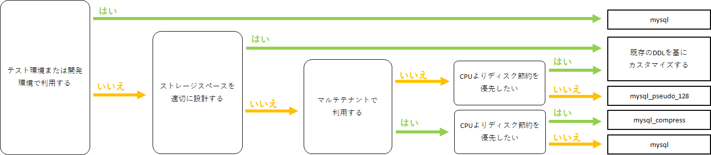
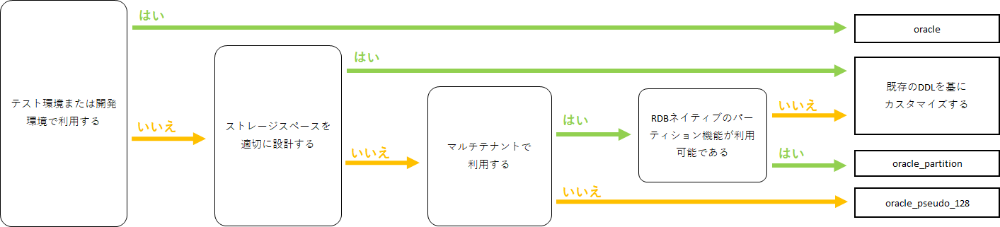
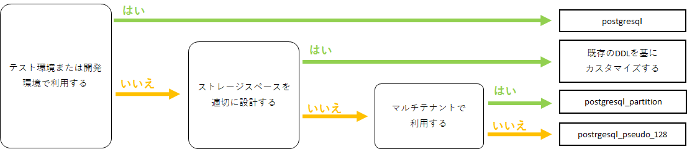
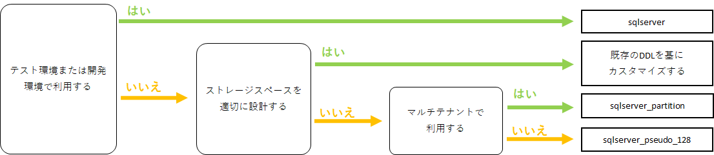
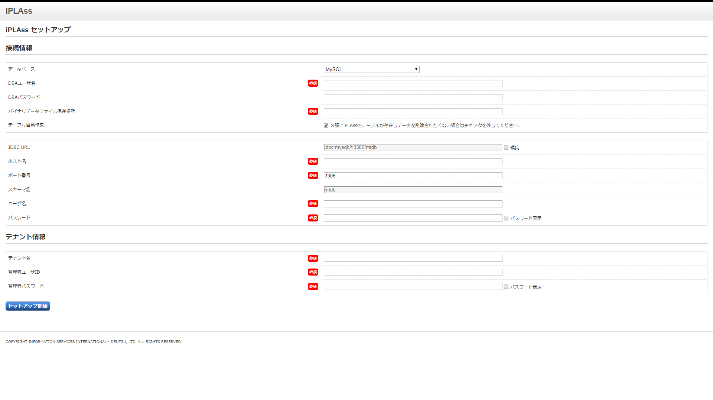

= 環境設定情報
:_hreflang-path: environment/index.html
:toclevels: 2

== 動作環境

=== iPLAss framework

[cols="1,4"]
|===
|Java|Java 21以上
|APサーバ|Tomcat 10.1（Servlet 6.0、JSP 3.1以上を実装するWebコンテナ）
|DBサーバ|Oracle 19c以上、MySQL 8.0以上、PostgreSQL 12以上、SQL Server 2016以上（※1）、Amazon Aurora（※2）
|===

※1::
SQL Serverでは以下の制限があります。
+
====
- EQLのLOCALTIME関数は使用できません。
====

※2::
Amazon Aurora利用の際はMySQL純正のJDBCドライバを利用してください。

==== 対応ブラウザ

Google Chrome、Safari、Mozilla Firefox、Microsoft Edge

=== Web Account Manager plugin module

[cols="1,4"]
|===
|Apache版|Apache HTTP Server 2.4
|IIS版|IIS 8.5以上 +
.NET 4.5.1以上 +
Windows Server 2012R2以上
|JavaEE版|Java 21以上 +
Tomcat 10.1 (Servlet 6.0、JSP 3.1以上を実装するWebコンテナ)
|Serverless(JavaScript)版|Fetch APIに対応したJavaScriptランタイムが提供されるサーバーレス環境（CDN前段などで動作するエッジ環境）
|===

== DB、テーブル作成に関する情報
iPLAssのDB及びテーブルの作成手順についてはlink:https://iplass.org/downloads/[iPLAss SDK^]をダウンロードし、同梱されているサーバセットアップキット（iplass-server-setup-kit）の「readme_setup.txt」を参照ください。

トランザクション分離レベルは「READ COMMITTED」である必要があります。

=== Oracle
- データベースキャラクターセットは「AL32UTF8」を使用して下さい。

=== MySQL
- データベースの文字コードは「utf8mb4」を使用して下さい。
- データベースの照合順序は「utf8mb4_bin」を推奨します。
+
====
照合順序について::
大文字、小文字を区別する場合は、「utf8mb4_bin」 +
大文字、小文字を区別しない場合は、「utf8mb4_general_ci」
====

=== PostgreSQL
- データベースの文字セット符号化方式は「UTF8」を使用して下さい。

=== SQL Server
- データベースの照合順序は「Japanese_Unicode_CI_AS_KS_WS」を使用して下さい。

== 環境構築する際の注意事項

=== DBサーバ関連

==== 継承するservice-config
利用するDBに応じたservice-configファイルを継承してください。

[cols="1,3", options="header"]
|===
| DB | service-configファイル
| Oracle | mtp-core-service-config-oracle.xml
| MySQL 8.0以上 | mtp-core-service-config-mysql.xml
| MySQL 5.7 | mtp-core-service-config-mysql-5.7.xml
| PostgreSQL | mtp-core-service-config-postgre.xml
| SQL Server | mtp-core-service-config-sqlserver.xml
|===

[CAUTION]
====
テーブル作成時に疑似パーティションを作成するDDLを利用した場合は、対応する service-config ファイルを利用する必要があります。 +
詳細については link:../serviceconfig/index.html#splitting_the_service_config_file[service-configファイルの分割] を参照してください。
====

[source,xml,caption="",title="設定例：DBにOracleを利用する場合"]
----
<serviceDefinition>
  <inherits>/mtp-core-service-config-oracle.xml</inherits>
</serviceDefinition>
----

==== 疑似パーティション
擬似パーティションを利用する場合は、mtp-service-config.xmlに以下の設定を行い、疑似パーティションテーブルを作成する事で対応が可能となります。 +
疑似パーティションテーブルとして作成する対象は、<<ref_storage_change_target_tables, 保存先変更対象テーブル一覧>>を参照ください。

[source,xml,caption="",title="設定例：（以下の丸１の部分を追加）"]
----
<service>
  <interface>org.iplass.mtp.impl.datastore.StoreService</interface>
  <property name="dataStore" class="org.iplass.mtp.impl.datastore.grdb.GRdbDataStore">
    <property name="storageSpace">
      <property name="tableCount" value="3" /> <1>
      <property name="storageSpaceName" value="default" />
      <property name="varcharColumns" value="128" />
        :
    </property>
  </property>
</service>
----

■命名規約::
テーブル名称＋__＋インクリメント数値
+
[caption="",title="例：tableCountが3の場合"]
====
OBJ_STORE、OBJ_STORE\__1、OBJ_STORE__2
====

==== 保存先テーブル変更
iPLAssでは、Entityは全て同一のテーブルに登録されます。特定のEntityのみデータ量が多いといった場合、そのEntityのみ別の物理テーブルへ登録する事が出来ます。 +
保存先テーブルを変更する場合は、保存先となるテーブルを作成し、mtp-service-config.xmlに以下の設定をする事で対応が可能となります。 +
保存先テーブルとして作成する対象テーブルは、<<ref_storage_change_target_tables, 保存先変更対象テーブル一覧>>を参照ください。

[source,xml,caption="",title="設定例：（以下の丸1及び丸2の部分を追加。securespace、fastの二つを追加する例）"]
----
<service>
  <interface>org.iplass.mtp.impl.datastore.StoreService</interface>
  <property name="dataStore" class="org.iplass.mtp.impl.datastore.grdb.GRdbDataStore">
    <property name="storageSpace"> <1>
      <property name="storageSpaceName" value="securespace" />
      <property name="tableNamePostfix" value="S" />
      <property name="varcharColumns" value="128" />
        :
    </property>
    <property name="storageSpace"> <2>
      <property name="storageSpaceName" value="fast" />
      <property name="tableNamePostfix" value="FAST" />
      <property name="varcharColumns" value="128" />
        :
    </property>
      :
  </property>
</service>
----

■命名規約::
テーブル名称＋__＋tableNamePostfixの値
+
[caption="",title="例：tableNamePostfixが「S」の場合"]
====
OBJ_STORE__S
====

[[ref_storage_change_target_tables]]
==== 保存先変更対象テーブル一覧
[cols="^1,5",format="dsv",options="header",caption="",title="疑似パーティション及び保存テーブル変更時の対象テーブル一覧",width="50%"]
|===
No:テーブル名称
1:OBJ_STORE
2:OBJ_STORE_RB
3:OBJ_REF
4:OBJ_REF_RB
5:OBJ_INDEX_DATE
6:OBJ_INDEX_DBL
7:OBJ_INDEX_NUM
8:OBJ_INDEX_STR
9:OBJ_INDEX_TS
10:OBJ_UNIQUE_DATE
11:OBJ_UNIQUE_DBL
12:OBJ_UNIQUE_NUM
13:OBJ_UNIQUE_STR
14:OBJ_UNIQUE_TS
|===

テーブル定義は link:../developerguide/support/index.html#custom_storage_space[バッチツール - Custom Storage Space] で作成することができます。

==== 標準提供のDDL
iPLAssでは、用途別に以下のDDLを標準提供しています。 +
これらのDDLは、インデックスやパーティションなどは必要最低限のものに絞って定義されたものです。
本番環境では、対象システムのデータ量や業務特性を加味し、インデックスの追加・整理やその他パフォーマンスチューニングを検討いただいた上、そのまま使用するのか、カスタマイズして利用するのかを判断してください。 +
カスタマイズする際は、iPLAssのデータ管理の仕組みについて link:../developerguide/datamanagement/index.html#ref_storagespace[StorageSpace] に記載されているため、こちらを参照してください。

[cols="1,3a", options="header"]
|===
| DB | DDLの種類
| MySQL |  [cols="1,4a", options="header"]
!===
! 格納先フォルダ ! 説明
! mysql ! Entityデータが格納されるdefaultストレージスペースをDBネイティブのパーティショニング（テナントIDのRANGE、Entity定義IDのLINEAR KEYの複合パーティショニング）適用したテーブルを生成するDDLです。
! mysql_compless ! mysqlのDDLに、ページ圧縮を適用して効果があると思われるテーブルに対し、それを適用したテーブルを生成するDDLです。

CAUTION: データスペースの節約や検索速度の向上が期待出来る反面、圧縮したデータを解凍するためのCPU負荷を考慮する必要があります。
! mysql_pseudo_128 ! Entityデータが格納されるdefaultストレージスペースをあらかじめ128個の疑似パーティション化したテーブルを作成するDDLです。
このDDLでテーブル作成した場合、継承するservice-configは `mtp-core-service-config-mysql_pseudo_128.xml` を指定します。
! aurora_mysql ! Amazon Aurora MySQL利用時の追加オプションとして用意しています。
バージョン2以前で、且つパラレルクエリを利用する場合に使用します（バージョン3以降の場合は不要です）。

CAUTION: このフォルダにDDLファイルは含まれておりません。予め上記いずれかのDDLを使用してDB環境を構築しておく必要があります。
!===
| Oracle | [cols="1,4a", options="header"]
!===
! 格納先フォルダ ! 説明
! oracle ! Entityデータが格納されるdefaultストレージスペースを単純な単一テーブルとして生成するDDLです。
! oracle_partition ! Entityデータが格納されるdefaultストレージスペースをDBネイティブのパーティショニング（テナントIDのRANGE、Entity定義IDのHASHの複合パーティショニング）適用したテーブルを生成するDDLです。

CAUTION: パーティショニング機能は、現在Oracle Database Enterprise Editionでのみ利用可能です。
! oracle_pseudo_128 ! Entityデータが格納されるdefaultストレージスペースをあらかじめ128個の疑似パーティション化したテーブルを作成するDDLです。
このDDLでテーブル作成した場合、継承するservice-configは `mtp-core-service-config-oracle_pseudo_128.xml` を指定します。
! oracle_pseudo ! 疑似パーティション機能を利用する場合に使用します。基本的な役割は、oracle_pseudo_128と同じです。

CAUTION: 将来のバージョンで削除される予定のため、使用しないでください。
!===
| PostgreSQL | [cols="1,4a", options="header"]
!===
! 格納先フォルダ ! 説明
! postgresql ! Entityデータが格納されるdefaultストレージスペースを単純な単一テーブルとして生成するDDLです。
! postgresql_partition ! Entityデータが格納されるdefaultストレージスペースをDBネイティブのパーティショニング（テナントIDのRANGE、Entity定義IDのHASHの複合パーティショニング）適用したテーブルを生成するDDLです。
! postgresql_pseudo_128 ! Entityデータが格納されるdefaultストレージスペースをあらかじめ128個の疑似パーティション化したテーブルを作成するDDLです。
このDDLでテーブル作成した場合、継承するservice-configは `mtp-core-service-config-postgresql_pseudo_128.xml` を指定します。
! postgresql_pseudo ! 疑似パーティション機能を利用する場合に使用します。基本的な役割は、postgresql_pseudo_128と同じです。

CAUTION: 将来のバージョンで削除される予定のため、使用しないでください。
!===
| SQL Server | [cols="1,4a", options="header"]
!===
! 格納先フォルダ ! 説明
! sqlserver ! Entityデータが格納されるdefaultストレージスペースを単純な単一テーブルとして生成するDDLです。
! sqlserver_partition ! Entityデータが格納されるdefaultストレージスペースをDBネイティブのパーティショニング（テナントIDをパーティション分割列としたパーティショニング）適用したテーブルを生成するDDLです。
! sqlserver_pseudo_128 ! Entityデータが格納されるdefaultストレージスペースをあらかじめ128個の疑似パーティション化したテーブルを作成するDDLです。
このDDLでテーブル作成した場合、継承するservice-configは `mtp-core-service-config-sqlserver_pseudo_128.xml` を指定します。
! sqlserver_pseudo ! 疑似パーティション機能を利用する場合に使用します。基本的な役割は、sqlserver_pseudo_128と同じです。

CAUTION: 将来のバージョンで削除される予定のため、使用しないでください。
!===
|===

NOTE: DDLファイルは、link:https://iplass.org/downloads/[iPLAss SDK^]に同梱されているサーバセットアップキット（iplass-server-setup-kit）の該当フォルダ内に含まれています。

==== セットアップ時に利用するDDLについて
どのDDLファイルを利用すれば良いか判断できない場合は、以下のチャートを参考に選択してください。

===== MySQLの場合

===== Oracleの場合

===== PostgreSQLの場合

===== SQL Serverの場合

==== ロックタイムアウト設定
行ロックのタイムアウト時間を設定します。iPLAssのデフォルト設定では0（NOWAIT）となっています。

■Oracleの場合::
ロックタイムアウト時間を変更したい場合は、mtp-service-config.xmlの以下の設定を0以上に変更してください。
+
[source,xml]
----
<service>
  <interface>org.iplass.mtp.impl.rdb.adapter.RdbAdapterService</interface>
  <property name="adapter" class="org.iplass.mtp.impl.rdb.oracle.OracleRdbAdapter">
    <property name="lockTimeout" value="0" />
  </property>
</service>
----

■MySQLの場合::
MySQLにはロックタイムアウト時間をDB単位で設定しているため、Oracleの「select for update nowait」のようなロック取得直後にエラーとするような処理が存在しません。

■PostgreSQLの場合::
ロックタイムアウト時間を変更したい場合は、mtp-service-config.xmlの以下の設定を0以上に変更してください。
PostgreSQLではロックタイムアウトの待機時間指定は出来ません。0以上を設定するとロック出来るまで待ち続けます。
+
[source,xml]
----
<service>
  <interface>org.iplass.mtp.impl.rdb.adapter.RdbAdapterService</interface>
  <property name="adapter" class="org.iplass.mtp.impl.rdb.postgresql.PostgreSQLRdbAdapter">
    <property name="lockTimeout" value="0" />
  </property>
</service>
----

■SQL Serverの場合::
ロックタイムアウト時間を変更したい場合は、mtp-service-config.xmlの以下の設定を0以上に変更してください。
+
[source,xml]
----
<service>
  <interface>org.iplass.mtp.impl.rdb.adapter.RdbAdapterService</interface>
  <property name="adapter" class="org.iplass.mtp.impl.rdb.sqlserver.SqlServerRdbAdapter">
    <property name="lockTimeout" value="0" />
  </property>
</service>
----

==== Oracle固有設定
* LIKE句のワイルドカードについて +
11.2.0.3.0よりLIKE句のワイルドカードの仕様が変更になっています。 +
上記バージョンより、全角の `％` と `＿` がワイルドカードではなくなり、通常の文字となっています。 +
この差異を吸収するため、OracleRdbAdapterにescapeFullwidthWildcardフラグを用意しています。 +
デフォルトはfalse（11.2.0.3.0以上で正しく動作する設定）です。 +
11.2.0.2.0を利用する場合は、このフラグをtrueに設定するようにしてください。 +
+
[source,xml,caption=""]
----
<service>
  <interface>org.iplass.mtp.impl.rdb.adapter.RdbAdapterService</interface>
  <property name="adapter" class="org.iplass.mtp.impl.rdb.oracle.OracleRdbAdapter">
    <property name="escapeFullwidthWildcard" value="true" />
  </property>
</service>
----

==== MySQL固有設定

* ストレージエンジン：InnoDB、ファイルフォーマット：Barracuda（with innodb_large_prefix）の利用が前提
+
====
ストレージエンジン:: InnoDB
ファイルフォーマット:: Barracuda
====
を利用し、innodb_large_prefixが有効化されていることが必要です。

NOTE: MySQL5.7.7以上の場合、``innodb_large_prefix``の設定は不要です。

* 文字コードは「utf8mb4」を標準使用
+

+
但し、こちらの文字コードを使用する事により以下の制約が発生します。

- EntityのStringプロパティで「Unique Index」「Index」を指定した場合、MySQLの利用文字コードによって対象とできる値サイズに制約が発生します。
- utf8mb4の場合、StringProperty値に255文字を超える値が設定されている場合は更新時にエラーになります。

+
オプションファイル(my.ini/cnf)文字コードの指定は次の形となります。

[source,ini]
----
[client]
default-character-set=utf8mb4
[mysql]
default-character-set=utf8mb4
[mysqld]
character-set-server=utf8mb4
----

* クエリキャッシュの無効化 +
クエリキャッシュが有効の場合は、書き込み時にテーブルをロックしてしまいます。
更新に時間がかかる処理を実施する場合に他のセッションへ影響が出てしまうため無効にする必要があります。
+
[source,ini]
----
[mysqld]
query_cache_size=0
----

NOTE: MySQL8.0.1以上の場合、本設定は不要です。

* LOBデータの保存先設定 +
MySQLでは、LOBデータはRDB外に保存することを推奨します。LOBデータはファイルシステム、もしくは [.eeonly]#AWS S3# に格納することが可能です。
保存先の設定が必要になります。 <<lob_store_dest, LOB保存先>> を参照ください。

* GTIDの利用 +
グループレプリケーションで必要となるGTIDを利用する場合、テンポラリテーブルに関する設定の変更が必要になります。 +
iPLAssの標準ではテンポラリテーブルの作成及び削除はトランザクション内で行っていますが、GTIDを利用した場合トランザクション内でテンポラリテーブルの作成及び削除が出来ません。
そのため、iPLAssではテンポラリテーブルの作成及び削除をトランザクション外で行う又はデータソース側で行うためのオプションを用意しています。

+
[source,xml]
.トランザクション外で行う場合
----
<service>
  <interfaceName>org.iplass.mtp.impl.rdb.adapter.RdbAdapterService</interfaceName>
  <property name="adapter" className="org.iplass.mtp.impl.rdb.mysql.MysqlRdbAdaptor">
    <property name="localTemporaryTableManageOutsideTransaction" value="true" />
  </property>
</service>
----
+
[source,xml]
.データソース側で行う場合
----
<service>
  <interfaceName>org.iplass.mtp.impl.rdb.adapter.RdbAdapterService</interfaceName>
  <property name="adapter" className="org.iplass.mtp.impl.rdb.mysql.MysqlRdbAdaptor">
    <property name="localTemporaryTableCreatedByDataSource" value="true" />
  </property>
</service>
----
+
データソース側でのコネクション（セッション）初期化時の処理として、次のSQL文を実行するよう設定してください。
+
[source,sql]
----
CREATE TEMPORARY TABLE `obj_store_tmp` (`obj_id` VARCHAR(64) NOT NULL, `obj_ver` BIGINT(10) DEFAULT 0 NOT NULL) ENGINE = MEMORY;
----

* 内部一時テーブルの設定 +
MySQL5.7より、内部一時テーブルのストレージエンジンがデフォルトで `InnoDB` になりました。
これにより内部一時テーブルが利用された際に行サイズ制限のエラーが発生する可能性があります。 +
ストレージエンジンを `MyISAM` に切り替えることで回避することが可能です。
+
[source,ini]
----
[mysqld]
internal_tmp_disk_storage_engine=MyISAM
----

NOTE: MySQL8.0.16以上の場合、本設定は不要です。

* タイムゾーンデータのインポート +
タイムゾーンデータがインポートされている必要があります。
タイムゾーンのインポートについてはMySQLのタイムゾーンの https://dev.mysql.com/downloads/timezones.html[ダウンロードサイト] を参照してください。

* タイムゾーンの指定 +
Connector/J 8.0以上ではタイムゾーンの指定が必要です。 +
Windows環境の場合、システムのデフォルトタイムゾーンがMySQLに適用されないため必ずタイムゾーンを指定する必要があります。 +
Linux環境の場合、システムのタイムゾーンをMySQLが利用するため変更以外でタイムゾーンの指定は必要ありません。
+
指定の仕方には次の３つの方法があります。
+
- 環境変数「TZ」による指定（推奨） +
指定例::
TZ=JST-9

- JDBCパラメータ「serverTimezone」による指定
指定例::
jdbc:mysql://<mysqlserver>:3306/mtdb?serverTimezone=Asia%2FTokyo

- MySQL設定ファイルによる指定 +
事前にタイムゾーンデータがインポートされている必要があります。
指定例::
+
[source,ini]
----
[mysqld]
default-time-zone='Asia/Tokyo'
----

IMPORTANT: 指定するタイムゾーンはAPサーバ（正確にはJRE）のタイムゾーンと一致させる必要があります。

* Window関数サポートの設定 +
MySQL8.0以上を利用の場合はMySQLネイティブのWindow関数を利用可能です。
MySQLネイティブのWindow関数を利用する場合、次の設定が必要になります。
+
[source,xml]
----
<service>
  <interface>org.iplass.mtp.impl.rdb.adapter.RdbAdapterService</interface>
  <property name="adapter" class="org.iplass.mtp.impl.rdb.mysql.MysqlRdbAdaptor">
    <property name="supportWindowFunction" value="true" />
  </property>
</service>
----
+
Window関数をサポートしていないMySQL5.7以下を利用の場合、 [.eeonly]#Window関数のエミュレート機能# を有効にすることでWindow関数を利用することができます。 +
Window関数のエミュレート機能を有効する場合は以下の設定を行ってください。
+
[source,xml]
----
<service>
  <interface>org.iplass.mtp.impl.datastore.StoreService</interface>
  <property name="dataStore" class="org.iplass.mtp.impl.datastore.grdb.EnterpriseGRdbDataStore">
    <property name="enableWindowFunctionEmulation" value="true" />
  </property>
</service>
----

* 小数点以下桁数の設定 +
Entityのプロパティ型としてDecimal型、またはEQLにてDIV演算子を使用する際に、小数点第5位以下を扱う場合は、MySQLのシステム変数 `div_precision_increment` を設定してください。 +
Decimal型はDIV演算子を使用しない場合でも、iPLAss内部で桁数調整のため自動的にDIVをしているので `div_precision_increment` の設定が必要です。

==== PostgreSQL固有設定
* LOBデータの保存先設定 +
PostgreSQLでは、LOBデータはRDB外に保存することを推奨します。LOBデータはファイルシステム、もしくは [.eeonly]#AWS S3# に格納することが可能です。
保存先の設定が必要になります。 <<lob_store_dest, LOB保存先>> を参照ください。

=== APサーバ関連

==== DB接続
* コネクションプール接続設定 +
コネクションプール接続の設定は、mtp-service-config.xmlに以下の設定を行ってください。
+
[source,xml]
----
<service>
  <interface>org.iplass.mtp.impl.rdb.connection.ConnectionFactory</interface>
  <class>org.iplass.mtp.impl.rdb.connection.DataSourceConnectionFactory</class>
  <property name="dataSourceName" value="java:comp/env/yourDataSource" />
</service>
----
+
※yourDataSourceはデータソース名を設定
+
合わせてAPサーバ側にデータソースの設定を行います。
（Tomcatの場合、Context.xmlに上記のデータソースの設定をします）
+

* コネクションプールの最大プール数の推奨値 [[max_connection_pool_setting]] +
コネクションプールのデッドロックを避けるために、コネクションプールの最大プール数を最低でも次の値以上に設定することを推奨します。
+
----
Tomcatの最大スレッド数 × (1スレッドが確保する最大コネクション数 - 1) + 1 + Tomcat以外のスレッドが確保するコネクション数 (非同期コマンドなど)
----
+
iPLAssでは、標準の処理の範囲内であれば1スレッドが確保する最大コネクション数は2であるため、推奨する最大プール数は実質的には最低でも次の値以上ということになります。
+
----
Tomcatの最大スレッド数 + 1 + Tomcat以外のスレッドが確保するコネクション数 (非同期コマンドなど)
----
+
.HikariCPでの設定例
[source,xml]
+
----
<service>
	<interface>org.iplass.mtp.impl.rdb.connection.ConnectionFactory</interface>
	<class>org.iplass.mtp.impl.rdb.connection.DataSourceConnectionFactory</class>

	<property name="dataSource" class="com.zaxxer.hikari.HikariDataSource">
		<property name="jdbcUrl" value="jdbc:mysql://server:3306/mtdb" />
		<property name="username" value="user" />
		<property name="password" value="pass" />
		<property name="maximumPoolSize" value="100" />
		<property name="minimumIdle" value="10" />
	</property>
</service>
----

==== Webクライアント情報
* Webクライアント情報のJavaServlet環境へバイパス設定 +
APサーバの前段にHTTPサーバなどのProxyが存在する場合、Webクライアント情報がJavaServlet環境へバイパスする設定をします。
+
iPLAssでは、
+
====
ServletRequest#getRemoteAddr() +
ServletRequest#isSecure()
====
+
を利用しているため、最低限これらの情報をバイパス設定する必要があります。
+
Tomcatの場合、
+
====
org.apache.catalina.valves.RemoteIpValve
====
+
を利用することにより、バイパス設定を行います。 +
また、isSecureについては、すべての接続をHTTPSで受ける（そしてそれが前段のロードバランサでSSL terminationしている）場合は、Connecterの設定にて設定することも可能です。
+

==== 静的コンテンツ
* 静的コンテンツのルートパス設定 +
Apacheなどのプロキシサーバの設定により、WebApplicaton名（=war名）を別名でマッピングする場合、設定を変更してください。
設定しない場合、servletContextPathが静的コンテンツのルートパスとなります。
+
[source,xml]
----
<service>
  <interface>org.iplass.mtp.impl.web.WebFrontendService</interface>
  <class>org.iplass.mtp.impl.web.WebFrontendService</class>
  <property name="staticContentPath" value="/static" />
</service>
----

==== ファイルアップロード
* ファイルアップロードの一時ファイル格納先 +
ファイルアップロード時に一時ファイルとして作成される格納先を変更する事が可能です。
+
[source,xml]
----
<service>
  <interface>org.iplass.mtp.impl.web.WebFrontendService</interface>
  <class>org.iplass.mtp.impl.web.WebFrontendService</class>
  <property name="tempFileDir" value="/tmp" />
</service>
----
+
上記の設定を行わない場合、Servlet仕様で規定される、"jakarta.servlet.context.tempdir"を利用するため、意図しない場所に作成される可能性があるので注意してください。

* アップロードファイルの最大サイズ制限 +
アップロードされるファイルの最大サイズに制限をかけることが可能です。
+

+

+
mtp-service-config.xmlに設定する事でアップロードファイルの最大サイズが設定可能です。
+
[source,xml]
----
<service>
  <interface>org.iplass.mtp.impl.web.WebFrontendService</interface>
  <class>org.iplass.mtp.impl.web.WebFrontendService</class>
  <property name="maxUploadFileSize" value="10000" />
</service>
----
+

* アップロードファイルのマジックバイトチェック +
マジックバイトチェック（ファイルの拡張子とファイル中身が一致しているか否か）について、カスタムでマジックバイトのルールを設定することが可能です。 +
ファイルの作成方法によって、ファイルのマジックバイトが通常とは異なることがあります。
マジックバイトチェックがエラーとなる場合は、任意でマジックバイトのルールを追加してください。
+
[source,xml]
----
<service>
  <interface>org.iplass.mtp.impl.web.WebFrontendService</interface>
  <class>org.iplass.mtp.impl.web.WebFrontendService</class>
  <property name="isExecMagicByteCheck" value="true" />
  <property name="magicByteChecker" class="org.iplass.mtp.impl.web.fileupload.DefaultMagicByteChecker" >
    <property name="magicByteRule" >
      <property name="mimeType" >
        <property name="pattern" value="image/gif" />
      </property>
      <property name="magicByte" value="474946383761" />
      <property name="magicByte" value="474946383961" />
    </property>
     :
  </property>
</service>
----
+

+

[[lob_store_dest]]
==== LOB保存先
* LOB保存先の設定 +
Binary型及びLongText型のデータの保存先は、ファイル形式、RDB内（のBLOBなどのバイナリ型として）、 [.eeonly]#AWS S3# のいずれかの保存方式を選択することができます。 +
保存方式を変更したい場合は、以下の設定を変更してください。 +
+
====
RDB内で保存の場合は、org.iplass.mtp.impl.lob.lobstore.rdb.RdbLobStoreを指定 +
ファイル形式で保存の場合は、org.iplass.mtp.impl.lob.lobstore.file.FileLobStoreを指定 +
AWS S3で保存の場合は、org.iplass.mtp.impl.lob.lobstore.s3.awsv2.S3LobStoreを指定
====
+
CAUTION: RDBとしてMySQL、PostgreSQLを利用する場合、binaryStoreはFileLobStoreもしくはS3LobStoreの利用を推奨します。
これらのDBへJDBC経由でアクセスした場合、バイナリデータはストリーム処理されないため、OutOfMemoryErrorの危険性が増します。
+
[CAUTION]
====
AWS SDK for Java 1.x はメンテナンスモードになっており、2025年12月 にサポートを終了する予定です。 +
iPLAss では AWS SDK for Java 1.x ベースのライブラリ iplass-ee-aws を非推奨とし、AWS SDK for Java 2.x ベースのライブラリ iplass-ee-aws2 への移行を推奨します。 +
ライブラリ iplass-ee-aws の `org.iplass.mtp.impl.aws.lobstore.s3.S3LobStore` を利用している場合は、 +
ライブラリ iplass-ee-aws2 の `org.iplass.mtp.impl.lob.lobstore.s3.awsv2.S3LobStore` へ設定を移行してください。 +
ライブラリ iplass-ee-aws は将来削除される予定です。
====
+
[source,xml]
.設定例１
----
<service>
  <interface>org.iplass.mtp.impl.lob.LobStoreService</interface>
  <property name="binaryStore" class="org.iplass.mtp.impl.lob.lobstore.file.FileLobStore">
    <property name="rootDir" value="D:\tmp\fileLobStore" />
  </property>
  <property name="longTextStore" class="org.iplass.mtp.impl.lob.lobstore.rdb.RdbLobStore" />
</service>
----
+
この設定では、Binary型のデータを「D:\tmp\fileLobStore」フォルダ下にファイル形式で保存、LongText型のデータをDB内に保存します。
+
[source,xml]
.設定例２
----
<service>
  <interface>org.iplass.mtp.impl.lob.LobStoreService</interface>
  <depend>org.iplass.mtp.impl.awsv2.AWSSetting</depend>
  <property name="binaryStore" class="org.iplass.mtp.impl.lob.lobstore.s3.awsv2.S3LobStore">
    <property name="bucketName" value="yourBucketName" />
    <property name="clientConfig" class="org.iplass.mtp.impl.awsv2.AWSClientConfig">
      <property name="region" value="ap-northeast-1" />
    </property>
  </property>
  <property name="longTextStore" class="org.iplass.mtp.impl.lob.lobstore.rdb.RdbLobStore" />
</service>
----
+
この設定では、Binary型のデータをS3のap-northeast-1リージョンのyourBucketNameバケットに保存します。

==== クラスタ構成
* APサーバを冗長化した場合の設定 +
APサーバを冗長化する場合、APサーバでのクラスタ設定に加えて、iPLAssにも設定が必要です。
iPLAssはメタデータ等をAPサーバ内のメモリにキャッシュして保持します。これらのキャッシュされたオブジェクトの変更通知等を共有する必要があるためです。
+
クラスタメンバへの通知方法は以下のいずれかを利用します。

- HttpMessageChannel +
HTTPベースで各APサーバへ非同期にメッセージ通知します。 +
ClusterServiceにorg.iplass.mtp.impl.cluster.channel.http.HttpMessageChannelを設定します。
+
[source,xml]
----
<service>
  <interface>org.iplass.mtp.impl.cluster.ClusterService</interface>
  <property name="messageChannel" class="org.iplass.mtp.impl.cluster.channel.http.HttpMessageChannel">
    <property name="serverUrl" value="http://1号機のHOST名/mtp/cmcs" /> <1>
    <property name="serverUrl" value="http://2号機のHOST名/mtp/cmcs" />
    <property name="certKey" value="yourOwnCertKey" /> <2>
    <property name="connectionTimeout" value="300000" />
    <property name="soTimeout" value="300000" />
  </property>
</service>
----
<1> serverUrlに `http://[HOST名]/[appContext]/cmcs` の形式でクラスタメンバを羅列します
<2> yourOwnCertKeyは、クラスタメンバに共通のシークレット（パスワード）を設定します。
+
HttpMessageChannelを利用する場合、合わせて非同期送信スレッドのプール数を設定します。プール数は実際のサーバ数×2程度の値が目安です。
+
[source,xml]
----
<service name="AsyncTaskServiceForHttpMessageChannel">
  <interface>org.iplass.mtp.impl.async.AsyncTaskService</interface>
  <property name="corePoolSize" value="4" />
  <property name="threadPoolType" value="fixed" />
</service>
----
+
- JGroupsMessageChannel +
クラスタメッセージ基盤ツールのJGroupsを利用してメッセージ通知します。 +
ClusterServiceにorg.iplass.mtp.impl.cluster.channel.jgroups.JGroupsMessageChannelを設定します。
+
[source,xml]
----
<service>
  <interface>org.iplass.mtp.impl.cluster.ClusterService</interface>
  <property name="messageChannel" class="org.iplass.mtp.impl.cluster.channel.jgroups.JGroupsMessageChannel">
    <property name="configFilePath" value="/path/to/jgroups_config_file.xml" />
    <property name="clusterName" value="jgroupsClusterName" />
  </property>
</service>
----
+
JGroupsではマルチキャスト、S3_PINGなどのプロトコルを利用しクラスタメンバを自動でディスカバリします。
クラスタメンバのノードの数、HOST名が不定の場合でも利用可能です。

- InfinispanMessageChannel +
Infinispanのクラスタメンバ間の通知機能を利用しメッセージ通知します。 +
ClusterServiceにorg.iplass.mtp.impl.infinispan.cluster.channel.InfinispanMessageChannelを設定します（別途、InfinispanServiceの設定も必要です）。
+
[source,xml]
----
<service>
  <interface>org.iplass.mtp.impl.cluster.ClusterService</interface>
  <property name="messageChannel" class="org.iplass.mtp.impl.infinispan.cluster.channel.InfinispanMessageChannel">
    <property name="sync" value="false" />
  </property>
</service>
----
+
Infinispanは内部でクラスタ通信にJGroupsを利用します。
CacheStoreとしてInfinispanを利用しない場合は、JGroupsMessageChannelを利用してください。

=== Webサーバ関連

==== クリックジャッキング対策
* X-Frame-Optionsヘッダを設定する場合は「SAMEORIGIN」ディレクティブを指定 +
iPLAssではiframeを利用しているため、クリックジャッキング対策としてX-Frame-Optionsヘッダを設定する場合は「SAMEORIGIN」ディレクティブを指定してください。 +

=== バッチ関連

==== 事前準備
* 依存ライブラリの追加 +
利用する機能に応じ、build.gradleのコメントアウトされた行のコメントを解除して依存ライブラリを追加します。
* 依存ライブラリのコピー +
Gradleの「copyRuntimeLibs」タスクを実行してバッチの実行に必要なライブラリを「lib」ディレクトリにコピーします。
+
[source]
----
gradlew copyRuntimeLibs
----

==== DB接続設定
* バッチで利用するDB接続先の設定 +
バッチで利用するDB接続先の設定が行われている必要があります。
+
[source,xml]
----
<service>
  <interface>org.iplass.mtp.impl.rdb.connection.ConnectionFactory</interface>
  <class>org.iplass.mtp.impl.rdb.connection.DriverManagerConnectionFactory</class>
  <property name="url" value="XXXXXXXXXX" />
  <property name="user" value="XXXXX" />
  <property name="password" value="XXXXX" />
  <property name="driver" value="XXXXXXXX" />
</service>
----
+

==== 環境定義設定
* 「tool_env.sh」または「tool_env.bat」の設定 +
「tool_env.sh」または「tool_env.bat」内の以下の変数に適切な値が設定されている必要があります。
+
====
SERVICE_CONFIG_NAME +
MTP_RESOURCE_PATH
====
+

=== キャッシュ関連

==== Redis固有設定
キャッシュの生存時間（TimeToLive）の設定による期限切れでキーが削除された場合に発行される削除イベントの通知を受け取る場合は、
RedisのKeyspace通知機能を有効にする必要があります。

設定はredis.confの'notify-keyspace-events'を通してExpiredイベントの通知を有効にしてください。
[source,caption="",title="設定例：全てのKeyspace通知を有効にする"]
----
notify-keyspace-events KEA
----
Redisの仕様により、期限切れによるキー削除イベントの通知が期限切れ時に行われることは保障されていません。
Keyspace通知機能の仕様についてはlink:https://redis.io/topics/notifications[Redis Keyspace Notifications^]を参照してください。

[[UpgradeToEnterpriseEdition]]
== Enterprise Editionへのアップグレード
Enterprise Editionにアップグレードする場合、Gradleプロジェクトの置き換え又はライブラリの差し替えと、テーブルの追加が必要です。

ライブラリとテーブルDDLは有償版のSDKに同梱されています。

Gradleプロジェクトの置き換えとライブラリの差し替えはどちらか一方を行ってください。

=== Gradleプロジェクトの置き換え

有償版SDKの「iplass-ee-skeleton」フォルダにある「build.gradle」と「gradle.properties」を既存のファイルと置き換えます。

置き換えた「gradle.properties」をエディタで開き、「iPLAssMavenRepoUsername」及び「iPLAssMavenRepoPassword」にEnterprise Edition Mavenリポジトリのアカウントのユーザー名とパスワードを設定してください。

=== ライブラリの差し替え

Community Editionの下記ライブラリをEnterprise Editionの相応するライブラリで差し替えます。
[cols="5,5",format="dsv",options="header",caption="",title="差し替え対象ライブラリ一覧",width="50%"]
|===
Community Edition:Enterprise Edition
iplass-core:iplass-ee-core
iplass-gem:iplass-ee-gem
iplass-web:iplass-ee-web
iplass-admin:iplass-ee-admin
iplass-tools:iplass-ee-tools
iplass-tools-batch:iplass-ee-tools-batch ※
|===

ライブラリファイルは有償版SDKの「lib」フォルダに格納されています。 +
※iplass-ee-tools-batchのライブライファイルは、有償版SDKに同梱されている「iplass-ee-tools-batch-x.x.x.zip」ファイル内の「lib」フォルダに格納されています。

=== テーブルの追加

有償版のSDKに同梱されている下記DDLを実行し、テーブルを作成します。

- audit_log.sql
- sys_stats.sql
- t_available.sql

DDLファイルは有償版SDKに同梱されている「iplass-ee-server-setup-kit-x.x.x.zip」ファイル内の「ddl」フォルダにデータベースの種類ごとに格納されています。

MySQL及びパーティション対応のPostgreSQLを利用の場合、「audit_log」テーブルのパーティションを既存のテナント数分、追加作成する必要があります。
パーティションの追加作成はテナント管理ツール「<<../developerguide/support/index.adoc#tenantmanager,TenantManager>>」のパーティション管理機能を利用してください。

[[Installer]]
== インストーラ
インストーラにてiPLAssのセットアップを行います。
インストーラではiPLAssの動作に必要な情報を画面または設定ファイルにて指定することによりiPLAssの動作環境を作成します。

[[Installer-bundled-modules]]
=== バンドルモジュール
インストーラには、以下のモジュールがバンドルされています。

.バンドルモジュール一覧
[cols=">1,2,2,5a",options="header,autowidth"]
|===
| No.
| Community Edition
| Enterprise Edition
| 備考

| 1
| iplass-admin
| iplass-ee-admin
| 

| 2
| iplass-core
| iplass-ee-core
| 

| 3
| iplass-gem
| iplass-ee-gem
| 

| 4
| iplass-tools
| iplass-ee-tools
| 

| 5
| iplass-web
| iplass-ee-web
| 

| 6
| iplass-googlecloud
| iplass-ee-googlecloud
| 

| 7
| iplass-infinispan
| iplass-ee-infinispan
| 

| 8
| iplass-redis
| iplass-ee-redis
| 

| 9
| 
| iplass-ee-admin-mdc
| 

| 10
| 
| iplass-ee-aws2
| 4.0.16 以降のバージョンにバンドルされています。 +
4.0.15 以前のバージョンでは iplass-ee-aws がバンドルされます。

| 11
| 
| iplass-ee-elasticsearch
| 

| 12
| 
| iplass-ee-mdc
| 

| 13
| 
| iplass-ee-micrometer
| 

| 14
| 
| iplass-ee-opensearch
| 4.0.1 以降のバージョンにバンドルされています。

| 15
| 
| iplass-ee-sendgrid
| 

| 16
| 
| iplass-ee-twilio
| 

| 17
| 
| iplass-ee-wam
| 
|===

=== インストール方式
インストールの方式には、セットアップ画面にてインストールを行う「ウィザードインストール」と、セットアップ画面を介さずセットアップに必要な情報を予め設定したインストール設定ファイルを用いてインストールを行う「サイレントインストール」の２通りの方式があります。

==== ウィザードインストール
セットアップ画面にて情報を入力しインストールを行います。
APサーバ上にデプロイされたiPLAssに初回アクセスすることでウィザード画面が表示されます。

.手順
. iPLAssのURLにアクセスします。 +
例： http(s)://<サーバ名>:<ポート>/iplass
. セットアップ画面に必要な情報を入力し``セットアップ開始``ボタンを押下します。
. セットアップ画面に従いAPサーバを再起動します。
. 再度、iPLAssのURLにアクセスします。
. 準備中画面の表示後、iPLAssのログイン画面が表示されます。

セットアップ画面

.セットアップ画面入力項目（接続情報）
[cols="1,4a"]
|===
|データベース|使用するデータベースの種類を選択します。
|DBAユーザー名|データベースのDBA権限を持つユーザーのユーザー名を入力します。
|DBAパスワード|データベースのDBA権限を持つユーザーのパスワードを入力します。
|バイナリデータファイル保存場所|バイナリデータファイルの保存先ルートディレクトリのパスを入力します。
|テーブル自動作成|チェックをするとiPLAssで利用するテーブルを作成します。新規にセットアップを行う場合は必ずチェックしてください。 +
既にテーブルが存在する場合、テーブルは再作成されデータは初期化されます。 +
再セットアップ等で既存のデータを残す場合はチェックを外してください。

|JDBC URL
|ホスト名、ポート番号を入力すると自動的に設定されます。直接編集を行う場合は「編集」をチェックしてください。 +
※Oracle以外のデータベースを使用の場合、データベース名は必ず「mtdb」として下さい。 +
 +
[NOTE]
====
Microsoft JDBC Driver for SQL Server を利用する場合の注意点::
10.2 以降のバージョンでは、デフォルトで TLS 接続が有効化されています。
TLS 接続を利用しない場合は JDBC URL の最後に `;encrypt=false` を追記する必要があります。
追記するためには「編集」をチェックし直接編集が必要となります。
+
.JDBC URL 設定例
[source,text]
----
# 10.2 よりも前のバージョンで TLS 接続を利用しない場合
jdbc:sqlserver://servername:1433;databaseName=mtdb

# 10.2 以降のバージョンで TLS 接続を利用しない場合
jdbc:sqlserver://servername:1433;databaseName=mtdb;encrypt=false
----
====

|ホスト名|データベースのホスト名またはIPアドレスを入力します。
|ポート番号|データベースのポート番号を入力します。データベースを選択すると自動的にデフォルトのポート番号が設定されます。 +
※ポート番号を変更した場合は変更したポート番号を入力してください。
|スキーマ名/サービス名/データベース名|データベースがOracleの場合にのみ入力します。
|ユーザー名|作成するiPLAssのデータベースのユーザー名を入力します。
|パスワード|作成するiPLAssのデータベースのパスワードを入力します。 +
※パスワードを表示する場合は「パスワード表示」をチェックします。ブラウザがIEの場合は「パスワード表示」のチェックボックスは表示されません。
|===

.セットアップ画面入力項目（テナント情報）
[cols="1,2",options="autowidth"]
|===
|テナント名|テナント名を入力します。（半角推奨） +
※テーブル自動作成のチェックを外した場合、指定のテナント名のテナントが既に存在する場合は作成されません。
|管理者ユーザーID|テナントの管理者ユーザーIDを入力します。
|管理者パスワード|テナントの管理者パスワードを入力します。 +
※パスワードを表示する場合は「パスワード表示」をチェックします。ブラウザがIEの場合は「パスワード表示」のチェックボックスは表示されません。
|===

.管理者のユーザーIDおよびパスワードについて
TIP: ユーザーIDには４文字以上の「英数字」および「-」(マイナス)「@」「_」「.」(ピリオド)のみ入力可能です。 +
パスワードは６文字以上の英数字のみ入力可能です。

==== サイレントインストール
インストール設定ファイルを指定してAPサーバを起動することにより、指定されたインストール設定ファイルに基づいてインストール画面を介さずに自動的にインストールを行います。

.手順
. <<InstallPropertiesFile>>を作成します。
. 作成したインストール設定ファイルを環境に合わせて修正します。
. 作成したインストール設定ファイルを``%USERPROFILE%(or $HOME)/.iplass/``下に配置するか、JVMオプション``-Dmtp.install=<インストール設定ファイルのパス>``を指定しAPサーバを起動します。
. iPLAssのURLにアクセスします。
. 準備中画面の表示後、iPLAssのログイン画面が表示されます。

[IMPORTANT]
====
``%USERPROFILE%(or $HOME)/.iplass/``下に配置する場合、インストール設定ファイルのファイル名は必ず``install.properties``である必要があります。
但し、``mtp.install``オプションで指定する場合は任意のファイル名で構いません。
====

.Tomcatでの設定例
作成したインストール設定ファイルを``my-install.properties``としJVMオプション``mtp.install``で指定する場合

. ``%CATALINA_HOME%/bin``ディレクトリに``setenv.bat``ファイルを作成します。
. 作成した``setenv.bat``に次のように記述します。
+
[source,bat]
----
set JAVA_OPTS=%JAVA_OPTS% -Dmtp.install="<インストール設定ファイルの配置場所>/my-install.properties"
----

TIP: 既に``setenv.bat``ファイルが存在する場合は追記してください。

[[installer_post_install_checklist]]
==== インストール完了後のチェックリスト
インストール完了後、以下の項目を確認してください。

. <<installer_post_install_checklist_user_privilege>>

[[installer_post_install_checklist_user_privilege]]
===== インストーラーで作成したユーザーの権限
インストーラーで作成したデータベースユーザーの権限は簡易的に設定しています。 +
システム運用を行うにあたり、適切な権限に変更することを推奨します。

適切な権限については、link:https://iplass.org/downloads/[iPLAss SDK^] に同梱されている 「iplass-server-setup-kit-x.x.x.zip」ファイル内の `ddl/${RDBMS名}/readme.txt` ファイルを参照してください。 +
例：MySQL の場合は 「iplass-server-setup-kit-x.x.x.zip」ファイル内の `ddl/mysql/readme.txt` ファイル

.各データベースにおけるインストーラーで作成したユーザーの権限
[cols="1,3",options="header,autowidth"]
|====
| RDBMS
| 明示的に付与される権限

| MySQL
| ALL PRIVILEGES (作成したデータベースに対しての)

| Oracle
| DBA (ロール)、 CONNECT (ロール)、 RESOURCE (ロール)

| PostgreSQL
| なし (デフォルト)

| SQL Server
| db_owner (ロール, 作成したデータベースに対しての)
|====

[[InstallPropertiesFile]]
=== インストール設定ファイル(install.properties)
[source,ini]
----
# データベース
#
# [MySQL | Oracle_EE_11g | Oracle_EE_12c | Oracle_SE_ONE | PostgreSQL | SQLServer]
#
# MySQL         : MySQL
# Oracle_EE_11g : Oracle Database 11g Enterprise Edition
# Oracle_EE_12c : Oracle Database 12c Enterprise Edition
# Oracle_SE_ONE : Oracle Database Standard Edition One
# PostgreSQL    : PostgreSQL
# SQLServer     : Microsoft SQL Server
connection.db=MySQL

# DBAユーザー名
#
# データベースのDBA権限を持つユーザーのユーザー名を設定します。
connection.dba.user=root

# DBAパスワード
#
# データベースのDBA権限を持つユーザーのパスワードを設定します。
connection.dba.password=rootpass

# バイナリデータファイル保存場所
#
# バイナリデータファイルの保存先ルートディレクトリを設定します。
# MySQL及びPostgreSQLの場合、Binary型のデータは標準でファイル形式により外部保存されます。
# Oracle及びSQLServerの場合は保存場所を設定した場合のみ外部保存されます。
# MySQL及びPostgreSQLの場合は必ず設定が必要です。
# バックスラッシュの場合はエスケープが必要です。('\'->'\\')
binaryStoreRootdir=C:\\iPLAss\\FileLobStore\\MySQL

# テーブル自動作成
#
# [true | false]
#
# テーブルを作成する場合は「true」を設定します。
# 「true」を設定した場合は既存のテーブルは再作成されます。
# 再セットアップ等で既存のデータを削除したくない場合は「false」を設定してください。
# 未設定の場合は「false」が設定されたものとします。
# ※データベースまたはテーブルが存在しない場合は必ず「true」を設定してください。
tableSetupRequired=false

# JDBC URL
#
# 未設定の場合はデータベース、ホスト名、ポート番号、名前により以下のフォーマットで生成されます。
# 独自のURLを指定する場合に設定します。
# ※Oracle以外の場合、名前(データベース名)は「mtdb」である必要があります。
#
# MySQL         : jdbc:mysql://[<Hostname>|<IP Address>]:3306/mtdb
# Oracle_EE_11g : jdbc:oracle:thin:@[<Hostname>|<IP Address>]:1521:<Service name>
# Oracle_EE_12c : jdbc:oracle:thin:@[<Hostname>|<IP Address>]:1521/<Service name>
# Oracle_SE_ONE : jdbc:oracle:thin:@[<Hostname>|<IP Address>]:1521:<Service name>
# PostgreSQL    : jdbc:postgresql://[<Hostname>|<IP Address>]:5432/mtdb
# SQLServer     : jdbc:sqlserver://[<Hostname>|<IP Address>]:1433;databaseName=mtdb
#connection.jdbc.url=jdbc:mysql://localhost:3306/mtdb

# ホスト名
#
# データベースのホスト名またはIPアドレスを設定します。
connection.jdbc.host=localhost

# ポート番号
#
# 未設定の場合はデータベースに応じて以下のポート番号が使用されます。
# 他のポート番号を使用する場合に設定します。
#
# MySQL      : 3306
# Oracle     : 1521
# PostgreSQL : 5432
# SQLServer  : 1433
#connection.jdbc.port=3306

# 名前
#
# データベースの名前(サービス名)を設定します。
# データベースがOracleの場合にのみ設定が必要です。
# Oracle以外で設定された場合は無効となります。
#connection.jdbc.name=orcl

# ユーザー名
#
# 作成するiPLAssのデータベースユーザー名を設定します。
connection.jdbc.user=mtpusr

# パスワード
#
# 作成するiPLAssのデータベースユーザーパスワードを設定します。
connection.jdbc.password=mtpusrpass

# 初期テナント名
#
# 初期作成されるテナント名を設定します。
# 指定のテナント名のテナントが既に存在する場合は作成されません。
tenant.name=myTenant

# 初期テナント管理者ID
#
# 初期作成されるテナントの管理者IDを設定します。
tenant.admin.id=admin

# 初期テナント管理者パスワード
#
# 初期作成されるテナントの管理者パスワードを設定します。
tenant.admin.password=password
----

=== iPLAssホームディレクトリ
セットアップ完了後に、iPLAssホームディレクトリが作成されています。 +
環境変数「IPLASS_HOME」が指定されている場合はそのディレクトリがiPLAssホームディレクトリとなります。 +
指定がない場合は、 `%USERPROFILE%(or $HOME)/.iplass` がiPLAssホームディレクトリとなります。

TIP: インストーラをリセットし、再度インストールを実行したい場合には、iPLAssホームディレクトリを削除してください。

iPLAssホームディレクトリ配下に設定ファイル類が格納されます。 +
`iplass-service-config.xml` がiPLAssの動作を決める設定ファイルの本体です。 +
設定ファイルの詳細は <<../serviceconfig/index.adoc#, 設定（service-config）リファレンス>> を参照してください。

NOTE: インストーラによって作成されるiplass-service-config.xmlはプリプロセス処理が有効化されています。iplass-service-config.xmlを編集する際に `$` や `\` を記述する際にはエスケープ処理が必要になります。 +
詳しくは<<../serviceconfig/index.adoc#preprocess, プリプロセッサ>>を参照してください。

=== カスタムservice-config
カスタマイズしたservice-configファイルを指定しインストールすることで、インストール後のservice-configファイルの設定が不要になります。

通常、インストール後に``%USERPROFILE%(or $HOME)/.iplass/``下に作成されるservice-configファイル``iplass-service-config.xml``を編集しservice-configを設定しますが、
あらかじめ設定し用意したカスタムservice-configを指定することにより、インストール後にservice-configを設定する必要が無くなります。

なお、カスタムservice-configはインストール後に指定することも指定を止めることも可能です。

指定を止めた場合は``%USERPROFILE%(or $HOME)/.iplass/``下の``iplass-service-config.xml``が使用されます。

==== カスタムservice-configの作成
カスタムservice-configは必ず``/iplass-service-config.xml``を継承して作成してください。

作成例：テナントのデフォルトのメール送信に関する設定を行う場合
[source,xml]
----
<?xml version="1.0" encoding="UTF-8" standalone="yes"?>
<!DOCTYPE serviceDefinition>
<serviceDefinition>
  <inherits>/iplass-service-config.xml</inherits>

  <service>
    <interface>org.iplass.mtp.impl.core.TenantContextService</interface>

    <property name="defaultMailFrom" value="sample@sample.org" />
    <property name="defaultMailFromName" value="Sample" />
  </service>

</serviceDefinition>
----

==== カスタムservice-configの指定
カスタムservice-configはJVMのシステムプロパティ``mtp.config.custom``にて指定します。

指定例：カスタムservice-configのファイル名を``custom-service-config.xml``とした場合
[source,bat]
----
-Dmtp.config.custom="＜カスタムservice-configファイルの配置場所＞/custom-service-config.xml"
----

=== iPLAssバージョンアップデート
インストールの状態を問わず新しいバージョンのインストーラファイル(war)を既存のファイルに上書きしてください。

Enterprise Editionへのアップグレードの場合は、インストーラの上書きと「<<UpgradeToEnterpriseEdition,Enterprise Editionへのアップグレード>>」の「テーブルの追加」を行ってください。
