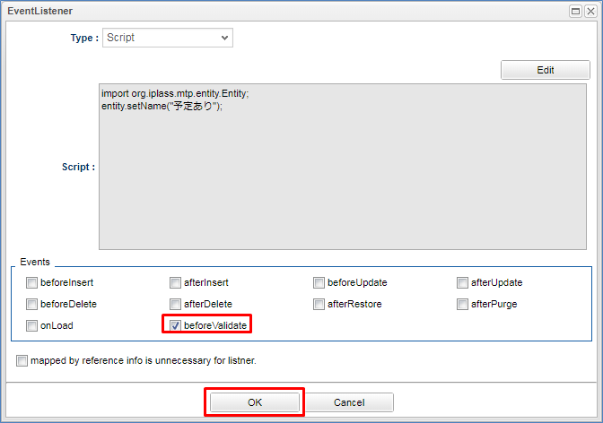
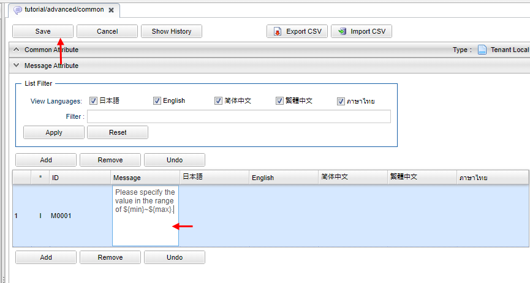
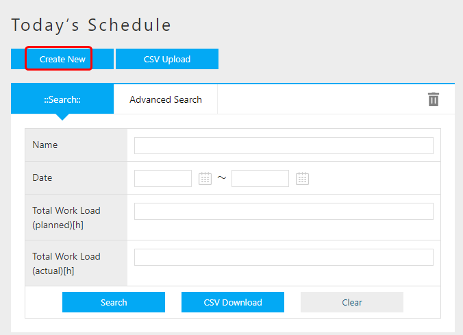
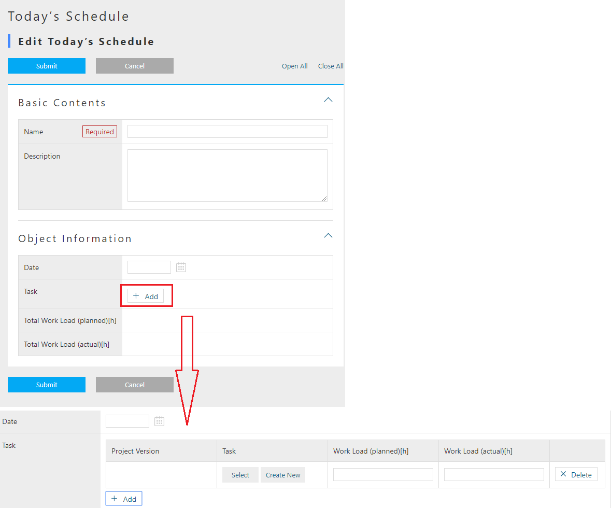
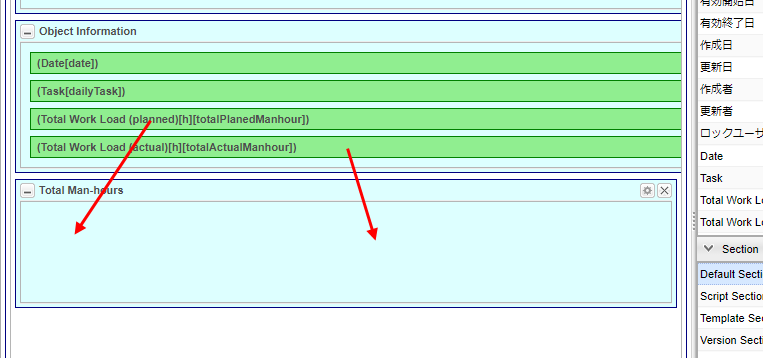

== Entity Customization
First, let's create an Entity.
After creating the Entity, we will customize it.
Please log in as a user with administrator privileges.

=== Preparation
To begin with, please register the metadata of the entity.
Create an Entity with the following name from AdminConsole.

[options = "header"]
|===
| Name | display name
| tutorial.advanced.projectMaster | Project Master
| tutorial.advanced.versionMaster | Version Master
| tutorial.advanced.taskMaster | Task Master
| tutorial.advanced.dailyTask | Today's Task
| tutorial.advanced.dailySchedule | Today's Schedule
|===

Add the following Property to each Entity. +
When referring to an item whose Type is Reference, the Entity must already be created.
After setting the Entity, add a Reference item again.

.Task Master Entity
[cols = "1,1,1,3a", options = "header"]
|===
| Name | DisplayName | Type | Attribute value
| taskId | Task ID | String |
| projectVer | Version | Reference | [options = "header"]
!===
! Item! Set value
! Reference entity! Tutorial.advanced.versionMaster
!===
| projectAndVer | Project Version | String |
|===

.Version Master Entity
[cols = "1,1,1,3a", options = "header"]
|===
| Name | DisplayName | Type | Attribute value
| project | Project | Reference | [options = "header"]
!===
! Item! Set value
! Reference entity! Tutorial.advanced.projectMaster
!===
| task | Task | Reference | [options = "header"]
!===
! Item! Set value
! Multiple! *
! Reference entity! Tutorial.advanced.taskMaster
! Reference relationship! Parent-child relationship
! Referenced property! ProjectVer
!===
| projectName | Project name | String |
|===

.Project master
[cols = "1,1,1,3a", options = "header"]
|===
| Name | DisplayName | Type | Attribute value
| projectId | Project ID | String |
| projectVer | Version | Reference | [options = "header"]
!===
! Item! Set value
! Multiple! *
! Reference entity! Tutorial.advanced.versionMaster
! Reference relationship! Parent-child relationship
! Referenced property! Project
!===
|===

.Today's task Entity
[cols = "1,1,1,3a", options = "header"]
|===
| Name | DisplayName | Type | Attribute value
| task | Task | Reference | [options = "header"]
!===
! Item! Set value
! Reference entity! Tutorial.advanced.taskMaster
!===
| planedManhour | Work Load (planned)[h] | Float |
| actualManhour | Work Load (actual)[h] | Float |
| dailySchedule | Today's schedule | Reference | [options = "header"]
!===
! Item! Set value
! Reference entity! Tutorial.advanced.dailySchedule
!===
| projectAndVersion | Project Version | String |
|===

.Today's schedule Entity
[cols = "1,1,1,3a", options = "header"]
|===
| Name | DisplayName | Type | Attribute value
| date | Date | Date |
| dailyTask | Task | Reference | [options = "header"]
!===
! Item! Set value
! Multiple! *
! Reference entity! Tutorial.advanced.dailyTask
! Reference relationship! Parent-child relationship
! Referenced property! DailySchedule
!===
| totalPlanedManhour | Total Work Load (planned)[h] | Float |
| totalActualManhour | Total Work Load (actual)[h] | Float |
|===

This completes the preparation work.

=== Automatic Numbering Function (AutoNumber)
Now, let's register the master data from the GEM edit screen according to the flow of `Business Flow`.
New registration with the following contents in the project master entity.

[options = "header"]
|===
| Name | Description | Project ID
| A project | A project description. | P001
| B project | B project description. | P002
|===

Even if you want to specify a property name according to a certain logics such as `P001, P002, ...`, as for the implementation of 'ID', if in the situation of the above example, you will have to enter the value manually in the String type.
Manual input is not only cumbersome but can also leads to input errors.
In such cases, it is convenient to use the AutoNumber function.
The AutoNumber function automatically assigns values ​​according to a certain grammar.

Let's actually customize and use the AutoNumber function.

For details of AutoNumber, please refer to <<../../developerguide/datamanagement/index.adoc#ref_property_autonumber, AutoNumber>>.

.Project Master Entity
Display the project ID setting screen and change the settings.

Fixed digits can specify how many digits a value is displayed. Since it is 3 digits here, `001, 002, 003, ...` is displayed.
You can also specify the format for displaying values. Here, `P $ {nextVal()}` is specified, so `P001, P002, P003,…` is assigned.
What about other notations? Press the `?` button to confirm.

[options = "header"]
|===
| Item | Setting
| Type | AutoNumber
| Starting value | 1
| Fixed digits | 3
| Format (Script) | P${nextVal()}
|===

When the change is complete, save the Entity.

.Task Master Entity
Similarly, change the task ID setting as follows.

[options = "header"]
|===
| Item | Setting
| Type | AutoNumber
| Starting value | 1
| Fixed digits | 3
| Format (Script) | P${nextVal()}
|===

When the change is complete, save the Entity.

This completes the AutoNumber setting.

Add data to the project master entity for confirmation.
Create New from the search screen.

Enter a name and description and register.

You can see that the values ​​are automatically assigned according to the format specified for the project ID.

=== Function (Expression)
Next, register the following data in the version master Entity.

[cols = "1,2,1,1", options = "header"]
|===
| Name | Description | Project | Project name
| 1.0.0 | A project version 1.0.0. | A Project | A Project
| 1.0.1 | A project version 1.0.1. | A Project | A Project
| 1.0.0 | B project version 1.0.0. | B Project | B Project
|===

When registering the above project name, you manually entered the name of the project master entity that the version master entity references.
In this way, if you want to set the value obtained based on other Property values, it is convenient to use the Expression function.
With the Expression function, values ​​can be obtained using four arithmetic expressions or EQL (iPLAss version SQL). +
See the <<../../eqlreference/index.adoc#, EQL Reference>> for more information on EQL.

Let's actually add customization and use Expression.

For details of Expression function, please refer to <<../../developerguide/datamanagement/index.adoc#ref_property_expression, Expression>>.

.Version Master Entity
Change the project name setting as follows.

The value is acquired according to the four arithmetic expressions and EQL described in the expression and set as the Property value.
Here, EQL is written to obtain the value of the name of the project master.

[options = "header"]
|===
| Item | Setting
| Type | Expression
| Result Type | String
| Expression | (select project.name from tutorial.advanced.versionMaster on .this= this)
|===

When the change is complete, save the Entity.

.Today's Task Entity
Similarly, change the project version setting as follows.

[options = "header"]
|===
| Item | Setting
| Type | Expression
| Result Type | String
| Expression | (select task.projectAndVer from tutorial.advanced.dailyTask on .this=this) <<1>>
|===

<<1>>:Project version of task master entity

When the change is complete, save the Entity.

.Today's Schedule Entity
Similarly, change the settings for total man-hour (planned) [h] and total man-hour (actual) [h] as follows.

[options = "header"]
|===
| Item | Setting
| Name | totalPlanedManhour
| DisplayName | Total effort (planned) [h]
| Type | Expression
| Result Type | Float
| Expression | (select sum(dailyTask.planedManhour) from tutorial.advanced.dailySchedule on .this=this)<<2>>
|===

<<2>>: Get the total value of man-hours (planned) [h] of today's task Entity

[options = "header"]
|===
| Item | Setting
| Name | totalActualManhour
| DisplayName | Total effort (actual) [h]
| Type | Expression
| Result Type | Float
| Expression | (select sum(dailyTask.actualManhour) from tutorial.advanced.dailySchedule on .this=this)<<3>>
|===

<<3>>: Get the total value of man-hours (actual) [h] of today's task Entity

When the change is complete, save the Entity.

Add data to version master entity for confirmation.
New registration from the search screen.

Enter a name and description, select a project, and register.

You can see that the project name is set in the project name.

=== Logic Call When Registering Data (EventListener)
Register the following data in task master entity.

[cols = "1,2,1,1", options = "header"]
|===
| Name | description | version | project version
| Material creation | A project material creation. | 1.0.0 (A Project) | A Project 1.0.0
| Meeting | A project meeting. | 1.0.0 (A Project) | A Project 1.0.0
| Material creation | B Project material creation. | 1.0.0 (B Project) | B Project 1.0.0
| Meeting | B Project meeting. | 1.0.0 (B Project) | B Project 1.0.0
|===

Each project version item consists of the project master name and version master name.
Task master entity has version Property, and version Property also has project master entity as a reference.

Here, let's use the EventListener function to set the project version Property with custom logic that is called when registering or updating an Entity.

Also, set EventListener to automatically set the name Property for today's schedule entity and today's task entity.
This method can also be used in scenes where you do not want the user to enter the required property name Property directly.

For details of EventListener function, refer to <<../../developerguide/datamanagement/index.adoc#ref_entity_event_listener, EventListener>>.

.Today's Schedule Entity
Add EventListener.
By default, EventListeners are closed, so click on the tab bar to open EventListeners.

Click the Add button to display the editing dialog.
When `Script` is selected, the edit screen is displayed as shown below. Click the `Edit` button.

Display the editor for editing and enter the following script.

image::images/entity_editeventlistenerscript_en.png[]

[source, groovy]
----
import org.iplass.mtp.entity.Entity;
entity.setName("Has Task");
----

Click the OK button to close the dialog and save the Entity.

.Today's Task Entity
Similarly, add the following script to EventListener.

[source, groovy]
----
import org.iplass.mtp.entity.Entity;

String taskName = entity.getValue("task.name");
entity.setName(taskName);
----

Get the value of name Property from task master entity and set the value to name property of today's task entity.

When the change has completed, save the Entity.

.Task Master Entity
Similarly, add the following script to EventListener.

Get the value of name Property and project name Property from version master entity, combine both and set to project version property.

[source, groovy]
----
import org.iplass.mtp.entity.Entity;

String ver = entity.getValue("projectVer.name");
String project = entity.getValue("projectVer.projectName");
String projectAndVer = (project == null || ver == null ? '' : project + " " + ver);
entity.setValue("projectAndVer", projectAndVer);
----

When the change is complete, save the Entity.

Add data to task master entity for confirmation.
Register new data from the search screen.

Enter any name and description, select a version, and submit.

You can see that the combined value of the version master name and the project name value is set in the project version.

=== Input Check Function (Validator)
Use Validator function when you want to check input of data to be registered in Entity was following the rule.

Here, Validator is assigned so that an error is displayed when a value other than 0 to 24 is entered in the man-hour (planned) [h] and man-hour (actual) [h] of today's task Entity.

First, register a message when an input validation error occurs.
Right-click Message in the Data Model, click「Create Message Category」from the context menu that appears, and create the message below.

[options = "header"]
|===
| Item | Setting
| Name | tutorial/advanced/common
| Display name | Common
|===

Add a line and add a message item.
Click the ID column to set the ID.

[options = "header"]
|===
| Item | Setting
| ID | M0001
|===

Click the Message column to set the message.
${min} and ${max} will contain the values ​​specified by Validator later.

[options = "header"]
|===
| Item | Setting
| Message | Please specify the value in the range of ${min}~$max}.
|===

Click the Save button to save the message.

Next, set Validator to Property.

.plannedManhour
Perform the following settings from the on the planned Man-hour for today's task Entity.

An error will occurs if the entered numeric value is not within the specified range.

For Min and Max, specify the range of values ​​that can be entered. The Min and Max values ​​here are entered in ${min} and ${max} of the message created earlier.
In Message section, select the message category name of the message you want to use in case of error.
For this instance, we will specify `tutorial/advanced/common`.
In Message Id, specify the message ID of the message you want to use in case of error.
If you haven't modify the given names of this tutorial, then it should be `M0001`.
Setting the Code is optional.

.actualManhour
Set the same for the man-hour (actual) [h] and save the Entity.

For confirmation, add data to today's task entity.
Please click new registration from the search screen.

Then set a value that will cause an input check error in the man-hour(actual)[h] and register it.

You can observe the error message which is displayed at the top of the screen.
A detailed message is also displayed at the location where the input validation error occurred.

=== [.eeonly]#Record of Update History(AuditLog)#
If you want to record the update history of Entity, use the AuditLog function.
Here, AuditLog is set to record the update history of project master entity.

Enable `save audit log` in the project master entity.
Check this item to record operation logs.

Open DetailLayout of project master entity and click standard load.

Standard settings according to the Entity definition are loaded.
Because AuditLog is enabled, AuditLog Section is added.
Click the Save button to save the screen definition.

You can also drag the audit log display parts and drop it to the desired location.

Add data to the project master entity for confirmation.
New registration from the search screen.

New registration from the search screen.

Edit the created project master data.

Edit and save the contents.

Open the operation log section.

You can confirm that the operation history of entity data (changed property and value before and after change) is recorded in the operation log section.

This completes the Entity settings.

Next, we will try the configurations related to the screen displays.

== Search/Detail View Customization
Starting from here, we will customize the screen layout of the search screen and detail screen. +
If you would like to know more about `SearchLayout` and `DetailLayout` on the GEM screen, please refer to <<../../developerguide/genericentitymanager/entityview/index.adoc#,Generic Entity Manager (EntityView)>>. please.

=== ReferenceProperty on Search Screen
The following methods can be employed to display the contents of Reference type Property on the detail screen.

* Link
* Select
* Checkbox
* RefCombo
* NestTable
* Label

Here we will deal with RefCombo and NestTable.

==== NestTable
First, set NestTable for today's schedule Entity.
Open Detail_Layout for today's schedule Entity.
If the layout is not loaded, press standard load to load the default layout.
Open the the settings of task .

Click Edit Property Editor.

Select `NestTable` as the display type.
In the reference type display properties, we will add the properties of today's task entity to be displayed in NestTable.

Add the following display properties on the reference property setting screen.

Please choose corresponding editor type and then click the edit button of the property editor to open the dialog and configure as instructed below.

[options = "header"]
|===
| Item | Setting
| Property name | projectAndVersion
| Property Editor | StringPropertyEditor
| Display Type | Label
|===

[options = "header"]
|===
| Item | Setting
| Property name | task
| Property Editor | ReferencePropertyEditor
|===

[options = "header"]
|===
| Item | Setting
| Property name | planedManhour
| Property Editor | FloatPropertyEditor
|===

[options = "header"]
|===
| Item | Setting
| Property name | actualManhour
| Property Editor | FloatPropertyEditor
|===

When you finished adding properties, save the settings.
This completes the NestTable settings.

To confirm, add data to today's schedule Entity.

When a task is added, a reference entity table is generated in the reference entity table.
Enter the data and register.

Like the edit screen, the table is nested in the detail screen.

==== Reference Combo
In NestTable, reference destination information is displayed in a nested table format, but in Reference Combo, reference destination information is displayed in drop-down format.
Here, the Reference Combo is set so that the task master entity data can be searched from the related project name.

Open Search_Layout of task master entity.
If the layout is not loaded, press standard load to load the default layout.

Displays the version setting.

Click Edit Property Editor.

Select `RefCombo` as the display type.
Select UPPER as the reference combo search method.
Select ReferenceComboSetting in Reference Combo Setting and click Edit button.
Select project as the property after click Edit button.

If UPPER is specified in the reference combo search method, even if there is a drop-down for which no condition is specified, the specified condition is applied for the search.

If UPPER is not selected and there is an item for which no value is specified in the Reference Combo dropdown, it will be considered as a full search.

For the property name, specify the name of the reference type Property defined in the version master Entity.
Specify project here.

By specifying the reference property that is exterior of the interior search condition, you can also set a reference combo with three or more levels.
If you want to specify, set the higher-level property in the same way as the reference combo setting.

image::images/view_refcombosetting_en.png[]

Press the OK button and them Save button in order to save the edited contents.
As with the search screen, the details screen will also be set.
Open Detail_Layout of task master entity.

Set the Reference Combo like the search screen.

This completes the Reference Combo settings.

Open the task master entity search screen for confirmation.
When you select a project in the version field, the versions that reference the project are displayed in the following list.

Let's check the edit screen.

You can confirm that you can select and specify in the same way on the edit screen.

This concludes the completion of the operation check.

=== 2-Line Display Of Detail Screen
By default, the property information is displayed in a table format with one column on the detail screen, but the number of columns can be increased from Detail_Layout.
Set to display part of Property data of today's schedule Entity in 2 columns.

Open Detail_Layout for today's schedule Entity.
Drag and drop `Default Section` onto Detail Views.

The Section Setting window will appear. Specify the title and the number of columns.

[options = "header"]
|===
| Item | Setting
| Title | Total Man-hours
| Number of columns | 2
|===

Drag and drop Total man-hours(planned)[h] to the Total man-hours section.
Similarly, drag and drop the total man-hours(actual)[h].

Click the Save button to save the changes.
This completes the two-column display setting.

Please open the details screen of today's schedule Entity for confirmation.
You can see that the total Man Hour section is displayed in two columns.

This end the operation checks.

=== Incorporating Original Templates
This section explains how to incorporate an original template.
The created template can be displayed on the home screen or displayed on the menu.
This section describes how to display such template on the menu.

.Configuration
First, create a template.

Create the following template:

[options = "header"]
|===
| Item | Setting
| Name | tutorial/advanced/readMe
| Display Name | How to use
| Type | Html (TextResource)
|===

Displays the created template.
For Layout Action, specify `gem/layout/defaultLayout` (standard layout).
This is because the headers and menus used in the GEM screen such as the Top screen and search list are also used in this template.

[source, html]
----

<h1> How to use iPLAss Scheduler
</h1>
 
Follow the steps below to use iPLAss Scheduler.
 
1. Register a project in the project master  
2. Register the version in the version master  
3. Register tasks in the task master  
4. Register today's schedule with today's schedule  

----

Click the Save button to save your changes. +
Next, create an action to call the template.

Create the following actions:

[options = "header"]
|===
| Item | Setting
| Name | tutorial/advanced/readMe
| Display Name | How to use
|===

Open the created action and add Status Result Actions.

[options = "header"]
|===
| Item | Setting
| Status | *
| Type | Template
| Template | tutorial/advanced/readMe
|===

Click the Save button to save your changes. +
Next, add a menu to call the action you created.
Right-click the ActionMenuItem displayed in Menu Items and select「Create Menu Item」from the context menu that appears.

[options = "header"]
|===
| Item | Setting
| Name | tutorial/advanced/readMe
| Display Name | How to use
| Execute Action | tutorial/advanced/readMe
|===

Drag and drop menu items into the menu tree to add them to the menu.
After adding the parts, save the settings.

For confirmation, press the home button to update the menu.
 You can see that the menu of `Usage` has increased.
You can also check that the created template is displayed by clicking this menu and opening the usage screen.

== Top Screen Customization
From here, we will talk about how to customize the Top screen.

=== Incorporating Original Templates
In customizing the search/detail view, we explained how to display the created template from the menu, but here we will explain how to incorporate the template into the Top screen.

There are two templates to be created: a template for displaying the Top image and a template displayed on the Top screen.

First, register the image to be used in the Top screen template.
Please prepare an image(any image) to be displayed on the template in advance.
Create a template according to the following:

[options = "header"]
|===
| Item | Setting
| Name | tutorial/advanced/topImg
| Display Name | Top Image
| Type | Binary
|===

Select and save the image file to be used on the Top screen.

Next, create an Action to call the topImg template.

[options = "header"]
|===
| Item | Setting
| Name | tutorial/advanced/topImg
| Display Name | Top Image
|===

Open the created action and specify the image template in Status Result Actions.

[options = "header"]
|===
| Item | Setting
| Status | *
| Type | Template
| Template | tutorial/advanced/topImg
|===

Save the action.

Continue to create a template for the Top screen.

Create the following template:

[options = "header"]
|===
| Item | Setting
| Name | tutorial/advanced/top
| Display Name | Tutorial Top
| Type | GroovyTemplate
|===

Specify the path of the action created earlier in the URL of the image in the template and save it.

[source, jsp]
----
<%@import org.iplass.mtp.web.template.TemplateUtil%>

<head>
 

<b>** iPLAss Scheduler **</b>

</head>

 

<body>

<% def contextPath = TemplateUtil.getTenantContextPath(); %>

</body>

 
 
 
----

Now we will add the template to the Top screen. Please open the TopView.

Select the tutorial top template that you just created.

After saving the changes by pressing the Save button, the template has been inserted into the Top screen.

For confirmation, press the Home button to update the Top screen.
You can confirm that the created template is displayed.

This concludes the completion of this section.

=== Calendar
Now we will explain how to display the calendar on the top screen.

First, create a calendar to display on the top screen.

[options = "header"]
|===
| Item | Setting
| Name | tutorial/advanced/dailySchedule
| Display Name | Today's schedule
|===

Open the created calendar.
Register the entities you want to display on the calendar.
Here, we want to display the contents registered in today's schedule Entity in the calendar, so drag and drop today's schedule Entity from Entity Items to Target Items.

Now, we want to put in the created calendar on the Top screen.
Open TopView, 
drag and drop from Items to the MainArea just as you would with a template.

The setting is now complete.

For confirmation, press the Home button to refresh the Top screen.
You can see that the calendar is embedded in the top screen.

This concludes the completion of the operation check.

== Other Functions

=== Entity permission
As described in <<../basic/index.adoc#role_initialrole, role and granted authority>> from the tutorial (basic), the role generated during tenant creation does not have authority for the created Entity.
Up to this point, there was no particular problem because it was an operation by the administrator user, but from now on, authority control is performed on the data handled by the actual user.

First, let's customize the master data so that only supervisors can edit it, and employees can only view it.

Create a group for managers and a group for employees.
This group is used as a condition for authority control.
By creating a group, it is possible to assign the same role to multiple users belonging to that group.

Click the `New Registration` button on the search screen that appears when you select the `Basic Information`  －  `Group Information` menu and create the following two groups.

[options = "header"]
|===
| Group Code | Name | Parent Group
| manager | Administrator Group | GemUser
| member | Employee Group | GemUser
|===

Provide users to ensure permissions are controlled.

For how to create an account, please refer to <<../basic/index.adoc#usermanagement_regist, user registration>> in the tutorial (basic).

[options="header"]
|===
| User ID | Last Name | Email Address | Member Of | Account Policy
| boss@advanced | Boss | boss@test.jp | Administrator Group | standard
| member01@advanced | Employees | member@test.jp | Employee Group | Standard
|===

Create a role to separate security permissions.
Create the following roles:

Please refer to <<../basic/index.adoc#role_securitycontrol, Tutorial (Basic)>> for how to create a role.

[cols = "1,2a", options = "header"]
.Administrator role
|===
| Item | Setting
| Role Code | tutorial/advanced/manager
| Name | manager
| Role condition | [options = "header"]
!===
! Item! Setting
! Name! Administrator
! Condition! user.memberOf("manager")
!===
|===

[cols = "1,2a", options = "header"]
.Employee role
|===
| Item | Setting
| Role Code | tutorial/advanced/member
| Name | member
| Roll Conditions | [options = "header"]
!===
! Item! Setting
! Name! Employee
! Condition! user.memberOf("member")
!===
|===

Create Entity permissions to control CRUD permission control for each Entity.
Select the `Permission Information` － `Entity Permission` menu to display the search screen.

Click the `New Registration` button and create the following Entity permissions.

Entity privilege for administrators
[cols = "2,2,1,1,1,1,1", options = "header"]
|===
| Name | Target Entity | Role | Reference | Register | Update | Delete
| Project Master All | Project Master | manager | Permit | Permit | Permit | Permit
| Version Master All | Version Master | manager | Permit | Permit | Permit | Permit
| Task Master All | Task Master | manager | Permit | Permit | Permit | Permit
| Today's Task All | Today's Task | manager | Permit | Permit | Permit | Permit
| Today's schedule All | Today's schedule | manager | Permit | Permit | Permit | Permit
|===

Entity privileges for employees
[cols = "2,2,1,1,1,1,1", options = "header"]
|===
| Name | Target Entity | Role | Reference | Register | Update | Delete
| Project Master Reference | Project Master | member | Permit | No Permit | No Permit | No Permit
| Version Master Reference | Version Master | member | Permit | No Permit | No Permit | No Permit
| Task master reference | task master | member | Permit | No Permit | No Permit | No Permit
| Today's Task All | Today's Task | member | Permit | Permit | Permit | Permit
| Today's schedule All | Today's schedule | member | Permit | Permit | Permit | Permit
|===

Once each input is completed, press the registration button to register each entity privilege.

Create a menu linked to each role.
The current menu uses the default menu, so copy it to create the administrator menu and employee menu.

Create the following two Menus.

[options = "header"]
|===
| Name | DisplayName
| tutorial/advanced/manager | manager
| tutorial/advanced/member | member
|===

When input is complete, press the Save button to save.
There is no need to customize each menu.

Next, create a layout for the search screen and detail screen so that each Entity screen can be used. +
[red]#*If the layout has not been created, the target menu will not be displayed when performing the operations described below. Open Search_Layout and Detail_layout for the Entity for which the layout has not been set in the steps up to this point, and save the settings created by Standard load.*#

This completes the security authority settings.

Log out of the administrator user for confirmation.

Log in with your boss account boss@advanced first.

Open the master entity search screen.

It can be confirmed that all four operations of reference, registration, update and deletion can be performed.

Log out again and log back in with the employee account member01@advanced.

Check the master entity search screen.

image::images/other_menu-member_en.png[]

It can be confirmed that the only possible operation is to view details.

In this way, by performing authority control for each user (for each role), it is possible to limit the disclosure of only the minimum necessary information and prevent unnecessary operations.

=== [.eeonly]#Mail/Workflow Function#
Now we will try to implement the feature so that satisfying this real life situation: once the registration of the man-hours of the day is completed, you want to report to your boss. Let's make settings so that you can report to the supervisor with shortcut to create email from templates at the Entity registration screen.

First, we need create an email template. Create the following template.

[options = "header"]
|===
| Item | Setting
| Name | tutorial/advanced/reportMail
| Display Name | Result report email
|===

Enter the subject and message of the email to be sent.

[source, jsp]
----
Dear Supervisor,

Just to report that, the registration of the man-hours for this month has been input completed.
Thank you for your time.

Best regards
----

Next, create a Workflow to use the email function.
Create the following Workflow.

Please refer to <<../workflow/index.adoc#, Tutorial (Workflow)>> for detailed guide manual of Workflow. +
The figure below is an image of the workflow after configuration.

image::images/other_workflow_en.png[]

[options = "header"]
|===
| Item | Setting
| Name | tutorial/advanced/report
| Display Name | Report
|===

Please set each item as we have been doing, setting is not required for item that are not listed.

.Variable
Workflow variable.
Entity data when starting the workflow is stored.

[options = "header"]
|===
| Item | Setting
| Name | reportVariable1
| Display Name | ReportVariable1
|===

.MailTask
The task to send email.
Set the mail template and its destination.

image::images/other_mailtask_en.png[]

[cols = "1,2a", options = "header"]
|===
| Item | Setting
| Name | mailTask1
| Display Name | MailTask1
| mailTemplateName | tutorial/advanced/reportMail
| to | [options="header"]
!===
! Item! Setting
! Definition format! STRING
! to acquisition logic! boss@test.jp
!===
|===

.UserTask
A task that the user performs some operation.
Processing can be branched by the assigned user's operation.

[options = "header"]
|===
| Item | Setting
| Name | userTask1
| Display Name | UserTask1
| asignRule | See the following `<<assignRule>>` for details on the setting value.
| taskResultStatus | For details on setting values, see `<<taskResultStatus>>` below.
|===

[[assignRule]]
.assignRule
Set up rules to assign tasks to users.
Here, specify the user who will be the supervisor.

[options = "header"]
|===
| Item | Setting
| Type | ById
| Apply flow name | *
| Allocation type | ALL
| Completion Conditions | ANYONE
| Definition format | STRING
| ID acquisition logic | boss@advanced
|===

[[taskResultStatus]]
.taskResultStatus
Set the task result.
The value set here can be performed by the user on the workflow details screen.
By setting the Name value to an arrow that extends from the user task, you can control the flow progress.

[options = "header"]
|===
| Item | Setting
| Name | ok
| Display Name | Approval
| Primary | Put a check
|===

Next, make settings for starting the workflow from Detail_Layout.
Please set DetailScreen from DetailLayout of today's schedule Entity.

[options = "header"]
|===
| Item | Setting
| Workflow definition name | tutorial/advanced/report
| Workflow variable name | reportVariable1
| Button display name | Send report mail
|===

Next, in order for the boss to confirm and approve the report, set the part that displays the task assigned from the workflow on the Top screen.
Create the following TopView.

image::images/other_top_en.png[]

[options = "header"]
|===
| Item | Setting
| Name | tutorial/advanced/manager
| DisplayName | manager
|===

Open the created TopView and drag and drop UserTaskList.

Open the part setting screen and click `UserTaskView Setting`.
Check all the check boxes in the `Show Section Properties` list and click the OK button.

Please save TopView after completion.

Roles and privileges were created in previous section, privileges are also required when using workflows.

This completes the configuration of the email function using the workflow.

For confirmation, log out and log in as an employee user (menber01@advanced).
After creating today's schedule, please send a report email from the details screen.

The workflow is launched and an email is sent to boss@test.jp.

Log in as the boss user (boss@advanced).
You can see that the task is assigned.
Click the edit link to display the edit screen.

Perform approval process from the edit screen.

Return to the Top screen, check the “Including after the completion” check box in the task list, and display it again.
You can confirm that the process is complete.

This is the end of the workflow part.

=== [.eeonly]#Chart/Aggregation#
The total man-hour schedule and actual changes are displayed in a graph.
Set the aggregation according to the following flow.

Create the following aggregation:

[options = "header"]
|===
| Item | Setting
| Name | tutorial/advanced/graph
| Display Name | Effects graph
| Entity definition name | dailySchedule (Today's schedule)
|===

Open Aggregation and make the following settings.

.Specify The Display Format

Check `Display graph` and `Display graph on summary table`.

.Setting Filter Items
Set day to the filter item.

.Aggregation Table Settings
Set EQL to search date, total man-hour (planned), total man-hour (actual) from today's schedule Entity.

[source, sql]
----
select day, totalPlanedManhour, totalActualManhour
from tutorial.advanced.dailySchedule
order by day
----

Add the following item from the Add button. Settings are not required for items that are not specified.

[options = "header"]
|===
| Item | Setting
| Display label | Date
| Display label | Total man-hours (planned)
| Display label | Total man-hours (actual)
|===

.Graph settings
Make the following settings from the Graph Settings tab.
Settings are not required for items that are not specified.

[options = "header"]
|===
|| Item | Setting value
.2+| Graph Settings | Graph Types | Line Graph
| Horizontal column | Date
.6+| Set Axis 1 | Graph Target Item | Total Man-hours (planned), Total Man-hors (actual)
| Number format | decimal
| Decimal digits | 1
| Maximum Y-axis value | 12
| Minimum value of Y axis | 0
| Step size | 1
|===

Save the settings when you are done.

.Add to menu
Add an action to display the effort graph in the administrator group menu.
Right-click the ActionMenuItem displayed in Menu Items and select「Create Menu Item」from the context menu that appears.

[options = "header"]
|===
| Name | tutorial/advanced/viewGraph
| DisplayName | workload graph
| Execute Action | gem/aggregation/unit/viewAggregation
| Parameter | defName=tutorial/advanced/graph
|===

Add viewGraph from MenuItems to MenuTree.

image::images/other_dropmenu_en.png[]

Save the menu.

The setting is now complete.

To verify the result, press the Home button to update the Top screen.
You can see that the time chart has been added to the menu.

Click the added menu to display the scene.

The item set in the filter item is added to the filter condition.
You can also see that the data registered in today's schedule Entity is displayed as a line graph and a aggregation table.
