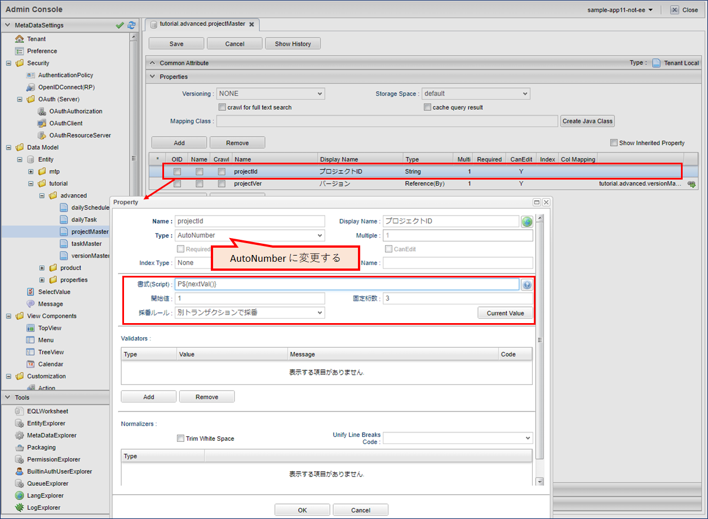
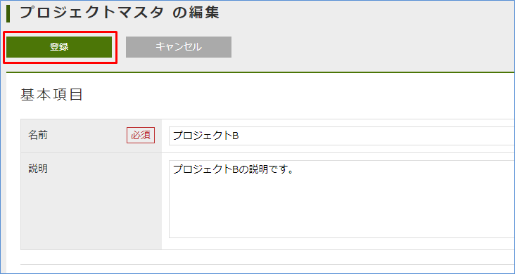
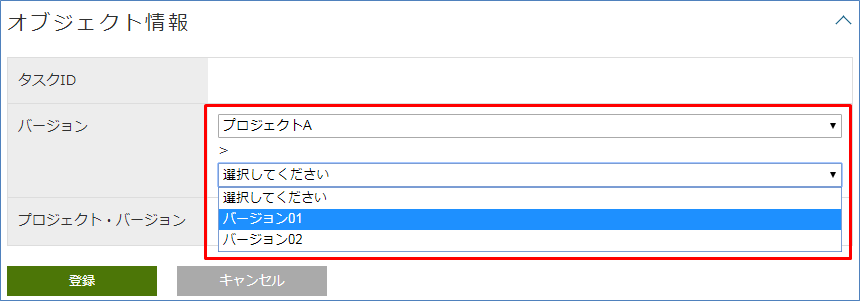
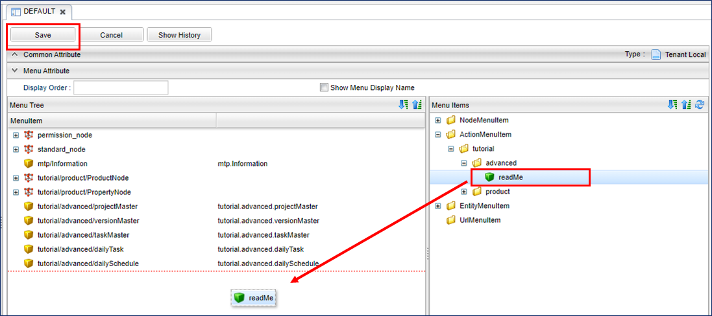
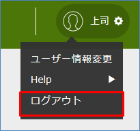
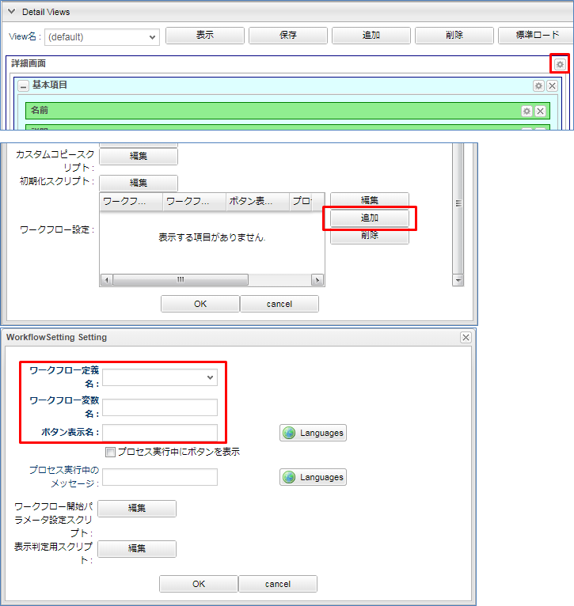
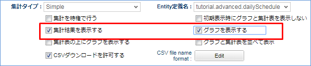

== Entityのカスタマイズ
まずはEntityを作成します。
ここではEntityを作成した後、Entityに対してカスタマイズを行っていきます。
管理者権限を持つユーザーでログインしてください。

=== 準備作業
アプリを作成するに当り、まずはEntityのメタデータを登録していきます。
AdminConsoleから以下の名前のEntityを作成してください。

[options="header"]
|===
|名前|表示名
|tutorial.advanced.projectMaster|プロジェクトマスタ
|tutorial.advanced.versionMaster|バージョンマスタ
|tutorial.advanced.taskMaster|タスクマスタ
|tutorial.advanced.dailyTask|今日のタスク
|tutorial.advanced.dailySchedule|今日のスケジュール
|===

それぞれのEntityに以下のPropertyを追加してください。 +
TypeがReferenceの項目を参照する際はすでにEntityが作成されている必要があり、
Entityを設定後、改めてReference項目を追加します。

.タスクマスタEntity(tutorial.advanced.taskMaster)
[cols="1,1,1,3a", options="header"]
|===
|Name|DisplayName|Type|属性値
|taskId|タスクID|String|
|projectVer|バージョン|Reference|[options="header"]
!===
!項目!設定値
!参照エンティティ!tutorial.advanced.versionMaster
!===
|projectAndVer|プロジェクト・バージョン|String|
|===

.バージョンマスタEntity(tutorial.advanced.versionMaster)
[cols="1,1,1,3a", options="header"]
|===
|Name|DisplayName|Type|属性値
|project|プロジェクト|Reference|[options="header"]
!===
!項目!設定値
!参照エンティティ!tutorial.advanced.projectMaster
!===
|task|タスク|Reference|[options="header"]
!===
!項目!設定値
!Multipule!*
!参照エンティティ!tutorial.advanced.taskMaster
!参照関係!親子関係
!被参照プロパティ!projectVer
!===
|projectName|プロジェクト名|String|
|===

.プロジェクトマスタEntity(tutorial.advanced.projectMaster)
[cols="1,1,1,3a", options="header"]
|===
|Name|DisplayName|Type|属性値
|projectId|プロジェクトID|String|
|projectVer|バージョン|Reference|[options="header"]
!===
!項目!設定値
!Multipule!*
!参照エンティティ!tutorial.advanced.versionMaster
!参照関係!親子関係
!被参照プロパティ!project
!===
|===

.今日のタスクEntity(tutorial.advanced.dailyTask)
[cols="1,1,1,3a", options="header"]
|===
|Name|DisplayName|Type|属性値
|task|タスク|Reference|[options="header"]
!===
!項目!設定値
!参照エンティティ!tutorial.advanced.taskMaster
!===
|planedManhour|工数（予定）[h]|Float|
|actualManhour|工数（実績）[h]|Float|
|dailySchedule|今日のスケジュール|Reference|[options="header"]
!===
!項目!設定値
!参照エンティティ!tutorial.advanced.dailySchedule
!===
|projectAndVersion|プロジェクト・バージョン|String|
|===

.今日のスケジュールEntity(tutorial.advanced.dailySchedule)
[cols="1,1,1,3a", options="header"]
|===
|Name|DisplayName|Type|属性値
|day|日付|Date|
|dailyTask|タスク|Reference|[options="header"]
!===
!項目!設定値
!Multipule!*
!参照エンティティ!tutorial.advanced.dailyTask
!参照関係!親子関係
!被参照プロパティ!dailySchedule
!===
|totalPlanedManhour|総工数（予定）[h]|Float|
|totalActualManhour|総工数（実績）[h]|Float|
|===

以上で準備作業は完了です。

=== 自動採番機能（AutoNumber）
では、早速 `業務フロー` の流れに従ってGEMの編集画面からマスタデータを登録して行きましょう。
プロジェクトマスタEntityに以下の内容で新規登録します。

[options="header"]
|===
|名前|説明|プロジェクトID
|Aプロジェクト|Aプロジェクトの説明です。|P001
|Bプロジェクト|Bプロジェクトの説明です。|P002
|===

IDなど、上記の例のように `P001, P002, …` と一定の文法に従ってProperty名を指定したい場合でも、String型では手作業で値を入力しなければなりません。
手作業での入力では入力が面倒なだけでなく、入力ミスなども発生しかねません。
このようなケースでは、AutoNumber機能を用いると便利です。
AutoNumber機能は、一定の文法に従って値を自動採番する機能です。

実際にカスタマイズを加えてAutoNumber機能を利用してみましょう。

AutoNumberの詳細は<<../../developerguide/datamanagement/index.adoc#ref_property_autonumber, AutoNumber>>を参照してください。

.プロジェクトマスタEntity(tutorial.advanced.projectMaster)
プロジェクトIDの設定画面を表示し、設定を変更します。

固定桁数は値を何桁で表示するかを指定できます。ここでは3桁としているので、 `001, 002, 003,…` と表示されます。
また、書式は値を表示する際の書式を指定できます。ここでは `P${nextVal()}` と指定しているので、 `P001, P002, P003, …` と値がふられます。
その他の表記方法については `？` ボタンを押下すると確認できます。

[options="header"]
|===
|項目|設定値
|Type|AutoNumber
|開始値|1
|固定桁数|3
|書式（Script)|P${nextVal()}
|===

変更が完了したら、Entityを保存してください。

.タスクマスタEntity(tutorial.advanced.taskMaster)
同様にタスクIDの設定を以下のように変更してください。

[options="header"]
|===
|項目|設定値
|Type|AutoNumber
|開始値|1
|固定桁数|3
|書式(Script)|P${nextVal()}
|===

変更が完了したら、Entityを保存してください。

以上でAutoNumberの設定は完了です。

確認のため、プロジェクトマスタEntityにデータを追加します。
検索画面から新規登録を行います。

名前と説明を入力し、登録を行います。

プロジェクトIDに指定された書式に従って、自動的に値がふられているのが確認できます。

=== 関数(Expression)
次に、バージョンマスタEntityに以下のデータを登録します。

[cols="1,2,1,1", options="header"]
|===
|名前|説明|プロジェクト|プロジェクト名
|1.0.0|Aプロジェクトのバージョン1.0.0です。|Aプロジェクト|Aプロジェクト
|1.0.1|Aプロジェクトのバージョン1.0.1です。|Aプロジェクト|Aプロジェクト
|1.0.0|Bプロジェクトのバージョン1.0.0です。|Bプロジェクト|Bプロジェクト
|===

上記のプロジェクト名を登録した際、バージョンマスタEntityが参照するプロジェクトマスタEntityの名前を手作業で入力しました。
このように、他のProperty値を元に取得した値をセットしたい場合には、Expression機能を用いると便利です。
Expression機能では、四則演算式やEQL（iPLAss版SQL）を用いて値を取得することができます。 +
EQL についての詳しい説明を知りたい方は<<../../eqlreference/index.adoc#, EQLリファレンス>>を参照してください。

実際にカスタマイズを加えてExpressionを利用してみましょう。

Expression機能の詳細は<<../../developerguide/datamanagement/index.adoc#ref_property_expression, Expression>>を参照してください。

.バージョンマスタEntity(tutorial.advanced.versionMaster)
プロジェクト名の設定を以下のように変更してください。

式に記述された四則演算式やEQLに従って値が取得され、Property値としてセットされます。
ここでは、プロジェクトマスタのnameの値を取得するようEQLを記述しています。

[options="header"]
|===
|項目|設定値
|Type|Expression
|Result Type|String
|式|(select project.name from tutorial.advanced.versionMaster on .this= this)
|===

変更が完了したら、Entityを保存してください。

.今日のタスクEntity(tutorial.advanced.dailyTask)
同様にプロジェクト・バージョンの設定を以下のように変更してください。

[options="header"]
|===
|項目|設定値
|Type|Expression
|Result Type|String
|式| (select task.projectAndVer from tutorial.advanced.dailyTask on .this=this) +
※ タスクマスタEntityのプロジェクト･バージョンを取得
|===

変更が完了したら、Entityを保存してください。

.今日のスケジュールEntity(tutorial.advanced.dailySchedule)
こちらも同様に総工数（予定）[h]と総工数（実績）[h]の設定を以下のように変更してください。

[options="header"]
|===
|項目|設定値
|Name|totalPlanedManhour
|DisplayName|総工数（予定）[h]
|Type|Expression
|Result Type|Float
|式|(select sum(dailyTask.planedManhour) from tutorial.advanced.dailySchedule on .this=this) +
※ 今日のタスクEntityの工数（予定）[h]の値の合計値を取得
|===

[options="header"]
|===
|項目|設定値
|Name|totalActualManhour
|DisplayName|総工数（実績）[h]
|Type|Expression
|Result Type|Float
|式|(select sum(dailyTask.actualManhour) from tutorial.advanced.dailySchedule on .this=this) +
※ 今日のタスクEntityの工数（実績）[h]の値の合計値を取得
|===

変更が完了したら、Entityを保存してください。

確認のため、バージョンマスタEntityにデータを追加します。
検索画面から新規登録を行います。

名前と説明を入力、プロジェクトを選択し、登録を行います。

プロジェクト名にプロジェクトの名前が設定されているのが確認できます。

=== データ登録時のロジック呼出し(EventListener)
タスクマスタEntityに以下のデータを登録します。

[cols="1,2,1,1", options="header"]
|===
|名前|説明|バージョン|プロジェクト・バージョン
|資料作成|Aプロジェクトの資料作成です。|1.0.0（Aプロジェクト）|Aプロジェクト・1.0.0
|打合せ|Aプロジェクトの打合せです。|1.0.0（Aプロジェクト）|Aプロジェクト・1.0.0
|資料作成|Bプロジェクトの資料作成です。|1.0.0（Bプロジェクト）|Bプロジェクト・1.0.0
|打合せ|Bプロジェクトの打合せです。|1.0.0（Bプロジェクト）|Bプロジェクト・1.0.0
|===

プロジェクト・バージョンの項目は、それぞれプロジェクトマスタの名前、バージョンマスタの名前で構成されています。
タスクマスタEntityにはバージョンPropertyがあり、更にバージョンPropertyからはプロジェクトマスタEntityを参照として持っています。

ここではEventListener機能を利用して、Entityの登録や更新の際に呼び出すカスタムロジックで、プロジェクト・バージョンPropertyを設定しましょう。

また、今日のスケジュールEntityと今日のタスクEntityについても、名前Propertyを自動で設定するようEventListenerを設定します。
この方法は必須項目の名前Propertyをユーザーに直接入力させたくないようなシーンでも利用できます。

EventListener機能の詳細は<<../../developerguide/datamanagement/index.adoc#ref_entity_event_listener, EventListener>>を参照してください。

.今日のスケジュールEntity(tutorial.advanced.dailySchedule)
EventListenerを追加します。
デフォルトではEventListenersは閉じているので、バーをクリックしてEventListenersを開きます。

Addボタンをクリックして、編集用ダイアログを表示します。
`Script` を選択すると、以下のように設定画面が表示されるので `Edit` ボタンをクリックします。

編集用エディタを表示し、下記スクリプトを入力します。

[source,groovy]
----
import org.iplass.mtp.entity.Entity;
entity.setName("予定あり");
----

OKボタンをクリックして、ダイアログを閉じ、Entityを保存します。

image::images/entity_setevent.png[]

.今日のタスクEntity(tutorial.advanced.dailyTask)
同様にEventListenerに下記スクリプトを追加します。

[source,groovy]
----
import org.iplass.mtp.entity.Entity;

String taskName = entity.getValue("task.name");
entity.setName(taskName);
----

タスクマスタEntityから名前Propertyの値を取得し、今日のタスクEntityの名前Propertyに値をセットします。

変更が完了したら、Entityを保存してください。

.タスクマスタEntity(tutorial.advanced.taskMaster)
こちらも同様にEventListenerに下記スクリプトを追加します。

バージョンマスタEntityから名前Propertyとプロジェクト名Propertyの値を取得し、両者を結合してプロジェクト・バージョンプロパティにセットします。

[source,groovy]
----
import org.iplass.mtp.entity.Entity;

String ver = entity.getValue("projectVer.name");
String project = entity.getValue("projectVer.projectName");
String projectAndVer = (project == null || ver == null ? '' : project + " " + ver);
entity.setValue("projectAndVer", projectAndVer);
----

変更が完了したら、Entityを保存してください。

確認のために、タスクマスタEntityにデータを追加します。
検索画面から新規登録を行います。

名前と説明を入力、バージョンを選択し、登録を行います。

プロジェクト・バージョンにバージョンマスタの名前とプロジェクト名の値を結合した値が設定されているのが確認できます。

=== 入力チェック機能(Validator)
Entityに登録させるデータの入力チェックを行いたい場合には、Validator機能を用います。

ここでは、今日のタスクEntityの工数（予定）[h]と工数（実績）[h]に0～24以外の値が入力された際にはエラーを表示するよう、Validatorを付与します。

まず、入力チェックエラー発生時のメッセージを登録します。
Data ModelのMessageを右クリックして表示されるコンテキストメニューから「メッセージカテゴリを作成する」をクリックして、以下のメッセージを作成してください。

[options="header"]
|===
|項目|設定値
|名前|tutorial/advanced/common
|表示名|共通
|===

行を追加し、メッセージアイテムを追加します。
ID列をクリックしてIDを設定します。

[options="header"]
|===
|項目|設定値
|ID|M0001
|===

Message列をクリックしてメッセージを設定します。
${min}、${max}には後ほどValidatorで指定する値が入ります。

[options="header"]
|===
|項目|設定値
|Message|${min}～${max}の間の値を指定してください。
|===

Saveボタンをクリックし、メッセージを保存します。

次に、PropertyにValidatorの設定を行います。

.工数（予定）[h]
今日のタスクEntity(tutorial.advanced.dailyTask)の工数（予定）[h]のPropertySettingから以下の設定を行ってください。

入力された数値が特定の範囲内になければエラーとします。

MinとMaxには入力可能な値の範囲を指定します。さきほど作成したメッセージの${min}、${max}にはここのMinとMaxの値が入ります。
Message Categoryはエラー時に使用したいメッセージのメッセージカテゴリ名を選択します。
ここでは、 `tutorial/advanced/common` を指定してください。
Message Idにはエラー時に使用したいメッセージのメッセージIDを指定します。
ここでは、 `M0001` を指定してください。
Codeの設定は任意です。

.工数（実績）[h]
工数（実績）[h]についても同様に設定を行い、Entityを保存します。

確認のため、今日のタスクEntityにデータを追加します。
検索画面から新規登録を行います。

工数（実績）[h]に入力チェックエラーとなる値を設定し、登録を行います。

画面上部にエラーメッセージが表示されます。
また、入力チェックエラーとなった箇所にも詳細メッセージが表示されています。

=== [.eeonly]#更新履歴の記録(AuditLog)#
Entityの更新履歴を記録したい場合には、AuditLog機能を用います。
ここでは、プロジェクトマスタEntityの更新履歴を記録するよう、AuditLogの設定を行います。

プロジェクトマスタEntity(tutorial.advanced.projectMaster)で `save audit log` を有効にします。
チェックを入れることで、操作ログが記録されます。

image::images/entity_auditlog.png[]

プロジェクトマスタEntityのDetail_Layoutを開き、標準ロードをクリックします。

Entity定義にあわせた標準設定がロードされます。
AuditLogを有効にしているため、AuditLog Sectionが追加されています。
保存ボタンをクリックして画面定義を保存します。

右側の一覧からドラッグ&ドロップで配置することも出来ます。

確認のため、プロジェクトマスタEntityにデータを追加します。
検索画面から新規登録を行います。

検索画面から新規登録を行います。

作成されたプロジェクトマスタのデータを編集します。

内容を編集し、保存してください。

操作ログセクションを開きます。

操作ログセクションにエンティティデータの操作履歴（変更されたプロパティと、変更前、変更後の値）が記録されていることが確認できます。

以上でEntityの設定は完了です。

次からは画面の表示内容に関する設定を行っていきます。

== 検索・詳細画面のカスタマイズ
ここからは、検索画面と詳細画面の画面レイアウトをカスタマイズしていきます。 +
GEM画面の `SearchLayout`、 `DetailLayout`  についての詳しい説明を知りたい方は<<../../developerguide/genericentitymanager/entityview/index.adoc#,Generic Entity Manager (EntityView)>>を参照してください。

=== 検索画面でのReferenceProperty
詳細画面にReference型のPropertyの内容を表示する方法には以下の方法があります。

* Link
* Select
* Checkbox
* RefCombo
* NestTable
* Label

ここではRefComboとNestTableについて扱います。

==== NestTable
まずは今日のスケジュールEntityについて、NestTableの設定を行います。
今日のスケジュールEntity(tutorial.advanced.dailySchedule)のDetail_Layoutを開いてください。
レイアウトが読み込まれていない場合は標準ロードを押下してデフォルトレイアウトを読み込んでください。
タスクの設定を表示します。

プロパティエディタの編集をクリックします。

表示タイプで `NestTable` を選択します。
参照型の表示プロパティで、NestTableに表示する今日のタスクEntityのプロパティを追加していきます。

参照先のプロパティの設定画面で以下の表示プロパティを追加してください。

表示タイプについては、プロパティエディタの編集ボタンをクリックした際に表示される画面で設定してください。

[options="header"]
|===
|項目|設定値
|プロパティ名|projectAndVersion
|プロパティエディタ|StringPropertyEditor
|表示タイプ|Label
|===

[options="header"]
|===
|項目|設定値
|プロパティ名|task
|プロパティエディタ|ReferencePropertyEditor
|===

[options="header"]
|===
|項目|設定値
|プロパティ名|planedManhour
|プロパティエディタ|FloatPropertyEditor
|===

[options="header"]
|===
|項目|設定値
|プロパティ名|actualManhour
|プロパティエディタ|FloatPropertyEditor
|===

プロパティの追加が完了したら設定内容を保存してください。
以上でNestTableの設定は完了です。

確認のため、今日のスケジュールEntityにデータを追加します。

タスクを追加すると、参照元Entityのテーブルの中に参照先Entityのテーブルが生成されます。
データを入力して登録します。

編集画面同様、詳細画面にもテーブルが入れ子になって表示されます。

==== Reference Combo
NestTableでは参照先情報を入れ子構造の表形式で表示しましたが、Reference Comboでは、参照先の情報をドロップダウン形式で表示します。
ここでは、タスクマスタEntityのデータを関連するプロジェクト名からたどって検索できるよう、Reference Comboの設定を行います。

タスクマスタEntity(tutorial.advanced.taskMaster)のSearch_Layoutを開いてください。
レイアウトが読み込まれていない場合は標準ロードを押下してデフォルトレイアウトを読み込んでください。

image::images/view_searchlayout-taskmaster.png[]

バージョンの設定を表示します。

プロパティエディタの編集をクリックします。

表示タイプで `RefCombo` を選択します。
参照コンボの検索方法にUPPERを選択します。
参照コンボ設定でReferenceComboSettingを選択し、編集ボタンをクリックします。
参照コンボ設定の編集ボタンをクリックした際に表示される画面でプロパティ名にprojectを選択します。

参照コンボの検索方法でUPPERを指定している場合、条件が指定されていないドロップダウンがあっても、指定されている条件を適用して検索します。

UPPERを選択していない場合、Reference Comboのドロップダウンに値を指定していない項目があれば、全件検索とみなされます。

image::images/view_searchresult-refcombo.png[]

プロパティ名にはバージョンマスタEntityに定義されている参照型Propertyの名前を指定します。
ここではprojectを指定します。

検索条件となるEntityから見て、上位になる参照プロパティを指定していくことで、3段階以上の参照コンボを設定することも出来ます。
指定したい場合には、同じように参照コンボ設定でさらに上位のプロパティを設定していきます。

OKボタン、保存ボタンを順に押下して、編集内容を保存してください。
検索画面と同様に、詳細画面についても設定を行っていきます。
タスクマスタEntity(tutorial.advanced.taskMaster)のDetail_Layoutを開いてください。

検索画面同様にReference Comboの設定を行います。

以上でReference Comboの設定は完了です。

確認のため、タスクマスタEntityの検索画面を開いてください。
バージョンの項目でプロジェクトを選択すると、そのプロジェクトを参照しているバージョンが次のリストに表示されます。

編集画面についても確認してみましょう。

編集画面でも同様に選択、指定できることが確認できます。

以上で動作確認は終わりです。

=== 詳細画面の２列表示
デフォルトでは詳細画面ではプロパティ情報が1列の表形式で表示されますが、Detail_Layoutから列数を増やすことが可能です。
今日のスケジュールEntityのPropertyデータの一部を2列で表示するよう設定を行います。

今日のスケジュールEntity(tutorial.advanced.dailySchedule)のDetail_Layoutを開いてください。
 `標準セクション` をDetail Viewsにドラッグ&ドロップします。

Section Settingウインドウが立ち上がるので、タイトルと列数を指定してください。

[options="header"]
|===
|項目|設定値
|タイトル|総工数
|列数|2
|===

総工数（予定）[h]を総工数セクションにドラッグ&ドロップします。
同様に総工数（実績）[h]もドラッグ&ドロップします。

保存ボタンを押下して変更内容を保存してください。
以上で2列表示の設定は完了です。

確認のため、今日のスケジュールEntity(tutorial.advanced.dailySchedule)の詳細画面を開いてください。
総工数セクションが2列で表示されていることが確認できます。

以上で動作確認は終わりです。

=== オリジナルテンプレートの組込
オリジナルで作成したテンプレートの組込方法を説明します。
作成したテンプレートはホーム画面に表示したり、メニューから表示したりすることができます。
ここでは、テンプレートをメニューから表示する方法について説明します。

.設定
まず、テンプレートを作成します。

次のテンプレートを作成してください。

[options="header"]
|===
|項目|設定値
|Name|tutorial/advanced/readMe
|Display Name|利用方法
|Type|Html (TextResource)
|===

作成したテンプレートを表示します。
Layout Actionには `gem/layout/defaultLayout` （標準レイアウト）を指定します。
これはTop画面や検索一覧等のGEM画面で利用しているヘッダーやメニューを、このテンプレートでも利用するためです。

[source,html]
----

<h1>iPLAss Scheduler利用方法
</h1>
 
iPLAss Schedulerを利用する際は、以下の手順に従って操作してください。
 
１．プロジェクトマスタにプロジェクトを登録する 
２．バージョンマスタにバージョンを登録する 
３．タスクマスタにタスクを登録する 
４．今日のスケジュールでその日のスケジュールを登録する 

----

Saveボタンを押下して変更内容を保存してください。 +
次に、テンプレートを呼び出すためのアクションを作成します。

以下のアクションを作成してください。

[options="header"]
|===
|項目|設定値
|Name|tutorial/advanced/readMe
|Display Name|利用方法
|===

作成したアクションを開き、Resultsを追加します。

[options="header"]
|===
|項目|設定値
|Status|*
|Type|Template
|Template|tutorial/advanced/readMe
|===

Saveボタンを押下して変更内容を保存してください。 +
続いて、作成したアクションを呼び出すためのメニューを追加します。
Menu Itemsに表示されているActionMenuItemを右クリックし、表示されるコンテキストメニューから「メニューアイテムを作成する」を選択します。

[options="header"]
|===
|項目|設定値
|Name|tutorial/advanced/readMe
|Display Name|利用方法
|Execute Action|tutorial/advanced/readMe
|===

メニューアイテムをメニューツリーにドラッグ&ドロップしてメニューに追加します。
メニュー追加後、保存したら設定完了です。

確認のため、ホームボタンを押下してメニューを更新してください。
 `利用方法` のメニュ－が増えていることが確認できます。
また、このメニューをクリックして利用方法の画面を開くと、作成したテンプレートが表示されているのが確認できます。

== Top画面のカスタマイズ
ここからは、Top画面のカスタマイズを行います。 +
GEM画面の `TopView` についての詳しい説明を知りたい方は<<../../developerguide/genericentitymanager/topview/index.adoc#,Generic Entity Manager (TopView)>>を参照してください。

=== オリジナルテンプレートの組込
検索・詳細画面のカスタマイズでは、作成したテンプレートをメニューから表示する方法について説明しましたが、ここでは、テンプレートをTop画面に組み込む方法について説明します。

作成するテンプレートはTop画像を表示するためのテンプレートとTop画面に表示するテンプレートの2つです。

まずは、Top画面用テンプレートで使用する画像を登録します。
テンプレートに表示するための画像は予め用意しておいてください。
以下に従ってテンプレートを作成してください。

[options="header"]
|===
|項目|設定値
|Name|tutorial/advanced/topImg
|Display Name|チュートリアルトップ画像
|Type|Binary
|===

Top画面で使用する画像ファイルを選択し、保存してください。

次に、topImgテンプレートを呼び出すためのActionを作成します。

image::images/top_createaction.png[]

[options="header"]
|===
|項目|設定値
|Name|tutorial/advanced/topImg
|Display Name|チュートリアルトップ画像
|===

作成したアクションを開き、Resultsに画像テンプレートを指定します。

[options="header"]
|===
|項目|設定値
|Status|*
|Type|Template
|Template|tutorial/advanced/topImg
|===

アクションを保存します。

引き続きTop画面用のテンプレートを作成します。

次のテンプレートを作成してください。

[options="header"]
|===
|項目|設定値
|Name|tutorial/advanced/top
|Display Name|チュートリアルトップ
|Type|GroovyTemplate
|===

テンプレート内の画像イメージのURLに、先ほど作成したアクションのPathを指定し、保存します。

[source,jsp]
----
<%@import org.iplass.mtp.web.template.TemplateUtil%>

<head>
 

<b>** iPLAss Scheduler **</b>

</head>

 

<body>

<% def contextPath = TemplateUtil.getTenantContextPath(); %>

</body>

 
 
 
----

Top画面にテンプレートを追加します。TopViewを開いてください。

さきほど作成したチュートリアルトップTemplateを選択します。

Saveボタンを押下して変更内容を保存したら、Top画面へのテンプレートの組込は完了です。

確認のため、ホームボタンを押下してTop画面を更新してください。
作成したテンプレートが表示されていることが確認できます。

以上で動作確認は終わりです。

=== カレンダー
ここからはトップ画面にカレンダーを表示する方法について説明します。 +
GEM画面の `Calendar` についての詳しい説明を知りたい方は<<../../developerguide/genericentitymanager/calendar/index.adoc#,Generic Entity Manager (Calendar)>>を参照してください。

まず、トップ画面に表示するためのカレンダーを作成します。

[options="header"]
|===
|項目|設定値
|Name|tutorial/advanced/dailySchedule
|Display Name|今日のスケジュール
|===

作成したカレンダーを開きます。
カレンダーに表示したいエンティティを登録します。
ここでは、今日のスケジュールEntityに登録した内容をカレンダーに表示したいので、今日のスケジュールEntityをEntity ItemsからTarget Itemsにドラッグ&ドロップします。

Top画面に作成したカレンダーを組み込みます。
TopViewを開いてください。
テンプレートの時と同様に、ItemsからMainAreaにドラッグ&ドロップしてください。

以上で設定は完了です。

確認のために、ホームボタンを押下してTop画面を更新してください。
カレンダーがトップ画面に組み込まれていることが確認できます。

以上で動作確認は終わりです。

== その他の機能

=== Entity権限
チュートリアル（ベーシック）の<<../basic/index.adoc#role_initialrole, 初期ロールと付与権限>>にある通り、テナント作成時に作成されるロールでは今回作成したEntityに対する権限がありません。
ここまでは管理者ユーザーによる操作のため、特に問題はありませんでしたが、ここからは実際のユーザーが扱うデータについて権限制御を行います。

まずはマスタ系のデータについては上司のみが編集可能とし、社員は閲覧のみ可能とするようカスタマイズを加えてみましょう。

上司用のグループと社員用のグループを作成します。
このグループは権限制御を行う際の条件として利用します。
グループを作成することで、そのグループに属する複数のユーザーに対して同じロールを割り当てることが可能になります。

`基本情報` － `グループ情報` メニューを選択すると表示される検索画面から `新規登録` ボタンをクリックし、以下の二つのグループを作成してください。

[options="header"]
|===
|グループコード|名前|親グループ
|manager|管理者グループ|GemUser
|member|社員グループ|GemUser
|===

権限が制御されていることを確認するためのユーザーを用意します。

アカウント作成方法はチュートリアル（ベーシック）の<<../basic/index.adoc#usermanagement_regist, ユーザーの登録>>を参照してください。

[options="header"]
|===
|ユーザーID|姓|メールアドレス|グループ|アカウントポリシー
|boss@advanced|上司|boss@test.jp|管理者グループ|標準
|member01@advanced|社員|member@test.jp|社員グループ|標準
|===

セキュリティ権限を分けるためのロールを作成します。
以下のロールを作成してください。

ロールの作成方法は<<../basic/index.adoc#role_securitycontrol, チュートリアル（ベーシック）>>を参照してください。

[cols="1,2a", options="header"]
.管理者用ロール
|===
|項目|設定値
|ロールコード|tutorial/advanced/manager
|名前|manager
|ロール条件|[options="header"]
!===
!項目!設定値
!名前!管理者
!条件!user.memberOf("manager")
!===
|===

[cols="1,2a", options="header"]
.社員用ロール
|===
|項目|設定値
|ロールコード|tutorial/advanced/member
|名前|member
|ロール条件|[options="header"]
!===
!項目!設定値
!名前!社員
!条件!user.memberOf("member")
!===
|===

各Entityに対するCRUD権限を制御するために、Entity権限を作成します。
`権限情報` － `Entity権限` メニューを選択し、検索画面を表示します。

`新規登録` ボタンをクリックし、以下のEntity権限を作成してください。

.管理者用Entity権限
[cols="2,2,1,1,1,1,1", options="header"]
|===
|名前|対象Entity|ロール|参照|登録|更新|削除
|プロジェクトマスタAll|プロジェクトマスタ|manager|許可|許可|許可|許可
|バージョンマスタAll|バージョンマスタ|manager|許可|許可|許可|許可
|タスクマスタAll|タスクマスタ|manager|許可|許可|許可|許可
|今日のタスクAll|今日のタスク|manager|許可|許可|許可|許可
|今日のスケジュールAll|今日のスケジュール|manager|許可|許可|許可|許可
|===

.社員用Entity権限
[cols="2,2,1,1,1,1,1", options="header"]
|===
|名前|対象Entity|ロール|参照|登録|更新|削除
|プロジェクトマスタ参照|プロジェクトマスタ|member|許可|不許可|不許可|不許可
|バージョンマスタ参照|バージョンマスタ|member|許可|不許可|不許可|不許可
|タスクマスタ参照|タスクマスタ|member|許可|不許可|不許可|不許可
|今日のタスクAll|今日のタスク|member|許可|許可|許可|許可
|今日のスケジュールAll|今日のスケジュール|member|許可|許可|許可|許可
|===

入力が完了したら登録ボタンを押下してそれぞれのEntity権限を登録してください。

それぞれのロールに紐づけるメニューを作成します。
現在の設定ではデフォルトのメニューを使用しているので、これをコピーして、管理者用メニューと社員用メニューを作成します。

以下の２つのMenuを作成してください。

[options="header"]
|===
|Name|DisplayName
|tutorial/advanced/manager|manager
|tutorial/advanced/member|member
|===

入力が完了したら、Saveボタンを押下して保存してください。
それぞれのメニューのカスタマイズは特には不要です。

続いて、各Entityの画面が利用できるよう、検索画面と詳細画面のレイアウトを作成しておきます。 +
[red]#*レイアウトが作成されていない場合は、後述の操作を行う際に対象となるメニューが表示されません。ここまでの操作でレイアウトが未設定のEntityに対してSearch_LayoutとDetail_layoutを開き、標準ロードで作成される設定を保存してください。*#

以上でセキュリティ権限の設定は完了です。

確認のため、管理者ユーザーから一度ログアウトしてください。

まずは上司アカウントboss@advancedでログインしてください。

マスタ系Entityの検索画面を開きます。

参照、登録、更新、削除の4つの操作全て実施可能なことが確認できます。

再度ログアウトし、社員アカウントmember01@advancedでログインし直してください。

マスタ系Entityの検索画面を確認します。

image::images/other_menu-member.png[]

参照のみ可能なことが確認できます。

このように、ユーザー毎（ロール毎）に権限制御を行うことで、必要最低限の情報のみ開示したり、不要な操作をさせないよう制限することができます。

=== [.eeonly]#メール/ワークフロー機能#
一日の実績登録が完了した際に、Entity登録画面から上司にメールで報告できるよう設定を行います。

まずは、メールのテンプレートを作成します。以下のテンプレートを作成してください。

[options="header"]
|===
|項目|設定値
|Name|tutorial/advanced/reportMail
|Display Name|実績報告メール
|===

送信するメールの件名とメッセージを入力してください。

[source,jsp]
----
関係者各位

お疲れ様です。

今月分の実績登録が完了しましたので
ご報告します。

以上、よろしくお願いいたします。
----

次に、メール機能を利用するためにWorkflowを作成します。
以下のWorkflowを作成してください。

なお、Workflowの詳細な操作方法等については<<../workflow/index.adoc#, チュートリアル（ワークフロー）>>を参照してください。 +
設定後のワークフローは以下の図となります。

[options="header"]
|===
|項目|設定値
|Name|tutorial/advanced/report
|Display Name|実績報告
|===

各Itemの設定をしていきます。記載のない項目名については設定不要です。

.Variable
ワークフローの変数です。
ワークフローを起動した際のEntityデータが格納されます。

[options="header"]
|===
|項目|設定値
|Name|reportVariable1
|Display Name|ReportVariable1
|===

.MailTask
メール送信を行うタスクです。
メールテンプレートや宛先を設定します。

[cols="1,2a", options="header"]
|===
|項目|設定値
|Name|mailTask1
|Display Name|MailTask1
|mailTemplateName|tutorial/advanced/reportMail
|to|[options="header"]
!===
!項目!設定値
!定義形式!STRING
!to取得ロジック!boss@test.jp
!===
|===

.UserTask
ユーザーが何かしらの操作を行うタスクです。
割り当てられたユーザーの操作により処理の分岐などが可能です。

[options="header"]
|===
|項目|設定値
|Name|userTask1
|Display Name|UserTask1
|asignRule|設定値詳細については下記 `<<assignRule>>` 参照
|taskResultStatus|設定値詳細については下記 `<<taskResultStatus>>` 参照
|===

[[assignRule]]
.assignRule
タスクをユーザーに割り当てるためのルールを設定します。
ここでは上司に当たるユーザーを指定します。

[options="header"]
|===
|項目|設定値
|タイプ|ById
|適用フロー名|*
|割当種別|ALL
|完了条件|ANYONE
|定義形式|STRING
|ID取得ロジック|boss@advanced
|===

[[taskResultStatus]]
.taskResultStatus
タスクの結果を設定します。
ここで設定された値がワークフローの詳細画面で、ユーザーが行える操作となります。
Nameの値をユーザータスクから伸びる矢印に設定することで、フローの進行を制御できます。

[options="header"]
|===
|項目|設定値
|Name|ok
|Display Name|承認
|Primary|チェックを入れる
|===

続いて、ワークフローを起動するための設定をDetail_Layoutから行います。
今日のスケジュールEntity(tutorial.advanced.dailySchedule)のDetailLayoutからDetailFormViewの設定を行ってください。

[options="header"]
|===
|項目|設定値
|ワークフロー定義名|tutorial/advanced/report
|ワークフロー変数名|reportVariable1
|ボタン表示名|報告メール送信
|===

次に、上司が報告を確認・承認するために、Top画面にワークフローから割り当てられたタスクを表示するパーツを設定します。
以下のTopViewを作成してください。

[options="header"]
|===
|項目|設定値
|Name|tutorial/advanced/manager
|DisplayName|manager
|===

作成したTopViewを開き、UserTaskListをドラッグ&ドロップします。

パーツの設定画面を開き、 `UserTaskView Setting` をクリックします。
`Show Section Properties` の一覧内のチェックボックスを全てチェックし、OKボタンをクリックします。

完了後、TopViewを保存してください。

前項でロールおよび権限を作成しましたが、ワークフローを利用する際にも権限が必要になります。

以上でワークフローを利用したメール機能の設定は完了です。

確認のため、一度ログアウトし、社員ユーザー（menber01@advanced）でログインします。
今日のスケジュールを作成後、詳細画面から報告メールの送信を行ってください。

ワークフローが起動し、boss@test.jpにメールが送信されます。

上司ユーザー（boss@advanced）でログインします。
タスクが割り当てられているのが確認できます。
編集リンクをクリックして編集画面を表示します。

編集画面から承認処理を実施します。

image::images/other_approval.png[]

Top画面に戻り、タスク一覧で完了分を含むにチェックを入れ、再表示を行います。
処理が完了していることが確認できます。

以上で動作確認は終わりです。

=== [.eeonly]#グラフ/集計表（Aggregation）#
総工数の予定と実績の推移をグラフで表示します。
以下の流れに沿って、Aggregationの設定を行ってください。

次のAggregationを作成してください。

[options="header"]
|===
|項目|設定値
|Name|tutorial/advanced/graph
|Display Name|工数グラフ
|Entity定義名|dailySchedule（今日のスケジュール）
|===

Aggregationを開き、以下の設定を行ってください。

.表示形式の指定

`グラフを表示する` 、 `集計表の上にグラフを表示する` にチェックを入れてください。

.フィルタ項目の設定
day（日付）をフィルタ項目に設定します。

.集計表設定
今日のスケジュールEntity(tutorial.advanced.dailySchedule)から日付、総工数（予定）、総工数（実績）を検索するEQLを設定します。

[source,sql]
----
select day, totalPlanedManhour, totalActualManhour
from tutorial.advanced.dailySchedule
order by day
----

追加ボタンから以下を追加してください。指定のない項目については設定は不要です。

[options="header"]
|===
|項目|設定値
|表示ラベル|日付
|表示ラベル|総工数（予定）
|表示ラベル|総工数（実績）
|===

.グラフ設定
グラフ設定タブから、以下の設定を行ってください。
指定のない項目については設定は不要です。

[options="header"]
|===
||項目|設定値
.2+|グラフの設定|グラフタイプ|線グラフ
|横軸列|日付
.6+|軸1の設定|グラフ対象アイテム|総工数（予定）、総工数（実績）
|数値のフォーマット|小数
|小数の桁数|1
|Y軸の最大値|12
|Y軸の最小値|0
|刻み幅|1
|===

設定が完了したら保存します。

.メニューへの追加
管理者グループのメニューに工数グラフを表示するためのActionを追加します。
Menu Itemsに表示されているActionMenuItemを右クリックし、表示されるコンテキストメニューから「メニューアイテムを作成する」を選択します。

[options="header"]
|===
|Name|tutorial/advanced/viewGraph
|DisplayName|工数グラフ
|Execute Action|gem/aggregation/unit/viewAggregation
|Parameter|defName=tutorial/advanced/graph
|===

viewGraphをMenuItemsからMenuTreeに追加します。

メニューを保存します。

以上で設定は完了です。

確認のため、ホームボタンを押下してTop画面を更新してください。
メニューに工数グラフが追加されているのが確認できます。

追加したメニューをクリックし、画面を表示します。

フィルター項目に設定した項目がフィルタ条件に追加されています。
また、今日のスケジュールEntityに登録したデータが折れ線グラフと集計表として表示されているのが確認できます。

