== About This Tutorial
In previous tutorial (Basic), we explained the minimum features required to use iPLAss. However, iPLAss usage scenes are limited if with these functions only.
Starting from here, we will explain a simple customization function to utilize iPLAss to fit a wider range of scenes.

In this tutorial, we will create a simple man-hour management application to manage daily tasks and planned/actual man-hours.
We will explain the features involved while creating the application.

.Business Flow
The business logics flow assumed by the app is as follows.

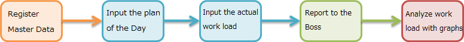

.Entity Relationship Diagram
The entities created in this tutorial are as follows.

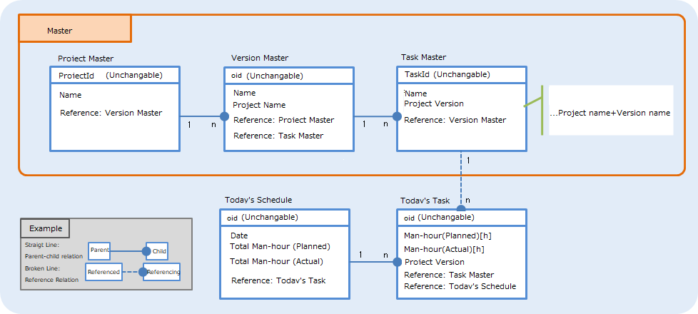

=== Features Used
The following functions are used when creating a man-hour management application.

. Entity Custom Features
.. <<index.adoc#func_autonumber, Auto Number>>
.. <<index.adoc#func_expression, Expression>>
.. <<index.adoc#func_eventlistener, Event Listener>>
.. <<index.adoc#func_validator, Validator>>
.. <<index.adoc#func_auditlog, [.eeonly]#AuditLog#>>
. View Custom Features
.. <<index.adoc#func_nesttable, Nest Table>>
.. <<index.adoc#func_referencecombo, Reference Combo>>
.. <<index.adoc#func_sectionsetting, Section Setting>>
.. <<index.adoc#func_template, Template>>
.. <<index.adoc#func_calendar, Calender>>
. Other Features
.. <<index.adoc#func_entitypermission, Entity Permission>>
.. <<index.adoc#func_mail_workflow, [.eeonly]#Mail/Workflow#>>
.. <<index.adoc#func_aggregation, [.eeonly]#Aggregation#>>

[[func_autonumber]]
.Auto Number
Even if the user does not specify a value, the value is automatically assigned according to a set rule.
Here, the project ID is set to automatic incrementing in the format of “Pxxx”.

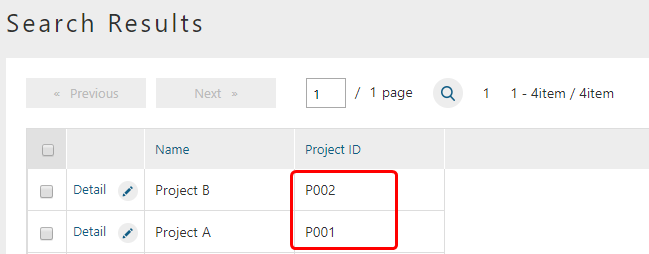

[[func_expression]]
.Expression
The value is automatically set according to the specified logic.
Here, the total value of man-hours (planned) is set.

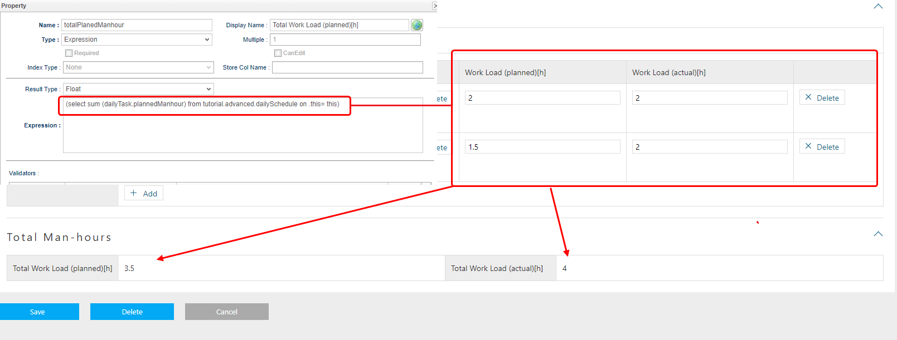

[[func_eventlistener]]
.Event Listener
Specified Logic will be called when the event of creating/updating Entity data has happened.
Here, the logic to automatically set a value to the name when creating/updating Entity data is called.

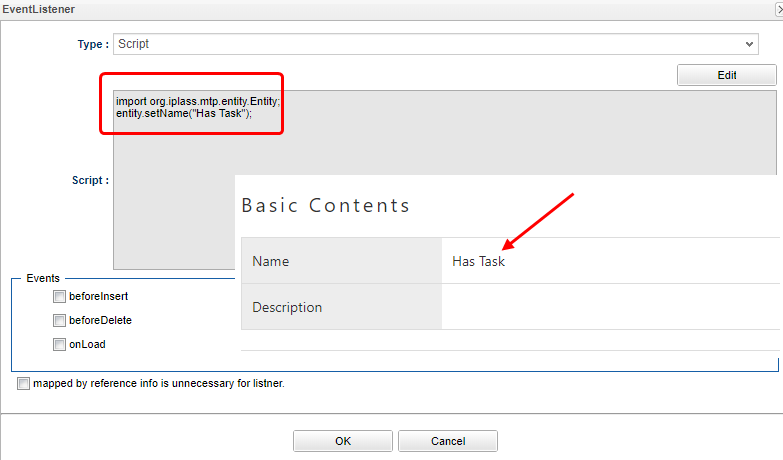

[[func_validator]]
.Validator
Perform input check of Property.
Here, an error is displayed when a value other than 0 to 24 is entered.

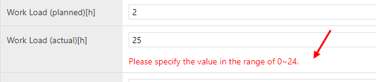

[[func_auditlog]]
.AuditLog
If you turn on Audit Log, you can record the operation log of the entity.

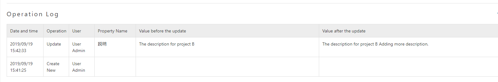

[[func_nesttable]]
.NestTable
Nest tables to display Reference information.

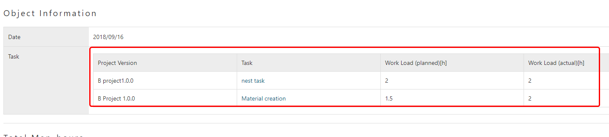

[[func_referencecombo]]
.ReferenceCombo
Displays reference information of multiple stages in a drop-down.

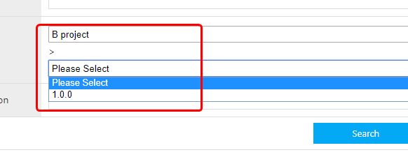

[[func_sectionsetting]]
.Section Setting
You can specify the section name and the number of columns.
Here, the section name is “total man-hours” and the number of columns is two.

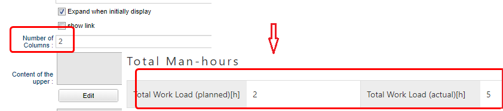

[[func_template]]
.Template
You can incorporate your original template into the screen.

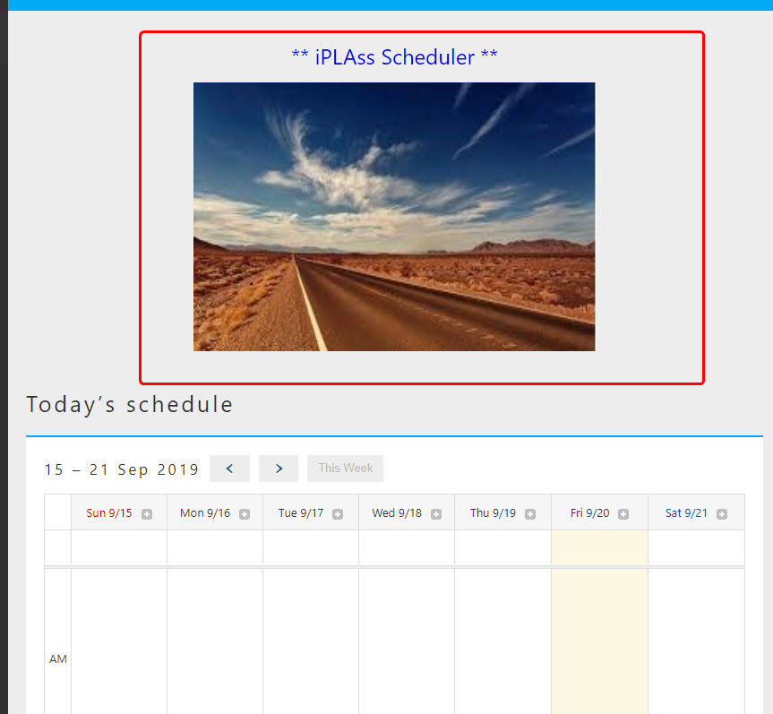

[[func_calendar]]
.Calendar
Entity information with Date type or DateTime type Property can be displayed on the calendar using the calendar function.

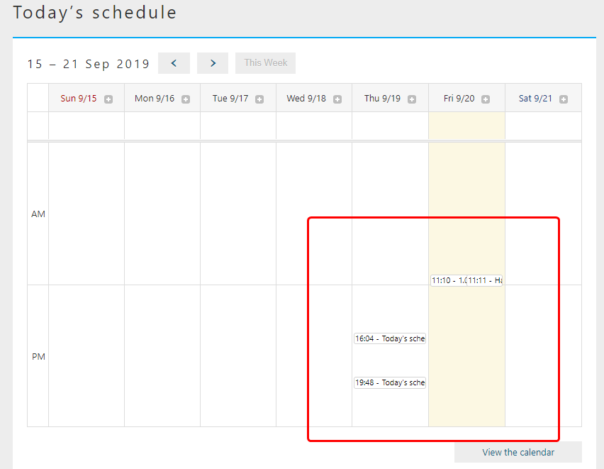

[[func_entitypermission]]
.Entity Permission
The operative privilege for Entity can be changed according to the user.
The screen item display also changes for users who can browse, register, update, and delete and users who can only browse.

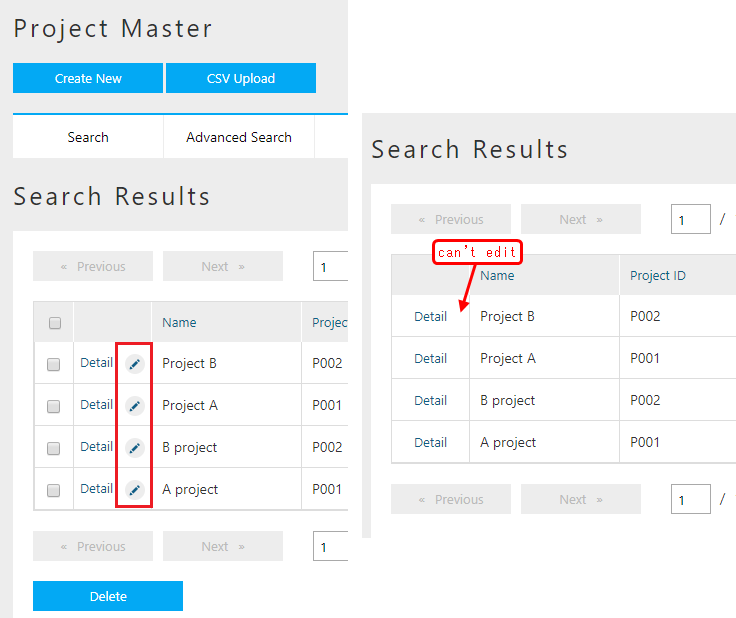

[[func_mail_workflow]]
.[.eeonly]#Mail/Workflow#
You can create an email template and send an email from the iPLAss screen via a workflow.

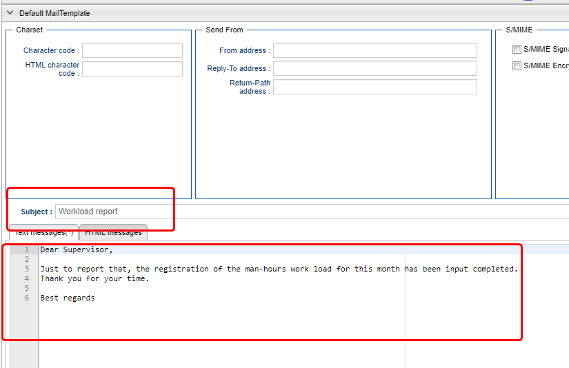

[[func_aggregation]]
.[.eeonly]#Aggregation#
You can display graphs and tables.

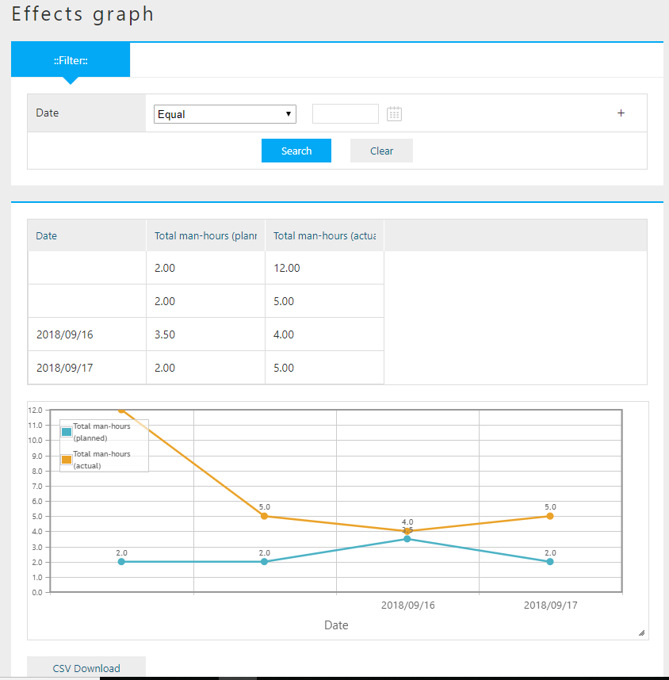