== 本チュートリアルについて
チュートリアル（ベーシック）ではiPLAssを利用する上で最低限必要な機能について説明しましたが、これらの機能だけではiPLAssの利用シーンは限られてしまいます。
ここからは更に幅広いシーンでiPLAssを活用するための簡易的なカスタマイズ機能について説明します。

本チュートリアルでは、一日のタスクと予定所要工数・実績所要工数を管理するための簡単な工数管理アプリを作成します。
アプリケーションを作成する中で、各種機能について説明します。

.業務フロー
アプリで想定している業務フローは以下の通りです。

.Entity関連図
本チュートリアルで作成するEntityは以下の通りです。

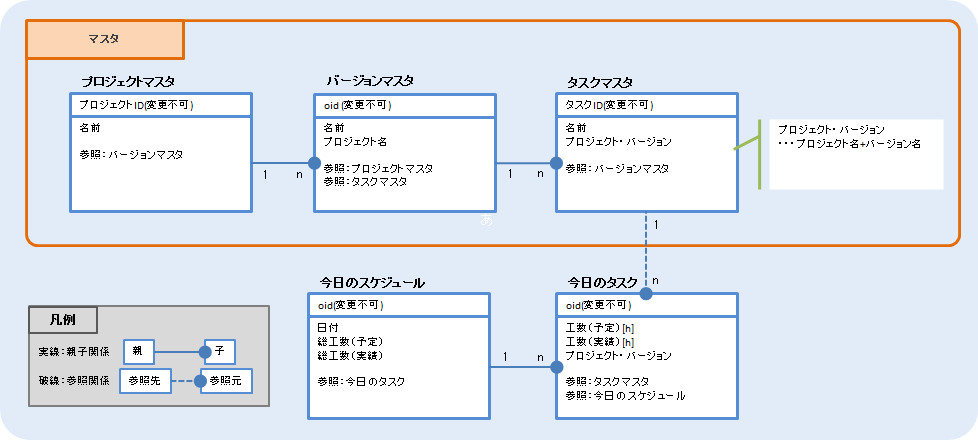

=== 利用機能
工数管理アプリケーションを作成するにあたって、以下の機能を利用します。

. Entityカスタマイズ機能
.. <<index.adoc#func_autonumber, Auto Number>>
.. <<index.adoc#func_expression, Expression>>
.. <<index.adoc#func_eventlistener, Event Listener>>
.. <<index.adoc#func_validator, Validator>>
.. <<index.adoc#func_auditlog, [.eeonly]#AuditLog#>>
. 画面カスタマイズ機能
.. <<index.adoc#func_nesttable, Nest Table>>
.. <<index.adoc#func_referencecombo, Reference Combo>>
.. <<index.adoc#func_sectionsetting, Section Setting>>
.. <<index.adoc#func_template, Template>>
.. <<index.adoc#func_calendar, Calender>>
. その他の機能
.. <<index.adoc#func_entitypermission, Entity権限>>
.. <<index.adoc#func_mail_workflow, [.eeonly]#Mail/Workflow#>>
.. <<index.adoc#func_aggregation, [.eeonly]#Aggregation#>>

[[func_autonumber]]
.Auto Number
ユーザーが値を指定しなくても、決められたルールに従って値が自動採番されます。
ここではプロジェクトIDに自動的に「P○○○」という書式で自動採番するよう設定しています。

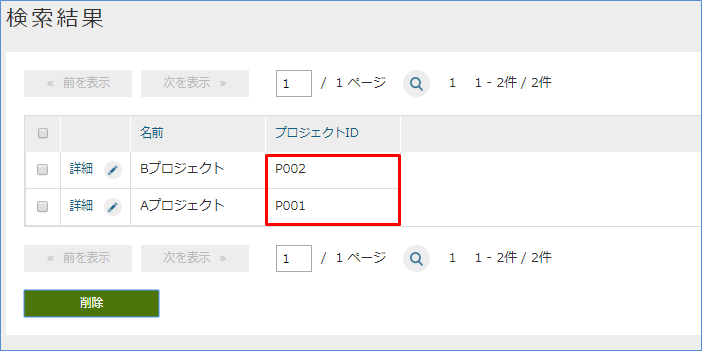

[[func_expression]]
.Expression
指定されたロジックに従って自動的に値をセットします。
ここでは工数（予定）の合計値をセットするようにしています。

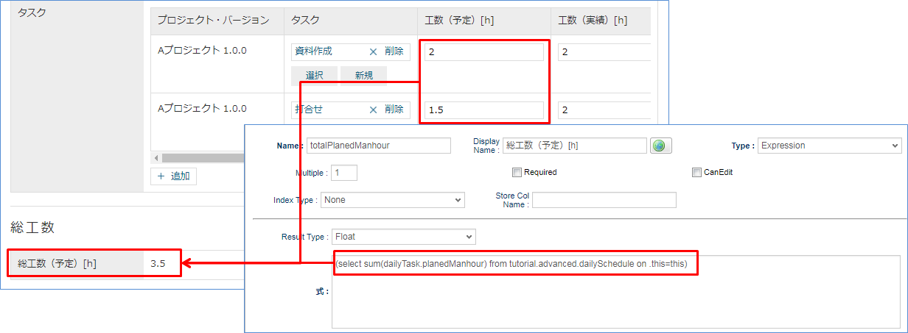

[[func_eventlistener]]
.Event Listener
Entityのデータ作成・更新時に指定されたロジックが呼び出されます。
ここでは、Entityデータ作成・更新時に自動的に名前に値をセットするロジックを呼び出しています。

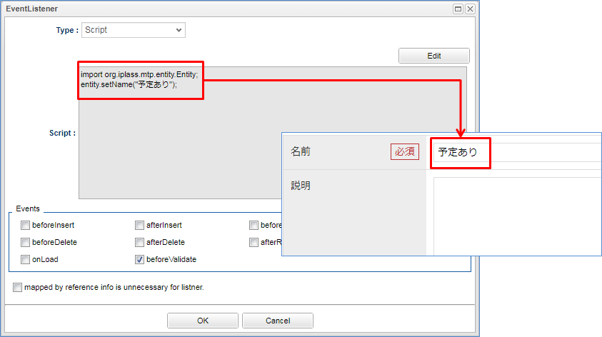

[[func_validator]]
.Validator
Propertyの入力チェックを行います。
ここでは、0～24以外の値が入力されるとエラーを表示するようにしています。

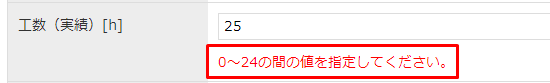

[[func_auditlog]]
.AuditLog
Audit Logをオンにすると、エンティティの操作ログを記録することができます。

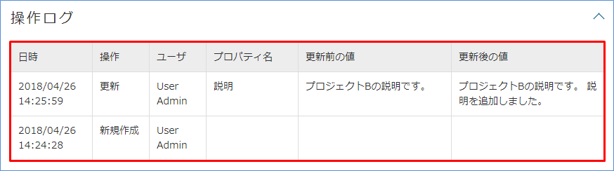

[[func_nesttable]]
.NestTable
表を入れ子にしてReferenceの情報を表示します。

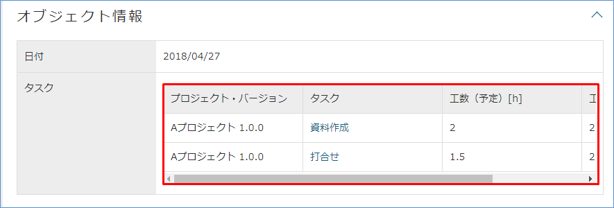

[[func_referencecombo]]
.ReferenceCombo
多段階先の参照情報をドロップダウンで表示します。

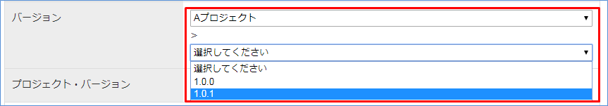

[[func_sectionsetting]]
.Section Setting
セクション名や列数を指定することができます。
ここではセクション名を「総工数」、列数を2列としています。

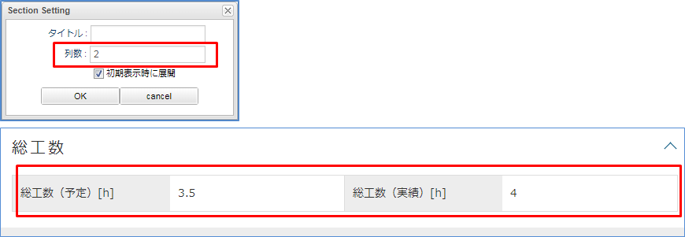

[[func_template]]
.Template
オリジナルのテンプレートを画面に組み込むことができます。

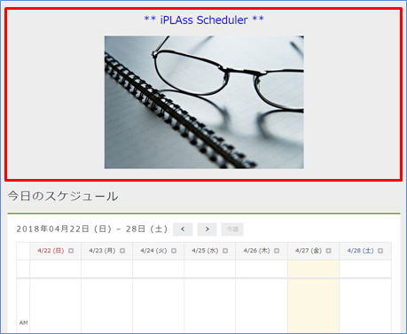

[[func_calendar]]
.Calendar
Date型、もしくはDateTime型のPropertyを持つEntityの情報は、カレンダー機能を用いてカレンダー上に表示することができます。

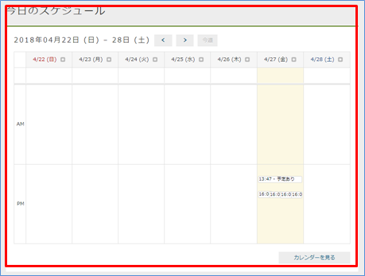

[[func_entitypermission]]
.Entity権限
ユーザーによってEntityに対する操作権限を変えることができます。
参照、登録、更新、削除が可能なユーザーと参照のみ可能なユーザーで画面表示も変わります。

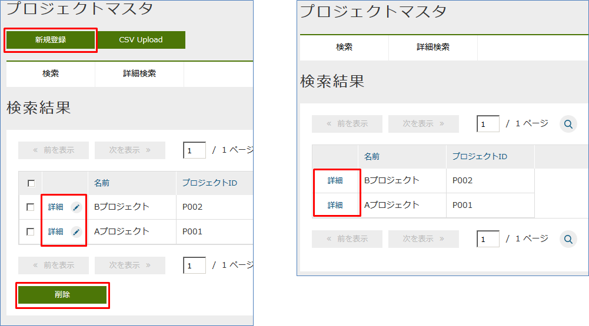

[[func_mail_workflow]]
.[.eeonly]#Mail/Workflow#
メールのテンプレートを作成し、ワークフローを経由してiPLAssの画面上からメールを送信できます。

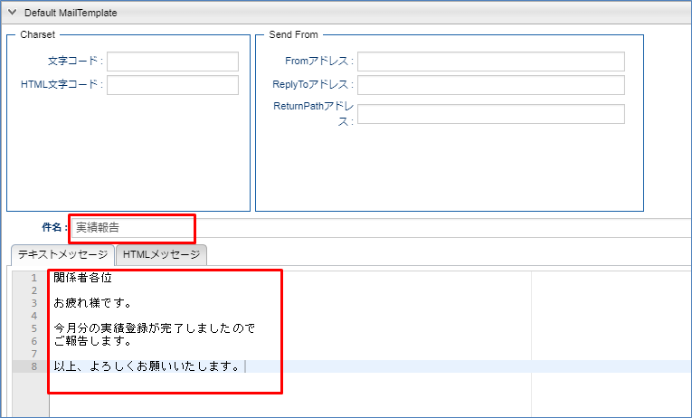

[[func_aggregation]]
.[.eeonly]#Aggregation#
グラフや表を表示できます。

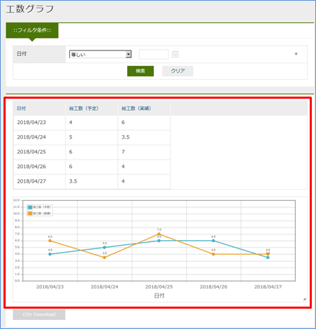
