[[basic_operation]]
== Basic Operations

iPLAss can construct web application easily by configuring the provided GUI.
Please go through this tutorial to have a glance of the basics to utilize the GUI.

[[gem_and_adminconsole]]
=== GEM Module and AdminConsole
The Tenant created by iPLAss has two applications ready to use, `GEM Module` and `AdminConsole`.

GEM Module::
A collection of views mainly for end users. It has login page, and GEM pages that can search/view/modify the Entity data.
It is auto-constructed depending on the Entities defined at AdminConsole.

AdminConsole::
A collection of tools and views for system managers and developers. The developer can utilize the AdminConsole to define Entity, to manage the Metadata for Actions and Commands, and also to design the interfaces for operations.
While creating the Tenant, the predefined Metadata for the following features are generated.
====
Entity:: Equivalent to the table of RDB.
Defines the Entity that are necessary to support the important features such as Authentication, Authorization and Workflow.
Action:: Defining the behavior information such as which process to call and which view to redirect to.
The actions for GEM pages were defined.
Command:: Defining the content to process.
The Commands for GEM pages have already been defined.
Template:: Equivalent to the final output views.
The Template for GEM pages were defined.
====

==== Start the AdminConsole
The AdminConsole for developers to configure about all kind of things can be started with the following steps.

. Start the AP server +
AP server（Tomcat etc.）should be running, please start it if it was not.

. Show the login pages +
Please use the browser to access the login pages which are provided by default.
URL:: http://{Host}:{Port}/{YourAppContextRoot}/{TenantName}/gem/
{Host}:: AP server's hostname
{Port}:: AP server's port number
{YourAppContextRoot}:: The configured context root for the Web application
{TenantName}:: The target Tenant 

+
====
http://localhost:8080/iplassApp/sampleTenant/gem/
====

. Log in +
Please use the  Manager account(or other added user with manager privileges) created while making the Tenant to log in.
If the log in was successful, the top page will shows up.
This page is the top page of GEM that will be discussed later.

. Starting AdminConsole +
Clicking on the `User Admin` in the header, the `AdminConsole` menu will show up.
By Clicking on the `AdminConsole` menu, the AdminConsole interface will be shown in a new tab.

==== Basic Operations of AdminConsole
On the left of AdminConsole, there are two menu groups shown: `MetaDataSettings` and `Tools` .
`MetaDataSettings` is the collection of Entities and Metadata defined on each Tenant shown in the tree form based on their types.
This tree is used to add/edit the metadata.
`Tools` is the batches of management tools for developers. for details please refer to  <<../../developerguide/support/index.adoc#adminconsole,here>>.

===== MetaDataSettings
Upon the initiation, only the supplied fundamental Metadata types(such as Entity and Action) are shown on the tree. 
To refer to the registered Metadata, we need to double click on the corresponding nodes.

When Tenant was created, several Metadata have been defined already.
Such as `mtp` and `gem` are the collections of the Metadata which are used by the basic features provided by the iPLAss.

===== Check the Metadata
While creating the Metadata, there are cases that each Metadata is referring to each other.
If you only update or delete the Metadata at one side, the change will not be reflected on the Metadata referring to them.
There could be compile errors when using GroovyScript to configure the settings.
When such error happens, or you just want to make sure the Metadata was loaded correctly, please click the green check icon from `MetaDataSettings` .

The Metadata with error detected will be listed together, please click the corresponding objects to fix the issues.

===== Refreshing the Metadata
The Metadata will be cached on the AP server when loaded.
It would be necessary to clear the cache when updating the Utility class that are referred by Command and GroovyScript.
Please click on the blue refresh icon to clear the cache on the AP server.

===== Editing the Metadata
Select the Metadata on the tree, and right click to open the menu.
The operations of the registered Metadata are all listed on this menu.
In addition, the edit pane will show up when double clicking the Metadata.

image::images/operationadminconsole_entitycontextmenu_en.png[]

===== Creating new Metadata
When creating new Metadata, please right click either on the root node or the existing branch node, on the hierarchy tree.
Note, if performed on hierarchy node, the popup dialog will come with the hierarchy path pre-filled with respect to the path of that node.

[[createenity_and_dataoperation]]
=== Creating Entity and Manipulating Data
iPLAss basic features is like the Model part of MVC architecture, it is based on the definition of the Entity: one kind of Metadata, to provide the GEM module with features of search/edit/aggregation in advance. 

==== Creating Entity
Here we will go through the steps to create the `Entity`, one of the important Metadata for the fundamental features of iPLAss. 
Then we will go through the basic operations (searching, editing) on GEM pages which are available by the definement of Entity.
For the purpose of practice, we will create the Entities `Product` and `ProductCategory` in the way described below to manage products.

.The ER Diagram for ProductMaster and ProductCategory

===== Creating New Entity
We will create Entity on AdminConsole.
Select Entity, then right click it for the menu and click on `Create Entity`.

On the popup dialogs, please enter the information to create each Entity in the way suggested below.
For Entity's Name, `.` (dot) is representing the hierarchy path.

[options="header"]
|===
|Name|DisplayName
|tutorial.product.ProductCategory|ProductCategory
|tutorial.product.Product|Product
|===

===== Creating New Property
Adding properties to the created Entities. 
This time, we edit ProductCategory first since it is referenced by the product Entity.

////
階層が足りない、=6個(h6)で暫定対応
////
====== Defining ProductCategory Entity
Double click the `ProductCategory` on the tree to show the page to edit the Entity.

.Entity's Edit Pane

The edit page of Entity has four categories: `CommonAttribute` 、 `Properties` 、 `EventListener` 、 `Data Localization`.( All others are collapsed except `Properties` in the beginning, you can click on them to expand and collapse the tabs.) In our case, the configuration happens on `Properties`.

.About the Common Properties of Entity
Entity has Inherited property that is common properties for all entities.(the details will be explained later)
The common properties will be presented on the property list if you check the `Show Inherited Property` checkbox on top right of the list.

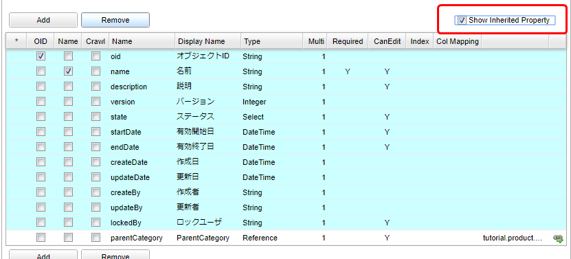

Here we want to look at `oid` and `name`.
`oid` is automatically generated and is stored by the core parts while registering Entity data.
It is like the Primary Key in RDB.
And `name` is for the purpose of records, it stores the `name` that will be used as the name of the data presented.

ProductCategory is the master data which frequently use code and name as its properties.
iPLAss can handle such kind of data easier with `oid` and `name`.
We will progress as if we will utilize `oid` and `name` as depicted.
(The common property will be hidden for the screenshots later on.)

.Entity Reference
The Entity property to be added to ProductCategory turns out to be only the 'ParentCategory'.
As usual in RDB, the concept like `ParentCategory` is implemented by referring to the KEY of the referred object as one column so the two tables(objects) are related together.
In iPLAss, table is equivalent to Entity, so as the implementation of the table relations, the `Reference` type Property is employed.

For our specific situation, the ParentCategory is the `ProductCategory` itself.
we will utilize `Reference` type Property to describe such a reference relation.

By click on the `Add` button, the dialog to define Property will show up.
For our case, we will define the property name of the `ParentCategory` to be `parentCategory`.
Note, please use only characters and numbers for Name.(recommended to use CamelCase.)  

[options="header"]
|===
|Name|DisplayName
|parentCategory|ParentCategory
|===

Then choose `Reference` at 'type' selection box.
Once you select the type, the tabs with corresponding setting options will be added to the scene.

image::images/createentity_propertydialog-parentcategory_en.png[]

For Reference type, the setting options of `Reference Entity`, `Reference Relationship`, `Referenced Property`, `Referenced Version`, `Order By` will be displayed on the dialog.
This time we merely want to tie up things, so we will only put hands on `Reference Entity`.
（the rest stay untouched）

If you want to create more complicated relations with `Reference Relationship` and `Referenced Property`, such as the followings, then please refer to the section of <<entity_property, Entity's Property>>.

* The reference with parent-children relation (if you delete the parent, the children Entity is affected as well)
* Configure about whether you can update the referenced Entity at the side of the referencing Entity.

Now, choose "tutorial.product.ProductCategory" in `Reference Entity`, then click the OK button.
Make sure our changes have been added to the Property list.
Click the `Save` button on top of the page to save the changes.
The modification on ProductCategory is done at this point.

////
階層が足りない、=6個(h6)で暫定対応
////
====== Defining Product Entity
About the Product Entity, just like what we did with ProductCategory, the common properties `id` and `name` can be used as our `Product Code` and `Product Name`. 
Then the remaining properties are `Price` and `Product Category`.
Just like the ProductCategory Entity, click on the `Add` button to add property.

The first is `Price`.

image::images/createentity_propertydialog-price_en.png[]

[options="header"]
|===
|Name|DisplayName|Type
|price|Price|Integer
|===

Continuing with `Product Category`.

[options="header"]
|===
|Name|DisplayName|Type|Reference Entity
|productCategory|Product Category|Reference|ProductCategory(tutorial.product.ProductCategory)
|===

The added property is displayed in the list.

The modification about the Product Entity is finished at this point.
Don't forget to click the `Save` button on top of the page to save the changes we just made.

===== The Created Entity Definitions
So far, the ER-diagrams for the Entities created has changed to the following diagram.

==== GEM Pages, the Interface to Search and Edit Entity
The definition part is completed at this point.
As one of the basic features of iPLAss, once the Entity was defined, it is possible to search and edit the entity instance on GEM pages.
First of all, let's have a look at the GEM pages.

===== Menu
Go back to the GEM page which was used to get to AdminConsole, click on the `home` button on top left of the page. New tabs for the operations of `ProductCategory` and `Product` will be added to the menu.

This is because when we created the Entity, the corresponding Menu objects was automatically generated and added to the `Menu`. `Menu` is the Metadata that manage the construction of the menu interfaces.
Expand the View Components Menu in the left pane (MetaDataSettings) in AdminConsole,
Double-click `DEFAULT` below it.

image::images/genericview_defaultmenutree_en.png[]

`Menu` Metadata has a menu definition called `DEFAULT`, which was generated while creating the Tenant.
Whenever a new Entity was created, the corresponding preset menu is automatically added to this `DEFAULT` menu.
(What happens in real is, the EntityMenuItem was created, and its reference was added.)

Although We will not talk about customizing the Menu definition here, please keep in mind that the MenuItem was created and added whenever a new Entity was created.

===== Searching Page
Now let's click on the added `Product Category` menu, the interface to specify the search conditions are displayed in the main area.

The utility features such as `Create New`, `CSV Upload`, `search conditions`, and `CSV Download` are provided and are displayed on the interface.
The items that are defined as Properties of the corresponding Entity are presented as optional search conditions. 
(Beware not all Properties are available.)

Once you click the `Search` button, the result will be displayed in below.
(We haven't register any data yet, so there is no data to display if we click on `Search` now)

Let's add some data for Product Category, click on the button of `Create New` on top of the page.

===== Registering Data to Product Category
.Edit Page 
By clicking `Create New` button, the dialog to edit data will show up.

There are several points to mention about the composition of the page. 

There are buttons and links displayed on top of the page.
The primary action, such as `Submit`, will be colored depending on the Theme of the Tenant.
Those buttons that are not affecting the data, such as `Cancel`,  `Return`, will be colored in gray.
The links of `Open All | Close All` , is to expand/collapse the group(section) such as `Basic Items` and `Object Information`.

`Basic Items` is referring to the edit area of common Property of Entity such as `name` and `description`.
The mandatory item such as `name` is marked with "Required" mark.

`Object Information` is referring to the edit area of added Properties of the Entity.
(Some properties are not displayed)
The method of input (text box, text area, selection box and so on) is determined depending on the type of the property.
For instance, the parentCategory, which is `Reference` type, can be input/edited by the dialog from `Select` and `Create New` buttons.

.Registering Data
Please input the following data.

[[productcategory_data]]
[options="header"]
|===
|General Category|Specific Category|Miscellaneous Category
.3+|Books .2+|Computer・IT|Normal・Beginner
|Programming
|NewBooks・PaperBack・Novels|&nbsp;
|===

Input the General Category.(Since there is no parent category for this one, we don't need to worry about the parent category part.)

By clicking on `Submit` button, we will be redirected to the page listing details of this data.

.Detail View
The layout is almost same with edit page.
The buttons of `Lock`, `Edit`, `Copy` and `Back` are presented.
`Lock` is not a main action, thus its button is in gray.

Let's click on `Back` and go back to the searching page.

.Overview Of The Search Results
The data we just added will be shown in the search result.

The other categories will be added in the same way.

.Specify the Reference Entity
When we adding Specific Categories, we need to select the parent category.
（We can "select" when the parent category was inputted already. Otherwise we can `Create New`）

The dialog to choose product categories are shown, so the user can search and choose the parent category.

The selected category will be set as the parent category.

The selected data will be presented in the box as its name with a link.
The delete button can also be found beside the link.
Clicking that delete button will remove the reference.
（For this instance, `Books` data itself will noe be deleted）
Beware that when the Property's multiplicity (as `multiple` in Entity edit page.) is 1, If data is already selected, the `Create New` button is hidden.

Press `Submit` button to register the data.

.Copy Mechanism
Let's try to create data with the `copy` button on the details view.

On the edit page, the information of the copied data are pre-filled in the corresponding boxes. Please change the name and register the new data.

.Input All Category Data
Now please input the rest of the data depicted in <<productcategory_data, Registering data>>.
The search result should be similar to the screen shot below.

===== Registering Product Data
Similar to ProductCategory, let's input all the data for product.

.Input Product Data
The data to be registered were listed below.

[options="header"]
|===
|General Category|Specific Category|Miscellaneous Category |Product|Price
.4+|Books .3+|Computer・IT|Normal・Starter|Introduction to Information Design|1000
.2+|Programming|Easy Understanding Java Beginner's Guide|2000
|Code Complete 2nd Ed. Vol.1|3000
|NewBooks・PaperBack・Novels|&nbsp;|&nbsp;|&nbsp;
|===

image::images/genericview_insert-product_en.png[]

.Inputted Product Data
Once all the product data were registered, the search result should look like this:

At this point, we have explained how to define Entity and how to operate on the GEM interface to manipulate the data of the defined Entities.
On next section, the Property of the Entity will be discussed. The operation and behavior of different Properties on GEM interface will be tested.

[[entity_property]]
=== Entity Property
==== Entity Property
As mentioned while defining Entity in previous part, Entity has common Properties.
In addition, Property has multiple preset types. GEM interfaces will change its behavior based on the types selected.

===== Entity Common Property
On the edit page of Entity definition, if the `Show Inherited Property` box was checked, it will be possible to see the common Properties.
The shown common Properties are pre-defined for Entity. 
The explanation for each Properties are listed below.

[cols="1,1,1,1,1,1,3", options="header"]
|===
|Name|Display Name|Type|Multi(Multiplicity)|Required|canEdit|Description
|oid|Object ID|String|1|||The ID that was used by the infrastructure to retrieve specific data(≒Record).
|name|Name|String|1|○|○|Name of the data, can be used freely
|description|Description|String|1||○|The description of the data, can be used freely
|version|Version|Integer|1|||utility item, for version control, will be 0 if no version applied.
|state|Status|Select|1||○|utility item, for version control
|startDate|Starting Date|DateTime|1||○|utility item, for version control
|endDate|Expiration Date|DateTime|1||○|utility item, for version control
|createDate|Date Created|DateTime|1|||utility item, the date when the data was created, auto-configured
|updateDate|Date Updated|DateTime|1|||utility item, the date when the data was updated, auto-configured
|createBy|Creator|String|1|||utility item, creator of the data, auto-configured depending on `User` Entity's oid
|updateBy|Updater|String|1|||utility item, updater of the data, auto-configured depending on `User` Entity's oid
|lockedBy|Locked By|String|1||○|utility item, for data lock mechanism
|===

The name of theese Common Properties are reserved.
Please avoid using the same name with the common Properties.

.oid
For each Entity data/records, there is one unique `oid` to server as the KEY（just like the primary key).
As the default behavior, `oid` will auto-increment upon Entity data creation.
Note, it cannot be changed by data update.
The Reference type Property that will be discussed later, is also referring to this `oid`.(more specifically, it is `oid` + `version` )

image::images/property_oid_en.png[]

.name
Required when inputting data.
Can be updated, and can also hold duplicated value.
Since KEY is `oid`, there is no strong restrictions on this Property.
Just beware that the size limit is 256byte, the excessive part will not be stored.

.description
A prepared-in-anticipation data that can be used for any purpose such as the descriptions of the data.
To use or not to use, and for what purpose, are all up to the user. Please feel free to use it.
Just beware that the size limit is 1024byte.

.Utility Property for Management
The other common Properties are the utility Property for management.
It is not recommended to be manipulated by normal Tenants. (Better to be an job only for administrators)
Depending on the version updates later on, these properties may change in anyways.
Especially for `startDate` and `endDate`, though they are used by User Entity and Announcements. Since they are designed mainly to support version controls and in most cases are self-managed, please try to avoid using these two Properties.

===== The Common Settings for Property
If you open the Edit dialog from Entity edit pages, the settings for the Properties can be seen on top of the dialogs.（Not available to some types）

image::images/property_dialog_en.png[]

[cols="1,3", options="header"]
|====
|Attribute|Value
|Name|Physical name, only English characters and Numbers
|Display Name|The name to be displayed to users.(Can be localized to different languages with configurations), if left undefined, it will use the Name as its input when saving the definition.
|Type|Mold. for details, see <<property_type, Property Type>>.
|Multiple|Multiplicity. for details, see <<property_multiple, Multiple(Multiplicity)>>
|Required|If `Required` is checked, then the corresponding Property is mandatory, and a `NotNull` property will be added in Validator.
|CanEdit|Indicating whether this Property can be edited, such as whether to check the changes when a Entity update happens, and whether it can be edited on GEM pages.
|Index Type|Index. for details, see <<property_index, Index Type>>
|Store Col Name|Custom columns. iPLAss stores and manage the data on its own. By setting up this item, the user can define a specific column in DB to store this Property, thus can be accessed easily elsewhere.
|====

[[property_multiple]]
.Multiple(Multiplicity)
Entity can hold multiple values for one Property.(imagine a image of Array)

For `Reference` type specifically, it is allowed to use `*` to indicate infinite multiplicity.
For the types other than `Reference`, the limit was set to 32.(restricted by the back end DB definitions. )
If even more number of multiplicity is demanded, please define another Entity, and use `Reference` types to refer to that Entity.

For the `Reference` type with multiplicity other than 1, multiple records will be returned when performing EQL searches.

[[property_index]]
.Index Type
It is equivalent to the index of RDB, Index can be set corresponding to the Property. So that a better performance on searching can be achieved.
If the Index is defined, then a exclusive table is created to hold the value for each `oid` and the Property.
Thus when searching, the system will refer to this table so to speed up the process.

The Index can only be set according to each single Property.
Composite Index (multiple Property one Index) is not supported.

Unique Index will check duplications for each Entity.
When updating the Entity, it will raise an error if there is duplicated Index.

When performing version control on Entities, the Properties with Unique Index indicated are unchangeable.
It actually set `CanEdit = false` while saving the Entity.
(The version control will be explained other times)

Index feature is not available to the Property with multiplicity other than 1.
（There is no effect even if you specify the Index）

If the Index type are changed while there are existing Entity data, the data will be recreated.
Therefore, when there are huge amount of data in presence, more caution is suggested before executing.
(In the case of unique Index, the definition cannot be saved if there is data with duplicated Indexes.)

[[property_type]]
===== Property Type
Property need its Type being specified depending on the data type you want it to keep. The following types are provided.

[cols="1,1,3", options="header"]
|========
|Category|Type|Explanation 
.8+|Basic|String|Array of characters 
|Boolean|Type of True / False.
|Integer|The type of integer number.
|Float|The type of fractional number with decimal separator.
|Decimal|The type of fractional number with specific decimal digit.
|Datetime|The type of date and times.
|Date|The type of date.
|Time|The type of time.
.5+|Special(Extended Types)|Select|The type to show selected items in form of `value` and `Display Name`.
|AutoNumber|The type of auto-incrementing values.
|Expression|The type that can set formulas and expressions.
|Binary|The type of Binary data.(BLOB)
|LongText|The type to hold the character array that String type cannot afford of.(BLOB)
|Reference|Reference|The type to relate the Entities in reference relations.
|========

.Normal
We will only list the special traits for Normal types.

* Length restriction on String type +
Because the String type is actually storing date in a varchar(4000) field at back end, there is no way to exceed that limit.
Beware, that the character code used by back end DB is `UTF-8`, so the limit for full width characters is 2000.

* Decimal type's round up mode +
For Decimal types, it is possible to specify `Decimal Precision` and `Round Up Mode`.
`Round Up Mode` is as depicted below. (equivalent to java.math.RoundMode)
The rounded result will be saved when saving the Entity data.
+
[options="header"]
|===
|Selected Value|java.math.RoundMode
|Rounding away from 0|UP
|Rounding towards 0|DOWN
|Rounding up|CEILING
|Rounding down|FLOOR
|Round half up|HALF_UP
|Round half down|HALF_DOWN
|Round half to even|HALF_EVEN
|===

.Select
Like the combo box that people can select the input value, this type can defines its data in a format of `Value` and `Display name` pairs.
To input the value and display name in pairs, there are two methods to take.

Global Value::
Used when there are pairs of values and DisplayNames that are used by multiple Entities.
Choose and right click the `SelectValue` on the menu bar at left, then click on `Create SelectValue` from the right click menu.
+

+
[options="header"]
|===
|Attribute|Value
|Name|tutorial/properties/PropertiesSelect
|DiaplayName|'Select' for inspection
|===
+
SelectValue is using `/` (slash) in Name to indicate path levels.
+
Once the `Save` was clicked, the contents will be added to the tree, double click the nodes to reveal it.
Use `Add` button to add pairs, then double click on the existing records to edit. To remove the records, choose the targeting records (can utilize ctrl and shift to select multiple items) then click `Remove` button.
The user can also Drag&Drop the items to change their orders.(The GEM pages will change according to the settings.)
+

+
Input the pairs of value and display name, then `Save`. 
Open the Property edit page for any Entity, when you select Global Value that is displayed when Type is set to Select, a list of registered SelectValue will be displayed, so select it.
+

Local Value::
Please configure this item instead of choosing registered SelectValue, if you want to define specific pairs locally for that Property. (when both global and local values are set, the Globalvalue will switch to undefined when saving the data.)
+

+
Use `Add` button to add additional pairs, double click the existing records to edit them. To remove the records, choose the targeting records (can utilize ctrl and shift to select multiple items) then click `Remove` button.
The user can also Drag&Drop the items to change their orders.(The GEM pages will change according to the settings.)

Select type will display the items only in order by how the items were defined.
Sort is available across iPLAss, such as clicking on the header, and using search functions provided by EntityManager.
In contrast, for Select type, if the pairs was defined in the following way, then the data will not sort by value, and will display in the order it was defined, that is `not-yet-started～cancel`.

.AutoNumber
The Property type that will numbering itself automatically while registering the Entity data.
For this sake, it is a read-only Property.

The following items can be configured.

[cols="2,5a", options="header"]
|===
|Attribute|Description
|Format
|It is possible to use the generated numbers in format by setting the binding format（${xxx}）
The supported binding formats are listed below.

[cols="1,2"]
!===
!nextVal()!Next number
!yyyy!Year
!MM!Month
!dd!Day
!HH!Hour, in 24h format
!mm!Minute
!ss!Second
!date!java.sql.Timestamp instance
!user!User information, can specify the Properties from User Entity by ${user.xxx}
!===

In the case of undefined binding, the normal generated value will be used.(equivalent to ${nextVal()})
====
`${yyyy}-${MM}-${dd}-${nextVal()}`  →  `2012-04-01-0000001001` 
====

|Start Value
|Set the Starting point of the auto-numbering.
The counter will not reset if this item was modified. 
If a reset on counter is wanted, please utilize the reset features.

|fixed number of digit
|Use this when it is need to format the length of the numbers. (i.e. fix to 0000 format)
The number will be padded with 0s for the set length.
If this item was set to 0, there will be no 0 padding at all.
In the case when the taken value exceeds the length, the raw value will be used.

|Numbering Rule
|Configuring the rules about the how to increment each steps.

Another transaction::
Rules that jump number is allowed.
When there is something such as errors on Entity registration, the numbers taken can break the continuity.
Since then the Entity registration is processed by another transaction, producing a better performance with parallel distributed processes.

Same transaction::
Rules that jump number is not allowed.
When there is something such as errors on Entity registration, the numbers taken have to keep the continuity.
Since then the Entity registration is processed in same transaction, the registration will become sequential.
|===

.Expression
It is a type that can support any kind of query mechanisms as long as they are specified by `Value Expression`. For instance, the query with algebra, conditional calculations, and scalar subqueries (The query with only 1 result).
Therefore, it is a read-only Property.

The following items can be configured.

[cols="2,5a", options="header"]
|===
|Attribute|Explanation

|Result Type
|Specify the type of the results of the expressions.
Only <<property_type, Basic types>> are available.

|Expression
|defining the expressions of the calculation
The queries that are working in Query（api.entity.query.Query)'s `value expression` are supported. 
For details, please refer to the Entity Manager from javadoc.
|===

Other than the algorithms, the following expression can also be used.

[source,sql]
----
case
  when integer1 = 50 then '△△△' 
  when integer1 = 80 then '○○○'
  else '×××'
end
----

[source,sql]
----
integer1 / (select sum(integer1) from sample.Sample)
----

[source,sql]
----
case
  when 50 = (select integer1 + integer2 from sample.Sample on .this=this) then '△△△'
  when 80 = (select integer1 + integer2 from sample.Sample on .this=this) then '△△△'
  else '×××'
end
----

`this` keyword is almost similar to oid.
But beware the `.oid=oid` is not valid, in contrast to `this`.

Beware that when the algebra calculation is referring to a property with more than 1 multiplicity, the calculation will not execute correctly.
Please only use the property with multiplicity of 1.

.Binary
The type of Property for the data that are treated as binary data, such as image and documents.

.LongText
The type of Property to hold the text data when String types cannot afford to. There is no specific Attributes need for LongText.

* Search on LongText +
LongText type is similar to Binary type, is managed in form of LOB or files. Therefore it is not possible to simply search on the LongText, because of that, the LongText type Property is not going to be shown in GEM either. In order to search through the LongText type Property, it is necessary to utilize `FullTextSearch` Mechanism.

.Reference
The property to define and implement the relations between Entities.
In RDB, the SQL command Join is used to link tables together. For iPLAss, the relations between Entities are defined in advance so to implement the relation equivalent features.

As mentioned in `Common Property` sessions, the reference type is actually holding the `oid` and `version` of the referenced Entity.

.Creating Reference

With this reference relation, it is possible to retrieve the information of the referenced Entity when searching on the referencing Entity.
In RDB, the commands of From and Join are used to declare the specific searching options over the tables. In iPLAss, it is all implemented by creating this Reference Property.

The following Attributes can be configured.

[cols="2,5a", options="header"]
|===
|Attribute|Explanation
|Reference Entity
|Specify the referenced Entity, can be chosen from the registered Entities.

|Reference Relations
|It is indicating the relation between the configured Entity and the referenced Entity. The behavior of CRUD on Entities will change based on the selected relations.

Normal Reference::
Even if this Entity was Deleted, the referenced data will stay untouched.
Parent-Child Relationships::
The reference type that treat the referenced Entity as the 'Children'. If the data from the Entity we are configuring is deleted, then the referenced data will be deleted as well.

|Referenced Property
|Specify the Reference relations that was defined at the referenced Entity side.
It is available only when the specified `Reference Entity` contains the Property that is referring to this Entity. 

|Referenced Version
|Declare the policy about which version of the data to be acquired.
There will be difference on the choices only when the the referenced Entity has Version Control enabled.
If no Version Control performed, the version is by default set to 0.

Latest version gets::
Always acquire the newest version of the referenced Entity.
Version at the time of preservation gets::
Get the version of the referenced content at the time when this Entity was last saved. 

|Save the operation history to referenced Entity
|Declared the policy of the operation logs on the referenced Entity.
It is available only when `Referenced Property` is specified, otherwise there is no effect.

|Order By
|In the case when this Property has multiplicity larger than 1, the order of how to retrieve the referenced Entity can be declared. It is possible to specify to use the order of ascending/descending on the referenced Entity Properties.

|===

We will jump over the features of 'Version Control' and 'Operation Logs' this time, as they are not important at the current context.

For the 'Reference Entity' attribute of Reference type, it has the concepts of `Referencing` and `Referenced` to distinguish the relation details. 

Referencing::
The Entity tracks on the data of the Referenced Entity. In the situation of `Referencing`, the targeted data is treated as an updatable attribute for current Entity. 
+
****
If the `Referenced Property` is not specified, it will be `Referencing` to the Entity directly.
(recall with `Referencing Entity`)
****

Referenced::
It is used to reveal how the current Entity was referenced by the targeted Entity.
It is meant for the Entity to grasp the existence of `Referencing` from the targeted Entity.
In the case of `Referenced`, the targeted data is not treated as an updatable attribute, thus the changes on the  `Referenced` Properties will have no effect on the reference relations.
+
****
When specifying `Referenced Property`, it is indicating the `referencing` relation from targeting Entity.
(So this Entity was referenced by the targeting Entity.)
****

==== The Behavior of GEM Pages Depending on Property
Above all, we have explained the Properties, now let's look at the difference between the types in practice.

===== Create Entity
For the sake of practice, let's create 5 Entities.

image::images/behavior_entity_en.png[]

[options="header"]
|===
|name|Display Name
|tutorial.properties.Properties|Testing Property
|tutorial.properties.Ref1|Reference １
|tutorial.properties.Ref2|Reference ２
|tutorial.properties.Ref3|Reference ３
|tutorial.properties.Ref4|Reference ４
|===

Once the Entities were created, go to the edit page of `Ref4` and add the reference to `Properties` Entity.
After adding, press the `Save` button of `Ref4` Entity to save it.

[options="header"]
|===
|Attribute|Value
|Name|refProperties
|DisplayName|RefProperties
|Type|Reference
|Multiple|*
|Reference Entity|Properties
|===

Next, add the following Property to `Properties` Entity.

The corresponding settings are listed.

Please set the String type Property as depicted below.

[options="header"]
|===
|Attribute|Value
|Name|string1
|Display Name|String
|Type|String
|===

[options="header"]
|===
|Attribute|Value
|Name|string2
|Display Name|String(multi)
|Type|String
|Multiple|5
|===

Please set the Boolean type Property as depicted below.

[options="header"]
|===
|Attribute|Value
|Name|boolean
|Display Name|Boolean
|Type|Boolean
|===

Please set the Integer type Property as depicted below.

[options="header"]
|===
|Attribute|Value
|Name|integer
|Display Name|Integer
|Type|Integer
|===

Please set the Float type Property as depicted below.

[options="header"]
|===
|Attribute|Value
|Name|float
|Display Name|Float
|Type|Float
|===

Please set the Decimal type Property as depicted below.

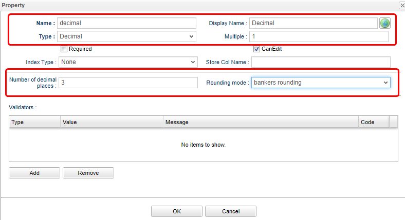

[options="header"]
|===
|Attribute|Value
|Name|decimal
|Display Name|Decimal
|Type|Decimal
|Number of decimal digits|3
|Rounding mode|Bank Type Rounding
|===

Please set the Datetime type Property as depicted below.

[options="header"]
|===
|Attribute|Value
|Name|datetime
|Display Name|Datetime
|Type|DateTime
|===

Please set the Date type Property as depicted below.

[options="header"]
|===
|Attribute|Value
|Name|date
|Display Name|Date
|Type|Date
|===

Please set the Time type Property as depicted below.

[options="header"]
|===
|Attribute|Value
|Name|time
|Display Name|Time
|Type|Time
|===

Please set the Select type Property as depicted below.

[options="header"]
|===
|Attribute|Value
|Name|select
|Display Name|Select
|Type|Select
|Local Value|refer as to the picture
|===

Please set the AutoNumber type Property as depicted below.

[options="header"]
|===
|Attribute|Value
|Name|autoNumber
|Display Name|AutoNumber
|Type|AutoNumber
|===

Please set the Expression type Property as depicted below.

[options="header"]
|===
|Attribute|Value
|Name|expression
|Display Name|Expression
|Type|Expression
|Result Type|Float
|Expression|mod(integer, float) + decimal
|===

Please set the Binary type Property as depicted below.

[options="header"]
|===
|Attribute|Value
|Name|binary
|Display Name|Binary
|Type|Binary
|===

Please set the LongText type Property as depicted below.

[options="header"]
|===
|Attribute|Value
|Name|longText
|Display Name|LongText
|Type|LongText
|===

Please set the Reference type Property as depicted below.

[options="header"]
|===
|Attribute|Value
|Name|reference1
|Display Name|Reference1(single)
|Type|Reference
|Multiple|1
|Reference Entity|Ref1
|Reference Relation|normal reference
|===

[options="header"]
|===
|Attribute|Value
|Name|reference2
|Display Name|Reference2(multi)
|Type|Reference
|Multiple|*
|Reference Entity|Ref2
|Reference Relation|normal reference
|===

[options="header"]
|===
|Attribute|Value
|Name|reference3
|Display Name|Reference3(child)
|Type|Reference
|Multiple|1
|Reference Entity|Ref3
|Reference Relation|parent children
|===

The referenced property `refProperties` is a property of the `Ref4` Entity.
`Ref4` Can not be selected unless it is added on the Entity side.

[options="header"]
|===
|Attribute|Value
|Name|reference4
|Display Name|Reference4(by)
|Type|Reference
|Multiple|1
|Reference Entity|Ref4
|Reference Relation|normal reference
|Referenced property|refProperties
|===

Once done creating the Properties, save the Entity.

Now the preparation to examine the Property types are finished. On to the next we will have a look at GEM pages.

===== Confirming in GEM pages
Switch to the GEM page which was used to start the AdminConsole, click on the he `Home` button on top left.

The menu of the added Entity: `Properties`, `reference１`, `reference２`, `reference３`, `reference４` will be presented.
Click `properties` on the menu to open up the search interface.

.Search Interface(Search Option Declaration)
The created Property will be displayed in the search option section.
Properties will change the form of how it is presented, some of them are not even shown as search options.

image::images/confirm_searchcond_en.png[]

The points to mention about the default search option section.

* Boolean type are specified by an option button.(The wording is `valid`/`invalid`. )
* DateTime, Date, Time types property support the option of of "From…To…".
* Select type Property is shown in the form of selection box.
* Binary type Property is not displayed.
* Reference type Property can only specify the Entity with multiplicity of 1. (Reference2 was not shown.)
The types other than Reference type will be displayed even if they have higher multiplicity.(String(multi) is shown.)

Since the data has not been registered yet, please register the data.
Click the `Create New` button.

.Edit Screen
The input area for the added Property is also displayed on the edit screen.
Depending on the type and attributes of the properties, some may be displayed differently or may not be editable.

Tips of the edit screen displayed by default.

* AutoNumber and Expression types cannot be entered because they are reference items
* Reference type and referenced property (MappedBy specification) cannot be inputted because it is a reference item (Reference4 cannot be inputted).
If a property other than the Reference type has a multiplicity more than 1, an `Add` button is displayed.

Register the data for each Property with reference to the following example.
For Reference type Property, add the reference entity with `New`.

Click the `Register` button to display the detail screen.

.Details Screen
Although there is no particular tips to cover for detail screen, just for your information, AutoNumber is automatically assigned at the time of new registration.
The calculation result of Expression is also displayed.

The timing for the value in Reference4 (by) to be displayed is after registering the above data linked to the `Ref4` Entity.
Click the `Reference 4` menu to open the search screen, and click the New registration button.

After entering the information below, click the `Register` button.
The point is that you have selected the data for `Testing property` that you created earlier.

Please Try to confirm the property display in the detail screen again.
The `Ref4` entity that refers to this entity should be displayed.

Next, check the search result list on result screen.
Click the `Back` link.

.Search Screen (Search Result Section)
When there are many properties, horizontal scroll bar is displayed.

The following properties are displayed.

Points of the search result displayed by default.

* Binary type Property is not displayed
* Only reference type property with multiplicity 1 is displayed (Reference2 is not displayed)
* Properties other than Reference type is displayed even if multiplicity is not 1. (String (multi) is displayed)

Up to this point, we have confirmed the default behavior of the GEM screen depending on the type of Property.
The feature of iPLAss is that the operation screens for Entity data such as search and registration are dynamically created based on Entity settings.

=== Customizing the Entity Operation Screen
==== SearchLayout and DetailLayout
This section explains how to customize search / edit view for Entity.
A simple example of customization are provided in order to help the reader to go through and understand the procedure.

So far, we have confirmed that a general-purpose entity search / edit screen can be used based on the entity definition.
The GEM screens you have seen so far are based on Entity definitions, so you may need to customize them depending on your requirements. (It is more often to be the second case)
The GEM screen has a mechanism that can be customized.
Based on the development requirements up to now, many parts are available for customization.
Customization is done from AdminConsole.

===== Launching the Layout Customization Screen
Open the AdminConsole, select the entity which you want to modify, and right-click to display the menu. (Customization can be done according to each entity)

There are menus called `Open DetailLayout` and `Open SearchLayout`.
This is how to start the configuration screen to customize the GEM screen for each Entity.

DetailLayout ::
Customize detail page and edit page.

SearchLayout ::
Customize the search screen interface.

==== Customizing the Search Screen

===== Entity Copy
You can use the `Properties` Entity as it is, but this time, let's copy the `Properties` Entity created earlier.
The `Properties` Entity will be used later to compare with the customized one.

Copy can be done from the right-click menu.

As the dialog shows up, change the name accordingly.

[options="header"]
|===
|Attribute|Value
|Name|tutorial.properties.Properties2
|Display Name| Property For Confirmation
|===

Click the `Save` button to save, right-click the `Properties2` Entity on the tree, and click `Open SearchLayout`.

image::images/customize_opensearchlayout_en.png[]

The search screen customization screen is displayed.

===== Page Format of the SearchLayout
A screen like the one below appears.

It can be divided into five main components.

.Top Toolbar A
Customization can save multiple layouts in units called views.
This area is mainly used for operations on the entire view.
The reason why the `Save` button is not available is that saving is done in View units.

.View toolbar B
This is for performing operations in View units.

.Layout setting section C
For each section (row) in this area, the items displayed in the D area can be placed using Drag & Drop, It is possible to configure the setting according to each individual View unit.

.Item section D
Items called Property and Section defined in Entity are displayed.
Drop the Property you want to display as search conditions and search results in C area.

===== Simple Customization
Make a simple customization to understand the procedure.
This time, we do not consider multiple view definitions etc., but modify a view called `default`.

.Loading Default Layout Definitions
Nothing is set when SearchLayout is opened for the first time.
As you have seen so far, the search screen is displayed by default even if SearchLayout is not set.
This is because the standard Layout definition is generated from the Entity definition inside the iPLAss base when needed.

When customizing, it is efficient to customize based on this standard definition, so let's display the standard definition.
Click `Standard load` on the View toolbar.

The default display settings of the Search screen are reflected here.

We will customize based on this setting.

.Settings For the Entire Screen
The settings for the entire search screen are done from the button in the right corner of the part that says `Search Screen`.

The edit dialog will be displayed.

This time, enter `Testing Customization`(arbitrary) in the `Screen title` and click the `OK` button.

.Settings For Search Conditions
The setting for the search condition part is done from the button at the right corner of the part that says `search condition`.

Check `Hide CSV Download Button` and `Hide CSV Upload Button` this time and click `OK` button.

Let's choose the `object ID` displayed at specific search condition section on the left as the search condition.
Drag to add it to the beginning.

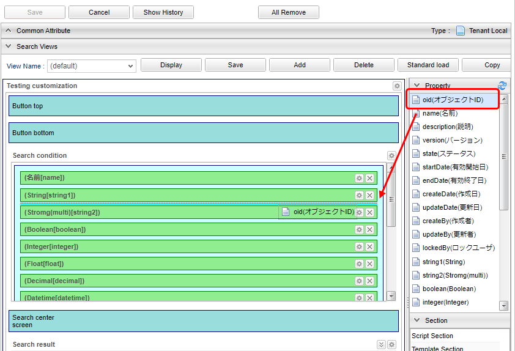

Settings for individual properties are made using the buttons next to the properties.
This time, edit the `Datetime` Property.

image::images/customize_datetime_en.png[]

This time we will set the display label.

Also, `TimestampPropertyEditor` is in the item `Property Editor`.
For this, the Editor definition corresponding to the Entity Property type is automatically selected.
The list itself will not be changed this time as it may disappear from the screen if it is changed.
Click the `Edit` button next to this.
The Editor settings dialog appears.

Items can be configured for each Property type (by each Editor).
Here let's set `Time display range` to `NONE`. 

.Settings For Search Results
The setting for the search result part is done from the button at the right corner of the part that says `search result`.

This time, check `Hide edit link`.

Let's also specify `object ID` in the search result specification part.
Drag to add it to the beginning.

Same wise goes to search conditions, all items can be configured according to each Property. (omitted here)

Now, save the View.
Click the `Save` button on the View toolbar.

.Confirmation
Let's switch to the GEM screen and check.
Click `Home` in the menu to refresh the menu.
`Property confirmation 2` will be added, so click to display the search screen.

image::images/customize_menu_en.png[]

Check the changes of the search screen.

Since the data has not been registered yet, please try to register some data from the `New registration` button.
Then return to the list (press the menu items or return from the details screen) to display the search screen.

As depicted, you can customize the GEM search screen by setting SearchLayout.

==== Customizing the Detail Page
Next, we will customize the detail screen.

===== Launch DetailLayout Edit Screen
Open the AdminConsole screen again, right-click the target entity of AdminConsole and click `Open DetailLayout` as in the search screen.

===== Screen Layout of DetailLayout
The following screen is displayed.

The configuration is almost the same as SearchLayout.

.Top toolbar A
Multiple design of Customized layout can be saved, they are in units called views.
This area is mainly used for operations on the entire view.
The reason why the `Save` button is not available is that saving is done in View units.

.View toolbar B
This is for performing operations in View units.

.Layout setting section C
For this area, the items displayed in the D area can be placed using Drag & Drop or individual settings can be made.

.Item section D
Items such as Property and Section defined in Entity are displayed.
An item called Element is also displayed.

===== Simple Customization
Let's make a simple customization so to demonstrate the procedure.
This time, we do not consider multiple view definitions, etc., but define the view called `default`.

.Loading Default Layout Definitions
As the SearchLayout we discussed above, load the standard definition.

.Settings For the Entire Screen
The settings for the entire edit screen are done from the button in the right corner of the part that says `Detail screen`.

Let's change the title like what we did to the search screen.

image::images/customize_title-detaillayout_en.png[]

.Section changes
Looking at the definition loaded by default, they are divided into two groups: `basic contents` and `object Information`. (Background part is light blue)

This is achieved by a section called `Default Section` in the Section item.

This time we will categorize this Section by the Entity Property type.

[options="header"]
|===
|Category| Type
.8+|Basic Type|String
|Boolean
|Integer
|Float
|Decimal
|DateTime
|Date
|Time
.5+|Special（Expansion）Type|Select
|AutoNumber
|Expression
|Binary
|LongText
|Reference Type|Reference
|===

Drag & Drop the `standard section` on the right to the bottom.

A dialog opens when you drop it. Enter `Basic Type` in the title and click the `OK` button.

Similar process goes with `Special Type`  `Reference Type`.

After that, move the Property defined in the standard definition in each Section from the top.

IMPORTANT: Multiple Property items can be dropped in the View, control <<../../developerguide/genericentitymanager/entityview/index.adoc#element_judgedisplayscript, the display judgment script>> so that only one item is displayed.

If you move everything as instructed, it will look like this:

image::images/customize_dragall_en.png[]

Since the section of `Object information` is empty, let's delete it. Click the `×` button next to Section to delete it.

Let's save in this state.

.Confirmation
If there is data registered at the time of confirming the search result, please choose the detail screen from the search result list.

Continue to check the edit screen. It has been changed in the same way.

As depicted, you can customize the GEM screen by setting DetailLayout.

[[save_defaultlayout]]
===== Registering a Standard Definition

So far, the following Entity has been created, but only the `Property confirmation 2` has been customized.

[options = "header"]
|===
|Name| DisplayName
|tutorial.product.ProductCategory|Product Category
|tutorial.product.Product|Product
|tutorial.properties.Properties|For property confirmation
|tutorial.properties.Ref1|Ref 1
|tutorial.properties.Ref2|See 2
|tutorial.properties.Ref3|Ref 3
|tutorial.properties.Ref4|Ref 4
|tutorial.properties.Properties2|Property confirmation 2
|===

For other entities, open `Search_Layout` and `Detail_Layout` respectively, and save the settings created in `Standard load`.
Although it was not described in detail this tutorial, it is required for operations by non-administrator users.
For details, please refer to <<../../developerguide/genericentitymanager/entityview/index.adoc#genericentityview, Generic Entity Manager (EntityView)>> in the developer guide after completing this tutorial.

Up to this point, the procedure for customizing the GEM screen created by the entity definition has been confirmed.
Next, we will explain how to customize the top screen of the GEM screen.

=== Customizing the Top screen
The Top screen displayed on the GEM screen is created based on `Menu` metadata and `TopView` metadata definition.
Here, you will understand the procedure for changing the Top screen through simple customization for each metadata definition.
In this procedure, we will explain multiple View definitions for Entity `SearchLayout` and `DetailLayout`.

==== Menu Customization
===== Menu Metadata
The menu part displayed on the Top screen of the GEM screen is defined by `Menu` metadata.

One menu called `DEFAULT` is defined at the time of tenant creation.
The menu can be linked with the setting of `role` which is the security function of iPLAss basics, but let's leave it here and look at the configuration of the Menu edit screen.

===== Menu Edit Page Configuration

There are three main components.

.Top toolbar A
There are buttons for saving and browsing history information.
Click Cancel to cancel the edited content and reload it.

.MenuTree B
This is the part that defines the menu hierarchy.
Add MenuItem displayed in C with Drag & Drop, or change the order by Drag & Drop in the tree.

.MenuItem C
Item displayed as menu items.
Can be dropped on the tree.

The substance of each menu displayed on the Top screen is MenuItem.
Four preset MenuItems groups are available depending on the application.

NodeMenuItem :: An item (like a folder) that can have multiple child items such as ActionMenuItem, EntityMenuItem, UrlMenuItem.
This MenuItem will only toggle the child menu and the screen does not change.

ActionMenuItem :: Menu item that executes metadata registered as Action.

EntityMenuItem :: This is a menu item for displaying the entity search screen.
When you create a new Entity definition, the iPLAss systems automatically creates an EntityMenuItem with the same name and will adds it to the DEFAULT menu.

UrlMenuItem :: Menu item to display the specified URL.
This is used when calling an external site from the menu.

===== Simple Customization
Let's make a simple customization to have a sense of the procedure.

.Creating a NodeMenuItem
If the tutorial has been followed according to the procedure, the menu displayed on the Top screen is as follows.

`Authority information` (NodeMenuItem), `Basic information` (NodeMenuItem), `Notification information` (EntityMenuItem) are menu definitions created by default when tenants are created.
The menu below is the EntityMenuItem that was created when the Entity was created during this tutorial.

Let's organize it using the EntityMenuItem created in this tutorial.
Try the following menu.

First, create a NodeMenuItem for `Product information`.

Open AdminConsole and double-click the `DEFAULT` menu definition to display its edit screen.

Right-click the `NodeMenuItem` displayed in MenuItems and select `Create Menu Item`. The Edit MenuItem dialog will be displayed.

Please set the Name and DisplayName.
The DisplayName will be displayed on the screen as the label of the menu.
The description is for developers, so it can be left unset.
The explanation of Icon URL and Icon Tag are omitted at this point.

Name is using `/` to represent its hierarchy.
It is `.`(a dot) for Entity, however it will be `/` most of the time else where of this system.

[options="header"]
|===
|Attribute|Value
|Name|tutorial/product/ProductNode
|DisplayName|Product Info
|===

NodeMenu can set the color of the frame part displayed in the menu.
This time, try to specify `blue` for Image Color.

After finishing the settings, save with the `Save` button.
It will be added to the NodeMenuItem.

Let's Drag & Drop the added Node to the left tree.

Drag the above `Product Category` `Product` item into the `ProductNode` NodeMenuItem you just added.

If you move the mouse pointer over the `ProductNode` item, it will display the child items of corresponding Node.
It may be a little difficult to control until you get used to deciding whether you want to move under `ProductNode` or under child item of `ProductNode` with the mouse position.
If it does not work, please try again.

Similarly, create a `Property Check` NodeMenuItem and move the EntityMenuItem of the entity created for property check.

[options="header"]
|===
|Attribute|Value
|Name|tutorial/product/PropertyNode
|DisplayName|Property check
|Image Color|green
|===

When completed, it will look like this:
Make sure it is placed and press the `Save` button to save the menu.

Click the `Home` menu on the GEM screen to refresh the screen.
`Product information` and `Property check` menu are added, and each Entity menu is displayed under it.

.Modify EntityMenuItem
Next, let's touch EntityMenuItem.
If you click the menu created from EntityMenuItem, Entity search screen is displayed.
In this search screen, if you specify `es=t` as the parameter when displaying the screen, you can display search results without conditions at the timing when the search screen is displayed.
It is assumed to be used when there are only small number of data registered, such as `Product Category` Entity.

Let's actually display the search result for `Product Category` Entity.

As a precaution, leave the `Product Category` EntityMenuItem without any parameters. Right-click on the `ProductCategory` EntityMenuItem and select `Copy Menu Item`.

In the dialog that opens, edit the values.

The value `_Copy` is set after `Name` when starting the dialog. For this time, Change as follows.

If you check `show with execute search`, the search process is executed when the screen is displayed by clicking the menu.
This setting has the same meaning as specifying `es=t` for Parameter.
Therefore, even if you specify Parameter without checking it, it will has the same behavior.

[options="header"]
|===
|Attribute|Value
|Name|tutorial/product/ProductCategorySearch
|Display Name|Product Category (Search Execution)
|show with execute search|Check
|===

When you pressing the `Save` button, it will be added on the EntityMenuItme.

image::images/menu_saveproductcategorysearch_en.png[]

Drop it on the tree part.
This time, we will put it under the `Product category` beneath the `Product Node` .

image::images/menu_addproductcategorysearch_en.png[]

Save the menu with the `Save` button.

Click the `Home` menu on the GEM screen to refresh the screen.
In the `Product Information` Node, the `Product Category (Search Execution)` menu is added.
(The width of the menu part is fixed, so it will wrap when the title is long as shown on the right)

Click to display the search screen.
When the screen is displayed, search processing is executed and displayed in the list.

.Create ActionMenuItem
Since Action has not appeared in previous tutorials, let's create a menu that executes the Action already provided on the GEM screen in the sense of a procedure.
Now, create an ActionMenuItem that displays the new registration screen for the `Product` Entity.

When you click the `New registration` button displayed on the search screen, the new registration screen is displayed.
The action executed by this new registration button is the action definition  `gem/generic/detail/detail`.
This time, we wil create an ActionMenuItem that executes the Action that displays the new entity registration screen.

Right-click `ActionMenuItem` in `MenuItems` displayed on the right side of the menu editing screen and select `Create Menu Item` .

The Edit Item dialog will be displayed.

Set `Name` and `Display Name`.
In ActionMenu, you can specify `Action` to be executed and `Parameter` to be passed to the Action.
Here, specify the action of `gem/generic/detail/detail` we talked about earlier.

This action requires a new entity name to be added as a parameter.
Specify in the format of `defName = Entity name`.
Since this time we are targeting the `product` entity, `defName = tutorial.product.Product`.

[options="header"]
|===
|Attribute|Value
|Name|tutorial/product/CreateProduct
|Display Name|Register Product
|Execute Action|gem/generic/detail/edit
|Parameter|defName=tutorial.product.Product
|===

After setting, save with the `Save` button.
And it will be Added to ActionMenuItem.

Drop the added item to the tree part.
This time, we will place it under `Product` of the `Product Node` .

Save the menu with the `Save` button.

Click the `Home` menu on the GEM screen to refresh the screen.
The `Product Registration` menu is added to the `Product Information` Node.
Clicking on that menu will bring up a new registration screen for the `product` entity.

==== Customizing the top page
===== TopView Metadata
The parts other than the menu of the Top screen displayed after login are defined in `TopView` metadata.

One TopView called `DEFAULT` is defined at the time of tenant creation.
Like the menu, the top screen can be linked to the role setting of iPLAss-based security function, but let's leave it here and focus on the configuration of the edit screen.

===== TopView Editing Screen Configuration

There are three main components.

.Top toolbar A
There are buttons for saving and browsing history information.
Click cancel to cancel the edited content and reload it.

.Drop Area B
This is the area to drop items displayed on the Top screen.
It is divided into `Widget Area` and `Main Area`.

.TopView item C
Items displayed on the Top screen.
Drop to the area on the right according to the item type (Widget, Parts).

Multiple items are prepared according to the purpose. There is a notation `W` `P` `U` next to each item, which means the following.

W :: Available as Widget
P :: Available as Parts
U :: Drop only one across Widget and Parts

For Aggregation, Calendar, and TreeView, items for dropping can be created by creating corresponding metadata.

.TopView item type
TopView items are classified as follows according to the drop area where they are placed.
Even for the same item, settings and display contents may vary depending on the location.

Widget::
Items placed in the `Widget Area` of the Drop Area.
A widget on the iPLAss Top screen is a part displayed in the menu area.
When this widget is set, `widget` will be displayed in the menu part of the top screen.

image::images/topview_swtich_en.png[]

Parts::
Items placed in the `Main Area` of the Drop Area.
Parts that display a list of `notification information` at the time of tenant creation are set.
`Products` If you set Parts to display a list of Entity search results, it will be displayed as follows.

===== Simple Customization
Make a simple customization to understand the procedure.

Use of SearchResultList
`SearchResultList` is an item that displays Entity search results on the top screen.

Drop `SearchResult List` in` EntityData List` to `Main Area`.

Once you droped the item, a dialog to set search target etc. will be displayed.

image::images/topview_searchresultlistdialog_en.png[]

Select the Entity to be searched.
Select the `Properties` Entity that we created earlier.
(If it does not exist, it can be another Entity)
If selected, `Result` will be set to `ResultListView` and `LinkActionView` respectively.
Since this setting is explained separately, just click the `OK` button.

Click the `Save` button in TopView to save it.

image::images/topview_savetopview_en.png[]

Click the `Home` menu on the GEM screen to refresh the screen.
A list of search results is displayed.

To specify the search condition for this SearchResultList, use Entity Filter.
Since we haven't explained Filter yet, we didn't specify Filter here.
If Filter is not specified as in this case, search will be executed in descending order of `updateDate`, which is the common property of Entity.

.Use of Separator
`Separator` is an item that divides the screen area into two horizontally.
Here, we will display `SearchResult List` side by side.

First, drop `Separator` in `Custom Parts` to `Main Area`.

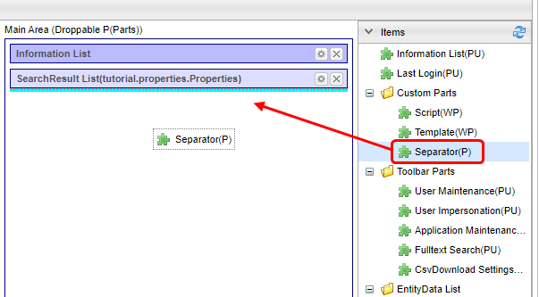

`Separator` has no setting items, so there is no edit button.

Drop two of the `SearchResult List` used earlier on this` Separator`.
On the left side, specify `Product` Entity (tutorial.product.Product), and on the right side, specify `Property confirmation 2` (tutorial.properties.Properties2).

Save TopView here and check the screen.

Two lists of search results for the specified Entity are displayed next to it.
If you look closely, only the list of `Testing Customization` does not show the `Edit` link.

This is because the layout definition of the list displayed in SearchResultList is controlled by Entity's SearchLayout setting (search result part).
Since `ResultList View` is registered as `default` on the settings earlier, `default` definition of SearchLayout setting of `Properties2` Entity is used.

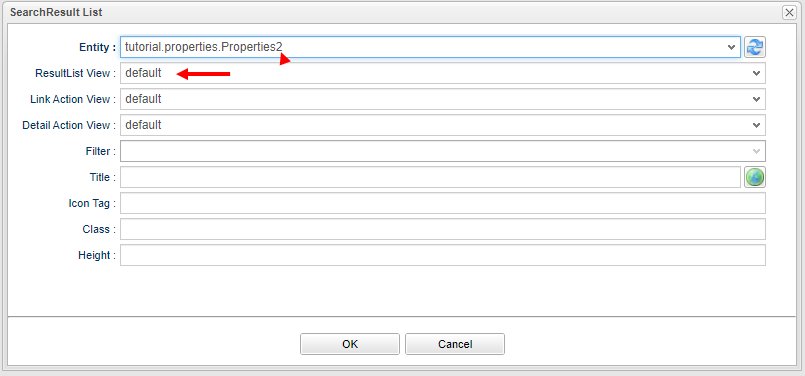

Let's check SearchLayout of `Properties2` Entity.

Click on the Edit Search Results button.

The edit link is hidden.

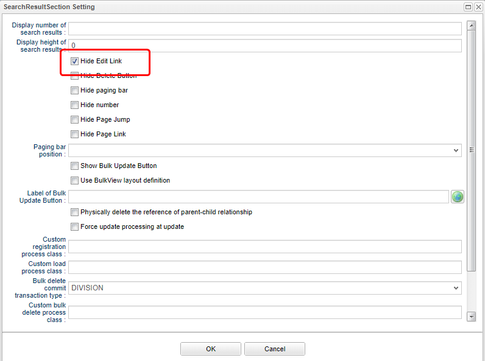

Other settings such as the delete button, number display, and page jump are ignored for the Top screen.

Next, let's edit this view.

.Utilizing SearchResultList (use of ViewLayout and DetailLayout view definitions)
There are cases where you want to narrow down the display items for the Top screen, such as when there are many property items or the result display area separated by Separator is narrow, as in the currently displayed Top screen.
This can be achieved by defining a View to be displayed on the Top screen in the Entity SearchLayout.

In the previous operation, the `ResultList View` setting was `default`.
Here, add View for Top screen to SearchLayout of Entity for `Properties2` Entity and use it with `ResultList View`.

First, display the property search layout for the `Properties2` Entity.
Since the view of `default` has already been defined, let's organize the Property to copy and display this time.
Click the `Copy` button.

image::images/topview_copyview_en.png[]

A confirmation message will be displayed.

A dialog box for specifying the name of the view is displayed. Enter the name.
This time it will be `topview`.

[options = "header"]
|===
|Attribute|Value
|View name|topview
|===

Then `topview` is added to `View name` and it is selected.

Let's reduce the Property added to this search result list.
This time, everything except `object ID` and `name` will be deleted.

When you have finished deleting, click the `Save` button in View.

In the same way, add a view to the DetailLayout of the `Properties2` Entity.
Let the view name to be added the same as SearchLayout, which is `topview`.

Let's delete all sections excepet for the basic section at the top.
When you have finished deleting, click the `Save` button in View.

Next, go back to TopView and click the edit button for the `SearchResult List` displayed at the bottom right.

The `topview` s that were added earlier are now available in the `ResultList` View and `Detail Action View`, so please select them.

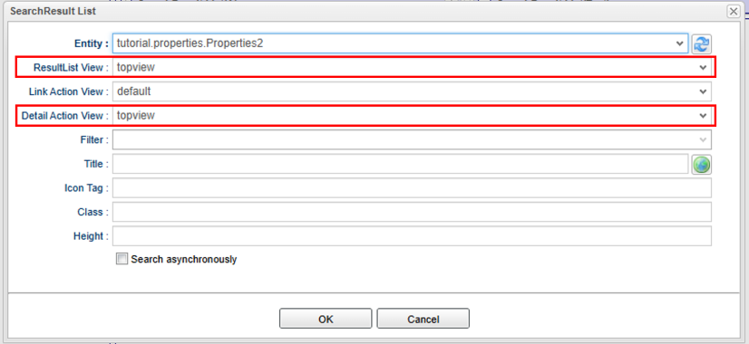

In this state TopViSave ew and display the Top screen.
Only the `object ID` and `name` are displayed.

If you click the `Detail` link here, the View definition of `topview` defibed in Entity `DetailLayout` is displayed.

Next, use the settings of `Detail Action View` to change the View displayed in the `Detail` link (or `Edit` link) on the list.
`Properties2` Open Entity DetailLayout.

Like SearchLayout, the `default` view has already been defined.
We will copy this again.
Click the `Copy` button to copy.
This time, change the view name to `topview2`.

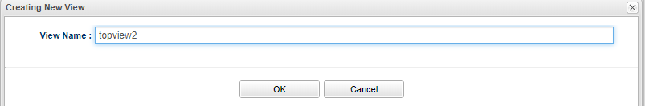

[options = "header"]
|===
|Attribute|Value
|View name|topview2
|===

Since it is the definition of the detail screen, let's put all Property items in.
So without changing the Property, just change the title to `Customize confirmation 2` (arbitrary).

image::images/topview_detailformsetting_en.png[]

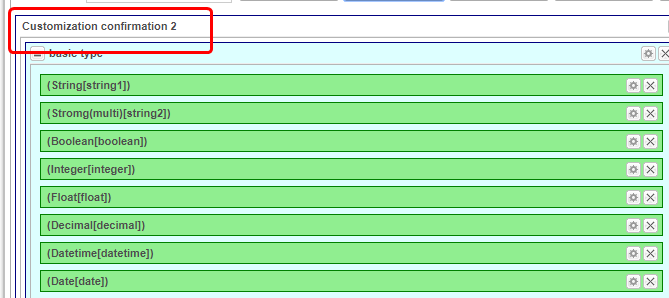

[options = "header"]
|===
|Attribute|Value
|Screen title|Customization confirmation 2
|===

Save it now.

Next time, set `topview2` to `Detail Action View` in the edit screen of `SearchResult List` on the TopView side.

`topview2` does not appear in the `Detail Action View`.
This is because the views that can be specified in `Detail Action View` are displayed on the SearchLayout side.
Currently, `Topview2` is only registered in the DetailLayout side, so `Detail Action View` cannot be selected.

Create `topview2` on the SearchLayout side.
This time, use the copy of View defined in `default`.
Also, change only the screen title to `Customize confirmation 2`.

Save SearchLayout, and check the pull-down of `Detail Action View` again on the edit screen of `SearchLayout List` on the TopView side.
Now you can select `topview2`.

Save TopView and check the Top screen.
The top screen shows the `topview` specified in `ResultList View`.
Click the details link to display the details screen.

View definition (DetailLayout) of `topview2` specified in `Detail Action View` is displayed so that the title is `customization confirmation 2`.

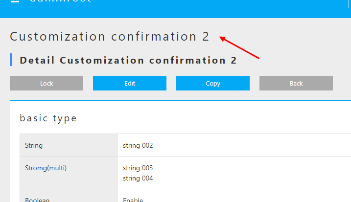

Next, use the settings of `Link Action View` to change the View displayed in the `Search` button  on the list.
`Properties2` Open Entity SearchLayout.

This time, use the copy of View defined in `topview`.
Change the view name to `topview3`.

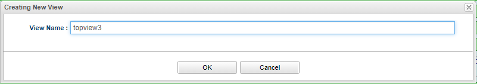

[options="header"]
|===
|Attribute|Value
|View name|topview3
|===

Since it is the definition of the search screen for `topview`, just change the title from the state where View is copied to `Customization confirmation 3` (arbitrary).

[options="header"]
|===
|Attribute|Value
|Screen title|Customization confirmation 3
|===

Save it now.

Next time, create `topview3` on the DetailLayout side.
Like `SearchLayout`, the copy of View defined in` topview` is used as it is, so just change the screen title to `Customization confirmation 3`.

Save DetailLayout and select `topview3` from the pull-down menu of `Link Action View` on the edit screen of `SearchLayout List` on the TopView side.

Save TopView and check the Top screen.
The top screen shows the `topview` specified in `ResultList View`.
Click the `To The Search Page` button to display the details screen.

View definition (SearchLayout) of `topview3` specified in `Link Action View` is displayed so that the title is `customization confirmation 3`.

Also, if you click the `Detail` link in the search result list, the View definition (DetailLayout) of `topview3` will be displayed.

Once you have confirmed, return the property confirmation 2 setting.

image::images/topview_searchresultlistdialog-properties3_en.png[]
 
.The Usage of UserMaintenance
`UserMaintenance` is an item that specifies the screen layout of the `Account Settings` menu displayed on the toolbar at the top of the Top screen.

By default, the password change screen is displayed.

The `UserMaintenance` item can change this screen.

First, drop `UserMaintenance` from `Toolbar Parts` to `Main Area`.

Click the edit button on the right.

image::images/usermaintenance_usermaintenancesetting_en.png[]

A dialog for specifying the View is displayed.

The View specified here is the DetailLayout view defined in the `User` Entity that holds iPLAss-based user information.
Display the `User` Entity DetailLayout and open the View name pull-down.

[options = "header"]
|===
|View Name|Usage
|default|For general user registration (no administrator setting)
|admin|For registration of users including administrators (for system administrators)
|maintenance|For your own maintenance (for TopView)
|===

Each view has a layout defined for the purpose of use.

Let's go back to the TopView `UserMaintenance` item edit screen and specify the View.
This time, specify `maintenance` View.

Save TopView and check the screen of the `Change User Information` menu on the Top screen.

The user information input area is now displayed.
The password is displayed as a separate area.
This is because the user password information is managed separately from the `User` Entity in the iPLAss platform.
(`User` Entity has no Property related to password)

==== Specify View in EntityMenuItem
In the explanation of the Top screen, the View definition of SearchLayout and DetailLayout was used.
Here we will explain how to specify View of this Entity in EntityMenuItem described as an item for Menu.

In the `Change EntityMenuItem` of the tutorial, the settings were made to execute the search when the search screen was displayed.
Similarly, the View is specified on the EntityMenuItem setting screen.

.Specifying View
The menu settings for `Property confirmation 2` remain the default settings.

Therefore, when you click `Property check 2` in the menu, SearchLayout defined as default is displayed.

image::images/entitymenu_searchlayout-default.png[]

In the TopView tutorial, we created a view definition called `topview` and `topview2`.

Since `topview` is a view for the layout of the SearchResult List for the Top screen, DetailLayout is not defined and cannot be used for the search screen that is started from the menu.
This is because the same view name is used when transitioning from the search screen to the detail screen, and from the detail screen to the search screen. If either is not defined, an error will occur if the user tried to display the screen.
(So, if you create a view definition of `topview` in DetailLayout, you can use it)
Here we specify `topview2`.

After saving the item, return to the GEM screen and click the `Home` menu to refresh the screen.
If you click on `Testing Property 2`, the title `Customization confirmation 2` is displayed, and you can see that the `topview2` screen is displayed.

Here, we confirmed the steps to customize some of the components displayed in the menu part and main part of the Top screen.
We also confirmed the use of the ViewLayout and DetailLayout view definitions at the same time.
The following describes the icons that can be set on the GEM screen.

=== Icon settings
You can set icons on the Entity search screen, detail screen, menu, and Top screen parts that you have seen so far.
There are items such as `Icon Tag` and `Icon Tag` in each setting screen, and by setting the icon tag of link:https://fontawesome.com/[Font Awesome ^] here, you can display icons freely.

This time, try setting link:https://fontawesome.com/icons/star?Style=regular[star icon^].
Since the html tag for display is described in the page of each icon, we will utilize it.

[source,html]
----
<i class="far fa-star"></i>
----

Let's set an icon for each screen.

==== Menu
Open the `DEFAULT` setting of `Menu` and open the setting screen of the `Product` Entity.
Since there is an `Icon Tag` item, set the html tag here.

Save the settings and click `Home` on the GEM screen to redisplay the screen.

An icon is displayed in the menu of the product entity.

==== Top Screen
Open the `DEFAULT` setting of `TopView` and open the `Information List` setting screen.
Since there is an `Icon Tag` item, we will set the html tag here.

Save the settings and click `Home` on the GEM screen to redisplay the screen.

An icon will be displayed in the notification information on the Top screen.

==== Search Screen
Open `SearchLayout` of `Product` Entity and open the search screen setting screen.
Since there is an item of `icon tag`, set the html tag here.

Save the settings and click the `Products` menu on the GEM screen.

An icon was displayed on the search screen for `Products` Entity.

==== Details Screen
Open `DetailLayout` of `Product` Entity and open the setting screen of detail screen.
We can also find an item of `icon tag`,let's set the html tag here to see what will happen.

Save the settings and display the details screen of the `Product` Entity on the GEM screen.

image::images/icon_detaillayout_en.png[]

An icon will be displayed on the details screen of the `Product` Entity.

Here, we have confirmed the basic methods of displaying icons on each screen.
As we have referred to the GEM screen many times so far, let's have a close look into the GEM on the next section.

=== Skin theme settings
The GEM module can switch the menu display method (skin) and screen base color (theme) as the screen layout definition.
This specification can be specified on a tenant basis, so set it on the Tenant metadata.

[cols = "1,2,6, ^ 1", options = "header"]
|===
2+|Selected values|Description|Default
.4+| Skin | Flat | Flat design based layout. The menu is displayed vertically (left side of the screen). | ○
|Vertical Menu|The menu is displayed vertically (left side of the screen).|
|Horizontal menu|The menu is displayed horizontally (upper side of the screen). (The widget component specified in TopView is displayed on the left side of the screen.)|
|Horizontal menu (drop list menu)|The menu is displayed horizontally (upper side of the screen). (The widget component specified in TopView is displayed on the left side of the screen.) However, the submenu (menu under NodeMenuItem) is displayed vertically.|
.8+| Theme | Black | The line at the top of the screen is displayed in black, and buttons are displayed in blue. | ○
| Red | The lines at the top of the screen are displayed in red, and the buttons are displayed in red. |
| Green | The line at the top of the screen is displayed in green, and the buttons are displayed in green. |
| Blue | The lines at the top of the screen are displayed in blue, and the buttons are displayed in blue. |
| Bright red | The line at the top of the screen is displayed in bright red, and buttons are displayed in a bright red base. |
| Bright green | The line at the top of the screen is displayed in bright green, and buttons are displayed in a bright green base. |
| Bright blue | The line at the top of the screen is displayed in light blue, and buttons are displayed in a light blue base. |
| Orange | The line at the top of the screen is displayed in bright orange, and buttons are displayed in bright orange base. |
|===

If not specified, `Default` is applied.

The style sheet of the GEM module is switched according to the setting, and the appearance can be easily changed.

Flat/blue

Vertical Menu/black

image::images/gem_skintheme-black_en.png[]

Horizontal Menu/green

Horizontal Menu(drop list menu)/red

It is possible to switch after the release or during the development, but if your implementation is more concerned on custom view (modifying Template, inserting Template, etc.), it is highly recommended to decide the styles as early as possible at the development stage.