[[basic_operation]]
== 基本操作

iPLAssは設定画面を利用することで、簡単にWebアプリケーションが構築できます。
ここではチュートリアルを通して、設定画面の基本的な使い方を学びます。

[[gem_and_adminconsole]]
=== GEMモジュールとAdminConsole
iPLAss上に作成されたテナントには、初期状態で `GEMモジュール` と `AdminConsole` という2つのアプリケーションが利用可能になっています。

GEMモジュール::
主にエンドユーザー向けの画面群。ログイン画面やEntityデータの参照/編集機能等のGEM画面があります。
AdminConsoleを利用して定義されたEntity定義情報や画面定義情報を元に画面が生成されます。

AdminConsole::
システム管理者、開発者向けの画面群。開発者はAdminConsoleを利用しながら、Entity定義の作成やEntity操作画面の設計、ActionやCommand等のメタデータの管理を行います。

テナントを作成した段階で、iPLAss上には以下を中心に基盤のベースとなるメタデータが定義された状態になっています。
====
Entity:: RDBのテーブルに相当します。
認証や権限、ワークフロー等iPLAss基盤の機能に必要なEntityが定義されています。
Action:: どの処理を呼び出し、どの画面へ遷移させるか等の情報を定義したものです。
GEM画面用のActionが定義されています。
Command:: 処理内容を定義したものです。
GEM画面用のCommandが定義されています。
Template:: 結果を表示する画面に相当します。
GEM画面用のTemplateが定義されています。
====

==== AdminConsoleの起動
開発者が各種設定を行うためのAdminConsoleの起動は以下の手順で行います。

. APサーバ起動 +
APサーバ（Tomcat等）が起動されていない場合は起動してください。

. ログイン画面表示 +
ブラウザからデフォルトで提供されるログイン画面にアクセスしてください。
URL:: http://{Host}:{Port}/{YourAppContextRoot}/{TenantName}/gem/
{Host}:: APサーバのホスト名
{Port}:: APサーバのポート番号
{YourAppContextRoot}:: Webアプリケーションに設定されたコンテキストルート
{TenantName}:: 対象のテナント名

+
====
http://localhost:8080/iplassApp/sampleTenant/gem/
====

. ログイン +
テナント作成時に併せて作成される管理者（または追加された管理者権限を持つユーザー）でログインしてください。
ログインに成功するとTop画面が表示されます。

. AdminConsoleの起動 +
ヘッダ領域の `User Admin` をクリックすることで、 `管理・設定` メニューが表示されます。
この `管理・設定` メニューをクリックすると、AdminConsoleが別タブで表示されます。

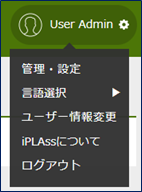

==== AdminConsoleの基本操作
AdminConsoleの左側には `MetaDataSettings` と `Tools` という2つのメニューグループが表示されています。
`MetaDataSettings` は各テナント上に定義されたEntity等のメタデータがその種類毎にツリーに表示されます。
各メタデータの追加、編集はこのツリーから行います。
`Tools` は開発者向けの管理ツール群です。詳細は <<../../developerguide/support/index.adoc#adminconsole,こちら>>を参照してください。

===== MetaDataSettings
起動時はツリー上にiPLAss基盤として提供しているメタデータの種類（EntityやActionなど）のみが表示された状態になっています。
登録されているメタデータを参照するには、それぞれのノードをダブルクリックします。

テナント作成時点でいくつかのメタデータが定義されています。
`mtp` や `gem` はiPLAss基盤として提供される機能で利用するメタデータ群です。

===== メタデータのチェック
メタデータを作成していく中で、各メタデータは互いに参照しあうことがあります。
一方のメタデータで更新や削除を行っても、それを参照するメタデータへは反映されません。
GroovyScriptを利用して何かしらの設定を行った場合にコンパイルエラーが起こる可能性もあります。
このような不正な状態が起きた場合、もしくは確認したい場合には `MetaDataSettings` の緑のチェックアイコンをクリックしてください。
エラーが検出されると対象のメタデータが一覧で表示されるので、対象をクリックして修正を行ってください。

===== メタデータのリフレッシュ
メタデータはロードされるとAPサーバのメモリ上にキャッシュされます。
Commandや各種GroovyScript内で参照されるUtilityClassを更新した際はこのキャッシュをクリアする必要があります。
青色のリフレッシュアイコンをクリックし、APサーバのキャッシュをクリアしてください。

===== メタデータの編集
ツリー上のメタデータを選択し、右クリックするとメニューが表示されます。
登録済みのメタデータに対する操作はこのメニューから行います。
また、ダブルクリックした場合はメタデータの編集画面が表示されます。

===== メタデータの新規作成
メタデータを新規で作成する場合は、対象のメタデータのルートノードか、既に存在する階層ノードを右クリックします。
なお、階層フォルダ上で実行すると、メタデータ名に予め階層名が設定された状態で登録ダイアログが表示されます。

[[createenity_and_dataoperation]]
=== Entityの作成とデータ操作
iPLAss基盤はMVC構造のモデル部分を表現する、Entityというメタデータ定義をベースとして、検索機能や編集機能、集計機能などのGEMモジュールが予め提供されているのが特徴となっています。

==== Entityの作成
ここではiPLAss基盤の中心となる重要なメタデータである `Entity` について作成手順を確認します。
そしてEntity定義により利用可能になるGEMの画面（データの検索・編集）の基本操作を確認します。
題材として、以下のような商品を管理する為の `商品` 、 `商品カテゴリ` Entityを作成します。

.商品マスタと商品カテゴリのER図

===== Entityの新規作成
AdminConsoleからEntity定義を新規で作成します。
Entityを選択し、右クリックメニューから `エンティティを作成する` をクリックします。

表示されるダイアログにてそれぞれ以下のように入力してEntityを作成してください。
EntityのNameに対して `.` （ドット）を使用すると、階層を表現することができます。

[options="header"]
|===
|Name|DisplayName
|tutorial.product.ProductCategory|商品カテゴリ
|tutorial.product.Product|商品
|===

===== Propertyの新規作成
作成したEntityに対してPropertyを追加していきます。
今回は商品Entity(tutorial.product.Product)から参照されている商品カテゴリEntity(tutorial.product.ProductCategory)を先に編集します。

////
階層が足りない、=6個(h6)で暫定対応
////
====== 商品カテゴリEntityの定義
ツリー上の `ProductCategory` をダブルクリックし、Entityの編集画面を表示します。

.Entityの編集画面

Entityの編集画面は `CommonAttribute` 、 `Properties` 、 `EventListener` 、 `Data Localization` の4つに分類されています（ `Properties` 以外は閉じられていますが、それぞれクリックすることで展開・縮小を切り替えることができます）。今回は `Properties` を操作していきます。

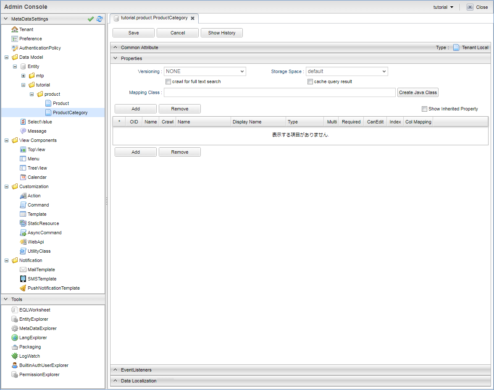

.Entityの共通Propertyについて
Entityには共通のProperty（詳細については後述）が存在します。
一覧の右上にある `Show Inherited Property` をチェックすることで共通Propertyが表示されます。

ここで注目して欲しいのは `oid` と `name` です。
`oid` はEntityデータを登録する際に、基盤側で自動的に採番する値が格納されます。
RDBでいうPrimaryKeyのようなものです。
また `name` はレコードに対する `名前` を格納するためのPropertyです。

商品カテゴリはプロパティとしてはよくある `コード` と `名称` を持ったマスタデータです。
このような項目は `oid` や `name` を利用することでiPLAssとしては扱いやすくなります。
ここではそのまま `oid` と `name` を利用することとしてPropertyの追加を進めます
（以降のスクリーンショットでは共通Propertyは非表示になります）。

.Entityの参照
商品カテゴリEntityのプロパティとして追加する必要があるのは結果的に `親カテゴリコード` のみとなりました。
通常、RDBのテーブル定義などでは `親カテゴリコード` のように参照先のテーブルのKEYを参照もとのカラムとして定義して関連付けます。
iPLAssではテーブル≒Entityとなり、このEntity同士の関連付けは `Reference` 型のPropertyとしてEntityに定義することで関連付けを表現します。

今回の場合、親カテゴリは自身である `ProductCategory` Entityです。
これを `Reference` 型のPropertyを利用して参照させます。

`Add` ボタンをクリックするとPropertyの定義ダイアログが表示されます。
今回は `親カテゴリ` のProperty名として `parentCategory` として定義します。
またNameについては、英数字のみを使用するよう注意してください（キャメル形式を推奨）。

[options="header"]
|===
|Name|DisplayName
|parentCategory|親カテゴリ
|===

次にTypeから `Reference` を選択します。
Typeを選択すると、選択した型に応じた設定項目が表示されます。

Referenceに対しては `参照エンティティ` 、 `参照関係` 、 `被参照プロパティ` 、 `参照先のバージョン` 、 `Order By` といった固有の設定項目が表示されます。
今回の登録では一番シンプルな紐付けのみを行いますので、操作するのは `参照エンティティ` のみとなります
（その他はデフォルト設定のまま）。

`参照関係` や `被参照プロパティ` を使った複雑な参照を行いたい場合や、以下のような参照関係を設定したい場合等は、<<entity_property, Entityのプロパティ>>を参照してください。

* 親子関係を持った参照の作成（親を削除した場合、自動で子も削除する）
* 参照先の更新可否の設定

`参照エンティティ` で `ProductCategory`（商品カテゴリ）を選択し、OKボタンを押します。
Propertyの一覧に追加されたことを確認し、変更を確定させます。
画面上部にある `Save` ボタンを押してください。
商品カテゴリについてはこれでひとまず完成です。

////
階層が足りない、=6個(h6)で暫定対応
////
====== 商品Entityの定義
商品Entity(tutorial.product.Product)ですが、こちらの `商品コード` 、 `商品名` についても商品カテゴリEntity(tutorial.product.ProductCategory)と同様に `oid` と `name` を利用することとします。
残りの属性となる `価格` と `商品カテゴリ` への参照用Propertyを追加します。
商品カテゴリEntityと同様に `Add` ボタンから追加します。

まず `価格` を追加します。

[options="header"]
|===
|Name|DisplayName|Type
|price|価格|Integer
|===

続いて `商品カテゴリ` を追加します。

[options="header"]
|===
|Name|DisplayName|Type|参照Entity
|productCategory|商品カテゴリ|Reference|ProductCategory(商品カテゴリ)
|===

追加したプロパティが一覧に表示されます。

商品Entityについてもこれで完成です。
画面上部にある `Save` ボタンをクリックしてEntity定義を保存します。

===== 作成したEntity定義
ここまでの流れで作成したEntityは以下のようになりました。

==== Entityの検索・編集用のGEM画面
ここまででEntity定義の作成ができました。
iPLAss基盤ではEntityを定義するだけでGEM画面上の機能としてEntityの検索・編集画面が利用できるようになります。
まずはEntity定義のみで利用可能になるEntityの検索・編集画面を確認しましょう。

===== メニュー
AdminConsoleを起動する際に利用したGEM画面に切り替え、左上に存在する `ホームボタン` をクリックしてください。Entityとして追加した `商品カテゴリ` と `商品` 用のメニューが表示されます。

これはEntityを作成したタイミングで、メニューの構造を管理する `Menu` メタデータに、作成したEntityのメニューが自動的に追加されたためです。
AdminConsole内の左ペイン(MetaDataSettings)にあるView ComponentsのMenuを展開し、
その下にある `DEFAULT` をダブルクリックします。

`Menu` メタデータにはテナント作成時点で `DEFAULT` というメニュー定義が作成されています。
Entityを作成すると、この `DEFAULT` メニュー定義上にEntityに対するメニューが自動的に追加されます
（実際にはEntityMenuItemが作成されて参照が追加されています）。

ここではMenu定義のカスタマイズについては説明しませんが、Entityを作成したタイミングでメニューに追加されることを覚えておいてください。

===== 検索画面
追加された `商品カテゴリ` メニューをクリックしてみましょう。メイン部分に検索条件を指定する画面が表示されます。

`新規登録` ボタンや `CSV Upload` ボタン、検索条件指定部分や `CSV Download` ボタンなど、よくある機能が並んでいます。
検索条件はEntityのPropertyとして定義した項目が表示されています
（全部のPropertyが表示されるわけではありません）。

`検索` ボタンをクリックすると、検索結果が下部に表示されます
（データ登録を行っていないので、 `検索` を実行しても該当データはありません）。

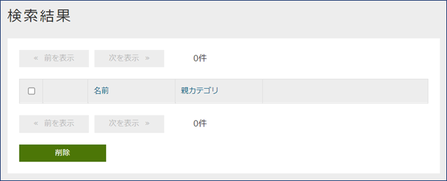

商品カテゴリを登録します。画面上部の `新規登録` ボタンをクリックします。

===== 商品カテゴリのデータ登録
.編集画面
`新規作成ボタン` をクリックすると、編集画面が表示されます。

画面の構成について以下に補足します。

画面の上下にはボタンやリンクが表示されます。
`登録` 登録のようなメインとなるアクションは色つきのボタン(テナント設定のテーマにより他の色の場合もある)で表現しています。
`キャンセル` や `戻る` 等のデータに変更がかからないものはグレーのボタンで表現しています。
`全て開く | 全て閉じる` リンクは、 `基本項目` や `オブジェクト情報` といったグループ（Section）の展開を行うものです。

`基本項目` にはEntityの共通Propertyである `name` と `description` Propertyの編集領域が表示されます。
必須項目である `name` には必須マークが表示されます。

`オブジェクト情報` にはEntityに追加したPropertyの編集領域が表示されます
（一部表示されないPropertyがあります）。
入力手段（テキストボックスやテキストエリア、選択ボタンなど）はPropertyのTypeによって判断されます。
親カテゴリのように `Reference` 型の場合は、 `選択`  `新規` のボタンをクリックすることで編集ダイアログが開きます。

.データ登録
以下のデータを登録してみます。

[[productcategory_data]]
[options="header"]
|===
|大カテゴリ|中カテゴリ|小カテゴリ
.3+|書籍 .2+|コンピュータ・IT|一般・入門書
|プログラミング
|新書・文庫・ノベルス|&nbsp;
|===

大カテゴリを登録します（親カテゴリは無いので未選択）。

`登録` ボタンをクリックすると詳細画面が表示されます。

.詳細画面
レイアウトは編集画面とほぼ同じです。
`ロック` 、 `編集` 、 `コピー` ボタン、 `戻る` リンクが表示されます。
`ロック` ボタンはメインとなるアクションではないため、グレーのボタンで表示されています。

`戻る` リンクをクリックして、一覧画面に戻ります。

.検索結果一覧
先ほど追加したデータが検索結果一覧に表示されます。

他のカテゴリについても同様に登録していきます。

.参照Entityの選択
中カテゴリを登録する際は、編集画面で親カテゴリを選択します
（親カテゴリから登録している場合。まだの場合は `新規` で作成する）。

商品カテゴリを選択するダイアログが表示されるので検索して選択します。

親カテゴリに選択したカテゴリが設定されます。

選択したデータのnameの値がリンクとして表示されます。
またリンクの横に削除ボタンが表示されます。
削除を実行すると参照が削除されます
（上の例で言うと `書籍` データ自体が削除されるわけではありません）。
親カテゴリにPropertyの多重度で設定した数のカテゴリが選択されている状態では、`新規` ボタンは非表示になります。

`登録` ボタンを押してデータを登録します。

.コピー機能
詳細画面に表示されている `コピー` ボタンでデータを作成してみましょう。

コピー元のデータが予め設定された登録画面が表示されます。名前などを変更して登録しましょう。

.登録カテゴリデータ
<<productcategory_data, データ登録>>の項目に記載されたデータを全て登録します。
登録後は以下のような検索結果が表示されます。

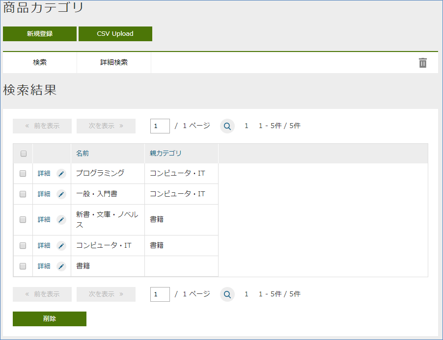

===== 商品データの登録
商品カテゴリと同様に商品も登録してみましょう。

.データの登録
登録するデータは以下になります。

[options="header"]
|===
|大カテゴリ|中カテゴリ|小カテゴリ|商品|価格
.4+|書籍 .3+|コンピュータ・IT|一般・入門書|情報デザイン入門|1000
.2+|プログラミング|わかりやすいJava入門編|2000
|Code Complete第2版(上)|3000
|新書・文庫・ノベルス|&nbsp;|&nbsp;|&nbsp;
|===

.登録商品データ
商品データを全て登録すると、検索結果は以下のようになります。

Entity定義の登録方法とその結果利用できるようになるEntityデータのGEM画面の基本的な動作を説明しました。
次は、EntityのPropertyについて少し詳しく説明し、Propertyの型ごとのGEM画面の動作を確認していきます。

[[entity_property]]
=== EntityのProperty
==== EntityのProperty
Entity定義の作成を行う過程で一部登場しましたが、Entityには共通のPropertyがあります。
またPropertyには複数の型が用意されていて、それぞれの型によってGEM画面の動作は変わります。

===== Entityの共通Property
Entity定義の編集画面で `Show Inherited Property` をチェックすることで、共通Propertyを参照することができました。
ここで表示されたPropertyは共通のPropertyとしてEntityに予め定義されています。
それぞれの用途について説明します。

[cols="1,1,1,1,1,1,3", options="header"]
|===
|名前|表示名|タイプ|多重度|必須|変更可否|用途
|oid|オブジェクトID|String|1|||データ（≒レコード）を一意に特定するID、基盤内部で採番
|name|名前|String|1|○|○|データの名前、任意に利用可能
|description|説明|String|1||○|データの説明、任意に利用可能
|version|バージョン|Integer|1|||基盤項目、バージョン管理用、管理しない場合は0
|state|ステータス|Select|1||○|基盤項目、バージョン管理用
|startDate|有効開始日|DateTime|1||○|基盤項目、バージョン管理用
|endDate|有効終了日|DateTime|1||○|基盤項目、バージョン管理用
|createDate|作成日|DateTime|1|||基盤項目、データ作成日時、基盤内部で自動設定
|updateDate|更新日|DateTime|1|||基盤項目、データ更新日時、基盤内部で自動設定
|createBy|作成者|String|1|||基盤項目、データ作成者、 `User` Entityのoidを自動設定
|updateBy|更新者|String|1|||基盤項目、データ作成者、 `User` Entityのoidを自動設定
|lockedBy|ロックユーザー|String|1||○|基盤項目、データロック機能用
|===

共通のPropertyとして利用されている名前は予約語です。
各Entityで同じ名前のPropertyを定義することはできません。

.オブジェクトID（oid）
Entityデータは1レコード単位に `oid` という一意のKEY値（PKキーのようなもの）を保持します。
デフォルトの動作として、 `oid` はEntityデータの登録時に基盤内部で自動的に採番されます。
また、更新処理で変更することはできません。
後述するEntityの参照定義（Reference）においても、この `oid` で参照関係を保持します（正確には `oid` + `version` ）。

.名前（name）
データ登録時の必須項目です。
変更が可能で、重複した値を保持できます。
KEYは `oid` であるため、一意である必要もありません。
制限として256byteまでのサイズしか格納できません。

.説明（description）
データ説明等を保持することを想定した任意項目です。
利用可否も含め、自由に利用してください。
ただし、格納可能なサイズは1024byteまでという制限があります。

.基盤管理項目
その他の共通Propertyについては、基盤内部の管理用Propertyです。
各テナントでの利用は推奨していません。
今後基盤のバージョンアップなどで増減したり、格納値が変更される可能性があります。
`有効開始日` 、 `有効終了日` についても、ユーザーEntityやお知らせ情報Entity等で一部利用していますが、Entityデータをバージョン管理する場合に基盤内部で制御項目として利用する（値が自動設定される）ため、基本的には利用しないでください。

===== Propertyの共通設定項目
Entityの編集画面からPropertyの編集画面を開くと、上部にPropertyの共通設定項目が表示されます（一部タイプによって利用不可）。

[cols="1,3", options="header"]
|====
|設定項目|設定値
|Name|物理名、英数字のみ指定可
|Display Name|表示名（多言語化可能）、未指定の場合Entity定義の保存時にNameが設定される
|Type|タイプ（型）、詳細は<<property_type, Property Type>>を参照
|Multiple|多重度、詳細は<<property_multiple, Multiple（多重度）>>を参照
|Required|必須、 `Required` をチェックすると、検証ロジック（Validator）に `NotNull` が追加される
|CanEdit|変更可否、値を変更できるかを設定、Entityデータの更新時（Update）の変更チェックや、GEM画面上での編集可否に利用される
|Index Type|インデックス、詳細は<<property_index, Index Type（インデックス）>>を参照
|Store Col Name|カスタム定義のカラム名、Entityをテーブルに保存する際に、iPLAssの標準の列ではなく、指定したカスタム定義のカラムに保存される
|====

[[property_multiple]]
.Multiple（多重度）
Entityには1つのPropertyに対して複数の値を保持することが可能となっています（配列のようなイメージです）。

`Reference` 型については、無制限をあらわす `*` を指定できます。
`Reference` 型以外については、現状32を限度とした値（バックエンドのDB定義の制約）を設定してください。
それ以上の多重度を持たせたい場合は、別のEntityを定義して `Reference` 型で参照するようにしてください。

多重度が1以外の `Reference` 型については、EQLを利用したEntityの検索時に同一 `oid` で複数レコード返ってくるといった動作になります。

[[property_index]]
.Index Type（インデックス）
検索処理の高速化のためのRDBのIndexのような機能として、Propertyに対するIndexを設定できます。
Indexを指定すると、レコード毎の `oid` とProperty値を持った専用のテーブルに値が保持されます。
検索時にはその専用テーブルを参照することで処理を高速化します。

Property単位でのみ設定が可能です。
複合Index（複数Propertyの結合）はサポートしていません。

Unique IndexはEntity単位での値の重複をチェックします。
Entity更新時に重複がある場合はエラーとなります。

Entityのバージョン管理を行う場合、Unique Indexとして指定したPropertyは変更不可となります。
Entity定義の保存時に自動的に `CanEdit = false` として登録されます
（バージョン管理については別途説明）。

多重度が1以外のPropertyについては、Indexは作成することができません
（Index指定されていても無効）。

既に登録済みのEntityデータが存在する場合にIndex属性を変更すると、Entity定義の保存時にIndexの再作成処理が実行されます。
大量データが登録されている場合等は考慮が必要です
（Unique Indexの場合、Uniqueでないデータが存在すると定義自体が保存できません）。

[[property_type]]
===== Property Type
Propertyは保持したいデータ型に併せてTypeを指定する必要があります。以下の型が提供されています。

[cols="1,1,3", options="header"]
|========
|カテゴリ|型|説明 
.8+|基本型|String|文字列型です 
|Boolean|真・偽を表す型です
|Integer|整数を表す数値型です
|Float|小数点を表す数値型です
|Decimal|正確な小数計算を扱う数値型です
|Datetime|日付と時刻を表す型です
|Date|日付を表す型です
|Time|時刻を表す型です
.5+|特殊型（拡張型）|Select|選択項目として `値` と `表示名` のセットを定義することができる型です
|AutoNumber|自動採番値を扱う型です
|Expression|式を設定することができる型です
|Binary|バイナリデータを扱う型です（BLOB型）
|LongText|String型では入りきらない文字列を扱う型です（BLOB型）
|参照型|Reference|各Entityを関連付ける事ができる型です
|========

.基本型
基本型については特記事項のみ列挙します。

* String型の文字制限 +
String型はバックエンドとしてvarchar(4000)の領域にデータを格納している関係で、それ以上の値は格納できません。
なお、バックエンドのDBの文字コードは `UTF-8` ですので、全角2000文字でないことに注意してください。

* Decimal型の丸めモード +
Decimal型の場合、 `小数桁数` と `丸めモード` が指定可能になります。
`丸めモード` は下記の通り（java.math.RoundModeに相当）です。
Entityデータの保存時に丸めた値で保存されます。
+
[options="header"]
|===
|選択値|java.math.RoundMode
|0から離れるようにする(正数切り上げ/負数切り上げ)|UP
|0に近づける(正数切り下げ/負数切り下げ)|DOWN
|正の無限大に近づける(正数切り上げ/負数切り下げ)|CEILING
|負の無限大に近づける(正数切り下げ/負数切り上げ)|FLOOR
|四捨五入|HALF_UP
|五捨六入|HALF_DOWN
|銀行型丸め|HALF_EVEN
|===

.Select
コンボボックスの選択値のように、格納できる値を `値` と `表示名` のセットで定義できるPropertyです。
値と表示名のセットを登録します。設定方法は2通りあります。

Global Value::
複数のEntityで同じ値と表示名のセットを登録した場合に利用できます。
左側のメニューにある `SelectValue` を選択肢、右クリックメニューから `SelectValueを作成する` をクリックします。
+

+
[options="header"]
|===
|項目|設定値
|Name|tutorial/properties/PropertiesSelect
|DisplayName|プロパティ確認用セレクト
|===
+
SelectValueはNameに対して `/` （スラッシュ）で階層を表現することができます。
+
`Save` するとツリー上に追加されますので、ダブルクリックで表示します。
追加する場合は `Add` ボタン、編集する場合は対象のレコードをダブルクリック、削除する場合は対照のレコードを選択（ctrlやshiftで複数選択可）して `Remove` ボタンです。
また順番を並び替える場合はドラッグ&ドロップで並び替えてください（そのままGEMの編集画面での表示順になります）。
+

+
値と表示名のセットを登録して `Save` 後、任意のEntityのプロパティ設定画面を開きます。
TypeをSelectに設定すると表示されるGlobal Valueを選択すると、登録済みのSelectValue一覧が表示されるので選択します。
+

Local Value::
プロパティごとに任意の値と表示名のセットを登録したい場合に利用します。
+

+
追加する場合は `Add` ボタン、編集する場合は対象のレコードをダブルクリック、削除する場合は対象のレコードを選択（ `Shift` や `Ctrl` で複数可）して `Remove` ボタンです。
また順番を並び替える場合はドラッグ&ドロップで並び替えてください（そのまま編集画面の表示順になります）。

Select型のソート順は定義での並び順が適用されます。
ソートは検索結果一覧のヘッダクリックや、EntityManagerを利用した検索処理等で利用されています。
下記のような順番で定義した場合、valueではソートされず、定義した順番 `未開始～キャンセル` でデータはソートされます。

.AutoNumber
Entityデータの登録時に基盤内部で自動的に値を採番するPropertyです。
このため読み取り専用のPropertyです。

以下の項目が設定可能です。

[cols="2,5a", options="header"]
|===
|設定項目|設定値
|書式
|採番された値を利用した書式をバインド書式形式（${xxx}）で設定することができます。
設定可能なバインド変数は以下のものです。

[cols="1,2"]
!===
!nextVal()!次の採番された番号
!yyyy!年
!MM!月
!dd!日
!HH!時、24h表記
!mm!分
!ss!秒
!date!java.sql.Timestampのインスタンス
!user!User情報、${user.xxx}としてUserエンティティのプロパティを指定可能
!===

未指定の場合、採番された値が設定されます。（${nextVal()}と同様）
====
`${yyyy}-${MM}-${dd}-${nextVal()}`  →  `2012-04-01-0000001001` 
====

|開始値
|採番を開始する番号を設定します。
既にEntityデータの登録が行われている状態でこの値を変更してEntityを更新しても、カウンタはリセットされません。
カウンタの値をリセットしたい場合は、リセット機能を利用してください。

|固定桁数
|桁数を固定したい場合に設定します。
設定された桁数分、ゼロパディングした値が返されます。
0を設定した場合はゼロパディングされません。
採番値が固定桁数を超えた場合は、そのまま採番値が利用されます。

|採番ルール
|採番する際の飛び番に関するルールを設定します。

別トランザクションで採番::
飛び番を許容するルールです。
Entityの登録エラー時など、採番値の連続性を保証しません。
Entityの登録処理とは別のトランザクションで採番するため、登録時の並列実効性は高まります。
同一トランザクションで採番::
飛び番を許容しないルールです。
Entityの登録エラー時など、採番値の連続性を保証させます。
Entityの登録処理と同一トランザクションで採番するため、登録処理はシーケンシャルになります。
|===

.Expression
四則演算やCase文、スカラーサブクエリ（結果が1つになるクエリ）など、Query機能の `Value Expression` として指定可能な式を設定することができるPropertyです。
そのため読み取り専用のPropertyとなります。

以下の項目が設定可能です。

[cols="2,5a", options="header"]
|===
|設定項目|設定値

|Result Type
|式に記載した結果の方を指定します。
指定できる型は<<property_type, 基本型>>となります。

|式
|式を指定します。
指定可能な式は、Query（api.entity.query.Query）の `value expression` として有効な式になります。
詳細についてはJavadocまたはEntityManagerを参照してください。
|===

四則演算以外でも以下のような式を設定することができます。
[source,sql]
----
case
  when integer1 = 50 then '△△△' 
  when integer1 = 80 then '○○○'
  else '×××'
end
----

[source,sql]
----
integer1 / (select sum(integer1) from sample.Sample)
----

[source,sql]
----
case
  when 50 = (select integer1 + integer2 from sample.Sample on .this=this) then '△△△'
  when 80 = (select integer1 + integer2 from sample.Sample on .this=this) then '△△△'
  else '×××'
end
----

thisはoidとほぼ同意です。
ですが、逆に `.oid=oid` は不可となっています。

注意点として、四則演算で参照するプロパティの多重度が1以外の場合、正確な計算が実行されません。
多重度が1のプロパティに対してのみ利用してください。

.Binary
画像や文書ファイルなどのバイナリデータを扱うPropertyです。Binary型固有の設定はありません。

.LongText +
String型ではサイズが足りない場合等のテキストデータを扱うためのPropertyです。LongText型固有の設定はありません。

* LongTextに対する検索 +
LongText型はBinary同様にLobまたはファイルとして管理しているため、単純に検索を行うことができません。このためGEMの検索画面においてもLongText型のプロパティは表示されません。LongTextに対する検索機能を提供する場合は、 `全文検索機能` を利用する必要があります。

.Reference
Entity同士の参照関係を定義するためのPropertyです。
RdbではSQLのJoinを利用してTable間の結合を定義しますが、iPLAssのEntityでは予め参照を定義しておくことで同等の機能を実現しています。

`Propertyの共通設定項目` でも少し説明しましたが、Reference型は参照しているEntityの `oid` と `version` を保持します。

.Referenceの構造

この参照関係を利用することで、参照元のEntityを検索する際に参照先のEntity情報を取得することが可能になります。
RdbでFrom句にJoinを定義して、JoinしたTableを選択したり条件指定することを、iPLAssでは対象Entityに対するReferenceを作成することで実現します。

以下の項目が設定可能です。

[cols="2,5a", options="header"]
|===
|設定項目|設定値
|参照エンティティ
|参照するEntityを指定します。登録済みのEntityから選択できます。

|参照関係
|参照するEntityとの関係を指定します。EntityデータCRUD時の動作が異なります。

通常の参照::
このEntityが削除された場合も、参照先のデータは削除されません。
親子関係::
参照先Entityを子として参照します。このEntityが削除された場合、参照先も削除対象になります。

|被参照プロパティ
|参照先のEntityで定義されたこのEntityに対するReferenceプロパティを指定します。
指定可能になるのは `参照Entity` で指定したEntityのProperty定義に、当EntityのReferencePropertyが存在する場合です。

|バージョン管理
|参照先のデータとして取得するバージョンのポリシーを指定します。
この設定は参照先Entityがバージョン管理している場合のみに違いが発生します。
バージョン管理していない場合は0のため同値です。

最新バージョンを取得::
参照先のEntityの最新バージョンのデータを取得します。
保存時のバージョンを取得::
このEntityが保存されたときの参照先のEntityのバージョンのデータを取得します。

|操作履歴を被参照側のEntityに記録
|被参照Entityに対する操作履歴のポリシーを指定します。
指定可能になるのは `被参照プロパティ` を指定した場合です、未指定の場合有効になりません。

|Order By
|このPropertyの多重度が1以外の場合に、参照先Entityをどの順で取得するかを指定します。参照先EntityのPropertyに対して、昇順/降順を指定します。

|===

バージョン管理や操作履歴については、この段階では重要ではないため、そういった機能があるという点だけ抑えておけば十分です。

Reference型には指定した参照Entityに対する `参照（順参照）` と `被参照` という概念があります。

順参照::
当該Entityが対象Entity（Referenceの対象となるEntity）のどのデータを利用するかを保持します。 `順参照` の場合はEntityの更新対象属性として扱われます。
+
****
`被参照Property` が未指定の場合、対象Entityに対して `順参照` となります
（ `対象Entity` を参照する）。
****

被参照::
当該Entityが対象Entityのどのデータによって参照されているかを把握するために利用します。
対象Entityから当該Entityに対して定義された `順参照` を逆引きするための定義になります。
`被参照` の場合、Entityの更新対象としては扱われず、 `被参照` として定義したPropertyに対して値を設定しても、参照関係が作成されるわけではありません。
+
****
`被参照Property` を指定した場合、対象Entityに対して `被参照` となります
（ `対象Entity` から参照される）。
****

==== PropertyによるGEM画面の挙動
ここまでPropertyについて説明してきました。Propertyの型による違いを実際の画面で確認します。

===== Entityの作成
確認のため、Entityを5つ作成します。

[options="header"]
|===
|定義名|表示名
|tutorial.properties.Properties|プロパティ確認用
|tutorial.properties.Ref1|参照１
|tutorial.properties.Ref2|参照２
|tutorial.properties.Ref3|参照３
|tutorial.properties.Ref4|参照４
|===

Entityを作成したら `Ref4` Entityの編集画面で `Properties` Entityに対する参照を追加します。
追加後、 `Ref4` Entityの `Save` ボタンを押して保存してください。

[options="header"]
|===
|項目|設定内容
|Name|refProperties
|DisplayName|RefProperties
|Type|Reference
|Multiple|*
|参照エンティティ|Properties
|===

次は `Properties` Entityに対して以下のPropertyを追加します。

それぞれのProperty設定は以下の通りです。

String型のプロパティを以下の通り設定します。

[options="header"]
|===
|項目|設定値
|Name|string1
|Display Name|String
|Type|String
|===

[options="header"]
|===
|項目|設定値
|Name|string2
|Display Name|String(multi)
|Type|String
|Multiple|5
|===

Boolean型のプロパティを以下の通り設定します。

[options="header"]
|===
|項目|設定値
|Name|boolean
|Display Name|Boolean
|Type|Boolean
|===

Integer型のプロパティを以下の通り設定します。

[options="header"]
|===
|項目|設定値
|Name|integer
|Display Name|Integer
|Type|Integer
|===

Float型のプロパティを以下の通り設定します。

[options="header"]
|===
|項目|設定値
|Name|float
|Display Name|Float
|Type|Float
|===

Decimal型のプロパティを以下の通り設定します。

[options="header"]
|===
|項目|設定値
|Name|decimal
|Display Name|Decimal
|Type|Decimal
|小数桁数|3
|丸めモード|銀行型丸め
|===

Datetime型のプロパティを以下の通り設定します。

[options="header"]
|===
|項目|設定値
|Name|datetime
|Display Name|Datetime
|Type|DateTime
|===

Date型のプロパティを以下の通り設定します。

[options="header"]
|===
|項目|設定値
|Name|date
|Display Name|Date
|Type|Date
|===

Time型のプロパティを以下の通り設定します。

[options="header"]
|===
|項目|設定値
|Name|time
|Display Name|Time
|Type|Time
|===

Select型のプロパティを以下の通り設定します。

[options="header"]
|===
|項目|設定値
|Name|select
|Display Name|Select
|Type|Select
|Local Value|上図参照
|===

AutoNumber型のプロパティを以下の通り設定します。

[options="header"]
|===
|項目|設定値
|Name|autoNumber
|Display Name|AutoNumber
|Type|AutoNumber
|===

Expression型のプロパティを以下の通り設定します。

[options="header"]
|===
|項目|設定値
|Name|expression
|Display Name|Expression
|Type|Expression
|Result Type|Float
|式|mod(integer, float) + decimal
|===

Binary型のプロパティを以下の通り設定します。

[options="header"]
|===
|項目|設定値
|Name|binary
|Display Name|Binary
|Type|Binary
|===

LongText型のプロパティを以下の通り設定します。

[options="header"]
|===
|項目|設定値
|Name|longText
|Display Name|LongText
|Type|LongText
|===

Reference型のプロパティを以下の通り設定します。

[options="header"]
|===
|項目|設定値
|Name|reference1
|Display Name|Reference1(single)
|Type|Reference
|Multiple|1
|参照エンティティ|Ref1
|参照関係|通常の参照
|===

[options="header"]
|===
|項目|設定値
|Name|reference2
|Display Name|Reference2(multi)
|Type|Reference
|Multiple|*
|参照エンティティ|Ref2
|参照関係|通常の参照
|===

[options="header"]
|===
|項目|設定値
|Name|reference3
|Display Name|Reference3(child)
|Type|Reference
|Multiple|1
|参照エンティティ|Ref3
|参照関係|親子関係
|===

被参照プロパティの `refProperties` は `Ref4` Entityのプロパティです。
`Ref4` Entity側で追加していないと選択できません。

[options="header"]
|===
|項目|設定値
|Name|reference4
|Display Name|Reference4(by)
|Type|Reference
|Multiple|1
|参照エンティティ|Ref4
|参照関係|通常の参照
|被参照プロパティ|refProperties
|===

Propertyの追加が完了したら、Entityを保存してください。

これで確認する準備が整いました。次はGEM画面を確認します。

===== GEM画面の確認
AdminConsoleを起動する際に利用したGEM画面に切り替え、左上に存在する `ホーム` ボタンをクリックしてください。

Entityとして追加した `プロパティ確認用` 、 `参照１` 、 `参照２` 、 `参照３` 、 `参照４` 用のメニューが表示されます。
`プロパティ確認用` メニューをクリックして検索画面を開いてください。

.検索画面（条件指定部）
作成したPropertyが検索部に表示されています。
一部Propertyの型や属性によって表示される形が変わったり、そもそも表示されないものもあります。

デフォルトで表示される検索条件指定部分のポイントです。

* Boolean型のPropertyはオプションボタンで指定（文言は `有効`  `無効` ）
* DateTime、Date、Time型のPropertyはFromToの条件が指定可能
* Select型のPropertyは選択ボックスで指定
* Binary型のPropertyは表示されない
* Reference型のPropertyは多重度が1のもののみ指定可能（Reference2は表示されない） +
Reference型以外のPropertyは多重度が1以外でも条件に表示される（String(multi)は表示される）

まだデータを登録していないのでデータを登録します。
`新規登録` ボタンをクリックしてください。

.編集画面
編集画面にも追加したPropertyに対する入力エリアが表示されます。
一部Propertyの型や属性によって、表示される形が変わったり、編集不可となる項目もあります。

デフォルトで表示される編集画面のポイントです。

* AutoNumber、Expression型は参照項目のため入力不可
* Reference型でかつ被参照Property（MappedBy指定）は参照項目のため入力不可（Reference4は入力不可） +
Reference型以外のPropertyは多重度が1以外の場合 `追加` ボタンが表示される

各Propertyに対して以下の入力例を参考にデータを登録してください。
またReference系のPropertyは参照先Entityを `新規` 等で追加してください。

`登録` ボタンをクリックして詳細画面を表示してください。

.詳細画面
詳細画面として特に補足することはありませんが、新規で登録したタイミングでAutoNumberが自動採番されています。
またExpressionの計算結果が表示されています。

Reference4(by)に値が表示されるタイミングは、 `Ref4` Entityに上記データを紐付けて登録を行った後になります。
`参照４` メニューをクリックして検索画面を開き、新規登録ボタンをクリックしてください。

下記のように入力後、 `登録` ボタンをクリックします。
ポイントは先ほど作成した `プロパティ確認用` のデータを選択していることです。

再度プロパティ確認用の詳細画面を表示してみてください。
このEntityを参照している `Ref4` Entityが表示されています。

次に検索結果一覧画面を確認します。
`戻る` リンクをクリックしてください。

.検索画面（検索結果部）
Propertyが多い場合は横スクロールが表示されます。

表示されている項目は以下のPropertyです。

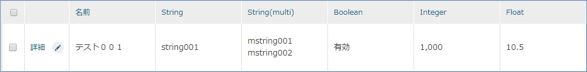

デフォルトで表示される検索結果部分のポイントです。

* Binary型のPropertyは表示されない
* Reference型のProperty多重度1のもののみ表示される（Reference2は表示されない）
* Reference型以外のPropertyは多重度が1以外でも表示される（String(multi)は表示される）

ここまでで、Propertyの型の違いによるGEM画面のデフォルト動作を一通り確認しました。
Entityの設定をもとに、検索・登録などのEntityデータに対する操作画面が動的に作成されるのがiPLAssの特徴となっています。

=== Entity操作画面のカスタマイズ
==== SearchLayoutとDetailLayout
ここでは、Entityに対する検索・編集画面のカスタマイズ手順を説明します。
簡単なカスタマイズを通じて手順を理解して下さい。

ここまでで、Entity定義情報を元に汎用的なEntityの検索・編集画面が自動的に生成され、利用可能であることを確認してきました。
ただし、Entityの検索・編集画面は、要件によってはカスタマイズが必要になるケースが当然あります。GEM画面にはカスタマイズが可能な仕組みがあり、今までの開発要件などをベースにして、多くの部分をカスタマイズすることが可能です。カスタマイズはAdminConsole上から行います。 +
`SearchLayout` 、 `DetailLayout` についての詳しい説明を知りたい方は<<../../developerguide/genericentitymanager/entityview/index.adoc#,Generic Entity Manager (EntityView)>>を参照してください。

===== レイアウトカスタマイズ画面の起動
AdminConsole画面を開いて、画面を変更したいEntityを選択して、右クリックでメニューを表示させてください（Entity単位でカスタマイズを行うことができます）。

`DetailLayoutを開く` と `SearchLayoutを開く` というメニューがあります。
これがEntityに対するGEM画面をカスタマイズするための設定画面の起動方法です。

DetailLayout::
詳細画面、編集画面のカスタマイズを行います。

SearchLayout::
検索画面のカスタマイズを行います。

==== 検索画面のカスタマイズ

===== Entityのコピー
`Properties` Entityをそのまま利用されてもかまいませんが、今回は先ほど作成した `Properties` Entityをコピーしてみましょう。
`Properties` Entityは後ほどカスタマイズしたものとの比較に利用します。

コピーは右クリックメニューから行います。

ダイアログが開くので名前を変更します。

[options="header"]
|===
|項目|設定値
|Name|tutorial.properties.Properties2
|Display Name|プロパティ確認用２
|===

`Save` ボタンをクリックして保存し、ツリー上の `Properties2` Entityを右クリック、 `SearchLayoutを開く` をクリックしてください。

検索画面のカスタマイズ用画面が表示されます。

===== SearchLayoutの画面構成
下のような画面が表示されます。

大きく5つの構成に分かれます。

.Topツールバー（A）
カスタマイズはViewという単位で複数のレイアウトを保存することができます。
ここは主に全体のViewに対する操作を行うための領域です。
`Save` ボタンが利用できないのは、保存はView単位で行うためです。

.Viewツールバー(B)
View単位の操作を行うためのものです。

.レイアウト設定部（C）
この領域内の各Section（枠線）に対して、Dの領域に表示されているアイテムをドラッグ&ドロップで配置したり、個々の設定を行います。

.アイテム部（D）
Entityに定義されているPropertyやSectionというアイテムが表示されます。
検索条件や検索結果として表示したいPropertyをCの領域にドロップします。

===== 簡単なカスタマイズ
簡単なカスタマイズを行って手順を理解しましょう。
今回は複数のView定義などは考えず、 `default` というViewに対して定義を行います。

.デフォルトのレイアウト定義のロード
SearchLayoutを初めて開いたタイミングでは何も設定されていません。
今まで見てきたように、SearchLayoutが未設定でもデフォルトで検索画面は表示されました。
これは基盤内部でEntity定義から標準のLayout定義を生成しているためです。

カスタマイズする場合、この標準定義を元にカスタマイズするのが効率的なので、標準定義を表示させましょう。
Viewツールバーにある `標準ロード` をクリックしてください。

標準で検索画面に表示されていた設定が画面に反映されます。

この設定をベースにカスタマイズを行っていきます。

.画面全体に対する設定
検索画面全体に対しての設定は `検索画面` と書いてある部分の右隅にあるボタンから行います。

編集ダイアログが表示されます。

今回は `画面タイトル` に `カスタマイズ確認用` と入力して `OK` ボタンをクリックしてください。

.検索条件に対する設定
検索条件部に対しての設定は `検索条件` と書いてある部分の右隅にあるボタンから行います。

今回は `CSVダウンロードボタンを非表示` と `CSVアップロードボタンを非表示` をチェックして `OK` ボタンをクリックしてください。

検索条件指定部には左に表示されている `オブジェクトID` を検索条件として指定できるようにさせましょう。
ドラッグして先頭に追加してください。

個々のPropertyに対する設定はPropertyの横にあるボタンから行います。
今回は `Datetime` Propertyを編集します。

今回は表示ラベルを設定します。

また `プロパティエディタ` という項目に `TimestampPropertyEditor` が設定されています。
これはEntityのProperty型に対応するEditor定義が自動的に選択されます。
変更すると画面に表示されなくなる場合があるので、今回はリスト自体は変更しません。
この横の `編集` ボタンをクリックしてください。
Editorの設定ダイアログが表示されます。

設定可能な項目はProperty型毎（Editor毎）に変わります。
今回は `時間の表示範囲` を `NONE` （非表示）に設定します。

.検索結果に対する設定
検索結果部に対しての設定は `検索結果` と書いてある部分の右隅にあるボタンから行います。

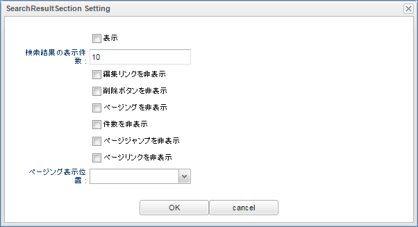

今回は `編集リンクを非表示` をチェックします。

検索結果指定部分にも `オブジェクトID` を指定しましょう。
ドラッグして先頭に追加してください。

各Propertyに対しても検索条件同様、それぞれに設定可能な項目があります（今回は省略します）。

ここまでで一度Viewを保存します。
Viewツールバーの `保存` ボタンをクリックしてください。

.確認
GEM画面に切り替え、確認してみましょう。
メニューで `ホーム` をクリックし一度メニューを最新表示します。
`プロパティ確認用２` が追加されるので、クリックして検索画面を表示します。

検索画面の変更を確認してみてください。

image::images/customize_confirmcondition.png[]

まだデータが登録されていないので、 `新規登録` ボタンからデータを登録してみてください。
その後一覧に戻って（メニューを押すか、詳細画面から戻るか）検索画面を表示してください。

このようにSearchLayoutの設定によってGEMの検索画面をカスタマイズできます。

==== 詳細画面のカスタマイズ
次は詳細画面をカスタマイズします。

===== DetailLayoutの編集画面起動
再度AdminConsole画面を開いて、検索画面同様AdminConsoleの対象Entityを右クリックして `DetailLayoutを開く` をクリックしてください。

===== DetailLayoutの画面構成
以下のような画面が表示されます。

SearchLayoutとほぼ構成は変わりません。

.Topツールバー（A）
カスタマイズはViewという単位で複数のレイアウトを保存することができます。
ここは主に全体のViewに対する操作を行うための領域です。
`Save` ボタンが利用できないのは、保存はView単位で行うためです。

.Viewツールバー(B)
View単位の操作を行うためのものです。

.レイアウト設定部（C）
この領域に対して、Dの領域に表示されているアイテムをドラッグ&ドロップで配置したり、個々の設定を行います。

.アイテム部（D）
Entityに定義されているPropertyやSectionというアイテムが表示されます。
またElementというアイテムも表示されます。

===== 簡単なカスタマイズ
簡単なカスタマイズを行って手順を理解しましょう。
今回は複数のView定義等は考えず、 `default` というViewに対して定義を行います。

.デフォルトのレイアウト定義のロード
SearchLayoutと同様、標準定義をロードしてください。

.画面全体に対する設定
編集画面全体に対する設定は `詳細画面` と書いてある部分の右隅にあるボタンから行います。

検索画面同様タイトルを変更しましょう。

.Sectionの変更
標準でロードされた定義を見ると `基本項目` と `オブジェクト情報` という２つのグループに分かれています。（背景が水色の部分）

これはSectionアイテムにある `標準セクション` というSectionによって実現されています。

今回はこのSectionをEntityのPropertyの型のカテゴリで別けてみましょう。

[options="header"]
|===
|カテゴリ|型
.8+|基本型|String
|Boolean
|Integer
|Float
|Decimal
|DateTime
|Date
|Time
.5+|特殊型（拡張型）|Select
|AutoNumber
|Expression
|Binary
|LongText
|参照型|Reference
|===

右の `標準セクション` を一番下にドラッグ&ドロップしてください。

ドロップしたタイミングでダイアログが開きます。タイトルに `基本型` と入力して `OK` ボタンをクリックしてください。

同様に `特殊型`  `参照型` を作ります。

あとは各Sectionに標準定義で定義されているPropertyを上から移動してください。

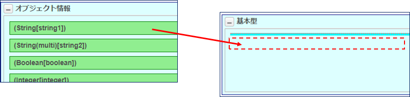

IMPORTANT: PropertyアイテムはView内で複数ドロップ可能ですが、表示されるのは1つとなるように<<../../developerguide/genericentitymanager/entityview/index.adoc#element_judgedisplayscript, 表示判定スクリプト>>で制御してください。

全部移動すると以下のような形になります。

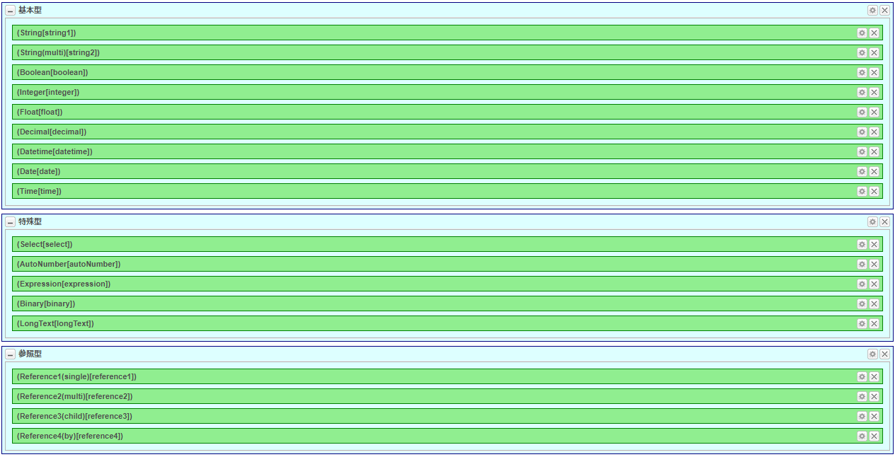

`オブジェクト情報` のSectionが空になりましたので削除しましょう。Sectionの横にある `×` ボタンをクリックして削除してください。

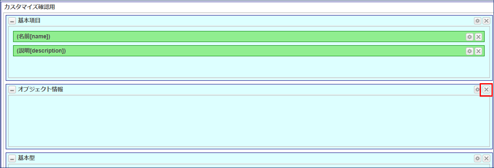

この状態で保存しましょう。

.確認
先ほど検索結果の確認時に登録したデータがあれば、検索結果一覧から詳細画面を表示してください。

続けて編集画面も確認してください。同じように変更されています。

このようにDetailLayoutの設定によってGEM画面をカスタマイズできます。

[[save_defaultlayout]]
===== 標準定義の登録

ここまでに以下のEntityを作成してきましたが、そのうち画面をカスタマイズしたのは `プロパティ確認用２` のみとなります。

[options="header"]
|===
|Name|DisplayName
|tutorial.product.ProductCategory|商品カテゴリ
|tutorial.product.Product|商品
|tutorial.properties.Properties|プロパティ確認用
|tutorial.properties.Ref1|参照１
|tutorial.properties.Ref2|参照２
|tutorial.properties.Ref3|参照３
|tutorial.properties.Ref4|参照４
|tutorial.properties.Properties2|プロパティ確認用２
|===

その他のEntityについても、それぞれ `Search_Layout` と `Detail_Layout` を開いて、 `標準ロード` で作成した設定を保存しておいてください。
このチュートリアルでは詳しくは触れませんが、管理者以外のユーザーが操作する際に必要となります。
詳細についてはチュートリアル終了後、開発者ガイドの<<../../developerguide/genericentitymanager/entityview/index.adoc#genericentityview, Generic Entity Manager (EntityView)>>を参照してください。

ここまででEntity定義により作成されるGEM画面をカスタマイズする手順を確認しました。
次はGEM画面のTop画面について、簡単なカスタマイズ方法を説明します。

=== Top画面のカスタマイズ
GEM画面で表示されるTop画面は `Menu` メタデータと `TopView` メタデータ定義を元に作成されています。
ここではそれぞれのメタデータ定義に対する簡単なカスタマイズを通して、Top画面を変更する手順を理解してください。
またこの手順の中で、Entityの `SearchLayout` や `DetailLayout` の複数のView定義について説明を行います。

==== メニューのカスタマイズ
===== Menuメタデータ
GEM画面のTop画面に表示されているメニュー部分は `Menu` メタデータで定義します。 +
GEM画面の `Menu` についての詳しい説明を知りたい方は<<../../developerguide/genericentitymanager/menu/index.adoc#,Generic Entity Manager (Menu)>>を参照してください。

テナント作成時点で `DEFAULT` というMenuが１つ定義されています。
メニューはiPLAss基盤のセキュリティ機能である `ロール` の設定と連動することが可能ですが、ここでは一旦置いておいて、Menu編集画面の構成について見ていきましょう。

===== Menu編集画面構成

大きく３つの構成に分かれます。

.Topツールバー（A）
保存用のボタンや履歴情報参照用のボタンがあります。
キャンセルをクリックすると編集されている内容を取り消して再度読み込みなおします。

.MenuTree（B）
メニューの階層を定義する部分です。
Ｃに表示されているMenuItemをドラッグ&ドロップで追加したり、ツリー内をドラッグ&ドロップして順番を変更します。

.MenuItem（C）
メニューとして表示されるアイテムです。
ツリー上にドロップします。

Top画面に表示されている各メニューの実体はMenuItemです。
MenuItemは用途によって４種類用意されています。

NodeMenuItem:: ActionMenuItem、EntityMenuItem、UrlMenuItemといった子アイテムを複数持つことができる（フォルダのような）アイテム。
このMenuItem自体はクリックしても子メニューの表示/非表示を行うだけで画面が遷移したりはしません。

ActionMenuItem:: Actionとして登録されたメタデータを実行するメニューアイテムです。

EntityMenuItem:: Entityの検索画面を表示するためのメニューアイテムです。
Entity定義を新規で作成すると、基盤が自動的に同名のEntityMenuItemを作成し、DEFAULTメニューに追加します。

UrlMenuItem:: 指定のURLを表示するためのメニューアイテムです。
外部サイトをメニューから呼び出す場合等に利用します。

===== 簡単なカスタマイズ
簡単なカスタマイズを行って手順を理解しましょう。

.NodeMenuItemの作成
今までチュートリアルを手順どおりに行っていれば、Top画面に表示されているメニューは下記のようになっています。

`権限情報` （NodeMenuItem）、 `基本情報` （NodeMenuItem）、 `お知らせ情報` （EntityMenuItem）はテナント作成時にデフォルトで作成されているメニュー定義です。
その下のメニューはチュートリアルを進める中でEntityを作成した時に作成されたEntityMenuItemです。

このチュートリアルで作成されたEntityMenuItemを利用して整理してみましょう。
下のようなメニューにしてみます。

まずは `商品情報` 用のNodeMenuItemを作成します。

AdminConsoleを開き、 `DEFAULT` メニュー定義をダブルクリックして編集画面を表示してください。

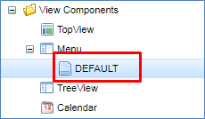

`MenuItems` の中に表示されている `NodeMenuItem` を右クリックし、「メニューアイテムを作成する」を選択してください。
MenuItemの編集ダイアログが表示されます。

Name、DisplayNameを設定します。
メニューとして画面に表示される文言がDisplayNameになります。
Descriptionは開発者用です、未設定のままで問題ありません。
Icon URL、Icon Tagについてはこの時点では割愛します。

Nameは `/` で階層化されます。
Entityの時は `.` （ドット）でしたが、その他のほとんどのメタデータは `/` で階層化されます。

[options="header"]
|===
|項目|設定値
|Name|tutorial/product/ProductNode
|DisplayName|商品情報
|===

NodeMenuにはメニューに表示される枠の部分の色を設定することができます。
今回はImage Colorに `blue` を指定してみます。

設定したら `Save` ボタンで保存してください。
NodeMenuItemに追加されます。

追加されたNodeを左側のツリー部分にドラッグ&ドロップしましょう。

上にある `ProductCategory`  `Product` アイテムをドラッグして今追加した `ProductNode` NodeMenuItemに入れましょう。

`ProductNode` アイテムの真上にマウスポインタを合わせるとNodeの子アイテムとなります。
`ProductNode` の下に移動したいのか、 `ProductNode` の子アイテムにしたいのかをマウスの位置で判断するため、慣れるまでは若干コントロールが難しいかもしれません。
うまくいかない場合は何度かチャレンジしてください。

同様に `プロパティ確認` NodeMenuItemを作成して、プロパティ確認用に作成したEntityのEntityMenuItemを移動してください。

[options="header"]
|===
|項目|設定値
|Name|tutorial/product/PropertyNode
|DisplayName|プロパティ確認
|Image Color|green
|===

完成すると以下のようになります。
配置されたことを確認し、 `Save` ボタンを押してメニューを保存してください。

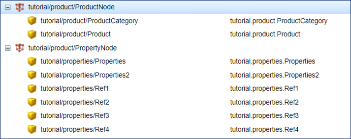

GEM画面の `ホーム` メニューをクリックして、画面を更新してください。
`商品情報` 、 `プロパティ確認` メニューが追加され、その下に各Entityメニューが表示されるようになります。

.EntityMenuItemの変更
次はEntityMenuItemを触ってみましょう。
EntityMenuItemから作成されたメニューをクリックすると、Entityの検索画面を表示します。
この検索画面ですが、画面表示時のパラメータとして `es=t` と指定すると、検索画面を表示したタイミングで条件無しの検索結果を表示することができます。
`商品カテゴリ` Entityのように登録データ件数が少ないものなど、検索画面表示事に検索を行ってしまった方がいい場合等の利用を想定しています。

実際に `商品カテゴリ` Entityの検索画面表示時に検索結果を表示させて見ましょう。

念のためパラメータを指定しない `商品カテゴリ` EntityMenuItemを残しておくことにします。
`ProductCategory` EntityMenuItemを右クリックし、「メニューアイテムをコピーする」を選択してください。

image::images/menu_copyproductcategory.png[]

ダイアログが開くので、値を編集します。

ダイアログ起動時に `Name` の後ろに `_Copy` という値が設定されています。今回は以下のように変更します。

image::images/menu_productcategorysearchdialog.png[]

`show with execute search` をチェックすると、メニュークリックで画面表示した時に検索処理を実行します。
この設定はParameterに `es=t` を指定するのと同じ意味合いになります。
ですので、チェックせずにParameterの方を指定しても同様の動きになります。

[options="header"]
|===
|項目|設定値
|Name|tutorial/product/ProductCategorySearch
|Display Name|商品カテゴリ（検索実行）
|show with execute search|チェック
|===

`Save` ボタンを押して保存すると、EntityMenuItme上に追加されます。

これをツリー部分にドロップします。
今回は `ProductNode` の下の `ProductCategory` の下に置くことにします。

`Save` ボタンでメニューを保存してください。

GEM画面の `ホーム` メニューをクリックして画面を更新してください。
`商品情報` Nodeの中に `商品カテゴリ（検索実行）` メニューが追加されます
（メニュー部品の横幅が固定のため、右のようにタイトルが長いと折り返されます）。

クリックして検索画面を表示してください。
画面表示時に検索処理が実行され一覧に表示されています。

.ActionMenuItemの作成
Actionについてはここまでのチュートリアルで登場していないので、手順という意味で既にGEM画面で提供されているActionを実行するメニューを作成してみます。
今回は `商品` Entityの新規登録画面を表示するActionMenuItemを作成します。

検索画面の上に表示される `新規登録` ボタンをクリックすると新規登録画面が表示されました。
この新規登録ボタンで実行されるActionは `gem/generic/detail/edit` というAction定義です。
今回はこの `Entityの新規登録画面を表示するAction` を実行するActionMenuItemを作成します。

Menuの編集画面の右に表示されている `MenuItems` 内の `ActionMenuItem` を右クリックし、「メニューアイテムを作成する」を選択してください。

Itemの編集ダイアログが表示されます。

`Name` 、 `Display Name` を設定します。
また、ActionMenuには実行する `Action` とそのActionに渡す `パラメータ` を指定できます。
ここでは先ほど示した `gem/generic/detail/detail` というActionを指定します。

このActionはパラメータとして新規で追加するEntity名を必要とします。
`defName=Entity名` の形式で指定します。
今回は `商品` Entityを対象とするので、 `defName=tutorial.product.Product` となります。

[options="header"]
|===
|項目|設定値
|Name|tutorial/product/CreateProduct
|Display Name|商品登録
|Execute Action|gem/generic/detail/edit
|Parameter|defName=tutorial.product.Product
|===

設定したら `Save` ボタンで保存してください。
ActionMenuItemに追加されます。

追加されたItemをツリー部分にドロップします。
今回は `ProductNode` の下の `Product` の下に置くことにします。

`Save` ボタンでメニューを保存してください。

GEM画面の `ホーム` メニューをクリックして画面を更新してください。
`商品情報` Nodeの中に `商品登録` メニューが追加されます。
そのメニューをクリックすると、 `商品` Entityの新規登録画面が表示されます。

==== Top画面のカスタマイズ
===== TopViewメタデータ
ログイン後に表示されるTop画面のメニュー以外の部分は `TopView` メタデータで定義します。 +
GEM画面の `TopView` についての詳しい説明を知りたい方は<<../../developerguide/genericentitymanager/topview/index.adoc#,Generic Entity Manager (TopView)>>を参照してください。

テナント作成時点で `DEFAULT` というTopViewが一つ定義されています。
トップ画面はメニュー同様、iPLAss基盤のセキュリティ機能である `ロール` の設定と連動することが可能ですが、ここでは一旦置いておいて、編集画面の構成について見ていきましょう。

===== TopView編集画面構成

大きく３つの構成に分かれます。

.Topツールバー（A）
保存用のボタンや履歴情報参照用のボタンがあります。
キャンセルをクリックすると編集されている内容を取り消して再度読み込みなおします。

.Drop Area（B）
Top画面に表示するアイテムをドロップする領域です。
`Widget Area` と `Main Area` に分かれます。

.TopViewアイテム（C）
Top画面に表示されるアイテムです。
アイテムの種類（Widget、Parts）に応じて右側のAreaにドロップします。

アイテムは目的に応じて複数用意されています。各アイテムの横に `W`  `P`  `U` という表記がありますが、次の意味を表します。

W:: Widgetとして利用可能
P:: Partsとして利用可能
U:: Widget、Partsを含めて一つのみドロップ可能

またAggregation、Calendar、TreeViewについては、それぞれ対応するメタデータを作成することでドロップするためのアイテムが表示されるようになります。

.TopViewアイテムの種類
TopViewアイテムは配置先のDrop Areaによって以下のように分類されます。
同一のアイテムであっても、配置先によって設定や表示内容が変わることがあります。

Widget::
Drop Areaの `Widget Area` に配置したアイテムです。
iPLAssのTop画面におけるWidgetとは、メニュー領域に表示される部品のことです。
このWidgetが設定されるとTop画面のメニュー部分に `ウィジェット` が表示されるようになります。

Parts::
Drop Areaの `Main Area` に配置したアイテムです。
テナント作成時点で `お知らせ情報` の一覧を表示するPartsが設定されています。
`商品` Entityの検索結果一覧を表示するPartsを設定した場合は以下のように表示されます。

===== 簡単なカスタマイズ
簡単なカスタマイズを行って手順を理解しましょう。

.SearchResultListの利用
`SearchResultList` はEntityの検索結果をTop画面に表示するアイテムです。

`EntityData List` にある `SearchResult List` を `Main Area` にドロップしてください。

ドロップすると検索対象等を設定するダイアログが表示されます。

検索対象とするEntityを選択します。
以前に作成した `プロパティ確認用` Entityを選択してください
（もし存在しない場合は別のEntityでもかまいません）。
選択すると `ResultListView` と `LinkActionView` にそれぞれ `default` が設定されます。
この設定は別途説明するのでそのまま `OK` ボタンをクリックしてください。

TopViewの `Save` ボタンをクリックして保存してください。

GEM画面の `ホーム` メニューをクリックして、画面を更新してください。
検索結果の一覧が表示されます。

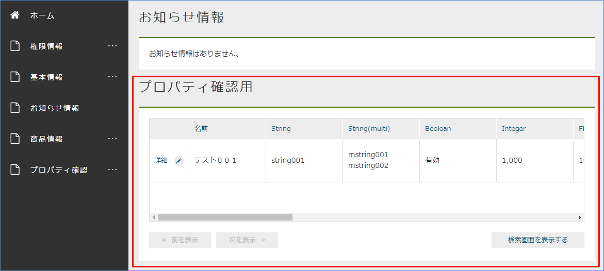

このSearchResultListに対する検索条件の指定はEntityのFilterを利用します。
まだFilterについて説明していないため、ここではFilterを指定しませんでした。
今回のようにFilterを指定しない場合、Entityの共通Propertyである `updateDate` の降順で検索が実行されます。

.Separatorの利用
`Separator` は画面領域を横に二つに分割するアイテムです。
ここでは `SearchResult List` を横に並べて表示してみます。

まずは `Custom Parts` にある `Separator` を `Main Area` にドロップしてください。

`Separator` には設定項目は無いので編集ボタンがありません。

この `Separator` の上に先ほど利用した `SearchResult List` を２つドロップします。
左側を `商品` Entity（tutorial.product.Product）、右側を`プロパティ確認用２` Entity（tutorial.properties.Properties2）と指定してください。

ここでTopViewを保存して、画面を確認してみてください。

指定したEntityに対する検索結果の一覧が横に二つ表示されます。
よく見ると `カスタマイズ確認用` の一覧だけ `編集` リンクが表示されていません。

これはSearchResultListで表示している一覧のレイアウト定義がEntityのSearchLayout設定（その中の検索結果部分）によって制御されているためです。
先ほど設定画面で `ResultList View` を `default` のまま登録したので、 `プロパティ確認用２` Entity（tutorial.properties.Properties2）のSearchLayout設定の `default` 定義が利用されています。

`Properties2` EntityのSearchLayoutを確認してみます。

検索結果の編集ボタンをクリックしてみてください。

編集リンクが非表示になっています。

なお、他の削除ボタンや件数表示、ページジャンプなどの設定はTop画面としては無視しています。

次はこのViewを編集してみます。

.SearchResultListの応用（SearchLayoutとDetailLayoutのView定義の利用）
今表示されているTop画面のように、プロパティ項目が多い場合やSeparatorで区切った結果表示領域が狭い場合等、Top画面としては表示項目を絞りたいといったケースがあります。
これはEntityのSearchLayoutでTop画面で表示するためのViewを定義することで実現できます。

先ほどの操作では `ResultList View` の設定は `default` となっていました。
ここでは `プロパティ確認用２` EntityのSearchLayoutに対してTop画面用のViewを追加して、それを `ResultList View` で利用してみます。

まずは `プロパティ確認用２` Entity（tutorial.properties.Properties2）のSearchLayoutを表示します。
既に `default` のViewは定義してありますので、今回はこれをコピーして表示するPropertyを整理しましょう。
`コピー` ボタンをクリックしてください。

確認メッセージが表示されるので `OK` してください。

Viewの名前を指定するダイアログが表示されるので名前を入力します。
今回は `topview` にします。

[options="header"]
|===
|項目|設定値
|View Name|topview
|===

そうすると `View名` に `topview` が追加され、選択された状態になります。

この検索結果一覧に追加されているPropertyを減らしてみましょう。
今回は `オブジェクトID` と `名前` 以外は消してしまいます。

削除し終わったらViewの `保存` ボタンをクリックして保存します。

同様に `プロパティ確認用２` EntityのDetailLayoutについてもViewを追加してください。
追加する際のView名はSearchLayoutと同じで `topview` にします。

一番上の基本項目セクション以外を削除してみましょう。
削除し終わったらViewの `保存` ボタンをクリックして保存します。

次はTopViewに戻って、一番下の右に表示している `SearchResult List` の編集ボタンをクリックして下さい。

`ResultList View` と `Detail Action View` に先ほど追加した `topview` が追加されているので、それを選択してください。

image::images/topview_searchresultlistdialog-topview.png[]

この状態でTopViewを保存して、Top画面を表示してみてください。
`オブジェクトID` と `名前` のみが表示されます。

ここで `詳細` リンクをクリックすると、Entityの `DetailLayout` で設定した `topview` のView定義が表示されます。

続いて、 `Detail Action View` の設定を利用して、一覧上の `詳細` リンク（または `編集` リンク）で表示されるViewを変更してみます。
`プロパティ確認用２` Entity（tutorial.properties.Properties2）のDetailLayoutを開いてください。

SearchLayout同様、既に `default` のViewは定義してあります。
今回もこれをコピーします。
`コピー` ボタンをクリックしてコピーしてください。
今回はView Nameを `topview2` としてください。

[options="header"]
|===
|項目|設定値
|View Name|topview2
|===

今回は詳細画面用の定義なのでPropertyは全項目を出しましょう。
ですのでPropertyを削らずに、タイトルだけ `カスタマイズ確認用２` に変更します。

[options="header"]
|===
|項目|設定値
|画面タイトル|カスタマイズ確認用２
|===

これで保存してください。

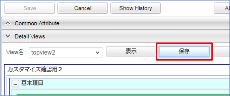

今度はTopView側の `SearchResult List` の編集画面で `Detail Action View` に `topview2` を設定してみてください。

`topview2` が `Detail Action View` に表示されません。
これは `Detail Action View` で指定可能なViewはSearchLayout側に登録されているものが表示されるためです。
今はDetailLayout側にのみ `topview2` を登録しているだけなので、 `Detail Action View` を選択することができません。

SearchLayout側にも `topview2` を作成します。
今回は `default` で定義しているViewをコピーしたものをそのまま利用します。
また、画面タイトルのみ `カスタマイズ確認用２` と変更しておきます。

SearchLayoutを保存して、再びTopView側の `SearchLayout List` の編集画面で `Detail Action View` のプルダウンを確認してください。
今度は `topview2` が選択できるようになっています。

TopViewを保存して、Top画面を確認してみてください。
Top画面に表示されているのは `ResultList View` で指定した `topview` のままです。
詳細リンクをクリックして詳細画面を表示します。

タイトルが `カスタマイズ確認用２` となっているように、 `Detail Action View` で指定した `topview2` のView定義（DetailLayout）が表示されます。

次に `Link Action View` の設定を利用して、一覧内の `検索結果を表示する` ボタンを押下した際に表示されるViewを変更してみます。
`プロパティ確認用２` Entity（tutorial.properties.Properties2）のSearchLayoutを開いてください。

今回は `topview` をコピーしてViewを作成していきます。
作成したView Nameを `topview3` としてください。 +
検索画面は `topview` のものを使用するためViewをコピーした状態からタイトルだけ `カスタマイズ確認用3` に変更します。

[options="header"]
|===
|項目|設定値
|View Name|topview3
|画面タイトル|カスタマイズ確認用３
|===

これで保存してください。

次に、 DetailLayout側にも `topview3` を作成します。
`SearchLayout` と同様に `topview` で定義しているViewをコピーしたものをそのまま利用するため、画面タイトルのみ `カスタマイズ確認用３` と変更しておきます。

DetailLayoutを保存して、TopView側の `SearchLayout List` の編集画面で `Link Action View` のプルダウンから `topview3` を選択してください。

TopViewを保存して、Top画面を確認してみてください。
Top画面に表示されているのは `ResultList View` で指定した `topview` のままです。
`検索画面を表示する` ボタンをクリックして検索画面を表示します。

タイトルが `カスタマイズ確認用3` となっているように、 `Link Action View` で指定した `topview3` のView定義（SearchLayout）が表示されます。

また、検索結果の `詳細` リンクをクリックすると `topview3` のView定義（DetailLayout）が表示されます。

確認ができたら、一度プロパティ確認用２の設定を戻します。

 
.UserMaintenanceの利用
`UserMaintenance` はTop画面の上部のツールバーに表示される `ユーザー情報変更` メニューの画面レイアウトを指定するアイテムです。

デフォルトではパスワードを変更する画面が表示されます。

この画面を変更することができるのが `UserMaintenance` アイテムです。

まずは `Toolbar Parts` にある `UserMaintenance` を `Main Area` にドロップしてください。

右にある編集ボタンをクリックします。

Viewを指定するダイアログが表示されます。

ここで指定するViewとはiPLAss基盤のユーザー情報を保持する `User` Entityに定義されたDetailLayoutのViewのことです。
`User` EntityのDetailLayoutを表示し、View名のプルダウンを開いてみてください。

[options="header"]
|===
|View名|用途
|default|一般ユーザーの登録用（管理者設定なし）
|admin|管理者を含むユーザーの登録用（システム管理者向け）
|maintenance|ユーザー自身のメンテナンス用（TopView用）
|===

それぞれのViewは利用目的を想定してレイアウトが定義されています。

TopViewの `UserMaintenance` アイテムの編集画面に戻ってViewを指定してみましょう。
今回は `maintenance` Viewを指定します。

image::images/usermaintenance_usermaintenancedialog-selected.png[]

TopViewを保存してTop画面の `ユーザー情報変更` メニューの画面を確認してください。

ユーザー情報の入力領域が表示されるようになりました。
パスワードについては別領域として表示されます。
これはiPLAss基盤ではユーザーのパスワード情報を `User` Entityとは別に管理しているためです
（ `User` Entityにはパスワードに関するPropertyはありません）。

==== EntityMenuItemでViewを指定
Top画面の説明の中でSearchLayoutやDetailLayoutのView定義を利用しました。
ここではMenu用のアイテムとして説明したEntityMenuItemでこのEntityのViewを指定する方法を説明します。

チュートリアルの `EntityMenuItemの変更` では、検索画面を表示したタイミングで検索を実行するための設定を行いました。
Viewの指定も同様にEntityMenuItemの設定画面で行います。

.Viewの指定
`プロパティ確認用２` のメニュー設定は初期設定のままです。

ですので、メニューの `プロパティ確認用２` をクリックすると、defaultとして定義されたSearchLayoutが表示されます。

TopViewのチュートリアルの中で `topview` と `topview2` というView定義を作成しました。

`topview` はTop画面用のSearchResult Listのレイアウト用のViewなので、DetailLayoutを定義しておらず、メニューから起動する検索画面には利用できません。
これは検索画面から詳細画面、詳細画面から検索画面へと遷移する際に、同じView名を利用するためで、どちらかが定義されていない場合に画面表示を行うとエラーとなります
（DetailLayoutに `topview` のView定義を作成すれば利用は可能です）。
ここでは `topview2` を指定することにします。

アイテムを保存したら、GEM画面へ戻り、 `ホーム` メニューをクリックして画面を更新してください。
`プロパティ確認用２` をクリックすると、 `カスタマイズ確認用２` というタイトルが表示され、 `topview2` の画面が表示されていることが確認できます。

ここでは、Top画面のメニュー部分やメイン部分に表示するコンポーネントについて、いくつかカスタマイズする手順を確認しました。
またSearchLayoutやDetailLayoutのView定義の利用についても同時に確認しました。
次は、GEM画面に設定できるアイコンについて説明します。

=== アイコンの設定
ここまで見てきたEntityの検索画面や詳細画面、メニューやTop画面のパーツにはアイコンを設定できます。
それぞれの設定画面に `Icon Tag` や `アイコンタグ` といった項目があり、ここに link:https://fontawesome.com/[Font Awesome^] のアイコンタグを設定することで、自由にアイコンを表示することができます。

今回は link:https://fontawesome.com/icons/star?style=regular[星型のアイコン^] を設定してみます。
各アイコンのページ内に表示用のhtmlタグが記載されているので、それを利用します。

[source,html]
----
<i class="far fa-star"></i>
----

それぞれの画面にアイコンを設定してみましょう。

==== メニュー
`Menu` の `DEFAULT` 設定を開き、 `商品` Entity(tutorial.product.Product)の設定画面を開いてください。
`Icon Tag` の項目があるので、ここにhtmlタグを設定します。

設定を保存し、GEM画面で `ホーム` をクリックし、画面を再表示してください。

商品Entityのメニューにアイコンが表示されました。

==== Top画面
`TopView` の `DEFAULT` 設定を開き、 `Information List` の設定画面を開いてください。
`Icon Tag` の項目があるので、ここにhtmlタグを設定します。

image::images/icon_top_setting.png[]

設定を保存し、GEM画面で `ホーム` をクリックし、画面を再表示してください。

Top画面のお知らせ情報にアイコンが表示されました。

==== 検索画面
`商品` Entity(tutorial.product.Product)の `SearchLayout` を開き、検索画面の設定画面を開いてください。
`アイコンタグ` の項目があるので、ここにhtmlタグを設定します。

設定を保存し、GEM画面で `商品` メニューをクリックしてください。

`商品` Entityの検索画面にアイコンが表示されました。

==== 詳細画面
`商品` Entity(tutorial.product.Product)の `DetailLayout` を開き、詳細画面の設定画面を開いてください。
`アイコンタグ` の項目があるので、ここにhtmlタグを設定します。

設定を保存し、GEM画面で `商品` Entityの詳細画面を表示してください。

`商品` Entityの詳細画面にアイコンが表示されました。

ここでは、各画面にアイコンを表示する基本的な方法を確認しました。
次は、GEM画面と今まで言ってきましたが、その実態であるGEM（ジェム）について説明します。

=== スキン・テーマの設定
GEMモジュールは画面のレイアウト定義としてメニューの表示方法（スキン）と画面のベースカラー（テーマ）を切り替えることができます。
この指定はテナント単位で指定可能にしているので、Tenantメタデータ上で設定します。

[cols="1,2,6,^1", options="header"]
|===
2+|選択値|説明|Default
.4+|スキン|フラット|フラットデザインベースのレイアウト。メニューが垂直（画面左側）に表示されます。|○
|垂直メニュー|メニューが垂直（画面左側）に表示されます。|
|水平メニュー|メニューが水平（画面上側）に表示されます（TopViewで指定されたウィジェット部品は画面左側に表示）。|
|水平メニュー（ドロップリストメニュー）|メニューが水平（画面上側）に表示されます（TopViewで指定されたウィジェット部品は画面左側に表示）。ただしサブメニュー（NodeMenuItem下のメニュー）は垂直に表示されます。|
.8+|テーマ|黒|画面上部のラインを黒で、ボタンなどは青ベースで表示します。|○
|赤|画面上部のラインを赤で、ボタンなどは赤ベースで表示します。|
|緑|画面上部のラインを緑で、ボタンなどは緑ベースで表示します。|
|青|画面上部のラインを青で、ボタンなどは青ベースで表示します。|
|明るい赤|画面上部のラインを明るい赤で、ボタンなどは明るい赤ベースで表示します。|
|明るい緑|画面上部のラインを明るい緑で、ボタンなどは明るい緑ベースで表示します。|
|明るい青|画面上部のラインを明るい青で、ボタンなどは明るい青ベースで表示します。|
|オレンジ|画面上部のラインを明るいオレンジで、ボタンなどは明るいオレンジベースで表示します。|
|===

未指定の場合は `Default` が適用されます。

設定によりGEMモジュールのスタイルシートが切り替えられ、簡単に見た目を変更することができます。

フラット/青

垂直メニュー/黒

水平メニュー/緑

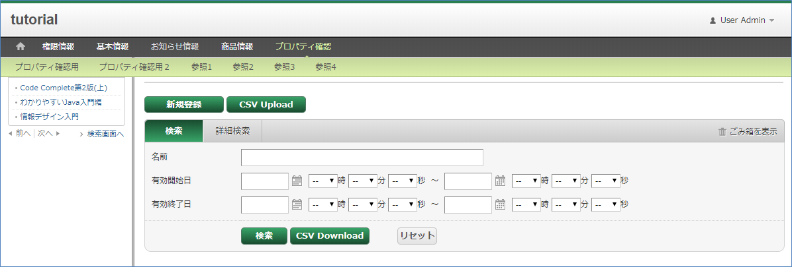

水平メニュー（ドロップリストメニュー）/赤

リリース後に切り替えることも開発途中で切り替えることも可能ですが、各画面をカスタマイズする場合（Templateをいじったり、Templateを挿入したりする場合等）は、レイアウトを意識して実装することが多いので、できるだけ開発初期の段階で決定させることをお勧めします。

