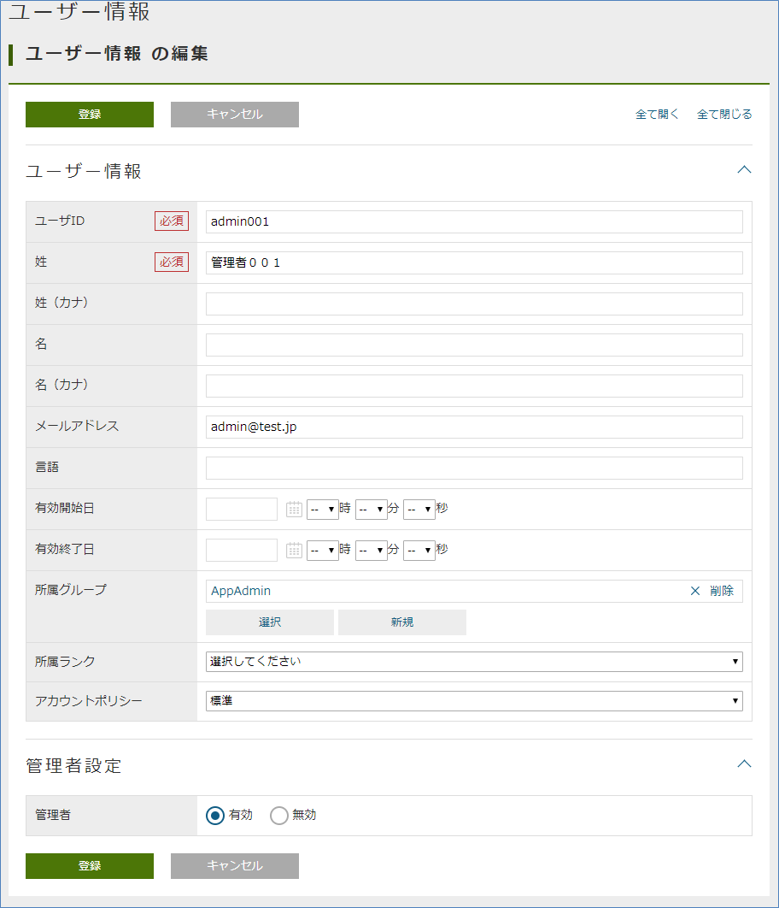
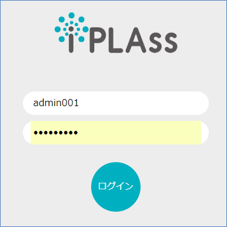
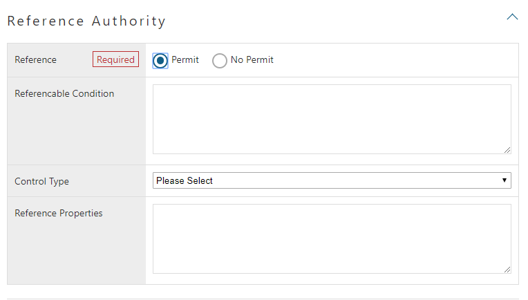
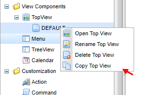

[[usermanagement]]
== User Management

[[usermanagement_regist]]
=== User Registration

[[usermanagement_user]]
==== User Entity
In iPLAss platform, `User` Entity (mtp.auth.User) is used as Entity for managing user information.
Here, we will explain the properties of `User` Entity defined by default.

[[usermanagement_property]]
===== Property
Display the edit screen of `User` Entity from AdminConsole.

We will focus on the following items.

.accountId (user ID)
Apart from `oid` which is a common property of Entity, Property has an alternate property called user ID.
Usually, user IDs will has its own rule of regularity, and are not decided automatically, differing from oid, which are automatically assigned.
(The primary KEY for Entity is oid. However, oid can be set as the value of accountId.)

.FirstName, LastName
For user names, only lastName is required.

(For Reference) About `name` Property +
The value is automatically set to `name` (required Property), which is a common property of Entity, using the function called EventListener of Entity when registering or changing the data of `User` Entity.
(The EntityEventListener is not explained, so you can ignore it.)
At this case, if the Tenant metadata locale is `en`, the value is set as `firstName lastName`, otherwise it is set as `lastName firstName`.

.mail
The e-mail address is an optional input item, but it is necessary to notify the password when a password was generated automatically when a user is registered with the the account policy settings of Automatic-Password-Generation.
This is not necessary if you want the user to set password at the time of user registration, but it is still required for the purpose of notification when the administrator resets the password, so change the setting according to the application. +
Please note that when performing the tutorial, please set your email address as much as possible.

.admin
This property must be true for system administrator users.

Only system administrators can use AdminConsole.
This value is true for system admin users who are notified when tenants are created.

.group, rank
Property for managing users by group and rank.
`Group` Entity and `Rank` Entity are also provided as default.
Used as `Role` 's conditions to filter the users to apply privilege to.

.accountPolicy
The authentication policy that the user uses during authentication.
Only an administrator user or a user with the user administrator role can change it.

[[usermanagement_regist_user]]
==== User Registration

[[usermanagement_flow]]
===== User Registration Flow
User registration is performed from the User Entity registration screen.
The user's password is automatically generated by iPLAss when the user is registered, and is notified to the user via email.
When the user logs in for the first time, the screen for changing the password is displayed, so the user's will set password there.

[[usermanagement_mailsetting]]
===== Settings to Check Pending Emails During Development 
Since the set password is notified to the user by e-mail, a mail server is required. However, there are many cases where there is no mail server at the development stage or implementation stage of tutorials.
If you don't have a mail server, you can check your password using the debug app for checking pending mail provided by iPLAss.

To use this debug app, edit `mtp-service-config.xml` stored in `src/main/resources`.

The related information can be found in a property called `listener` commented in the `MailService` configuration of `mtp-service-config.xml`.

[source,xml]
----
<!-- Mail Service Settings -->
<service>
	<interface>org.iplass.mtp.impl.mail.MailService</interface>

	・・・・・

	<!-- ■ for develop only (additional="true) ■ -->
	<!-- If you want to output the mail in debug mode, please enable the following configuration. -->
	<!--
	<property name="listener" class="org.iplass.mtp.mail.listeners.LoggingSendMailListener" additional="true"/>
	-->
</service>

・・・・・
----

As a method to check outgoing mail, we provide a class that outputs the contents of the mail to a log.
This time, we will enable this debugging function assuming that you are using Tomcat from Eclipse on your local PC. (Please uncomment)

[source,xml]
----
    <!-- ■ for develop only (additional="true) ■ -->
	<!-- If you want to output the mail in debug mode, please enable the following configuration. -->
	
	<property name="listener" class="org.iplass.mtp.mail.listeners.LoggingSendMailListener" additional="true"/>
----

After restarting the server, you will be able to see the sent mail.
You can also incorporate your own process by implementing the `SendMailListener` interface.

TIP: Be careful not to disable log output, such as production environment and verification environment, for security reasons.
(Please only use this as a tool for development)

[[usermanagement_regist_user_ope]]
===== User Registration Operation
Let's actually register a user.
User registration is done from the `Basic Information` - `User Information` menu.
When the search screen is displayed, click the `Create New` button.

The input screen for the Property set in `User` Entity is displayed, so enter the user information.

[options = "header"]
|===
|Item|Setting
|User ID|user001
|Last Name|User 001
|E-mail address|user001@test.jp
|Groups|GemUser
|Account Policy|Standard
|===

After entering, click the `Register` button.
Once registered, the details screen will be ready to be displayed.

In addition, by enabling the listener for log output, the mail contents are output to the Eclipse console.

====
11: 13: 33.151 [http-nio-8080-exec-4] DEBUG 16 542 gem / generic / detail / InsertCommand oimmlLoggingSendMailListener-From: test@contract.dentsusoken.com ReplyTo: test@contract.dentsusoken.com To: (1) user001@test.jp; Cc: (0) Bcc: (0) Subject: [SampleTenant] User registration notice FileName: PlainMessage: User 001 User registration of “User 001” is performed on SampleTenant I was broken. A user ID and temporary password have been issued. Access SampleTenant from the URL below and register the password. URL: XXXXXXXX User ID: user001 User name: User 001 Temporary password: k, 3s6 # HV ============================== ======================================= □ For those who are not familiar with this email Emails are sent to customers who have registered with SampleTenant. If you do not understand this email, please contact the following address (source address). SampleTenant Secretariat test@contract.dentsusoken.com ====================================== ======================== Sender: DENTSU SOKEN Co., Ltd. COPYRIGHT 2011 DENTSU SOKEN INC. ALL RIGHTS RESERVED. HtmlMessage:
====

The title is prefixed with the tenant name (different for each tenant).
The title and email content can be changed with metadata called MailTemplate.

Although it is a little difficult to see because it is output in a form that ignores line breaks, a `temporary password` is written in the mail body.
It is necessary to log in for the created user.

[[usermanagement_initiallogin]]
===== First Time Login
Now let's log in as a new user.
First, log out the currently logged-in user.

Try logging in as the new user `user001`.

When the password change screen shows up, set the password.

After the change, login process is performed and the top screen is displayed.

If an error dialog is displayed at this time, please <<save_defaultlayout, create screen definition >> for each entity created so far.
Please log in again after creating and confirm that the error is resolved.

Since the user created here is not an administrator user, the `AdminConsole` menu tab will not be displayed in the menu list.

[[usermanagement_regist_admin]]
==== Registering Administrative Users
Administrators cannot be registered in the default state.
As mentioned in the description of the `UserMaintenance` item in `Customizing the Top screen`, `User` Entity is defined in 3 views.

[cols = "1,3, ^ 1, ^ 1", options = "header"]
|===
|View| Name Usage | DetailLayout | SearchLayout
|default|For general user registration (no administrator setting)|○|○
|admin|For registration of users including administrators (for system administrators)|○|○
|maintenance|For user's own maintenance (for TopView)|○|×
|===

Among these, `maintenance` View is provided as a View for the TopView `UserMaintenance` item, so `SearchLayout` is not provided.
View used for transition of general-purpose search screen and detail screen is not available here because DetailLayout and SearchLayout need a set of views with the same name. +
For a detailed explanation of `UserMaintenance`, see link:https://iplass.org/docs/developerguide/genericentitymanager/topview/index.html#usermaintenance[User Maintenance^].

If you want to create an administrator user, you can set the administrator flag by using the `admin` View.

Here, specify `admin` View for `User Information` EntityMenuItem existing in `DEFAULT` registered as Menu metadata so that the administrator can be registered.

[[usermanagement_menusetting]]
===== Setting
Log in as an administrator user again and display the editing screen of the `DEFAULT` Menu.

Right-click `mtp/auth/User` in `standard_node` and select `Open Menu Item` .

Set ViewName.

[options = "header"]
|===
|Item|Setting
|ViewName|admin
|===

Let's save and register a user from the `User Information` menu on the top screen of the general-purpose screen.

[[usermanagement_confirm]]
===== Confirm
Click `Home` on the top screen of the general-purpose screen to redraw, and then proceed to the new user registration screen.

The input section for `Administrator Settings` will be displayed on the screen.
Let's register an administrator user.

[options = "header"]
|===
|User ID|admin001
|Last name|admin001
|E-mail address|admin001@test.jp
|Affiliation Group|AppAdmin
|Account Policy|Standard
|Admin|enabled
|===

When you register, you will receive an email as before. Try logging in as a new user.

When you check the user menu, the `AdminConsole` menu is displayed.

Here, the registration procedure of the user was explained.
The following describes the role definition for controlling user privileges.

[[role_securitycontrol]]
=== Authority Control by Role
[[role_rolebase_securitycontrol]]
==== Role-Based Privilege Control
The iPLAss platform has a built-in function to control user privileges on a role basis.

Role is expressed by `Role` Entity (mtp.auth.Role), and the target user is specified as a condition.
It is also possible to specify a property (such as administrator flag, `group` or `rank`) defined in `User` Entity as a condition to narrow down the target user.

For the created role, set permissions such as reference/update for each Entity, execute permission for action, execute permission for WebApi, execute permission for workflow, etc.
(These are also expressed in Entity)

Here, the role is actually created.
Then, actually set the `Entity authority` in the authority setting and check the operation of the general screen.

It also explains how to associate Menu and TopView metadata with roles.

[[role_initialrole]]
==== Initial Roles and Grant Privileges
When the tenant is created, the `AppAdmin` role (application administrator role) and the `GemUser` role (Gem user role) are created.
Each group belongs to a condition, and the two users created earlier are assigned their respective roles.

The `AppAdmin` role has more privileges than the `GemUser` role.
There is also an `administrator (developer)` who has stronger authority than `AppAdmin`.
`Administrator (developer)` is not a role, but the user with the administrator flag enabled corresponds to `administrator (developer)` (such as the initial user when creating a tenant), and authority for all operations Have

Please refer to <<../../developerguide/genericentitymanager/gemauth/index.adoc#, GEM permission control>> for details of the permissions set for these two roles.

[[role_createrole]]
==== Creating a Role
Let's actually create a role.
Role creation is done from the `Role` Entity registration screen from the general screen.
The default menu definition is done from the `Permission Information`- `Role` menu.
When the search screen is displayed, click the `Create New` button.

For this example, create the `Administrator` role and the `General user` role.
Use the `admin` Property of the `User` Entity as the criteria parameter.

[[role_createadminrole]]
===== Creating an Administrator Role
First, create an `Administrator` role.

When the role registration screen is referenced, the role code and name (role name) are required.
There are points need to be considered about the naming of these two property.

.Role Code
Roles can work together with Menu metadata and TopView metadata.
Coordination is determined by whether the Menu metadata and TopView metadata with the same name as the role code are registered for the role to which the user belongs.
If Menu metadata and TopView metadata with the same name as the role code exist, the top screen defined in the metadata is displayed. (we will confirm about it later)

Considering that it will be the name of Menu metadata and TopView metadata, it is easy to organize by defining role codes using `/` for layering metadata.

.Name (role name)
Role conditions allow a user to fall into multiple roles.
In the iPLAss platform, when the logged-in user belongs to multiple roles and respectively multiple Menu metadata and TopView metadata are registered, a selectable menu item to select witch top screen to be displayed will be provided in the top screen toolbar.

The role name is displayed here.

Create the following roles as administrator roles.

[options = "header"]
|===
|Item|Setting
|Role Code|tutorial/Admin
|Name|Admin
|===

Skip the priorities and add roll conditions.
Click the `Add` button.
An area for entering `name` and `condition` is displayed.

The name is for development maintenance, so give it a descriptive name.
We will explain the conditions.

[[role_rolecondition]]
===== Conditional Statement for Role Conditions (GroovyScript)
Roll conditional statements can be set using the script language grammar called GroovyScript.
In this conditional statement (Script), it is necessary to return true / false whether the target user corresponds to this role.
The script for this conditional statement is passed the target user information in the bind variable `user`.
Use this `user` information to define a script that determines whether it corresponds to a role.

The following methods are provided for variables bound as user.

[cols = "2,3", options = "header"]
|===
|Method|Content
|boolean isAdmin()|Returns whether the user is an administrator.
|boolean memberOf (String groupCode)|Judges whether the user is included in the group corresponding to the specified group code.
In addition, this method performs judgment including the group code of the parent hierarchy.
(Because groups can be hierarchical)
|Object getAttribute (String name)|Returns the property value of user Entity.
The return type depends on each property.
|String [] getGroupCodeWithChildren ()|Returns the group code when Group is set for the user.
This method also returns the group code of the child hierarchy of the set group.
(Because it can be a hierarchical structure)
|String [] getGroupCodeWithParents ()|Returns the group code when Group is set for the user.
This method also returns the group code of the set parent hierarchy.
(Because it can be a hierarchical structure)
|===

It feels a bit complicated, but it's not overall difficult.
The following examples are provided to help understanding the context.

[[role_judgeadmin]]
==== Determine Administrator
Whether or not a user is an administrator is determined by the `admin` Property of the `User` Entity.
By using the `user` variable bound to the conditional statement, it can be determined as follows.

.Determine if you are an administrator
[source,groovy]
----
return user.isAdmin();

//user.isAdmin(); // return can be omitted. This is because GroovyScript interprets the last logic as a return value.
----

Determine if it is included in group code `Group001`
[source,groovy]
----
return user.memberOf("Group001");
----

Determine if the rank is `3` or higher
[source,groovy]
----
return user.rank.level >= 3; // See `level` Property of` rank` Property (RankEntity) of `User` Entity
----

In this way, simple conditional logic based on User Entity can be built. For example, another entity can be prepared therefore create more complicated decisive logics using a class called EntityManager.
(The script set as this conditional statement only needs to return true or false)

In this case, you want to determine whether you are an administrator, so there is no problem with the same contents as the first example.

[options = "header"]
|===
|Item|Setting
|Name|AdminCond
|Condition|return user.isAdmin();
|===

Register the role in this state.
Similarly, create a role other than administrator.

[options = "header"]
|===
|Item|Setting
|Role Code|tutorial/Public
|Name|Public
|===

[options = "header"]
|===
|Item|Setting
|Name|PublicCond
|Condition|return !User.isAdmin();
|===

[[role_createentitypermission]]
==== Creating Entity Privilege
Here, let's set the reference and update permissions for each role for Entity.
Entity authority creation is done from the `Entity authority` Entity registration screen.
In the default menu definition, it is done from the `Permission information` - `Entity Permission` menu.
When the search screen is displayed, click the `Create New` button.

In this case, for the `Product Category` Entity, only administrators have the privilege to register while general users could only search and view.

[[role_publicsetting]]
===== Settings for General Users
The registration screen for Entity authority is divided into a part for setting `authority target` and a part for setting `authority` such as reference and update.

First of all, let's set the target.

[options = "header"]
|===
|Item|Setting
|Name|ProductCategoryPermissionPublic
|TargetEntity|ProductCategory
|Role|Public
|===

Next, set the reference authority.
Select `Permit` because you want to allow general users to see it.

Privileges also have items such as `referenceable condition` to narrow down records by records and `control type` of reference properties `reference property list` to narrow down properties.
This time, it is only set in units of `product category` Entity, so you can leave it unset.

Set the registration privilege, update privilege, and deletion privilege to `No Permit`.

Please register in this state.

[[role_confirm_entitypermission]]
==== Confirm General Screen with Entity Permission
Depending on the settings of `Product category` Entity privilege, the general-purpose screen will have different item display.
Please have a look at it.

As the preparations in advance, create DetailLayout and SearchLayout of `Product` Entity, `Product Category` Entity, and `Property Confirmation` Entity.
Display each edit screen, execute `standard load` and then `save`.

Please log in as a non-administrator user.
(If you are following strictly to the `User registration` tutorial, then it should be `user001`.)

[[role_top]]
===== Top Screen
THere does not suppose to be any changes at this point.

[[role_searchview]]
===== Search Screen
Click on the `Product Info` - `Product Category` menu to display the search screen.

Try searching on the list view.

If you are not an administrator user, you are authorized to view data, but you are not authorized to register or change data.
As a result, the following changes will occur:

* `New registration`, `CSV Upload`, `Show trash` button will disappear.
* The `edit` link(pencil icon) in the list is no longer displayed.
* The check box for selecting the target to delete in the list and the `Delete` button are no longer displayed.

. (For Reference) Administrator search result screen

In this way, the functions that can be used vary depending on the setting status of the Entity permission.

[[role_detailview]]
===== Details Screen
Next, click the `Detail` link to display the details screen.
There is also a change on the details screen.
The `lock`, `edit`, and `copy` buttons are no longer displayed.

(For Reference) Administrator details screen

[[role_referenceview]]
===== Reference Screen
Now let's continue, click on the `Register product` menu.
Previously, `Product` Entity could select and add `Product Category` Entity.

Entity privilege limitation is not set for `Product` Entity, so registration etc. can be executed.

On the `Product` Entity registration screen, changes have been made in the product category selection part.

(For Reference) Product category selection part of the administrator

Just by setting the Entity permission in this way, the function of the general-purpose screen is controlled according to the privilege authority.

[[role_noneentitypermission]]
==== Behavior When There is No Reference Authority
Until now, only reference permission was allowed for the `product category` entity.
This time we want to check the behavior for Entity without reference authority, so let's disallow this reference authority.

Once again, the administrator user will display the edit screen of Entity authority for the `Product Category` Entity.
Open the edit screen by following the steps: Permission Information menu> Search screen> Search execution> Edit link of `ProductCategoryPermissionPublic`> Edit screen.
(For now, it can be executed by an administrator user or general user)

When the edit screen opens, change the reference authority to `No Permit` and save.

After saving, log in again as a user other than the administrator and look at the top screen.
(If you are working as a user other than the administrator, you do not need to log in again.)

The menu for `Product Category` disappears from the menu on the left.

(For Reference) Administrator's product category menu

Also have a look at the SearchResultList of product categories placed in TopView.
`Product category` is not displayed.

(For Reference) List of product search results by administrator

The result list of the normal search screen will not be displayed in the same way as it is displayed with the `Display search screen` link on the left (or displayed in the `Products` menu).

In this way, menus registered using EntityMenuItem, search result screens, and edit screens that have not been confirmed are automatically set to be displayed/hidden with reference to the Entity reference authority.

Since we are done with confirming the behavior, please return the reference authority to the `product category` Entity to permission.

[[role_menu_top_linkage]]
==== Integration of Role, Menu, TopView 
Until now, when Entity permission etc. was set for the role, it was confirmed that the authority of display/hide of buttons and links was determined for each displayed component.

Aside from privilege control, there is a function that links TopView and Menu to roles for `if you want to switch menus and parts displayed on the top screen for each user`.
(The function currently provided is not `per user`, but `per role` .)

This section explains the linkage between roles, Menu and TopView.

[[role_linkagesetting]]
===== Integration method
The integrating method is simple.
You only need to create `Menu` metadata and `TopView` metadata with the same name, as the `role code` registered previously when creating the role.
By doing so, the top screen corresponding to the `role` to which the target user belongs will be displayed.

Let's actually create and check.

[[role_createmenu]]
===== Creating The Menu
So far, we have created two roles, `tutorial/Public` and `tutorial/Admin`.
First, let's create a Menu for `tutorial/Public`.

Open the AdminConsole screen, expand the menu metadata and display `DEFAULT`.
Let's create a copy of this `DEFAULT` menu.

image::images/role_copymenu_en.png[]

Change the name to `tutorial/Public` same as the role code and save.
(Description aswell)

[options = "header"]
|===
|Item|Setting
|Name|tutorial/Public
|Description|Menu for Normal User
|===

Let's display the edit screen by double-clicking the created Menu.

Since it is a general user this time, let's delete `permission_node` and `standard_node`.
Also, delete the product category menu from `ProductNode`.
Save it as shown below.

At this point, log in again as a non-administrator user and look at the top screen.

The menu has changed.
At the same time, TopView parts are no longer displayed.
This is because when there is Menu metadata that matches the target `role`, it is controlled to display TopView metadata with the same name.

Create the same `tutorial/Public` in TopView.

[[role_createtopview]]
===== Creating TopView
Also copy the already registered `DEFAULT`.

[options = "header"]
|===
| Item | Setting
| Name | tutorial/Public
| Description | Top screen definition for general users
|===

Open the edit screen.

In `Customizing the Top screen`, `User Maintenance` is added and `maintenance` is specified in View.
As a result, the name and email address can be changed on the `Account Settings` screen on the top screen.

Let's delete `User Maintenance` and `separator` this time so that each user can only change the password.

By deleting this `User Maintenance` part from TopView, only the upper password can be changed.

Save it as shown.

At this point, log in again as a non-administrator user and look at the top screen.
The parts will be displayed.

Next, click on `Account Setting`.
Only the password can be changed.

By defining Menu and TopView for a role in this way, you can create views for each role.

.(For Reference) EntityMenuItem Parameter
By specifying `viewName = View name` as the parameter of EntityMenuItem, it was possible to specify the layout of the search screen and detail screen.
Now, by creating a Menu for each role, you can specify the View definition that you want to display in that role.
If you define the layout of the screen to be displayed for each role as a view, you can switch with the parameter of EntityMenuItem.

[[role_foradmin]]
===== About Administrator
So far, Menu and TopView have been created for the role `tutorial/Public` for general users.
We haven't created anything for the admin role `tutorial/Admin` yet.

If you log in as an administrator in the current state, the top screen will be the `Public` top screen.
(Permission information and basic information are not displayed)

This is because the administrator (User Entity admin = true) has the privilege to have access to all roles' pages.
Also, since the Menu/TopView definition defined as `DEFAULT` has the lowest priority, the screen registered as `Public` is displayed in the initial state.

If there are multiple screen definitions like this administrator, the `Change menu` menu will be displayed on the toolbar at the top of the screen.
Now let's switch the screen definition.

If it is troublesome for the administrator to start from the Public screen every time, it can be avoided by creating Menu and TopView for `tutorial/Admin`.

In this state, the initial screen is determined with the following priority.

* Ascending order of menu definition display order
* `Role` Entity priority in descending order (0 if not specified)
* For the same priority, the ascending order of the names of `Role` Entity

Sorted in this order, the screen corresponding to the first Role is initially selected.

In this case, even if the priority is not specified for the display order of the Menu definition or the `Role` Entity, the name is `Admin` and `Public`, so Admin takes priority, but by specifying the priority, You can set it so that it does not depend on the name.

Let's set the priority for each menu definition.

.Change before

.After change

If the priority of Public is higher than Admin, `Public` is selected as the initial selection.

Above all, we have created a role, set Entity permissions for the role, and checked the screen behavior for that setting.
We also confirmed that different layouts can be defined for each role using Menu and TopView.