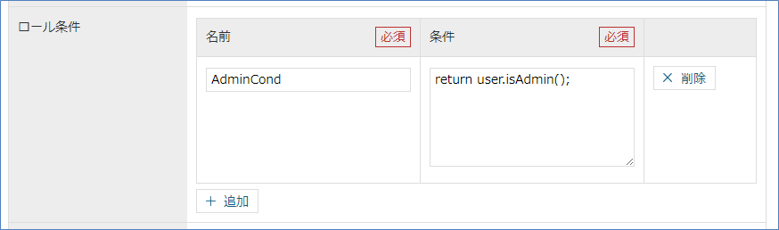
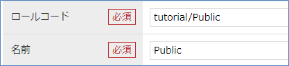
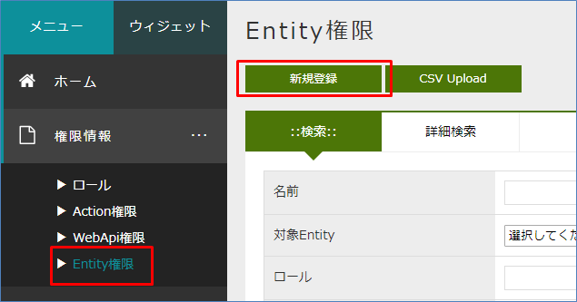
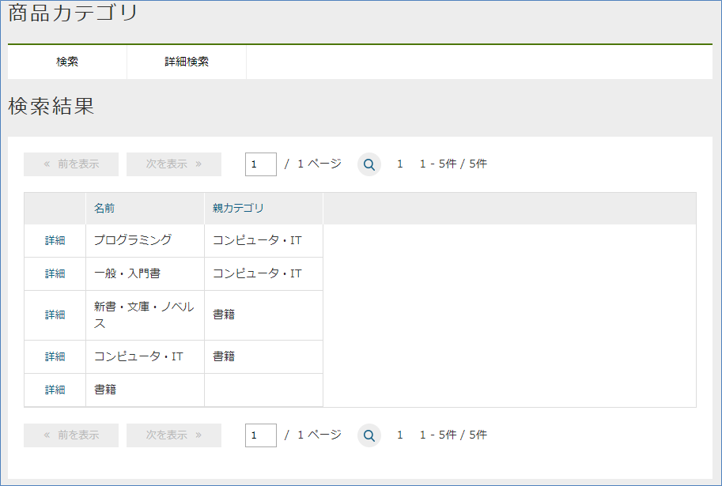
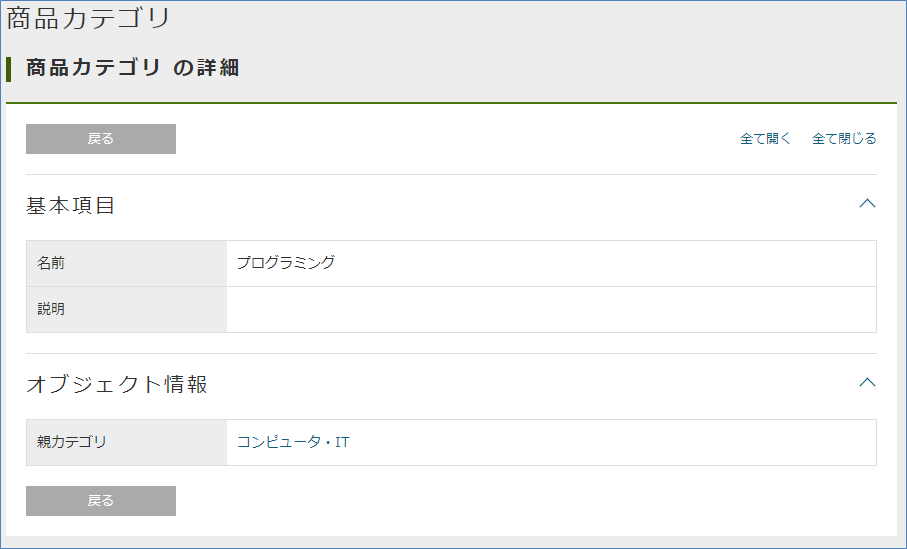
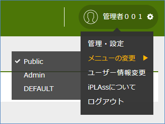

[[usermanagement]]
== ユーザー管理

[[usermanagement_regist]]
=== ユーザーの登録

[[usermanagement_user]]
==== User Entity
iPLAss基盤ではユーザー情報を管理するためのEntityとして `User` Entity（mtp.auth.User）を利用します。
ここではデフォルトで定義されている `User` EntityのPropertyについて説明します。

[[usermanagement_property]]
===== Property
AdminConsoleから `User` Entityの編集画面を表示してください。

以下ポイントのみ説明します。

.accountId（ユーザーID）
Entityの共通Propertyである `oid` とは別に、ユーザーIDとしてのPropertyを持っています。
通常、ユーザーIDは規則性があったり、自身で決めさせたり、OIDなどのように自動的に採番するものではないことが多いためです
（EntityとしてのKEYはあくまでもoidです。ただしoidをこのアカウントIDに設定することも可能です）。

.firstName、lastName
ユーザーの名前については、lastNameのみ必須となります。

（参考） `name` Propertyについて +
Entityの共通Propertyである `name` （必須Property）には、 `User` Entityのデータ登録・変更時に、EntityのEventListenerという機能を利用して値が自動的に値が設定されます
（EntityEventListenerについては説明していませんので、無視いただいて構いません）。
その際、Tenantメタデータのロケールが `en` の場合は、 `firstName lastName` 、それ以外の場合は、 `lastName firstName` として値が設定されます。

.mail
メールアドレスは任意の入力項目ですが、アカウントポリシーの設定でユーザー登録時にパスワードを自動生成する場合、パスワードを通知するのに必要になります。
ユーザー登録時にパスワードを任意で設定する場合には必要ありませんが、管理者によるパスワードリセット時には通知のために必要になるため、アプリケーションにあわせて設定を変更してください。 +
なお、チュートリアルを実施する際は、メールアドレスは可能な限り設定するようにしてください。

.admin
システム管理者ユーザーの場合、このPropertyがtrueである必要があります。

またAdminConsoleを利用できるのは、システム管理者のみとなっています。
テナント作成時に通知されるシステム管理ユーザーはこの値がtrueです。

.group、rank
ユーザーをグループやランクで管理するためのPropertyです。
デフォルトとして `Group` Entity、 `Rank` Entityも提供されています。
ユーザーに適用する `Role` の条件などに利用します。

.accountPolicy
そのユーザーが認証時に利用する認証ポリシーです。
管理者ユーザー、もしくはユーザー管理者ロールを持つユーザーのみ変更できます。

[[usermanagement_regist_user]]
==== ユーザーの登録

[[usermanagement_flow]]
===== ユーザーの登録フロー
ユーザーの登録は User Entityの登録画面から行います。
ユーザーのパスワードは、 Userの登録時にiPLAssが自動で生成し、メールを利用してユーザーに通知されます。
ユーザーは初回ログイン時にパスワードを変更する画面が表示されるので、そこで自身のパスワードを設定するという流れになります。

[[usermanagement_mailsetting]]
===== 開発環境の送信メールの確認用設定
設定されたパスワードはメールでユーザーに通知するのでメールサーバが必要となるのですが、開発段階やチュートリアルなどの実施段階ではメールサーバがない状態が多いと思います。
もしメールサーバがない場合は、iPLAssで提供している送信メールの確認用デバッグアプリを利用してパスワードを確認することができます。

このデバッグアプリを利用する場合は、 `src/main/resources` に格納されている `mtp-service-config.xml` を編集します。

`mtp-service-config.xml` 内の `MailService` の設定に `listener` というプロパティがコメントとして記載されていると思います。

[source, xml]
----
<!-- Mail Service Settings -->
<service>
	<interface>org.iplass.mtp.impl.mail.MailService</interface>

	・・・・・

	<!-- ■ for develop only (additional="true) ■ -->
	<!-- 送信メールをデバッグ出力する場合、以下を有効にしてください。 -->
	<!--
	<property name="listener" class="org.iplass.mtp.mail.listeners.LoggingSendMailListener" additional="true"/>
	-->
</service>

・・・・・
----

送信メールを確認する方法としてメールの内容をログに出力するクラスを提供しています。
今回はローカルPC上でEclipseからTomcatを利用していると想定して、このデバッグ機能を有効にします。（コメントを外してください）

[source, xml]
----
    <!-- ■ for develop only (additional="true) ■ -->
	<!-- 送信メールをデバッグ出力する場合、以下を有効にしてください。 -->
	
	<property name="listener" class="org.iplass.mtp.mail.listeners.LoggingSendMailListener" additional="true"/>
----

これでサーバーを再起動することで、送信されるメールが確認できるようになります。
また、 `SendMailListener` インターフェースを実装することで、独自の処理を組み込むこともできます。

TIP: ログ出力について、セキュリティの関係上、本番環境や検証環境など、無効にするよう注意してください
（あくまでも開発環境用のツールとして利用してください）。

[[usermanagement_regist_user_ope]]
===== ユーザーの登録操作
実際にユーザーを登録してみましょう。
ユーザーの登録は `基本情報` － `ユーザー情報` メニューから行います。
検索画面が表示されるので、 `新規登録` ボタンをクリックしてください。

image::images/usermanage_createnew.png[]

`User` Entityに設定されているPropertyの入力画面が表示されるのでユーザー情報を入力します。

[options="header"]
|===
|項目|設定値
|ユーザーID|user001
|姓|ユーザー００１
|メールアドレス|user001@test.jp
|所属グループ|GemUser
|アカウントポリシー|標準
|===

入力したら `登録` ボタンをクリックしてください。
登録されると詳細画面に遷移します。

また、ログ出力用のlistenerを有効にしたことにより、Eclipseのコンソールにメールの内容が出力されます。

====
11:13:33.151 [http-nio-8080-exec-4] DEBUG 16 542 gem/generic/detail/InsertCommand  o.i.m.m.l.LoggingSendMailListener -   From:test@contract.dentsusoken.com ReplyTo:test@contract.dentsusoken.com To:(1)user001@test.jp; Cc:(0) Bcc:(0) Subject:【SampleTenant】ユーザー登録のお知らせ FileName: PlainMessage:ユーザー００１様  SampleTenantに「ユーザー００１」様のユーザー登録が行われました。  ユーザーIDと仮パスワードが発行されましたので、下記URLからSampleTenantにアクセスし、 パスワードの登録作業を実施して下さい。     URL: XXXXXXXX    ユーザーID: user001    ユーザー名: ユーザー００１    仮パスワード: k,3s6#HV  ===================================================================== □ 本メールにお心当たりが無い方へ  本メールは、SampleTenantにてユーザー登録を頂いたお客様にお送りしています。 このメールにお心当たりのない場合は、お手数ですが下記、アドレス (送信元アドレス)までご連絡下さい。    SampleTenant事務局    test@contract.dentsusoken.com =====================================================================  送信元：株式会社 電通総研 COPYRIGHT 2011 DENTSU SOKEN INC. ALL RIGHTS RESERVED. HtmlMessage: 
====

タイトルの先頭にはテナント名（それぞれのテナントで異なる）が付加されます。
タイトル及びメール内容はMailTemplateというメタデータで変更可能です。

改行を無視した形で出力されるため少し見辛いですが、メール本文に `仮パスワード` が記載されています。
これを利用して初回ログインを行います。

[[usermanagement_initiallogin]]
===== 初回ログイン
早速新しいユーザーでログインしましょう。
まずは今ログインしているユーザーをログアウトしてください。

新しいユーザー `user001` でログインしてみます。

パスワード変更画面が表示されるので、パスワードを設定します。

変更後、ログインが行われTop画面が表示されます。

もしこのタイミングでエラーのダイアログが表示された場合、ここまでに作成した各Entityの<<save_defaultlayout, 画面定義を作成>>してください。
作成後に再度ログインを行い、エラーが解消されることを確認してください。

image::images/usermanage_user001error.png[]

ここで作成したユーザーは管理者ユーザーではないため、 `管理・設定` メニュー（AdminConsole遷移）が表示されません。

[[usermanagement_regist_admin]]
==== 管理ユーザーの登録
デフォルトの状態では管理者ユーザーが登録できません。
`Top画面のカスタマイズ` の `UserMaintenance` アイテムの説明で少し触れましたが、 `User` Entityには３つのViewが定義されています。

[cols="1,3,^1,^1", options="header"]
|===
|View|名利用用途|DetailLayout|SearchLayout
|default|一般ユーザーの登録用（管理者設定なし）|○|○
|admin|管理者を含むユーザーの登録用（システム管理者向け）|○|○
|maintenance|ユーザー自身のメンテナンス用（TopView用）|○|×
|===

このうち `maintenance` ViewはTopViewの `UserMaintenance` アイテムのためのViewとして提供しているため、 `SearchLayout` が提供されていません。
汎用の検索画面、詳細画面の遷移で利用するViewはDetailLayoutとSearchLayoutで同じ名前のViewのセットが必要なので、ここでは利用できません。 +
`UserMaintenance` についての詳しい説明を知りたい方は、link:https://iplass.org/docs/developerguide/genericentitymanager/topview/index.html#usermaintenance[User Maintenance^]を参照してください。

管理者ユーザーを作成したい場合は、 `admin` Viewを利用することで、管理者フラグを設定できるようになります。

ここではMenuメタデータとして登録されている `DEFAULT` に存在する `ユーザー情報` EntityMenuItemに対して `admin` Viewを指定し、管理者の登録ができるようにしてみます。

[[usermanagement_menusetting]]
===== 設定
管理者ユーザーでログインしなおし、`DEFAULT` Menuの編集画面を表示してください。

image::images/usermanage_menu-default.png[]

`standard_node` の中にある `mtp/auth/User` を右クリックし、「メニューアイテムを開く」を選択してください。

ViewNameを設定します。

[options="header"]
|===
|項目|設定値
|ViewName|admin
|===

保存して、汎用画面のTop画面にある `ユーザー情報` メニューからユーザーを登録してみましょう。

[[usermanagement_confirm]]
===== 確認
汎用画面のTop画面にある `ホーム` をクリックして再描画後、ユーザーの新規登録画面まで進んでください。

画面に `管理者設定` の入力部分が表示されます。
管理者ユーザーを登録しましょう。

image::images/usermanage_useredit-admin2.png[]

[options="header"]
|===
|ユーザーID|admin001
|姓|管理者００１
|メールアドレス|admin001@test.jp
|所属グループ|AppAdmin
|アカウントポリシー|標準
|管理者|有効
|===

登録すると、先ほど同様メールが送信されます。新しいユーザーでログインしてみてください。

image::images/usermanage_login-admin.png[]

ユーザーメニューを確認すると、 `管理・設定` メニューが表示されています。

ここではユーザーの登録手順を説明しました。
次はユーザーの権限を制御するためのロール定義について説明します。

[[role_securitycontrol]]
=== ロールによる権限制御
[[role_rolebase_securitycontrol]]
==== ロールベースの権限制御
iPLAss基盤 では、ロールベースでユーザー権限を制御する機能が組み込まれています。

ロールは `Role` Entity（mtp.auth.Role）で表現され、対象とするユーザーを条件として指定します。
対象ユーザーを絞り込む条件として、 `User` Entityに定義されているProperty（管理者フラグや `group` や `rank` といったもの）を指定することも可能です。

作成されたロールに対して、それぞれのEntityに対する参照・更新などの権限、Actionの実行権限、WebApiの実行権限、Workflowの実行権限などを設定します
（これらもEntityで表現されます）。

ここでは実際にロールの作成を行います。
そして権限設定の中の `Entity権限` について実際に設定を行い、汎用画面の動作を確認します。

またMenu、TopViewメタデータとロールを対応させる方法についても説明します。

[[role_initialrole]]
==== 初期ロールと付与権限
テナントを作成した時点で `AppAdmin` ロール（アプリケーション管理者ロール）と `GemUser` ロール（Gemユーザーロール）が作成されています。
それぞれ所属するグループを条件としており、先ほど作成した2つのユーザーにはそれぞれのロールが割り当てられています。

`AppAdmin` ロールは `GemUser` ロールよりも権限が強くなっています。
また `AppAdmin` よりも強い権限を持つ `管理者（開発者）` がいます。
`管理者（開発者）` はロールではありませんが、管理者フラグが有効になったユーザーが `管理者（開発者）` に該当し（テナント作成時の初期ユーザー等）、全ての操作に対する権限を有しています。

これら２つのロールに設定されている権限の詳細については、 <<../../developerguide/genericentitymanager/gemauth/index.adoc#, GEM権限制御>> を参照してください。

[[role_createrole]]
==== ロールの作成
実際にロールを作成してみましょう。
ロールの作成は、汎用画面に表示される `ロール` Entityの登録画面から行います。
デフォルトのメニュー定義では、 `権限情報` － `ロール` メニューから行います。
検索画面が表示されるので、 `新規登録` ボタンをクリックしてください。

今回は `管理者` ロールと `一般ユーザー` ロールを作成します。
判断の方法は `User` Entityの `admin` Propertyを利用します。

[[role_createadminrole]]
===== 管理者ロールの作成
まずは `管理者` ロールを作成します。

ロールの登録画面を参照するとロールコードと名前（ロール名）が必須となっています。
この２つの命名については考慮する点があるので説明します。

.ロールコード
ロールはMenuメタデータとTopViewメタデータと連携することができます。
連携はユーザーが属するロールに対して、そのロールコードと同じnameのMenuメタデータとTopViewメタデータが登録されているかで判断されます。
ロールコードと同じnameのMenuメタデータとTopViewメタデータが存在すると、そのメタデータに定義されているTop画面が表示されます（後ほど確認します）。

MenuメタデータとTopViewメタデータのnameになることを意識して、メタデータを階層化するための `/` を利用してロールコードを定義すると整理がしやすいです。

.名前（ロール名）
ロールの条件によって、ユーザーは複数のロールに該当することが可能になります。
iPLAss基盤ではログインしたユーザーが複数のロールに属している場合で、かつ、それぞれのMenuメタデータとTopViewメタデータが登録されている場合に、Top画面のツールバー上にTop画面を選択するメニューが表示されます。

ここで表示されるのがロール名になります。

ここでは管理者ロールとして以下のロールを作成します。

[options="header"]
|===
|項目|設定値
|ロールコード|tutorial/Admin
|名前|Admin
|===

優先順位は飛ばして、ロール条件を追加します。
`追加` ボタンをクリックしてください。
`名前` と `条件` を入力するエリアが表示されます。

名前については開発メンテナンス用のものなので、わかりやすい名前を付けてください。
条件について説明します。

[[role_rolecondition]]
===== ロール条件の条件文（GroovyScript）
ロール条件文はGroovyScriptというScript言語の文法を利用して文を設定することができます。
この条件文（Script）では、対象となるユーザーがこのロールに該当するかどうかをtrue/falseで返す必要があります。
この条件文用のScriptに対しては、 `user` というバインド変数で対象となるユーザーの情報が渡されます。
この `user` 情報を利用して、ロールに該当するかどうかを判別するScriptを定義します。

userとしてバインドされる変数には以下のようなメソッドが用意されています。

[cols="2,3",options="header"]
|===
|メソッド|内容
|boolean isAdmin()|ユーザーが管理者かどうかを返します。
|boolean memberOf(String groupCode)|指定されたグループコードに該当するグループにユーザーが含まれているかを判定します。
またこのメソッドでは親階層のグループコードも含めて判定を行います
（グループは階層構造にすることが可能なため）。
|Object getAttribute(String name)|ユーザーEntityのProperty値を返します。
戻り値の型は各Propertyによって異なります。
|String[] getGroupCodeWithChildren()|ユーザーにGroupが設定されている場合のグループコードを返します。
またこのメソッドでは設定されたグループの子階層のグループコードも含めて返します
（階層構造にすることが可能なため）。
|String[] getGroupCodeWithParents()|ユーザーにGroupが設定されている場合のグループコードを返します。
またこのメソッドでは設定されたグループの親階層のグループコードも含めて返します
（階層構造にすることが可能なため）。
|===

少々難易度が高い感じがしますが、さほど難しくありません。
いくつか例を確認します。

[[role_judgeadmin]]
==== 管理者かどうかを判定する
管理者かどうかの判定は `User` Entityの `admin` Propertyです。
条件文にバインドされている `user` 変数を利用することで以下のように判定することができます。

.管理者かどうかを判定
[source, groovy]
----
return user.isAdmin();

//user.isAdmin();  //return も省略可。これはGroovyScriptでは最後のロジックが戻り値として解釈されるため。
----

.グループコード `Group001` に含まれるかを判定
[source, groovy]
----
return user.memberOf("Group001");
----

.ランクが `3` 以上かを判定
[source, groovy]
----
return user.rank.level >= 3;   // `User` Entityの `rank` Property(RankEntity)の `level` Propertyを参照
----

このようにUser Entityをベースにした単純な判定ロジックを組むこともできますし、例えば別のEntityを用意して、EntityManagerというクラスを利用した複雑な判定ロジックを組むことも可能です
（この条件文として設定するScriptとしては、戻り値がtrueかfalseかが必要なだけです）。

今回の場合、管理者かどうかを判定したいので一つ目の例と同じ内容で問題ありません。

[options="header"]
|===
|項目|設定値
|名前|AdminCond
|条件|return user.isAdmin();
|===

この状態でロールを登録します。
同様に管理者以外のロールを作成してみます。

[options="header"]
|===
|項目|設定値
|ロールコード|tutorial/Public
|名前|Public
|===

[options="header"]
|===
|項目|設定値
|名前|PublicCond
|条件|return !user.isAdmin();
|===

[[role_createentitypermission]]
==== Entity権限の作成
ここではEntityに対して、ロールごとに参照や更新の権限を設定してみます。
Entity権限の作成は `Entity権限` Entityの登録画面から行います。
デフォルトのメニュー定義では、 `権限情報` － `Entity権限` メニューから行います。
検索画面が表示されるので、 `新規登録` ボタンをクリックしてください。

今回は `商品カテゴリ` Entityに対して、管理者のみ登録可能に、一般ユーザーには参照のみ可能にしてみます。

[[role_publicsetting]]
===== 一般ユーザー向けの設定
Entity権限の登録画面は、 `権限の対象` を設定する部分と参照や更新などの `権限` を設定する部分に分かれます。

まずは対象を設定します。

[options="header"]
|===
|項目|設定値
|名前|ProductCategoryPermitionPublic
|対象Entity|商品カテゴリ
|ロール|Public
|===

次に参照権限を設定します。
一般ユーザーにも参照は可能にしたいため、 `許可` を選択します。

権限にはレコード単位で絞りこむための `参照可能範囲条件` や、プロパティを絞り込むための `参照プロパティの制御`  `参照プロパティのリスト` という項目もあります。
今回はあくまで `商品カテゴリ` Entityという単位でのみ設定するので、設定しないで構いません。

登録権限、更新権限、削除権限はそれぞれ `不許可` に設定してください。

この状態で登録してください。

[[role_confirm_entitypermission]]
==== Entity権限による汎用画面の確認
`商品カテゴリ` Entityに対するEntity権限の設定によって、汎用画面に違いが現れます。
それを確認します。

事前準備として、`商品` Entity、 `商品カテゴリ` Entity、`プロパティ確認用` EntityのDetailLayoutとSearchLayoutを作成しておきます。
それぞれ編集画面を表示し、 `標準ロード` を実行した後 `保存` しておいてください。

管理者でないユーザーでログインしてください
（ `ユーザー登録` のチュートリアルを実施している場合は `user001` が存在すると思います）。

[[role_top]]
===== Top画面
Top画面は変更点は見つからないと思います。

[[role_searchview]]
===== 検索画面
`商品情報` － `商品カテゴリ` メニューをクリックして、検索画面を表示してみてください。

一覧上、検索も実行してみてください。

管理者ユーザーでない場合、データの参照権限は許可していますが、登録や変更などの権限は不許可にしました。
その結果、以下の変更が起こっています。

*  `新規登録` 、 `CSV Upload` 、 `ゴミ箱を表示` ボタンが表示されなくなった。
* 一覧の `編集` リンクが表示されなくなった。
* 一覧の削除対象選択用チェックボックスと `削除` ボタンが表示されなくなった。

.（参考）管理者の検索結果画面

このようにEntity権限の設定状況によって利用できる機能が変わります。

[[role_detailview]]
===== 詳細画面
続けて `詳細` リンクをクリックして、詳細画面を表示してください。
詳細画面でも変更が起こっています。
`ロック` 、 `編集` 、 `コピー` ボタンが表示されなくなっています。

.（参考）管理者の詳細画面

[[role_referenceview]]
===== 参照画面
続けて、 `商品登録` メニューをクリックしてみてください。
以前は `商品` Entityは `商品カテゴリ` Entityを選択・追加することができていました。

`商品` Entityに対しては、特にEntity権限を設定していませんので、登録などは実行することが可能です。

`商品` Entityの登録画面でも、商品カテゴリの選択部分で変更が起こっています。

.（参考）管理者の商品カテゴリ選択部分

このようにEntity権限を設定するだけで、汎用画面は権限に応じて機能がコントロールされます。

[[role_noneentitypermission]]
==== Entityの参照権限がない場合の挙動
今までは `商品カテゴリ` Entityに対して、参照権限のみ許可していました。
今回は参照権限がないEntityに対しての挙動を確認したいので、この参照権限も不許可にしてみましょう。

今一度、管理者ユーザーで `商品カテゴリ` Entityに対するEntity権限の編集画面を表示します。
`Entity権限` のメニュー ＞ 検索画面 ＞ 検索実行 ＞  `ProductCategoryPermitionPublic` の編集リンク ＞ 編集画面 という手順で編集画面を開いて見てください
（今のところ管理者ユーザーでも一般ユーザーでも実行できます）。

編集画面が開いたら、参照権限を `不許可` に変更して保存してください。

保存したら、管理者以外のユーザーで再度ログインしてTop画面を見てください
（管理者以外のユーザーで作業していた場合はログインし直す必要はありません）。

左のメニューから `商品カテゴリ` に関するメニューが消えます。

.（参考）管理者の商品カテゴリメニュー

またTopViewに配置した商品カテゴリのSearchResultListを見てください。
`商品カテゴリ` が表示されていません。

.（参考）管理者の商品検索結果一覧

左の `検索画面を表示する` リンクで表示される（または `商品` メニューで表示する）、通常の検索画面の結果一覧も同様に表示されなくなります。

このように、EntityMenuItemを利用して登録されたメニューや、検索結果画面、確認しませんでしたが編集画面についても、Entityの参照権限を参照して表示／非表示が自動的に設定されます。

確認が終わったので、 `商品カテゴリ` Entityに対する参照権限を許可に戻しておいてください。

[[role_menu_top_linkage]]
==== ロールとMenu、TopViewの連携
今まではロールに対してEntity権限などを設定すると、表示している各部品内で権限を判定してボタンやリンクなどの表示／非表示をコントロールしているのを確認してきました。

また権限制御とは別に、`ユーザーごとにTop画面に表示するメニューやパーツを切り替えたい` という場合のため、TopViewとMenuをロールに紐づける機能があります
（現在提供している機能は `ユーザーごと` ではなく、あくまで `ロールごと` です）。

ここではロールとMenu、TopViewの連携について説明します。

[[role_linkagesetting]]
===== 連携方法
連携方法は簡単です。
ロール作成時に登録した `ロールコード` と同じ名前の `Menu` メタデータ、 `TopView` メタデータを作成すればいいだけです。
そうすることで、対象ユーザーが属する `ロール` に該当するTop画面が表示されます。

実際に作成して確認してみます。

[[role_createmenu]]
===== Menuの作成
これまでに、ロールとして `tutorial/Public` と `tutorial/Admin` の２つを作成しました。
まずは、 `tutorial/Public` に対するMenuを作成しましょう。

AdminConsole画面を開いて、Menuのメタデータを展開し `DEFAULT` を表示します。
この `DEFAULT` メニューをコピーして作成してみます。

名前をロールコードと同じ `tutorial/Public` に変更して保存します。

[options="header"]
|===
|項目|設定値
|Name|tutorial/Public
|Display Name|一般ユーザー用メニュー
|===

作成されたMenuをダブルクリックして編集画面を表示しましょう。

今回は一般ユーザーなので `permission_node` や `standard_node` は消しましょう。
また `tutorial/product/ProductNode` から商品カテゴリ系のメニューも消します。
下のような状態で保存してください。

この時点で、管理者以外のユーザーで再度ログインしてTop画面を見てください。

メニューが変わっていると思います。
それと同時にTopViewのパーツが表示されなくなりました。
これは対象となる `ロール` と一致するMenuメタデータがあった場合、同じ名前のTopViewメタデータを表示するように制御されているためです。

TopViewにも同じ `tutorial/Public` を作成します。

[[role_createtopview]]
===== TopViewの作成
こちらもすでに登録されている `DEFAULT` をコピーしましょう。

[options="header"]
|===
|項目|設定値
|Name|tutorial/Public
|Display Name|一般ユーザー用Top画面定義
|===

編集画面を開きます。

`Top画面のカスタマイズ` で `User Maintenance` を追加し、Viewに `maintenance` が指定されている状態になっています。
これによって、Top画面の `ユーザー情報変更` 画面には名前やメールアドレスが変更できるようになっています。

今回は `User Maintenance` を削除して、それぞれのユーザーがパスワードのみ変更できるようにしてみましょう。

この `User Maintenance` パーツをTopViewから削除することで、上段のパスワードのみが変更可能になります。

下のような状態で保存してください。

この時点で、管理者以外のユーザーで再度ログインしてTop画面を見てください。
パーツが表示されるようになります。

続けて `ユーザー情報変更` をクリックしてみてください。
パスワードのみ変更可能になりました。

このようにロールに対してMenuやTopViewを定義することで、ロールごとの画面を作成することができます。

.（参考）EntityMenuItemのParameter
EntityMenuItemのParameterとして `viewName=View名` を指定することで検索画面や詳細画面のレイアウトを指定することが可能でした。
今回Menuをロールごとに作成することで、そのロールで表示させたいView定義を指定することができるようになりました。
それぞれのロールごとに表示する画面のレイアウトをViewとして定義しておけば、EntityMenuItemのParameterでスイッチが可能になります。

[[role_foradmin]]
===== 管理者について
今まで一般ユーザー向けのロール `tutorial/Public` に対して、MenuとTopViewを作成しました。
管理者向けのロール `tutorial/Admin` に対してはまだなにも作成していません。

今の状態で管理者でログインするとTop画面は `Public` のTop画面が表示されます
（権限情報や基本情報などは表示されません）。

これは、管理者（User Entityのadmin=true）は全てのロールに対する設定を表示可能と判断し、全部のMenu/TopView定義を参照することができるためです。
また `DEFAULT` として定義されているMenu/TopView定義は一番優先度が低いため、 `Public` として登録されている画面が初期状態で表示されます。

今回の管理者のように複数の画面定義が存在する場合は、画面上部のツールバー上に `メニューの変更` メニューが表示されます。
これで画面定義を切り替えてください。

管理者が毎回Public画面から始まるのは面倒な場合、 `tutorial/Admin` に対するMenu、TopViewを作成することで回避できます。

この状態の場合、以下の優先度で初期画面が決定されます。

* Menu定義の表示順序の昇順
*  `Role`  Entityの優先度の降順（未指定の場合は0）
* 同一優先度の場合は、 `Role`  Entityの名前の昇順

この順番でソートされ、先頭のRoleに該当する画面が初期選択されます。

今回の場合、Menu定義の表示順序や `Role` Entityに対して優先度を指定しなくても、名前が `Admin` と `Public` なのでAdminが優先されますが、優先度を指定することで名前に依存しないように設定できます。

それぞれのメニュー定義に優先度を設定しておきましょう。

.変更前

.変更後
image::images/role_priority.png[]

仮にPublicの優先度をAdminよりも高くした場合は、初期選択として `Public` が選択されます。

ここではロールの作成と、ロールに対するEntity権限の設定、その設定に対する画面動作の確認を行いました。
またMenuやTopViewを利用してロールごとに別レイアウトを定義できることを確認しました。
