:table-caption!:
= Install and Run
:_relative-root-path: ../../

[[Introduction]]
== Preface

This document shows the steps to run iPLAss on windows environment. +
For this guide, 「Apache Tomcat」 is required as the application server, and 「MySQL」 is used as our DBMS. +

[NOTE]
====
iPLAss installer（war）itself is modified to fit with Apache Tomcat, however iPLAss is integrable with other OS/DBMS (require database configuration to fit with iPLAss environment).
====

== Prerequisite

This guide was made under the following conditions:

- Windows environment

== Environment Construction
. Install OpenJDK
.. Download the Amazon Corretto 21 installer from Amazon Corretto https://aws.amazon.com/corretto/[DownloadSite].
+
[source]
----
Download the "amazon-corretto-21-x64-windows-jdk.msi"
----

.. Install the downloaded installer to any folder.

. Install Apache Tomcat (abbreviated as Tomcat) 
.. Download the Tomcat10.1 installer from Tomcat https://tomcat.apache.org/download-10.cgi[DownloadSite].
+
[source]
----
Download the "32-bit/64-bit Windows Service Installer" from the Core session 
----

.. Unzip/install the downloaded installer to any folder.

. Install MySQL
.. From MySQL https://dev.mysql.com/downloads/mysql/[DownloadSite] , download MySQL Community Server (8.0 or above) installer.
+
[source]
----
Download the "Windows (x86, 32 & 64-bit), MySQL Installer MSI"
----
TIP: This procedure was created by installing version 8.0.33. +
If you use another version, some procedures and item names may be different, so please configure the settings appropriately according to the environment you want to use. +

.. Install the downloaded installer to any folder. +
Please choose the following settings while installing.
+
[source]
----
Setup Type = Server only
Type and Networking:ConfigType = Dedicated Computer
----

.. Configure MySQL (my.ini or my.cnf)
+
Change or add settings as shown in the example below.
+
TIP: Please edit my.ini associated with the database (for Windows, my.ini located under the default C:\ProgramData\MySQL) +
Before setting the time zone, please import the time zone. +
For more details about importing timezone, please refer to Mysql timezone's  https://dev.mysql.com/downloads/timezones.html[DownloadSite] .
+
[source]
----
　　[client]
　　default-character-set=utf8mb4

　　[mysql]
　　default-character-set=utf8mb4

　　[mysqld]
　　character-set-server=utf8mb4
　　max_allowed_packet=100M
　　transaction-isolation=READ-COMMITTED
　　query_cache_size=0 <1>
　　innodb_file_format=Barracuda <2>
　　innodb_file_per_table=1
　　innodb_large_prefix=1 <2>
　　internal_tmp_disk_storage_engine=MyISAM <3>
　　default-time-zone='Asia/Tokyo' <4>
　　#default-time-zone=+9:00 <5>
----
<1> Not required for MySQL 8.0.1 or higher.
<2> Not required for MySQL 5.7.7 or higher.
<3> Not required for MySQL 8.0.16 or higher.
<4> Required for Connector/J 8.0 or higher. +
Please change the timezone depending on the working system environment. 
It is required to import timezone beforehand. +
<5> If it is difficult to import the time zone, please use this to set the time zone.

+
For items other than 1 to 5, check my.ini and add them if they are not set. +
Once the file is modified, restart the MySQL Server.

+
IMPORTANT: iPLAss 3.2.14 or earlier requires `lower_case_table_names=1` in the `mysqld` section.

+
 

+
TIP: In the case that MySQL binary log is enabled, there could be errors during the process of function generation.  +
To deal with it, please enable the log_bin_trust_function_creators.

. Install MySQL JDBC driver
.. Download Connector/J (GA) from MySQL's https://dev.mysql.com/downloads/connector/j/[DownloadSite] .
+
[source]
----
Download "Platform Independent (Architecture Independent), ZIP Archive"
----

.. Install the downloaded installer to any folder. 

.. Then copy the JDBC driver files (mysql-connector-j-8.0.33.jar) from the unzipped folder to Tomcat's directory which we just installed in previous steps.
+
[source]
----
%CATALINA_HOME%\lib
----
※「CATALINA_HOME」is referring to the directory of where the Tomcat was installed.
+
TIP: If Tomcat is currently running, restart Tomcat after copying the JDBC driver files.

. Preparing the Database +
Since the iPLAss installer will create the database and user information, there is no action needed here.

. iPLAss home directory (optional) +
The home directory contains the installer's configuration information. +
Environment variable「IPLASS_HOME」shell be set to the iPLAss home directory. +
By default the iPLAss directory are in the following position:
+
[source]
----
%USERPROFILE%\.iplass
----
+
TIP: If you wish to reset the installer and perform the installation again, delete the iPLAss home directory.
+
TIP: In a Windows environment, when Tomcat is started as a service, the home directory is as follows. +
`C:\Windows\ServiceProfiles\LocalService\.iplass`

. Configuring the Logs (optional) +
Logging can be configured by placing the log configuration file in the iPLAss home directory.
+

Setting details::
The settings for outputting logs to the console are shown below. 
Please refer to this to create a logback.xml file in your home directory and customize it as appropriate.

+
[source,xml]
----
<?xml version="1.0" encoding="UTF-8" ?>
<!DOCTYPE configuration>
<configuration>
	<appender name="STDOUT" class="ch.qos.logback.core.ConsoleAppender"> <1>
		<encoder>
			<pattern>%d{HH:mm:ss.SSS} [%thread] %-5level %logger{36} - %msg%n</pattern>
		</encoder>
	</appender>

	<root level="debug"> <2>
		<appender-ref ref="STDOUT" />
	</root>
</configuration>
----
<1> The appender element defines where to output and in what layout.
<2> Simply defining appender will not use it when outputting logs. It is first used when referenced by the logger element or root element.

+
Log Setting File::
Place the log setting file for logback. The setting files are loaded in the following order.
1. Try to locate logback-test.xml file.
2. If file not found, then it will try to get logback.xml file.

== Installing iPLAss
. Acquiring the installer (iplass.war)
+
If the user does not have the installer files yet, please get the installer via the methods listed below.

.. Download the installer from our https://iplass.org/en/downloads/[DownloadSite]

.. （in the case of Enterprise Edition）Please find the 「iplass.war」 from our Enterprise Edition's DownloadSite.

. Deploy iplass.war into Tomcat
.. Copy-paste the「iplass.war」into the following directory of Tomcat.
+
[source]
----
%CATALINA_HOME%\webapps
----
+
If Tomcat was not started, please start Tomcat after placing the WAR file. +
If Tomcat is running, it will initialize the deployment automatically after placing the WAR file.

. Show the setup interface screen.
.. Input the following URL to web browser to access the setup interface screen. +
The URL for iPLAss setup interface is as follows: +
+
[source,url]
----
http://localhost:8080/iplass
----
+
or
+
[source,url]
----
http://＜ServerHostName_OR_IPaddress＞:8080/iplass
----
※If you have configured the Tomcat's port number, then use the configured port number.

. Executing the setup process of iPLAss
.. Input the setup information
... Input the information to access Database.
+
On iPLAss setup interface's screen, input the information following the essential points listed below.
+
[cols="1,4",options="autowidth"]
|===
|Database|Use `MySQL`
|DBA User Name|Enter the username of a user with MySQL's DBA privilege(Root user name created when installing MySQL)
|DBA Password|Enter the password of the above user(the above root user's password)
|Binary data file store location|Directory of where the binary data should be stored at. +
For MySQL and PostgreSQL, Binary typed data are supposed to be stored externally respecting the standard. For Oracle and SQLServer, they store the binary data externally only when configured.

|Automatic table creation
|[red]#*Be sure to check this box if you are setting up a new setup.*# +
If checked, the table will be created for use in iPLAss. +
If the table already exists, it will be recreated and the data will be initialized. +
Uncheck this checkbox if you wish to keep the existing data, e.g., for re-setup.

|JDBC URL|Should be filled automatically hostname and portnumbers (see the rows below) are inputted. +
If you need to manually change the URl, please check the `Edit`.
|Host Name|The hostname or ip address of where the MySQL was installed.
|Port Number|3306 (by default) +
※If you have manually configured the port number, please use the configured port number
|Schema Name|mtdb (unchangeable)
|User Name|Any created mysql username
|Password|The password for above user.
|===
+
TIP: If setup fails, you may need to reinstall iPLAss. +
After deleting the iPLAss home directory set in the previous chapter, perform the installation procedure again.

... iPLAss Input The Tenant Information.
+
[cols="1,2",options="autowidth"]
|===
|Tenant Name|Any name decided by the developer.（recommended to use half width keyboard input method）
|Administrator User ID|Any ID decided by the developer
|Administrator Password|Any acceptable password decided by user +
※If you need to see the password, check[View Password]
|===
+
.About the Manager ID and password
TIP: UserId should be over 4 characters long and can be composed only by English characters, numbers, and the specific special character of `-` , `@` , `\_` , `.` +
Password should be over 6 characters long and only be composed by English characters, numbers, and the following special character: `~!#\\$^&*+;:?/|{}\\.=_,-` .
+
*iPLAss Setup Interface Screen*
+
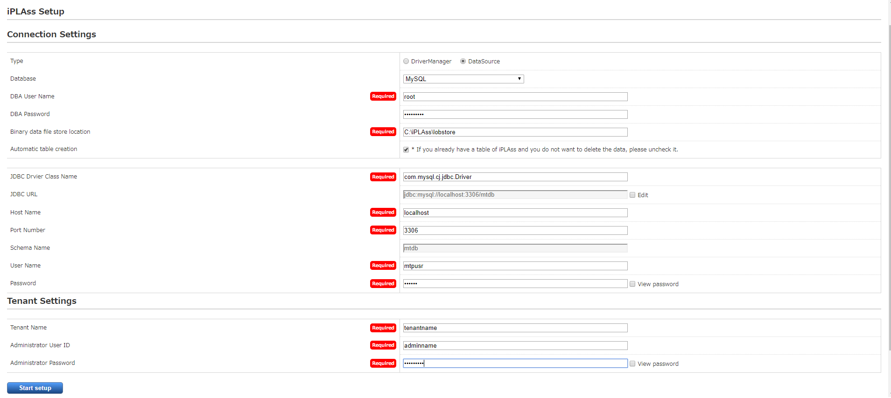

.. Start the setup process +
After inputting the setup information, please click the 'Start setup' button to begin the setup process. +
If the setup finished normally, the message of「[red]#*please restart the application server*#」will be presented.
+
*The Message when Finished Normally*
+
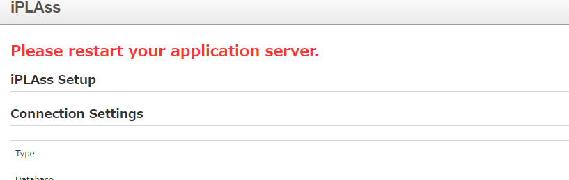

. Restarting the application server (Tomcat)
.. Just restart the application server (Tomcat)

. Access the tenant
.. Input the following URL to web browser in order to access the tenant.
+
[source,url]
----
http://localhost:8080/iplass
----
+
or 
+
[source,url]
----
http://＜Serverhost_or_IPaddress＞:8080/iplass
----
※If you have manually configured the port number of Tomcat, please use the configured port number

.. Show the tenant login pages +
The page will generate tenant automatically when it was accessed for the first time. +
Once generated, the user will be redirect to the tenant's login page.
+
*iPLAss Login Page*
+
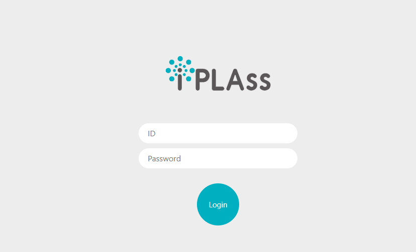
+
TIP: Later on (accesses other than generating the tenant), The user will not be redirected. It is recommended to bookmark this page for later accesses.  +
If all the steps was followed without custom configurations otherwise, the login page's URL should be as follows. +
http://＜Serverhost_or_IPaddress＞:8080/iplass/<TenantName>/gem/ +

.. Log in to the tenant +
Please input the manager's userId and password which was set during the tenant setup process to the input boxes and click the login button. +
After log in, make sure the tenant's top page are presented normally. +
If the top page was displayed normally, the installation is finished completely.
+
*iPLAss TopPage*
+
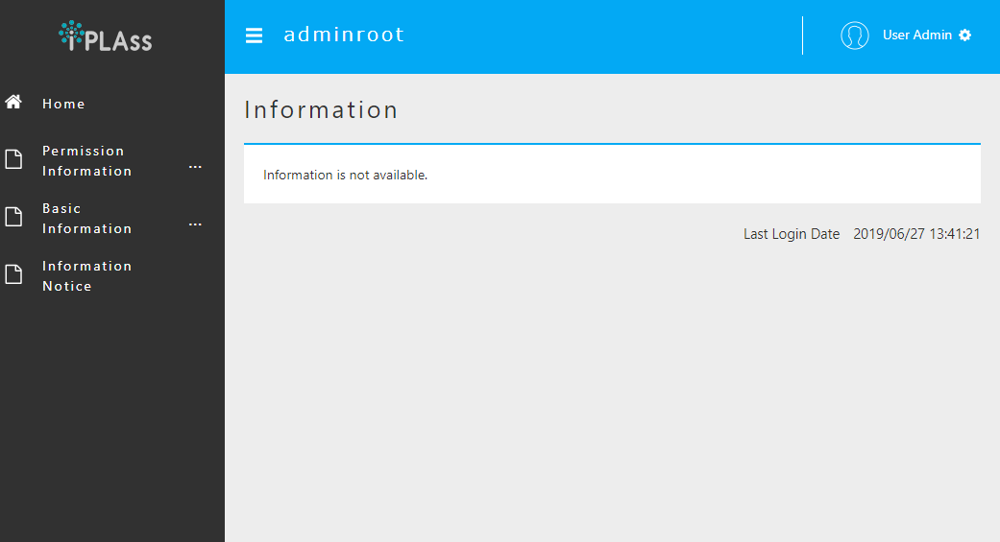

== Operation confirmation

. Glossary
+
Let's check the operation to understand the basic operation method. +
As a prerequisite knowledge before confirming operation, we will briefly explain iPLAss terminology.
+
[cols="1,4",options="autowidth"]
|===
|GEM module +
(GEM pages)|
A collection of views mainly for end users. +
It has login page, and GEM pages that can search/view/modify the Entity data. It is auto-constructed depending on the Entities defined at AdminConsole.
|AdminConsole|
A collection of tools and views for system managers and developers. +
The developer can utilize the AdminConsole to define Entity, to manage the Metadata for Actions and Commands, and also to design the interfaces for operations. While creating the Tenant, the predefined Metadata for the following features are generated.
|Metadata|
Setting information that defines the data and behavior of applications running on iPLAss. +
Data definitions handled by the application (Entities described later), definitions related to the general-purpose data operation screen with CRUD function of the created Entity, definitions related to user authentication methods and policies such as password expiration date, complexity, account lock, etc., side menu There are various types of metadata, such as definitions for items to be displayed and items to be displayed on the top screen after login.
|Entity|
In iPLAss, the data definition to be managed is called 「Entity」. +
Entity is synonymous with table on RDB. Additionally, entities have attributes called 「Property」. Properties are synonymous with columns on RDB. Additionally, how the defined entity is displayed on the screen (input field, pulldown, item order, displayed or not, etc.) can also be set as metadata.
|===

. Start AdminConsole
.. Starting AdminConsole
+
Let's start the AdminConsole. +
Click the user name (User Admin) in the header area to display the user menu. +
Click「AdminConsole」in the user menu to start AdminConsole.
+
*Starting AdminConsole*
+
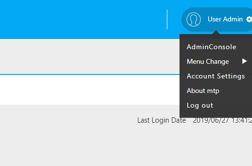
+
*AdminConsole Top Page*
+
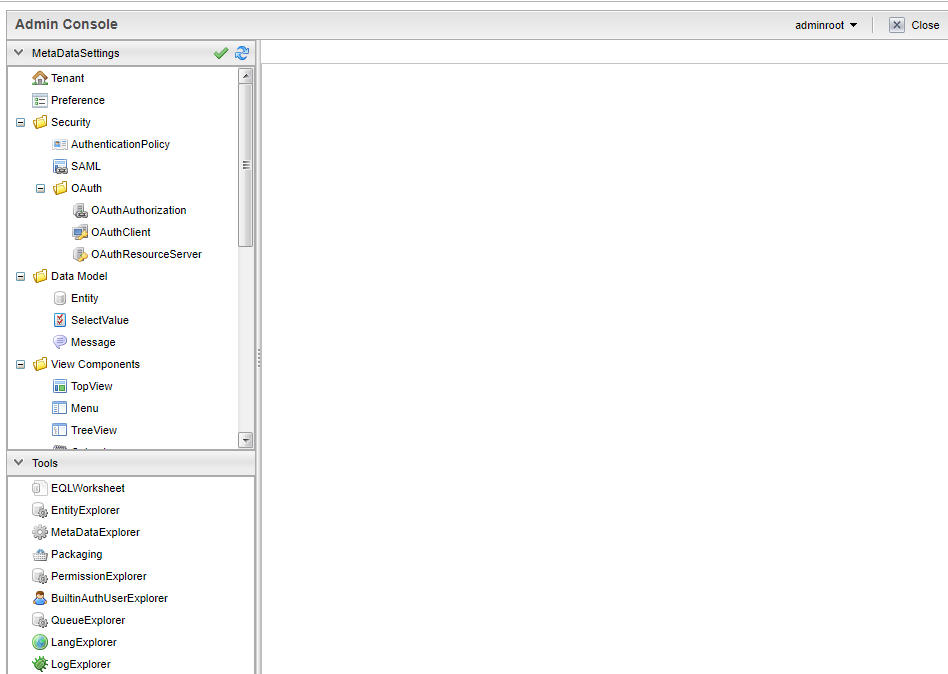
+
.. About the AdminConsole
+
On the left side of AdminConsole, there are two menu groups:「MetaDataSettings」and「Tools」.  +
「MetaDataSettings」will display the metadata defined by tenant in hierarchical trees menus.  +
The creation and modification of metadata will be done on the tree menus. +
「Tools」 is a tool collection for developers. 
+
*「MetaDataSettings」and「Tools」*
+
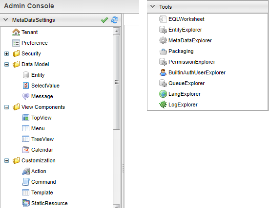
+
※There are some predefined metadata created during the generation of tenants. +
「mtp」and「GEM」are metadata groups used by the functions provided as the iPLAss framework.
+
. Define entity
.. Creating Entity
+
As an example, we will create a 'product master' entity that manages products.
+
To create Entity, select the「Entity」from MetaDataSettings, and right click on it to open the menu. On the menu, choose the「Create Entity」, and the dialog box to generate Entity will show up.
+
*「Create Entity」*
+
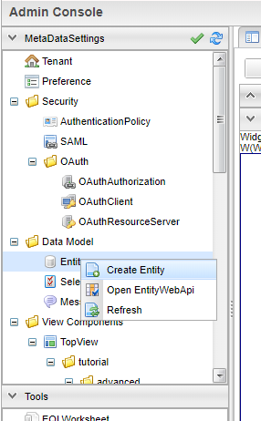
+
*Entity Creation*
+
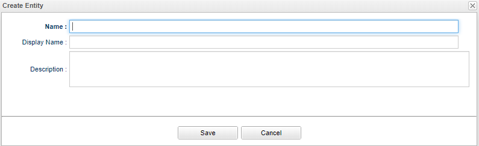
+
*The Necessary Entries to Create Entity*
+
[cols="1,2",options="autowidth"]
|===
|Name| The name of the Entity +
Use "."(a dot) To travel through the file paths.
|Display Name| The name used when displaying the entity. +
It will be used in various situations such as displaying the data to the end-users on GEM pages.
|Description|The description to the entity.
|===
... Creating necessary Entity
+
Pleas input the data as instructed, and click the「Save」button.
+
*Product Master*
+
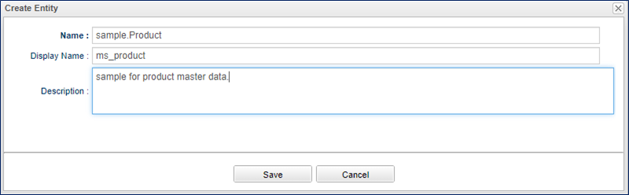
+
*Sample input value*
+
[cols="1,2",options="autowidth"]
|===
|Name|sample.Product
|Display Name|ms_product
|Description|sample for product master data.
|===
+
... Add Property to Entity.
+
'Property' is the properties possessed by Entity. As in RDB an Entity is equivalent to a table, a Property is equivalent to a column. +
 +
To add Property to Entity, either double click the target Entity, +
or right click the target Entity to select the 「Open Entity」from the pop up menu.
+
*「Open the Entity」*
+
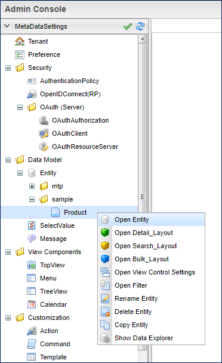
+
After the「Open Entity」was selected, the Entity's settings interface will show up. +
To add Property, click the 「Add」button on the interfaces.
+
*「Add」Button*
+
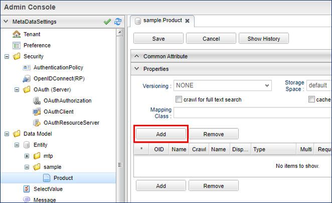
+
Open the property addition screen in the product master entity and define the following property.
+
*Add「Price」Property*
+
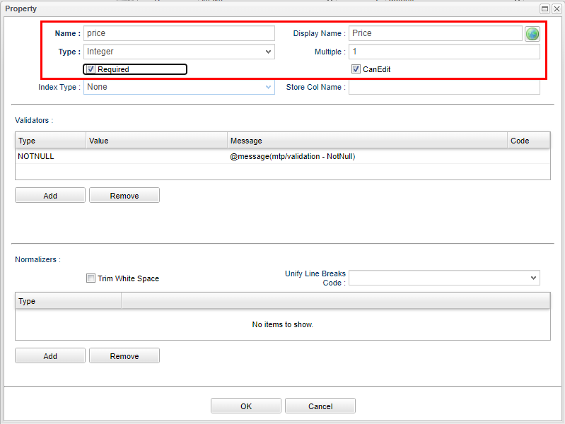
+
*Sample input value*
+
[cols="1,2",options="autowidth"]
|===
|Name|price
|Display Name|Price
|Type|Integer
|Required|Put a check
|===
+
*Add「ReleaseDate」Property*
+
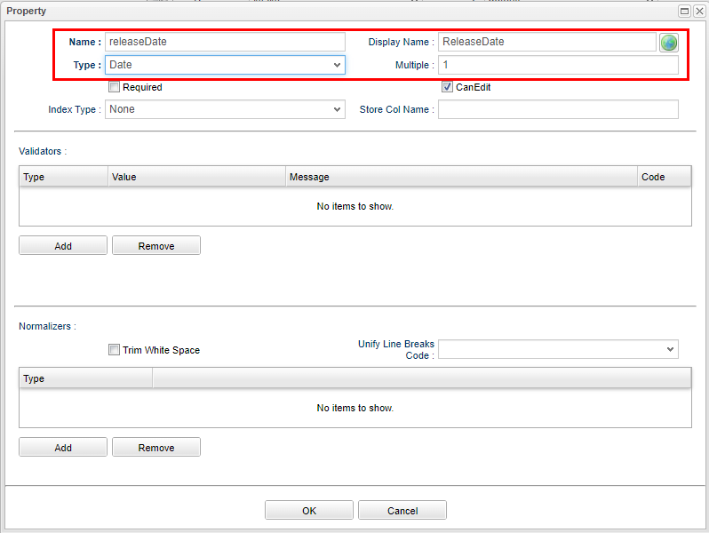
+
*Sample input value*
+
[cols="1,2",options="autowidth"]
|===
|Name|releaseDate
|Display Name|ReleaseDate
|Type|Date
|Required|Do not check
|===
+
The changes on Entity will not reflect to the system until the user press the「Save」button.
+
*「Save」button*
+
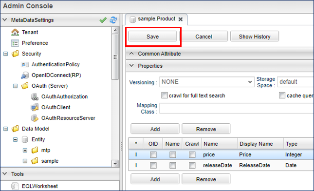
+
Adding Property to Entity is now complete.
+
. Check from the GEM pages
+
Let's check how the Entity created in the previous step is reflected on the screen. +
When you press the「Home」button on the GEM screen and reload, the ms_product item has been added to the side menu based on the definition above.
+
*Confirm On The GEM Pages*
+
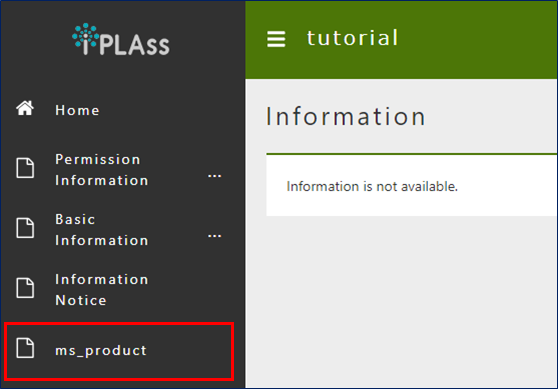
+
When you click on the ms_product, the search screen for the created Entity will be displayed, and you can see that the set Properties are reflected as search items.
+
*Confirming the configured Properties.*
+
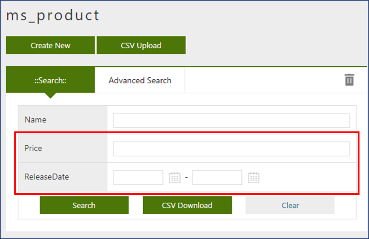
+
You can register, search, edit, and inquire about product data using the buttons such as "New Registration" and "Search" on the screen above. +
Below are examples of screens when performing each operation.
+
*Create New/Edit screen*
+
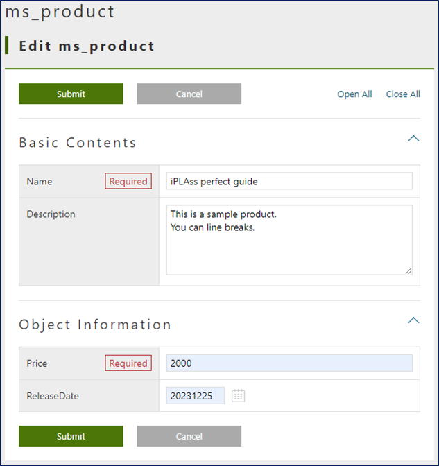
+
*Search screen*
+
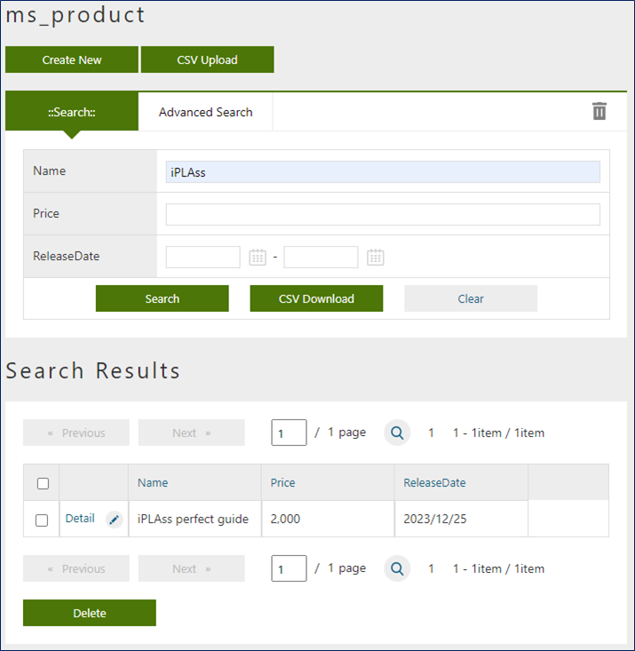
+
*Detail screen*
+
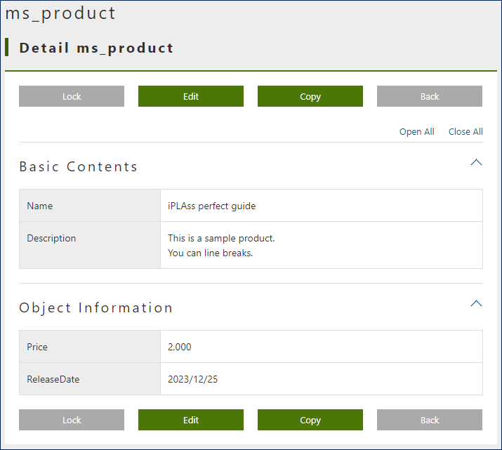

== Next Step
For iPLAss beginners, it would be the best to start with the <<../index.adoc#_Tutorial_,Tutorial>> to learn iPLAss's amazing features.
