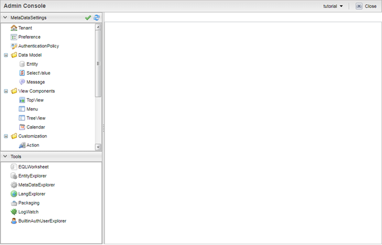
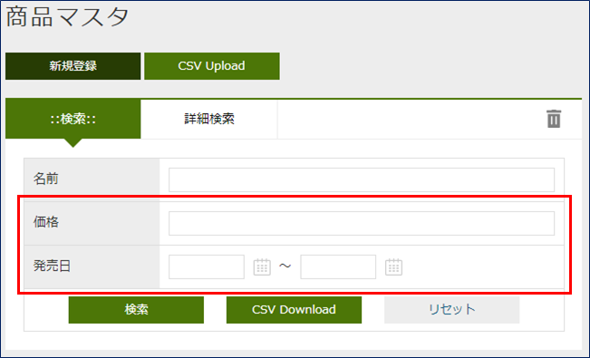

:table-caption!:
= Install and Run
:_relative-root-path: ../../

[[Introduction]]
== はじめに

ここでは、Windows環境のPCで iPLAss を動作させる手順を紹介します。 +
手順中では、アプリケーションサーバとして「Apache Tomcat」、DBMSとして「MySQL」を使用します。 +

[NOTE]
====
iPLAssのインストーラ（war）自体は、Apache Tomcatに最適化されていますが、OS/DBMSは（iPLAssが動作環境と定義する）他のものでも動作します。
====

== 前提条件

本手順は以下を前提条件としています。

- Windows環境であること

== 環境構築
. OpenJDKのインストール
.. Amazon Correttoの https://aws.amazon.com/corretto/[ダウンロードサイト] からAmazon Corretto 21のインストーラをダウンロードします。
+
[source]
----
"amazon-corretto-21-x64-windows-jdk.msi"をダウンロード
----

.. ダウンロードしたインストーラを実行し任意の場所にインストールします。

. Apache Tomcat(以下、Tomcat)のインストール
.. Tomcatの https://tomcat.apache.org/download-10.cgi[ダウンロードサイト] からTomcat 10.1のインストーラをダウンロードします。
+
[source]
----
Coreの"32-bit/64-bit Windows Service Installer"をダウンロード
----

.. ダウンロードしたインストーラを実行し任意の場所にインストールします。

. MySQLのインストール
.. MySQLの https://dev.mysql.com/downloads/mysql/[ダウンロードサイト] からMySQL Community Server(8.0以上)のインストーラをダウンロードします。
+
[source]
----
"Windows (x86, 32 & 64-bit), MySQL Installer MSI"をダウンロード
----
TIP: 本手順は、バージョン「8.0.33」をインストールして作成した手順となっています。 +
他のバージョンを使用した場合、一部手順や項目名が異なる場合がありますので、使用したい環境に合わせて適宜設定してください。

.. ダウンロードしたインストーラを実行し任意の場所にインストールします。 +
インストールの際は以下を設定してください。
+
[source]
----
Setup Type = Server only
Type and Networking:ConfigType = Dedicated Computer
----

.. MySQL(my.iniおよびmy.cnf)を設定します。
+
以下の例の通り、設定を変更または追加してください。
+
TIP: データベースに紐づくmy.ini（Windowsの場合、デフォルトC:\ProgramData\MySQL以下にあるmy.ini）を編集してください。 +
タイムゾーンの設定を行うにあたり、事前にタイムゾーンのインポートを行ってください。 +
タイムゾーンのインポートについてはMySQLのタイムゾーンの https://dev.mysql.com/downloads/timezones.html[ダウンロードサイト] を参照してください。 +

+
[source]
----
　　[client]
　　default-character-set=utf8mb4

　　[mysql]
　　default-character-set=utf8mb4

　　[mysqld]
　　character-set-server=utf8mb4
　　max_allowed_packet=100M
　　transaction-isolation=READ-COMMITTED
　　query_cache_size=0 <1>
　　innodb_file_format=Barracuda <2>
　　innodb_file_per_table=1
　　innodb_large_prefix=1 <2>
　　internal_tmp_disk_storage_engine=MyISAM <3>
　　default-time-zone='Asia/Tokyo' <4>
　　#default-time-zone=+9:00 <5>
----
<1> MySQL 8.0.1以上では不要です。
<2> MySQL 5.7.7以上では不要です。
<3> MySQL 8.0.16以上では不要です。
<4> Connector/J 8.0以上で必要です。 +
タイムゾーンは動作環境に応じて変更してください。 +
事前にタイムゾーンデータをインポートしている必要があります。
<5> タイムゾーンのインポートが難しい場合は、こちらを利用してタイムゾーンを設定してください。 

+
1-5以外の項目については、my.iniを確認し設定されていない場合は追加してください。 +
ファイルの修正が完了したら、MySQLを再起動してください。

+
IMPORTANT: iPLAss 3.2.14 以前では `mysqld` セクションに `lower_case_table_names=1` の設定が必要です。

+

+
TIP: MySQLのバイナリログを有効にしている場合、ファンクション作成にてエラーが発生します。 +
対応として、log_bin_trust_function_creatorsを有効にしてください。

. MySQL JDBCドライバのインストール
.. MySQLの https://dev.mysql.com/downloads/connector/j/[ダウンロードサイト] からConnector/J（GA版）をダウンロードします。
+
[source]
----
"Platform Independent (Architecture Independent), ZIP Archive"をダウンロード
----

.. ダウンロードしたファイルを任意の場所に展開します。

.. 展開したフォルダにあるJDBCドライバファイル(mysql-connector-j-8.0.33.jar)を前手順でインストールしたTomcatの次の場所へコピーします。
+
[source]
----
%CATALINA_HOME%\lib
----
※「CATALINA_HOME」はTomcatをインストールしたディレクトリを指します。
+
TIP: 現時点でTomcatが起動している場合は、JDBCドライバファイルをコピー後にTomcatを再起動してください。

. データベースの準備 +
iPLAssインストーラがデータベースおよびユーザーの作成を行うため準備は不要です。

. iPLAssホームディレクトリ（任意） +
ホームディレクトリにはインストーラの設定情報が格納されます。 +
環境変数「IPLASS_HOME」に設定されたディレクトリがiPLAssホームディレクトリとなります。 +
特に設定がない場合は次のディレクトリがiPLAssホームディレクトリとなります。
+
[source]
----
%USERPROFILE%\.iplass
----
+
TIP: インストーラをリセットし、再度インストールを実行したい場合には、iPLAssホームディレクトリを削除してください。
+
TIP: Windows環境で、Tomcatをサービスから起動した場合のホームディレクトリは下記になります。 +
`C:\Windows\ServiceProfiles\LocalService\.iplass`

. ログの設定（任意） +
ログ設定ファイルをiPLAssホームディレクトリに配置することによりログの設定を行うことができます。

+
設定内容::
以下に、ログをコンソール出力するための設定内容を示します。
こちらを参考にlogback.xmlファイルをホームディレクトリに作成し、適宜カスタマイズしてください。
+
[source,xml]
----
<?xml version="1.0" encoding="UTF-8" ?>
<!DOCTYPE configuration>
<configuration>
	<appender name="STDOUT" class="ch.qos.logback.core.ConsoleAppender"> <1>
		<encoder>
			<pattern>%d{HH:mm:ss.SSS} [%thread] %-5level %logger{36} - %msg%n</pattern>
		</encoder>
	</appender>

	<root level="debug"> <2>
		<appender-ref ref="STDOUT" />
	</root>
</configuration>
----
<1> appender要素には、｢どの場所に｣｢どんなレイアウト｣で出力するのかを定義します。
<2> appenderを定義しただけではログ出力の際に使用されません。logger要素やroot要素に参照されることで初めて使用されます。

+
ログ設定ファイル::
logbackのログ設定ファイルを配置します。ログ設定ファイルは次の順序でロードされます。
1. logback-test.xmlというファイルを探します。
2. 見つからなかった場合、今度はlogback.xmlというファイルを探します。

== iPLAssのインストール
. インストーラファイル（iplass.war）の取得
+
インストーラファイルが手元にない場合、次のいずれかの方法で取得します。

.. https://iplass.org/downloads/[ダウンロードサイト]からiPLAss Installerをダウンロードします。

.. （Enterprise Editionの場合）Enterprise Edition版のダウンロードサイトから「iplass.war」を取得します。

. Tomcatへのiplass.warのデプロイ
.. 取得した「iplass.war」をTomcatの次の場所へコピーします。
+
[source]
----
%CATALINA_HOME%\webapps
----
+
Tomcatが起動していない場合はWARファイルをコピー後、Tomcatを起動してください。 +
Tomcatが既に起動している場合、WARファイルをコピーすると自動的にデプロイが開始されます。

. セットアップ画面の表示
.. Webブラウザに次のURLを入力しセットアップ画面にアクセスします。 +
iPLAssセットアップ画面のURLは下記となります。 +
+
[source,url]
----
http://localhost:8080/iplass
----
+
または
+
[source,url]
----
http://＜サーバのホスト名またはIPアドレス＞:8080/iplass
----
※Tomcatのポート番号を変更した場合は設定したポート番号を指定してください。

. iPLAssセットアップの実行
.. セットアップ情報の入力
... データベースへの接続情報の入力
+
iPLAssセットアップ画面から、以下の要領で環境情報を入力します。
+
[cols="1,4",options="autowidth"]
|===
|データベース| `MySQL` を選択
|DBAユーザー名|MySQLのDBA権限を持つユーザーのユーザー名(MySQLインストール時に作成したRootユーザー名)
|DBAパスワード|MySQLのDBA権限を持つユーザーのパスワード(MySQLインストール時に作成したRootユーザーパスワード)
|バイナリデータファイル保存場所|バイナリデータファイルの保存先ルートディレクトリ +
MySQLおよびPostgreSQLの場合、Binary型のデータは標準でファイル形式により外部保存されます。OracleおよびSQLServerの場合は保存場所を設定した場合のみ外部保存されます。
|テーブル自動作成|[red]#*新規にセットアップを行う場合は必ずチェックしてください。*# +
チェックをするとiPLAssで利用するテーブルを作成します。 +
既にテーブルが存在する場合、テーブルは再作成されデータは初期化されます。 +
再セットアップ等で既存のデータを残す場合はチェックを外してください。
|JDBC URL|ホスト名、ポート番号を入力すると自動的に設定されます。 +
直接編集を行う場合は `編集` をチェックしてください。
|ホスト名|MySQLをインストールしたホスト名またはIPアドレス
|ポート番号|3306 (デフォルト) +
※ポート番号を変更した場合は変更したポート番号を入力してください。
|スキーマ名|mtdb (変更不可)
|ユーザー名|新規で作成する任意のMySQLのユーザー名
|パスワード|新規で作成する任意のMySQLのパスワード
|===

+
TIP: セットアップに失敗してしまった場合は、iPLAssの再インストールが必要になる場合があります。 +
前章で設定したiPLAssのホームディレクトリを削除後、インストール手順をもう一度実施してください。

... iPLAss テナント情報の入力
+
[cols="1,2",options="autowidth"]
|===
|テナント名|任意のテナント名 （半角推奨）
|管理者ユーザーID|任意の管理者ユーザーID
|管理者パスワード|任意の管理者パスワード +
※パスワードを表示する場合は「パスワード表示」をチェックします。
|===
+
.管理者のユーザーIDおよびパスワードについて
TIP: ユーザーIDには４文字以上の英数字および `-` (マイナス) `@` `\_` `.` (ピリオド)のみ入力可能です。 +
パスワードは６文字以上の英数字および次の記号 `~!#\\$^&*+;:?/|{}\\.=_,-` のみ入力可能です。
+
*iPLAssセットアップ画面*
+

.. セットアップの開始 +
セットアップ情報を入力後、セットアップ開始ボタンを押下しiPLAssのセットアップを開始します。 +
セットアップが正常に完了した場合は「[red]#*アプリケーションサーバを再起動してください。*#」のメッセージが表示されます。
+
*正常完了時のメッセージ*
+

. アプリケーションサーバ（Tomcat）の再起動
.. アプリケーションサーバ（Tomcat）を再起動します。

. テナントへのアクセス
.. Webブラウザに以下のURLを入力しアプリケーションサーバにアクセスします。
+
[source,url]
----
http://localhost:8080/iplass
----
+
または
+
[source,url]
----
http://＜サーバのホスト名またはIPアドレス＞:8080/iplass
----
※Tomcatのポート番号を変更した場合は設定したポート番号を指定してください。

.. テナントのログイン画面表示 +
初回アクセス時、初期テナントが自動で作成されます。 +
作成後、テナントへリダイレクトされログイン画面が表示されます。
+
*iPLAssログイン画面*
+

+
TIP: 次回以降（初期テナント作成後）のアクセス時はリダイレクトされないため、リダイレクト後のURLのメモを取るかブックマークの追加を推奨します。 +
これまでの手順に従って作成した場合、ログイン画面のURLは下記の通りです。 +
http://＜サーバのホスト名またはIPアドレス＞:8080/iplass/<テナント名>/gem/ +

.. テナントへのログイン +
ユーザーIDにセットアップで入力したテナント情報の管理者ユーザーIDを、パスワードに管理者パスワードをそれぞれ入力しログインボタンを押下します。 +
ログイン後、テナントのトップ画面が表示されることを確認します。 +
ログインが完了しトップ画面が表示できたら、iPLAssのインストールは完了です。
+
*iPLAss トップ画面*
+

== 動作確認

. 用語説明
+
基本的な操作方法を理解するため、動作確認を行ってみましょう。 +
動作確認前の前提知識として、iPLAssの用語について簡単に説明します。
+
[cols="1,4",options="autowidth"]
|===
|GEMモジュール +
(GEM画面)|
主にエンドユーザー向けの画面群。 +
ログイン画面やEntityデータの参照/編集機能等のGEM画面があります。
AdminConsoleを利用して定義されたEntity定義情報や画面定義情報を元に画面が生成されます。
|AdminConsole|
システム管理者、開発者向けの画面群。 +
開発者はAdminConsoleを利用しながら、Entity定義の作成やEntity操作画面の設計、ActionやCommand等のメタデータの管理を行います。
|メタデータ|
iPLAss上で動作するアプリケーションのデータや振る舞いを定義した設定情報です。 +
アプリケーションで扱うデータ定義（後述のEntity）、作成したEntityのCRUD機能を持った汎用データ操作画面に関する定義、パスワードの有効期限、複雑度、アカウントロックといったユーザー認証の方法やポリシーに関する定義、サイドメニューに表示する項目やログイン後のトップ画面に表示する項目に関する定義など、さまざまな種類のメタデータが存在します。
|Entity|
iPLAssでは、管理するデータ定義を「Entity（エンティティ）」と呼びます。 +
エンティティは、RDB上でのテーブルと同義のものです。更に、エンティティは「Property（プロパティ）」と呼ばれる属性を持ちます。プロパティは、RDB上でのカラムと同義のものです。また、定義されたエンティティをどのように画面に表示するか（入力フィールドなのか、プルダウンなのか、項目並び順、表示有無など）もメタデータとして設定可能です。
|===

. AdminConsoleを起動する
.. AdminConsoleの起動
+
AdminConsoleを起動してみましょう。 +
ヘッダー領域のユーザー名（User Admin）をクリックすると、ユーザーメニューが表示されます。 +
ユーザーメニュー内の、「管理・設定」をクリックすると、AdminConsoleが起動します。
+
*AdminConsoleの起動*
+

+
*AdminConsole トップページ*
+

+
.. AdminConsoleについて
+
AdminConsole画面の左側には「MetaDataSettings」と「Tools」という２つのメニューグループが表示されています。 +
「MetaDataSettings」は各テナント上に定義されたメタデータが、その種類ごとにツリー表示されます。 +
各メタデータの追加、編集はこのツリーから行います。 +
「Tools」は、開発者向けの管理ツール群です。
+
*「MetaDataSettings」と「Tools」*
+

+
※テナント作成時点でいくつかのメタデータが定義されています。 +
「mtp」や「gem」はiPLAssフレームワークとして提供される機能で利用するメタデータ群です。
+
. Entityを定義する
.. Entityの作成
+
ここではサンプルとして、商品を管理する商品マスタEntityを作成します。
+
Entityを作成する際は、MetaDataSettingsの「Entity」を選択し、右クリックメニューから、「エンティティを作成する」を押下してください。Entityの作成画面が表示されます。
+
*「エンティティを作成する」*
+
image::./images/08.CreateEntity01.png[CreateEntity01,align="left"]
+
*Entity作成画面*
+

+
*Entity作成時の入力要素*
+
[cols="1,2",options="autowidth"]
|===
|Name|エンティティの名称です。 +
エンティティは「.(ドット)」で階層を表現できます。
|Display Name|エンティティを表示する際の名称です。 +
GEM画面等での表示に使用されます。
|Description|エンティティの説明です。
|===
... 必要なEntityを作成する
+
以下の要領でデータを入力し、「Save」ボタンを押下してください。
+
*商品マスタ*
+

+
*入力値サンプル*
+
[cols="1,2",options="autowidth"]
|===
|Name|sample.Product
|Display Name|商品マスタ
|Description|サンプルの商品マスタ
|===
+
... EntityにPropertyを追加する。
+
EntityにPropertyを追加するには、対象Entityをダブルクリックするか、 +
対象Entityを選択し、右クリックメニューから「エンティティを開く」を選択します。
+
*「エンティティを開く」*
+

+
「エンティティを開く」を押下すると、Entityの設定画面が開きます。 +
Propertyを追加する際は、Propertiesの「Add」ボタンを押下します。
+
*「Add」ボタン*
+

+
商品マスタエンティティでPropertyの追加画面を開き、以下のPropertyを定義します。
+
*「価格」Propertyの追加*
+

+
*サンプル入力値*
+
[cols="1,2",options="autowidth"]
|===
|Name|price
|Display Name|価格
|Type|Integer
|Required|チェックを入れる
|===
+
*「発売日」Propertyの追加*
+

+
*サンプル入力値*
+
[cols="1,2",options="autowidth"]
|===
|Name|releaseDate
|Display Name|発売日
|Type|Date
|Required|チェックを入れない
|===
+
Entityへの更新を行った場合は「Save」を押下することで更新が反映されます。
+
*「Save」ボタン*
+

+
これでEntityへのProperty追加は完了です。
+
. GEM画面から確認する。
+
前の手順で作成したEntityが、画面にどう反映されているか確認してみましょう。 +
GEM画面で「ホーム」ボタンを押下しリロードを行うと、先ほどの定義をもとにサイドメニューに商品マスタの項目が追加されています。
+
*GEM画面の確認*
+

+
商品マスタを押下すると、作成したEntityの検索画面が表示され、設定したPropertyが検索項目として反映されていることが分かります。
+
*設定したPropertyの確認*
+

+
上記の画面の「新規登録」「検索」などのボタンを利用して商品データの登録、検索、編集、照会を行うことが可能です。 +
以下に紹介するのは、各操作を行った際の画面例です。 +
+
*新規登録/編集画面* +
+

+
*検索画面* +
+

+
*詳細画面* +
+

== 次のステップ
iPLAssに初めてふれている場合、次に <<../index.adoc#_チュートリアル,チュートリアル>> を実施してみてください。
