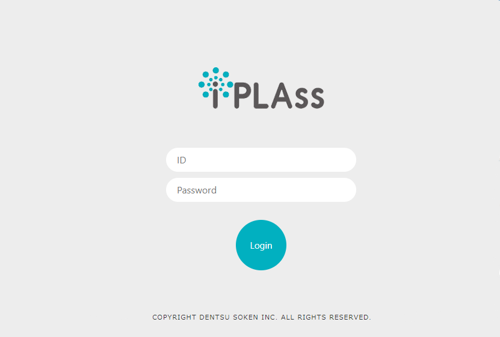

= Construct The Development Environment
:_relative-root-path: ../../

[[ConstructionEnvironment]]
== Construct Eclipse Development Environment
To develop web applications based on iPLAss, the gradle project skeleton for Eclipse is provided.
This guide will go through the process starting from setting up the Eclipse and compiling the projects, until eventually start the web applications after all the configurations.

== Prerequisite
In order to construct the development environment, please have the following environment prepared.
[cols="1,2"]
|===
|JDK|link:https://aws.amazon.com/corretto/[OpenJDK11]
|AP Server|link:https://tomcat.apache.org/download-90.cgi[Tomcat 9.0^]
|DB Server a| One of the followings

* Oracle 11gR2 or higher
* MySQL 5.7/8.0
* SQL Server 2012 or higher
* PostgreSQL 9.6 or higher
|Eclipse a| One of the followings

* link:http://www.eclipse.org/downloads/[Eclipse IDE for Enterprise Java and Web Developers(2023-09) and higher^] +
* link:https://willbrains.jp/[Pleiades-Eclipse - MergeDoc Project^] 
|===

=== Setting Tomcat
Install/Decompress the downloaded installer or compressed files to any directory.

.Place the JDBC Driver
Put the JDBC driver of the corresponding Database being used in the `lib` folder at Tomcat's directory.

TIP: In real-life production environment, there are cases that the Database rely on DataSource for connections.
To use DataSource, it is necessary to place the JDBC driver in the directory of Tomcat.
This document does not use DataSource, but for the reason depicted above, we want to place the JDBC driver at Tomcat side rather than the project side.

=== DB Configuration
If there is no existing database and tables for iPLAss, then it is necessary to configure the DB in order to start with.

Please follow one of the following methods to create the database and tables.

* Use <<../gettingstarted/index.adoc#, Install and Run>> wizard. 
* Download link:https://iplass.org/en/downloads/[iPLAss SDK^], and execute the DDL included in the package to create the database and tables.

TIP: When constructing production environment, please utilize the DDL files from iPLAss SDK.
As the method from Install and Run is not recommended in that case.
If Java 11 are used, please make sure your Database and JDBC are updated to the newest version. The connection policy was modified to TLSv1.3 in Java 11 so the old versions may not comply with and will throw Exceptions.

=== Configuring Eclipse
. Run the downloaded installer. +
If `JAVA_HOME` was not set, the dialog to select `javaw.exe` will show up.
Please select the `javaw.exe` in the directory of the installed JDK.

. On the started interface page, select `Eclipse IDE for Enterprise Java and Web Developers`, and install to any directory.

. After the installation, start the Eclipse and create the workspace at any directory.

. From the menu bar, choose `Window > Preferences` to open the interface for settings.

.. Settings for Encoding +
At `General > Workspace` , change the Text file encoding to `Other（UTF-8）` .

.. Settings for JDK +
Make sure the installed JDK shows in `Java > Installed JREs` . 
If it was not there, add the JDK manually and set it to default.
Then, open `Java > Compiler` and check if `Compiler compliance level` is `11`.

.. Setting for Tomcat +
Add the installed Tomcat in `Server > Runtime Environments`.
Choose `Apache Tomcat v9.0`, and specify the Tomcat directory that we installed previously.

+
TIP: This procedure assumes `Eclipse IDE for Enterprise Java and Web Developers(2023-09)`.

== Create the Project
Project is using the template repository from https://github.com/dentsusoken/iplass-skeleton[GitHub^] .
Create a new repository from `Use this template` and clone it, or please download the zip file.

=== Create with Template
The project can be created by the following steps.

.Make a new repository 
. At `Use this template, click on `Create a new repository` to move to the repository creation page.
. Specify `Owner` and `Repository name` on the repository creation page to create a repository.

. Import the project.
. Copy the URL from Clone option.
. Select `File > Import...` from the Eclipse menu bar.
. Then choose `Git > Projects from Git`.
. Then `Clone URI`.
. Make sure the copied URI is in Location’s URI box. and enter the username and password for authentication to your login as required.
. Choose `master` branch.
. At Destination's `Directory`, specify the workspace that was indicated when starting the Eclipse.
. Choose `Import as general project` at project import wizard.
. Project Name does not need to be modified, just click `Finish`.

TIP: When creating the project by template, a Github account is necessary. +
"Personal access tokens" are required for login authentication, so if you have not yet created one, please create one from "Settings > Developer Settings" in the GitHub menu.

=== Create with ZIP File
The project can be created with the following steps.

.Get ZIP File 
. At `Clone or download`, click on `Download ZIP` to download the ZIP file.
. Decompress the ZIP file, and move the `iplass-skeleton` folder to the root directory of your workspace.

.Import the Project
. Select `File > Import...` from the Eclipse menu bar.
. Then `General > Projects from Folder or Archive`.
. For `Import source`, specify the folder you moved to the workspace, uncheck the `Detect and configure project nature` and then click `Finish`.

=== Create with iPLAss SDK
Create the project with the skeleton project included in iPLAss SDK.

.Get iPLAss SDK
. Download from https://iplass.org/en/downloads/[Download_Site^] or from the URL given along with the enterprise edition's contracts.
. Decompress the iPLAss SDK, place the `iplass-skeleton` folder to the workspace of eclipse.

TIP: For the enterprise edition, it is `iplass-ee-skeleton`.

.[.eeonly]#Replace the configuration file#
. Open the `iplass-ee-skeleton` folder and overwrite the existed `gradle.properties` by the one provided along with the Enterprise Edition's contracts.

TIP: You need to add the username and password distributed at the time of contract to `gradle.properties` of the enterprise edition. +
`iPLAssMavenRepoUsername=xxxxx` +
`iPLAssMavenRepoPassword=xxxxxxxx`

.Import the Project
. Select `File > Import...` from the Eclipse menu bar.
. Then `General > Projects from Folder or Archive` .
. For `Import source`, specify the folder you moved to the workspace, uncheck the `Detect and configure project nature` and then click `Finish`.

=== General Settings After Importing
.Rename The Application
. Decide the name for the projects and change it via `Refactor > Rename`.
. Use `Refactor > Move` to move the project folder corresponding to the project name.
. Change the rootProject.name from `setting.gradle` according to the project name.

.Get JDBC Driver
. As mentioned before, the JDBC driver placed in Tomcat directories will be used when running the web applications. It is also used when running the Tenant tools which will be discussed later.

* Oracle（ojdbc8.jar）'s case +
From the vendor's download site, you can download the jar file, please put it in the lib folder directly under the directory of the project.

* Any of MySQL, PostgreSQL, SQLServer +
Uncomment the relative line from build.gradle.

.Enable the Gradle
. Right click the project, and click `Configure > Add Gradle Nature` to turn the project to a gradle project.
. Click the `Gradle > Refresh Gradle Project` to start downloading the dependencies.

TIP: If you use a proxy server, please refer to the following and add proxy settings to `gradle.properties` and then refresh. +
`systemProp.http.proxyHost=xxx.xxx.xxx.xxx` +
`systemProp.http.proxyPort=xxxx` +
`systemProp.https.proxyHost=xxx.xxx.xxx.xxx` +
`systemProp.https.proxyPort=xxxx`

.Modify Settings of the Project
. Get to the project's `Properties` window, and do the following operations.
. Modify the context root from `Web Project Settings` according to the project name.
. Check the following items in `Project Facets` in the left pane and set the version. +
After that, click the `Runtimes` tab in the right pane and check the Tomcat (Apache Tomcat v9.0) installed in advance. If it does not exist in the options, add it using the `New...` button.

[cols="1,2",options="header"]
|===
|Project Facet|Version
|Java|11
|Dynamic Web Module|4.0
|Runtimes|Apache Tomcat v9.0
|===

.Settings for mtp-service-config.xml
. Modify the settings from  `src/main/resources/mtp-service-config.xml`.
Please change the following items.

[source, xml]
----
<serviceDefinition>
	<inherits>/mtp-core-service-config-oracle.xml</inherits> <1>
	<!-- If use mysql, inherits mtp-core-service-config-mysql.xml for convenience. -->
	<!--
	<inherits>/mtp-core-service-config-mysql.xml</inherits>
	-->
	<!-- If use postgresql, inherits mtp-core-service-config-postgre.xml for convenience. -->
	<!--
	<inherits>/mtp-core-service-config-postgre.xml</inherits>
	-->
	<!-- If use sqlserver, inherits mtp-core-service-config-sqlserver.xml for convenience. -->
	<!--
	<inherits>/mtp-core-service-config-sqlserver.xml</inherits>
	-->

	・・・
	
	<service>
		<interface>org.iplass.mtp.impl.rdb.connection.ConnectionFactory</interface>
		<!-- DriverManager base ConnectionFactory -->
		<class>org.iplass.mtp.impl.rdb.connection.DriverManagerConnectionFactory</class>

		<!-- ■ your rdb setting 1 ■ -->
		<!-- for oracle --> <2>
		<property name="url" value="jdbc:oracle:thin:ADDRESS:PORT:DB" /> <3>
		<property name="user" value="XXXXX" />
		<property name="password" value="XXXXX" />
		<property name="driver" value="oracle.jdbc.driver.OracleDriver" />

        ・・・
    
    </service>
    
    ・・・
    
	<service>
		<interface>org.iplass.mtp.impl.lob.LobStoreService</interface>

		<!--
			To save Binary data in files, uncomment the following comments.
			FileLobStore is mandatory for MySQL and PostgreSQL.
			※The following setting is to store Binary data in file, and LongText data in RDB.
			If it is need to store LongText data in files, please also set the setting of longTextStore to FileLobStore.
		 -->
		<!--
		<property name="binaryStore" class="org.iplass.mtp.impl.lob.lobstore.file.FileLobStore"> <4>
			<property name="rootDir" value="[setYourBinaryFileStoreRootPath]" /> <5>
			<property name="overwriteFile" value="false" />
		</property>
		<property name="longTextStore" class="org.iplass.mtp.impl.lob.lobstore.rdb.RdbLobStore">
		</property>
		 -->

        ・・・
    
    </service>

    ・・・

	<service>
		<interface>org.iplass.mtp.impl.mail.MailService</interface>

        ・・・
        
		<!-- ■ for develop only (additional="true) ■ -->
		<!-- To enable the debug mode for sending mails, Please uncomment the following code.-->
		<!--
		<property name="listener" class="org.iplass.mtp.mail.listeners.LoggingSendMailListener" additional="true"/> <6>
		-->
	</service>

    ・・・

</serviceDefinition>
----
<1> Change depending on the DB in use.
<2> Comment/Uncomment depending on the DB in use.
<3> Change along with the created DB scheme.
<4> Uncomment it if using MySQL or PostgresSQL.
<5> Set the any path to store binary files. (For Windows, an example is `C:\iPLAss\binary`)
<6> Uncomment it only for development environment.

At this point, the project is successfully deployed.

== Create the Tenant
Tenant is like the conceptual division of the server. We have to specify which tenant to access when using iPLAss.
Let's use the GUI tools to create a Tenant.

. Run the Gradle task `runTenantBatch` from the command line. +
* Execution path: Directly under the project +
* Command to run: `gradlew runTenantBatch` +
	※You can check the list of Gradle tasks using the `gradlew tasks` command. +
. Click the `Create Default Tenant` on the shown interface.
. On the dialog, input `name`, `AdminUserId`, `AdminUserPassword` and click `Create`. +
After confirming that "Execute Result: SUCCESS" is displayed in the log of the dialog screen, close the dialog.

TIP: before creating the tenant, please make sure to configure mtp-service-config.xml and set the DBA user with corresponding privileges.

TIP: AdminUserId should be over 4 characters long and can be composed only by English characters, numbers, and the specific special character of `-` , `@` , `\_` , `.` +
AdminUserPassword should be over 6 characters long and only be composed by English characters, numbers, and the following special character: `~!#\\$^&*+;:?/|{}\\.=_,-` .

== Execution

We will start the server, and access the Tenant from the browser.

=== Start the Server
. Right click the root of the project in Eclipse, choose `Run As > Run on Server`.
(Later on you can start from `Server` tab)

. Select `Tomcat v9.0 Server` then click on [Finish].
If `Always use this server when running this project` is checked, the server will directly go for the same setting on forth.
+
TIP: If the `Tomcat admin port` setting is "-", Tomcat will fail to start. Please set an appropriate unused port such as "8015".

=== Show the Login Page
. Once the server is running, access the following URL(URL of the top view of the GEM module) by the browser.

----
http://localhost:8080/Context_Name/Tenant_Name/gem/
----

For instance, if the project was created with context name being `sampleApp`, and tenant being `sampleTenant`, then the URL will be:

----
http://localhost:8080/sampleApp/sampleTenant/gem/
----

If the web application started normally, the following login page will be presented. Please use the manager ID and password specified when creating the tenant to log in.

== Next Step
For the people who are first time with iPLAss, please begin your journey with our <<../index.adoc#_Tutorial,Tutorial>>.
