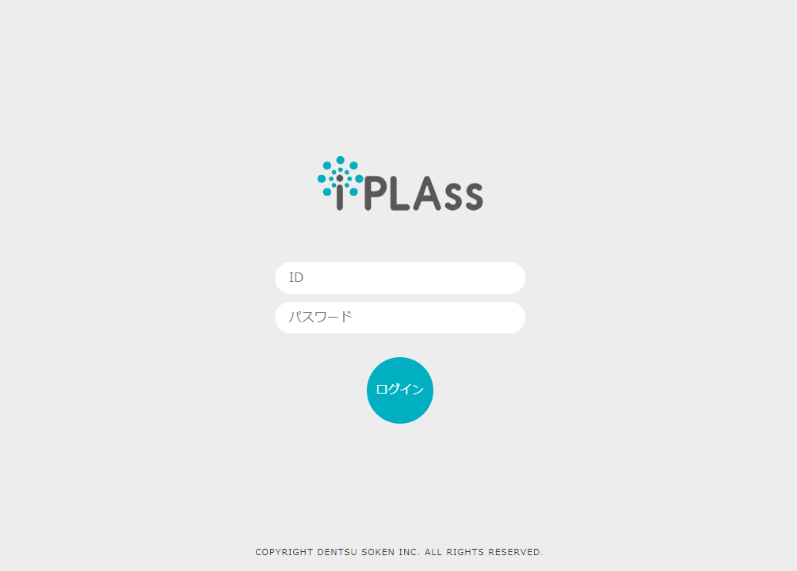

= 開発環境の構築
:_relative-root-path: ../../

[[ConstructionEnvironment]]
== Eclipse開発環境の構築
iPLAssをベースにWebアプリケーションを開発するために、Eclipseで利用可能なGradleプロジェクトのスケルトンが用意されています。 +
ここではEclipseの設定からプロジェクトの取り込み、各種設定を行った後、Webアプリケーションを起動するまでを説明します。

== 事前準備
開発環境を構築するにあたり、以下のものを用意してください。

[cols="1,2"]
|===
|JDK|link:https://aws.amazon.com/corretto/[OpenJDK21]
|APサーバ|link:https://tomcat.apache.org/download-10.cgi[Tomcat 10.1^]
|DBサーバ a|以下の内いずれか

* Oracle 19c以上
* MySQL 8.0以上
* PostgreSQL 12以上
* SQL Server 2016以上

|Eclipse a|
以下の内いずれか

* link:http://www.eclipse.org/downloads/[Eclipse IDE for Enterprise Java and Web Developers(2023-09) 以降^] +
* link:https://willbrains.jp/[Pleiades-Eclipse - MergeDoc Project^]
|===

=== Tomcatの設定
ダウンロードしたインストーラ、または圧縮ファイルから、任意の場所にTomcatをインストールします。

.JDBCドライバの配置
Tomcatのインストールディレクトリにある `lib` フォルダに利用するDBのJDBCドライバを配置してください。

TIP: 本番環境ではデータソースを利用したDB接続を利用する場合があります。
データソースを利用する場合、Tomcatの参照するクラスパス上にJDBCドライバを配置する必要があります。 +
本資料ではデータソースは利用しませんが、上記理由によりプロジェクト側ではなくTomcat側にJDBCドライバを配置します。

=== DBの設定
iPLAss用のデータベースおよびテーブルの準備ができていない場合、DBの設定が必要になります。

以下の方法のうちいずれかを実施し、データベースおよびテーブルを作成してください。

* <<../gettingstarted/index.adoc#, Install and Run>>のウィザードを利用します。
* link:https://iplass.org/downloads/[iPLAss SDK^]をダウンロードし、同梱されているDDLを実行し、テーブルを作成します。

TIP: 本番環境の構築を行う際は、iPLAss SDKのDDLを利用してください。
Install and Runによる作成は推奨していません。

=== Eclipseの設定
. ダウンロードしたインストーラを起動します。 +
`JAVA_HOME` が設定されていない場合、 `javaw.exe` を選択するダイアログが表示されます。
JDKのインストール先にある `javaw.exe` を選択してください。

. 起動した画面で `Eclipse IDE for Enterprise Java and Web Developers` を選択し、任意の場所にインストールします。

. インストール完了後、Eclipseを起動し、任意の場所にワークスペースを作成してください。

. メニューバーから `Window > Preferences` と選択し、設定画面を開きます。

.. エンコーディングの設定 +
`General > Workspace` のText file encodingを `Other（UTF-8）` に変更します。

.. JDKの設定 +
`Java > Installed JREs` にインストールしたJDKがあるか確認してください。 
ない場合はJDKを追加し、デフォルトに設定します。
続いて `Java > Compiler` を開き、`Compiler compliance level` が `21` となっていることを確認してください。

.. Tomcatの設定 +
`Server > Runtime Environments` にインストールしたTomcatを追加します。
`Apache Tomcat v10.1` を選択し、事前にインストールしたTomcatのディレクトリを指定します。

+
TIP: 本手順は、 `Eclipse IDE for Enterprise Java and Web Developers(2023-09)` および、日本語化パッチが未適用の状態であることを前提としています。

== プロジェクトの作成
プロジェクトは https://github.com/dentsusoken/iplass-skeleton[GitHub^] 上に作成されたテンプレートリポジトリを利用します。
`Use this template` から新しいリポジトリを作成してクローンするか、ZIPファイルをダウンロードしてください。

=== テンプレートから作成
以下の手順でプロジェクトを作成します。

.テンプレートから新しいレポジトリを作成
. `Use this template` で `Create a new repository` をクリックし、リポジトリ作成画面に遷移します。
. リポジトリ作成画面で `Owner` と `Repository name` を指定し、レポジトリを作成します。

.プロジェクトのインポート
. クローン先のURLをコピーします。
. Eclipseのメニューバーから `File > Import...` を選択します。
. `Git > Projects from Git` を選択します。
. `Clone URI` を選択します。
. LocationのURIにコピーしたURIが設定されてることを確認します。AuthenticationのUserとPasswordは必要に応じて入力し、ログイン認証してください。
. `master` ブランチを選択します。
. Destinationの `Directory` にEclipse起動時に指定したワークスペースを指定します。
. Wizard for Project importで `Import as general project` を選択します。
. Project Nameを変更せずに `Finish` をクリックします。

TIP: テンプレートから作成する場合、予めGitHubアカウントを作成する必要があります。 +
ログイン認証時に「Personal access tokens」が必要になるため、未作成の場合はGitHubメニューの `Settings > Developer settings` からトークンを作成してください。

=== ZIPファイルから作成
以下の手順でプロジェクトを作成します。

.ZIPファイルの取得
. `Clone or download` で `Download ZIP` をクリックし、ZIPファイルをダウンロードします。
. ZIPファイルを解凍し、ワークスペースの直下に `iplass-skeleton` フォルダを移動します。

.プロジェクトのインポート
. Eclipseのメニューバーから `File > Import...` を選択します。
. `General > Projects from Folder or Archive` を選択します。
. `Import source` にワークスペースに移動したフォルダを指定し、`Detect and configure project nature` のチェックを外し、`Finish` をクリックします。

=== iPLAss SDKから作成
iPLAss SDKに含まれるスケルトンプロジェクトを利用してプロジェクトを作成します。

.iPLAss SDKの入手
. https://iplass.org/downloads/[ダウンロードサイト^] または有償版契約時に通知されるURLからiPLAss SDKをダウンロードします。
. iPLAss SDKを解凍し、ワークスペースの直下に `iplass-skeleton` フォルダを移動します。

TIP: 有償版のSDKでは `iplass-ee-skeleton` フォルダとなっています。

.[.eeonly]#設定ファイルの差し替え#
. `iplass-ee-skeleton` フォルダを開き、有償版契約時に配布される `gradle.properties` を上書きします。

TIP: 有償版の `gradle.properties` には、契約時に配布されるユーザ名およびパスワードを追加する必要があります。 +
`iPLAssMavenRepoUsername=xxxxx` +
`iPLAssMavenRepoPassword=xxxxxxxx`

.プロジェクトのインポート
. Eclipseのメニューバーから `File > Import...` を選択します。
. `General > Projects from Folder or Archive` を選択します。
. `Import source` にワークスペースに移動したフォルダを指定し、`Detect and configure project nature` のチェックを外し、`Finish` をクリックします。

=== インポート後の共通設定 
.アプリケーション名の変更
. アプリケーション名を決め、`Refactor > Rename` でプロジェクトの名前を変更します。
. `Refactor > Move` でプロジェクトフォルダをプロジェクト名にあわせて移動します。
. `setting.gradle` の `rootProject.name` をプロジェクト名にあわせて変更します。

.JDBC Driverの取得
. Webアプリケーション実行時にはTomcatに配置したJDBCドライバを利用しますが、後述のテナントの作成にて、ツール実行時にJDBCドライバが必要になります。

* Oracle（ojdbc8.jar）の場合 +
ベンダーのダウンロードサイトからjarをダウンロードし、プロジェクト直下のlibフォルダに配置します。

* MySQL、PostgreSQL、SQLServerのいずれかの場合 +
build.gradleでコメントアウトされた該当行のコメントを解除します。

.Gradleの有効化
. プロジェクトを右クリックし、`Configure > Add Gradle Nature` をクリックし、Gradleを実行できるプロジェクトに変換します。
. `Gradle > Refresh Gradle Project` をクリックし、依存するライブラリをダウンロードします。

TIP: プロキシサーバーを利用する場合は、以下を参考に `gradle.properties` にプロキシの設定を追加した後、Refreshをしてください。 +
`systemProp.http.proxyHost=xxx.xxx.xxx.xxx` +
`systemProp.http.proxyPort=xxxx` +
`systemProp.https.proxyHost=xxx.xxx.xxx.xxx` +
`systemProp.https.proxyPort=xxxx`

.プロジェクトの設定変更
. プロジェクトの `Properties` を表示し、以下の操作を実施します。
. `Web Project Settings` の `Context root` をプロジェクト名にあわせて変更します。
. 左ペインにある `Project Facets` のうち、以下の項目をチェックし、バージョンを設定します。 +
その後、右ペインにある `Runtimes` タブをクリックし、事前準備でインストールしたTomcat（Apache Tomcat v10.1）をチェックします。選択肢に存在しない場合は `New...` ボタンから追加してください。

[cols="1,2",options="header"]
|===
|Project Facet|Version
|Java|21
|Dynamic Web Module|6.0
|Runtimes|Apache Tomcat v10.1
|===

.mtp-service-config.xmlの設定
. `src/main/resources/mtp-service-config.xml` の設定を変更します。
以下の項目を変更してください。

[source,xml]
----
<serviceDefinition>
	<inherits>/mtp-core-service-config-oracle.xml</inherits> <1>
	<!-- If use mysql, inherits mtp-core-service-config-mysql.xml for convenience. -->
	<!--
	<inherits>/mtp-core-service-config-mysql.xml</inherits>
	-->
	<!-- If use postgresql, inherits mtp-core-service-config-postgre.xml for convenience. -->
	<!--
	<inherits>/mtp-core-service-config-postgre.xml</inherits>
	-->
	<!-- If use sqlserver, inherits mtp-core-service-config-sqlserver.xml for convenience. -->
	<!--
	<inherits>/mtp-core-service-config-sqlserver.xml</inherits>
	-->

	・・・
	
	<service>
		<interface>org.iplass.mtp.impl.rdb.connection.ConnectionFactory</interface>
		<!-- DriverManager base ConnectionFactory -->
		<class>org.iplass.mtp.impl.rdb.connection.DriverManagerConnectionFactory</class>

		<!-- ■ your rdb setting 1 ■ -->
		<!-- for oracle --> <2>
		<property name="url" value="jdbc:oracle:thin:ADDRESS:PORT:DB" /> <3>
		<property name="user" value="XXXXX" />
		<property name="password" value="XXXXX" />
		<property name="driver" value="oracle.jdbc.driver.OracleDriver" />

        ・・・
    
    </service>
    
    ・・・
    
	<service>
		<interface>org.iplass.mtp.impl.lob.LobStoreService</interface>

		<!--
			バイナリデータをファイルに保存する場合、以下のコメントアウトを外してください。
			DBがMySQL及びPostgreSQLの場合はFileLobStoreの設定は必須です。
			※下記設定は、Binaryはファイル、LongTextはRDBに保存する設定です。
			　　LongTextもファイルにする場合は、longTextStoreの設定もFileLobStoreにしてください。
		-->
		<!--
		<property name="binaryStore" class="org.iplass.mtp.impl.lob.lobstore.file.FileLobStore"> <4>
			<property name="rootDir" value="[setYourBinaryFileStoreRootPath]" /> <5>
			<property name="overwriteFile" value="false" />
		</property>
		<property name="longTextStore" class="org.iplass.mtp.impl.lob.lobstore.rdb.RdbLobStore">
		</property>
		-->

        ・・・
    
    </service>

    ・・・

	<service>
		<interface>org.iplass.mtp.impl.mail.MailService</interface>

        ・・・
        
		<!-- ■ for develop only (additional="true) ■ -->
		<!-- 送信メールをデバッグ出力する場合、以下を有効にしてください。 -->
		<!--
		<property name="listener" class="org.iplass.mtp.mail.listeners.LoggingSendMailListener" additional="true"/> <6>
		-->
	</service>

    ・・・

</serviceDefinition>
----
<1> 利用するDBにあわせて設定ファイルを変更
<2> 利用するDBにあわせてコメント化またはコメント化解除
<3> 作成したDBにあわせて変更
<4> MySQL、PostgresSQLの場合はコメント化解除
<5> バイナリファイルの格納先に任意のパスを設定（Windowsの場合、 `C:\iPLAss\binary` 等）
<6> コメント化解除、ただし開発環境のみ利用すること

以上でプロジェクトの作成は終了です。

== テナントの作成
テナントの作成はGUIツールを使用します。

. コマンドラインからGradleタスクの `runTenantBatch` を実行します。 +
* 実行パス： プロジェクト直下 +
* 実行するコマンド： `gradlew runTenantBatch` +
. 起動した画面で `Create Default Tenant` をクリックします。
. ダイアログで `name（テナント名）` 、 `AdminUserId（管理者ユーザーID）` 、 `AdminUserPassword（管理者ユーザーパスワード）` を入力し、 `Create` をクリックします。 +
ダイアログ画面のLogに「Execute Result : SUCCESS」が表示されたことを確認後、ダイアログを閉じてください。

TIP: テナント作成時はDBA権限を持つユーザーをmtp-service-config.xmlに設定してください。

TIP: 管理者ユーザーIDには4文字以上の英数字および `-` (マイナス) `@` `\_` `.` (ピリオド)のみ入力可能です。 +
管理者ユーザーパスワードは6文字以上の英数字および次の記号 `~!#\\$^&*+;:?/|{}\\.=_,-` のみ入力可能です。

== 実行

サーバを起動し、ブラウザからテナントにアクセスします。

=== サーバの起動
. プロジェクトのルートで右クリックし、 `Run As > Run on Server` を実行します。
（次回以降は `Server` Viewから起動できます。）

. `Tomcat v10.1 Server` を選択して、[Finish]をクリックしてください。
`Always use this server when running this project` をチェックしておくと、次回Server起動時にそのまま実行できます。
+
TIP: `Tomcat admin port` の設定が「-」になっている場合、Tomcatの起動に失敗します。使用されていない適当なポート「8015」などを設定してください。

=== ログイン画面の表示
. サーバ起動後、ブラウザから以下のURL (GEMモジュールのトップ画面のURL) にアクセスします。

----
http://localhost:8080/コンテキスト名/テナント名/gem/
----

例えば、Servletのコンテキスト名を `sampleApp` 、テナントを `sampleTenant` として作成した場合、URLは以下になります。

----
http://localhost:8080/sampleApp/sampleTenant/gem/
----

Webアプリケーションが正常に起動できた場合、以下のログイン画面が表示されます。テナント作成時に登録された管理者IDでログインしてください。

== 次のステップ
iPLAssに初めてふれている場合、次に <<../index.adoc#_チュートリアル,チュートリアル>> を実施してみてください。
