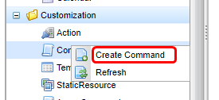
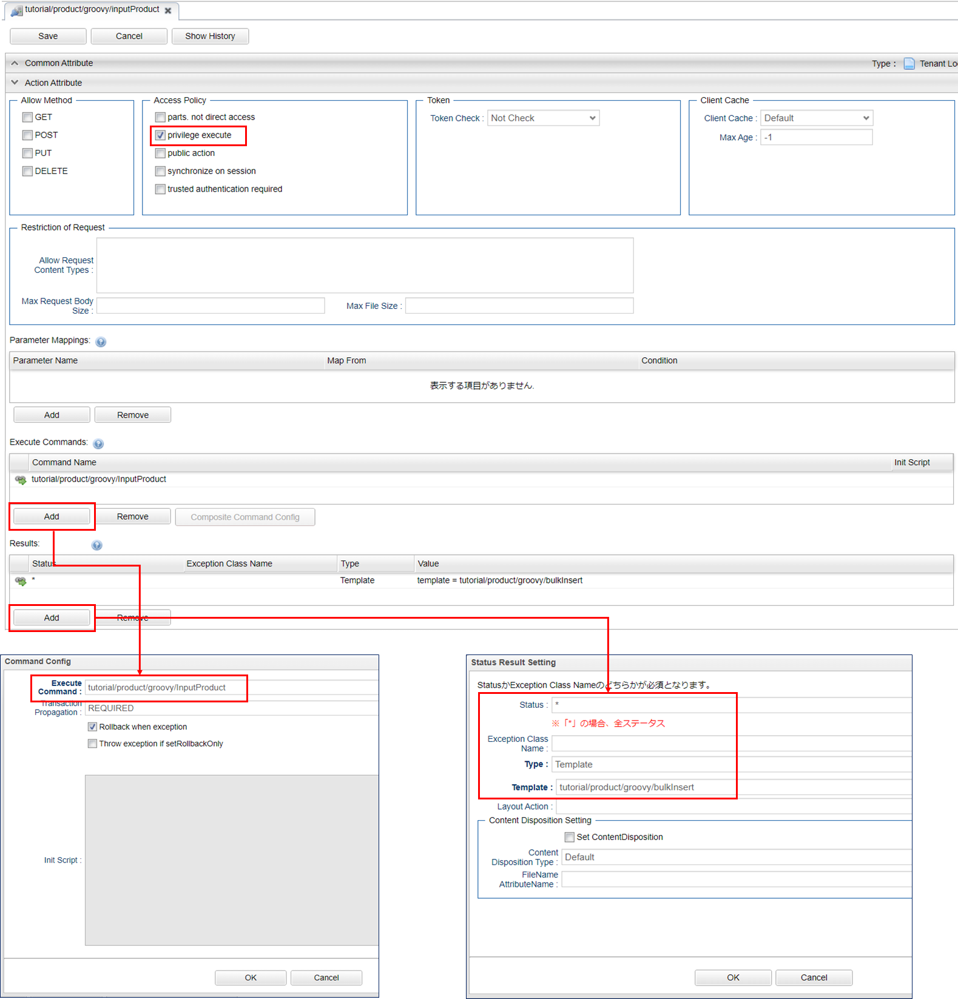

== About This Tutorial
iPLAss allows you to create applications that easily manipulate data by performing various operations from AdminConsole, however, with only the default methods, it will not satisfy the requirements for all users.
In this tutorial, we will make a simple example while explaining customization using iPLAss.

Action, WebApi, Command and Template can be written in Java/Groovy and JSP/GroovyTemplate respectively.
This tutorial will explain how to handle both.

.Before Starting The Customization
iPLAss has an MVC structure, which is composed as below.

Model::
* Entity +
Entity is a definition that is equivalent to a table in RDB.
Data registration and reference will be performed depending on this definition.

View::
* Template +
Template is a definition that manages the contents displayed on the screen and can be implemented with JSP/GroovyTemplate.
Internally, it is possible to display information from the Controller and embed in logics (such as accessing the Model).

Controller::
* Action +
Action is a definition that manages an action on the Web screen (for example, from button press to next screen display).
Internally, you can set the handler (Command) to be called when Action is called and the subsequent view destination (Template, JSP, URL, etc.).
Most of the URL paths used when transitioning between the GEM pages are Action paths.

* WebApi +
WebApi is the definition to managing WebApi.
Various combinations of WebApi formats are possible (REST/SOAP, json/XML, etc.).
Internally, you can set the handler (Command) and specify what values to be returned when WebApi is called.

* Command +
Command is a definition that manages processing logic and can be implemented in Java/Groovy.

.About The View To Be Created
We will create a bulk registration page to the Entity created in <<../basic/index.adoc#tutorial_basic, Tutorial (Basic) >>.
The screen image will be something like the following input screen.

Please refer to <<../basic/index.adoc#createenity_and_dataoperation, The creation and operation of Entity>> if you need to review the guide to create and register Entity.

. Product Category
+
.Entity Data
[options="header"]
|===
|Name|Display Name
|tutorial.product.ProductCategory|Product Category
|===
+
.Additional Property Data
[options="header"]
|===
|Name|Display Name|Type|Reference
|parentCategory|Parent Category|Reference|tutorial.product.ProductCategory
|===
+

In the tutorial (Basic), the following data was registered in the product category.
If it was not registered, please register the following data now.
+
.Example Data
[options="header"]
|===
|General Category|Specific Category|Miscellaneous Category
.3+|Books .2+|Computer・IT|Normal・Beginner
|Programming
|NewBooks・PaperBack・Novels|&nbsp;
|===
. Product
+
.Entity Data
[options="header"]
|===
|Name|Display Name
|tutorial.product.Product|Product
|===
+
.Additional Property Data
[options="header"]
|===
|Name|Display Name|Type|Reference
|price|Price|Integer|
|productCategory|Product Category|Reference|tutorial.product.ProductCategory
|===

== Groovy/GroovyTemplate
Here, customization is achieved using Groovy/GroovyTemplate.
We will use AdminConsole to customize the template.

=== Procedure Of Execution
When creating a process using only Groovy, the process is executed in the following flow.

image::images/groovy_flow_en.png[]

In iPLAss, commands to execute and the information on transition destinations are collected in Action.
Therefore, we will first explain Command/Template (individual definition), and then explain Action (linkage of definition).

=== Initial Display Process
This is the Implementation for the parts from access to screen display.
the operation will be performed on the AdminConsole screen.

.Command Implementation
We will create a data acquisition process to retrieve the data to be output to the screen when the screen is displayed for the first time.
Select `Command` on the AdminConsole screen and select `Create Command` from the right-click menu.

Set the following contents in the displayed dialog and click the `Save` button.

[cols="1,2", options="header"]
|===
|Item|Setting
|Name|tutorial/product/groovy/InputProduct
|DisplayName|Product Bulk Registration Screen Display Command(Groovy)
|Type|Script
|===

After registration, double-click to open the Command metadata displayed on the tree.
Click the Edit button and paste the following script on the displayed screen.

[source, GroovyTemplate]
----
import org.iplass.mtp.entity.query.Query;

//Retrieve Category Data
def categories = em.searchEntity(new Query().select("oid", "name").from("tutorial.product.ProductCategory"));
request.setAttribute("categories", categories);
----

In this tutorial, product categories will be displayed when the screen is displayed.
By performing the above process, product category Entity data obtained using EntityManager (variable em in the script) is linked to the screen with the name `categories`.

[NOTE]
====
EntityManager:: Class that contains the function for Entity.
Referencing, Registration, Update, Deletion, etc. can be processed through this class.
====

Once the configuration was completed, click the `Save` button to save the process.

.Template Implementation
Create the display part of the first screen.
Select `Template` on the AdminConsole screen and select `Create Template` from the right-click menu.

Set the following contents in the displayed dialog and click the `Save` button.

[cols="1,2", options="header"]
|===
|Item|Setting
|Name|tutorial/product/groovy/bulkInsert
|DisplayName|Bulk Insert(Groovy)
|Type|GroovyTemplate
|===

After registration, double-click the Template metadata displayed on the tree to open it.
Click the Edit button and paste the following script on the displayed screen.

Below is the code for displaying the screen layout input field and the product category obtained by Command in the Select part.

[source, GroovyTemplate]
----
<%
def categories = request.getAttribute("categories");
%>
<html>
<head>
<meta http-equiv="Content-Type" content="text/html; charset=UTF-8" />

</head>
<body>
<h2>Product Build Registration</h2>
<form id="bulkForm" method="post" action="">
<table>
  <thead>
    <tr><th>Product Name</th><th>Category</th><th>Price</th></tr>
  </thead>
  <tbody>
  <% for (def i = 0; i < 10; i++) { %>
    <tr>
    <td><input type="text" name="productName" /></td>
    <td>
    <select name="productCategory">
      <%
      for (def e : categories) {
      %>
      <option value="${e.oid}" >${e.name}</option>
      <%}%>
    </select>
    </td>
    <td><input type="text" name="productPrice" /></td>
    </tr>
    <%}%>
  </tbody>
</table>
<input type="button" value="Bulk Registration" onclick="button_onclick('tutorial/product/groovy/insertProduct')" />
</form>
</body>
</html>
----
<1> By specifying `${tcPath()}`, you can dynamically obtain the context name and tenant name of the application, and avoid having to modify the code depending on the environment.

Once finished, please click the `Save` button to save the progress.

.Action Implementation
When accessed, this will decide which process (Command) is called and which screen (Template) is displayed.
Select `Action` on the AdminConsole screen, and select `Create Action` from the right-click menu.

Set the following contents in the displayed dialog and click the `Save` button.

[cols="1,2", options="header"]
|===
|Item|Setting
|Name|tutorial/product/groovy/inputProduct
|DisplayName|Product Bulk Registration Input Screen（Groovy）
|===

After registration, double-click to open the Action metadata displayed on the tree.
Set the following contents for each item in the edit screen.

[cols="1,2a", options="header"]
|===
|Item|Setting
|Privilege execute|Checked
|Execute Commands|tutorial/product/groovy/InputProduct
|Results|[options="header"]
!===
!Status!*
!Type!Template
!Template!tutorial/product/groovy/bulkInsert
!===
|===

Once set, click the `Save` button to save.

With the above settings, after executing the "Product Bulk Registration Screen Display Command (Groovy)", the bulk insert (Groovy) screen will be displayed.

=== Bulk Update
This section is the implementation to handle the process from pressing bulk registration button to displaying the pages afterwards.
The operations are mainly on the AdminConsole pages.

.Command Implementation
We want to create a process to save the input data to Entity when `Bulk registration` button is pressed.
Select `Command` on the AdminConsole screen and select `Create Command` from the right-click menu.

Set the following contents in the displayed dialog and then click the `Save` button.

[cols="1,2", options="header"]
|===
|Item|Setting
|Name|tutorial/product/groovy/InsertProduct
|DisplayName|Product Bulk Registration Command(Groovy)
|Type|Script
|===

After saving the data, double-click to open the `Command` metadata on the tree.
Click the Edit button and paste the following script onto the displayed pages.

[source, GroovyTemplate]
----
import org.iplass.mtp.entity.GenericEntity;
import org.iplass.mtp.web.template.TemplateUtil;

def productNames = request.getParams("productName");
def productCategories = request.getParams("productCategory");
def productPrices = request.getParams("productPrice");

for (int i = 0; i < productNames.size(); i++) {
    if (productNames[i] != null && productNames[i] != "") {
        def entity = new GenericEntity();
        entity.setDefinitionName("tutorial.product.Product");
        entity.setName(productNames[i]);

        def refEntity = new GenericEntity();
        refEntity.setValue("oid", productCategories[i]);
        entity.setValue("productCategory", refEntity);
        entity.setValue("price", productPrices[i]);

        em.insert(entity);
    }
}

request.setAttribute("dispInput",TemplateUtil.getTenantContextPath() + "/tutorial/product/groovy/inputProduct");
----

If the information entered on the screen is acquired and the product Name has a value, then it will be similar to the time of retrieving data.  With EntityManager, the data will be processed in unit of one line.

Since the verification process is omitted, if an exceptional value (for example, a character string in the price entry field) is entered, it will not be processed correctly and an error will occur.

Finally, set the destination information (here, the path to call the action) to the property of `dispInput`. (<<groovy_edit_dispInput, Details will be described later>>)

Once set, click the `Save` button to save.

.Template Implementation
In Bulk Update tutorial, there is no additional registration of template because the initial display process are executed after the completion of registration.

.Action Implementation
Select `Action` on the AdminConsole screen, and select `Create Action` from the right-click menu.

Set the following contents in the displayed dialog and click the `Save` button.

[cols="1,2", options="header"]
|===
|Item|Setting
|Name|tutorial/product/groovy/insertProduct
|DisplayName|Product Bulk Registration(Groovy)
|===

After registration, double-click to open the Action metadata displayed on the tree.
Set the following contents for each item in the edit screen.

[[groovy_edit_dispInput]]
At the end of the Command, access information was set with the name `dispInput`.
If you set as follows in Action `Status Result Action`, you will be redirected to the transition destination set in the access information destination.

[cols="1,2a", options="header"]
|===
|Item|Setting
|Privilege execute|checked
|Execute Commands|tutorial/product/groovy/InsertProduct
|Results|[options="header"]
!===
!Item!Setting
!Status!*
!Type!Redirect
!RedirectPath AttributeName!dispInput
!===
|===

Once set, click the `Save` button to save.

With the above settings, after executing the "Product Bulk Registration Screen Display Command (Groovy) process", the bulk insert (Groovy) screen will be displayed.

.Checking the Performance
You can check by direct access from the URL.
After accessing, the screen shown in `About this tutorial` will be displayed.
After actually registering the data, please verify the data at the normal GEM page.

----
http://localhost:8080/contextName/tenantName/tutorial/product/groovy/inputProduct
----

=== Asynchronous Process
In the bulk update process, we registered data with Action.
Next, let's try asynchronous processing using WebApi.

.Command Implementation
We will use the same command used for bulk update process.

.Template Implementation
For template, we will modify the template we made for initial display process.
Please rewrite the Template of `tutorial/product/groovy/bulkInsert` as shown below.

[source, GroovyTemplate]
----
<%
def categories = request.getAttribute("categories");
%>
<html>
<head>
<meta http-equiv="Content-Type" content="text/html; charset=UTF-8" />

</head>
<body>
<h2>Product Bulk Registration</h2>
<form id="bulkForm" method="post" action="">
<table>
  <thead>
    <tr><th>Product Name</th><th>Category</th><th>Price</th></tr>
  </thead>
  <tbody>
  <% for (def i = 0; i < 10; i++) { %>
    <tr>
    <td><input type="text" name="productName" /></td>
    <td>
    <select name="productCategory">
      <%
      for (def e : categories) {
      %>
      <option value="${e.oid}" >${e.name}</option>
      <%}%>
    </select>
    </td>
    <td><input type="text" name="productPrice" /></td>
    </tr>
    <%}%>
  </tbody>
</table>
<input type="button" value="Bulk Registration" onclick="button_onclick('tutorial/product/groovy/insertProduct')" />
<input type="button" value="Bulk Registration(Asynchronous)" onclick="button_onclickAsync('tutorial/product/groovy/insertProduct')" /> <2>
</form>
</body>
</html>
----
<1> Add asynchronous processing to call WebApi.
<2> Add a button to call Javascript.

.WebApi Implementation
Select `WebApi` on the AdminConsole screen, and select `Create WebApi` from the right-click menu.

Set the following contents in the displayed dialog and click the `Save` button.

[cols = "1,2", options="header"]
|===
| Item | Setting
| Name | tutorial/product/groovy/insertProduct
| DisplayName | Product Batch Registration (Groovy)
|===

After registering the entity, double-click to open the WebApi metadata displayed on the tree.
Set the following contents for each item in the edit screen.

[cols = "1,2", options="header"]
|===
| Item | Setting
| Privilege execute | Checked
| Request Type | REST FORM
| Execute Commands | tutorial/product/groovy/InsertProduct
|===

Once set, click the `Save` button to save the progress.

.Checking Performance
Please refresh the screen for bulk registration and try to register data from the added button.
This time the registration process was called without reloading while it will be reloaded in the past.

== Java/JSP
Here, we will customize the process with Java/JSP.
The operations will require Eclipse.

=== Procedure of Execution
When a process are created only in Java/JSP, the process is executed in the following flow. +
In the figure below, `<XML / JSP>` `<Annotation>` `<Annotation / Java>` represents the method/means to achieve this.

=== Initial Display Process
Implementation for the process from access to showing the screen.
The operations are performed on Eclipse.

.Command/Action Implementation
We will create the process (Command) to retrieve data to be output to the screen when the screen is displayed for the first time.
At the same time, we will set up the definition(Action) to execute command and associate transition destination information.
Create a Java file as follows on Eclipse:

[cols = "1,2"]
|===
| package | org.iplass.tutorial.product
| class name | InputProduct
|===

[source, java]
.InputProduct.java
----
package org.iplass.tutorial.product;

import org.iplass.gem.command.Constants;
import org.iplass.mtp.ManagerLocator;
import org.iplass.mtp.command.Command;
import org.iplass.mtp.command.RequestContext;
import org.iplass.mtp.command.annotation.CommandClass;
import org.iplass.mtp.command.annotation.CommandConfig;
import org.iplass.mtp.command.annotation.action.ActionMapping;
import org.iplass.mtp.command.annotation.action.Result;
import org.iplass.mtp.command.annotation.action.Result.Type;
import org.iplass.mtp.entity.Entity;
import org.iplass.mtp.entity.EntityManager;
import org.iplass.mtp.entity.SearchResult;
import org.iplass.mtp.entity.query.Query;

@ActionMapping(name="tutorial/product/java/inputProduct",
	displayName="Product Bulk Registration Input Page(java)",
	privileged=true,
    result=@Result(type=Type.JSP,
    	value="/jsp/tutorial/product/bulkInsert.jsp",
    	templateName="tutorial/product/java/bulkInsert"),
	command=@CommandConfig(commandClass=InputProduct.class)
)
@CommandClass(name="tutorial/product/java/inputProduct", displayName="Product Bulk Registration Display Command(java)")
public class InputProduct implements Command {

  @Override
  public String execute(RequestContext request) {
    EntityManager em = ManagerLocator.manager(EntityManager.class);
    //Retrieving the Category Data
    SearchResult<Entity> categories = em.searchEntity(new Query()
        .select("oid", "name")
        .from("tutorial.product.ProductCategory"));
    request.setAttribute("categories", categories);
    return Constants.CMD_EXEC_SUCCESS;
  }
}
----

In this tutorial, Product Categories are displayed when the screen is displayed. +
By performing the above processes, product category Entity information obtained using EntityManager is linked to the screen with the name `categories`. +
In addition, there is a part that issue Query from classes that represent EQL in the code of "InputProduct.java". For more information, please refer to <<../../eqlreference/index.adoc#, EQL Reference>>.

.ActionMapping Annotation
Commands and actions are necessary for the registration of metadata definitions (settings to manage with iPLAss).

Just like we have to use the AdminConsole to create an Entity, the same operation applies to the Command and Action as well.
In this example, instead of operating on the AdminConsole screen, we will use the annotation at the top of the Command class.
The definition data used this time are list below.

[cols = "1,1,3,9", options = "header"]
|===
3+| Annotations/Properties | Content
3+| @ActionMapping | Action metadata definition: Set up the linking of which process (Command) to call and where to transit.
| 2+| name | Set a unique name in Action.
| 2+| displayName | Set the display name of Action.
| 2+| privileged | Toggle whether to allow execution without any security restrictions. (If true, the operation can be performed without logging in to iPLAss.)
| 2+| result | Define the `where to transition`.
|| 2+| @Result
||| type | Specify the type of response display method. (The JSP will be created later, so this time specify the JSP.)
||| value | Specify the JSP file name of the transition destination. (Name defined later)
When ||| templateName | type = Type.JSP, set the name when handling the JSP file as a template.
If not specified, the file path will be the template name.
| 2+| command | Define which process (Command) is called.
If not specified, the Command class that defines the ActionMapping annotation is automatically set.
|| 2+| @CommandDef
||| commandClass | Specify the target command class.
3+| @CommandClass | Command metadata definition: Register the Command class as metadata.
| 2+| name | Set a unique name within the command.
| 2+| displayName | Set the display name of the command.
|===

With the annotation set in the InputProduct class, the bulk insert (java) page will be displayed after executing the "Product Bulk Registration Screen Display Command (java)" (this class).

Also, edit `mtp-service-config.xml` stored in `src/main/resources` so that iPLAss can read the above definition.

The `annotatedClass` property is commented in the `MetaDataRepository` configuration in `mtp-service-config.xml`.

[source, xml]
.mtp-service-config.xml
----
<!-- XmlResource MetaData and Annotation MetaData Settings -->
<service>
  <interface>org.iplass.mtp.impl.metadata.MetaDataRepository</interface>

  <!-- ■ your app metadata xml file name (additional="true) ■ -->
  <!--
  <property name="resourcePath" value="/xxx-metadata.xml" additional="true" />
  -->

  <!-- ■ your app command list class (additional="true) ■ -->
  <!--
  <property name="annotatedClass" value="xxx.command.CommandList" additional="true" />
  -->

  ・・・
</service>
----

Uncomment and set the created Command class.

[source, xml]
----
  <!-■ your app command list class (additional = "true) ■->

  <property name = "annotatedClass" value = "org.iplass.tutorial.product.InputProduct" additional = "true" />
----

.About Multiple Registration of Command
If there are multiple commands to import, you can set as follows.

[source, xml]
----
  <!-- ■ your app command list class (additional="true) ■ -->

  <property name="annotatedClass" value="org.iplass.tutorial.AaaaCommand" additional="true" />
  <property name="annotatedClass" value="org.iplass.tutorial.BbbbCommand" additional="true" />
  <property name="annotatedClass" value="org.iplass.tutorial.CcccCommand" additional="true" />
----

Since there are only a few of commands introduced in this tutorial, it is not troublesome to directly specify the the class of the Command as shown above.
However, if only with this method, the following problems will occur.

* XML needs to be corrected every time a command is added (Modifying command name)
* Content described in XML grows with the amount of commands

Commands can also be registered in the following way, so please consider which to use depending on each project's needs.

Create the following class separately from the Command class.
[source, java]
----
package org.iplass.tutorial;

import org.iplass.mtp.impl.metadata.annotation.MetaDataSeeAlso;

@MetaDataSeeAlso({
  org.iplass.tutorial.AaaaCommand.class,
  org.iplass.tutorial.BbbbCommand.class,
  org.iplass.tutorial.CcccCommand.class,
})
public class CommandList { }
----

And specify above class in mtp-service-config.xml .

[source, xml]
----
  <!-- ■ your app command list class (additional="true) ■ -->

  <property name="annotatedClass" value="org.iplass.tutorial.CommandList" additional="true" />
----

.Template Implementation
Create the display parts of the first page.
Create a JSP file under `src\main\webapp`.

[cols = "1,2"]
|===
| Folder (new creation) | /jsp/tutorial/product
| file name | bulkInsert.jsp
|===

[source, jsp]
.bulkInsert.jsp
----
<%@ page language="java" pageEncoding="utf-8" trimDirectiveWhitespaces="true"%>
<%@ taglib prefix="c" uri="http://java.sun.com/jsp/jstl/core"%>
<%@ taglib prefix="m" uri="http://iplass.org/tags/mtp"%>
<%@ page import="org.iplass.mtp.entity.GenericEntity"%>
<%@ page import="org.iplass.mtp.entity.Entity"%>
<%@ page import="org.iplass.mtp.entity.SearchResult"%>
<%@ page import="org.iplass.mtp.command.RequestContext"%>
<%@ page import="org.iplass.mtp.web.template.TemplateUtil"%>
<%
  RequestContext context = TemplateUtil.getRequestContext();
  @SuppressWarnings("unchecked")
  SearchResult<Entity> categories = (SearchResult<Entity>) context.getAttribute("categories");
%>
<html>
<head>

</head>
<body>
<h2>Product Bulk Registration</h2>
<form id="bulkForm" method="post" action="">
<table>
  <thead>
    <tr>
    <th>Product Name</th><th>Category</th><th>Price</th>
    </tr>
  </thead>
  <tbody>
  <% for (int i = 0; i < 10; i++) { %>
    <tr>
    <td><input type="text" name="productName" /></td>
    <td>
    <select name="productCategory">
      <% for (Entity e : categories) { %>
      <option value="<c:out value="<%=e.getOid() %>"/>" ><c:out value="<%=e.getName() %>"/></option>
      <%}%>
    </select>
    </td>
    <td><input type="text" name="productPrice" /></td>
    </tr>
    <%}%>
  </tbody>
</table>
<input type="button" value="Bulk Registration" onclick="button_onclick('tutorial/product/java/insertProduct')" />
</form>
</body>
</html>
----

As the screen layout was defined, the process to retrieve the data from Command and display to the Select part is executed.

Originally, the created JSP must be registered as a Template, but registration can be omitted if the JSP is specified in the transition destination setting with the ActionMapping annotation as in the Command created earlier.

=== Bulk Update Process
This section is the implementation for the process from pressing the bulk registration button to the subsequential pages to be displayed.
To perform the operations, Eclipse is required.

.Command/Action Implementation
Create a process (Command) to save the input data to Entity when the `Batch registration` button is pressed.
At the same time, set up the command to execute and the association definition (Action) of the transition destination information.

Create a Java file as follows:

[cols = "1,2"]
|===
| package | org.iplass.tutorial.product
| class name | InsertProduct
|===

[source, java]
.InsertProduct.java
----
package org.iplass.tutorial.product;

import org.iplass.mtp.ManagerLocator;
import org.iplass.mtp.command.Command;
import org.iplass.mtp.command.RequestContext;
import org.iplass.mtp.command.annotation.CommandClass;
import org.iplass.mtp.command.annotation.action.ActionMapping;
import org.iplass.mtp.command.annotation.action.Result;
import org.iplass.mtp.command.annotation.action.Result.Type;
import org.iplass.mtp.entity.Entity;
import org.iplass.mtp.entity.EntityManager;
import org.iplass.mtp.entity.GenericEntity;
import org.iplass.mtp.util.StringUtil;
import org.iplass.mtp.web.template.TemplateUtil;
import org.iplass.gem.command.Constants;

@ActionMapping(name="tutorial/product/java/insertProduct",
	displayName="Product Bulk Registration(java)",
	privileged=true,
    result=@Result(type=Type.REDIRECT, value="dispInput"))
@CommandClass(name="tutorial/product/java/InsertProduct", displayName="Product Bulk Registration Command(java)")
public class InsertProduct implements Command {

	@Override
	public String execute(RequestContext request) {
		EntityManager em = ManagerLocator.manager(EntityManager.class);
		String[] productNames = request.getParams("productName");
		String[] productCategories = request.getParams("productCategory");
		String[] productPrices = request.getParams("productPrice");
		for (int i = 0; i < productNames.length; i++) {
			if (StringUtil.isNotEmpty(productNames[i])) {
				Entity entity = new GenericEntity();
				entity.setDefinitionName("tutorial.product.Product");
				entity.setName(productNames[i]);
				Entity refEntity = new GenericEntity();
				refEntity.setValue("oid", productCategories[i]);
				entity.setValue("productCategory", refEntity);
				entity.setValue("price", productPrices[i]);

				em.insert(entity);
			}
		}
		request.setAttribute("dispInput", TemplateUtil.getTenantContextPath() + "/tutorial/product/java/inputProduct");
		return Constants.CMD_EXEC_SUCCESS;
	}
}
----

If the information entered on the screen is acquired and the product Name has a value, then it will be similar to the time of retrieving data.  With EntityManager, the data will be processed in unit of one line.

Since the input verify process is omitted, if an exceptional value (for example, a character string in the price entry field) is entered, it will not be processed correctly and an error will occur.

Finally, the transition destination information (here, the path to call the action) is set to the name `dispInput`.
Depending on the `result` setting of `ActionMapping`, it will be redirected to the access information destination set as `dispInput` after the process is completed.

With the annotation set in the InsertProduct class, the initial display will be executed again after executing the Product Bulk Registration Command (Java) Process.

Like the InputProduct class, merely creating a class is not enough. To have this Command in functioning, we have to edits `mtp-service-config.xml` as well.

[source, xml]
----
  <!-- ■ your app command list class (additional="true) ■ -->

  <property name="annotatedClass" value="org.iplass.tutorial.product.InputProduct" additional="true" />
  <property name="annotatedClass" value="org.iplass.tutorial.product.InsertProduct" additional="true" />
----

.Checking Performance
Since the configuration file has been modified/updated, the server must be restarted.
After restarting the server, you can check by directly access from the URL.

After accessing, the screen shown in `About this tutorial` will be displayed.
After actually registering data, please confirm that it is registered on the GEM page.

----
http://localhost:8080/contextName/tenantName/tutorial/product/java/inputProduct
----

=== Asynchronous Process
we registered the bulk update process using Action at previous example. Next, let's try asynchronous processing using WebApi.

.Command / WebApi implementation
WebApi settings are created by setting annotations on the Command.
Command of batch update process uses the process as it is and adds WebApi annotation.

[source, java]
.InsertProduct.java
----
package org.iplass.tutorial.product;

import org.iplass.mtp.ManagerLocator;
import org.iplass.mtp.command.Command;
import org.iplass.mtp.command.RequestContext;
import org.iplass.mtp.command.annotation.CommandClass;
import org.iplass.mtp.command.annotation.action.ActionMapping;
import org.iplass.mtp.command.annotation.action.Result;
import org.iplass.mtp.command.annotation.action.Result.Type;
import org.iplass.mtp.command.annotation.webapi.RestJson; <1>
import org.iplass.mtp.command.annotation.webapi.WebApi; <1>
import org.iplass.mtp.entity.Entity;
import org.iplass.mtp.entity.EntityManager;
import org.iplass.mtp.entity.GenericEntity;
import org.iplass.mtp.util.StringUtil;
import org.iplass.mtp.web.template.TemplateUtil;
import org.iplass.mtp.webapi.definition.RequestType; <1>
import org.iplass.gem.command.Constants;

@ActionMapping(name="tutorial/product/java/insertProduct",
	displayName="Product Bulk Registration(java)",
	privileged=true,
    result=@Result(type=Type.REDIRECT, value="dispInput"))
@WebApi(name="tutorial/product/java/insertProduct", <2>
	displayName="Product Bulk Registration(java)",
	privileged=true,
	accepts=RequestType.REST_JSON,
	restJson=@RestJson(parameterName="param"))
@CommandClass(name="tutorial/product/java/InsertProduct", displayName="Product Bulk Registration Command(java)")
public class InsertProduct implements Command {

	@Override
	public String execute(RequestContext request) {
		EntityManager em = ManagerLocator.manager(EntityManager.class);
		String[] productNames = request.getParams("productName");
		String[] productCategories = request.getParams("productCategory");
		String[] productPrices = request.getParams("productPrice");
		for (int i = 0; i < productNames.length; i++) {
			if (StringUtil.isNotEmpty(productNames[i])) {
				Entity entity = new GenericEntity();
				entity.setDefinitionName("tutorial.product.Product");
				entity.setName(productNames[i]);
				Entity refEntity = new GenericEntity();
				refEntity.setValue("oid", productCategories[i]);
				entity.setValue("productCategory", refEntity);
				entity.setValue("price", productPrices[i]);

				em.insert(entity);
			}
		}
		request.setAttribute("dispInput", TemplateUtil.getTenantContextPath() + "/tutorial/product/java/inputProduct");
		return Constants.CMD_EXEC_SUCCESS;
	}
}
----
<1> Please import the missing annotations and classes.
<2> Adding WebApi annotation

.Template Implementation
Template is added to the process created in the initial display process.
Please rewrite the created Template as follows.

[source, jsp]
.bulkInsert.jsp
----
<%@ page language="java" pageEncoding="utf-8" trimDirectiveWhitespaces="true"%>
<%@ taglib prefix="c" uri="http://java.sun.com/jsp/jstl/core"%>
<%@ taglib prefix="m" uri="http://iplass.org/tags/mtp"%>
<%@ page import="org.iplass.mtp.entity.GenericEntity"%>
<%@ page import="org.iplass.mtp.entity.Entity"%>
<%@ page import="org.iplass.mtp.entity.SearchResult"%>
<%@ page import="org.iplass.mtp.command.RequestContext"%>
<%@ page import="org.iplass.mtp.web.template.TemplateUtil"%>
<%
  RequestContext context = TemplateUtil.getRequestContext();
  @SuppressWarnings("unchecked")
  SearchResult<Entity> categories = (SearchResult<Entity>) context.getAttribute("categories");
%>
<html>
<head>

</head>
<body>
<h2>Product Bulk Registration</h2>
<form id="bulkForm" method="post" action="">
<table>
  <thead>
    <tr>
    <th>Product</th><th>Category</th><th>Price</th>
    </tr>
  </thead>
  <tbody>
  <% for (int i = 0; i < 10; i++) { %>
    <tr>
    <td><input type="text" name="productName" /></td>
    <td>
    <select name="productCategory">
      <% for (Entity e : categories) { %>
      <option value="<c:out value="<%=e.getOid() %>"/>" ><c:out value="<%=e.getName() %>"/></option>
      <%}%>
    </select>
    </td>
    <td><input type="text" name="productPrice" /></td>
    </tr>
    <%}%>
  </tbody>
</table>
<input type="button" value="Bulk Registration" onclick="button_onclick('tutorial/product/java/insertProduct')" />
<input type="button" value="Bulk Registration(Asynchronous)" onclick="button_onclickAsync('tutorial/product/java/insertProduct')" /> <2>
</form>
</body>
</html>
----
<1> Add asynchronous process to call WebApi.
<2> Add a button to call Javascript.

Although it is an asynchronous process that calls WebApi, however, be aware that it is in a different form than Groovy/GroovyTemplate.
In Groovy/GroovyTemplate, the Request Type of WebApi was `REST_FORM`.
Also, contentType was not specified in the ajax option.

On the other hand, for this example, the WebApi Request Type (annotation accepts) is `REST_JSON`.
The ajax option specifies `application / json` as contentType.

As described above, in WebApi, the format of parameters to be acquired changes depending on the Request Type.
Please note that sending an improperly formatted parameter will result in an error.

.Check Performance
Please refresh the screen and try to register from the added button for bulk registration. This time the registration process was called without reloading, but previously the screen was reloaded.

.About Metadata Types
When a file created in Eclipse is read by iPLAss, it is displayed with a different icon from the metadata created on the AdminConsole screen.
The metadata created on AdminConsole is `Local` and becomes the tenant-specific metadata.

On the other hand, metadata defined by annotations and metadata provided by iPLAss are `Shared`, and are metadata defined in the Web application.
In case of `Shared`, it can be used by all tenants accessing from the launched web application.

Also, if you edit and save the `Shared` metadata with AdminConsole, the lower part of the icon will turn red.
The metadata type will change to `Shared Overwrite` and will be treated as tenant-specific metadata. +
If you want to change back from `Shared Overwrite` to `Shared`, right-click the target metadata in AdminConsole and delete it from the context menu that appears.

