== 本チュートリアルについて
iPLAssはAdminConsoleから様々な操作をする事で、簡単にデータ操作を行うアプリケーションを作成できますが、全ての利用ユーザーの要件を満たすわけではありません。
本チュートリアルでは、iPLAssを利用したカスタマイズの説明をしつつ、簡単なサンプルを作っていきます。

Action、WebApi、Command、TemplateはそれぞれJava / Groovy、JSP/ GroovyTemplateで記述可能です。
本チュートリアルでは両方の扱い方を説明していきます。

.カスタマイズをはじめる前に
iPLAssはMVC構造をとっており、それぞれ以下のように成り立っています。

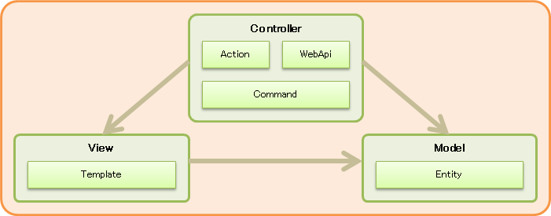

Model::
* Entity +
RDBでいうテーブルに相当する定義です。
この定義に対し、データの登録や参照を行っていきます。

View::
* Template +
画面に表示する内容を管理する定義で、JSP/GroovyTemplateで実装が可能です。
内部では、Controllerからの情報を表示させたり、ロジックを組み込む（Modelにアクセスするなど）ことが可能です。

Controller::
* Action +
Web画面上の１アクション（例えば、ボタン押下から次の画面表示まで、など）を管理する定義です。
内部では、Actionが呼ばれた場合に呼び出す処理（Command）とその後の表示画面先（TemplateやJSP、URLなど）が設定できます。
GEM画面の遷移時に利用されるURLのパスの多くは、Actionのパスとなっています。

* WebApi +
WebApiを管理する定義です。
WebApiの形式は様々な組み合わせが可能となっています（REST/SOAP、json/XMLなど）。
内部では、WebApiが呼ばれた場合に呼び出す処理（Command）と返却値名が設定できます。

* Command +
処理ロジックを管理する定義で、Java/Groovyで実装が可能です。

.今回作成する画面について
<<../basic/index.adoc#tutorial_basic, チュートリアル（ベーシック）>>で作成したEntityへの一括登録ページを作成します。
画面イメージは以下のような単純入力画面となります。

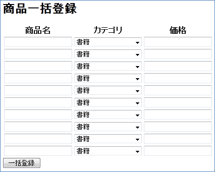

Entityの登録方法に関しては、<<../basic/index.adoc#createenity_and_dataoperation, Entityの作成とデータ操作>>を参照下さい。

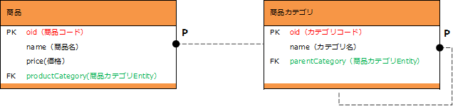

. 商品カテゴリ
+
.Entity情報
[options="header"]
|===
|Name|Display Name
|tutorial.product.ProductCategory|商品カテゴリ
|===
+
.追加Property情報
[options="header"]
|===
|Name|Display Name|Type|Reference
|parentCategory|親カテゴリ|Reference|tutorial.product.ProductCategory
|===
+
チュートリアル（ベーシック）では、商品カテゴリに以下のデータを登録しました。
未登録の場合は以下のデータを登録してください。
+
.登録例
[options="header"]
|===
|大カテゴリ|中カテゴリ|小カテゴリ
.3+|書籍 .2+|コンピュータ・IT|一般・入門書
|プログラミング
|新書・文庫・ノベルス|
|===

. 商品
+
.Entity情報
[options="header"]
|===
|Name|Display Name
|tutorial.product.Product|商品
|===
+
.追加Property情報
[options="header"]
|===
|Name|Display Name|Type|Reference
|price|価格|Integer|
|productCategory|商品カテゴリ|Reference|tutorial.product.ProductCategory
|===

== Groovy/GroovyTemplate
ここではGroovy/GroovyTemplateを利用してカスタマイズを行います。
AdminConsoleを利用したカスタマイズになります。

=== 処理フロー
Groovyのみで処理を作成する場合、下記のような流れで処理が実行されます。

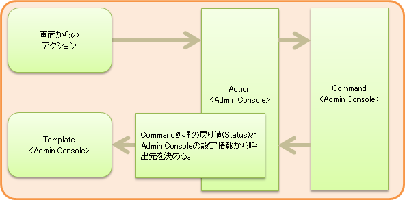

iPLAssではActionに実行するコマンドや遷移先の情報がまとまっています。
そのため、まずCommand/Template（個別定義）について説明し、その後Action（定義の紐付け）の説明を行います。

=== 初期表示処理
アクセス～画面表示までの実装を行います。
AdminConsole画面から操作を行ってください。

.Commandの実装
初回画面表示時に、画面へ出力するデータの取得処理を作成します。
AdminConsole画面で `Command` を選択し、右クリックメニューから `コマンドを作成する` を選択します。

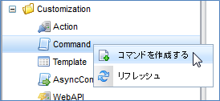

表示されたダイアログに下記の内容を設定し、 `Save` ボタンをクリックします。

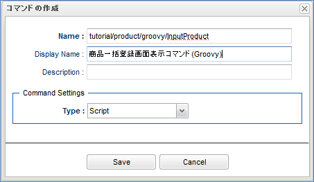

[cols="1,2", options="header"]
|===
|項目|設定値
|Name|tutorial/product/groovy/InputProduct
|DisplayName|商品一括登録画面表示コマンド(Groovy)
|Type|Script
|===

登録後、ツリー上に表示されたCommandメタデータをダブルクリックで開きます。
Editボタンを押下し、表示された画面に下記スクリプトを貼り付けてください。

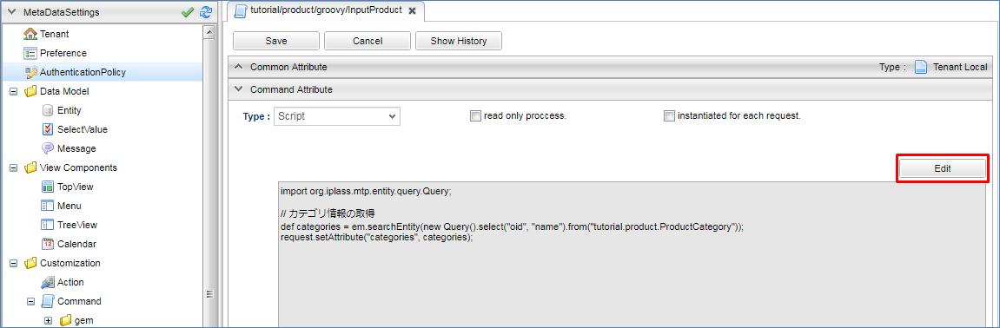

[source, GroovyTemplate]
----
import org.iplass.mtp.entity.query.Query;

// カテゴリ情報の取得
def categories = em.searchEntity(new Query().select("oid", "name").from("tutorial.product.ProductCategory"));
request.setAttribute("categories", categories);
----

本チュートリアルでは、画面表示時に商品カテゴリを表示しています。
上記処理を行うことで、EntityManager（スクリプト内の変数em）を利用して取得した商品カテゴリEntityの情報を、 `categories` という名前で画面へ連携します。

[NOTE]
====
EntityManager:: Entityに対する機能を持っているクラス。
参照・登録・更新・削除などはこのクラスを通して処理ができる。
====

設定したら、 `Save` ボタンをクリックして保存してください。

.Templateの実装
初回画面の表示部分を作成します。
AdminConsole画面で `Template` を選択し、右クリックメニューから `テンプレートを作成する` を選択します。

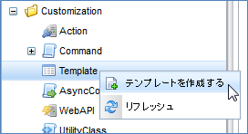

表示されたダイアログに下記の内容を設定し、 `Save` ボタンをクリックします。

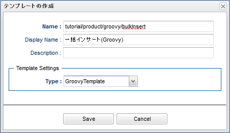

[cols="1,2", options="header"]
|===
|項目|設定値
|Name|tutorial/product/groovy/bulkInsert
|DisplayName|一括インサート(Groovy)
|Type|GroovyTemplate
|===

登録後、ツリー上に表示されたTemplateメタデータをダブルクリックで開きます。
Editボタンを押下し、表示された画面に下記スクリプトを貼り付けてください。

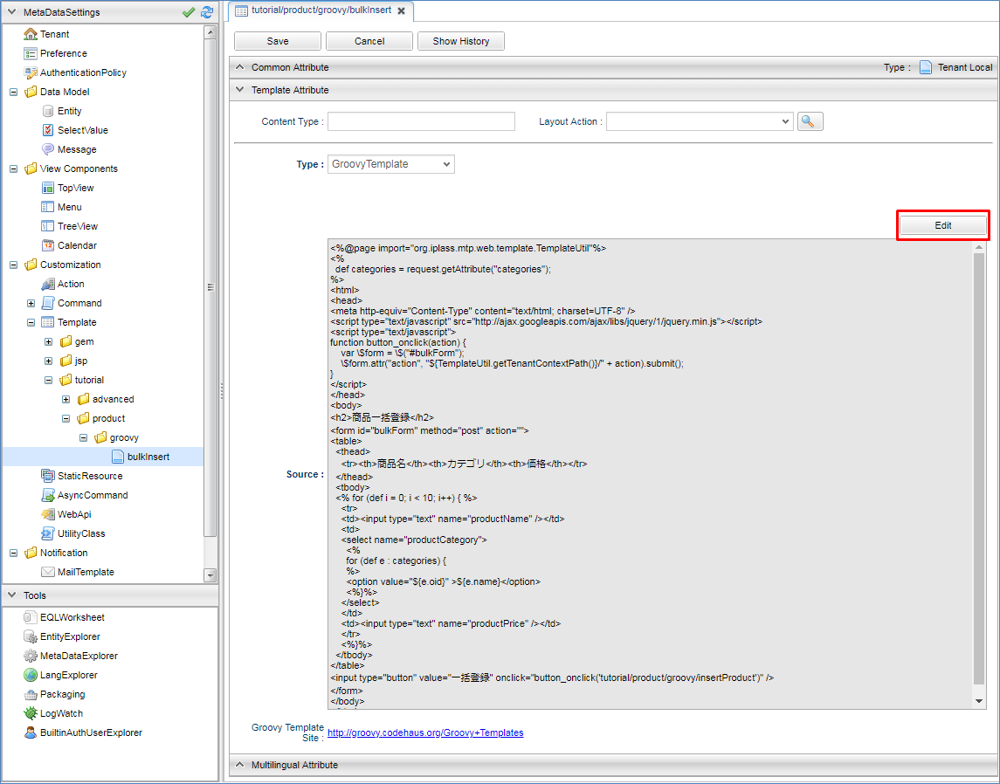

下記は、画面レイアウトの入力欄と、Commandで取得した商品カテゴリをSelect部品に表示させるためのコードです。

[source, GroovyTemplate]
----
<%
def categories = request.getAttribute("categories");
%>
<html>
<head>
<meta http-equiv="Content-Type" content="text/html; charset=UTF-8" />

</head>
<body>
<h2>商品一括登録</h2>
<form id="bulkForm" method="post" action="">
<table>
  <thead>
    <tr><th>商品名</th><th>カテゴリ</th><th>価格</th></tr>
  </thead>
  <tbody>
  <% for (def i = 0; i < 10; i++) { %>
    <tr>
    <td><input type="text" name="productName" /></td>
    <td>
    <select name="productCategory">
      <%
      for (def e : categories) {
      %>
      <option value="${e.oid}" >${e.name}</option>
      <%}%>
    </select>
    </td>
    <td><input type="text" name="productPrice" /></td>
    </tr>
    <%}%>
  </tbody>
</table>
<input type="button" value="一括登録" onclick="button_onclick('tutorial/product/groovy/insertProduct')" />
</form>
</body>
</html>
----
<1> `${tcPath()}` を指定することで、アプリケーションのコンテキスト名とテナント名を動的に取得でき、環境によってコードを修正するような事態を避けることができます。

設定したら、 `Save` ボタンをクリックして保存してください。

.Actionの実装
アクセスされた場合に、どの処理（Command）を呼び出し、どの画面（Template）を表示させるかの紐付け設定を行います。
AdminConsole画面で `Action` を選択し、右クリックメニューから `アクションを作成する` を選択します。

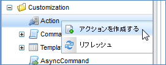

表示されたダイアログに下記の内容を設定し、 `Save` ボタンをクリックします。

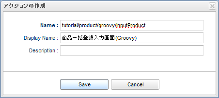

[cols="1,2", options="header"]
|===
|項目|設定値
|Name|tutorial/product/groovy/inputProduct
|DisplayName|商品一括登録入力画面（Groovy）
|===

登録後、ツリー上に表示されたActionメタデータをダブルクリックで開きます。
編集画面内の各項目に下記の内容を設定してください。

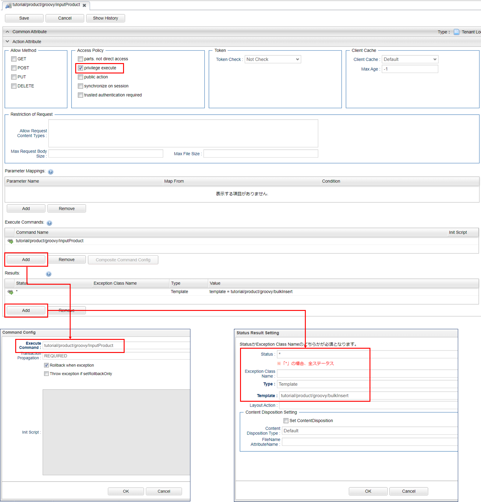

[cols="1,2a", options="header"]
|===
|項目|設定値
|Privilege execute|チェックあり
|Execute Commands|tutorial/product/groovy/InputProduct
|Results|[options="header"]
!===
!項目!設定値
!Status!*
!Type!Template
!Template!tutorial/product/groovy/bulkInsert
!===
|===

設定したら、 `Save` ボタンをクリックして保存してください。

上記設定により、商品一括登録画面表示コマンド(Groovy)の処理を実行後、一括インサート(Groovy)画面を表示するようになります。

=== 一括更新処理
一括登録ボタン押下～登録後の表示までの実装を行います。
AdminConsole画面から操作を行ってください。

.Commandの実装
画面で `一括登録` ボタンが押下された場合に、入力されているデータをEntityへ保存する処理を作成します。
AdminConsole画面で `Command` を選択し、右クリックメニューから `コマンドを作成する` を選択します。

表示されたダイアログに下記の内容を設定し、 `Save` ボタンをクリックします。

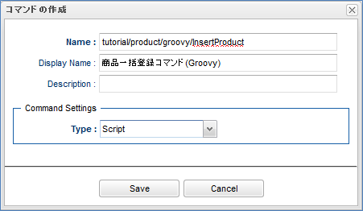

[cols="1,2", options="header"]
|===
|項目|設定値
|Name|tutorial/product/groovy/InsertProduct
|DisplayName|商品一括登録コマンド(Groovy)
|Type|Script
|===

登録後、ツリー上に表示された `Command` メタデータをダブルクリックで開きます。
Editボタンを押下し、表示された画面に下記スクリプトを貼り付けてください。

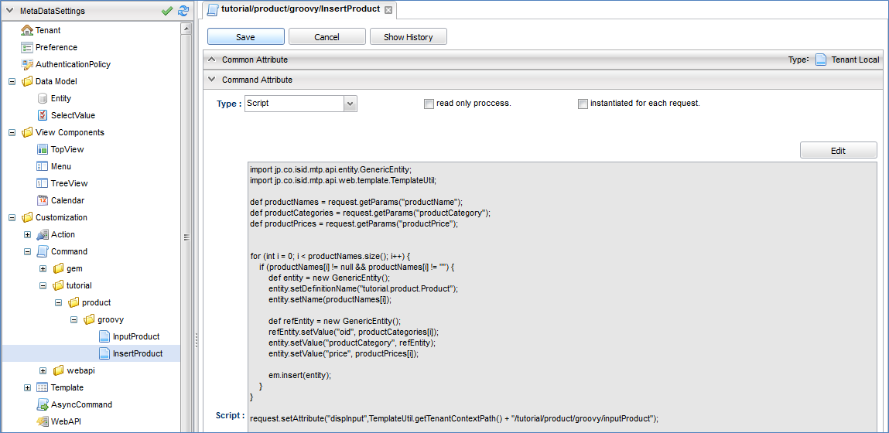

[source, GroovyTemplate]
----
import org.iplass.mtp.entity.GenericEntity;
import org.iplass.mtp.web.template.TemplateUtil;

def productNames = request.getParams("productName");
def productCategories = request.getParams("productCategory");
def productPrices = request.getParams("productPrice");

for (int i = 0; i < productNames.size(); i++) {
    if (productNames[i] != null && productNames[i] != "") {
        def entity = new GenericEntity();
        entity.setDefinitionName("tutorial.product.Product");
        entity.setName(productNames[i]);

        def refEntity = new GenericEntity();
        refEntity.setValue("oid", productCategories[i]);
        entity.setValue("productCategory", refEntity);
        entity.setValue("price", productPrices[i]);

        em.insert(entity);
    }
}

request.setAttribute("dispInput",TemplateUtil.getTenantContextPath() + "/tutorial/product/groovy/inputProduct");
----

画面で入力された情報を取得して商品名に値があれば、取得時同様にEntityManagerを利用して、１行分のデータを商品Entityに登録する処理を行っています。

チェック処理などを省いているため、例外な値（例えば、値段の入力欄に文字列など）が入力されていた場合は正常に処理されずエラーとなります。

最後に `dispInput` という名前に遷移先の情報（ここではアクションの呼び出しを行うパス）を設定します（<<groovy_edit_dispInput, 詳細は後述>>）。

設定したら、 `Save` ボタンをクリックして保存してください。

.Templateの実装
一括更新処理のチュートリアルでは、登録後完了後は初期表示処理を実行する設定のため、Templateの追加登録はありません。

.Actionの実装
AdminConsole画面で `Action` を選択し、右クリックメニューから `アクションを作成する` を選択します。

表示されたダイアログに下記の内容を設定し、 `Save` ボタンをクリックします。

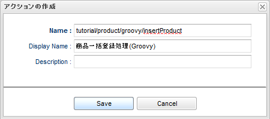

[cols="1,2", options="header"]
|===
|項目|設定値
|Name|tutorial/product/groovy/insertProduct
|DisplayName|商品一括登録処理(Groovy)
|===

登録後、ツリー上に表示されたActionメタデータをダブルクリックで開きます。
編集画面内の各項目に下記の内容を設定してください。

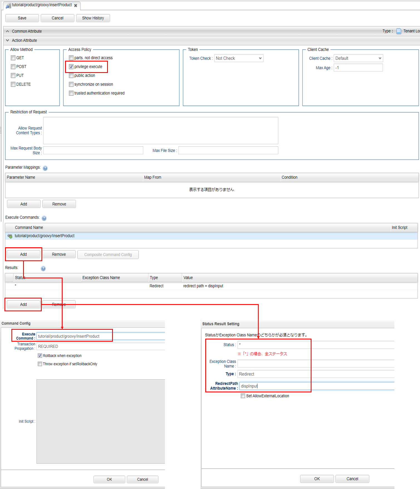

[[groovy_edit_dispInput]]
Commandの最後に `dispInput` という名前でアクセス情報を設定しました。
Actionの `Status Result Action` で以下のように設定すると、アクセス情報先に設定された遷移先へリダイレクトします。

[cols="1,2a", options="header"]
|===
|項目|設定値
|Privilege execute|チェックあり
|Execute Commands|tutorial/product/groovy/InsertProduct
|Results|[options="header"]
!===
!項目!設定値
!Status!*
!Type!Redirect
!RedirectPath AttributeName!dispInput
!===
|===

設定したら、 `Save` ボタンをクリックして保存してください。

上記設定により、商品一括登録画面表示コマンド(Groovy)の処理を実行後、一括インサート(Groovy)画面を表示するようになります。

.動作確認
URLから直接アクセスで確認できます。
アクセス後、 `本チュートリアルについて` で示した画面が表示されます。
実際に登録したあとはGEM画面から登録されていることを確認してみて下さい。

----
http://localhost:8080/コンテキスト名/テナント名/tutorial/product/groovy/inputProduct
----

=== 非同期処理
一括更新処理ではActionを利用して登録を行いました。
次はWebApiを使って非同期処理を行ってみましょう。

.Commandの実装
Commandは一括更新処理をそのまま利用します。

.Templateの実装
Templateは初期表示処理で作成したものに処理を追記します。
`tutorial/product/groovy/bulkInsert` のTemplateを下記のように書き換えてください。

[source, GroovyTemplate]
----
<%
def categories = request.getAttribute("categories");
%>
<html>
<head>
<meta http-equiv="Content-Type" content="text/html; charset=UTF-8" />

</head>
<body>
<h2>商品一括登録</h2>
<form id="bulkForm" method="post" action="">
<table>
  <thead>
    <tr><th>商品名</th><th>カテゴリ</th><th>価格</th></tr>
  </thead>
  <tbody>
  <% for (def i = 0; i < 10; i++) { %>
    <tr>
    <td><input type="text" name="productName" /></td>
    <td>
    <select name="productCategory">
      <%
      for (def e : categories) {
      %>
      <option value="${e.oid}" >${e.name}</option>
      <%}%>
    </select>
    </td>
    <td><input type="text" name="productPrice" /></td>
    </tr>
    <%}%>
  </tbody>
</table>
<input type="button" value="一括登録" onclick="button_onclick('tutorial/product/groovy/insertProduct')" />
<input type="button" value="一括登録(非同期)" onclick="button_onclickAsync('tutorial/product/groovy/insertProduct')" /> <2>
</form>
</body>
</html>
----
<1> WebApiを呼び出すための非同期処理を追記します。
<2> Javascriptを呼び出すためのボタンを追記します。

.WebApiの実装
AdminConsole画面で `WebApi` を選択し、右クリックメニューから `WebApiを作成する` を選択します。

表示されたダイアログに下記の内容を設定し、 `Save` ボタンをクリックします。

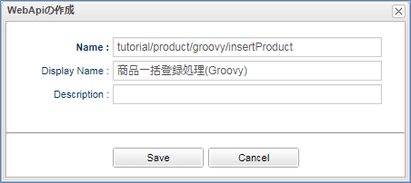

[cols="1,2", options="header"]
|===
|項目|設定値
|Name|tutorial/product/groovy/insertProduct
|DisplayName|商品一括登録処理(Groovy)
|===

登録後、ツリー上に表示されたWebApiメタデータをダブルクリックで開きます。
編集画面内の各項目に下記の内容を設定してください。

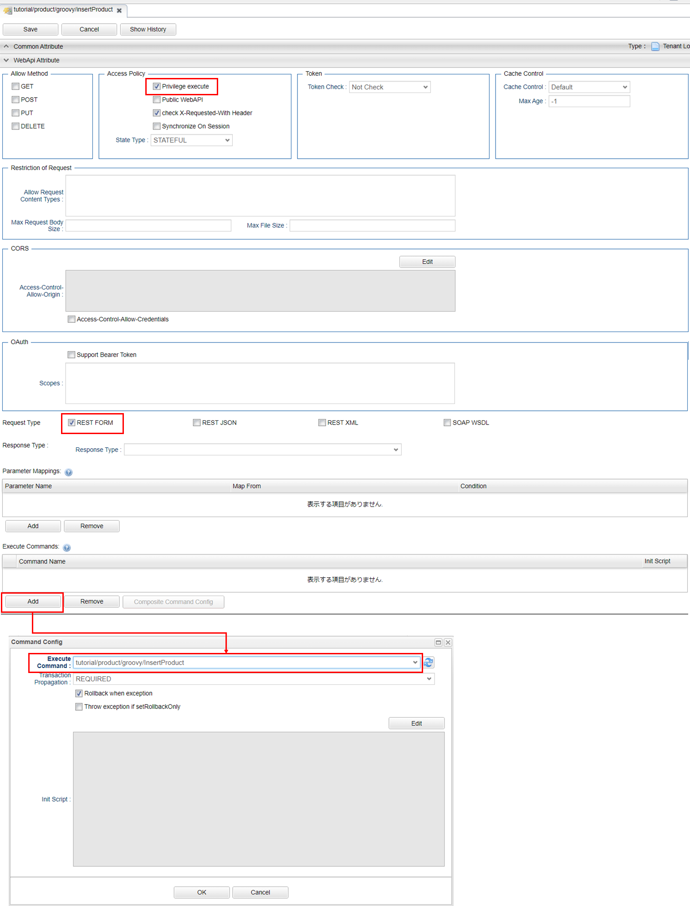

[cols="1,2", options="header"]
|===
|項目|設定値
|Privilege exute|チェックあり
|Request Type|REST FORM
|Excute Commands|tutorial/product/groovy/InsertProduct
|===

設定したら、 `Save` ボタンをクリックして保存してください。

.動作確認
一括登録用の画面を再表示し、追加したボタンから登録してみてください。
先ほどは画面の再読み込みが行われましたが、今回は再読み込みは行われずに登録処理が呼ばれました。

== Java/JSP
ここではJava/JSPを利用したカスタマイズを行います。
Eclipseを利用したカスタマイズになります。

=== 処理フロー
Java/JSPのみで処理を作成する場合、下記のような流れで処理が実行されます。 +
下図中の `<XML / JSP>` `<アノテーション>` `<アノテーション / Java>` は、実現するための方法/手段を表しています。

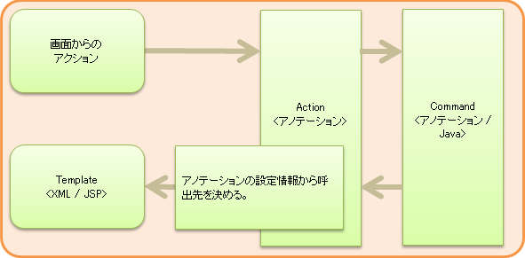

=== 初期表示処理
アクセス～画面表示までの実装を行います。
Eclipse上で操作を行ってください。

.Command / Actionの実装
初回画面表示時に、画面へ出力するデータの取得処理（Command）を作成します。
また、実行するコマンドや遷移先の情報の紐付け定義（Action）も同時に設定します。
Eclipse上で以下のようにJavaファイルを作成してください。

[cols="1,2"]
|===
|パッケージ|org.iplass.tutorial.product
|クラス名|InputProduct
|===

[source, java]
.InputProduct.java
----
package org.iplass.tutorial.product;

import org.iplass.gem.command.Constants;
import org.iplass.mtp.ManagerLocator;
import org.iplass.mtp.command.Command;
import org.iplass.mtp.command.RequestContext;
import org.iplass.mtp.command.annotation.CommandClass;
import org.iplass.mtp.command.annotation.CommandConfig;
import org.iplass.mtp.command.annotation.action.ActionMapping;
import org.iplass.mtp.command.annotation.action.Result;
import org.iplass.mtp.command.annotation.action.Result.Type;
import org.iplass.mtp.entity.Entity;
import org.iplass.mtp.entity.EntityManager;
import org.iplass.mtp.entity.SearchResult;
import org.iplass.mtp.entity.query.Query;

@ActionMapping(name="tutorial/product/java/inputProduct",
	displayName="商品一括登録入力画面(java)",
	privileged=true,
    result=@Result(type=Type.JSP,
    	value="/jsp/tutorial/product/bulkInsert.jsp",
    	templateName="tutorial/product/java/bulkInsert"),
	command=@CommandConfig(commandClass=InputProduct.class)
)
@CommandClass(name="tutorial/product/java/inputProduct", displayName="商品一括登録画面表示コマンド(java)")
public class InputProduct implements Command {

  @Override
  public String execute(RequestContext request) {
    EntityManager em = ManagerLocator.manager(EntityManager.class);
    // カテゴリ情報の取得
    SearchResult<Entity> categories = em.searchEntity(new Query()
        .select("oid", "name")
        .from("tutorial.product.ProductCategory"));
    request.setAttribute("categories", categories);
    return Constants.CMD_EXEC_SUCCESS;
  }
}
----

本チュートリアルでは、画面表示時に商品カテゴリを表示しています。 +
上記処理を行うことで、EntityManagerを利用して取得した商品カテゴリEntityの情報を、 `categories` という名前で画面へ連携します。 +
また、「InputProduct.java」のコード内でEQLを表現するクラス群からクエリーを作成している部分があります。詳しい説明を知りたい方は<<../../eqlreference/index.adoc#, EQLリファレンス>>を参照してください。

.ActionMappingアノテーション
CommandやActionは、メタデータ定義（iPLAssで管理するための設定）の登録が必要です。

Entityを作成する際にAdminConsole画面を使ってメタデータ定義を作成したように、CommandやActionも同様の操作が必要になります。
ここでは、AdminConsole画面で操作しないかわりにCommandクラスの上部あるアノテーションを記載することで対応しています。
今回利用している定義情報は以下の通りです。

[cols="1,1,3,9", options="header"]
|===
3+|アノテーション/プロパティ|内容
3+|@ActionMapping|Actionのメタデータ定義：どの処理（Command）を呼び出すか、何処へ遷移させるかの紐付け設定を行います。
| 2+|name|Action内で一意の名前を設定します。
| 2+|displayName|Actionの表示名を設定します。
| 2+|privileged|セキュリティ制約を一切受けずに実行を可能とするかどうかを切り替えます。（trueの場合、iPLAssへログインせずに操作可能な処理となります。）
| 2+|result| `何処へ遷移させるか` の定義を行います。
|| 2+|@Result
|||type|レスポンス表示方法の種類の指定します。（後ほどJSPを作成するので今回はJSPを指定します。）
|||value|遷移先のJSPファイル名を指定します。（後述で定義される名前）
|||templateName|type=Type.JSP の場合に、JSPファイルをテンプレートとして扱う際の名前を設定します。
未指定の場合、ファイルパスがテンプレート名になります。
| 2+|command| `どの処理（Command）を呼び出すか` の定義を行います。
未指定の場合、ActionMappingアノテーションを定義したCommandクラスが自動的に設定されます。
|| 2+|@CommandDef
|||commandClass|対象のコマンドクラスを指定します。
3+|@CommandClass|Commandのメタデータ定義：Commandクラスをメタデータとして登録します。
| 2+|name|Command内で一意の名前を設定します。
| 2+|displayName|Commandの表示名を設定します。
|===

InputProductクラスで設定したアノテーションにより、商品一括登録画面表示コマンド(java)（本クラス）の処理を実行後、一括インサート(java)画面が表示されるようになります。

また、上記の定義をiPLAssが読み込んでくれるように、 `src/main/resources` に格納されている `mtp-service-config.xml` を編集します。

`mtp-service-config.xml` 内の `MetaDataRepository` の設定に `annotatedClass` というプロパティがコメントされています。

[source, xml]
.mtp-service-config.xml
----
<!-- XmlResource MetaData and Annotation MetaData Settings -->
<service>
  <interface>org.iplass.mtp.impl.metadata.MetaDataRepository</interface>

  <!-- ■ your app metadata xml file name (additional="true) ■ -->
  <!--
  <property name="resourcePath" value="/xxx-metadata.xml" additional="true" />
  -->

  <!-- ■ your app command list class (additional="true) ■ -->
  <!--
  <property name="annotatedClass" value="xxx.command.CommandList" additional="true" />
  -->

  ・・・
</service>
----

コメントを解除して、作成したCommandクラスを設定してください。

[source, xml]
----
  <!-- ■ your app command list class (additional="true) ■ -->

  <property name="annotatedClass" value="org.iplass.tutorial.product.InputProduct" additional="true" />
----

.Commandの複数登録について
取り込むCommandが複数ある場合、以下のように設定することが可能です。

[source, xml]
----
  <!-- ■ your app command list class (additional="true) ■ -->

  <property name="annotatedClass" value="org.iplass.tutorial.AaaaCommand" additional="true" />
  <property name="annotatedClass" value="org.iplass.tutorial.BbbbCommand" additional="true" />
  <property name="annotatedClass" value="org.iplass.tutorial.CcccCommand" additional="true" />
----

今回のチュートリアルでは数が少ないため、上記のようにCommand処理を記載したクラスを直接指定しています。
ただこの方法のみで登録を行うと、下記のような問題が発生します。

* Commandの追加（コマンド名の修正）が発生する度に、XMLの修正を行う必要がある
* Commandの量に伴い、XMLに記載する内容が肥大化する

Commandの登録方法には下記のように纏める事も可能ですので、プロジェクト毎に検討してみてください。

Commandクラスとは別に下記のようなクラスを作成します。
[source, java]
----
package org.iplass.tutorial;

import org.iplass.mtp.impl.metadata.annotation.MetaDataSeeAlso;

@MetaDataSeeAlso({
  org.iplass.tutorial.AaaaCommand.class,
  org.iplass.tutorial.BbbbCommand.class,
  org.iplass.tutorial.CcccCommand.class,
})
public class CommandList { }
----

そして、先ほどのmtp-service-config.xmlのvalue値に上記クラスを指定します。

[source, xml]
----
  <!-- ■ your app command list class (additional="true) ■ -->

  <property name="annotatedClass" value="org.iplass.tutorial.CommandList" additional="true" />
----

.Templateの実装
初回画面の表示部分を作成します。
`src\main\webapp` 配下にJSPファイルを作成してください。

[cols="1,2"]
|===
|フォルダ（新規作成分）|/jsp/tutorial/product
|ファイル名|bulkInsert.jsp
|===

[source, jsp]
.bulkInsert.jsp
----
<%@ page language="java" pageEncoding="utf-8" trimDirectiveWhitespaces="true"%>
<%@ taglib prefix="c" uri="http://java.sun.com/jsp/jstl/core"%>
<%@ taglib prefix="m" uri="http://iplass.org/tags/mtp"%>
<%@ page import="org.iplass.mtp.entity.GenericEntity"%>
<%@ page import="org.iplass.mtp.entity.Entity"%>
<%@ page import="org.iplass.mtp.entity.SearchResult"%>
<%@ page import="org.iplass.mtp.command.RequestContext"%>
<%@ page import="org.iplass.mtp.web.template.TemplateUtil"%>
<%
  RequestContext context = TemplateUtil.getRequestContext();
  @SuppressWarnings("unchecked")
  SearchResult<Entity> categories = (SearchResult<Entity>) context.getAttribute("categories");
%>
<html>
<head>

</head>
<body>
<h2>商品一括登録</h2>
<form id="bulkForm" method="post" action="">
<table>
  <thead>
    <tr>
    <th>商品名</th><th>カテゴリ</th><th>価格</th>
    </tr>
  </thead>
  <tbody>
  <% for (int i = 0; i < 10; i++) { %>
    <tr>
    <td><input type="text" name="productName" /></td>
    <td>
    <select name="productCategory">
      <% for (Entity e : categories) { %>
      <option value="<c:out value="<%=e.getOid() %>"/>" ><c:out value="<%=e.getName() %>"/></option>
      <%}%>
    </select>
    </td>
    <td><input type="text" name="productPrice" /></td>
    </tr>
    <%}%>
  </tbody>
</table>
<input type="button" value="一括登録" onclick="button_onclick('tutorial/product/java/insertProduct')" />
</form>
</body>
</html>
----

画面レイアウトの定義と、Commandからの情報をSelect部品に表示させる処理を行います。

本来であれば作成したJSPはTemplateとして登録する必要がありますが、先ほど作成したCommandのように、ActionMappingアノテーションで遷移先の設定にJSPを指定した場合、登録を省略できます。

=== 一括更新処理
一括登録ボタン押下～登録後の表示までの実装を行います。
Eclipse上で操作を行ってください。

.Command/Actionの実装
画面で `一括登録` ボタンが押下された場合に、入力されているデータをEntityへ保存する処理（Command）を作成します。
また、実行するコマンドや遷移先の情報の紐付け定義（Action）も同時に設定します。

以下のようにJavaファイルを作成してください。

[cols="1,2"]
|===
|パッケージ|org.iplass.tutorial.product
|クラス名|InsertProduct
|===

[source, java]
.InsertProduct.java
----
package org.iplass.tutorial.product;

import org.iplass.mtp.ManagerLocator;
import org.iplass.mtp.command.Command;
import org.iplass.mtp.command.RequestContext;
import org.iplass.mtp.command.annotation.CommandClass;
import org.iplass.mtp.command.annotation.action.ActionMapping;
import org.iplass.mtp.command.annotation.action.Result;
import org.iplass.mtp.command.annotation.action.Result.Type;
import org.iplass.mtp.entity.Entity;
import org.iplass.mtp.entity.EntityManager;
import org.iplass.mtp.entity.GenericEntity;
import org.iplass.mtp.util.StringUtil;
import org.iplass.mtp.web.template.TemplateUtil;
import org.iplass.gem.command.Constants;

@ActionMapping(name="tutorial/product/java/insertProduct",
	displayName="商品一括登録処理(java)",
	privileged=true,
    result=@Result(type=Type.REDIRECT, value="dispInput"))
@CommandClass(name="tutorial/product/java/InsertProduct", displayName="商品一括登録コマンド(java)")
public class InsertProduct implements Command {

	@Override
	public String execute(RequestContext request) {
		EntityManager em = ManagerLocator.manager(EntityManager.class);
		String[] productNames = request.getParams("productName");
		String[] productCategories = request.getParams("productCategory");
		String[] productPrices = request.getParams("productPrice");
		for (int i = 0; i < productNames.length; i++) {
			if (StringUtil.isNotEmpty(productNames[i])) {
				Entity entity = new GenericEntity();
				entity.setDefinitionName("tutorial.product.Product");
				entity.setName(productNames[i]);
				Entity refEntity = new GenericEntity();
				refEntity.setValue("oid", productCategories[i]);
				entity.setValue("productCategory", refEntity);
				entity.setValue("price", productPrices[i]);

				em.insert(entity);
			}
		}
		request.setAttribute("dispInput", TemplateUtil.getTenantContextPath() + "/tutorial/product/java/inputProduct");
		return Constants.CMD_EXEC_SUCCESS;
	}
}
----

画面で入力された情報を取得して商品名に値があれば、取得時同様にEntityManagerを利用して、１行分のデータを商品Entityに登録する処理を行っています。

チェック処理などを省いているため、例外な値（例えば、値段の入力欄に文字列など）が入力されていた場合は正常に処理されずエラーとなります。

最後に `dispInput` という名前に遷移先の情報（ここではアクションの呼び出しを行うパス）を設定しています。
`ActionMapping` の `result` の設定により、処理終了後は `dispInput` という名前に設定されたアクセス情報先へリダイレクトされるようになります。

InsertProductクラスで設定したアノテーションにより、商品一括登録コマンド(Java)の処理を実行後、再度初期表示が実行されるようになります。

このCommandもクラス作成だけでなく、InputProductクラス同様に `mtp-service-config.xml` を編集します。

[source, xml]
----
  <!-- ■ your app command list class (additional="true) ■ -->

  <property name="annotatedClass" value="org.iplass.tutorial.product.InputProduct" additional="true" />
  <property name="annotatedClass" value="org.iplass.tutorial.product.InsertProduct" additional="true" />
----

.動作確認
設定ファイルを追加・更新したため、サーバの再起動が必須になります。
サーバを再起動後、URLから直接アクセスで確認できます。

アクセス後、 `本チュートリアルについて` で示した画面が表示されます。
実際に登録したあとはGEM画面から登録されていることを確認してみて下さい。

----
http://localhost:8080/コンテキスト名/テナント名/tutorial/product/java/inputProduct
----

=== 非同期処理
一括更新処理ではActionを利用して登録を行いました。 次はWebApiを使って非同期処理を行ってみましょう。

.Command/WebApiの実装
WebApiの設定はCommandにアノテーションを設定することで作成します。
一括更新処理のCommandは処理をそのまま利用し、WebApiのアノテーションを追加します。

[source, java]
.InsertProduct.java
----
package org.iplass.tutorial.product;

import org.iplass.mtp.ManagerLocator;
import org.iplass.mtp.command.Command;
import org.iplass.mtp.command.RequestContext;
import org.iplass.mtp.command.annotation.CommandClass;
import org.iplass.mtp.command.annotation.action.ActionMapping;
import org.iplass.mtp.command.annotation.action.Result;
import org.iplass.mtp.command.annotation.action.Result.Type;
import org.iplass.mtp.command.annotation.webapi.RestJson; <1>
import org.iplass.mtp.command.annotation.webapi.WebApi; <1>
import org.iplass.mtp.entity.Entity;
import org.iplass.mtp.entity.EntityManager;
import org.iplass.mtp.entity.GenericEntity;
import org.iplass.mtp.util.StringUtil;
import org.iplass.mtp.web.template.TemplateUtil;
import org.iplass.mtp.webapi.definition.RequestType; <1>
import org.iplass.gem.command.Constants;

@ActionMapping(name="tutorial/product/java/insertProduct",
	displayName="商品一括登録処理(java)",
	privileged=true,
    result=@Result(type=Type.REDIRECT, value="dispInput"))
@WebApi(name="tutorial/product/java/insertProduct", <2>
	displayName="商品一括登録処理(java)",
	privileged=true,
	accepts=RequestType.REST_JSON,
	restJson=@RestJson(parameterName="param"))
@CommandClass(name="tutorial/product/java/InsertProduct", displayName="商品一括登録コマンド(java)")
public class InsertProduct implements Command {

	@Override
	public String execute(RequestContext request) {
		EntityManager em = ManagerLocator.manager(EntityManager.class);
		String[] productNames = request.getParams("productName");
		String[] productCategories = request.getParams("productCategory");
		String[] productPrices = request.getParams("productPrice");
		for (int i = 0; i < productNames.length; i++) {
			if (StringUtil.isNotEmpty(productNames[i])) {
				Entity entity = new GenericEntity();
				entity.setDefinitionName("tutorial.product.Product");
				entity.setName(productNames[i]);
				Entity refEntity = new GenericEntity();
				refEntity.setValue("oid", productCategories[i]);
				entity.setValue("productCategory", refEntity);
				entity.setValue("price", productPrices[i]);

				em.insert(entity);
			}
		}
		request.setAttribute("dispInput", TemplateUtil.getTenantContextPath() + "/tutorial/product/java/inputProduct");
		return Constants.CMD_EXEC_SUCCESS;
	}
}
----
<1> 不足しているアノテーションおよびクラスをインポートしてください。
<2> WebApiアノテーションを追記します。

.Templateの実装
Templateは初期表示処理で作成したものに処理を追記します。
作成したTemplateを下記のように書き換えてください。

[source, jsp]
.bulkInsert.jsp
----
<%@ page language="java" pageEncoding="utf-8" trimDirectiveWhitespaces="true"%>
<%@ taglib prefix="c" uri="http://java.sun.com/jsp/jstl/core"%>
<%@ taglib prefix="m" uri="http://iplass.org/tags/mtp"%>
<%@ page import="org.iplass.mtp.entity.GenericEntity"%>
<%@ page import="org.iplass.mtp.entity.Entity"%>
<%@ page import="org.iplass.mtp.entity.SearchResult"%>
<%@ page import="org.iplass.mtp.command.RequestContext"%>
<%@ page import="org.iplass.mtp.web.template.TemplateUtil"%>
<%
  RequestContext context = TemplateUtil.getRequestContext();
  @SuppressWarnings("unchecked")
  SearchResult<Entity> categories = (SearchResult<Entity>) context.getAttribute("categories");
%>
<html>
<head>

</head>
<body>
<h2>商品一括登録</h2>
<form id="bulkForm" method="post" action="">
<table>
  <thead>
    <tr>
    <th>商品名</th><th>カテゴリ</th><th>価格</th>
    </tr>
  </thead>
  <tbody>
  <% for (int i = 0; i < 10; i++) { %>
    <tr>
    <td><input type="text" name="productName" /></td>
    <td>
    <select name="productCategory">
      <% for (Entity e : categories) { %>
      <option value="<c:out value="<%=e.getOid() %>"/>" ><c:out value="<%=e.getName() %>"/></option>
      <%}%>
    </select>
    </td>
    <td><input type="text" name="productPrice" /></td>
    </tr>
    <%}%>
  </tbody>
</table>
<input type="button" value="一括登録" onclick="button_onclick('tutorial/product/java/insertProduct')" />
<input type="button" value="一括登録(非同期)" onclick="button_onclickAsync('tutorial/product/java/insertProduct')" /> <2>
</form>
</body>
</html>
----
<1> WebApiを呼び出すための非同期処理を追記します。
<2> Javascriptを呼び出すためのボタンを追記します。

WebApiを呼び出す非同期処理ですが、Groovy/GroovyTemplateで追記したものと形式が異なることに気がついたでしょうか。
Groovy/GroovyTemplateではWebApiのRequest Typeは `REST_FORM` となっていました。
また、ajaxのオプションにcontentTypeが指定されていませんでした。

一方こちらでは、WebApiのRequest Type（アノテーションのaccepts）は `REST_JSON` となっています。
ajaxのオプションにはcontentTypeに `application/json` を指定しています。

上記のようにWebApiではRequest Typeによって取得するパラメータの形式が変わります。
不適切な形式のパラメータを送信するとエラーになりますので注意してください。

.動作確認
一括登録用の画面を再表示し、追加したボタンから登録してみてください。 先ほどは画面の再読み込みが行われましたが、今回は再読み込みは行われずに登録処理が呼ばれました。

.メタデータの種類について
Eclipseで作成したファイルをiPLAssで読み込ませた場合、AdminConsole画面で作成したメタデータとは異なるアイコンで表示されます。
AdminConsole上で作成したメタデータは `Local` で、テナント固有のメタデータになります。

一方、アノテーションで定義したメタデータや、iPLAssが提供しているメタデータは `Shared` で、Webアプリケーションで定義したメタデータになります。
`Shared` の場合、起動したWebアプリケーションからアクセスする全てのテナントで利用可能になります。

また、 `Shared` のメタデータをAdminConsoleで編集して保存すると、アイコン下部が赤に変わります。
メタデータの種類が `Shared Overwrite` に変わり、テナント固有のメタデータとして扱われるようになります。 +
`Shared Overwrite` から `Shared` に戻したい場合は、AdminConsoleで対象のメタデータを右クリックして表示されるコンテキストメニューから削除してください。 

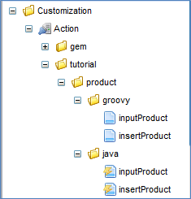
