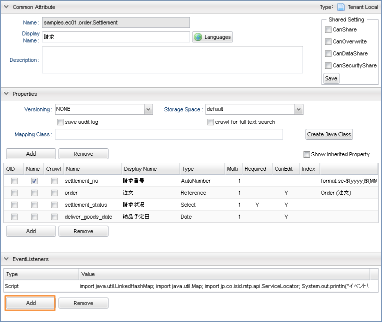

////
ecsampleに関する部分を分離
////

=== 汎用画面への組み込み
.今回実現したいこと
基本カスタマイズで作成したようなオリジナルのTemplate（JSP）を汎用画面に組み込み、利用可能な状態にします。（iPLAss標準のデザイン及び画面遷移を適用します） +
※「カスタマイズ手順（Groovy）」シートからの差分箇所は　　　　　　で囲まれています。基本カスタマイズで実装した機能で組み込みを行いたい場合は、該当箇所のみを適用ください。 +
 +
本チュートリアルではiPLAssが提供しているsample-01を用いた解説となります。実装済みの各機能を参考に作り方を学習してください。sample-01については、「カスタマイズについて」シートの１をお読みください。（チュートリアル（基本編）で作成したEntitiyは利用しないので注意してください。） +

.対応後の表示例

.処理説明
* 本機能の処理フロー +
+

+
iPLAssではActionに実行するコマンドや遷移先の情報がまとまっています。そのため、説明順序もCommand/Template（個別定義）→Action（定義の紐付け）の順に説明していきます。

* 初期表示処理 +
アクセス～画面表示までの実装を説明します。

** Commandの実装 +
+
[cols="1,2"]
|===
h|Name|samples/ec01/backoffice/StockBulkViewCommand
h|DisplayName|在庫一括表示
h|Type|Script
|===
+
image::images/builtin_edit-command.png[]
+
[source, groovy]
----
import org.iplass.mtp.entity.query.Query;

def productList = em.searchEntity(Query.newQuery("select oid, name, stock_cnt from samples.ec01.products.Product")).getList();

request.setAttribute("productList", productList);
----
+
NOTE: 初期画面表示のための処理を行います。本チュートリアルでは、画面表示時に現在登録されている商品と商品の在庫数を表示しています。EntityManagerを利用して商品Entityから情報を取得し、結果をrequestにセットします。

** Templateへの実装 +
+
[cols="1,2"]
|===
h|Name|samples/ec01/backoffice/StockUpdate
h|DisplayName|
h|Type|GroovyTemplate
h|Layout Action|defaultLayout(標準レイアウト)
|===
+

+
※TemplateをXMLで定義している場合は、下記の記述になります。（[カスタマイズ手順（Java・JSP）]シート　２．②　からの差分）
+
[source]
----
<?xml version="1.0" encoding="UTF-8" standalone="yes"?>
<!DOCTYPE metaDataList>
<metaDataList>
  <contextPath name="/template">
    <metaDataEntry>
      <metaData xmlns:xsi="http://www.w3.org/2001/XMLSchema-instance" xsi:type="metaJspTemplate">
        <name>tutorial/product/java/bulkInsert</name>
        <displayName>BulkInsert</displayName>
        <path>/jsp/tutorial/product/bulkInsert.jsp</path>
        <contentType>text/html; charset=utf-8</contentType>
        <layoutId>/action/gem/layout/defaultLayout</layoutId> <1>
      </metaData>
    </metaDataEntry>
  </contextPath>
</metaDataList>
----
+
<1> <layoutId>要素を追加します。
+
[source, jsp]
----
<1>

<2>
<h2 class="hgroup-01">

在庫一括更新</h2>
<2>
<form id="bulkForm" method="post" action="">
<3>

<ul class="list-flat-01 edit-bar">
<li class="btn insert-btn"><input type="button" class="gr-btn" value="一括更新" onclick="button_onclick('samples/ec01/backoffice/doStockUpdate')" /></li>
</ul>

<!--lyt-edit-01-->
<3>

<table class="tbl-data-02 vertical-table" cellspacing="0" width="100%"> <4>
<thead>
<tr>
<th style="width: 500px;">商品名</th>
<th style="width: 100px;">在庫数</th>
</tr>
</thead>
<tbody>
<%for (def product : request.getAttribute("productList")) { <5>
def stock = 0;
if (product.stock_cnt != null) {
stock = product.stock_cnt;
}
%>
<tr style="border:1px solid #cccccc;">
<td>${product.name}</td>
<td><input type="text" value="${stock}" name="${product.oid}" size="3"></td>
</tr>
<%}%>
</tbody>
</form>
</table>
----
<1> <html>からの記述を削除します。
<2> タイトルを利用する場合は、こちらのソースを個別に記載します。
<3> ボタンを利用する場合は、こちらのソースを個別に記載します。
<4> tableにクラス要素を追加します。 +
    ※隔行で色を付けたい場合は、クラス要素に「tableStripe」を追加することで適用されます。
<5> Command内でリクエストへ設定した商品カテゴリEntityの情報をループで表示します。

** Actionの実装 +
+
[cols="1,2"]
|===
h|Name|samples/ec01/backoffice/stockUpdate
h|Display Name|在庫一括更新
h|Excute Commands|在庫一括表示
h|Status Result Actions|Status：* +
Type：Template +
Template：（samples/ec01/backoffice/StockUpdate）
|===
+

+

* 更新処理 +
更新ボタン押下～更新後の表示までの実装を説明します。

** Commandの実装 +
+
[cols="1,2"]
|===
h|Name|samples/ec01/backoffice/StockBulkUpdateCommand
h|Display Name|在庫一括更新
h|Type|Script
|===
+

+
[source, groovy]
----
import org.iplass.mtp.entity.query.Query;
import org.iplass.mtp.entity.UpdateOption;

// 更新処理
def ite = request.getParamNames(); <1>
while (ite.hasNext()) {
    String key = ite.next();
    String value = request.getParam(key);

    def target = em.load(key, "samples.ec01.products.Product");

    target.setValue("stock_cnt", new Integer(value));

    UpdateOption option = new UpdateOption(false);
    option.setUpdateProperties("stock_cnt");
    em.update(target, option);
}

// 更新後の値を取得
def productList = em.searchEntity(Query.newQuery("select oid, name, stock_cnt from samples.ec01.products.Product")).getList(); <2>

request.setAttribute("productList", productList);
----
<1> 更新処理を行います。 +
取得したリクエスト情報の１行ずつに対し、EntityManagerを利用して元の情報をロード、その後在庫数の更新をします。
<2> 更新後は最新の情報を再取得後、、結果をrequestにセットします。

** Templateの実装 +
初回表示画面と更新後の表示画面は同一のため、省略します。

** Actionの実装 +
+
[cols="1,2"]
|===
h|Name|samples/ec01/backoffice/doStockUpdate
h|Display Name|在庫一括更新実施
h|Excute Commands|samples/ec01/backoffice/StockBulkUpdateCommand
h|Status Result Actions|Status：* +
Type：Template +
Template：（samples/ec01/backoffice/StockUpdate）
|===

=== フルカスタマイズ

==== フルカスタマイズ概要
.今回実現したいこと
一般ユーザーが訪れ、書籍を購入する為の画面を作成します。現在配布しているsample-01は以下のような画面構成となっています。画面、処理、ともにオレンジ色の部分について解説していきます。
+

.操作手順
各画面、機能について以下の手順で作業を実施していきます。 +
 +
（１）．Templateの作成 +
 +
（２）．Commandの作成 +
 +
（３）．Actionの作成 +

==== 画面表示と検索処理

.ここで作成する機能について
画面、処理、ともにオレンジ色の部分について解説していきます。

.TOP画面の作成
サイトのトップ画面です。この画面では以下を満たす必要があります。 +
 +
・TOP画面の表示 +
・検索条件の入力、検索結果の表示 +
 +
それぞれについて説明していきます。

* Templateの作成 +
Top画面の構成は下図のようになっています。全画面共通で利用するレイアウト用テンプレート"index"を用意し、画面右部分はそれぞれの機能に併せて呼びだすようにしています。ここでは"top"テンプレートを呼び出して利用しています。
+

+
レイアウト用テンプレート（Templateのsamples/01/indexを参照）
+

+
Top用テンプレート（Templateのsamples/01/topを参照）
+

+
[NOTE]
====
テンプレートを読み込む側（この例だとIndexテンプレート）では、読みこんだテンプレートを表示したい箇所に +
 +
<%renderContent(); %> +
 +
を記述します。また、読みこまれる側（この例だとTop用テンプレート）では読みこむ側のテンプレートを呼び出すActionを"Layout Action"として指定します。
====
+
検索処理はWebApiを利用して実施します。以下はTop用テンプレートの検索処理部分の抜粋となります。
+
[NOTE]
====
サンプルで作成している全文検索用コマンドを利用します。ここではキーワードとカテゴリをパラメータとしてWebApiにわたし、全文検索コマンドを実行しています。 +
 +
※WebApiの詳細については「22_チュートリアル（WebApi編）.xlsx」を参照下さい。
====
+
[source, javascript]
.WebApiによる検索処理
----
function getEntityList(categoryOid, productName) {
  var param = "{\"keyword\":\"" + productName;

  if (categoryOid != "all") {
    param += "category.oid = " + categoryOid + " and ";
  }
  param += "name like '%" + productName + "%' " + "\"}";

  \$.ajax({
    type: "POST",
    contentType: "application/json",
      url:"${contextPath}/samples/ec01/fulltextSearch",
      dataType: "json",
    data: param,
    success: function(commandResult){
      if (commandResult.exceptionType != null) {
        alert("エラーが発生しました。"+ commandResult.exceptionType +"\\n"+commandResult.exceptionMessage);
        return;
      }

      var entities = commandResult.results.defaultResult;

      \$("#result").html(listEntity(entities));
    }
  });
}
----
+
[source, groovy]
.全文検索コマンド
----
import org.iplass.mtp.entity.Entity;
import org.iplass.mtp.entity.query.Query;
import org.iplass.mtp.impl.webapi.WebApiRequestContext;

// getValueMapする為にWebApiRequestContextに変換
WebApiRequestContext apiRequest = (WebApiRequestContext) request;
def productName = apiRequest.getValueMap().getParam("productName");
def categoryOid = apiRequest.getValueMap().getParam("categoryOid");

def queryString = "select oid, name, product_img from samples.ec01.products.Product where ";
if (categoryOid != "all") {
    queryString += "category.oid = '" + categoryOid + "' and ";
}
queryString += "name like '%" + productName + "%'";

Query query = Query.newQuery(queryString);

List<Entity> entityList = em.searchEntity(query).getList();

// 実行結果をdefaultResultとしてセットする
apiRequest.setAttribute("defaultResult", entityList);
----
+
[source, javascript]
.検索結果描画処理
----
function listEntity(entities) {
    var html = "
検索結果
";
      html += "
該当：" + entities.length + "件
";
    html += "<table width='505' border='0' cellspacing='0' cellpadding='0' class='item_table'>";
    var cnt = 0;
    for (var i=0; i<entities.length; i++) {
        var value = entities[i]['properties'];
        var lobId = value['product_img']['lobId'];
        var name = value['product_img']['name'];
        cnt +=1;
        if (cnt == 1) {
            html += "<tr>";
        }
        html += "<td class='center8' width='33%'>";
        html += "

"
        html += "
<a href='${contextPath}/samples/ec01/detail?productId=" + entities[i].properties.oid + "'>" + entities[i].properties.name + "</a>
";
        html += "</td>";
        if (cnt == 3) {
            html += "</tr>";
            cnt = 0;
        }
    }
       html += "</table>";
    return html;
}
</script>
----
+
※ソースについては直接ご確認下さい。

* Commandの作成 +
ここで作成するコマンドは以下の３つとなります。 +
 +
・レイアウト用テンプレートのデータ取得コマンド +
・Top画面用データ取得コマンド

** レイアウト用テンプレートのデータ取得コマンド +
レイアウト用として必要な、サイト概要（ヘッダ部で利用）、カテゴリ（画面左ペインで利用）、カートの中身（画面左ペイン上部）の情報を取得し、requestにsetAttributeしています。（Commandのsamples/01/IndexCommandを参照）
+

+
[source, groovy]
----
import org.iplass.mtp.entity.query.Query;
import org.iplass.mtp.web.template.TemplateUtil;
import org.iplass.mtp.entity.query.condition.predicate.Equals;
import samples.ec01.Cart;//UtilityClass参照

//サイト概要の検索
def language = "ja";
if(TemplateUtil.getLanguage() != null) language = TemplateUtil.getLanguage();
def shopInfo = em.searchEntity(
       new Query().select("shop_name", "shop_name_sub", "shop_Introduction", "shop_img", "language").from("samples.ec01.basic.Shop").where(new Equals("language", language))).getList();
if (shopInfo.size() > 0) {
    request.setAttribute("shopInfo", shopInfo.get(0));
}

// カテゴリの検索
def cateList = em.searchEntity(
        new Query().selectDistinct("oid", "name").from("samples.ec01.products.Category")).getList();
if (cateList.size() > 0) {
    request.setAttribute("cateList", cateList);
}

<1>
// セッション情報からカートの中身の金額をセットする
def cart = request.getSession().getAttribute("cart");
int totalAmount = 0;
int totalPrice = 0;
if (cart != null) {
    totalAmount = cart.getTotalAmount();
    totalPrice = cart.getTotalPrice();
}
<1>

request.setAttribute("totalAmount", totalAmount);
request.setAttribute("totalPrice", totalPrice);
----
<1> 商品ページ内の「カートに入れる」ボタンによる処理によってセッション情報に注文内容が格納されています。ここで格納されている情報を取得します。

** Top画面用データ取得コマンド +
Ｔｏｐ画面として必要な、おすすめ商品の情報、新着情報、検索プルダウン用のカテゴリ情報を取得し、requestにsetAttributeしています。（Commandのsamples/01/TopCommandを参照）
+

+
[source, groovy]
----
import org.iplass.mtp.entity.query.Query;
import org.iplass.mtp.web.template.TemplateUtil;
import org.iplass.mtp.entity.query.condition.predicate.Equals;

// オススメ商品の検索
def productList = em.searchEntity(
        new Query().selectDistinct("oid", "name", "product_img").from("samples.ec01.products.Product").where(new Equals("recomend", true))).getList();
if (productList.size() > 0) {
    request.setAttribute("productList", productList);
}
request.setAttribute("productEntityDefinition", edm.get("samples.ec01.products.Product"));

// 新着情報の検索
def newInfoList = em.searchEntity(
        new Query().select("show_date", "content").from("samples.ec01.NewInfo")).getList();
if (newInfoList.size() > 0) {
    request.setAttribute("newInfoList", newInfoList);
}

// カテゴリの検索（検索窓で利用）
def cateList = em.searchEntity(
        new Query().selectDistinct("oid", "name").from("samples.ec01.products.Category")).getList();
if (cateList.size() > 0) {
    request.setAttribute("cateList", cateList);
}
----

* Actionの作成 +
ここで作成するアクションは以下の３つとなります。 +
 +
・レイアウト用テンプレート表示用アクション +
・Top画面表示用アクション +
尚、"Privilege exute"にチェックをいれて特権モードにすると、登録していないユーザーにも公開できます。レイアウトテンプレートに関してはパーツとしての利用になる為"IsPars"にチェックをいれます。コマンド、テンプレートの設定については（１）、（２）で作成したものをそれぞれ設定します。

** レイアウトテンプレート表示用アクション（Actionのsamples/01/indexを参照） +
+

** Top画面表示用アクション（Actionのsamples/01/topを参照） +
+

.商品詳細画面の作成
商品詳細画面です。この画面では以下を満たす必要があります。 +
 +
・商品詳細画面の表示 +
Top画面もしくは検索結果画面からクリックされた商品の詳細情報を表示する。

* Templateの作成 +
商品詳細画面の構成は下図のようになっています。Topg面同様"レイアウト"テンプレートを利用し、画面右部分はそれぞれの機能に併せて呼びだすようにしています。ここでは"商品詳細画面"テンプレートを呼び出して利用しています。

** 商品詳細画面テンプレート +

+
（Templateのsamples/01/detailを参照）
+

* Commandの作成 +
ここで作成するコマンドは以下となります。 +
 +
・商品画面用データ取得コマンド

** 商品画面用データ取得コマンド +
レイアウトとして必要な、サイト概要（ヘッダ部で利用）、カテゴリ（画面左ペインで利用）、カートの中身（画面左ペイン上部）の情報を取得し、requestにsetAttributeしています。（Commandのsamples/01/IndexCommandを参照）
+

+
[source, groovy]
----
import org.iplass.mtp.entity.definition.PropertyDefinition;
import java.util.ArrayList;
import java.util.List;

String productId = request.getParam("productId");

// 対象カテゴリの商品一覧の検索
def productInfo = em.load(productId, "samples.ec01.products.Product");
request.setAttribute("productInfo", productInfo);

List subInfoList = new ArrayList();
for (def sub : productInfo.getValue("sub_info")) {
    def temp = em.load(sub.getOid(), "samples.ec01.products.ProductSubInfo");
    subInfoList.add(temp);
}
request.setAttribute("subInfoList", subInfoList);

// 商品エンティティに追加プロパティがないか確認する為のDefinitionを取得
List defaultPropList = new ArrayList();
defaultPropList.add("oid");
defaultPropList.add("version");
defaultPropList.add("name");
defaultPropList.add("description");
defaultPropList.add("state");
defaultPropList.add("deleted");
defaultPropList.add("startDate");
defaultPropList.add("endDate");
defaultPropList.add("lockedBy");
defaultPropList.add("createDate");
defaultPropList.add("updateDate");
defaultPropList.add("createBy");
defaultPropList.add("updateBy");
defaultPropList.add("category");
defaultPropList.add("sale_status");
defaultPropList.add("product_img");
defaultPropList.add("price");
defaultPropList.add("price_without_tax");
defaultPropList.add("reg_info");
defaultPropList.add("stock_cnt");
defaultPropList.add("sub_info");

def ped = edm.get("samples.ec01.products.Product");
List addPropList = new ArrayList();
for (PropertyDefinition pd : ped.getPropertyList()) {
    // デフォルトのプロパティ以外は別で保存する
    if (!defaultPropList.contains(pd.getName())) {
        addPropList.add(pd);
    }
}

request.setAttribute("addPropList", addPropList);
----

* Actionの作成 +
ここで作成するアクションは以下の３つとなります。 +
 +
・商品画面表示用アクション +
 +
Top同様、認証処理を必要としない画面の為、"Privilege exute"にチェックを入れ、特権モードとして実行可能なアクションとします。コマンド、テンプレートの設定については（１）、（２）で作成したものをそれぞれ設定します。

** 商品画面表示用アクション（Actionのsamples/01/deteilを参照） +
+

==== セキュリティ対策

.ここで作成する機能について
画面、処理、ともにオレンジ色の部分を例にセキュリティ対策を解説していきます。

.セキュリティ対策について
ここでは会員登録を例にiPLAssで利用できる以下のセキュリティ対策について説明します。 +
 +
・ ＄エスケープ機能　　XSS対策 ： ユーザーの入力内容を正常に画面表示させる +
・ TokenCheck機能　　CSRF対策/トランザクション重複起動対策 ： 画面表示時に正常な画面遷移が行われているかをチェックする +
 +
会員登録処理の中でそれぞれの機能は下記のように利用されます。

* ＄エスケープの導入 +
Templateの作成 +
入力された値を出力する会員情報確認画面にて、該当箇所に＄エスケープを導入する +
 +
会員情報確認画面テンプレート +
（Templateのsamples/01/confirmMemberInfoを参照）
+
image::images/fullcustomize_edit-template4.png[]
+
[source, jsp]
----
<table summary=" ">
<%
    def userId = request.getParam("user_id")
    def familyName = request.getParam("family_name")
    def firstName = request.getParam("first_name")
    def familyNameKana = request.getParam("family_name_kana")
    def firstNameKana = request.getParam("first_name_kana")
    def mail = request.getParam("mail")
%>
<tbody>
    <tr>
        <th>ユーザーID※</th>
        <td>$h{userId}</td> <1>
        <input type="hidden" name="user_id" value="$h{userId}"> <1>
    </tr>
    <tr>
        <th>お名前※</th>
        <td>
        姓&nbsp;$h{familyName}&nbsp; <1>
        名&nbsp;$h{firstName}
        </td>
        <input type="hidden" name="family_name" value="${familyName}"> <1>
        <input type="hidden" name="first_name" value="$h{firstName}"> <1>
    </tr>
    <tr>
        <th>お名前(フリガナ)※</th>
        <td>
            セイ&nbsp;$h{familyNameKana}&nbsp;
            メイ&nbsp;$h{firstNameKana}
        </td>
        <input type="hidden" name="family_name_kana" value="$h{familyNameKana}"> <1>
        <input type="hidden" name="first_name_kana" value="$h{firstNameKana}"> <1>
    </tr>
    <tr>
        <th>メールアドレス※</th>
        <td>
            $h{mail} <1>
        </td>
        <input type="hidden" name="mail" value="$h{mail}"> <1>
    </tr>

</table>
----
<1> 今回は出力先がHTML形式であるため全て$h{変数名}の形式でエスケープを行っている
+
GroovyTemplateではユーザーによって入力された値を正常に表示させるため以下の記述によってhtml,js,sqlエスケープが可能です。
+
|===
h|エスケープ無し|${hogehoge}
h|htmlエスケープ|$h{hogehoge}
h|jsエスケープ|$j{hogehoge}
h|sqlサニタイズ|$s{hogehoge}
h|sql（LIKE）サニタイズ|$sl{hogehoge}
|===

* TokenCheckの導入 +
この機能では、iPLAssで実装されている正常に画面遷移してきたことを証明する"Token"というオブジェクトを利用します。不正な画面遷移を禁止するActionでTokenをチェックすることにより、正常な画面遷移が行われたかを判断します。

** Actionの設定 +
不正な画面遷移を禁止するActionでTokenをチェックする設定を行います。 +
 +
会員情報確認画面アクション（Actionのsamples/01/confirmMemberInfoを参照）
+

+
以下の設定が可能です。
+
|===
h|TokenChack|Not Check チェックを行わない　Check チェックを行う
h|Fixed Token|チェック→セッション単位に固定に払いだされるTokenをチェックする
h|Token Consume|チェック→Tokenは再利用されません。
h|例外発生時にTokenを変更しない|チェック→現在のTokenを再設定
|===
+
この設定により直接この画面へ遷移するとエラーページが表示されます。
+
image::images/fullcustomize_tokenerror.png[]
+
** TemplateでTokenを作成 +
不正な画面遷移を禁止するActionへ遷移する画面でTokenを作成します。 +
 +
会員情報確認画面テンプレート（Templateのsamples/01/confirmMemberInfoを参照）
+

+
[source, jsp]
----
<%@import org.iplass.mtp.web.template.TemplateUtil%> <1>
<%@import org.iplass.mtp.entity.Entity%>

-----------------------------------------------省略------------------------------------------------

<form name="memberInfo" method="post" action="${contextPath}/samples/ec01/confirmMemberInfo">
<%=TemplateUtil.outputToken(TemplateUtil.TokenOutputType.FORM_XHTML)%> <1>
<table summary=" ">
    <tbody>
    <tr>
        <th>ユーザーID※</th>
        <td>
        <input type="text" name="user_id" style="; ime-mode: active;" class="box120" value=$h{user_id}>
        <%if(user_id_error != null && "IS_BLANK".equals(user_id_error)){%>
             
値を入力してください

----
<1> TmplateUtilクラスを利用してトークンを作成します。

==== 多言語対応テンプレート

.ここで作成する機能について
画面、処理、ともにオレンジ色の部分について解説していきます。
+

+
.多言語対応テンプレートの作成

ここでは以下の２つ作業を行うことで、同じURLで異なるページを表示させることが可能になります。 +
 +
（ⅰ）．多言語用テンプレートの作成 +
（ⅱ）．多言語設定と言語選択
+

* 多言語用テンプレートの作成 +
テンプレート画面のMutilingualAttributeを開きAddボタンより日本語用・英語用テンプレートを作成します。 +
※指定した言語のテンプレートが存在しないときには、あらかじめ作成しているテンプレートが表示されます。（Templateのsamples/01/indexを参照）
+

+
image::images/fullcustomize_edit-template-multilang6.png[]
+
[source, jsp]
----
<!--現在のカゴの中******************************** -->

Your Cart
 <1>

Total quantity：<%=request.getAttribute("totalAmount")%>
 <1>

Total value：<%=request.getAttribute("totalPrice")%>Yen
 <1>

<a href="${contextPath}/samples/ec01/cartInfo">Check cart</a>
 <1>

<!--******************************** -->

<!--カテゴリ******************************** -->

Category
 <1>
<%if (request.getAttribute("cateList") != null) {%>
<ul>
    <%for (Entity e: (List<Entity>) request.getAttribute("cateList")) %>
</ul>
<%}%>

<!--******************************** -->

<!--お買い物ガイド******************************** -->

Shopping　Guide
 <1>
----
<1> 画面に表示される文字を全て英語に書き換えておく。

* 多言語設定と言語選択
多言語化設定を有効にします。Bで言語選択した言語に合わせ、サイトので表示されるテンプレートが変更されます。

** テナントの多言語設定より、多言語利用を「利用する」、利用可能言語で「日本語」、「English」を選択して保存
+

** 汎用画面での多言語設定 +
管理画面のみで利用可能です。下図のように言語選択がメニューに表示されます。言語を選択後、次遷移の画面から選択言語が有効になります。
+

==== UtilityClassの作成
.ここで作成する機能について

画面、処理、ともにオレンジ色の部分を解説していきます。

.UtilityClassついて
ここではAdminConsoleで作成できるUtilityClassの利用方法を解説します。サンプルサイトでは以下の画面でカート情報を取り扱う機能が必要となります。 +
 +
・お問合せ画面 +
・カートの中（商品個数の更新） +
・会員用配送情報入力画面 +
・非会員用配送情報入力画面 +
・会員登録情報入力 +
 +
利用が多い機能をUtilityClassに実装して、各画面から利用する方法を解説していきます。

* UtilityClassの作成　※サンプルサイトでは既に作成済みです +
MetaDataSettings　>　UtilityClass　>　UtilityClassを作成する
+

+
UtilityClass作成の際には以下を実装するようにしてください。 +
 +
・packageの定義（必須となります） +
・Serializableの実装（作成したクラスをSessionに格納する場合） +
 +
（UtilityClassのsamples/01/Cartを参照）
+

+
[source, groovy]
----
package samples.ec01; <1>

import java.io.Serializable; <2>
import java.util.ArrayList;
import java.util.List;

import org.iplass.mtp.ManagerLocator;
import org.iplass.mtp.entity.EntityManager;

public class Cart implements Serializable  { <2>

    private static final long serialVersionUID = -1638179609256419788L;
　　private List<CartItem> cartInfo = new ArrayList<CartItem>();
    private EntityManager em = null;

    //コンストラクタ
    public Cart(){
        this.em = ManagerLocator.manager(EntityManager.class);
    }

    //カートに商品を追加
　　public void addCartItem(String productId){
　　　　for(CartItem item: this.cartInfo){

　　　　　　//商品が既に追加されていたらValueを１増加
　　　　　　if(item.getProductId().equals(productId)){
　　　　　　　　item.setValue(item.getValue() + 1);
	　　return;
　　　　　　}
　　　　}

　　　　//商品が無かった場合には初期値１が入ったCartItemを追加
　　　　this.cartInfo.add(new CartItem(productId));
　　}

----------------------------------------以下略----------------------------------------
----
<1> package階層はUtilityClassを作成した階層と同一を指定します。
<2> serialVersionUIDを忘れずに定義してください。 +
不整合を起こす原因となる可能性があります。

* UtilityClassの利用 +
新たに商品をカートに追加するコマンドを例に、UtilityClassの利用法を説明します。 +
 +
カートに入れるコマンド（Commandのsamples/ec01/InputCartInfoCommandを参照）
+

+
[source, groovy]
----
import org.iplass.mtp.command.Command;
import org.iplass.mtp.command.RequestContext;
import samples.ec01.Cart;//UtilityClass参照 <1>
import samples.ec01.CartItem;//UtilityClass参照

public final class inpuCartInfoCommand implements Command {
    public static final String ACTION_NAME = "gem/binary/upload";

    @Override
    public String execute(RequestContext request) {

        String productId = request.getParam("productId");
        def cart = request.getSession().getAttribute("cart"); <2>

        if (cart == null) {
            synchronized(request.getSession()){
                cart = request.getSession().getAttribute("cart");
                if (cart == null){
                    cart = new Cart();
                    request.getSession().setAttribute("cart", cart);
                }
            }
        }
        int value = 0;

        <3>
        //Cartを排他制御
        synchronized(cart){
                cart.addCartItem(productId)
                request.setAttribute("redirectPath", "cartInfo");
        }
        <3>
        for(int i = 0; i < cart.getCartSize(); i++){
            def cartItem = cart.getCartItem(i);
            System.out.println("cartItem"+i+":"+cartItem.getProductId());
            def e = cartItem.getProduct();
            System.out.println("cartItemOid"+i+":"+e.oid);
        }
    }
}
----
<1> UtilityClassで作成したクラスも他のクラスと同じように利用できます
<2> このようにSessionに格納して利用する場合には、Serializableを実装しないと不整合を起こす原因となる可能性があります。
<3> Cartオブジェクトは同期をとって利用したいためSynchronizedを使用しています。

==== データ登録とワークフロー
.ここで作成する機能について
画面、処理、ともにオレンジ色の部分について解説していきます。

.データ登録処理の作成

「配送情報確認」画面からパラメータを受け取り、データ登録をするCommandを作成します。「配送情報確認」「完了」画面のテンプレート、アクションについての説明は割愛します。（「画面表示と検索処理」シートとサンプルのソースを参考にして下さい。）

* Commandの作成 +
ここで作成するコマンドは以下となります。 +
 +
・注文コマンド +
→注文を完了する為に、「注文」「注文明細」「請求」の各Entityに対して入力パラメータを登録するコマンド

** レイアウトテンプレート用データ取得コマンド
+
image::images/fullcustomize_edit-command6.png[]
+
[source, groovy]
----
import java.text.ParseException;
import java.text.SimpleDateFormat;
import org.iplass.mtp.entity.SelectValue;
import org.iplass.mtp.entity.Entity;
import org.iplass.mtp.entity.GenericEntity;
import org.apache.commons.lang.time.DateUtils;
import org.iplass.mtp.entity.UpdateOption;
import samples.ec01.Cart;
import org.iplass.mtp.util.DateUtil;

// セッションから注文内容を取得
def cart = request.getSession().getAttribute("cart"); <1>

<2>
// 注文の登録
Entity order = new GenericEntity();
order.setDefinitionName("samples.ec01.order.Order");
Date sysdate = DateUtil.getCurrentDate();
order.setValue("order_date", sysdate);
order.setValue("customer", request.getParam("family_name") + request.getParam("first_name"));
order.setValue("address", request.getParam("address"));
order.setValue("tel", request.getParam("tel"));
order.setValue("mail", request.getParam("mail"));

String oid = em.insert(order);
Entity orderEntity = em.load(oid, "samples.ec01.order.Order");
String orderNo = orderEntity.getValue("order_no");
<2>

<3>
// 注文明細の登録
List orderItemOidList = new ArrayList();
for(int i = 0; i < cart.getCartSize(); i++){
    def cartItem = cart.getCartItem(i);
    Entity product = cartItem.getProduct();

    Entity orderItem = new GenericEntity();
    orderItem.setDefinitionName("samples.ec01.order.OrderItem");
    orderItem.setName(orderNo + "-" + (i+1));
    orderItem.setValue("product", product);
	orderItem.setValue("quantity", String.valueOf(cartItem.getValue()));
    orderItem.setValue("order_date", sysdate);
	String oderItemOid = em.insert(orderItem);
	orderItemOidList.add(oderItemOid);
}
<3>

<4>
// 注文の更新（注文明細を注文にセット）
List orderItemList = new ArrayList();
for (Object obj : orderItemOidList) {
	Entity orderItem = em.load((String) obj, "samples.ec01.order.OrderItem");
	orderItemList.add(orderItem);
}
orderEntity.setValue("order_item", orderItemList.toArray(new Entity[orderItemList.size()]));
UpdateOption option = new UpdateOption(false);
option.setUpdateProperties("order_item");
em.update(orderEntity, option);
<4>

<5>
// 請求の登録
Entity settle = new GenericEntity();
settle.setDefinitionName("samples.ec01.order.Settlement");
settle.setName("demo");
Entity refOrder = em.load(oid, "samples.ec01.order.Order");
settle.setValue("order", refOrder);
settle.setValue("settlement_status", new SelectValue("0"));
em.insert(settle);
<5>

request.getSession().setAttribute("cart", null);<6>
----
<1> 商品ページ内の「カートに入れる」ボタンによる処理によってセッション情報に注文内容が格納されています。ここで格納されている情報を取得します。
<2> 配送情報入力画面で入力されたパラメータをもとに注文Entityにデータを作成します。また、この後の処理で、本Entityデータを更新する必要がある為、登録されたEntityデータを保持しておきます。
<3> カートに入っている注文情報をもとに、商品ごとに注文明細を登録しています。
<4> 登録した注文情報の注文明細プロパティ（参照プロパティ）に、今回登録対象となる注文明細をセットし更新しています。
<5> 更新が完了した注文情報を利用し、請求情報を登録します。
<6> 注文完了時にセッションの中に格納されているカート情報を初期化しています。

.ワークフローの起動処理
注文が完了した場合には、注文者へ確認のメール送信を行う必要があります。そこで、請求Entityにデータが登録されると同時に、ワークフローを起動し、また、ワークフローを用いてメールを送信するように設定、処理を記述していきます。流れとしては下図のようになります。

* リスナーへの起動処理登録 +
請求Entityにデータが登録された際のカスタム処理を実現するにはいイベントリスナーを利用すると便利です。今回は請求Entityにデータが登録された後の追加処理なので、"afterInsert"にチェックをいれ、スクリプトを記述します。
+

+

+
[source, groovy]
.ワークフローの起動
----
import java.util.LinkedHashMap;
import java.util.Map;
import org.iplass.mtp.ManagerLocator;

<1>
def wm = ManagerLocator.manager(WorkflowManager.class);
<1>

<2>
Map<String, Object> parameters = new LinkedHashMap<String, Object>();
parameters.put("settlement", entity);
parameters.put("mail", entity.order.mail);
<2>

wm.startProcess("samples/ec01/order_processing", parameters);<3>
----
<1> ManagerLocatorを利用しWorkflowManagerのインスタンスを取得します。WorkfloManagerを用いて、ワークフローの起動を行います。
<2> 送信先メールアドレス、タスク名の指定で利用する為に登録されたエンティティデータをワークフロー用のパラメータとして作成します。
<3> ワークフロー名とパラメータを指定して、WorkflowManagerのstartProcessを実行し、ワークフローを起動します。
+

+
※ワークフローの詳細については「19_iPLAss_reference_(under maintenance).xlsx」のWorkFrowシートをご参照下さい。
