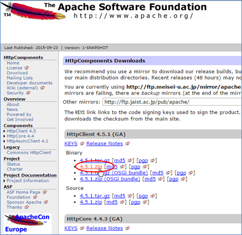
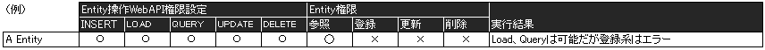
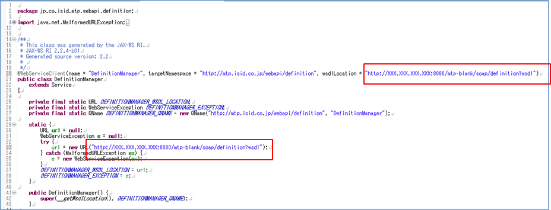

== チュートリアル（WebApi）

=== サンプルについて
.サンプルについて
このチュートリアルで実装するコードを「mtp-sample-webapi01」として提供しています。チュートリアルを実行する上で参考にしてください。

* 構成 +
サンプルは３つに分かれています。 +
 +
・metadata +
チュートリアルで作成するメタデータ定義をエクスポートしたものです。MetaDataExplorerからインポートすることができます。 +
 +
・mtp-webapi01-rest-client.zip +
REST系のチュートリアルサンプルプロジェクトです。 +
 +
・mtp-webapi01-soap-client.zip +
SOAP系のチュートリアルサンプルプロジェクトです。 +

** metadata +
・sample-webapi01-metadata.xml +
チュートリアル（Javaクライアントとの通信）で作成するメタデータ定義です。Entity定義(EntityMenuItem含む)、WebApi定義、Command定義が含まれています。それぞれのメタデータの名前には「ex」が付いています。（自身で作成するものと被らないように）
+
image::images/webapi_metadata.png[]
+
・sample-webapi01-js-metadata.xml +
チュートリアル（JavaScriptクライアントとの通信）で作成するメタデータ定義です。Action定義とTemplate定義が含まれています。それぞれのメタデータの名前には「ex」が付いています。（自身で作成するものと被らないように）
+

** mtp-webapi01-rest-client.zip +
REST系のチュートリアルサンプルプロジェクトです。
+
[source]
----
mtp-webapi01-rest-client
│
│  .classpath
│  .project
│
├─.settings
│      org.eclipse.core.resources.prefs
│
├─bat <1>
│      00_readme.txt
│      environment.bat
│      xjc-command.bat
│      xjc-definition.bat
│      xjc-entity.bat
│
├─bin
│
├─download <2>
│      00_readme.txt
│
│
├─images <3>
│      00_readme.txt
│      iPLAssFW_LOGO_S.png
│      iPLAssFW_LOGO_SS.png
│
├─lib <4>
│      commons-codec-XXX.jar
│      commons-logging-XXX.jar
│      fluent-hc-XXX.jar
│      httpclient-XXX.jar
│      httpclient-cache-XXX.jar
│      httpcore-XXX.jar
│      httpmime-XXX.jar
│
│
├─schema <5>
│  │  00_readme.txt
│  │
│  └─restxml
│          ・・・・・・
│
├─src
│  │  00_readme.txt
│  │
│  ├─client <6>
│  │  │  Environment.java
│  │  │
│  │  └─rest
│  │      ├─binary
│  │      │  ├─download
│  │      │  │  └─ex
│  │      │  │          DownloadBinaryClient.java
│  │      │  │
│  │      │  └─upload
│  │      │      └─ex
│  │      │              UploadBinaryClientFromForm.java
│  │      │
│  │      ├─command
│  │      │  ├─form
│  │      │  │  └─ex
│  │      │  │          ExecuteCommandClientFromForm.java
│  │      │  │
│  │      │  ├─json
│  │      │  │  └─ex
│  │      │  │          ExecuteCommandClientFromJson.java
│  │      │  │
│  │      │  └─xml
│  │      │      └─ex
│  │      │              ExecuteCommandClientFromXml.java
│  │      │              GenerateWebApiParameterXmlForExecuteCommand.java
│  │      │
│  │      ├─definition
│  │      │  ├─load
│  │      │  │  └─ex
│  │      │  │          LoadDefinitionClient.java
│  │      │  │
│  │      │  └─update
│  │      │      ├─json
│  │      │      │  └─ex
│  │      │      │          UpdateDefinitionClientFromJson.java
│  │      │      │
│  │      │      └─xml
│  │      │          └─ex
│  │      │                  GenerateDefinitionEntryXmlForDefinitionUpdate.java
│  │      │                  UpdateDefinitionClientFromXml.java
│  │      │
│  │      └─entity
│  │          ├─load
│  │          │  └─ex
│  │          │          LoadEntityClient.java
│  │          │
│  │          └─update
│  │              ├─json
│  │              │  └─ex
│  │              │          UpdateEntityClientFromJson.java
│  │              │
│  │              └─xml
│  │                  └─ex
│  │                          GenerateWebApiParameterXmlForEntityUpdate.java
│  │                          UpdateEntityClientFromXml.java
│  │
│  ├─jp
│  │  └─co
│  │      └─isid
│  │          └─mtp
│  │                   ・・・・・ <7>
│  │
│  └─net
│      └─java
│          └─dev
│              └─jaxb
│                  └─array
│                          ・・・・・
│
└─xml <8>
        00_readme.txt
        execCommandWebApiParameter.xml
        updateEntityDataWebApiParameter.xml
        updateEntityDefinitionEntry.xml
----
<1> REST XMLを利用する際に必要なxjc実行用のサンプルバッチファイル群 +
※environment.batに共通定義
<2> バイナリのダウンロード処理の出力先
<3> バイナリのアップロード処理で利用するファイル群
<4> HttpClientライブラリ。ライブラリの詳細は「クライアント開発環境の準備」を参照してください。
<5> REST XMLを利用する際に必要なschemaファイル格納先。もととなるファイルはmtp-blankに含まれています。
<6> サンプルソース +
※client.Environmentに共通定義
<7> client.パッケージ以外のクラスはxjc実行結果を格納したものです。
<8> REST XMLを利用する際のXMLパラメータファイル。サンプル内のJavaクラスを実行することで生成されます。
+
チュートリアルで利用する共通定義をclient.Environmentクラスに定義しています。
+
[source, java]
----
package client;

import java.nio.charset.Charset;

import org.apache.http.Consts;

/**
 * 
定数定義情報

 *
 * 

 * サンプルで共通的に利用する定数定義情報です。
 * 

 *
 */
public interface Environment {

	/** 接続先Host URL */
	String HOST_URL = "http://localhost:8080/mtp-blank/";

	/** テナント名 */
	String TENANT_NAME = "xxxxxx";

	/** ユーザーID */
	String USER_ID = "XXXXX";
	/** パスワード */
	String PASSWPRD = "XXXXX";

	/** レスポンスの文字コード */
	Charset CHARSET = Consts.UTF_8;

	//----------------------------------------
	//Entity定義名
	//----------------------------------------

	/** プロパティ多重度1のEntity */
	String SINGLE_ENTITY_NAME = "samples.webapi01.ex.SingleProp";

	/** プロパティ多重度5のEntity */
	String MULTI_ENTITY_NAME = "samples.webapi01.ex.MultiProp";

	/** Entity定義更新用のEntity */
	String CONTROLE_ENTITY_NAME = "samples.webapi01.ex.CtrlDefinition";

	//----------------------------------------
	//アップロード用バイナリファイル情報
	//----------------------------------------

	/** ディレクトリ */
	String UPLOAD_FILE_DIR = "./images";
	/** ファイル1 名 */
	String UPLOAD_FILE1_NAME = "iPLAssFW_LOGO_S.png";
	/** ファイル1 コンテントタイプ */
	String UPLOAD_FILE1_CONTENT_TYPE = "image/png";
	/** ファイル2 名 */
	String UPLOAD_FILE2_NAME = "iPLAssFW_LOGO_SS.png";
	/** ファイル2 コンテントタイプ */
	String UPLOAD_FILE2_CONTENT_TYPE = "image/png";

	//----------------------------------------
	//ダウンロード用バイナリファイル情報
	//----------------------------------------

	/** ディレクトリ */
	String DOWNLOAD_FILE_DIR = "./download";

	//----------------------------------------
	//REST XML用パラメータファイル情報
	//----------------------------------------

	/** ディレクトリ */
	String REST_XML_FILE_DIR = "./xml";

	/** Execute Command用XMLファイル名 */
	String EXEC_COMMAND_XML_FILE_NAME = "execCommandWebApiParameter.xml";

	/** Update Entityデータ用XMLファイル名 */
	String UPDATE_ENTITY_XML_FILE_NAME = "updateEntityDataWebApiParameter.xml";

	/** Update EntityDefinition用XMLファイル名 */
	String UPDATE_DEFINITION_XML_FILE_NAME = "updateEntityDefinitionEntry.xml";

}
----
+
REST XMLでアクセスする際に実行するxjc実行バッチの共通定義をenvironment.batに定義しています。
+
[source, bat]
----
@echo off

REM ----------------------------------
REM environment java home & xjc tool
REM ----------------------------------
SET JAVA_HOME="C:\Program Files\Java\jdk1.8.0_60" <1>
SET XJC_BIN=%JAVA_HOME%\bin\xjc

REM ----------------------------------
REM environment input/output directories
REM ----------------------------------
SET INPUT_DIR=.\..\schema\restxml <2>
SET OUTPUT_DIR=.\dest
----
<1> JAVA_HOME・・・・・JDK8がインストールされている場所 +
XJC_BIN・・・・・jdk付属のxjcの場所
<2> INPUT_DIR ・・・・・ shcemaファイル格納場所 +
OUTPUT_DIR ・・・・・ xjc実行結果出力場所

** mtp-webapi01-soap-client +
SOAP系のチュートリアルサンプルプロジェクトです。 +
+
[source]
----
mtp-webapi01-soap-client
│
│  .classpath
│  .project
│
├─bat <1>
│      00_readme.txt
│      environment.bat
│      wsimport-binary.bat
│      wsimport-command.bat
│      wsimport-definition.bat
│
├─bin
│
├─download <2>
│      00_readme.txt
│
│
├─images <3>
│      00_readme.txt
│      iPLAssFW_LOGO_S.png
│      iPLAssFW_LOGO_SS.png
│
│
├─lib <4>
│      webservices-api.jar
│      webservices-extra-api.jar
│      webservices-extra.jar
│      webservices-rt.jar
│      webservices-tools.jar
│
│
└─src
    │  00_readme.txt
    │
    ├─client <5>
    │  │  Environment.java
    │  │
    │  └─soap
    │      ├─binary
    │      │  ├─download
    │      │  │  └─ex
    │      │  │          DownloadBinaryClientFromWsdl.java
    │      │  │
    │      │  └─upload
    │      │      └─ex
    │      │              UploadBinaryClientFromWsdl.java
    │      │
    │      ├─command
    │      │  └─ex
    │      │          ExecuteCommandClientFromWsdl.java
    │      │
    │      └─definition
    │          ├─load
    │          │  └─ex
    │          │          LoadDefinitionClientFromWsdl.java
    │          │
    │          └─update
    │              └─ex
    │                      UpdateDefinitionClientFromWsdl.java
    │
    ├─jp
    │  └─co
    │      └─isid
    │          └─mtp
    │                   ・・・・・ <6>
    │
    ├─net
    │  └─java
    │      └─dev
    │          └─jaxb
    │              └─array
    │                      ・・・・・
    │
    └─org
        └─w3
            └─_2005
                └─_05
                    └─xmlmime
                            ・・・・・
----
<1> スタブファイルを作成する際に必要となるwsimport実行用のサンプルバッチファイル群 +
※environment.batに共通定義
<2> バイナリのダウンロード処理の出力先
<3> バイナリのアップロード処理で利用するファイル群
<4> metroライブラリ。ライブラリの詳細は「クライアント開発環境の準備」を参照してください。
<5> サンプルソース +
※client.Environmentに共通定義
<6> client.パッケージ以外のクラスはwsimport実行結果を格納したものです。
+
チュートリアルで利用する共通定義をclient.Environmentクラスに定義しています。
+
[source, java]
----
package client;

/**
 * 
定数定義情報

 *
 * 

 * サンプルで共通的に利用する定数定義情報です。
 * 

 *
 */
public interface Environment {

	/**
	 * 接続先Host URL
	 *
	 * 

	 * wsimportにより生成されるクラスにアドレスが直接出力されるため、実際には利用しません。
	 * (例えば、jp.co.isid.mtp.webapi.command.CommandInvoker)
	 * サンプル配布のためwsimportで出力されたクラスのアドレス部分を、この定義を参照するように変更しています。
	 * 

	 */
	String HOST_URL = "http://localhost:8080/mtp-blank/";

	/** テナント名 */
	String TENANT_NAME = "xxxxxx";

	/** ユーザーID */
	String USER_ID = "admin@" + TENANT_NAME;
	/** パスワード */
	String PASSWPRD = "admin123#";

	//----------------------------------------
	//Entity定義名
	//----------------------------------------

	/** プロパティ多重度1のEntity */
	String SINGLE_ENTITY_NAME = "samples.webapi01.ex.SingleProp";

	/** プロパティ多重度5のEntity */
	String MULTI_ENTITY_NAME = "samples.webapi01.ex.MultiProp";

	/** Entity定義更新用のEntity */
	String CONTROLE_ENTITY_NAME = "samples.webapi01.ex.CtrlDefinition";

	//----------------------------------------
	//アップロード用バイナリファイル情報
	//----------------------------------------

	/** ディレクトリ */
	String UPLOAD_FILE_DIR = "./images";
	/** ファイル1 名 */
	String UPLOAD_FILE1_NAME = "iPLAssFW_LOGO_S.png";
	/** ファイル1 コンテントタイプ */
	String UPLOAD_FILE1_CONTENT_TYPE = "image/png";
	/** ファイル2 名 */
	String UPLOAD_FILE2_NAME = "iPLAssFW_LOGO_SS.png";
	/** ファイル2 コンテントタイプ */
	String UPLOAD_FILE2_CONTENT_TYPE = "image/png";

	//----------------------------------------
	//ダウンロード用バイナリファイル情報
	//----------------------------------------

	/** ディレクトリ */
	String DOWNLOAD_FILE_DIR = "./download";

}
----
+
wsimport実行バッチの共通定義をenvironment.batに定義しています。
+
[source, bat]
----
@echo off

REM ----------------------------------
REM environment jdk & wsimport tool
REM ----------------------------------
REM not jre, specific jdk, greater or equal 1.5. and not "path".
SET JAVA_HOME=C:\Program Files\Java\jdk1.8.0_60 <1>
SET Path=%Path%;"%JAVA_HOME%\bin";
SET WSIMPORT_BIN=wsimport

REM ----------------------------------
REM environment host url
REM ----------------------------------
REM !!! For Windows7, failed to connect [localhost]. Please specify the IP address.
REM !!! Windows7の場合, localhostだと接続に失敗します。IPアドレスを指定してください。
REM SET HOST_URL=http://localhost:8080/mtp-blank/
SET HOST_URL=http://XXX.XXX.XXX.XXX:8080/mtp-blank/ <2>

REM ----------------------------------
REM environment output directories
REM ----------------------------------
SET OUTPUT_DIR=.\dest <3>
SET OUTPUT_SRC_DIR=%OUTPUT_DIR%\src
SET OUTPUT_CLS_DIR=%OUTPUT_DIR%\classes
----
<1> JAVA_HOME・・・・・JDK8がインストールされている場所 +
WSIMPORT_BIN・・・・・jdk付属のwsimportの場所
<2> 接続先ホスト +
※Windows7の場合IPアドレスを指定してください。
<3> wsimport実行結果出力場所

=== 準備編
.クライアント環境の準備
* REST形式でのアクセスの為の準備 +
REST形式でのWebApiアクセスを実装するために、Eclipse上にJavaプロジェクトを作成します。（クライアント接続用プロジェクト） +
サンプルとしてmtp-webapi01-rest-clientを利用します。

** Javaプロジェクトの作成 +
今回は「rest-client」というプロジェクトをEclipse上に作成します。Eclipse上で、「Javaプロジェクト」を作成してください。
+

+
※JDKはJava8にしてください。
+

+
この時点では、特にライブラリの設定は必要ありません。サンプルで配布しているプロジェクトは、テキストのエンコードを「UTF-8」に設定しています。

** ライブラリの準備 +
本チュートリアルでは、REST形式でのアクセスにApacheのHttpClientを用います。 +
※バージョンは4.5.1を利用しています。
 +
（参考）link:http://hc.apache.org/downloads.cgi[Apache HttpClientのダウンロード]
+

+
プロジェクトに「lib」フォルダを作成し、ダウンロードしたzipの「lib」フォルダに格納されているjarファイルを格納します。
+

+
プロジェクトの「ビルドパス」設定で、格納したjarファイルをクラスパスに追加します。
+

+

+
これでREST用クライアントプロジェクトの準備は完成です。

* SOAP形式でのアクセスの為の準備 +
SOAP形式でのWebApiアクセスを実装するために、Eclipse上にJavaプロジェクトを作成します。（クライアント接続用プロジェクト） +
サンプルとしてmtp-webapi01-soap-clientを利用します。

** Javaプロジェクトの作成 +
今回は「soap-client」というプロジェクトをEclipse上に作成します。Eclipse上で、「Javaプロジェクト」を作成してください。
+

+
※JDKはJava8にしてください。

** ライブラリの準備 +
本チュートリアルでは、SOAP形式でのアクセスにMetroを用います。 +
※バージョンは2.3.1を利用しています。 +
 +
（参考）link:https://metro.java.net/2.3.1/[Metroのダウンロード]
+

+
プロジェクトに「lib」フォルダを作成し、ダウンロードしたzipの「lib」フォルダに格納されているjarファイルを格納します。
+

+
zipに含まれる +
・databinding/* +
・wstx-services.war +
は必要ありません +
 +
プロジェクトの「ビルドパス」設定で、格納したjarファイルをクラスパスに追加します。
+

+

+
これでSOAP用クライアントプロジェクトの準備は完成です。

.Entityの準備
* Entityの作成 +
ここではチュートリアルで利用する為のEntityを作成します。 +
 +
用意するEntityは以下の4つです。 +
※指定のない項目はデフォルトのままとして下さい。

** Entityデータ操作確認用Entity(Single) +
サンプル： samples.webapi01.ex.SingleProp
+
.共通属性の定義情報
|===
h|name|samples.webapi01.SingleProp
h|display name|Entityデータ操作確認用Entity(Single)
h|description|各プロパティの多重度は1としています。
|===
+
.各プロパティの情報
[options="header"]
|===
|Name|型|設定内容
|autoNumber1|AutoNumber|
|binary1|Binary|
|boolean1|Boolean|
|date1|Date|
|dateTime1|DateTime|
|decimal1|Decimal|
|expression1|Expression|式：autoNumber1 + 1、ResultType：Integer
|float1|Float|
|integer1|Integer|
|longText1|LongText|
|reference1|Reference|参照Entity：RefData
|select1|Select|[値：001、表示名：Select001][値：002、表示名：Select002][値：003、表示名：Select003]
|string1|String|
|time1|Time|
|===

** Entityデータ操作確認用Entity(Multi) +
サンプル： samples.webapi01.ex.MultiProp
+
.共通属性の定義情報
|===
h|name|samples.webapi01.MultiProp
h|display name|Entityデータ操作確認用Entity(Multi)
h|description|プロパティの多重度はAutonumberとExpressionを除いて5としています。
|===
+
.各プロパティの情報
|===
|Name|型|設定内容
|autoNumber1|AutoNumber
|binary1|Binary|Multiple:5
|boolean1|Boolean|Multiple:5
|date1|Date|Multiple:5
|dateTime1|DateTime|Multiple:5
|decimal1|Decimal|Multiple:5
|expression1|Expression|autoNumber1 + 1、ResultType：Integer
|float1|Float|Multiple:5
|integer1|Integer|Multiple:5
|longText1|LongText|Multiple:5
|reference1|Reference|Multiple:5、参照Entity：RefData
|select1|Select|Multiple:5、[値：001、表示名：Select001][値：002、表示名：Select002][値：003、表示名：Select003]
|string1|String|Multiple:5
|time1|Time|Multiple:5
|===

** Entityデータ操作確認用Entity(Reference) +
サンプル： samples.webapi01.ex.RefData +
Ａ、Ｂで参照するEntity定義です。
+
.共通属性の定義情報
|===
h|name|samples.webapi01.RefData
h|display name|Entityデータ操作確認用Entity(Reference)
h|description|Referenceプロパティの参照用Entityです。
|===
+
プロパティは未設定とします。

** DefinitionControl確認用Entity +
サンプル： samples.webapi01.ex.CtrlDefinition +
Definition操作で利用する為のエンティティです。
+
.共通属性の定義情報
|===
h|name|samples.webapi01.CtrlDefinition
h|display name|DefinitionControl確認用Entity
h|description|Referenceプロパティの参照用Entityです。
|===
+
プロパティは未設定とします。

=== Javaクライアントとの通信
==== Command実行
===== WebApiの作成
自分で作成したCommandをWebApi形式で実行する方法を説明します。WebApi形式でiPLAssアプリケーション内に定義されたCommandを実行するにはWebApiメタデータを利用します。

作成するのは、実行するCommandとそれを呼び出すWebApiメタデータです。またWebApi権限によってアクセス制限を設定することができます。 +
 +
iPLAss基盤では、WebApi権限設定と作成されたWebApiメタデータをもとに、権限制御や受付・メソッド種別制御を行い、指定されたWebApiを実行します。

.Commandの作成
今回は、Entityを登録するCommandを作成します。Entityのプロパティ型（multiple設定）ごとのパラメータ指定方法を確認するため、全ての型をリクエストパラメータとして受け取り、Entityデータとして登録します。

* InsertEntityCommandメタデータ +
サンプル： samples/webapi01/ex/InsertEntityCommand
+
.共通属性の定義情報
|===
h|name|samples/webapi01/InsertEntityCommand
h|display name|
h|description|
|===
+
[source, groovy]
----
/**
 * WebApiを利用して、エンティティデータを登録します。
 *
 * Propertyの多重度の違いを確認するため、以下の２つのEntityデータを登録します。
 *
 * samples.webapi01.SingleProp(各Propertyの多重度が1)、
 * samples.webapi01.MultiProp(各Propertyの多重度が5)
 *
 */

import java.sql.Date;
import java.sql.Time;
import java.sql.Timestamp;

import org.iplass.mtp.entity.BinaryReference;
import org.iplass.mtp.entity.Entity;
import org.iplass.mtp.entity.GenericEntity;
import org.iplass.mtp.entity.SelectValue;
import org.iplass.mtp.command.UploadFileHandle;

//Dateプロパティ用パラメータフォーマット
String DATE_FORMAT = "yyyyMMdd";
//Timeプロパティ用パラメータフォーマット
String TIME_FORMAT = "HH:mm:ss";
//Timestampプロパティ用パラメータフォーマット
String TIMESTAMP_FORMAT = "yyyyMMdd HH:mm:ss";

//対象Entity <1>
String SINGLE_ENTITY_NAME = "samples.webapi01.SingleProp";
String MULTI_ENTITY_NAME = "samples.webapi01.MultiProp";
String REF_ENTITY_NAME = "samples.webapi01.RefData";

//------------------------------------
//(1)samples.webapi01.SingleProp用処理
//------------------------------------

//-------------------------------
//(1-1)Requestパラメータの取得
//-------------------------------
//String系のPropertyはRequestContext#getParam("パラメータ名")を利用
String singleName = request.getParam("singleName");
String singleDescription = request.getParam("singleDescription");

String singleString = request.getParam("singleString");
String singleLongText = request.getParam("singleLongText");

//Boolean、数値系のPropertyはRequestContext#getParamAsXXXX("パラメータ名")を利用
//Integer型はLong
//Decimal型はBigDecimal
//Float型はDouble
//Boolean型はver1.5.5からgetParamAsBooleanを提供
Long singleInteger = request.getParamAsLong("singleInteger");
BigDecimal singleDecimal = request.getParamAsBigDecimal("singleDecimal");
Double singleFloat = request.getParamAsDouble("singleFloat");
Boolean singleBoolean = request.getParamAsBoolean("singleBoolean");
//Boolean singleBoolean = Boolean.valueOf(request.getParam("singleBoolean"));

//Binaryファイルは、getParamAsFileでUploadFileHandleを取得し、BinaryReferenceに変換
BinaryReference singleBinary = null;
if (request.getParamAsFile("singleBinary") != null) {
	singleBinary = request.getParamAsFile("singleBinary").toBinaryReference();
}

//日付系のPropertyはRequestContext#getParamAsXXXX("パラメータ名", フォーマット)を利用
Date singleDate = request.getParamAsDate("singleDate", DATE_FORMAT);
Timestamp singleDateTime = request.getParamAsTimestamp("singleDateTime", TIMESTAMP_FORMAT);
Time singleTime = request.getParamAsTime("singleTime", TIME_FORMAT);

//ReferencePropertyに設定するEntityのName値を受け取り、Entity(GenericEntity)に変換(新規追加する)
String singleReferenceName = request.getParam("singleReferenceName");
Entity singleReference = new GenericEntity();
singleReference.setDefinitionName(REF_ENTITY_NAME);
singleReference.setName(singleReferenceName);

//SelectPropertyは値を受け取り、SelectValueに変換
String singleSelectValue = request.getParam("singleSelect");
SelectValue singleSelect = new SelectValue();
singleSelect.setValue(singleSelectValue);

//-------------------------------
//(1-2)Entityの生成
//-------------------------------
Entity single = new GenericEntity();
single.setDefinitionName(SINGLE_ENTITY_NAME);

single.setName(singleName);
single.setDescription(singleDescription);

single.setValue("string1", singleString);
single.setValue("longText1", singleLongText);

single.setValue("integer1", singleInteger);
single.setValue("float1", singleFloat);
single.setValue("decimal1", singleDecimal);
single.setValue("boolean1", singleBoolean);

if (singleBinary != null) {
	single.setValue("binary1", singleBinary);
}

single.setValue("date1", singleDate);
single.setValue("dateTime1", singleDateTime);
single.setValue("time1", singleTime);

single.setValue("select1", singleSelect);

//Referenceについては、登録後にOIDが返ってくるので後でセット
//single.setValue("reference1", singleReference);

//------------------------------------
//(2)samples.webapi01.ex.MultiProp用処理
//------------------------------------

//-------------------------------
//(2-1)Requestパラメータの取得
//-------------------------------
String multiName = request.getParam("multiName");
String multiDescription = request.getParam("multiDescription");

//String系のPropertyはRequestContext#getParams("パラメータ名")を利用
String[] multiString = request.getParams("multiString");
String[] multiLongText = request.getParams("multiLongText");

//Boolean、数値系のPropertyはRequestContext#getParamsAsXXXX("パラメータ名")を利用
//Integer型はLong
//Decimal型はBigDecimal
//Float型はDouble
//Boolean型はver1.5.5からgetParamsAsBooleanを提供
Long[] multiInteger = request.getParamsAsLong("multiInteger");
BigDecimal[] multiDecimal = request.getParamsAsBigDecimal("multiDecimal");
Double[] multiFloat = request.getParamsAsDouble("multiFloat");
Boolean[] multiBoolean = request.getParamsAsBoolean("multiBoolean");
//String[] multiBooleanArray = request.getParams("multiBoolean");
//List<Boolean> multiBooleanList = new ArrayList<Boolean>();
//for (String s : multiBooleanArray) {
//multiBooleanList.add(new Boolean(s));
//}
//Boolean[] multiBoolean = multiBooleanList.toArray();

//Binaryファイルは、getParamsAsFileでUploadFileHandleを取得し、BinaryReferenceに変換
BinaryReference[] multiBinary = null;
if (request.getParamsAsFile("multiBinary") != null) {
	UploadFileHandle[] multiBinaryHandles =  request.getParamsAsFile("multiBinary");
	List<BinaryReference> multiBinaryList = new ArrayList<BinaryReference>();
	for (UploadFileHandle ufh : multiBinaryHandles) {
		multiBinaryList.add(ufh.toBinaryReference());
	}
	multiBinary = multiBinaryList.toArray();
}

//日付系のPropertyはRequestContext#getParamsAsXXXX("パラメータ名", フォーマット)を利用
Date[] multiDate = request.getParamsAsDate("multiDate", DATE_FORMAT);
Timestamp[] multiDateTime = request.getParamsAsTimestamp("multiDateTime", TIMESTAMP_FORMAT);
Time[] multiTime = request.getParamsAsTime("multiTime", TIME_FORMAT);

//ReferencePropertyに設定するEntityのName値を受け取り、Entity(GenericEntity)に変換(新規追加する)
String[] multiReferenceNameArray = request.getParams("multiReferenceName");
List<Entity> multiReferenceList = new ArrayList<Entity>();
for (String refName : multiReferenceNameArray) {
	Entity refEntity = new GenericEntity();
	refEntity.setDefinitionName(REF_ENTITY_NAME);
	refEntity.setName(refName);
	multiReferenceList.add(refEntity);
}

//SelectPropertyは値を受け取り、SelectValueに変換
String[] multiSelectValueArray = request.getParams("multiSelect");
List<SelectValue> multiSelectList = new ArrayList<SelectValue>();
for (String s : multiSelectValueArray) {
SelectValue selectValue = new SelectValue();
selectValue.setValue(s);
multiSelectList.add(selectValue);
}
SelectValue[] multiSelect = multiSelectList.toArray();

//-------------------------------
//(2-2)Entityの生成
//-------------------------------
Entity multi = new GenericEntity();
multi.setDefinitionName(MULTI_ENTITY_NAME);

multi.setName(multiName);
multi.setDescription(multiDescription);

multi.setValue("string1", multiString);
multi.setValue("longText1", multiLongText);

multi.setValue("integer1", multiInteger);
multi.setValue("decimal1", multiDecimal);
multi.setValue("float1", multiFloat);
multi.setValue("boolean1", multiBoolean);

multi.setValue("date1", multiDate);
multi.setValue("dateTime1", multiDateTime);
multi.setValue("time1", multiTime);

if (multiBinary != null) {
	multi.setValue("binary1", multiBinary);
}

multi.setValue("select1", multiSelect);

//Referenceについては、登録後にOIDが返ってくるので後でセット
//Entity[] multiReference = multiReferenceList.toArray();
//multi.setValue("reference1", multiReference);

//-------------------------------
//(3)登録処理
//-------------------------------

//------------------------------------
//(3-1)samples.webapi01.ex.SingleProp用処理
//------------------------------------
//参照先Entityを登録
String singleRefOid = em.insert(singleReference);
singleReference.setOid(singleRefOid);

//Referenceに設定
single.setValue("reference1", singleReference);

//singleの登録
String singleOid = em.insert(single);

//------------------------------------
//(3-2)samples.webapi01.ex.MultiProp用処理
//------------------------------------
//参照先Entityを登録
for (Entity refEntity : multiReferenceList) {
	//登録した結果返ってきたOIDをOidに設定
	refEntity.setOid(em.insert(refEntity));
}
//Referenceに設定
Entity[] multiReference = multiReferenceList.toArray();
multi.setValue("reference1", multiReference);

//multiの登録
String multiOid = em.insert(multi);

//-------------------------------
//(4)返却値のセット
//-------------------------------
//登録したEntityをLoadする
Entity singleResult = em.load(singleOid, SINGLE_ENTITY_NAME);
Entity multiResult = em.load(multiOid, MULTI_ENTITY_NAME);

List<Entity> resultList = new ArrayList<Entity>();
resultList.add(singleResult);
resultList.add(multiResult);

//WebApi定義の返却値名に合わせてセット
request.setAttribute("defaultResult", resultList); <2>

//-------------------------------
//(5)ステータスを返す
//-------------------------------
return "SUCCESS";

----
<1> サンプルではsamples.webapi01.ex.XXXXのようにexが付いています。
<2> Attributeに対して設定する「defaultResult」というKEYは、この後作成するWebApiメタデータで指定する「返却値名」に合わせる必要があります。

.WebApiの作成
作成したコマンドを呼び出す為のWebApiを作成します。

* insertEntityメタデータ +
サンプル： samples/webapi01/ex/insertEntity +
今回はRESTの各形式とSOAPでのアクセスを実行するため、以下の要領で作成することにします。
+
[options="header"]
|===
|項目|設定内容|
|Name|samples/webapi01/insertEntity|
|Allow Method(メソッド種別)|POST|
|Access Policy|未指定|
|Token Check|チェックしない|
|受付種別|REST FORM、REST JSON、REST XML、SOAP WSDL|
|JSONPアクセス許可|許可|
|Response Type|未指定|
|REST JSON パラメータ名|param|paramとすることで、getParamで取得可能
|REST XML パラメータ名|param|paramとすることで、getParamで取得可能
|実行Command|samples/webapi01/InsertEntityCommand|作成したコマンドを指定
|返却値名|defaultResult|Commandで戻り値としてAttributeにセットする際のKEYを指定
|===
+
AdminConsole上では作成したWebApiが以下のように表示されます。
+

+
これでCommandを実行するためのWebApiの作成が完了しました。

===== REST FORMでCommand実行
ここでは作成したWebApiにREST FORM形式にてリクエストを送信する方法を説明します。 +

 リクエストURL ： rest/command/WebApi名

.クライアントクラスの作成
サンプル： client.rest.command.form.ex.ExecuteCommandClientFromForm

* ExecuteCommandClientFromFormクラス +
作成したWebApi(samples/webapi01/insertEntity)にリクエストするクライアント用のクラスを作成します。
+
.定義情報
|===
h|package|client.rest.command.form;
h|Class Name|ExecuteCommandClientFromForm
|===
+
Environmentと定義されている部分については、環境に合わせて適宜変更して下さい。（サンプルで定義しているものは「サンプルについて」に記載があります）
+
[source, java]
----
package client.rest.command.form; <1>

import java.io.File;
import java.io.IOException;

import org.apache.http.HttpResponse;
import org.apache.http.client.ClientProtocolException;
import org.apache.http.client.HttpClient;
import org.apache.http.client.ResponseHandler;
import org.apache.http.client.methods.HttpPost;
import org.apache.http.entity.ContentType;
import org.apache.http.entity.mime.MultipartEntityBuilder;
import org.apache.http.impl.client.CloseableHttpClient;
import org.apache.http.impl.client.HttpClientBuilder;
import org.apache.http.util.EntityUtils;

import client.Environment; <2>

/**
 * REST Form形式でCommandを実行します。
 *
 */
public class ExecuteCommandClientFromForm {

	/** Command実行用API名(固定) */
	private static final String REST_API = "rest/command";

	/** 実行WebApi名(作成したWebApi名) */
	private static final String WEB_API = "samples/webapi01/insertEntity"; <3>

	/** 接続URL (HOST名/テナント名/Command実行用API名/実行WebApi名) */
	private static final String URL = Environment.HOST_URL + Environment.TENANT_NAME + "/" + REST_API + "/" + WEB_API;

	/** HttpヘッダのAcceptタイプ(戻り値の形式を指定) */
	private static final String ACCEPT_TYPE = "application/json";
	//private static final String ACCEPT_TYPE = "application/xml"; <4>

	public static void main(String[] args) {

		CloseableHttpClient httpClient = null;
		try {
			httpClient = HttpClientBuilder.create().build();

			httpPost(httpClient);

		} finally {
			if (httpClient != null) {
				try {
					httpClient.close();
				} catch (IOException e) {
					e.printStackTrace();
				}
			}
		}
	}

	private static void httpPost(HttpClient httpClient) {
		HttpPost httpPost = null;
		try {
			//-------------------------------------------------
			//(1)アップロード用バイナリファイル準備(サンプルではimagesフォルダ内のファイルを利用)
			//-------------------------------------------------
			File dir = new File(Environment.UPLOAD_FILE_DIR);
			File file1 = new File(dir, Environment.UPLOAD_FILE1_NAME);
			File file2 = new File(dir, Environment.UPLOAD_FILE2_NAME);

			//-------------------------------------------------
			//(2)HttpEntry生成用builder生成
			//-------------------------------------------------
			//MultipartEntityBuilderを利用
			MultipartEntityBuilder builder = MultipartEntityBuilder.create();
			builder.setLaxMode();
			builder.setCharset(Environment.CHARSET);

			//-------------------------------------------------
			//(3)samples.webapi01.SingleProp用パラメータ設定
			//-------------------------------------------------
			builder.addTextBody("singleName", "test001 created by original command from REST FORM");
			builder.addTextBody("singleDescription", "description");

			builder.addTextBody("singleString", "string");
			builder.addTextBody("singleLongText", "longtext");

			builder.addTextBody("singleInteger", "11111111");
			builder.addTextBody("singleDecimal", "22222222");
			builder.addTextBody("singleFloat", "33333333");
			builder.addTextBody("singleBoolean", "true");

			//バイナリはaddBinaryBodyで追加
			builder.addBinaryBody("singleBinary", file1, ContentType.create(Environment.UPLOAD_FILE1_CONTENT_TYPE), file1.getName());

			builder.addTextBody("singleDate", "20140701");
			builder.addTextBody("singleDateTime", "20140701 12:34:56");
			builder.addTextBody("singleTime", "01:02:03");

			builder.addTextBody("singleReferenceName", "test001 ref001");

			builder.addTextBody("singleSelect", "001");

			//-------------------------------------------------
			//(4)samples.webapi01.MultiProp用パラメータ設定
			//-------------------------------------------------
			builder.addTextBody("multiName", "test001 created by original command from REST FORM");
			builder.addTextBody("multiDescription", "description");

			builder.addTextBody("multiString", "string1");
			builder.addTextBody("multiString", "string2");
			builder.addTextBody("multiLongText", "longtext1");
			builder.addTextBody("multiLongText", "longtext2");

			builder.addTextBody("multiInteger", "11111111");
			builder.addTextBody("multiInteger", "11111112");
			builder.addTextBody("multiDecimal", "22222222");
			builder.addTextBody("multiDecimal", "22222223");
			builder.addTextBody("multiFloat", "33333333");
			builder.addTextBody("multiFloat", "33333334");
			builder.addTextBody("multiBoolean", "true");
			builder.addTextBody("multiBoolean", "false");

			//バイナリはaddBinaryBodyで追加
			builder.addBinaryBody("multiBinary", file1, ContentType.create(Environment.UPLOAD_FILE1_CONTENT_TYPE), file1.getName());
			builder.addBinaryBody("multiBinary", file2, ContentType.create(Environment.UPLOAD_FILE2_CONTENT_TYPE), file2.getName());

			builder.addTextBody("multiDate", "20140701");
			builder.addTextBody("multiDate", "20140702");
			builder.addTextBody("multiDateTime", "20140701 12:34:56");
			builder.addTextBody("multiDateTime", "20140701 01:23:45");
			builder.addTextBody("multiTime", "01:02:03");
			builder.addTextBody("multiTime", "04:05:06");

			builder.addTextBody("multiReferenceName", "test001 ref002");
			builder.addTextBody("multiReferenceName", "test001 ref003");

			builder.addTextBody("multiSelect", "001");
			builder.addTextBody("multiSelect", "002");

			//-------------------------------------------------
			//(5)HttpPost生成
			//-------------------------------------------------
			httpPost = new HttpPost(URL);
			httpPost.setHeader("Accept", ACCEPT_TYPE);
			httpPost.setHeader("Accept-Charset", Environment.CHARSET.name());
			//Http Entityフィールド設定(MultipartEntityBuilder#build)
			httpPost.setEntity(builder.build());

			//-------------------------------------------------
			//(6)認証情報設定 <5>
			//-------------------------------------------------
			httpPost.setHeader("x-auth-id", Environment.USER_ID);
			httpPost.setHeader("x-auth-password", Environment.PASSWPRD);
			httpPost.setHeader("x-tenant-named", Environment.TENANT_NAME);

			//-------------------------------------------------
			//(7)実行
			//-------------------------------------------------
			httpClient.execute(httpPost, new ResponseHandler<Void>() {

				@Override
				public Void handleResponse(HttpResponse response)
					throws ClientProtocolException, IOException {

					System.out.println("status:" + response.getStatusLine().getStatusCode());
					System.out.println("protocol:" + response.getProtocolVersion());
					System.out.println("result:" + EntityUtils.toString(response.getEntity(), Environment.CHARSET));

					return null;
				}
			});

		} catch (IOException e) {
			e.printStackTrace();
		} finally {
			if (httpPost != null) {
				httpPost.abort();
			}
		}
	}
}
----
<1> サンプルではexが付いています。
<2> チュートリアルで利用する共通定義（テナント名など）をclient.Environmentに定義しています。（「サンプルについて」を参照）
<3> サンプルではexが付いています。
<4> ACCEPT_TYPEによって、結果の形式が異なります。
<5> Headerに認証情報を設定

.クライアントクラスの実行

実行する前に接続先サーバを起動しておく必要があります。サーバが起動したら、作成したクライアントクラスをJavaアプリケーションとして実行して下さい。 +
 +
Eclipseのコンソール上に以下のようなログが出力されます。（下の結果は、ACCEPT_TYPEで「application/json」を指定した場合です）

[source]
----
status:200 <1>
protocol:HTTP/1.1
result:{
	status:"SUCCESS", <2>
	results:{
		defaultResult:[ <3>
		{"definitionName":"samples.webapi01.SingleProp",
		 "properties":{
			integer1:11111111,
			updateBy:"4186118",
			autonumber1:"0",
			select1:{"value":"001","displayName":"Select001"},
			float1:3.3333333E7,
			string1:"string",
			state:{"value":"V","displayName":"有効"},
			expression1:1,
			boolean1:true,
			createBy:"4186118",
			updateDate:1403763616824,
			binary1:{"lobId":201703,"name":"iPLAssFW_LOGO_S.png","type":"image/png",
				definitionName:"samples.webapi01.SingleProp","propertyName":"binary1","oid":"4186153","size":6033},
			version:0,
			reference1:{"definitionName":"samples.webapi01.RefData",
				properties:{"oid":"4186152","name":"test001 ref001","version":0}},
			time1:"01:02:03",
			description:"description",
			oid:"4186153",
			decimal1:22222222,
			name:"test001 created by original command from REST FORM",
			createDate:1403763616824,
			longText1:"longtext",
			date1:"2014-07-01",
			dateTime1:1404185696000}
		},
		{"definitionName":"samples.webapi01.MultiProp",
		 "properties":{
			integer1:[11111111,11111112],
			updateBy:"4186118",
			autonumber1:"0",
			select1:[{"value":"001","displayName":"Select001"},{"value":"002","displayName":"Select002"}],
			float1:[3.3333333E7,3.3333334E7],
			string1:["string1","string2"],
			state:{"value":"V","displayName":"有効"},
			expression1:1,
			boolean1:[true,false],
			createBy:"4186118",
			updateDate:1403763617542,
			binary1:[
				{"lobId":201704,"name":"iPLAssFW_LOGO_S.png","type":"image/png",
					definitionName:"samples.webapi01.MultiProp","propertyName":"binary1","oid":"4186156","size":6033},
				{"lobId":201705,"name":"iPLAssFW_LOGO_SS.png","type":"image/png",
					definitionName:"samples.webapi01.MultiProp","propertyName":"binary1","oid":"4186156","size":2908}],
			version:0,
			reference1:[
				{"definitionName":"samples.webapi01.RefData",
					properties:{"oid":"4186154","name":"test001 ref002","version":0}},
				{"definitionName":"samples.webapi01.RefData",
					properties:{"oid":"4186155","name":"test001 ref003","version":0}}],
			time1:["01:02:03","04:05:06"],
			description:"description",
			oid:"4186156",
			decimal1:[22222222,22222223],
			name:"test001 created by original command from REST FORM",
			createDate:1403763617542,
			longText1:["longtext1","longtext2"],
			date1:["2014-07-01","2014-07-02"],
			dateTime1:[1404185696000,1404145425000]}}]},
	exceptionType:null, <4>
	exceptionMessage:null
}
----
<1> エラーがない場合、ステータスコードは200です。
<2> statusとしてCommandの戻り値が返ります。
<3> resultsにはWebApiの「返却値名」で指定したものが返ります。
<4> エラーがない場合は、exceptionはnullです。

汎用画面などで、登録されているかを確認してみてください。 +
 +
※汎用画面を表示するには、Menu定義で、作成したEntityに対するMenuItemを追加する必要があります。

===== REST JSONでCommand実行
ここでは作成したWebApiにREST JSON形式にてリクエストを送信する方法を説明します。

 リクエストURL ： rest/command/WebApi名

.クライアントクラスの作成
サンプル： client.rest.command.json.ex.ExecuteCommandClientFromJson

* ExecuteCommandClientFromJsonクラス +
作成したWebApi(samples/webapi01/insertEntity)にリクエストするクライアント用のクラスを作成します。
+
.定義情報
|===
h|package|client.rest.command.json;
h|Class Name|ExecuteCommandClientFromJson
|===
+
Environmentと定義されている部分については、環境に合わせて適宜変更して下さい。（サンプルで定義しているものは「サンプルについて」に記載があります）
+
[source, java]
----
package client.rest.command.json;

import java.io.IOException;

import org.apache.http.HttpResponse;
import org.apache.http.client.ClientProtocolException;
import org.apache.http.client.HttpClient;
import org.apache.http.client.ResponseHandler;
import org.apache.http.client.methods.HttpPost;
import org.apache.http.entity.ContentType;
import org.apache.http.entity.StringEntity;
import org.apache.http.impl.client.CloseableHttpClient;
import org.apache.http.impl.client.HttpClientBuilder;
import org.apache.http.util.EntityUtils;

import client.Environment;

/**
 * REST JSON形式でCommandを実行します。
 *
 * JSON形式(文字列)で送信するため、バイナリプロパティは登録しません。
 *
 */
public class ExecuteCommandClientFromJson {

	/** Command実行用API名(固定) */
	private static final String REST_API = "rest/command";

	/** 実行WebApi名(作成したWebApi名) */
	private static final String WEB_API = "samples/webapi01/insertEntity";

	/** 接続URL (HOST名/テナント名/Command実行用API名/実行WebApi名) */
	private static final String URL = Environment.HOST_URL + Environment.TENANT_NAME + "/" + REST_API + "/" + WEB_API;

	/** HttpヘッダのAcceptタイプ(戻り値の形式を指定) */
	private static final String ACCEPT_TYPE = "application/json";
	//private static final String ACCEPT_TYPE = "application/xml";

	public static void main(String[] args) {

		CloseableHttpClient httpClient = null;
		try {
			httpClient = HttpClientBuilder.create().build();

			httpPost(httpClient);

		} finally {
			if (httpClient != null) {
				try {
					httpClient.close();
				} catch (IOException e) {
					e.printStackTrace();
				}
			}
		}

	}

	private static void httpPost(HttpClient httpClient) {

		HttpPost httpPost = null;

		try {

			StringBuilder json = new StringBuilder();
			json.append("{");

			//-------------------------------------------------
			//(1)samples.webapi01.SingleProp用パラメータ設定
			//-------------------------------------------------
			json.append("\"singleName\":\"test002 created by original command from REST JSON\",");
			json.append("\"singleDescription\":\"description\",");

			json.append("\"singleString\":\"string\",");
			json.append("\"singleLongText\":\"longtext\",");

			json.append("\"singleInteger\":\"11111111\",");
			json.append("\"singleDecimal\":\"22222222\",");
			json.append("\"singleFloat\":\"33333333\",");
			json.append("\"singleBoolean\":\"true\",");

			json.append("\"singleDate\":\"20140701\",");
			json.append("\"singleDateTime\":\"20140701 12:34:56\",");
			json.append("\"singleTime\":\"01:02:03\",");

			json.append("\"singleReferenceName\":\"test002 ref001\",");

			json.append("\"singleSelect\":\"001\",");

			//-------------------------------------------------
			//(2)samples.webapi01.MultiProp用パラメータ設定
			//-------------------------------------------------
			json.append("\"multiName\":\"test002 created by original command from REST JSON\",");
			json.append("\"multiDescription\":\"description\",");

			json.append("\"multiString\":[\"string1\",\"string2\"],");
			json.append("\"multiLongText\":[\"longtext1\",\"longtext2\"],");

			json.append("\"multiInteger\":[\"11111111\",\"11111112\"],");
			json.append("\"multiDecimal\":[\"22222222\",\"22222223\"],");
			json.append("\"multiFloat\":[\"33333333\",\"33333334\"],");
			json.append("\"multiBoolean\":[\"true\",\"false\"],");

			json.append("\"multiDate\":[\"20140701\",\"20140702\"],");
			json.append("\"multiDateTime\":[\"20140701 12:34:56\",\"20140701 01:23:45\"],");
			json.append("\"multiTime\":[\"01:02:03\",\"04:05:06\"],");

			json.append("\"multiReferenceName\":[\"test002 ref002\",\"test002 ref003\"],");

			json.append("\"multiSelect\":[\"001\",\"002\"]");

			json.append("}");

			//-------------------------------------------------
			//(3)HttpPost生成
			//-------------------------------------------------
			httpPost = new HttpPost(URL);
			httpPost.setHeader("Accept", ACCEPT_TYPE);
			httpPost.setHeader("Accept-Charset", Environment.CHARSET.name());
			//Http Entityフィールド設定(StringEntityを利用。ContentTypeも指定)
			httpPost.setEntity(new StringEntity(json.toString(), ContentType.APPLICATION_JSON));

			//-------------------------------------------------
			//(4)認証情報設定 <1>
			//-------------------------------------------------
			httpPost.setHeader("x-auth-id", Environment.USER_ID);
			httpPost.setHeader("x-auth-password", Environment.PASSWPRD);
			httpPost.setHeader("x-tenant-named", Environment.TENANT_NAME);

			//-------------------------------------------------
			//(5)実行
			//-------------------------------------------------
			httpClient.execute(httpPost, new ResponseHandler<Void>() {

				@Override
				public Void handleResponse(HttpResponse response)
					throws ClientProtocolException, IOException {

					System.out.println("status:" + response.getStatusLine().getStatusCode());
					System.out.println("protocol:" + response.getProtocolVersion());
					System.out.println("result:" + EntityUtils.toString(response.getEntity(), Environment.CHARSET));

					return null;
				}
			});

		} catch (IOException e) {
			e.printStackTrace();
		} finally {
			if (httpPost != null) {
				httpPost.abort();
			}
		}
	}

}
----
<1> Headerに認証情報を設定

.クライアントクラスの実行
実行する前に接続先サーバを起動しておく必要があります。サーバが起動したら、作成したクライアントクラスをJavaアプリケーションとして実行して下さい。 +
 +
Eclipseのコンソール上に以下のようなログが出力されます。（下の結果は、ACCEPT_TYPEで「application/json」を指定した場合です）

[source]
----
status:200 <1>
protocol:HTTP/1.1
result:{
	status:"SUCCESS", <2>
	results:{
		defaultResult:[ <3>
		{"definitionName":"samples.webapi01.SingleProp",
		 "properties":{
			integer1:11111111,
			updateBy:"4186118",
			autonumber1:"1",
			select1:{"value":"001","displayName":"Select001"},
			float1:3.3333333E7,
			string1:"string",
			state:{"value":"V","displayName":"有効"},
			expression1:2,
			boolean1:true,
			createBy:"4186118",
			updateDate:1403764147461,
			version:0,
			reference1:{"definitionName":"samples.webapi01.RefData",
				properties:{"oid":"4186158","name":"test002 ref001","version":0}},
			time1:"01:02:03",
			description:"description",
			oid:"4186159",
			decimal1:22222222,
			name:"test002 created by original command from REST JSON",
			createDate:1403764147461,
			longText1:"longtext",
			date1:"2014-07-01",
			dateTime1:1404185696000}
		},
		{"definitionName":"samples.webapi01.MultiProp",
		 "properties":{
			integer1:[11111111,11111112],
			updateBy:"4186118",
			autonumber1:"1",
			select1:[{"value":"001","displayName":"Select001"},{"value":"002","displayName":"Select002"}],
			float1:[3.3333333E7,3.3333334E7],
			string1:["string1","string2"],
			state:{"value":"V","displayName":"有効"},
			expression1:2,
			boolean1:[true,false],
			createBy:"4186118",
			updateDate:1403764147586,
			binary1:[],
			version:0,
			reference1:[
				{"definitionName":"samples.webapi01.RefData",
					properties:{"oid":"4186160","name":"test002 ref002","version":0}},
				{"definitionName":"samples.webapi01.RefData",
					properties:{"oid":"4186161","name":"test002 ref003","version":0}}],
			time1:["01:02:03","04:05:06"],
			description:"description",
			oid:"4186162",
			decimal1:[22222222,22222223],
			name:"test002 created by original command from REST JSON",
			createDate:1403764147586,
			longText1:["longtext1","longtext2"],
			date1:["2014-07-01","2014-07-02"],
			dateTime1:[1404185696000,1404145425000]}}]},
	exceptionType:null, <4>
	exceptionMessage:null
}
----
<1> エラーがない場合、ステータスコードは200です。
<2> statusとしてCommandの戻り値が返ります。
<3> resultsにはWebApiの「返却値名」で指定したものが返ります。
<4> エラーがない場合は、exceptionはnullです。
+
汎用画面などで、登録されているかを確認してみてください。
+

===== REST XMLでCommand実行
ここでは作成したWebApiにREST XML形式にてリクエストを送信する方法を説明します。

 リクエストURL ： rest/command/WebApi名

.クライアントクラスの作成
サンプル： bat/xjc-command.bat

* リクエスト用のXMLの作成 +
mtp-blankプロジェクトに含まれるschema定義を利用し、XML文書を作成します。

** スキーマ定義からJAXB対応クラスを作成 +
jdkに含まれているxjcを利用し、iPLAssで提供しているスキーマ定義からJAXBに対応したJavaクラスを作成します。まずはmtp-blankプロジェクトで提供されているスキーマ定義「mtp-blank/schema/restxml」をrest-clientプロジェクト直下のschemaに配置します。
+

+
NOTE: サンプルには2.0.0で提供されているrestxmlファイルを入れています。利用するバージョンのblankプロジェクトで置き換えてください。
+
その上で、xjcを実行します。下記はサンプルに含まれる「bat/xjc-command.bat」の例です。
+
[source]
----
@echo off

REM ----------------------------------------------------
REM For Execute Command By REST XML.
REM
REM Binding compiler for Java Ardchitecture for XML Binding
REM
REM ----------------------------------------------------

REM ----------------------------------------------------
REM change current directry, move to bat file place
REM ----------------------------------------------------
cd /D %~dp0

REM ----------------------------------------------------
REM include environmental settings
REM ----------------------------------------------------
call .\environment.bat <1>

REM ----------------------------------------------------
REM refresh output directory
REM ----------------------------------------------------
RMDIR /S /Q %OUTPUT_DIR%
MKDIR %OUTPUT_DIR%

REM ----------------------------------------------------
REM show version
REM ----------------------------------------------------
ECHO Execute xjc version is
%XJC_BIN% -version
ECHO

<2>
REM ----------------------------------------------------
REM execute xjc
REM    [jaxb.dev.java.net_array.xsd]
REM    [mtp.isid.co.jp_webapi.xsd]
REM ----------------------------------------------------
%XJC_BIN% -encoding UTF-8 -d %OUTPUT_DIR% %INPUT_DIR%\jaxb.dev.java.net_array.xsd %INPUT_DIR%\mtp.isid.co.jp_webapi.xsd

PAUSE
----
<1> チュートリアルで利用する共通定義（JAVA_HOME、Schemaファイル格納先など）をenvironment.batに定義しています。（「サンプルについて」を参照）
<2> 今回はパラメータとして、WebApiParameterMap、StringArrayを利用するため、左の２つを指定しています。
+
この結果、XMLを生成する際に必要となるJAXB対応のJavaクラスが生成されます。（サンプルの場合は、「bat」の下に「dest」としてクラスが生成されます）このjavaファイルをsrc配下にコピーします（クラスパスに通します）。
+

** XML出力用のJavaクラス作成 +
パラメータとして送信するXMLファイルを生成するクラスを作成します。 +
サンプル： client.rest.command.xml.ex.GenerateWebApiParameterXmlForExecuteCommand
+
.定義情報
|===
h|package|client.rest.command.xml
h|Class Name|GenerateWebApiParameterXmlForExecuteCommand
|===
+
[source, java]
----
package client.rest.command.xml;

import java.io.File;
import java.io.FileOutputStream;

import javax.xml.bind.JAXBContext;
import javax.xml.bind.JAXBException;
import javax.xml.bind.Marshaller;

import jp.co.isid.mtp.webapi.WebApiParameter;
import jp.co.isid.mtp.webapi.WebApiParameterMap;
import net.java.dev.jaxb.array.StringArray;

import client.Environment;

/**
 * REST XML形式でCommandを実行するためのパラメータ用XMLを生成します。
 *
 * XML形式(文字列)で送信するため、バイナリプロパティは登録しません。
 *
 */
public class GenerateWebApiParameterXmlForExecuteCommand {

	public static void main(String[] args) throws Exception {

		FileOutputStream fos = null;
		try {
			//------------------------------------------
			//(1)JAXBContextオブジェクトの生成
			//------------------------------------------
			// 引数にバインドしたいパッケージもしくはクラスを指定(今回はWebApiParameterMapとStringArrayを指定)
			JAXBContext context = JAXBContext.newInstance(WebApiParameterMap.class, StringArray.class);

			//------------------------------------------
			//(2)Marsallerオブジェクトの取得
			//------------------------------------------
			Marshaller marshaller = context.createMarshaller();

			//------------------------------------------
			//(3)マーシャリングするオブジェクトを準備
			//------------------------------------------
			//WebApiParameterMap、WebApiParameter用Factoryの生成
			jp.co.isid.mtp.webapi.ObjectFactory webApiFactory = new jp.co.isid.mtp.webapi.ObjectFactory();

			WebApiParameterMap webapiParamMap = webApiFactory.createWebApiParameterMap();

			//-------------------------------------------------
			//(3-1)samples.webapi01.SingleProp用パラメータ設定 <1>
			//-------------------------------------------------

			//WebApiParameterに対してname、valueをセットし、WebApiParameterMapに追加する

			WebApiParameter singleName = webApiFactory.createWebApiParameter();
			singleName.setName("singleName");
			singleName.setValue("test003 created by original command from REST XML");
			webapiParamMap.getParam().add(singleName);
			WebApiParameter singleDescription = webApiFactory.createWebApiParameter();
			singleDescription.setName("singleDescription");
			singleDescription.setValue("description");
			webapiParamMap.getParam().add(singleDescription);

			WebApiParameter singleString = webApiFactory.createWebApiParameter();
			singleString.setName("singleString");
			singleString.setValue("string");
			webapiParamMap.getParam().add(singleString);
			WebApiParameter singleLongText = webApiFactory.createWebApiParameter();
			singleLongText.setName("singleLongText");
			singleLongText.setValue("longtext");
			webapiParamMap.getParam().add(singleLongText);

			WebApiParameter singleInteger = webApiFactory.createWebApiParameter();
			singleInteger.setName("singleInteger");
			singleInteger.setValue("11111111");
			webapiParamMap.getParam().add(singleInteger);
			WebApiParameter singleDecimal = webApiFactory.createWebApiParameter();
			singleDecimal.setName("singleDecimal");
			singleDecimal.setValue("22222222");
			webapiParamMap.getParam().add(singleDecimal);
			WebApiParameter singleFloat = webApiFactory.createWebApiParameter();
			singleFloat.setName("singleFloat");
			singleFloat.setValue("33333333");
			webapiParamMap.getParam().add(singleFloat);
			WebApiParameter singleBoolean = webApiFactory.createWebApiParameter();
			singleBoolean.setName("singleBoolean");
			singleBoolean.setValue("true");
			webapiParamMap.getParam().add(singleBoolean);

			WebApiParameter singleDate = webApiFactory.createWebApiParameter();
			singleDate.setName("singleDate");
			singleDate.setValue("20140701");
			webapiParamMap.getParam().add(singleDate);
			WebApiParameter singleDateTime = webApiFactory.createWebApiParameter();
			singleDateTime.setName("singleDateTime");
			singleDateTime.setValue("20140701 12:34:56");
			webapiParamMap.getParam().add(singleDateTime);
			WebApiParameter singleTime = webApiFactory.createWebApiParameter();
			singleTime.setName("singleTime");
			singleTime.setValue("01:02:03");
			webapiParamMap.getParam().add(singleTime);

			WebApiParameter singleReference = webApiFactory.createWebApiParameter();
			singleReference.setName("singleReferenceName");
			singleReference.setValue("test003 ref001");
			webapiParamMap.getParam().add(singleReference);

			WebApiParameter singleSelect = webApiFactory.createWebApiParameter();
			singleSelect.setName("singleSelect");
			singleSelect.setValue("001");
			webapiParamMap.getParam().add(singleSelect);

			//-------------------------------------------------
			//(3-2)samples.webapi01.MultiProp用パラメータ設定 <2>
			//-------------------------------------------------
			//StringArray用Factoryの生成
			net.java.dev.jaxb.array.ObjectFactory arrayFactory = new net.java.dev.jaxb.array.ObjectFactory();

			//StringArrayに値をセットして、それをWebApiParameterにセット
			//WebApiParameterをWebApiParameterMapに追加する

			WebApiParameter multiName = webApiFactory.createWebApiParameter();
			multiName.setName("multiName");
			multiName.setValue("test003 created by original command from REST XML");
			webapiParamMap.getParam().add(multiName);
			WebApiParameter multiDescription = webApiFactory.createWebApiParameter();
			multiDescription.setName("multiDescription");
			multiDescription.setValue("description");
			webapiParamMap.getParam().add(multiDescription);

			StringArray multiStringArray = arrayFactory.createStringArray();
			multiStringArray.getItem().add("string1");
			multiStringArray.getItem().add("string2");
			WebApiParameter multiString = webApiFactory.createWebApiParameter();
			multiString.setName("multiString");
			multiString.setValue(multiStringArray);
			webapiParamMap.getParam().add(multiString);

			StringArray multiLongTextArray = arrayFactory.createStringArray();
			multiLongTextArray.getItem().add("longtext1");
			multiLongTextArray.getItem().add("longtext2");
			WebApiParameter multiLongText = webApiFactory.createWebApiParameter();
			multiLongText.setName("multiLongText");
			multiLongText.setValue(multiLongTextArray);
			webapiParamMap.getParam().add(multiLongText);

			StringArray multiIntegerArray = arrayFactory.createStringArray();
			multiIntegerArray.getItem().add("11111111");
			multiIntegerArray.getItem().add("11111112");
			WebApiParameter multiInteger = webApiFactory.createWebApiParameter();
			multiInteger.setName("multiInteger");
			multiInteger.setValue(multiIntegerArray);
			webapiParamMap.getParam().add(multiInteger);

			StringArray multiDecimalArray = arrayFactory.createStringArray();
			multiDecimalArray.getItem().add("22222222");
			multiDecimalArray.getItem().add("22222223");
			WebApiParameter multiDecimal = webApiFactory.createWebApiParameter();
			multiDecimal.setName("multiDecimal");
			multiDecimal.setValue(multiDecimalArray);
			webapiParamMap.getParam().add(multiDecimal);

			StringArray multiFloatArray = arrayFactory.createStringArray();
			multiFloatArray.getItem().add("33333333");
			multiFloatArray.getItem().add("33333334");
			WebApiParameter multiFloat = webApiFactory.createWebApiParameter();
			multiFloat.setName("multiFloat");
			multiFloat.setValue(multiFloatArray);
			webapiParamMap.getParam().add(multiFloat);

			StringArray multiBooleanArray = arrayFactory.createStringArray();
			multiBooleanArray.getItem().add("true");
			multiBooleanArray.getItem().add("false");
			WebApiParameter multiBoolean = webApiFactory.createWebApiParameter();
			multiBoolean.setName("multiBoolean");
			multiBoolean.setValue(multiBooleanArray);
			webapiParamMap.getParam().add(multiBoolean);

			StringArray multiDateArray = arrayFactory.createStringArray();
			multiDateArray.getItem().add("20140701");
			multiDateArray.getItem().add("20140702");
			WebApiParameter multiDate = webApiFactory.createWebApiParameter();
			multiDate.setName("multiDate");
			multiDate.setValue(multiDateArray);
			webapiParamMap.getParam().add(multiDate);

			StringArray multiDateTimeArray = arrayFactory.createStringArray();
			multiDateTimeArray.getItem().add("20140701 12:34:56");
			multiDateTimeArray.getItem().add("20140701 01:23:45");
			WebApiParameter multiDateTime = webApiFactory.createWebApiParameter();
			multiDateTime.setName("multiDateTime");
			multiDateTime.setValue(multiDateTimeArray);
			webapiParamMap.getParam().add(multiDateTime);

			StringArray multiTimeArray = arrayFactory.createStringArray();
			multiTimeArray.getItem().add("01:02:03");
			multiTimeArray.getItem().add("04:05:06");
			WebApiParameter multiTime = webApiFactory.createWebApiParameter();
			multiTime.setName("multiTime");
			multiTime.setValue(multiTimeArray);
			webapiParamMap.getParam().add(multiTime);

			StringArray multiReferenceArray = arrayFactory.createStringArray();
			multiReferenceArray.getItem().add("test003 ref002");
			multiReferenceArray.getItem().add("test003 ref003");
			WebApiParameter multiReference = webApiFactory.createWebApiParameter();
			multiReference.setName("multiReferenceName");
			multiReference.setValue(multiReferenceArray);
			webapiParamMap.getParam().add(multiReference);

			StringArray multiSelectArray = arrayFactory.createStringArray();
			multiSelectArray.getItem().add("001");
			multiSelectArray.getItem().add("002");
			WebApiParameter multiSelect = webApiFactory.createWebApiParameter();
			multiSelect.setName("multiSelect");
			multiSelect.setValue(multiSelectArray);
			webapiParamMap.getParam().add(multiSelect);

			//-------------------------------------------------
			//(4)マーシャリング出力先生成
			//-------------------------------------------------
			File dir = new File(Environment.REST_XML_FILE_DIR);
			if (!dir.exists()) {
				dir.mkdirs();
			}
			File file = new File(dir, Environment.EXEC_COMMAND_XML_FILE_NAME);
			fos = new FileOutputStream(file);

			//-------------------------------------------------
			//(5)マーシャリング <3>
			//-------------------------------------------------
			marshaller.marshal(webapiParamMap, fos);

			System.out.println("completed create xml. file=" + file.getPath());

		} catch (JAXBException ex) {
			// 例外処理
			System.err.println("failed to marshal.");
			throw ex;
		} finally {
			if (fos != null) {
				fos.close();
			}
		}
	}
}

----
<1> WebApiParameterMap、WebApiParameterの生成は、「jp.co.isid.mtp.webapi.ObjectFactory」を利用。
<2> String配列用のStringArrayの生成は、「net.java.dev.jaxb.array.ObjectFactory」を利用。このFactoryクラスにはString以外の配列用のメソッドも定義されています。
<3> XML出力処理（マーシャリング）

** XMLの出力 +
作成したクラスをJavaアプリケーションとして実行して下さい。（サーバは起動している必要はありません。アクセスしません）XMLファイルが生成されます。 +
 +
サンプルの場合は「xml」フォルダに「execCommandWebApiParameter.xml」というXMLファイルが生成されます。
+

+
■注意点 +
xjcを実行して作成されたBinding用Javaクラスのうち、JAXBContext#newInstanceで指定するクラスには、 +
「@XmlRootElement」 +
の指定が必要になります。 +
 +
xjcを実行しただけでは「@XmlRootElement」が自動的に指定されないため、手動で設定してください(出力されたJavaファイルに直接指定します)。  +
 +
指定していない場合、以下のようなエラーが発生します。
+
[source]
----
failed to marshal.
Exception in thread "main" javax.xml.bind.MarshalException
 - with linked exception:
[com.sun.istack.internal.SAXException2: unable to marshal type "jp.co.isid.mtp.webapi.WebApiParameterMap" as an element because it is missing an @XmlRootElement annotation]
at com.sun.xml.internal.bind.v2.runtime.MarshallerImpl.write(MarshallerImpl.java:311)
at com.sun.xml.internal.bind.v2.runtime.MarshallerImpl.marshal(MarshallerImpl.java:236)
at javax.xml.bind.helpers.AbstractMarshallerImpl.marshal(AbstractMarshallerImpl.java:95)
at client.rest.command.xml.ex.GenerateWebApiParameterXmlForExecuteCommand.main(GenerateWebApiParameterXmlForExecuteCommand.java:233)
Caused by: com.sun.istack.internal.SAXException2: unable to marshal type "jp.co.isid.mtp.webapi.WebApiParameterMap" as an element because it is missing an @XmlRootElement annotation
at com.sun.xml.internal.bind.v2.runtime.XMLSerializer.reportError(XMLSerializer.java:237)
at com.sun.xml.internal.bind.v2.runtime.ClassBeanInfoImpl.serializeRoot(ClassBeanInfoImpl.java:322)
at com.sun.xml.internal.bind.v2.runtime.XMLSerializer.childAsRoot(XMLSerializer.java:483)
at com.sun.xml.internal.bind.v2.runtime.MarshallerImpl.write(MarshallerImpl.java:308)
... 3 more
----
+
このエラーが出た場合は、エラーになっているクラスに「@XmlRootElement」アノテーションを付けてください。
+

* ExecuteCommandClientFromXmlクラス +
サンプル： client.rest.command.xml.ex.ExecuteCommandClientFromXml +
作成したWebApi(samples/webapi01/insertEntity)にリクエストするクライアント用のクラスを作成します。（１）で作成したXMLを利用します。
+
.定義情報
|===
h|package|client.rest.command.xml
h|Class Name|ExecuteCommandClientFromXml
|===
+
Environmentと定義されている部分については、環境に合わせて適宜変更して下さい。（サンプルで定義しているものは「サンプルについて」に記載があります）
+
[source, java]
----
package client.rest.command.xml;

import java.io.File;
import java.io.IOException;

import org.apache.http.Consts;
import org.apache.http.HttpResponse;
import org.apache.http.client.ClientProtocolException;
import org.apache.http.client.HttpClient;
import org.apache.http.client.ResponseHandler;
import org.apache.http.client.methods.HttpPost;
import org.apache.http.entity.ContentType;
import org.apache.http.entity.FileEntity;
import org.apache.http.impl.client.CloseableHttpClient;
import org.apache.http.impl.client.HttpClientBuilder;
import org.apache.http.util.EntityUtils;

import client.Environment;

/**
 * REST XML形式でCommandを実行します。
 *
 * XML形式(文字列)で送信するため、バイナリプロパティは登録しません。
 *
 * 送信するXMLは {@link GenerateWebApiParameterXmlForExecuteCommand} で生成します。
 *
 */
public class ExecuteCommandClientFromXml {

/** Command実行用API名(固定) */
private static final String REST_API = "rest/command";

/** 実行WebApi名(作成したWebApi名) */
private static final String WEB_API = "samples/webapi01/insertEntity";

/** 接続URL (HOST名/テナント名/Command実行用API名/実行WebApi名) */
private static final String URL = Environment.HOST_URL + Environment.TENANT_NAME + "/" + REST_API + "/" + WEB_API;

/** HttpヘッダのAcceptタイプ(戻り値の形式を指定) */
private static final String ACCEPT_TYPE = "application/json";
//private static final String ACCEPT_TYPE = "application/xml";

public static void main(String[] args) {

CloseableHttpClient httpClient = null;
try {
httpClient = HttpClientBuilder.create().build();

httpPost(httpClient);

} finally {
if (httpClient != null) {
try {
httpClient.close();
} catch (IOException e) {
e.printStackTrace();
}
}
}

}

private static void httpPost(HttpClient httpClient) {

HttpPost httpPost = null;

try {
//-------------------------------------------------
//(1)パラメータ用XMLファイル準備(サンプルではxmlフォルダに出力したファイルを利用)
//-------------------------------------------------
File xmlDir = new File(Environment.REST_XML_FILE_DIR);
File xmlFile = new File(xmlDir, Environment.EXEC_COMMAND_XML_FILE_NAME);

//-------------------------------------------------
//(2)HttpPost生成
//-------------------------------------------------
httpPost = new HttpPost(URL);
httpPost.setHeader("Accept", ACCEPT_TYPE);
httpPost.setHeader("Accept-Charset", Environment.CHARSET.name());

//Http Entityフィールド設定(FileEntityを利用)
//ContentType.APPLICATION_XMLにするとUTF-8じゃないため日本語が文字化けする
//httpPost.setEntity(new FileEntity(xmlFile, ContentType.APPLICATION_XML));
httpPost.setEntity(new FileEntity(xmlFile, ContentType.create("application/xml", Consts.UTF_8)));

//-------------------------------------------------
//(3)認証情報設定 <1>
//-------------------------------------------------
httpPost.setHeader("x-auth-id", Environment.USER_ID);
httpPost.setHeader("x-auth-password", Environment.PASSWPRD);
httpPost.setHeader("x-tenant-named", Environment.TENANT_NAME);

//-------------------------------------------------
//(4)実行
//-------------------------------------------------
httpClient.execute(httpPost, new ResponseHandler<Void>() {

@Override
public Void handleResponse(HttpResponse response)
throws ClientProtocolException, IOException {

System.out.println("status:" + response.getStatusLine().getStatusCode());
System.out.println("protocol:" + response.getProtocolVersion());
System.out.println("result:" + EntityUtils.toString(response.getEntity(), Environment.CHARSET));

return null;
}
});

} catch (IOException e) {
e.printStackTrace();
} finally {
if (httpPost != null) {
httpPost.abort();
}
}
}

}
----
<1> Headerに認証情報を設定

.クライアントクラスの実行
実行する前に接続先サーバを起動しておく必要があります。サーバが起動したら、作成したクライアントクラスをJavaアプリケーションとして実行して下さい。 +
 +
Eclipseのコンソール上に以下のようなログが出力されます。（下の結果は、ACCEPT_TYPEで「application/json」を指定した場合です）

[source]
----
status:200 <1>
protocol:HTTP/1.1
result:{
	status:"SUCCESS", <2>
	results:{
		defaultResult:[ <3>
		{"definitionName":"samples.webapi01.SingleProp",
		 "properties":{
			integer1:11111111,
			updateBy:"4186118",
			utonumber1:"2",
			select1:{"value":"001","displayName":"Select001"},
			float1:3.3333333E7,
			string1:"string",
			state:{"value":"V","displayName":"有効"},
			expression1:3,
			boolean1:true,
			createBy:"4186118",
			updateDate:1403765761707,
			version:0,
			reference1:{"definitionName":"samples.webapi01.RefData",
				properties:{"oid":"4186174","name":"test003 ref001","version":0}},
			time1:"01:02:03",
			description:"description",
			oid:"4186175",
			decimal1:22222222,
			name:"test003 created by original command from REST XML",
			createDate:1403765761707,
			longText1:"longtext",
			date1:"2014-07-01",
			dateTime1:1404185696000}
		},
		{"definitionName":"samples.webapi01.MultiProp",
		properties:{
			integer1:[11111111,11111112],
			updateBy:"4186118",
			utonumber1:"2",
			select1:[{"value":"001","displayName":"Select001"},{"value":"002","displayName":"Select002"}],
			float1:[3.3333333E7,3.3333334E7],
			string1:["string1","string2"],
			state:{"value":"V","displayName":"有効"},
			expression1:3,
			boolean1:[true,false],
			createBy:"4186118",
			updateDate:1403765761769,
			binary1:[],
			version:0,
			reference1:[
				{"definitionName":"samples.webapi01.RefData",
					properties:{"oid":"4186176","name":"test003 ref002","version":0}},
				{"definitionName":"samples.webapi01.RefData",
					properties:{"oid":"4186177","name":"test003 ref003","version":0}}],
			time1:["01:02:03","04:05:06"],
			description:"description",
			oid:"4186178",
			decimal1:[22222222,22222223],
			name:"test003 created by original command from REST XML",
			createDate:1403765761769,
			longText1:["longtext1","longtext2"],
			date1:["2014-07-01","2014-07-02"],
			dateTime1:[1404185696000,1404145425000]}}]},
	exceptionType:null, <4>
	exceptionMessage:null
}
----
<1> エラーがない場合、ステータスコードは200です。
<2> statusとしてCommandの戻り値が返ります。
<3> resultsにはWebApiの「返却値名」で指定したものが返ります。
<4> エラーがない場合は、exceptionはnullです。

汎用画面などで、登録されているかを確認してみてください。

===== SOAP WSDLでCommand実行

ここでは作成したWebApiにSOAP WSDL形式にてリクエストを送信する方法を説明します。

 SOAP EndPoin ： soap/command

.クライアントクラスの作成
サンプル： ba/wsimpor-command.ba

* スタブファイルの生成 +
jdkに含まれるwsimporを利用し、wsdlファイルからスタブ用のファイルを作成します。 +
 +
下記はサンプルに含まれる「ba/wsimpor-command.ba」の例です。 +
 +
※実行する前にアクセス先のサーバ側が立ち上がっている必要があります。
+
[source, bat]
----
@echo off

REM ----------------------------------------------------
REM For Execue Command By SOAP WSDL.
REM
REM Generae JAX-WS porable arifacs
REM
REM ----------------------------------------------------

REM ----------------------------------------------------
REM change curren direcry, move o ba file place
REM ----------------------------------------------------
cd /D %~dp0

REM ----------------------------------------------------
REM include environmenal seings
REM ----------------------------------------------------
call .\environmen.ba <1>

REM ----------------------------------------------------
REM arge url (for soap/command)
REM ----------------------------------------------------
SE ARGE_URL=%HOS_URL%soap/command?wsdl <2>

REM ----------------------------------------------------
REM refresh oupu direcory
REM ----------------------------------------------------
ECHO Refresh %OUPU_DIR% ...
RMDIR /S /Q %OUPU_DIR%
MKDIR %OUPU_DIR%
MKDIR %OUPU_SRC_DIR%
MKDIR %OUPU_CLS_DIR%

REM ----------------------------------------------------
REM show version
REM ----------------------------------------------------
ECHO ---------------------------------
ECHO Execue wsimpor version is
%WSIMPOR_BIN% -version
ECHO ---------------------------------

REM ----------------------------------------------------
REM execue wsimpor
REM ----------------------------------------------------
ECHO ---------------------------------
ECHO Execue command is
ECHO %WSIMPOR_BIN% -Xendorsed -XaddiionalHeaders -s %OUPU_SRC_DIR% -d %OUPU_CLS_DIR% %ARGE_URL%
ECHO ---------------------------------

%WSIMPOR_BIN% -encoding UF-8 -Xendorsed -XaddiionalHeaders -s %OUPU_SRC_DIR% -d %OUPU_CLS_DIR% %ARGE_URL%

PAUSE

----
<1> チュートリアルで利用する共通定義（wsimporの場所、結果の格納先など）をenvironmen.baに定義しています。（「サンプルについて」を参照）
<2> ホストURL/soap/command?wsdl
+
この結果、パラメータを設定する際に必要となるJavaクラスが生成されます。（サンプルの場合は、「ba」の下に「des」としてクラスが生成されます）src配下にコピーします（classesも生成されますが、コピーは不要です）。
+

+
すでに「SOAPでDefiniionの取得」、「SOAPでDefiniionの更新」を実施している場合、「jp.co.isid.mp.xml.eniy」パッケージの配下に +
・ObjecFacory +
・package-info +
・SelecValue +
が格納されている場合があります。 +
 +
同じスタブファイルが既に存在する場合でも、Commandを実行する場合は、「soap/command?wsdl」で生成されたスタブで上書きするようにしてください。 +
■注意点 +
Windows7上からwsimporを実行しようとする際に、SOAPURLとして「localhos」を指定すると、スタブが生成されません。
+
[source]
----
 Refresh .\des ...
 ---------------------------------
 Execue wsimpor version is
 JAX-WS RI 2.2.4-b01
 ---------------------------------
 ---------------------------------
 Execue command is
 wsimpor -Xendorsed -XaddiionalHeaders -s .\des\src -d .\des\classes hp://localhos:8080/mp-blank/soap/command?wsdl
 ---------------------------------
 parsing WSDL...

 [ERROR] Server reurned HP response code: 400 for URL: hp://localhos:8080/mp-blank/soap/command?wsdl

 Failed o read he WSDL documen: hp://localhos:8080/mp-blank/soap/command?wsdl,
 because 1) could no find he documen; /2) he documen could no be read; 3)
 he roo elemen of he documen is no <wsdl:definiions>.

 [ERROR] failed.noservice=Could no find wsdl:service in he provided WSDL(s):

 A leas one WSDL wih a leas one service definiion needs o be provided.

        Failed o parse the WSDL.
----
+
接続先の実際のIPアドレスを指定してください。（サンプルでは、environment.batで指定しています） +
 +
× http://localhost:8080/mtp-blank/ +
○ http://XXX.XXX.XXX.XXX:8080/mtp-blank/ +
 +
ただし、IPアドレスを指定してwsimportを実行した場合、生成されたクラスに、指定したIPアドレスが出力されます。 +
 +
サンプルのバッチファイルを実行した場合は、以下のクラスにIPアドレスが出力されます（２箇所）。
+
.jp.co.isid.mtp.webapi.command.CommandInvoker

+
必要に応じて、環境に依存する情報を別クラスで定数化するなど、出力されたJavaファイルを直接修正してください。（サンプルではclient.Environmentを参照するように変更しています）

* ExecuteCommandClientFromWsdlクラス +
サンプル： client.soap.command.ex.ExecuteCommandClientFromWsdl +
作成したWebApi(samples/webapi01/insertEntity)にリクエストするクライアント用のクラスを作成します。
+
.定義情報
|===
h|package|client.soap.command;
h|Class Name|ExecuteCommandClientFromWsdl
|===
+
Environmentと定義されている部分については、環境に合わせて適宜変更して下さい。（サンプルで定義しているものは「サンプルについて」に記載があります）
+
[source, java]
----
package client.soap.command;

import java.util.ArrayList;
import java.util.List;

import javax.xml.namespace.QName;
import javax.xml.ws.BindingProvider;

import com.sun.xml.ws.Closeable;
import com.sun.xml.ws.api.message.Headers;
import com.sun.xml.ws.developer.WSBindingProvider;

import jp.co.isid.mtp.webapi.WebApiParameter;
import jp.co.isid.mtp.webapi.command.CommandInvoker;
import jp.co.isid.mtp.webapi.command.WebServiceCommandInvoker;
import net.java.dev.jaxb.array.StringArray;

import client.Environment;

/**
 * SOAP WSDL形式でCommandを実行します。
 *
 * このサンプルではバイナリプロパティは登録しません。
 * バイナリの登録は「バイナリ操作」で行います。
 *
 */
public class ExecuteCommandClientFromWsdl {

	/** 実行WebApi名(作成したWebApi名) */
	private static final String WEB_API = "samples/webapi01/insertEntity";

	public static void main(String[] arguments) throws Exception {

		//(デバッグ用)SOAPメッセージのモニタリング設定
		System.setProperty("com.sun.xml.ws.transport.http.client.HttpTransportPipe.dump", "true");
		//System.setProperty("com.sun.xml.internal.ws.transport.http.client.HttpTransportPipe.dump", "true"); //for Java7 original

		//Commandの実行
		executeCommand(); <1>
	}

	private static void executeCommand() {

		//-------------------------------------------------
		//(1)パラメータ設定
		//-------------------------------------------------
		List<WebApiParameter> paramList = new ArrayList<WebApiParameter>();

		//WebApiParameter用Factoryの生成
		jp.co.isid.mtp.webapi.ObjectFactory webApiFactory = new jp.co.isid.mtp.webapi.ObjectFactory(); <2>

		//-------------------------------------------------
		//(1-1)samples.webapi01.SingleProp用パラメータ設定
		//-------------------------------------------------

		//WebApiParameterに対してname、valueをセットし、リストに追加する

		WebApiParameter singleName = webApiFactory.createWebApiParameter();
		singleName.setName("singleName");
		singleName.setValue("test004 created by original command from SOAP WSDL");
		paramList.add(singleName);
		WebApiParameter singleDescription = webApiFactory.createWebApiParameter();
		singleDescription.setName("singleDescription");
		singleDescription.setValue("description");
		paramList.add(singleDescription);

		WebApiParameter singleString = webApiFactory.createWebApiParameter();
		singleString.setName("singleString");
		singleString.setValue("string");
		paramList.add(singleString);
		WebApiParameter singleLongText = webApiFactory.createWebApiParameter();
		singleLongText.setName("singleLongText");
		singleLongText.setValue("longtext");
		paramList.add(singleLongText);

		WebApiParameter singleInteger = webApiFactory.createWebApiParameter();
		singleInteger.setName("singleInteger");
		singleInteger.setValue("11111111");
		paramList.add(singleInteger);
		WebApiParameter singleDecimal = webApiFactory.createWebApiParameter();
		singleDecimal.setName("singleDecimal");
		singleDecimal.setValue("22222222");
		paramList.add(singleDecimal);
		WebApiParameter singleFloat = webApiFactory.createWebApiParameter();
		singleFloat.setName("singleFloat");
		singleFloat.setValue("33333333");
		paramList.add(singleFloat);
		WebApiParameter singleBoolean = webApiFactory.createWebApiParameter();
		singleBoolean.setName("singleBoolean");
		singleBoolean.setValue("true");
		paramList.add(singleBoolean);

		WebApiParameter singleDate = webApiFactory.createWebApiParameter();
		singleDate.setName("singleDate");
		singleDate.setValue("20140701");
		paramList.add(singleDate);
		WebApiParameter singleDateTime = webApiFactory.createWebApiParameter();
		singleDateTime.setName("singleDateTime");
		singleDateTime.setValue("20140701 12:34:56");
		paramList.add(singleDateTime);
		WebApiParameter singleTime = webApiFactory.createWebApiParameter();
		singleTime.setName("singleTime");
		singleTime.setValue("01:02:03");
		paramList.add(singleTime);

		WebApiParameter singleReference = webApiFactory.createWebApiParameter();
		singleReference.setName("singleReferenceName");
		singleReference.setValue("test004 ref001");
		paramList.add(singleReference);

		WebApiParameter singleSelect = webApiFactory.createWebApiParameter();
		singleSelect.setName("singleSelect");
		singleSelect.setValue("001");
		paramList.add(singleSelect);

		//-------------------------------------------------
		//(1-2)samples.webapi01.MultiProp用パラメータ設定
		//-------------------------------------------------
		//StringArray用Factoryの生成
		net.java.dev.jaxb.array.ObjectFactory arrayFactory = new net.java.dev.jaxb.array.ObjectFactory();

		//StringArrayに値をセットして、それをWebApiParameterにセット <3>
		//そのWebApiParameterをリストに追加する

		WebApiParameter multiName = webApiFactory.createWebApiParameter();
		multiName.setName("multiName");
		multiName.setValue("TEST004 created by original command from SOAP WSDL");
		paramList.add(multiName);
		WebApiParameter multiDescription = webApiFactory.createWebApiParameter();
		multiDescription.setName("multiDescription");
		multiDescription.setValue("description");
		paramList.add(multiDescription);

		StringArray multiStringArray = arrayFactory.createStringArray();
		multiStringArray.getItem().add("string1");
		multiStringArray.getItem().add("string2");
		WebApiParameter multiString = webApiFactory.createWebApiParameter();
		multiString.setName("multiString");
		multiString.setValue(multiStringArray);
		paramList.add(multiString);

		StringArray multiLongTextArray = arrayFactory.createStringArray();
		multiLongTextArray.getItem().add("longtext1");
		multiLongTextArray.getItem().add("longtext2");
		WebApiParameter multiLongText = webApiFactory.createWebApiParameter();
		multiLongText.setName("multiLongText");
		multiLongText.setValue(multiLongTextArray);
		paramList.add(multiLongText);

		StringArray multiIntegerArray = arrayFactory.createStringArray();
		multiIntegerArray.getItem().add("11111111");
		multiIntegerArray.getItem().add("11111112");
		WebApiParameter multiInteger = webApiFactory.createWebApiParameter();
		multiInteger.setName("multiInteger");
		multiInteger.setValue(multiIntegerArray);
		paramList.add(multiInteger);

		StringArray multiDecimalArray = arrayFactory.createStringArray();
		multiDecimalArray.getItem().add("22222222");
		multiDecimalArray.getItem().add("22222223");
		WebApiParameter multiDecimal = webApiFactory.createWebApiParameter();
		multiDecimal.setName("multiDecimal");
		multiDecimal.setValue(multiDecimalArray);
		paramList.add(multiDecimal);

		StringArray multiFloatArray = arrayFactory.createStringArray();
		multiFloatArray.getItem().add("33333333");
		multiFloatArray.getItem().add("33333334");
		WebApiParameter multiFloat = webApiFactory.createWebApiParameter();
		multiFloat.setName("multiFloat");
		multiFloat.setValue(multiFloatArray);
		paramList.add(multiFloat);

		StringArray multiBooleanArray = arrayFactory.createStringArray();
		multiBooleanArray.getItem().add("true");
		multiBooleanArray.getItem().add("false");
		WebApiParameter multiBoolean = webApiFactory.createWebApiParameter();
		multiBoolean.setName("multiBoolean");
		multiBoolean.setValue(multiBooleanArray);
		paramList.add(multiBoolean);

		StringArray multiDateArray = arrayFactory.createStringArray();
		multiDateArray.getItem().add("20140701");
		multiDateArray.getItem().add("20140702");
		WebApiParameter multiDate = webApiFactory.createWebApiParameter();
		multiDate.setName("multiDate");
		multiDate.setValue(multiDateArray);
		paramList.add(multiDate);

		StringArray multiDateTimeArray = arrayFactory.createStringArray();
		multiDateTimeArray.getItem().add("20140701 12:34:56");
		multiDateTimeArray.getItem().add("20140701 01:23:45");
		WebApiParameter multiDateTime = webApiFactory.createWebApiParameter();
		multiDateTime.setName("multiDateTime");
		multiDateTime.setValue(multiDateTimeArray);
		paramList.add(multiDateTime);

		StringArray multiTimeArray = arrayFactory.createStringArray();
		multiTimeArray.getItem().add("01:02:03");
		multiTimeArray.getItem().add("04:05:06");
		WebApiParameter multiTime = webApiFactory.createWebApiParameter();
		multiTime.setName("multiTime");
		multiTime.setValue(multiTimeArray);
		paramList.add(multiTime);

		StringArray multiReferenceArray = arrayFactory.createStringArray();
		multiReferenceArray.getItem().add("test004 ref002");
		multiReferenceArray.getItem().add("test004 ref003");
		WebApiParameter multiReference = webApiFactory.createWebApiParameter();
		multiReference.setName("multiReferenceName");
		multiReference.setValue(multiReferenceArray);
		paramList.add(multiReference);

		StringArray multiSelectArray = arrayFactory.createStringArray();
		multiSelectArray.getItem().add("001");
		multiSelectArray.getItem().add("002");
		WebApiParameter multiSelect = webApiFactory.createWebApiParameter();
		multiSelect.setName("multiSelect");
		multiSelect.setValue(multiSelectArray);
		paramList.add(multiSelect);

		WebServiceCommandInvoker port = null; <4>
		try {
			//-------------------------------------------------
			//(2)Port生成
			//-------------------------------------------------
			CommandInvoker service = new CommandInvoker();
			port = service.getCommandInvoker();

			//-------------------------------------------------
			//(3)認証情報設定 <5>
			//-------------------------------------------------
			//SOAPヘッダに設定
			((WSBindingProvider) port).setOutboundHeaders(
			Headers.create(new QName("http://mtp.isid.co.jp/webapi/credential", "id"), Environment.USER_ID),
			Headers.create(new QName("http://mtp.isid.co.jp/webapi/credential", "password"), Environment.PASSWPRD));

			//-------------------------------------------------
			//(4)セッション利用の設定
			//-------------------------------------------------
			//今回のサンプルではセッションは利用しません
			//((BindingProvider) port).getRequestContext().put(BindingProvider.SESSION_MAINTAIN_PROPERTY, true);

			//-------------------------------------------------
			//(5)実行 <6>
			//-------------------------------------------------
			port.invoke(Environment.TENANT_NAME, WEB_API, paramList);

		} finally {
			if (port != null) {
				((Closeable) port).close();
			}
		}
	}

}
----
<1> コンソールにダンプ結果が出力されるようになります。
<2> WebApiParameterの生成は、「jp.co.isid.mtp.webapi.ObjectFactory」を利用。
<3> String配列用のStringArrayの生成は、「net.java.dev.jaxb.array.ObjectFactory」を利用。このFactoryクラスにはString以外の配列用のメソッドも定義されています。
<4> Command(を呼び出すWebApi)の実行には、「jp.co.isid.mtp.webapi.command.CommandInvoker」を利用します。
<5> Headerに認証情報を設定。テナントは実行時の引数に指定します。
<6> 今回は１回の接続のみのため、セッションを利用する必要はありません。

.クライアントクラスの実行
実行する前に接続先サーバを起動しておく必要があります。サーバが起動したら、作成したクライアントクラスをJavaアプリケーションとして実行して下さい。 +
 +
Eclipseのコンソール上に以下のようなログが出力されます。（SOAPメッセージのモニタリング設定を行った場合です）

----
 ---[HTTP request - http://localhost:8080/mtp-blank/soap/command]---
 Accept: text/xml, multipart/related
 Content-Type: text/xml; charset=utf-8
 SOAPAction: "http://mtp.isid.co.jp/webapi/command/WebServiceCommandInvoker/invokeRequest"
 User-Agent: Metro/2.3.1 (UNKNOWN_BRANCH-false; 2015-01-15T16:53:43+0100) JAXWS-RI/2.2.10 JAXWS-API/2.2.11 JAXB-RI/2.2.10-b140802.1033 JAXB-API/2.2.12-b140109.1041 svn-revision#unknown
 <?xml version='1.0' encoding='UTF-8'?>
 ・・・・・
 --------------------

 ---[HTTP response - http://localhost:8080/mtp-blank/soap/command - 200]---
 null: HTTP/1.1 200 OK
 Content-Type: text/xml;charset=utf-8
 Date: Thu, 26 Jun 2014 07:20:45 GMT
 Server: Apache-Coyote/1.1
 Set-Cookie: JSESSIONID=0D9DCDF5C5657926DDABB1D13F014E97; Path=/mtp-blank/; HttpOnly
 Transfer-Encoding: chunked
 x-transaction-token: 126370420e8db5f7f44b1ae89a7ac9f2
 <?xml version='1.0' encoding='UTF-8'?>
	<S:Envelope xmlns:S="http://schemas.xmlsoap.org/soap/envelope/">
		<S:Body>
			<ns3:invokeResponse xmlns:ns2="http://mtp.isid.co.jp/xml/entity" xmlns:ns3="http://mtp.isid.co.jp/webapi/command">
			<return>
				<status>SUCCESS</status> <1>
				<results> <2>
					<entry>
						<key>defaultResult</key>
						<value xmlns:xsi="http://www.w3.org/2001/XMLSchema-instance" xsi:type="ns2:entityArray">
							<item definitionName="samples.webapi01.SingleProp">
								<properties>
									<item name="integer1">
										<value xmlns:xs="http://www.w3.org/2001/XMLSchema" xsi:type="xs:long">11111111</value>
									</item>
									<item name="updateBy">
										<value xmlns:xs="http://www.w3.org/2001/XMLSchema" xsi:type="xs:string">4186118</value>
									</item>
									<item name="autonumber1">
										<value xmlns:xs="http://www.w3.org/2001/XMLSchema" xsi:type="xs:string">3</value>
									</item>
									<item name="select1">
										<value xsi:type="ns2:selectValue">
											<displayName>Select001</displayName>
											<value>001</value>
										</value>
									</item>
									<item name="float1">
										<value xmlns:xs="http://www.w3.org/2001/XMLSchema" xsi:type="xs:double">3.3333333E7</value>
									</item>
									<item name="string1">
										<value xmlns:xs="http://www.w3.org/2001/XMLSchema" xsi:type="xs:string">string</value>
									</item>
									<item name="state">
										<value xsi:type="ns2:selectValue">
											<displayName>有効</displayName>
											<value>V</value>
										</value>
									</item>
									<item name="expression1">
										<value xmlns:xs="http://www.w3.org/2001/XMLSchema" xsi:type="xs:long">4</value>
									</item>
									<item name="boolean1">
										<value xmlns:xs="http://www.w3.org/2001/XMLSchema" xsi:type="xs:boolean">true</value>
									</item>
									<item name="createBy">
										<value xmlns:xs="http://www.w3.org/2001/XMLSchema" xsi:type="xs:string">4186118</value>
									</item>
									<item name="updateDate">
										<value xmlns:xs="http://www.w3.org/2001/XMLSchema" xsi:type="xs:dateTime">2014-06-26T16:20:45.823000000+09:00</value>
									</item>
									<item name="version">
										<value xmlns:xs="http://www.w3.org/2001/XMLSchema" xsi:type="xs:long">0</value>
									</item>
									<item name="reference1">
										<value xsi:type="ns2:entity" definitionName="samples.webapi01.RefData">
											<properties>
												<item name="oid">
													<value xmlns:xs="http://www.w3.org/2001/XMLSchema" xsi:type="xs:string">4186180</value>
												</item>
												<item name="name">
													<value xmlns:xs="http://www.w3.org/2001/XMLSchema" xsi:type="xs:string">test004 ref001</value>
												</item>
												<item name="version">
													<value xmlns:xs="http://www.w3.org/2001/XMLSchema" xsi:type="xs:long">0</value>
												</item>
											</properties>
										</value>
									</item>
									<item name="time1">
										<value xmlns:xs="http://www.w3.org/2001/XMLSchema" xsi:type="xs:time">01:02:03+09:00</value>
									</item>
									<item name="description">
										<value xmlns:xs="http://www.w3.org/2001/XMLSchema" xsi:type="xs:string">description</value>
									</item>
									<item name="oid">
										<value xmlns:xs="http://www.w3.org/2001/XMLSchema" xsi:type="xs:string">4186181</value>
									</item>
									<item name="decimal1">
										<value xmlns:xs="http://www.w3.org/2001/XMLSchema" xsi:type="xs:decimal">22222222</value>
									</item>
									<item name="name">
										<value xmlns:xs="http://www.w3.org/2001/XMLSchema" xsi:type="xs:string">test004 created by original command from SOAP WSDL</value>
									</item>
									<item name="createDate">
										<value xmlns:xs="http://www.w3.org/2001/XMLSchema" xsi:type="xs:dateTime">2014-06-26T16:20:45.823000000+09:00</value>
									</item>
									<item name="longText1">
										<value xmlns:xs="http://www.w3.org/2001/XMLSchema" xsi:type="xs:string">longtext</value>
									</item>
									<item name="date1">
										<value xmlns:xs="http://www.w3.org/2001/XMLSchema" xsi:type="xs:date">2014-07-01+09:00</value>
									</item>
									<item name="dateTime1">
										<value xmlns:xs="http://www.w3.org/2001/XMLSchema" xsi:type="xs:dateTime">2014-07-01T12:34:56.000000000+09:00</value>
									</item>
								</properties>
							</item>
							<item definitionName="samples.webapi01.MultiProp">
								<properties>
									<item name="integer1">
										<value xmlns:ns5="http://jaxb.dev.java.net/array" xsi:type="ns5:longArray">
											<item>11111111</item>
											<item>11111112</item>
										</value>
									</item>
									<item name="updateBy">
										<value xmlns:xs="http://www.w3.org/2001/XMLSchema" xsi:type="xs:string">4186118</value>
									</item>
									<item name="autonumber1">
										<value xmlns:xs="http://www.w3.org/2001/XMLSchema" xsi:type="xs:string">3</value>
									</item>
									<item name="select1">
										<value xsi:type="ns2:selectValueArray">
											<item>
												<displayName>Select001</displayName>
												<value>001</value>
											</item>
											<item>
												<displayName>Select002</displayName>
												<value>002</value>
											</item>
										</value>
									</item>
									<item name="float1">
										<value xmlns:ns5="http://jaxb.dev.java.net/array" xsi:type="ns5:doubleArray">
											<item>3.3333333E7</item>
											<item>3.3333334E7</item>
										</value>
									</item>
									<item name="string1">
										<value xmlns:ns5="http://jaxb.dev.java.net/array" xsi:type="ns5:stringArray">
											<item>string1</item>
											<item>string2</item>
										</value>
									</item>
									<item name="state">
										<value xsi:type="ns2:selectValue">
											<displayName>有効</displayName>
											<value>V</value>
										</value>
									</item>
									<item name="expression1">
										<value xmlns:xs="http://www.w3.org/2001/XMLSchema" xsi:type="xs:long">4</value>
									</item>
									<item name="boolean1">
										<value xmlns:ns5="http://jaxb.dev.java.net/array" xsi:type="ns5:booleanArray">
											<item>true</item>
											<item>false</item>
										</value>
									</item>
									<item name="createBy">
										<value xmlns:xs="http://www.w3.org/2001/XMLSchema" xsi:type="xs:string">4186118</value>
									</item>
									<item name="updateDate">
										<value xmlns:xs="http://www.w3.org/2001/XMLSchema" xsi:type="xs:dateTime">2014-06-26T16:20:45.885000000+09:00</value>
									</item>
									<item name="binary1">
										<value xsi:type="ns2:binaryReferenceArray"/>
									</item>
									<item name="version">
										<value xmlns:xs="http://www.w3.org/2001/XMLSchema" xsi:type="xs:long">0</value>
									</item>
									<item name="reference1">
										<value xsi:type="ns2:entityArray">
											<item definitionName="samples.webapi01.RefData">
												<properties>
													<item name="oid">
														<value xmlns:xs="http://www.w3.org/2001/XMLSchema" xsi:type="xs:string">4186182</value>
													</item>
													<item name="name">
														<value xmlns:xs="http://www.w3.org/2001/XMLSchema" xsi:type="xs:string">test004 ref002</value>
													</item>
													<item name="version">
														<value xmlns:xs="http://www.w3.org/2001/XMLSchema" xsi:type="xs:long">0</value>
													</item>
												</properties>
											</item>
											<item definitionName="samples.webapi01.RefData">
												<properties>
													<item name="oid">
														<value xmlns:xs="http://www.w3.org/2001/XMLSchema" xsi:type="xs:string">4186183</value>
													</item>
													<item name="name">
														<value xmlns:xs="http://www.w3.org/2001/XMLSchema" xsi:type="xs:string">test004 ref003</value>
													</item>
													<item name="version">
														<value xmlns:xs="http://www.w3.org/2001/XMLSchema" xsi:type="xs:long">0</value>
													</item>
												</properties>
											</item>
										</value>
									</item>
									<item name="time1">
										<value xmlns:ns5="http://jaxb.dev.java.net/array" xsi:type="ns5:timeArray">
											<item>01:02:03+09:00</item>
											<item>04:05:06+09:00</item>
										</value>
									</item>
									<item name="description">
										<value xmlns:xs="http://www.w3.org/2001/XMLSchema" xsi:type="xs:string">description</value>
									</item>
									<item name="oid">
										<value xmlns:xs="http://www.w3.org/2001/XMLSchema" xsi:type="xs:string">4186184</value>
									</item>
									<item name="decimal1">
										<value xmlns:ns5="http://jaxb.dev.java.net/array" xsi:type="ns5:decimalArray">
											<item>22222222</item>
											<item>22222223</item>
										</value>
									</item>
									<item name="name">
										<value xmlns:xs="http://www.w3.org/2001/XMLSchema" xsi:type="xs:string">TEST004 created by original command from SOAP WSDL</value>
									</item>
									<item name="createDate">
										<value xmlns:xs="http://www.w3.org/2001/XMLSchema" xsi:type="xs:dateTime">2014-06-26T16:20:45.885000000+09:00</value>
									</item>
									<item name="longText1">
										<value xmlns:ns5="http://jaxb.dev.java.net/array" xsi:type="ns5:stringArray">
											<item>longtext1</item>
											<item>longtext2</item>
										</value>
									</item>
									<item name="date1">
										<value xmlns:ns5="http://jaxb.dev.java.net/array" xsi:type="ns5:dateArray">
											<item>2014-07-01+09:00</item>
											<item>2014-07-02+09:00</item>
										</value>
									</item>
									<item name="dateTime1">
										<value xmlns:ns5="http://jaxb.dev.java.net/array" xsi:type="ns5:dateTimeArray">
											<item>2014-07-01T12:34:56.000000000+09:00</item>
											<item>2014-07-01T01:23:45.000000000+09:00</item>
										</value>
									</item>
								</properties>
							</item>
						</value>
					</entry>
				</results>
				<exceptionType xmlns:xsi="http://www.w3.org/2001/XMLSchema-instance" xsi:nil="true"/> <3>
				<exceptionMessage xmlns:xsi="http://www.w3.org/2001/XMLSchema-instance" xsi:nil="true"/>
			</return>
		</ns3:invokeResponse>
	</S:Body>
 </S:Envelope>
 --------------------
----
<1> statusとしてCommandの戻り値が返ります。
<2> resultsにはWebApiの「返却値名」で指定したものが返ります。
<3> エラーがない場合は、exceptionはnullです。

汎用画面などで、登録されているかを確認してみてください。

==== Entity操作
===== Entity操作の準備
Entityに対して登録や更新、検索などの操作をWebApi形式で実行する方法を説明します。今回は既に存在しているEntityデータに対して、取得（Load）と更新（Update）を行います。

.Entity操作について
Entity操作を行うためのWebApiは、iPLAss基盤で予め提供されているため、特にCommandやWebApiメタデータを作成する必要はありません。 +
 +
準備としては、WebApiで操作を許可する「Entityの選択」と、許可する「操作の選択」が必要になります。 +
 +
■注意点 +
 +
Entity操作用のAPIはREST形式のみサポートしています。 +
もしSOAP WSDL形式で実行したい場合は、独自にWebApi、Commandを作成する必要があります。 +

.Entity操作WebApi権限設定
今回は準備済の下記2つのEntityに対して権限の設定を行います。 +
 +
・samples.webapi01.SingleProp +
・samples.webapi01.MultiProp +
 +
AdminConsoleの「Entity」のコンテキストメニューから、「EntityWebApiを開く」を選択してください。

表示された一覧から対象となるEntityと操作をチェックして、保存します。 +
今回は、操作は全て許可しています。

※正確には、許可したEntityとその操作に対して、Entity権限が付与されている必要があります。 +
ここで設定するのは、あくまでも、「Entity操作WebApi」に対する権限設定です。 +

ここまでで準備は完了です。(上の表ではEntity名にexが付いていますが、サンプルのためです。Entityの準備で作成したEntityにチェックを付けてください。)

===== Entityデータの取得
ここではEntityデータのLOAD処理を行う方法を説明します。

 リクエストURL ： rest/entity/Entity名/oid

※GETのみ許可されています。

* クライアントクラスの作成

** LoadEntityClientクラス +
サンプル： client.rest.command.json.ex.ExecuteCommandClientFromJson +
SinglePropエンティティのデータをLoadするクラスを作成します。 +
もしSinglePropにデータがない場合は、汎用画面などからデータを作成してください。 +
またLoadするデータのOID値を確認しておいてください (汎用画面上ではデフォルトのView設定では表示されません。EntityExplorerなどで確認してください)。 +
 +
■OIDの確認方法
+

+
.定義情報
|===
h|package|client.rest.entity.load
h|Class Name|LoadEntityClient
|===
+
Environmentと定義されている部分については、環境に合わせて適宜変更して下さい。（サンプルで定義しているものは「サンプルについて」に記載があります）
+
[source, java]
----
package client.rest.entity.load;

import java.io.IOException;

import org.apache.http.HttpResponse;
import org.apache.http.client.ClientProtocolException;
import org.apache.http.client.HttpClient;
import org.apache.http.client.ResponseHandler;
import org.apache.http.client.methods.HttpGet;
import org.apache.http.impl.client.CloseableHttpClient;
import org.apache.http.impl.client.HttpClientBuilder;
import org.apache.http.util.EntityUtils;

import client.Environment;

/**
 * REST 形式でEntityデータをロードします。
 *
 * GETメソッドのみ利用可能です。
 *
 */
public class LoadEntityClient {

	/** EntityLoad用API名(固定) */
	private static final String REST_API = "rest/entity";

	/** Entity名 */
	private static final String ENTITY_NAME = Environment.SINGLE_ENTITY_NAME;

	/** Entity OID(存在する値を設定) */
	private static final String ENTITY_OID = "XXXXXX"; <1>

	/** 接続URL (HOST名/テナント名/EntityLoad用API名/Entity名/OID) */
	private static final String URL = Environment.HOST_URL + Environment.TENANT_NAME + "/" + REST_API + "/" + ENTITY_NAME + "/" + ENTITY_OID;

	/** HttpヘッダのAcceptタイプ(戻り値の形式を指定) */
	private static final String ACCEPT_TYPE = "application/json";
	//private static final String ACCEPT_TYPE = "application/xml";

	public static void main(String[] args) {

		CloseableHttpClient httpClient = null;
		try {
			httpClient = HttpClientBuilder.create().build();

			httpGet(httpClient);

		} finally {
			if (httpClient != null) {
				try {
					httpClient.close();
				} catch (IOException e) {
					e.printStackTrace();
				}
			}
		}

	}

	private static void httpGet(HttpClient httpClient) {

		HttpGet httpGet = null;
		try {
			//-------------------------------------------------
			//(1)HttpGet生成
			//-------------------------------------------------
			httpGet = new HttpGet(URL);
			httpGet.setHeader("Accept", ACCEPT_TYPE);
			httpGet.setHeader("Accept-Charset", Environment.CHARSET.name());

			//-------------------------------------------------
			//(2)認証情報設定 <2>
			//-------------------------------------------------
			httpGet.setHeader("x-auth-id", Environment.USER_ID);
			httpGet.setHeader("x-auth-password", Environment.PASSWPRD);
			httpGet.setHeader("x-tenant-named", Environment.TENANT_NAME);

			//-------------------------------------------------
			//(3)実行
			//-------------------------------------------------
			httpClient.execute(httpGet, new ResponseHandler<Void>() {

				@Override
				public Void handleResponse(HttpResponse response)
					throws ClientProtocolException, IOException {

					System.out.println("status:" + response.getStatusLine().getStatusCode());
					System.out.println("protocol:" + response.getProtocolVersion());
					System.out.println("result:" + EntityUtils.toString(response.getEntity(), Environment.CHARSET));

					return null;
				}
			});

		} catch (IOException e) {
			e.printStackTrace();
		} finally {
			if (httpGet != null) {
				httpGet.abort();
			}
		}
	}
}
----
<1> ENTITY_OIDは確認したOIDに変更する必要があります。
<2> Headerに認証情報を設定

.クライアントクラスの実行
実行する前に接続先サーバを起動しておく必要があります。

* 正常系の確認 +
作成したクライアントクラスをJavaアプリケーションとして実行して下さい。 +
Eclipseのコンソール上に以下のようなログが出力されます。（下の結果は、ACCEPT_TYPEで「application/json」を指定した場合です）
+
[source]
----
status:200 <1>
protocol:HTTP/1.1
result:{
	status:"SUCCESS", <2>
	results:{
		defaultResult:{ <3>
			definitionName:"samples.webapi01.SingleProp",
			properties:{
				integer1:11111111,
				updateBy:"4186118",
				autonumber1:"0",
				select1:{"value":"001","displayName":"Select001"},
				float1:3.3333333E7,
				string1:"string",
				state:{"value":"V","displayName":"有効"},
				expression1:1,
				boolean1:true,
				createBy:"4186118",
				updateDate:1403763616824,
				binary1:{"lobId":201703,"name":"iPLAssFW_LOGO_S.png","type":"image/png",
					definitionName:"samples.webapi01.SingleProp","propertyName":"binary1","oid":"4186153","size":6033},
				version:0,
				reference1:{
					definitionName:"samples.webapi01.RefData",
					properties:{"oid":"4186152","name":"test001 ref001","version":0}},
				time1:"01:02:03",
				description:"description",
				oid:"4186153",
				decimal1:22222222,
				name:"test001 created by original command from REST FORM",
				createDate:1403763616824,
				longText1:"longtext",
				date1:"2014-07-01",
				dateTime1:1404185696000}}},
	exceptionType:null, <4>
	exceptionMessage:null
}
----
<1> エラーがない場合、ステータスコードは200です。
<2> statusとしてSUCCESS、FAILUREの戻り値が返ります。
<3> resultsのなかに「defaultResult」としてEntityが返ります。
<4> エラーがない場合は、exceptionはnullです。

* 不正なOIDの確認 +
存在しないOIDを指定して、実行してください。 +
Eclipseのコンソール上に以下のようなログが出力されます。（下の結果は、ACCEPT_TYPEで「application/json」を指定した場合です）
+
[source]
----
status:200
protocol:HTTP/1.1
result:{
	status:"SUCCESS", <1>
	results:{
		defaultResult:null
	},
	exceptionType:null,
	exceptionMessage:null
}
----
<1> OIDが存在しない場合は、ステータスなどは正常値を返します。

* 権限がない場合の確認 +
Entity操作WebApi権限設定で、LOADを不許可にして実行してください。
+

+
Eclipseのコンソール上に以下のようなログが出力されます。（下の結果は、ACCEPT_TYPEで「application/json」を指定した場合です）
[source]
----
status:500 <1>
protocol:HTTP/1.1
result:{
	status:"FAILURE",
	results:{},
	exceptionType:"org.iplass.mtp.impl.webapi.WebAPIException", <2>
	exceptionMessage:"Load is not permitted. EntityWebApiDefinition. : samples.webapi01.SingleProp"
}
----
<1> 権限がない場合、ステータスコードは500です。またstatusもFAILUREになります。
<2> WebAPIExceptionを返します。

===== REST JSONでEntityデータの更新
ここではEntityデータの更新処理をREST JSON形式で行う方法を説明します。

 リクエストURL ： rest/entity/Entity名/oid

※PUTのみ許可されています。

* クライアントクラスの作成

** UpdateEntityClientFromJsonクラス +
サンプル： client.rest.entity.update.json.ex.UpdateEntityClientFromJson
 +
SinglePropエンティティのデータをUpdateするクラスを作成します。 +
もしSinglePropにデータがない場合は、汎用画面などからデータを作成してください。 +
またLoadするデータのOID値を確認しておいてください (汎用画面上ではデフォルトのView設定では表示されません。EntityExplorerなどで確認してください)。
+
.定義情報
|===
h|package|client.rest.entity.update.json;
h|Class Name|UpdateEntityClientFromJson
|===
+
Environmentと定義されている部分については、環境に合わせて適宜変更して下さい。（サンプルで定義しているものは「サンプルについて」に記載があります）
+
[source, java]
----
package client.rest.entity.update.json;

import java.io.IOException;

import org.apache.http.HttpResponse;
import org.apache.http.client.ClientProtocolException;
import org.apache.http.client.HttpClient;
import org.apache.http.client.ResponseHandler;
import org.apache.http.client.methods.HttpPut;
import org.apache.http.entity.ContentType;
import org.apache.http.entity.StringEntity;
import org.apache.http.impl.client.CloseableHttpClient;
import org.apache.http.impl.client.HttpClientBuilder;
import org.apache.http.util.EntityUtils;

import client.Environment;

/**
 * REST JSON形式でEntityデータを更新します。
 *
 * PUTメソッドのみ利用可能です。
 *
 */
public class UpdateEntityClientFromJson {

	/** EntityUpdate用API名(固定) */
	private static final String REST_API = "rest/entity";

	/** Entity名 */
	private static final String ENTITY_NAME = Environment.SINGLE_ENTITY_NAME;

	/** Entity OID(存在する値を設定) */
	private static final String ENTITY_OID = "XXXXXX"; <1>

	/** 接続URL (HOST名/テナント名/EntityLoad用API名/Entity名/OID) */
	private static final String URL = Environment.HOST_URL + Environment.TENANT_NAME + "/" + REST_API + "/" + ENTITY_NAME + "/" + ENTITY_OID;

	/** HttpヘッダのAcceptタイプ(戻り値の形式を指定) */
	private static final String ACCEPT_TYPE = "application/json";
	//private static final String ACCEPT_TYPE = "application/xml";

	public static void main(String[] args) {

		CloseableHttpClient httpClient = null;
		try {
			httpClient = HttpClientBuilder.create().build();

			httpPut(httpClient);

		} finally {
			if (httpClient != null) {
				try {
					httpClient.close();
				} catch (IOException e) {
					e.printStackTrace();
				}
			}
		}

	}

	private static void httpPut(HttpClient httpClient) {
		HttpPut httpPut = null;
		try {
			StringBuilder json = new StringBuilder();
			json.append("{");

			//-------------------------------------------------
			//(1)paramsルート
			//-------------------------------------------------
			json.append("\"params\":["); <2>

			//-------------------------------------------------
			//(2)updateProperties指定
			//-------------------------------------------------
			json.append("{"); <3>
			//updatePropertiesに対して、配列でプロパティ名を指定
			json.append("\"name\":\"updateProperties\"");
			//nameとdescriptionプロパティのみ指定
			json.append(",\"value\":[\"name\",\"description\"]");
			json.append("}"); //end of updateProperties

			//-------------------------------------------------
			//(3)entity data指定
			//-------------------------------------------------
			//entity data
			json.append(",{");
			//valueTypeにentity、nameにentityを指定
			json.append("\"valueType\":\"entity\",\"name\":\"entity\""); <4>

			//value
			json.append(",\"value\":");
			json.append("{");
			//definitionNameに定義名指定
			json.append("\"definitionName\":\"" + ENTITY_NAME + "\""); <5>

			//properties
			json.append(",\"properties\":"); <6>
			json.append("{");
			json.append("\"name\":\"update by json\"");
			json.append(",\"description\":\"update by json description\"");
			//updatePropertiesに「string1」は含まれないため設定しても更新されない
			json.append(",\"string1\":\"update by json string\""); <7>
			json.append("}"); //end of properties

			json.append("}"); //end of value
			json.append("}"); //end of entity data

			json.append("]"); //end of params

			json.append("}"); //end of root

			//-------------------------------------------------
			//(4)HttpPut生成
			//-------------------------------------------------
			httpPut = new HttpPut(URL); <8>
			httpPut.setHeader("Accept", ACCEPT_TYPE);
			httpPut.setHeader("Accept-Charset", Environment.CHARSET.name());
			//Http Entityフィールド設定(StringEntityを利用。ContentTypeも指定)
			httpPut.setEntity(new StringEntity(json.toString(), ContentType.APPLICATION_JSON));

			//-------------------------------------------------
			//(5)認証情報設定 <9>
			//-------------------------------------------------
			httpPut.setHeader("x-auth-id", Environment.USER_ID);
			httpPut.setHeader("x-auth-password", Environment.PASSWPRD);
			httpPut.setHeader("x-tenant-named", Environment.TENANT_NAME);

			//-------------------------------------------------
			//(6)実行
			//-------------------------------------------------
			httpClient.execute(httpPut, new ResponseHandler<Void>() {
				@Override
				public Void handleResponse(HttpResponse response)
					throws ClientProtocolException, IOException {

					System.out.println("status:" + response.getStatusLine().getStatusCode());
					System.out.println("protocol:" + response.getProtocolVersion());
					System.out.println("result:" + EntityUtils.toString(response.getEntity(), Environment.CHARSET));

					return null;
				}
			});

		} catch (IOException e) {
			e.printStackTrace();
		} finally {
			if (httpPut != null) {
				httpPut.abort();
			}
		}
	}
}
----
<1> ENTITY_OIDは確認したOIDに変更する必要があります。
<2> "params"で全体を囲みます。
<3> "updateProperties"のvalueに更新対象のProperty名を配列で設定します。指定しない場合、全てのPropertyが対象になります。(値が設定されていない場合はnullで更新)
<4> "valueType":"entity","name":"entity","value":{・・・・}として、valueに更新値を設定します。
<5> "definitionName"が未指定の場合、パスのEntity名が利用されます。
<6> "properties"に更新値を設定します。
<7> サンプルでは"properties"にあえて、"updateProperties"に含まれないstring1プロパティを指定しています。
<8> UpdateはPUTです。
<9> Headerに認証情報を設定

.クライアントクラスの実行
実行する前に接続先サーバを起動しておく必要があります。

* 正常系の確認 +
作成したクライアントクラスをJavaアプリケーションとして実行して下さい。 +
更新後、EntityをLoadした結果が返ってきます。 +
 +
Eclipseのコンソール上に以下のようなログが出力されます。（下の結果は、ACCEPT_TYPEで「application/json」を指定した場合です）
+
[source]
----
status:200 <1>
protocol:HTTP/1.1
result:{
	status:"SUCCESS", <2>
	results:{
		defaultResult:{ <3.
			definitionName:"samples.webapi01.SingleProp",
			properties:{
				integer1:11111111,
				updateBy:"4186118",
				autonumber1:"0",
				select1:{"value":"001","displayName":"Select001"},
				float1:3.3333333E7,
				string1:"string", <4>
				state:{"value":"V","displayName":"有効"},
				expression1:1,
				boolean1:true,
				createBy:"4186118",
				updateDate:1404462021317,
				binary1:{"lobId":201703,"name":"iPLAssFW_LOGO_S.png","type":"image/png",
					definitionName:"samples.webapi01.SingleProp","propertyName":"binary1","oid":"4186153","size":6033},
				version:0,
				reference1:{"definitionName":"samples.webapi01.RefData",
					properties:{"oid":"4186152","name":"test001 ref001","version":0}},
				time1:"01:02:03",
				description:"update by json description",
				oid:"4186153",
				decimal1:22222222,
				name:"update by json",
				createDate:1403763616824,
				longText1:"longtext",
				date1:"2014-07-01","dateTime1":1404185696000}}},
	exceptionType:null, <5>
	exceptionMessage:null
}
----
<1> エラーがない場合、ステータスコードは200です。
<2> statusとしてSUCCESS、FAILUREの戻り値が返ります。
<3> resultsのなかに「defaultResult」としてEntityが返ります。
<4> string1は更新されていません。
<5> エラーがない場合は、exceptionはnullです。

* 不正なOIDの確認 +
存在しないOIDを指定して、実行してください。 +
Eclipseのコンソール上に以下のようなログが出力されます。（下の結果は、ACCEPT_TYPEで「application/json」を指定した場合です）
+
[source]
----
status:500 <1>
protocol:HTTP/1.1
result:{
	status:"FAILURE",
	results:{},
	exceptionType:"org.iplass.mtp.entity.EntityConcurrentUpdateException", <2>
	exceptionMessage:"対象のデータは、既に削除されました。"
}
----
<1> 更新対象がない場合、ステータスコードは500です。またstatusもFAILUREになります。
<2> EntityConcurrentUpdateExceptionを返します。

===== REST XMLでEntityデータの更新
ここではEntityデータの更新処理をREST XML形式で行う方法を説明します。

 リクエストURL ： rest/entity/Entity名/oid

※PUTのみ許可されています。

* クライアントクラスの作成

** リクエスト用のXMLの作成 +
サンプル： bat/xjc-entity.bat +
mtp-blankプロジェクトに含まれるschema定義を利用し、XML文書を作成します。

*** スキーマ定義からJAXB対応クラスを作成 +
jdkに含まれているxjcを利用し、iPLAssで提供しているスキーマ定義からJAXBに対応したJavaクラスを作成します。 +
まずはスキーマ定義「mtp-blank/schema/restxml」をプロジェクト直下のschemaに配置します。 +
 +
「REST XMLでのCommand実行」と同様のため、すでに実施していれば必要ありません。 +
 +
その上で、xjcを実行します。 +
下記はサンプルに含まれる「bat/xjc-entity.bat」の例です。
+
[source, bat]
----
@echo off

REM ----------------------------------------------------
REM For Entity Data Control By REST XML.
REM
REM Binding compiler for Java Ardchitecture for XML Binding
REM
REM ----------------------------------------------------

REM ----------------------------------------------------
REM change current directry, move to bat file place
REM ----------------------------------------------------
cd /D %~dp0

REM ----------------------------------------------------
REM include environmental settings
REM ----------------------------------------------------
call .\environment.bat <1>

REM ----------------------------------------------------
REM refresh output directory
REM ----------------------------------------------------
RMDIR /S /Q %OUTPUT_DIR%
MKDIR %OUTPUT_DIR%

REM ----------------------------------------------------
REM show version
REM ----------------------------------------------------
ECHO Execute xjc version is
%XJC_BIN% -version
ECHO

REM ----------------------------------------------------
REM execute xjc <2>
REM    [jaxb.dev.java.net_array.xsd]
REM    [mtp.isid.co.jp_webapi.xsd]
REM    [mtp.isid.co.jp_xml_entity.xsd]
REM ----------------------------------------------------
%XJC_BIN% -encoding UTF-8 -d %OUTPUT_DIR% %INPUT_DIR%\jaxb.dev.java.net_array.xsd %INPUT_DIR%\mtp.isid.co.jp_webapi.xsd %INPUT_DIR%\mtp.isid.co.jp_xml_entity.xsd

PAUSE
----
<1> チュートリアルで利用する共通定義（JAVA_HOME、Schemaファイル格納先など）をenvironment.batに定義しています。（「サンプルについて」を参照）
<2> 今回はパラメータとして、WebApiParameterMap、StringArray、Entity(jp.co.isid.mtp.xml.entity.Entity)を利用するため、左の３つを指定しています。
+
この結果、XMLを生成する際に必要となるJAXB対応のJavaクラスが生成されます。（サンプルの場合は、「bat」の下に「dest」としてクラスが生成されます） +
このjavaファイルをsrc配下にコピーします（クラスパスに通します）。
+

+
Command実行用の時と違い、xml.entityも生成されています。

*** XML出力用のJavaクラス作成 +
サンプル： client.rest.entity.update.xml.ex.GenerateWebApiParameterXmlForEntityUpdate +
パラメータとして送信するXMLファイルを生成するクラスを作成します。
+
.定義情報
|===
h|package|client.rest.entity.update.xml;
h|Class Name|GenerateWebApiParameterXmlForEntityUpdate
|===
+
Environmentと定義されている部分については、環境に合わせて適宜変更して下さい。（サンプルで定義しているものは「サンプルについて」に記載があります） +
 +
XMLの出力にはJAXBContextを利用します（マーシャリングといいます）。 +
今回はWebApiParameterMapとしてXMLを送信したいので、WebApiParameterMapとStringArrayを利用します。
+
[source, java]
----
package client.rest.entity.update.xml;

import java.io.File;
import java.io.FileOutputStream;
import java.util.List;

import javax.xml.bind.JAXBContext;
import javax.xml.bind.JAXBException;
import javax.xml.bind.Marshaller;

import jp.co.isid.mtp.webapi.WebApiParameter;
import jp.co.isid.mtp.webapi.WebApiParameterMap;
import jp.co.isid.mtp.xml.entity.Entity;
import jp.co.isid.mtp.xml.entity.Property;
import jp.co.isid.mtp.xml.entity.PropertyArray;
import net.java.dev.jaxb.array.StringArray;

import client.Environment;

/**
 * REST XML形式でEntityを更新するためのパラメータ用XMLを生成します。
 */
public class GenerateWebApiParameterXmlForEntityUpdate {

	/** Entity名 */
	private static final String ENTITY_NAME = Environment.SINGLE_ENTITY_NAME;

	public static void main(String[] args) throws Exception {

		FileOutputStream fos = null;
		try {
			//------------------------------------------
			//(1)JAXBContextオブジェクトの生成
			//------------------------------------------
			// 引数にバインドしたいパッケージもしくはクラスを指定(今回はWebApiParameterMap、StringArray、Entityを指定)
			JAXBContext context = JAXBContext.newInstance(WebApiParameterMap.class, StringArray.class, Entity.class);

			//------------------------------------------
			//(2)Marsallerオブジェクトの取得
			//------------------------------------------
			Marshaller marshaller = context.createMarshaller();

			//------------------------------------------
			//(3)マーシャリングするオブジェクトを準備
			//------------------------------------------
			//WebApiParameterMap、WebApiParameter用Factoryの生成 <1>
			jp.co.isid.mtp.webapi.ObjectFactory webApiFactory = new jp.co.isid.mtp.webapi.ObjectFactory();

			WebApiParameterMap webapiParamMap = webApiFactory.createWebApiParameterMap();

			//-------------------------------------------------
			//(4)updateProperties指定 <2>
			//-------------------------------------------------

			net.java.dev.jaxb.array.ObjectFactory arrayFactory = new net.java.dev.jaxb.array.ObjectFactory();

			StringArray updateProperties = arrayFactory.createStringArray(); <3>
			List<String> updatePropertiesItem = updateProperties.getItem();
			//nameとdescriptionを更新
			updatePropertiesItem.add("name");
			updatePropertiesItem.add("description");

			//パラメータ名をupdatePropertiesとしてセット
			WebApiParameter updatePropParam = webApiFactory.createWebApiParameter();
			updatePropParam.setName("updateProperties");
			updatePropParam.setValue(updateProperties);
			webapiParamMap.getParam().add(updatePropParam);

			//-------------------------------------------------
			//(5)entity data指定
			//-------------------------------------------------
			//Entity、Property、PropertyArray用Factoryの生成
			jp.co.isid.mtp.xml.entity.ObjectFactory entityFactory = new jp.co.isid.mtp.xml.entity.ObjectFactory();　<4>

			//Entityを生成しDefinitionNameをセット
			Entity entity = entityFactory.createEntity();
			entity.setDefinitionName(ENTITY_NAME); <5>

			//Propertyに対してプロパティ名、更新値をセット
			Property name = entityFactory.createProperty();
			name.setName("name");
			name.setValue("update by xml");

			Property description = entityFactory.createProperty();
			description.setName("description");
			description.setValue("update by xml description");

			//updatePropertiesに「string1」は含まれないため設定しても更新されない <6>
			Property test001String = entityFactory.createProperty();
			test001String.setName("string1");
			test001String.setValue("update by xml string");

			//PropertyArrayにPropertyをセット
			PropertyArray properties = entityFactory.createPropertyArray();
			List<Property> itemList = properties.getItem();
			itemList.add(name);
			itemList.add(description);
			itemList.add(test001String);

			//EntityにPropertyArrayをセット
			entity.setProperties(properties);

			//パラメータ名をentityとしてセット
			WebApiParameter entityParam = webApiFactory.createWebApiParameter();
			entityParam.setName("entity");
			entityParam.setValue(entity);
			webapiParamMap.getParam().add(entityParam);

			//-------------------------------------------------
			//(6)マーシャリング出力先生成 <7>
			//-------------------------------------------------
			File dir = new File(Environment.REST_XML_FILE_DIR);
			if (!dir.exists()) {
				dir.mkdirs();
			}
			File file = new File(dir, Environment.UPDATE_ENTITY_XML_FILE_NAME);
			fos = new FileOutputStream(file);

			//-------------------------------------------------
			//(7)マーシャリング
			//-------------------------------------------------
			marshaller.marshal(webapiParamMap, fos);

			System.out.println("completed create xml. file=" + file.getPath());

		} catch (JAXBException ex) {
			// 例外処理
			System.err.println("failed to marshal.");
			throw ex;
		} finally {
			if (fos != null) {
				fos.close();
			}
		}
	}
}
----
<1> WebApiParameterMap、WebApiParameterの生成は、「jp.co.isid.mtp.webapi.ObjectFactory」を利用。
<2> updatePropertiesを設定します。指定しない場合、全てのPropertyが対象になります。(値が設定されていない場合はnullで更新)
<3> String配列用のStringArrayの生成は、「net.java.dev.jaxb.array.ObjectFactory」を利用。このFactoryクラスにはString以外の配列用のメソッドも定義されています。
<4> 更新プロパティ値の設定はEntityで行います。EntityとそのProperty生成は、「jp.co.isid.mtp.xml.entity.ObjectFactory」を利用。
<5> definitionNameが未指定の場合、パスのEntity名が利用されます。
<6> サンプルではあえて、"updateProperties"に含まれないstring1プロパティを指定しています。
<7> XML出力処理（マーシャリング）

*** XMLの出力 +
作成したクラスをJavaアプリケーションとして実行して下さい。（サーバは起動している必要はありません。アクセスしません） +
XMLファイルが生成されます。 +
 +
サンプルの場合は「xml」フォルダに「exupdateEntityDataWebApiParameter.xml」というXMLファイルが生成されます。
+

+
■注意点 +
 +
「@XmlRootElement」に対する注意点は「REST XMLでCommand実行」を参照してください。

** UpdateEntityClientFromXmlクラス +
サンプル： client.rest.entity.update.xml.ex.UpdateEntityClientFromXml +
SinglePropエンティティのデータをUpdateするクラスを作成します。 +
もしSinglePropにデータがない場合は、汎用画面などからデータを作成してください。 +
またLoadするデータのOID値を確認しておいてください (汎用画面上ではデフォルトのView設定では表示されません。EntityExplorerなどで確認してください)。 +
 +
更新値については、（１）で作成したXMLを利用します。 +
+
.定義情報
|===
h|package|client.rest.entity.update.xml
h|Class Name|UpdateEntityClientFromXml
|===
+
Environmentと定義されている部分については、環境に合わせて適宜変更して下さい。（サンプルで定義しているものは「サンプルについて」に記載があります）
+
[source, java]
----
package client.rest.entity.update.xml;

import java.io.File;
import java.io.IOException;

import org.apache.http.Consts;
import org.apache.http.HttpResponse;
import org.apache.http.client.ClientProtocolException;
import org.apache.http.client.HttpClient;
import org.apache.http.client.ResponseHandler;
import org.apache.http.client.methods.HttpPut;
import org.apache.http.entity.ContentType;
import org.apache.http.entity.FileEntity;
import org.apache.http.impl.client.CloseableHttpClient;
import org.apache.http.impl.client.HttpClientBuilder;
import org.apache.http.util.EntityUtils;

import client.Environment;

/**
 * REST XML形式でEntityデータを更新します。
 *
 * 送信するXMLは {@link GenerateWebApiParameterXmlForEntityUpdate} で生成します。
 *
 */
public class UpdateEntityClientFromXml {

	/** EntityUpdate用API名(固定) */
	private static final String REST_API = "rest/entity";

	/** Entity名 */
	private static final String ENTITY_NAME = Environment.SINGLE_ENTITY_NAME;

	/** Entity OID(存在する値を設定) */
	private static final String ENTITY_OID = "XXXXXX";

	/** 接続URL (HOST名/テナント名/EntityLoad用API名/Entity名/OID) */
	private static final String URL = Environment.HOST_URL + Environment.TENANT_NAME + "/" + REST_API + "/" + ENTITY_NAME + "/" + ENTITY_OID;

	/** HttpヘッダのAcceptタイプ(戻り値の形式を指定) */
	private static final String ACCEPT_TYPE = "application/json";
	//private static final String ACCEPT_TYPE = "application/xml";

	public static void main(String[] args) {

		CloseableHttpClient httpClient = null;
		try {
			httpClient = HttpClientBuilder.create().build();

			httpPut(httpClient);

		} finally {
			if (httpClient != null) {
				try {
					httpClient.close();
				} catch (IOException e) {
					e.printStackTrace();
				}
			}
		}

	}

	private static void httpPut(HttpClient httpClient) {

		HttpPut httpPut = null;

		try {
			//-------------------------------------------------
			//(1)パラメータ用XMLファイル準備(サンプルではxmlフォルダに出力したファイルを利用)
			//-------------------------------------------------
			File xmlDir = new File(Environment.REST_XML_FILE_DIR);
			File xmlFile = new File(xmlDir, Environment.UPDATE_ENTITY_XML_FILE_NAME);

			//-------------------------------------------------
			//(2)HttpPut生成
			//-------------------------------------------------
			httpPut = new HttpPut(URL); <1>
			httpPut.setHeader("Accept", ACCEPT_TYPE);
			httpPut.setHeader("Accept-Charset", Environment.CHARSET.name());

			//Http Entityフィールド設定(FileEntityを利用)
			//ContentType.APPLICATION_XMLにするとUTF-8じゃないため日本語が文字化けする
			//httpPut.setEntity(new FileEntity(xmlFile, ContentType.APPLICATION_XML));
			httpPut.setEntity(new FileEntity(xmlFile, ContentType.create("application/xml", Consts.UTF_8)));

			//-------------------------------------------------
			//(3)認証情報設定 <2>
			//-------------------------------------------------
			httpPut.setHeader("x-auth-id", Environment.USER_ID);
			httpPut.setHeader("x-auth-password", Environment.PASSWPRD);
			httpPut.setHeader("x-tenant-named", Environment.TENANT_NAME);

			//-------------------------------------------------
			//(4)実行
			//-------------------------------------------------
			httpClient.execute(httpPut, new ResponseHandler<Void>() {

				@Override
				public Void handleResponse(HttpResponse response)
					throws ClientProtocolException, IOException {

					System.out.println("status:" + response.getStatusLine().getStatusCode());
					System.out.println("protocol:" + response.getProtocolVersion());
					System.out.println("result:" + EntityUtils.toString(response.getEntity(), Environment.CHARSET));

					return null;
				}
			});

		} catch (IOException e) {
			e.printStackTrace();
		} finally {
			if (httpPut != null) {
				httpPut.abort();
			}
		}
	}

}
----
<1> UpdateはPUTです。
<2> Headerに認証情報を設定

* クライアントクラスの実行 +
実行する前に接続先サーバを起動しておく必要があります。

** 正常系の確認 +
作成したクライアントクラスをJavaアプリケーションとして実行して下さい。 +
更新後、EntityをLoadした結果が返ってきます。 +
 +
Eclipseのコンソール上に以下のようなログが出力されます。（下の結果は、ACCEPT_TYPEで「application/json」を指定した場合です）
+
[source]
----
status:200 <1>
protocol:HTTP/1.1
result:{
	status:"SUCCESS", <2>
	results:{
		defaultResult:{ <3>
		definitionName:"samples.webapi01.SingleProp",
		properties:{
			integer1:11111111,
			updateBy:"4186118",
			autonumber1:"0",
			select1:{"value":"001","displayName":"Select001"},
			float1:3.3333333E7,
			string1:"string", <4>
			state:{"value":"V","displayName":"有効"},
			expression1:1,
			boolean1:true,
			createBy:"4186118",
			updateDate:1404466566385,
			binary1:{"lobId":201703,"name":"iPLAssFW_LOGO_S.png","type":"image/png",
				definitionName:"samples.webapi01.SingleProp","propertyName":"binary1","oid":"4186153","size":6033},
			version:0,
			reference1:{"definitionName":"samples.webapi01.RefData",
				properties:{"oid":"4186152","name":"test001 ref001","version":0}},
			time1:"01:02:03",
			description:"update by xml description",
			oid:"4186153",
			decimal1:22222222,
			name:"update by xml",
			createDate:1403763616824,
			longText1:"longtext",
			date1:"2014-07-01","dateTime1":1404185696000}}},
	exceptionType:null, <5>
	exceptionMessage:null
}
----
<1> エラーがない場合、ステータスコードは200です。
<2> statusとしてSUCCESS、FAILUREの戻り値が返ります。
<3> resultsのなかに「defaultResult」としてEntityが返ります。
<4> string1は更新されていません。
<5> エラーがない場合は、exceptionはnullです。

** 不正なOIDの確認 +
存在しないOIDを指定して、実行してください。 +
「REST JSONでのEntityデータの更新」と同じ結果が返ります。

==== Binary操作
===== REST FORMでBinaryアップロード
ここではバイナリファイルのアップロードをREST FORM形式で行う方法を説明します。

 リクエストURL ： rest/bin/

※POSTのみ許可されています。 +
 +
このAPIは、バイナリファイルをサーバ上にテンポラリ状態で保存するだけです。（LobIdというIDが採番され、返却されます） +
このテンポラリ状態のバイナリファイルを実際のEntityに保存するには、別途Entityにデータを登録、更新する必要があります（採番されたLobIdを紐づけます）。 +
また、テンポラリとして保存されたバイナリデータの操作は、アップロード時と同一のSessionのみという制約があります。 +
 +
今回は、バイナリファイルのアップロードからEntityに登録するまでを同一Sessionで行うフローを作成します。 +

※今回はEntityの登録処理として、前の章で説明した「rest/entity」を利用していますが、独自のCommandを作成して紐づけることも可能です（rest/commandを利用）。ただしその場合も、同一のSession内で実行する必要があります。

.クライアントクラスの作成

* レスポンス解析用のJAXB対応クラスを作成 +
サンプル： bat/xjc-bin.bat +
今回は、バイナリアップロードした結果をXML形式で取得して、それをJAXBContextを利用して解析する（XMLをJavaクラスに変換する）方法を取ることにします。 +
（JSON形式で結果を取得する方法もサンプルでは説明していますので、参考にしてください） +
 +
REST XMLでのリクエスト同様、jdkに含まれているxjcを利用し、iPLAssで提供しているスキーマ定義からJAXBに対応したJavaクラスを作成します。 +
まずはスキーマ定義「mtp-blank/schema/restxml」をプロジェクト直下のschemaに配置します。+
 +
REST XMLでのCommand実行」と同様のため、すでに実施していれば必要ありません。 +
 +
その上で、xjcを実行します。 +
下記はサンプルに含まれる「bat/xjc-bin.bat」の例です。
+
[source, bat]
----
@echo off

REM ----------------------------------------------------
REM For Binary Data Control Result By XML.
REM
REM Binding compiler for Java Ardchitecture for XML Binding
REM
REM ----------------------------------------------------

REM ----------------------------------------------------
REM change current directry, move to bat file place
REM ----------------------------------------------------
cd /D %~dp0

REM ----------------------------------------------------
REM include environmental settings
REM ----------------------------------------------------
call .\environment.bat <1>

REM ----------------------------------------------------
REM refresh output directory
REM ----------------------------------------------------
RMDIR /S /Q %OUTPUT_DIR%
MKDIR %OUTPUT_DIR%

REM ----------------------------------------------------
REM show version
REM ----------------------------------------------------
ECHO Execute xjc version is
%XJC_BIN% -version
ECHO

REM ----------------------------------------------------
REM execute xjc
REM    [mtp.isid.co.jp_webapi_bin.xsd]
REM ----------------------------------------------------
%XJC_BIN% -encoding UTF-8 -d %OUTPUT_DIR% %INPUT_DIR%\mtp.isid.co.jp_webapi_bin.xsd <2>
PAUSE
----
<1> チュートリアルで利用する共通定義（JAVA_HOME、Schemaファイル格納先など）をenvironment.batに定義しています。（「サンプルについて」を参照）
<2> 今回は戻り値として、jp.co.isid.mtp.webapi.bin.BinaryOperationResultを利用するため、左の１つを指定しています。
+
この結果、XMLから変換されるJAXB対応のJavaクラスが生成されます。（サンプルの場合は、「bat」の下に「dest」としてクラスが生成されます） +
このjavaファイルをsrc配下にコピーします（クラスパスに通します）。
+

+
webapi.binが生成されます。

* UploadBinaryClientFromFormクラス +
サンプル： client.rest.binary.upload.ex.UploadBinaryClientFromForm +
バイナリをアップロードし、それをEntityに登録するクライアント用のクラスを作成します。 +
 +
今までのサンプルと違い、Session情報を保持する方法を実装しています。 +
+
.定義情報
|===
h|package|client.rest.binary.upload;
h|Class Name|UploadBinaryClientFromForm
|===
+
Environmentと定義されている部分については、環境に合わせて適宜変更して下さい。（サンプルで定義しているものは「サンプルについて」に記載があります）
+
[source, java]
----
package client.rest.binary.upload;

import java.io.File;
import java.io.IOException;
import java.io.StringReader;
import java.util.ArrayList;
import java.util.List;

import javax.xml.bind.JAXBContext;
import javax.xml.bind.JAXBElement;
import javax.xml.bind.JAXBException;
import javax.xml.bind.Unmarshaller;
import javax.xml.stream.XMLInputFactory;
import javax.xml.stream.XMLStreamException;
import javax.xml.stream.XMLStreamReader;

import jp.co.isid.mtp.webapi.bin.BinaryOperationResult;

import org.apache.http.HttpResponse;
import org.apache.http.HttpStatus;
import org.apache.http.NameValuePair;
import org.apache.http.client.ClientProtocolException;
import org.apache.http.client.CookieStore;
import org.apache.http.client.ResponseHandler;
import org.apache.http.client.entity.EntityBuilder;
import org.apache.http.client.methods.HttpPost;
import org.apache.http.client.protocol.HttpClientContext;
import org.apache.http.entity.ContentType;
import org.apache.http.entity.mime.MultipartEntityBuilder;
import org.apache.http.impl.client.BasicCookieStore;
import org.apache.http.impl.client.CloseableHttpClient;
import org.apache.http.impl.client.HttpClientBuilder;
import org.apache.http.message.BasicNameValuePair;
import org.apache.http.protocol.BasicHttpContext;
import org.apache.http.protocol.HttpContext;
import org.apache.http.util.EntityUtils;

import client.Environment;

/**
 * REST Form形式でバイナリファイルをアップロードし、Entityデータを登録します。
 *
 * バイナリアップロードはPOSTメソッド、Entity登録はPOSTメソッドのみ利用可能です。
 */
public class UploadBinaryClientFromForm {

	/** Binaryアップロード用API名(固定) */
	private static final String UPLOAD_REST_API = "rest/bin";

	/** 接続URL (HOST名/テナント名/Binaryアップロード) */
	private static final String UPLOAD_URL = Environment.HOST_URL + Environment.TENANT_NAME + "/" + UPLOAD_REST_API + "/";

	/** HttpヘッダのAcceptタイプ(戻り値の形式を指定) */
	//private static final String UPLOAD_ACCEPT_TYPE = "application/json";
	private static final String UPLOAD_ACCEPT_TYPE = "application/xml"; <1>

	/** Entityデータ登録用API名(固定) */
	private static final String INSERT_REST_API = "rest/entity"; <2>

	/** Entity名 */
	private static final String ENTITY_NAME = Environment.SINGLE_ENTITY_NAME;

	/** 接続URL (HOST名/テナント名/データ登録用API名/Entity名) */
	private static final String INSERT_URL = Environment.HOST_URL + Environment.TENANT_NAME + "/" + INSERT_REST_API + "/" + ENTITY_NAME;

	/** HttpヘッダのAcceptタイプ(戻り値の形式を指定) */
	private static final String INSERT_ACCEPT_TYPE = "application/json";
	//private static final String INSERT_ACCEPT_TYPE = "application/xml";

	public static void main(String[] args) {

		//-------------------------------------------------
		//(1)Session保持用にHttpContextを生成 <3>
		//-------------------------------------------------
		HttpContext httpContext = new BasicHttpContext();
		CookieStore cookieStore = new BasicCookieStore();
		httpContext.setAttribute(HttpClientContext.COOKIE_STORE, cookieStore);

		//-------------------------------------------------
		//(2)バイナリファイルのアップロード
		//-------------------------------------------------
		UploadInfo uploadInfo = uploadBinary(httpContext);

		//-------------------------------------------------
		//(3)Entityの登録
		//-------------------------------------------------
		if (uploadInfo != null) {
			insertEntity(httpContext, uploadInfo);
		}
	}

	/**
	 * バイナリファイルをアップロードします。
	 *
	 * @param httpContext HttpContext(Session保持用)
	 * @return アップロード情報
	 */
	private static UploadInfo uploadBinary(HttpContext httpContext) {

		UploadInfo result = null;
		CloseableHttpClient httpClient = null;
		try {
			httpClient = HttpClientBuilder.create().build();

			HttpPost httpPost = null;
			try {

				//-------------------------------------------------
				//(2-1)アップロード用バイナリファイル準備(サンプルではimagesフォルダ内のファイルを利用)
				//-------------------------------------------------
				File dir = new File(Environment.UPLOAD_FILE_DIR);
				File file1 = new File(dir, Environment.UPLOAD_FILE1_NAME);

				//-------------------------------------------------
				//(2-2)HttpEntry生成用builder生成
				//-------------------------------------------------
				//MultipartEntityBuilderを利用
				MultipartEntityBuilder builder = MultipartEntityBuilder.create(); <4>
				builder.setLaxMode(); //古いWebServerでも動くように = entity.setMode(HttpMultipartMode.BROWSER_COMPATIBLE)
				builder.setCharset(Environment.CHARSET);

				//バイナリはaddBinaryBodyで追加
				builder.addBinaryBody("uploadFile", file1, ContentType.create(Environment.UPLOAD_FILE1_CONTENT_TYPE), file1.getName());

				//-------------------------------------------------
				//(2-3)HttpPost生成
				//-------------------------------------------------
				httpPost = new HttpPost(UPLOAD_URL);
				httpPost.setHeader("Accept", UPLOAD_ACCEPT_TYPE);
				httpPost.setHeader("Accept-Charset", Environment.CHARSET.name());

				httpPost.setEntity(builder.build());

				//-------------------------------------------------
				//(2-4)認証情報設定 <5>
				//-------------------------------------------------
				httpPost.setHeader("x-auth-id", Environment.USER_ID);
				httpPost.setHeader("x-auth-password", Environment.PASSWPRD);
				httpPost.setHeader("x-tenant-named", Environment.TENANT_NAME);

				//-------------------------------------------------
				//(2-5)実行
				//-------------------------------------------------
				//executeメソッドの引数でhttpContextを渡す
				result = httpClient.execute(httpPost, new ResponseHandler<UploadInfo>() {

					@Override
					public UploadInfo handleResponse(HttpResponse response)
						throws ClientProtocolException, IOException {

						int status = response.getStatusLine().getStatusCode();
						String result = EntityUtils.toString(response.getEntity(), Environment.CHARSET);

						//レスポンスHeaderからTokenを取得
						String token = response.getFirstHeader("x-transaction-token").getValue(); <6>

						System.out.println("upload result:");
						System.out.println("status:" + status);
						System.out.println("protocol:" + response.getProtocolVersion());
						System.out.println("result:" + result);
						System.out.println("token:" + token);

						if (status == HttpStatus.SC_OK) {
							//レスポンスからLobIdを取得して、UploadInfoにTokenと合わせて返す

							//Accept-TypeにXMLを設定した場合の解析
							return new UploadInfo(getLobIdFromXMLResult(result), token); <7>

							//Accept-TypeにJSONを設定した場合の解析は、getLobIdFromJsonResultを参考にしてください
							//return new UploadInfo(getLobIdFromJsonResult(result), token);
						}
						return null;
					}
				}, httpContext); <8>

			} catch (IOException e) {
				e.printStackTrace();
			} finally {
				if (httpPost != null) {
					httpPost.abort();
				}
			}

		} finally {
			if (httpClient != null) {
				try {
					httpClient.close();
				} catch (IOException e) {
					e.printStackTrace();
				}
			}
		}

		return result;
	}

	/**
	 * XML形式で返ってきた結果からLobIdを取得します。
	 *
	 * @param result XML形式の結果文字列
	 * @return LobId
	 */
	private static String getLobIdFromXMLResult(String result) {
		try {
			//------------------------------------------
			//(2-5-1)JAXBContextオブジェクトの生成
			//------------------------------------------
			// 引数にバインドしたいパッケージもしくはクラスを指定(今回はBinaryOperationResultを指定)<9>
			JAXBContext context = JAXBContext.newInstance(BinaryOperationResult.class);

			//------------------------------------------
			//(2-5-2)Unmarshallerオブジェクトの取得
			//------------------------------------------
			Unmarshaller unmarshaller = context.createUnmarshaller();

			//-------------------------------------------------
			//(2-5-3)アンマーシャリング
			//-------------------------------------------------
			XMLInputFactory factory = XMLInputFactory.newInstance();
			XMLStreamReader reader = factory.createXMLStreamReader(new StringReader(result));
			JAXBElement<BinaryOperationResult> xmlResult = unmarshaller.unmarshal(reader, BinaryOperationResult.class);
			BinaryOperationResult binaryResult = xmlResult.getValue();
			if (binaryResult != null) {
				if (!"SUCCESS".equals(binaryResult.getStatus().getValue())) {
					//エラー
					throw new RuntimeException(binaryResult.getExceptionMessage().getValue());
				}
				//longからStringに変換
				return String.valueOf(binaryResult.getLobId()); <10>
			}

		} catch (JAXBException ex) {
			// 例外処理
			System.err.println("failed to unmarshal.");
			throw new RuntimeException(ex);
		} catch (XMLStreamException ex) {
			System.err.println("failed to unmarshal.");
			throw new RuntimeException(ex);
		}
		return null;
	}

	/**
	 * JSON形式で返ってきた結果からLobIdを取得します。
	 *
	 * @param result JSON形式の結果文字列
	 * @return LobId
	 */
	@SuppressWarnings("unused")
	private static String getLobIdFromJsonResult(String result) {

		//余分な"を消す
		String jsonResult = result.replaceAll("\"", "");

		//,で区切る
		String[] resultArr = jsonResult.split(",");

		boolean isError = false;
		String errMessage = null;
		for (String str : resultArr) {
			String[] temp = str.split(":");
			if ("status".equals(temp[0])) {
				if (!"SUCCESS".equals(temp[1])) {
					//エラーあり
					isError = true;
				}
			} else if (!isError && "lobId".equals(temp[0])) {
				return temp[1];
			} else if ("exceptionMessage".equals(temp[0])) {
				errMessage = temp[1];
			}
		}

		if (isError) {
			throw new RuntimeException(errMessage);
		}

		throw new RuntimeException("Not Fount LobId.");
	}

	/**
	 * Entityを登録します。
	 *
	 * @param httpContext HttpContext(Session保持用)
	 * @param uploadInfo アップロード情報
	 */
	private static void insertEntity(HttpContext httpContext, UploadInfo uploadInfo) {

		CloseableHttpClient httpClient = null;
		try {
			httpClient = HttpClientBuilder.create().build();

			HttpPost httpPost = null;
			try {

				//-------------------------------------------------
				//(3-1)HttpEntry生成用builder生成
				//-------------------------------------------------
				//EntityBuilderを利用
				EntityBuilder builder = EntityBuilder.create();
				builder.setContentType(ContentType.APPLICATION_FORM_URLENCODED);

				List<NameValuePair> params = new ArrayList<NameValuePair>();
				params.add(new BasicNameValuePair("definitionName", ENTITY_NAME));
				params.add(new BasicNameValuePair("name", "TEST005 insert binary by rest form"));
				params.add(new BasicNameValuePair("description", "description"));
				params.add(new BasicNameValuePair("binary1", uploadInfo.lobId));

				//Entity操作の場合、Token設定は下の方式は不可(Propertyとして判断されるので) <11>
				//params.add(new BasicNameValuePair("_t", uploadInfo.token));

				builder.setParameters(params);

				//-------------------------------------------------
				//(3-2)HttpPost生成
				//-------------------------------------------------
				httpPost = new HttpPost(INSERT_URL); <12>
				httpPost.setHeader("Accept", INSERT_ACCEPT_TYPE);
				httpPost.setHeader("Accept-Charset", Environment.CHARSET.name());

				httpPost.setEntity(builder.build());

				//-------------------------------------------------
				//(3-3)認証情報設定 <13>
				//-------------------------------------------------
				//認証情報は不要
				//httpPost.setHeader("x-auth-id", Environment.USER_ID);
				//httpPost.setHeader("x-auth-password", Environment.PASSWPRD);
				//httpPost.setHeader("x-tenant-named", Environment.TENANT_NAME);

				//-------------------------------------------------
				//(3-4)Tokenを設定
				//-------------------------------------------------
				httpPost.setHeader("x-transaction-token", uploadInfo.token);

				//-------------------------------------------------
				//(3-5)実行
				//-------------------------------------------------
				//executeメソッドの引数でhttpContextを渡す
				httpClient.execute(httpPost, new ResponseHandler<Void>() {

					@Override
					public Void handleResponse(HttpResponse response)
						throws ClientProtocolException, IOException {

						System.out.println("insert result:");
						System.out.println("status:" + response.getStatusLine().getStatusCode());
						System.out.println("protocol:" + response.getProtocolVersion());
						System.out.println("result:" + EntityUtils.toString(response.getEntity(), Environment.CHARSET));

						return null;
					}
				}, httpContext); <14>

			} catch (IOException e) {
				e.printStackTrace();
			} finally {
				if (httpPost != null) {
					httpPost.abort();
				}
			}

		} finally {
			if (httpClient != null) {
				try {
					httpClient.close();
				} catch (IOException e) {
					e.printStackTrace();
				}
			}
		}
	}

	/**
	 * アップロードしたバイナリファイルの情報
	 */
	private static class UploadInfo {

		/** Lob Id */
		String lobId;
		/** Token */
		String token;

		public UploadInfo(String lobId, String token) {
			this.lobId = lobId;
			this.token = token;
		}
	}

}
----
<1> 今回は戻り値の形式としてXMLを指定しています。
<2> Entityの登録については「rest/entity」APIを利用します。
<3> Session情報を保持するために、HttpContextを生成します。このコンテキスト情報はHttpClient#execute時にパラメータとして渡します。
<4> バイナリファイルを送信するため、MultipartEntityBuilderを利用します。
<5> Headerに認証情報を設定
<6> 次に行うEntityのInsert処理では、改めて認証処理は行わずSession情報を利用します。その際、「rest/entity」APIではTokenチェックが行われるため、このToken情報が必要になります。
<7> XML形式のレスポンス解析は、getLobIdFromXMLResultを参考にしてください。JSON形式のレスポンス解析は、getLobIdFromJsonResultを参考にしてください。
<8> Session情報を保持するため、HttpClient#executeにHttpContextを渡します。
<9>「rest/bin」の結果は、BinaryOperationResultにマッピングします。
<10> BinaryOperationResultからLobIdを取得します。
<11> Binaryアップロード時に取得したTokenを設定する方法は２種類ありますが、「_t」に設定する方法は「rest/entity」APIでは利用できません。（_tというプロパティが定義される可能性があるので）TokenはHeaderに設定してください。(3-4)
<12> InsertはPOSTです。
<13> 認証情報は設定しません。HttpClient#execute時にSession情報を保持したHttpContextを渡します。
<14> Session情報を渡すため、HttpClient#executeにHttpContextを渡します。

.クライアントクラスの実行
実行する前に接続先サーバを起動しておく必要があります。

* 正常系の確認 +
作成したクライアントクラスをJavaアプリケーションとして実行して下さい。 +
今回は２度APIを呼び出すので２つ結果が出力されます。

** バイナリアップロード結果（XML形式） +
+
[source]
----
upload result:
status:200
protocol:HTTP/1.1
result:
	<?xml version="1.0" encoding="UTF-8" standalone="yes"?>
	<ns4:binaryOperationResult xmlns:ns2="http://mtp.isid.co.jp/xml/entity" xmlns:ns3="・・・・・>
		<status>SUCCESS</status>
		<lobId>203414</lobId>
		<exceptionType xmlns:xsi="http://www.w3.org/2001/XMLSchema-instance" xsi:nil="true"/>
		<exceptionMessage xmlns:xsi="http://www.w3.org/2001/XMLSchema-instance" xsi:nil="true"/>
	</ns4:binaryOperationResult>
token:f1391bd933ecfef2f59a1dc84eeb583a
----

** Entity登録結果(JSON形式) +
+
[source]
----
insert result:
status:200
protocol:HTTP/1.1
result:{
	status:"SUCCESS",
	results:{
		defaultResult:{
			definitionName:"samples.webapi01.SingleProp",
			properties:{
				updateBy:"4186118",
				autonumber1:"4",
				oid:"4260141",
				description:"description",
				name:"TEST005 insert binary by rest form",
				state:{"value":"V","displayName":"有効"},
				expression1:5,
				createDate:1404722852345,
				createBy:"4186118",
				updateDate:1404722852345,
				binary1:{"lobId":203414,"name":"iPLAssFW_LOGO_S.png","type":"image/png",
					definitionName:"samples.webapi01.SingleProp","propertyName":"binary1","oid":"4260141","size":6033},
				version:0}}},
	exceptionType:null,
	exceptionMessage:null
}
----

* Token不一致の確認 +
Entity登録時にHeaderに設定しているToken値を適当な値に変更して実行してみてください。
+
[source, java]
----
//-------------------------------------------------
//(3-4)Tokenを設定
//-------------------------------------------------
//httpPost.setHeader("x-transaction-token", uploadInfo.token);
httpPost.setHeader("x-transaction-token", "XXXXXXXXXXX");
----
+
Insert時にTokenValidationExceptionが返ってきます。
+
[source]
----
upload result:
status:200
protocol:HTTP/1.1
result:
	<?xml version="1.0" encoding="UTF-8" standalone="yes"?>
	<ns4:binaryOperationResult xmlns:ns2="http://mtp.isid.co.jp/xml/entity" xmlns:ns3="・・・・・>
		<status>SUCCESS</status>
		<lobId>203484</lobId>
		<exceptionType xmlns:xsi="http://www.w3.org/2001/XMLSchema-instance" xsi:nil="true"/>
		<exceptionMessage xmlns:xsi="http://www.w3.org/2001/XMLSchema-instance" xsi:nil="true"/>
	</ns4:binaryOperationResult>
token:f938a9db393c03c01adf008199527a1a

insert result:
status:500
protocol:HTTP/1.1
result:{
	status:"FAILURE",
	results:{},
	exceptionType:"org.iplass.mtp.web.actionmapping.TokenValidationException",
	exceptionMessage:"不正な画面遷移が発生しました(一連の登録処理中にブラウザの戻るボタン等を押下してしまいますと正常に処理を継続できない場合があります)。"
}
----

* Session未指定の確認 +
Entity登録時にSession情報を渡さずに、認証情報を渡すように変更して実行してみてください。
+
[source, java]
----
//-------------------------------------------------
//(3-3)認証情報設定
//-------------------------------------------------
//認証情報は不要
httpPost.setHeader("x-auth-id", Environment.USER_ID);
httpPost.setHeader("x-auth-password", Environment.PASSWPRD);
httpPost.setHeader("x-tenant-named", Environment.TENANT_NAME);

//-------------------------------------------------
//(3-4)Tokenを設定
//-------------------------------------------------
httpPost.setHeader("x-transaction-token", uploadInfo.token);

//-------------------------------------------------
//(3-5)実行
//-------------------------------------------------
//executeメソッドの引数でhttpContextを渡す
httpClient.execute(httpPost, new ResponseHandler<Void>() {

	@Override
	public Void handleResponse(HttpResponse response)
			throws ClientProtocolException, IOException {

		System.out.println("insert result:");
		System.out.println("status:" + response.getStatusLine().getStatusCode());
		System.out.println("protocol:" + response.getProtocolVersion());
		System.out.println("result:" + EntityUtils.toString(response.getEntity(), Environment.CHARSET));

		return null;
	}
//}, httpContext);
});
----
+
クライアント側にはWebApiRuntimeExceptionが返ります。
+
[source]
----
upload result:
status:200
protocol:HTTP/1.1
result:
	<ns4:binaryOperationResult xmlns:ns2="http://mtp.isid.co.jp/xml/entity" xmlns:ns3="・・・・・>
	<status>SUCCESS</status>
	<lobId>203487</lobId>
	<exceptionType xmlns:xsi="http://www.w3.org/2001/XMLSchema-instance" xsi:nil="true"/>
	<exceptionMessage xmlns:xsi="http://www.w3.org/2001/XMLSchema-instance" xsi:nil="true"/>
	</ns4:binaryOperationResult>
token:903e9f786a29e7d00732bfb3c5f7c604

insert result:
status:500
protocol:HTTP/1.1
result:{
	status:"FAILURE",
	results:{},
	exceptionType:"org.iplass.mtp.webapi.WebApiRuntimeException",
	exceptionMessage:"System error occurred. See server log detail."
}
----
+
サーバ側ではEntityRuntimeExceptionが発生します。
+
[source]
----
ERROR 598 4186118  mtp.webapi - mtp/rest/entity/samples.webapi01.SingleProp(REST_FORM/POST),591ms,Error,new lob must user's temporary lob
org.iplass.mtp.entity.EntityRuntimeException: new lob must user's temporary lob
	at org.iplass.mtp.impl.properties.extend.BinaryType.toStoreTypeValue(BinaryType.java:114) ~[mtp-wf.jar:na]
	at org.iplass.mtp.impl.entity.EntityHandler.insertDirect(EntityHandler.java:537) ~[mtp-wf.jar:na]
	・・・・・
----

===== RESTでBinaryダウンロード
ここではEntityデータの更新処理をREST XML形式で行う方法を説明します。

 リクエストURL ： rest/bin/LobId

※GETのみ許可されています。

.クライアントクラスの作成
* DownloadBinaryClientクラス +
サンプル： client.rest.binary.download.ex.DownloadBinaryClient +
登録済のバイナリデータをダウンロードするクラスを作成します。 +
もしSinglePropEntityにバイナリデータが登録されていない場合は、汎用画面などからデータを作成してください。 +
またダウンロードするバイナリデータのLobId値を確認しておいてください (汎用画面上ではデフォルトのView設定では表示されません。EntityExplorerなどで確認してください)。 +
 +
■（参考）LobIdの確認方法 +
 +
EntityExplorer
+

+
汎用画面でもリンク上で確認することができます。
+

+
.定義情報
|===
h|package|client.rest.binary.download
h|Class Name|DownloadBinaryClient
|===
+
Environmentと定義されている部分については、環境に合わせて適宜変更して下さい。（サンプルで定義しているものは「サンプルについて」に記載があります）
+
[source, java]
----
package client.rest.binary.download;

import java.awt.image.BufferedImage;
import java.io.File;
import java.io.IOException;
import java.io.InputStream;

import javax.imageio.ImageIO;

import org.apache.http.HttpEntity;
import org.apache.http.HttpResponse;
import org.apache.http.client.ClientProtocolException;
import org.apache.http.client.HttpClient;
import org.apache.http.client.ResponseHandler;
import org.apache.http.client.methods.HttpGet;
import org.apache.http.impl.client.CloseableHttpClient;
import org.apache.http.impl.client.HttpClientBuilder;

import client.Environment;

/**
 * REST 形式でバイナリデータをダウンロードします。
 *
 * GETメソッドのみ利用可能です。
 *
 */
public class DownloadBinaryClient {

	/** Binaryダウンロード用API名(固定) */
	private static final String REST_API = "rest/bin";

	/** バイナリ LOBID(存在する値を設定) */
	private static final String LOB_ID = "XXXXXX"; <1>

	/** 接続URL (HOST名/テナント名/Binaryアップロード) */
	private static final String URL = Environment.HOST_URL + Environment.TENANT_NAME + "/" + REST_API + "/" + LOB_ID;

	private static final String DOWNLOAD_FILE_NAME = "download.png";
	private static final String DOWNLOAD_FILE_EXT = "png";

	public static void main(String[] args) {

		CloseableHttpClient httpClient = null;
		try {
			httpClient = HttpClientBuilder.create().build();

			httpGet(httpClient);

		} finally {
			if (httpClient != null) {
				try {
					httpClient.close();
				} catch (IOException e) {
					e.printStackTrace();
				}
			}
		}

	}

	private static void httpGet(HttpClient httpClient) {

		HttpGet httpGet = null;
		try {

			//-------------------------------------------------
			//(1)HttpGet生成 <2>
			//-------------------------------------------------
			httpGet = new HttpGet(URL);
			//Acceptは未指定にします
			//httpGet.setHeader("Accept", ACCEPT_TYPE); <3>
			httpPost.setHeader("Accept-Charset", Environment.CHARSET.name());

			//-------------------------------------------------
			//(2)認証情報設定 <4>
			//-------------------------------------------------
			httpGet.setHeader("x-auth-id", Environment.USER_ID);
			httpGet.setHeader("x-auth-password", Environment.PASSWPRD);
			httpGet.setHeader("x-tenant-named", Environment.TENANT_NAME);

			//-------------------------------------------------
			//(3)実行
			//-------------------------------------------------
			httpClient.execute(httpGet, new ResponseHandler<Void>() {

				@Override
				public Void handleResponse(HttpResponse response)
					throws ClientProtocolException, IOException {

					int status = response.getStatusLine().getStatusCode();
					HttpEntity httpEntity = response.getEntity();

					System.out.println("status:" + status);
					System.out.println("protocol:" + response.getProtocolVersion());

					System.out.println("Content-type:" + response.getLastHeader("Content-Type")); <5>

					if (status == HttpStatus.SC_OK) {
						//-------------------------------------------------
						// ローカルにファイル保存
						//-------------------------------------------------
						InputStream stream = null;
						try {
							stream = httpEntity.getContent();

							File dir = new File(Environment.DOWNLOAD_FILE_DIR); <6>
							if (!dir.exists()) {
								dir.mkdirs();
							}

							File file = new File(dir, DOWNLOAD_FILE_NAME);

							BufferedImage img = ImageIO.read(stream);
							if (!ImageIO.write(img, DOWNLOAD_FILE_EXT, file)) {
								throw new IOException("unsupported file type.");
							}

							System.out.println("save as:" + file.getPath()); <7>

						} finally {
							if (stream != null) {
								stream.close();
							}
						}
					} else {
						System.out.println("result:" + EntityUtils.toString(httpEntity, Environment.CHARSET));
					}

					return null;
				}
			});

		} catch (IOException e) {
			e.printStackTrace();
		} finally {
			if (httpGet != null) {
				httpGet.abort();
			}
		}
	}
}
----
<1> LOB_IDは確認したIDに変更する必要があります。
<2> バイナリダウンロードはGETです。
<3> バイナリダウンロード時はAcceptを未指定にします。(全てのメディアタイプを受けつける)
<4> Headerに認証情報を設定
<5> 今回はレスポンスに含まれるContent-Typeも出力してみます。
<6> サンプルでは、プロジェクト直下のdownloadフォルダに書き込みます。
<7> サンプルでは、javax.imageio.ImageIOを利用してファイルを書き込んでいます。

.クライアントクラスの実行
実行する前に接続先サーバを起動しておく必要があります。

* 正常系の確認 +
作成したクライアントクラスをJavaアプリケーションとして実行して下さい。 +
更新後、EntityをLoadした結果が返ってきます。 +
 +
Eclipseのコンソール上に以下のようなログが出力されます。 +
+
[source]
----
status:200
protocol:HTTP/1.1
Content-type:Content-Type: image/png;charset=utf-8
save as:.\download\download.png
----
+
書き込み先に指定したフォルダにファイルが作成されます。
+

* 不正なLobIdの確認 +
存在しないLobIdを指定して、実行してください。 +
(LobIdは数値のみ指定可能です。0や1など数値を設定してください。文字列を指定すると存在しない404ではなくて、500が返ります。) +
 +
存在しない場合は、404エラーが返ってきます。
+
[source]
----
status:404
protocol:HTTP/1.1
Content-type:Content-Type: text/html;charset=utf-8
result:
	<html>
		<head>
			<title>Apache Tomcat/7.0.41 - Error report</title>
			
		</head>
		<body>
			<h1>HTTPステータス 404 - Not Found</h1>
			

			
<b>type</b> ステータスレポート

			
<b>メッセージ</b> <u>Not Found</u>

			
<b>説明</b> <u>The requested resource is not available.</u>

			

			<h3>Apache Tomcat/7.0.41</h3>
		</body>
	</html>
----
+
LobIdに文字列を指定した場合は500エラーが返ります。
+
[source]
----
status:500 <1>
protocol:HTTP/1.1
Content-type:Content-Type: text/html;charset=utf-8
result:
	<html>
		<head>
			<title>Apache Tomcat/7.0.41 - Error report</title>
			
		</head>
		<body>
			<h1>HTTPステータス 500 - Internal Server Error</h1>
			

			
<b>type</b> ステータスレポート

			
<b>メッセージ</b> <u>Internal Server Error</u>

			
<b>説明</b> <u>The server encountered an internal error that prevented it from fulfilling this request.</u>

			

			<h3>Apache Tomcat/7.0.41</h3>
		</body>
	</html>
----
<1> 文字列を指定した場合でも、ver1.5.6からは404が返ります。
+
サーバ側では、NumberFormatExceptionが発生します。
+
[source]
----
ERROR 598 4186118  mtp.webapi - mtp/rest/bin/XXXXX(REST_FORM/GET),344ms,Error,For input string: "XXXXX"
java.lang.NumberFormatException: For input string: "XXXXX"
	at java.lang.NumberFormatException.forInputString(NumberFormatException.java:65) ~[na:1.7.0_45]
・・・・・
----

* 不正なAccept Typeの確認 +
ダウンロード時にはAccept Typeは未指定にしますが、間違えて指定してしまった場合のレスポンスを確認します。 +
 +
Acceptに「application/json」を指定して実行してください。（存在するLobIdに直してから実行してください）
+
[source, java]
----
//-------------------------------------------------
//(1)HttpGet生成
//-------------------------------------------------
httpGet = new HttpGet(URL);
//Acceptは未指定にします
httpGet.setHeader("Accept", "application/json");
httpGet.setHeader("Accept-Charset", Environment.CHARSET.name());
----
+
不正なAccept指定の場合は、406エラーが返ってきます。
+
[source]
----
status:406
protocol:HTTP/1.1
Content-type:Content-Type: text/html;charset=utf-8
result:
	<html>
		<head>
			<title>Apache Tomcat/7.0.41 - Error report</title>
			
		</head>
		<body>
			<h1>HTTPステータス 406 - Not Acceptable</h1>
			

			
<b>type</b> ステータスレポート

			
<b>メッセージ</b> <u>Not Acceptable</u>

			
<b>説明</b> <u>The resource identified by this request is only capable of generating responses with characteristics
			not acceptable according to the request "accept" headers.</u>

			

			<h3>Apache Tomcat/7.0.41</h3>
		</body>
	</html>
----

===== SOAPでBinaryアップロード
ここではバイナリファイルのアップロードをSOAP WSDL形式で行う方法を説明します。

 SOAP EndPoint ： soap/bin

RESTでのバイナリアップロード同様、このAPIは、バイナリファイルをサーバ上にテンポラリ状態で保存するだけです。（LobIdというIDが採番され、返却されます） +
このテンポラリ状態のバイナリファイルを実際のEntityに保存するには、別途Entityにデータを登録、更新する必要があります（採番されたLobIdを紐づけます）。 +
また、テンポラリとして保存されたバイナリデータの操作は、アップロード時と同一のSessionのみという制約があります。 +
 +
今回もREST同様、バイナリアップロード後にEntityを登録するフローを作成していきますが、予め基盤で提供されているEntity操作用のAPIはREST形式のみサポートしています。 +
そこで、Entity登録用のWebApiとCommandを作成し、バイナリアップロード後に、作成したWebApiを利用してEntityを登録することにします。（soap/commandを利用） +

.Commandの作成
今回は、Entityを登録するCommandを作成します。 +
Entityのプロパティ型（multiple設定）ごとのパラメータ指定方法を確認するため、全ての型をリクエストパラメータとして受け取り、Entityデータとして登録します。 +

* insertBinaryCommandメタデータ +
サンプル： samples/webapi01/ex/insertBinaryCommand +
(サンプルは小文字始まりになってしまっていますが、Commandは大文字始まりがいいと思います。) +
+
.共通属性の定義情報
|===
h|name|samples/webapi01/InsertBinaryCommand
h|display name|
h|description|
|===
+
ソース（サンプルではGroovyScript形式で作成しています）
+
[source, groovy]
----
/**
 * WebApiを利用して、エンティティのバイナリデータを登録します。
 *
 */

import org.iplass.mtp.entity.Entity;

//対象Entity
String SINGLE_ENTITY_NAME = "samples.webapi01.SingleProp"; <1>

//-------------------------------
//(1)Requestパラメータの取得
//-------------------------------
Entity entity = request.getParam("entity", Entity.class); <2>

//-------------------------------
//(2)登録処理
//-------------------------------
String oid = em.insert(entity); <3>

//-------------------------------
//(3)返却値のセット
//-------------------------------
//登録したEntityをLoadする
Entity result = em.load(oid, SINGLE_ENTITY_NAME);

//WebApi定義の返却値名に合わせてセット
request.setAttribute("defaultResult", result); <4>

//-------------------------------
//(4)ステータスを返す
//-------------------------------
return "SUCCESS";
----
<1> サンプルではsamples.webapi01.ex.XXXXのようにexが付いています。
<2> リクエストから直接Entityを取得します。
<3> Insert後、Loadして結果にセットします。
<4> Attributeに対して設定する「defaultResult」というKEYは、この後作成するWebApiメタデータで指定する「返却値名」に合わせる必要があります。

.WebApiの作成
作成したコマンドを呼び出す為のWebApiを作成します。

* insertBinaryメタデータ +
サンプル： samples/webapi01/ex/insertBinary +
 +
今回はSOAPでのアクセスを実行するため、以下の要領で作成することにします。 +
+
[options="header"]
|===
|項目|設定内容|
|Name|samples/webapi01/insertBinary|
|受付種別|SOAP WSDL|
|実行Command|samples/webapi01/insertBinaryCommand|作成したコマンドを指定
|返却値名|defaultResult|Commandで戻り値としてAttributeにセットする際のKEYを指定
|===
+
AdminConsole上では作成したWebApiが以下のように表示されます。
+

+
これでCommandを実行するためのWebApiの作成が完了しました。

.クライアントクラスの作成

* スタブファイルの生成 +
サンプル： bat/wsimport-binary.bat +
jdkに含まれるwsimportを利用し、wsdlファイルからスタブ用のファイルを作成します。 +
下記はサンプルに含まれる「bat/wsimport-binary.bat」の例です。 +
※実行する前にアクセス先のサーバ側が立ち上がっている必要があります。 +
+
[source, bat]
----
@echo off

REM ----------------------------------------------------
REM For Binary Upload By SOAP WSDL.
REM
REM Generate JAX-WS portable artifacts
REM
REM ----------------------------------------------------

REM ----------------------------------------------------
REM change current directry, move to bat file place
REM ----------------------------------------------------
cd /D %~dp0

REM ----------------------------------------------------
REM include environmental settings
REM ----------------------------------------------------
call .\environment.bat <1>

REM ----------------------------------------------------
REM target url (for soap/bin)
REM ----------------------------------------------------
SET TARGET_URL=%HOST_URL%soap/bin?wsdl <2>

REM ----------------------------------------------------
REM refresh output directory
REM ----------------------------------------------------
ECHO Refresh %OUTPUT_DIR% ...
RMDIR /S /Q %OUTPUT_DIR%
MKDIR %OUTPUT_DIR%
MKDIR %OUTPUT_SRC_DIR%
MKDIR %OUTPUT_CLS_DIR%

REM ----------------------------------------------------
REM show version
REM ----------------------------------------------------
ECHO ---------------------------------
ECHO Execute wsimport version is
%WSIMPORT_BIN% -version
ECHO ---------------------------------

REM ----------------------------------------------------
REM execute wsimport
REM ----------------------------------------------------
ECHO ---------------------------------
ECHO Execute command is
ECHO %WSIMPORT_BIN% -Xendorsed -XadditionalHeaders -s %OUTPUT_SRC_DIR% -d %OUTPUT_CLS_DIR% %TARGET_URL%
ECHO ---------------------------------

%WSIMPORT_BIN% -encoding UTF-8 -Xendorsed -XadditionalHeaders -s %OUTPUT_SRC_DIR% -d %OUTPUT_CLS_DIR% %TARGET_URL%

PAUSE
----
<1> チュートリアルで利用する共通定義（wsimportの場所、結果の格納先など）をenvironment.batに定義しています。（「サンプルについて」を参照）
<2> ホストURL/soap/bin?wsdl

+
この結果、パラメータを設定する際に必要となるJavaクラスが生成されます。（サンプルの場合は、「bat」の下に「dest」としてクラスが生成されます） +
src配下にコピーします（classesも生成されますが、コピーは不要です）。
+

+
Command実行用の時と違い、 +
webapi.bin.* +
org.w3._2005.* +
も生成されています。 +
 +
この演習ではバイナリファイルをアップロードをしたあとにSOAP経由でCommandを実行してEntityデータを登録します。 +
ここまでの演習で「SOAP WSDLでCommand実行」を実行していない場合は、「SOAP WSDLでCommand実行」を参照して、Command実行用のスタブファイルも作成してください。 +
 +
■注意点 +
wsimportに関する注意点は「SOAP WSDLでCommand実行」を参照してください。 +
サンプルのバッチファイルを実行した場合は、以下のクラスにIPアドレスが出力されます（２箇所）。 +
 +
jp.co.isid.mtp.webapi.bin.BinaryOperation
+

+
必要に応じて、環境に依存する情報を別クラスで定数化するなど、出力されたJavaファイルを直接修正してください。
（サンプルではclient.Environmentを参照するように変更しています）

* ExecuteCommandClientFromWsdlクラス +
サンプル： client.soap.binary.upload.ex.UploadBinaryClientFromWsdl +
バイナリをアップロードし、それをEntityに登録するクライアント用のクラスを作成します。 +
+
.定義情報
|===
h|package|client.soap.binary.upload
h|Class Name|UploadBinaryClientFromWsdl
|===
+
Environmentと定義されている部分については、環境に合わせて適宜変更して下さい。（サンプルで定義しているものは「サンプルについて」に記載があります） +
+
[source, java]
----
package client.soap.binary.upload;

import java.awt.Image;
import java.awt.Toolkit;
import java.util.ArrayList;
import java.util.Collections;
import java.util.List;

import javax.activation.DataHandler;
import javax.xml.namespace.QName;
import javax.xml.ws.BindingProvider;
import javax.xml.ws.handler.MessageContext;
import javax.xml.ws.soap.MTOMFeature;

import jp.co.isid.mtp.webapi.WebApiParameter;
import jp.co.isid.mtp.webapi.bin.BinaryOperation;
import jp.co.isid.mtp.webapi.bin.BinaryOperationResult;
import jp.co.isid.mtp.webapi.bin.WebServiceBinaryOperation;
import jp.co.isid.mtp.webapi.command.CommandInvoker;
import jp.co.isid.mtp.webapi.command.WebServiceCommandInvoker;
import jp.co.isid.mtp.xml.entity.BinaryReference;
import jp.co.isid.mtp.xml.entity.Entity;
import jp.co.isid.mtp.xml.entity.Property;
import jp.co.isid.mtp.xml.entity.PropertyArray;

import client.Environment;

import com.sun.xml.ws.Closeable;
import com.sun.xml.ws.api.message.Headers;
import com.sun.xml.ws.developer.JAXWSProperties;
import com.sun.xml.ws.developer.WSBindingProvider;

/**
 * SOAP WSDL形式でバイナリファイルをアップロードします。
 * またアップロードしたバイナリファイルをEntityデータとして登録します。
 *
 */
public class UploadBinaryClientFromWsdl {

	/** Insert用WebApi名(作成したWebApi名) */
	private static final String WEB_API = "samples/webapi01/ex/insertBinary";

	/** Insert対象Entity名 */
	private static final String ENTITY_NAME = Environment.SINGLE_ENTITY_NAME;

	public static void main(String[] arguments) throws Exception {

		//(デバッグ用)SOAPメッセージのモニタリング設定
		//for Metro https://metro.java.net/2.0/guide/Logging.html#Transport_level_dump
		System.setProperty("com.sun.xml.ws.transport.http.client.HttpTransportPipe.dump", "true"); <1>
		//System.setProperty("com.sun.xml.internal.ws.transport.http.client.HttpTransportPipe.dump", "true"); //for Java7

		//-------------------------------------------------
		//(1)バイナリファイルのアップロード
		//-------------------------------------------------
		UploadInfo uploadInfo = uploadBinary();

		//-------------------------------------------------
		//(2)Entityの登録
		//-------------------------------------------------
		if (uploadInfo != null) {
			insertEntity(uploadInfo);
		}
	}

	private static UploadInfo uploadBinary() {

		UploadInfo result = null;
		WebServiceBinaryOperation port = null;
			try {

			//-------------------------------------------------
			//(1-1)パラメータ設定
			//-------------------------------------------------
			//DataHandlerにjava.awt.Imageを指定する場合
			//DataHandlerの引数にMimeTypeを指定することでBinaryReferenceのTypeを設定することができます <2>
			Image attachments = Toolkit.getDefaultToolkit().createImage(Environment.UPLOAD_FILE_DIR + "\\" + Environment.UPLOAD_FILE1_NAME);
			DataHandler handler = new DataHandler(attachments, Environment.UPLOAD_FILE1_CONTENT_TYPE);

			//DataHandlerにFileDataSourceを指定する場合
			//BinaryReferenceのTypeはFileTypeMapから自動的に検出します
			//ただし、png形式はdefaultに含まれていないためTypeが「application/octet-stream」になります
			//この場合、汎用画面では画像が表示されません。
			//@see http://docs.oracle.com/javase/jp/7/api/javax/activation/FileDataSource.html
			//@see http://docs.oracle.com/javase/jp/7/api/javax/activation/MimetypesFileTypeMap.html
			/*
			FileDataSource ds = new FileDataSource(Environment.UPLOAD_FILE_DIR + "\\" + Environment.UPLOAD_FILE1_NAME); <3>
			DataHandler handler = new DataHandler(ds);
			ds.setFileTypeMap(new FileTypeMap() {

				@Override
				public String getContentType(String filename) {
					return "image/png";
				}
				@Override
				public String getContentType(File file) {
					return "image/png";
				}
			})
			*/;

			//-------------------------------------------------
			//(1-2)Port生成
			//-------------------------------------------------
			BinaryOperation service = new BinaryOperation(); <4>
			port = service.getBinaryOperation(new MTOMFeature()); //MTOMの利用

			//-------------------------------------------------
			//(1-3)認証情報設定
			//-------------------------------------------------
			//SOAPヘッダに設定 <5>
			((WSBindingProvider) port).setOutboundHeaders(
				Headers.create(new QName("http://mtp.isid.co.jp/webapi/credential", "id"), Environment.USER_ID),
				Headers.create(new QName("http://mtp.isid.co.jp/webapi/credential", "password"), Environment.PASSWPRD));

			//-------------------------------------------------
			//(1-4)セッション利用の設定
			//-------------------------------------------------
			((BindingProvider) port).getRequestContext().put(BindingProvider.SESSION_MAINTAIN_PROPERTY, true);

			//-------------------------------------------------
			//(1-5)バッファサイズの指定
			//-------------------------------------------------
			((BindingProvider) port).getRequestContext().put(JAXWSProperties.HTTP_CLIENT_STREAMING_CHUNK_SIZE, 8192);

			//-------------------------------------------------
			//(1-6)アップロード
			//-------------------------------------------------
			BinaryOperationResult uploadResult = port.fileUpload(Environment.TENANT_NAME, Environment.UPLOAD_FILE1_NAME, handler);

			//-------------------------------------------------
			//(1-7)セッション情報(Cookie)を取得
			//-------------------------------------------------
			com.sun.xml.ws.transport.Headers headers = (com.sun.xml.ws.transport.Headers) ((BindingProvider) port) <6>
				.getResponseContext().get(MessageContext.HTTP_RESPONSE_HEADERS);
			Object cookie = headers.getFirst("Set-Cookie");

			//-------------------------------------------------
			//(1-8)Token情報を取得
			//-------------------------------------------------
			String token = headers.getFirst("x-transaction-token"); <7>

			result = new UploadInfo(uploadResult.getLobId(), cookie, token); <8>
		} finally {
			if (port != null) {
				((Closeable) port).close();
			}
		}
		return result;
	}

	private static void insertEntity(UploadInfo uploadInfo) {

		//-------------------------------------------------
		//(2-1)パラメータ設定
		//-------------------------------------------------
		List<WebApiParameter> paramList = new ArrayList<WebApiParameter>(); <9>

		//-------------------------------------------------
		//(2-1-1)Entityの生成
		//-------------------------------------------------
		Entity entity = new Entity(); <10>
		entity.setDefinitionName(ENTITY_NAME);

		//Propertyの生成
		Property name = new Property();
		name.setName("name");
		name.setValue("insert binary by soap");
		Property description = new Property();
		description.setName("description");
		description.setValue("insert binary by soap description");

		//BinaryReferenceの生成 <11>
		BinaryReference bin = new BinaryReference();
		bin.setLobId(uploadInfo.lobId);
		bin.setDefinitionName(ENTITY_NAME);
		bin.setPropertyName("binary1");
		Property test001Binary = new Property();
		test001Binary.setName("binary1");
		test001Binary.setValue(bin);

		//PropertyArrayに追加
		PropertyArray pa = new PropertyArray();
		pa.getItem().add(name);
		pa.getItem().add(description);
		pa.getItem().add(test001Binary);
		entity.setProperties(pa);

		//WebApiParameterにセット
		WebApiParameter entityParam = new WebApiParameter();
		entityParam.setName("entity");
		entityParam.setValue(entity);
		paramList.add(entityParam);

		//-------------------------------------------------
		//(2-1-2)Tokenのセット
		//-------------------------------------------------
		WebApiParameter tokenParam = new WebApiParameter(); <12>
		tokenParam.setName("_t");
		tokenParam.setValue(uploadInfo.token);
		paramList.add(tokenParam);

		WebServiceCommandInvoker port = null;
		try {
			//-------------------------------------------------
			//(2-2)Port生成
			//-------------------------------------------------
			CommandInvoker service = new CommandInvoker();
			port = service.getCommandInvoker();

			//-------------------------------------------------
			//(2-3)セッション情報をセット
			//-------------------------------------------------
			((BindingProvider) port).getRequestContext().put(MessageContext.HTTP_REQUEST_HEADERS,
			Collections.singletonMap("Cookie", Collections.singletonList(uploadInfo.cookie.toString()))); <13>

			//-------------------------------------------------
			//(2-4)実行
			//-------------------------------------------------
			port.invoke(Environment.TENANT_NAME, WEB_API, paramList);

		} finally {
			if (port != null) {
				((Closeable) port).close();
			}
		}
	}

	/**
	 * アップロードしたバイナリファイルの情報
	 */
	private static class UploadInfo {
		/** Lob Id */
		long lobId;
		/** Cookie */
		Object cookie;
		/** Token */
		String token;

		public UploadInfo(long lobId, Object cookie, String token) {
			this.lobId = lobId;
			this.cookie = cookie;
			this.token = token;
		}
	}

}
----
<1> コンソールにダンプ結果が出力されるようになります。
<2> 今回は、java.awt.Imageを利用してバイナリファイル(png)を送信します。 +
DataHandler作成時にMimeTypeを指定しています。（pngを送信するので、「image/png」）この指定が、BinaryReferenceのContentTypeに設定されます。
<3> FileDataSourceを利用する場合の注意点として、FileDataSourceを利用する場合、pngファイルはデフォルトのFileTypeMapに含まれていないため、BinaryReferenceのTypeが「application/octet-stream」になります。 +
このため、汎用画面では画像イメージが表示されません。FileTypeMapを指定することで、指定が可能になります。
<4> バイナリアップロードには、jp.co.isid.mtp.webapi.bin.BinaryOperationを利用します。
<5> Headerに認証情報を設定。テナントは実行時の引数に指定します。
<6> Session情報を取得するためCookieを取得します。
<7> Tokenを取得します。今回の場合、作成したWebApiメタデータの設定でTokenチェックを設定していないので実際には利用しません。WebApiの設定でTokenチェックを行う設定にした場合は必要になります。
<8> BinaryOperationResult#getLobId()で登録されたLobIdを取得します。
<9> Insert処理は、基本的にCommand実行のサンプルと同じです。
<10> このEntityはjp.co.isid.mtp.xml.entity.Entityです。
<11> BinaryReferenceにアップロードした際のLobIdをセットします。
<12> Tokenをセットします。今回の場合、WebApiメタデータの設定でTokenチェックをしていないので実際には利用しません。
<13> バイナリアップロード時に取得したSession情報をセットします。

.クライアントクラスの実行
実行する前に接続先サーバを起動しておく必要があります。 +
サーバが起動したら、作成したクライアントクラスをJavaアプリケーションとして実行して下さい。 +
今回は２度APIを呼び出すので２つ結果が出力されます。 +

* バイナリアップロード結果 +
+
[source]
----
 ---[HTTP request - http://localhost:8080/mtp-blank/soap/bin]---
 Accept: text/xml, multipart/related
 Content-Type: multipart/related;start="<rootpart*8b4d608f-1a10-4c12-907d-048c49462941@example.jaxws.sun.com>";
 	type="application/xop+xml";boundary="uuid:8b4d608f-1a10-4c12-907d-048c49462941";start-info="text/xml"
 SOAPAction: "http://mtp.isid.co.jp/webapi/bin/WebServiceBinaryOperation/fileUploadRequest"
 User-Agent: Metro/2.3 (tags/2.3-7528; 2013-04-29T19:34:10+0000) JAXWS-RI/2.2.8 JAXWS/2.2 svn-revision#unknown
 --uuid:8b4d608f-1a10-4c12-907d-048c49462941
 Content-Id: <rootpart*8b4d608f-1a10-4c12-907d-048c49462941@example.jaxws.sun.com>
 Content-Type: application/xop+xml;charset=utf-8;type="text/xml"
 Content-Transfer-Encoding: binary

 <?xml version='1.0' encoding='UTF-8'?>
 <S:Envelope xmlns:S="http://schemas.xmlsoap.org/soap/envelope/">
 	<S:Header>
 		<id xmlns="http://mtp.isid.co.jp/webapi/credential">ユーザーID</id>
 		<password xmlns="http://mtp.isid.co.jp/webapi/credential">パスワード</password>
 	</S:Header>
 	<S:Body>
 		<ns3:fileUpload xmlns:xmime="http://www.w3.org/2005/05/xmlmime" xmlns:ns3="http://mtp.isid.co.jp/webapi/bin">
 		<arg0>テナント名</arg0>
 		<arg1>iPLAssFW_LOGO_S.png</arg1>
 		<arg2>
 			<xop:Include xmlns:xop="http://www.w3.org/2004/08/xop/include" href="cid:d40ea8e0-14ef-4fc9-a4a9-9d9fde28c596@example.jaxws.sun.com"/>
 		</arg2>
 		</ns3:fileUpload>
 	</S:Body>
 </S:Envelope>
 --uuid:8b4d608f-1a10-4c12-907d-048c49462941
 Content-Id: <d40ea8e0-14ef-4fc9-a4a9-9d9fde28c596@example.jaxws.sun.com>
 Content-Type: image/png
 Content-Transfer-Encoding: binary
 ・・・・・バイナリデータ・・・・
 --uuid:8b4d608f-1a10-4c12-907d-048c49462941----------------------

 ---[HTTP response - http://localhost:8080/mtp-blank/soap/bin - 200]---
 null: HTTP/1.1 200 OK
 Content-Type: multipart/related; start="<rootpart*45f204f2-7116-433a-8edd-014a9c9d164a@example.jaxws.sun.com>";
 type="application/xop+xml"; boundary="uuid:45f204f2-7116-433a-8edd-014a9c9d164a"; start-info="text/xml";charset=utf-8
 Date: Tue, 08 Jul 2014 07:50:41 GMT
 Server: Apache-Coyote/1.1
 Set-Cookie: JSESSIONID=2311C69812E79373C52B3DEB5D727DDB; Path=/mtp-blank/; HttpOnly
 Transfer-Encoding: chunked
 x-transaction-token: b79d9f15bcc513467f37113d03b418fd
 --uuid:45f204f2-7116-433a-8edd-014a9c9d164a
 Content-Id: <rootpart*45f204f2-7116-433a-8edd-014a9c9d164a@example.jaxws.sun.com>
 Content-Type: application/xop+xml;charset=utf-8;type="text/xml"
 Content-Transfer-Encoding: binary

 <?xml version='1.0' encoding='UTF-8'?>
 <S:Envelope xmlns:S="http://schemas.xmlsoap.org/soap/envelope/">
 	<S:Body>
 		<ns2:fileUploadResponse xmlns:ns2="http://mtp.isid.co.jp/webapi/bin">
 			<return>
 				<status xmlns:xsi="http://www.w3.org/2001/XMLSchema-instance" xsi:nil="true"/>
 				<lobId>203549</lobId>
 				<exceptionType xmlns:xsi="http://www.w3.org/2001/XMLSchema-instance" xsi:nil="true"/>
 				<exceptionMessage xmlns:xsi="http://www.w3.org/2001/XMLSchema-instance" xsi:nil="true"/>
 			</return>
 		</ns2:fileUploadResponse>
 	</S:Body>
 </S:Envelope>
 --uuid:45f204f2-7116-433a-8edd-014a9c9d164a----------------------
----

* Entity登録結果 +
[source]
----
 ---[HTTP request - http://localhost:8080/mtp-blank/soap/command]---
 Accept: text/xml, multipart/related
 Content-Type: text/xml; charset=utf-8
 Cookie: JSESSIONID=2311C69812E79373C52B3DEB5D727DDB; Path=/mtp-blank/; HttpOnly
 SOAPAction: "http://mtp.isid.co.jp/webapi/command/WebServiceCommandInvoker/invokeRequest"
 User-Agent: Metro/2.3 (tags/2.3-7528; 2013-04-29T19:34:10+0000) JAXWS-RI/2.2.8 JAXWS/2.2 svn-revision#unknown
 <?xml version='1.0' encoding='UTF-8'?>
 <S:Envelope xmlns:S="http://schemas.xmlsoap.org/soap/envelope/">
 	<S:Body>
 		<ns2:invoke xmlns:ns2="http://mtp.isid.co.jp/webapi/command" xmlns:ns3="http://mtp.isid.co.jp/xml/entity">
 			<arg0>テナント名</arg0>
 			<arg1>samples/webapi01/insertBinary</arg1>
 			<arg2 name="entity">
 				<value xmlns:xsi="http://www.w3.org/2001/XMLSchema-instance" xsi:type="ns3:entity" definitionName="samples.webapi01.SingleProp">
 					<properties>
 						<item name="name">
 							<value xmlns:xs="http://www.w3.org/2001/XMLSchema" xsi:type="xs:string">insert binary by soap</value>
 						</item>
 						<item name="description">
 							<value xmlns:xs="http://www.w3.org/2001/XMLSchema" xsi:type="xs:string">insert binary by soap description</value>
 						</item>
 						<item name="binary1">
 							<value xsi:type="ns3:binaryReference">
 								<definitionName>samples.webapi01.SingleProp</definitionName>
 								<lobId>203549</lobId>
 								<propertyName>binary1</propertyName>
 								<size>0</size>
 							</value>
 						</item>
 					</properties>
 				</value>
 			</arg2>
 			<arg2 name="_t">
 				<value xmlns:xsi="http://www.w3.org/2001/XMLSchema-instance" xmlns:xs="http://www.w3.org/2001/XMLSchema" xsi:type="xs:string">
 				b79d9f15bcc513467f37113d03b418fd</value>
 			</arg2>
 		</ns2:invoke>
 	</S:Body>
 </S:Envelope>
 --------------------

 ---[HTTP response - http://localhost:8080/mtp-blank/soap/command - 200]---
 null: HTTP/1.1 200 OK
 Content-Type: text/xml;charset=utf-8
 Date: Tue, 08 Jul 2014 07:50:43 GMT
 Server: Apache-Coyote/1.1
 Transfer-Encoding: chunked
 <?xml version='1.0' encoding='UTF-8'?>
 <S:Envelope xmlns:S="http://schemas.xmlsoap.org/soap/envelope/">
 	<S:Body>
 		<ns3:invokeResponse xmlns:ns2="http://mtp.isid.co.jp/xml/entity" xmlns:ns3="http://mtp.isid.co.jp/webapi/command">
 			<return>
 				<status>SUCCESS</status>
 				<results>
 					<entry>
 						<key>defaultResult</key>
 						<value xmlns:xsi="http://www.w3.org/2001/XMLSchema-instance" xsi:type="ns2:entity" definitionName="samples.webapi01.SingleProp">
 						<properties>
 							<item name="updateBy">
 								<value xmlns:xs="http://www.w3.org/2001/XMLSchema" xsi:type="xs:string">4186118</value>
 							</item>
 							<item name="autonumber1">
 								<value xmlns:xs="http://www.w3.org/2001/XMLSchema" xsi:type="xs:string">8</value>
 							</item>
 							<item name="oid">
 								<value xmlns:xs="http://www.w3.org/2001/XMLSchema" xsi:type="xs:string">4309328</value>
 							</item>
 							<item name="description">
 								<value xmlns:xs="http://www.w3.org/2001/XMLSchema" xsi:type="xs:string">insert binary by soap description</value>
 							</item>
 							<item name="name">
 								<value xmlns:xs="http://www.w3.org/2001/XMLSchema" xsi:type="xs:string">insert binary by soap</value>
 							</item>
 							<item name="state">
 								<value xsi:type="ns2:selectValue">
 									<displayName>有効</displayName>
 									<value>V</value>
 								</value>
 							</item>
 							<item name="expression1">
 								<value xmlns:xs="http://www.w3.org/2001/XMLSchema" xsi:type="xs:long">9</value>
 							</item>
 							<item name="createDate">
 								<value xmlns:xs="http://www.w3.org/2001/XMLSchema" xsi:type="xs:dateTime">2014-07-08T16:50:43.229000000+09:00</value>
 							</item>
 							<item name="createBy">
 								<value xmlns:xs="http://www.w3.org/2001/XMLSchema" xsi:type="xs:string">4186118</value>
 							</item>
 							<item name="updateDate">
 								<value xmlns:xs="http://www.w3.org/2001/XMLSchema" xsi:type="xs:dateTime">2014-07-08T16:50:43.229000000+09:00</value>
 							</item>
 							<item name="binary1">
 								<value xsi:type="ns2:binaryReference">
 									<definitionName>samples.webapi01.SingleProp</definitionName>
 									<lobId>203549</lobId>
 									<name>iPLAssFW_LOGO_S.png</name>
 									<oid>4309328</oid>
 									<propertyName>binary1</propertyName>
 									<size>4202</size>
 									<type>image/png</type>
 								</value>
 							</item>
 							<item name="version">
 								<value xmlns:xs="http://www.w3.org/2001/XMLSchema" xsi:type="xs:long">0</value>
 							</item>
 						</properties>
 						</value>
 					</entry>
 				</results>
 				<exceptionType xmlns:xsi="http://www.w3.org/2001/XMLSchema-instance" xsi:nil="true"/>
 				<exceptionMessage xmlns:xsi="http://www.w3.org/2001/XMLSchema-instance" xsi:nil="true"/>
 			</return>
 		</ns3:invokeResponse>
 	</S:Body>
 </S:Envelope>
 --------------------
----

===== SOAPでBinaryダウンロード

ここではバイナリファイルのダウンロードをSOAP WSDL形式で行う方法を説明します。

 SOAP EndPoint ： soap/bin

.クライアントクラスの作成
サンプル： bat/wsimport-binary.bat

* スタブファイルの生成 +
ダウンロード処理で利用するスタブファイルはアップロードと同じです。 +
「SOAPでBinaryアップロード」を参照してください。

* DownloadBinaryClientFromWsdlクラス +
サンプル： client.soap.binary.download.ex.DownloadBinaryClientFromWsdl +
 +
登録済のバイナリデータをダウンロードするクラスを作成します。 +
もしSinglePropEntityにバイナリデータが登録されていない場合は、汎用画面などからデータを作成してください。 +
またダウンロードするバイナリデータのLobId値を確認しておいてください (LobIdの確認方法については、「RESTでBinaryダウンロード」を参照してください)。 +
+
.定義情報
|===
h|package|client.soap.binary.download;
h|Class Name|DownloadBinaryClientFromWsdl
|===
+
Environmentと定義されている部分については、環境に合わせて適宜変更して下さい。（サンプルで定義しているものは「サンプルについて」に記載があります）
+
[source, java]
----
package client.soap.binary.download;

import java.awt.image.BufferedImage;
import java.io.File;
import java.io.IOException;
import java.io.InputStream;
import java.util.Map;

import javax.activation.DataHandler;
import javax.imageio.ImageIO;
import javax.xml.namespace.QName;
import javax.xml.ws.BindingProvider;
import javax.xml.ws.soap.MTOMFeature;

import jp.co.isid.mtp.webapi.bin.BinaryOperation;
import jp.co.isid.mtp.webapi.bin.WebServiceBinaryOperation;

import client.Environment;

import com.sun.xml.ws.Closeable;
import com.sun.xml.ws.api.message.Headers;
import com.sun.xml.ws.developer.JAXWSProperties;
import com.sun.xml.ws.developer.WSBindingProvider;

/**
 * SOAP WSDL形式でバイナリデータをダウンロードします。
 */
public class DownloadBinaryClientFromWsdl {

	/** バイナリ LOBID(存在する値を設定) */
	private static final String LOB_ID = "XXXXXX"; <1>

	private static final String DOWNLOAD_FILE_NAME = "download.png";
	private static final String DOWNLOAD_FILE_EXT = "png";

	public static void main(String[] args) throws Exception {

		//(デバッグ用)SOAPメッセージのモニタリング設定
		//for Metro https://metro.java.net/2.0/guide/Logging.html#Transport_level_dump
		System.setProperty("com.sun.xml.ws.transport.http.client.HttpTransportPipe.dump", "true"); <2>
		//System.setProperty("com.sun.xml.internal.ws.transport.http.client.HttpTransportPipe.dump", "true"); //for Java7

		//バイナリファイルのダウンロード
		downloadBinary();
	}

	private static void downloadBinary() {

		WebServiceBinaryOperation port = null;
		try {
			//-------------------------------------------------
			//(1)Port生成
			//-------------------------------------------------
			BinaryOperation service = new BinaryOperation(); <3>
			port = service.getBinaryOperation(new MTOMFeature());

			//-------------------------------------------------
			//(2)認証情報設定
			//-------------------------------------------------
			//SOAPヘッダに設定 <4>
			((WSBindingProvider) port).setOutboundHeaders(
				Headers.create(new QName("http://mtp.isid.co.jp/webapi/credential", "id"), Environment.USER_ID),
				Headers.create(new QName("http://mtp.isid.co.jp/webapi/credential", "password"),
					Environment.PASSWPRD));

			//-------------------------------------------------
			//(3)バッファサイズの指定
			//-------------------------------------------------
			Map<String, Object> ctxt = ((BindingProvider) port).getRequestContext();
			ctxt.put(JAXWSProperties.HTTP_CLIENT_STREAMING_CHUNK_SIZE, 8192);

			//-------------------------------------------------
			//(4)ダウンロード
			//-------------------------------------------------
			DataHandler handler = port.fileDownload(Environment.TENANT_NAME, LOB_ID);

			//-------------------------------------------------
			//(5)ローカルにファイル保存
			//-------------------------------------------------
			InputStream stream = null;
			try {
				stream = handler.getInputStream(); <5>

				File dir = new File(Environment.DOWNLOAD_FILE_DIR);
				if (!dir.exists()) {
					dir.mkdirs();
				}

				File file = new File(dir, DOWNLOAD_FILE_NAME); <6>

				BufferedImage img = ImageIO.read(stream);
				if (!ImageIO.write(img, DOWNLOAD_FILE_EXT, file)) {
				                throw new IOException("unsupported file type.");
				}

				System.out.println("save as:" + file.getPath());

			} finally {
				if (stream != null) {
					stream.close();
				}
			}

		} catch (IOException e) {
			e.printStackTrace();
		} finally {
			if (port != null) {
				((Closeable) port).close();
			}
		}
	}
}
----
<1> LOB_IDは確認したIDに変更する必要があります。
<2> コンソールにダンプ結果が出力されるようになります。
<3> バイナリダウンロードには、jp.co.isid.mtp.webapi.bin.BinaryOperationを利用します。
<4> Headerに認証情報を設定。テナントは実行時の引数に指定します。
<5> DataHandler#getInputStream()でInputStreamが取得できます。
<6> サンプルでは、プロジェクト直下のdownloadフォルダに書き込みます。

.クライアントクラスの実行
実行する前に接続先サーバを起動しておく必要があります。

* 正常系の確認 +
作成したクライアントクラスをJavaアプリケーションとして実行して下さい。 +
Eclipseのコンソール上に以下のようなログが出力されます。
+
[source]
----
 ---[HTTP request - http://localhost:8080/mtp-blank/soap/bin]---
 Accept: text/xml, multipart/related
 Content-Type: multipart/related;start="<rootpart*2af6d0b0-1073-48d0-a715-33447a89f929@example.jaxws.sun.com>";
 		type="application/xop+xml";boundary="uuid:2af6d0b0-1073-48d0-a715-33447a89f929";start-info="text/xml"
 SOAPAction: "http://mtp.isid.co.jp/webapi/bin/WebServiceBinaryOperation/fileDownloadRequest"
 User-Agent: Metro/2.3 (tags/2.3-7528; 2013-04-29T19:34:10+0000) JAXWS-RI/2.2.8 JAXWS/2.2 svn-revision#unknown
 --uuid:2af6d0b0-1073-48d0-a715-33447a89f929
 Content-Id: <rootpart*2af6d0b0-1073-48d0-a715-33447a89f929@example.jaxws.sun.com>
 Content-Type: application/xop+xml;charset=utf-8;type="text/xml"
 Content-Transfer-Encoding: binary

 <?xml version='1.0' encoding='UTF-8'?>
 <S:Envelope xmlns:S="http://schemas.xmlsoap.org/soap/envelope/">
 	<S:Header>
 		<id xmlns="http://mtp.isid.co.jp/webapi/credential">ユーザーID</id>
 		<password xmlns="http://mtp.isid.co.jp/webapi/credential">パスワード</password>
 	</S:Header>
 	<S:Body>
 		<ns3:fileDownload xmlns:xmime="http://www.w3.org/2005/05/xmlmime" xmlns:ns3="http://mtp.isid.co.jp/webapi/bin">
 			<arg0>テナント名</arg0>
 			<arg1>LobId</arg1>
 		</ns3:fileDownload>
 	</S:Body>
 </S:Envelope>
 --uuid:2af6d0b0-1073-48d0-a715-33447a89f929----------------------

 ---[HTTP response - http://localhost:8080/mtp-blank/soap/bin - 200]---
 null: HTTP/1.1 200 OK
 Content-Type: multipart/related; start="<rootpart*4f5908a7-dfc2-42ab-b607-db4f74b4065c@example.jaxws.sun.com>";
 		type="application/xop+xml"; boundary="uuid:4f5908a7-dfc2-42ab-b607-db4f74b4065c"; start-info="text/xml";charset=utf-8
 Date: Wed, 09 Jul 2014 02:08:51 GMT
 Server: Apache-Coyote/1.1
 Set-Cookie: JSESSIONID=53DEA589C6F0A5041BF0B3C5FA29C9D7; Path=/mtp-blank/; HttpOnly
 Transfer-Encoding: chunked
 x-transaction-token: 8a21fd681cff4389c436370f5bc3eed6
 --uuid:4f5908a7-dfc2-42ab-b607-db4f74b4065c
 Content-Id: <rootpart*4f5908a7-dfc2-42ab-b607-db4f74b4065c@example.jaxws.sun.com>
 Content-Type: application/xop+xml;charset=utf-8;type="text/xml"
 Content-Transfer-Encoding: binary

 <?xml version='1.0' encoding='UTF-8'?>
 <S:Envelope xmlns:S="http://schemas.xmlsoap.org/soap/envelope/">
 	<S:Body>
 		<ns2:fileDownloadResponse xmlns:ns2="http://mtp.isid.co.jp/webapi/bin">
 			<return>
 				<xop:Include xmlns:xop="http://www.w3.org/2004/08/xop/include" href="cid:83892651-86ce-4f54-bbe1-2fb90e1be566@example.jaxws.sun.com"/>
 			</return>
 		</ns2:fileDownloadResponse>
 	</S:Body>
 </S:Envelope>
 --uuid:4f5908a7-dfc2-42ab-b607-db4f74b4065c
 Content-Id: <83892651-86ce-4f54-bbe1-2fb90e1be566@example.jaxws.sun.com>
 Content-Type: image/png
 Content-Transfer-Encoding: binary
 ・・・・・バイナリデータ・・・・
 --uuid:4f5908a7-dfc2-42ab-b607-db4f74b4065c----------------------

 save as:.\download\download.png
----
+
書き込み先に指定したフォルダにファイルが作成されます。
+
image::images/bindownload-soap_png.png[]

* 不正なLobIdの確認 +
存在しないLobIdを指定して、実行してください。 +
存在しない場合、WebApiRuntimeExceptionが返ります。（1.5.6～） +
+
[source]
----
 ---[HTTP response - http://localhost:8080/mtp-blank/soap/bin - 500]---
 null: HTTP/1.1 500 Internal Server Error

 ・・・・・

 <?xml version='1.0' encoding='UTF-8'?>
 <S:Envelope xmlns:S="http://schemas.xmlsoap.org/soap/envelope/">
 	<S:Body>
 		<S:Fault xmlns:ns4="http://www.w3.org/2003/05/soap-envelope">
 			<faultcode>S:Server</faultcode>
 			<faultstring>org.iplass.mtp.impl.webapi.WebAPIException: not found binary data. lobId =12345</faultstring>
 		</S:Fault>
 	</S:Body>
 </S:Envelope>
----
+
ver1.5.5までは以下のエラーが返ります。 +
 +
■存在しない数値を指定した場合(NullPointerException)
+
[source]
----
 ---[HTTP response - http://localhost:8080/mtp-blank/soap/bin - 500]---
 null: HTTP/1.1 500 Internal Server Error

 ・・・・・

 <?xml version='1.0' encoding='UTF-8'?>
 <S:Envelope xmlns:S="http://schemas.xmlsoap.org/soap/envelope/">
 	<S:Body>
 		<S:Fault xmlns:ns4="http://www.w3.org/2003/05/soap-envelope">
 			<faultcode>S:Server</faultcode>
 			<faultstring>java.lang.NullPointerException</faultstring>
 		</S:Fault>
 	</S:Body>
 </S:Envelope>
----
+
■文字列を指定した場合（NumberFormatException） +
+
[source]
----
 ---[HTTP response - http://localhost:8080/mtp-blank/soap/bin - 500]---
 null: HTTP/1.1 500 Internal Server Error

 ・・・・・

 <?xml version='1.0' encoding='UTF-8'?>
 <S:Envelope xmlns:S="http://schemas.xmlsoap.org/soap/envelope/">
 	<S:Body>
 		<S:Fault xmlns:ns4="http://www.w3.org/2003/05/soap-envelope">
 			<faultcode>S:Server</faultcode>
 			<faultstring>java.lang.NumberFormatException: For input string: "XXXXX"</faultstring>
 		</S:Fault>
 	</S:Body>
 </S:Envelope>
----

==== Definition操作

===== RESTでDefinitionの取得
ここではDefinition定義（メタデータ定義）のLOAD処理を行う方法を説明します。

 リクエストURL ： rest/definition/Definitionクラス名/Definition名

※GETのみ許可されています。 +
 +
今回はEntity定義を取得する方法を例に説明します。 +
その他取得可能なDefinitionについてはWebApiのリファレンスを参照下さい。 +

.クライアントクラスの作成

* LoadDefinitionClientクラス +
サンプル： client.rest.definition.load.ex.LoadDefinitionClient +
 +
「Entityの準備」で作成したCtrlDefinitionエンティティ定義をLoadするクラスを作成します。 +
もしまだCtrlDefinitionを作成していない場合は作成してください。 +
+
.定義情報
|===
h|package|client.rest.entity.load;
h|Class Name|LoadDefinitionClient
|===
+
Environmentと定義されている部分については、環境に合わせて適宜変更して下さい。（サンプルで定義しているものは「サンプルについて」に記載があります）
+
[source, java]
----
package client.rest.definition.load;

import java.io.IOException;

import org.apache.http.HttpResponse;
import org.apache.http.client.ClientProtocolException;
import org.apache.http.client.HttpClient;
import org.apache.http.client.ResponseHandler;
import org.apache.http.client.methods.HttpGet;
import org.apache.http.impl.client.CloseableHttpClient;
import org.apache.http.impl.client.HttpClientBuilder;
import org.apache.http.util.EntityUtils;

import client.Environment;

/**
 * REST 形式でDefinitionをロードします。
 *
 * GETメソッドのみ利用可能です。
 *
 */
public class LoadDefinitionClient {

	/** Definition Load用API名(固定) */
	private static final String REST_API = "rest/definition"; <1>

	/** Definitionクラス名 */
	private static final String DEFINITION_CLASS = "EntityDefinition";

	/** Definition名 */
	private static final String DEFINITION_NAME = Environment.CONTROLE_ENTITY_NAME;

	/** 接続URL (HOST名/テナント名/EntityLoad用API名/Entity名/OID) */
	private static final String URL = Environment.HOST_URL + Environment.TENANT_NAME + "/" + REST_API + "/" + DEFINITION_CLASS + "/" + DEFINITION_NAME;

	/** HttpヘッダのAcceptタイプ(戻り値の形式を指定) */
	private static final String ACCEPT_TYPE = "application/json";
	//private static final String ACCEPT_TYPE = "application/xml";

	public static void main(String[] args) {

		CloseableHttpClient httpClient = null;
		try {
			httpClient = HttpClientBuilder.create().build();

			httpGet(httpClient);

		} finally {
			if (httpClient != null) {
				try {
					httpClient.close();
				} catch (IOException e) {
					e.printStackTrace();
				}
			}
		}

	}

	private static void httpGet(HttpClient httpClient) {

		HttpGet httpGet = null;
		try {

			//-------------------------------------------------
			//(1)HttpGet生成
			//-------------------------------------------------
			httpGet = new HttpGet(URL);
			httpGet.setHeader("Accept", ACCEPT_TYPE);
			httpGet.setHeader("Accept-Charset", Environment.CHARSET.name());

			//-------------------------------------------------
			//(2)認証情報設定 <2>
			//-------------------------------------------------
			httpGet.setHeader("x-auth-id", Environment.USER_ID);
			httpGet.setHeader("x-auth-password", Environment.PASSWPRD);
			httpGet.setHeader("x-tenant-named", Environment.TENANT_NAME);

			//-------------------------------------------------
			//(3)実行
			//-------------------------------------------------
			httpClient.execute(httpGet, new ResponseHandler<Void>() {

				@Override
				public Void handleResponse(HttpResponse response)
					throws ClientProtocolException, IOException {

					System.out.println("status:" + response.getStatusLine().getStatusCode());
					System.out.println("protocol:" + response.getProtocolVersion());
					System.out.println("result:" + EntityUtils.toString(response.getEntity(), Environment.CHARSET));

					return null;
				}
			});

		} catch (IOException e) {
			e.printStackTrace();
		} finally {
			if (httpGet != null) {
				httpGet.abort();
			}
		}
	}

}
----
<1> DEFINITION_CLASSは取得するDefinitionの種類ごとに異なります。詳細はWebApiのリファレンスを参照してください。
<2> Headerに認証情報を設定

.クライアントクラスの実行
実行する前に接続先サーバを起動しておく必要があります。

* 正常系の確認 +
作成したクライアントクラスをJavaアプリケーションとして実行して下さい。 +
Eclipseのコンソール上に以下のようなログが出力されます。（下の結果は、ACCEPT_TYPEで「application/json」を指定した場合です） +
+
[source]
----
status:200
protocol:HTTP/1.1
result:{
	status:"SUCCESS",
	definitionName:null,
	definitionNameArray:null,
	definitionEntry:{
		definition:{
			@class:"org.iplass.mtp.entity.definition.EntityDefinition",
			name:"samples.webapi01.CtrlDefinition",
			displayName:"DefinitionControl確認用Entity",
			description:null,
			inheritedDefinition:"Entity",
			oidPropertyName:null,
			namePropertyName:null,
			crawlPropertyName:null,
			propertyList:[
				{"@class":"org.iplass.mtp.entity.definition.properties.StringProperty",
					name:"oid",
					displayName:"オブジェクトID",
					description:null,
					defaultValue:null,
					updatable:false,
					readOnly:false,
					multiplicity:1,
					validations:[],
					localizedDisplayNameList:[
						{"localeName":"ja","stringValue":"オブジェクトID"},
						{"localeName":"en","stringValue":"OID"},
						{"localeName":"zh-CN","stringValue":"OID"},
						{"localeName":"zh-TW","stringValue":"OID"}],
					indexType:null,
					inherited:true,
					type:"STRING",
					javaType:"java.lang.String"},
				{"@class":"org.iplass.mtp.entity.definition.properties.StringProperty",
					name:"name",
					displayName:"名前",
					description:null,
					defaultValue:null,
					updatable:true,
					readOnly:false,
					multiplicity:1,
					validations:[
						{"@class":"org.iplass.mtp.entity.definition.validations.NotNullValidation",
							errorMessage:"入力が必須です。",
							errorCode:null,
							messageCategory:null,
							messageId:null,
							localizedErrorMessageList:[
								{"localeName":"ja","stringValue":"入力が必須です。"},
								{"localeName":"en","stringValue":"Input is required."},
								{"localeName":"zh-CN","stringValue":"?入是必需的。"},
								{"localeName":"zh-TW","stringValue":"輸入是必需的。"}]}],
					localizedDisplayNameList:[
						{"localeName":"ja","stringValue":"名前"},
						{"localeName":"en","stringValue":"Name"},
						{"localeName":"zh-CN","stringValue":"名称"},
						{"localeName":"zh-TW","stringValue":"名稱"}],
					indexType:null,
					inherited:true,
					type:"STRING",
					javaType:"java.lang.String"},
				{"@class":"org.iplass.mtp.entity.definition.properties.StringProperty",
					name:"description",
					displayName:"説明",
					・・・・・},
				{"@class":"org.iplass.mtp.entity.definition.properties.IntegerProperty",
					name:"version",
					displayName:"バージョン",
					・・・・・},
				{"@class":"org.iplass.mtp.entity.definition.properties.SelectProperty",
					name:"state",
					displayName:"ステータス",
					・・・・・},
				{"@class":"org.iplass.mtp.entity.definition.properties.BooleanProperty",
					name:"deleted",
					displayName:"削除フラグ",
					・・・・・},
				{"@class":"org.iplass.mtp.entity.definition.properties.DateTimeProperty",
					name:"startDate",
					displayName:"有効開始日",
					・・・・・・・・・・},
				{"@class":"org.iplass.mtp.entity.definition.properties.DateTimeProperty",
					name:"endDate",
					displayName:"有効終了日",
					・・・・・},
				{"@class":"org.iplass.mtp.entity.definition.properties.DateTimeProperty",
					name:"createDate",
					displayName:"作成日",
					・・・・・},
				{"@class":"org.iplass.mtp.entity.definition.properties.DateTimeProperty",
					name:"updateDate",
					displayName:"更新日",
					・・・・・},
				{"@class":"org.iplass.mtp.entity.definition.properties.StringProperty",
					name:"createBy",
					displayName:"作成者",
					・・・・・},
				{"@class":"org.iplass.mtp.entity.definition.properties.StringProperty",
					name:"updateBy",
					displayName:"更新者",
					・・・・・},
				{"@class":"org.iplass.mtp.entity.definition.properties.StringProperty",
					name:"lockedBy",
					displayName:"ロックユーザー",
					・・・・・}],
		eventListenerList:null,
		localizedDisplayNameList:null,
		mapping:null,
		storeDefinition:{"@class":"org.iplass.mtp.entity.definition.stores.SchemalessRdbStore",
		storageSpace:"default","columnMappingList":null},
		versionControlType:"NONE",
		auditLog:false,
		crawl:false,
		declaredPropertyList:[]}},
	exceptionType:null,
	exceptionMessage:null
}
----
<1> エラーがない場合、ステータスコードは200です。
<2> statusとしてSUCCESS、FAILUREの戻り値が返ります。
<3> resultsのなかに「definitionEntry」としてdefinition定義が返ります。また対象のDefinition種類によって内容は異なります。
<4> エラーがない場合は、exceptionはnullです。

* 不正なDefinition名指定の確認 +
存在しないEntity名を指定して、実行してください。
+
[source, java]
----
/** Definition名 */
//private static final String DEFINITION_NAME = Environment.CONTROLE_ENTITY_NAME;
private static final String DEFINITION_NAME = "XXXXX";
----
+
Eclipseのコンソール上に以下のようなログが出力されます。（下の結果は、ACCEPT_TYPEで「application/json」を指定した場合です）
+
[source]
----
status:500 <1>
protocol:HTTP/1.1
result:{
	status:"FAILURE",
	definitionName:null,
	definitionNameArray:null,
	definitionEntry:null,
	exceptionType:"org.iplass.mtp.impl.metadata.MetaDataRuntimeException",
	exceptionMessage:"definition is not exist. : XXXXX"
}
----
<1> 存在しない場合は、ステータス500が返ります。

===== REST JSONでDefinitionの更新

ここではDefinition定義（メタデータ定義）の更新処理をREST JSON形式で行う方法を説明します。

 リクエストURL ： rest/definition/Definitionクラス名/Definition名

※PUTのみ許可されています。 +
 +
今回はEntity定義を更新する方法を例に説明します。 +
その他更新可能なDefinitionについてはWebApiのリファレンスを参照下さい。 +

.クライアントクラスの作成

* UpdateDefinitionClientFromJsonクラス +
サンプル： client.rest.definition.update.json.ex.UpdateDefinitionClientFromJson +
 +
「Entityの準備」で作成したCtrlDefinitionエンティティ定義を更新するクラスを作成します。 +
もしまだCtrlDefinitionを作成していない場合は作成してください。 +
+
.定義情報
|===
h|package|client.rest.definition.update.json;
h|Class Name|UpdateDefinitionClientFromJson
|===
+
Environmentと定義されている部分については、環境に合わせて適宜変更して下さい。（サンプルで定義しているものは「サンプルについて」に記載があります）
+
[source, java]
----
package client.rest.definition.update.json;

import java.io.IOException;

import org.apache.http.HttpResponse;
import org.apache.http.client.ClientProtocolException;
import org.apache.http.client.HttpClient;
import org.apache.http.client.ResponseHandler;
import org.apache.http.client.methods.HttpPut;
import org.apache.http.entity.ContentType;
import org.apache.http.entity.StringEntity;
import org.apache.http.impl.client.CloseableHttpClient;
import org.apache.http.impl.client.HttpClientBuilder;
import org.apache.http.util.EntityUtils;

import client.Environment;

/**
 * REST JSON形式でEntity定義を更新します。
 *
 * PUTメソッドのみ利用可能です。
 *
 */
public class UpdateDefinitionClientFromJson {

	/** DefinitionUpdate用API名(固定) */
	private static final String REST_API = "rest/definition";

	/** Definitionクラス名 */
	private static final String DEFINITION_CLASS = "EntityDefinition";

	/** Definitionフルクラス名 */
	private static final String DEFINITION_CLASS_FULL = "org.iplass.mtp.entity.definition.EntityDefinition";

	/** Definition名 */
	private static final String DEFINITION_NAME = Environment.CONTROLE_ENTITY_NAME;

	/** 接続URL (HOST名/テナント名/EntityLoad用API名/Entity名/OID) */
	private static final String URL = Environment.HOST_URL + Environment.TENANT_NAME + "/" + REST_API + "/" + DEFINITION_CLASS + "/" + DEFINITION_NAME;

	/** HttpヘッダのAcceptタイプ(戻り値の形式を指定) */
	private static final String ACCEPT_TYPE = "application/json";
	//private static final String ACCEPT_TYPE = "application/xml";

	public static void main(String[] args) {

		CloseableHttpClient httpClient = null;
		try {
			httpClient = HttpClientBuilder.create().build();

			httpPut(httpClient);

		} finally {
			if (httpClient != null) {
				try {
					httpClient.close();
				} catch (IOException e) {
					e.printStackTrace();
				}
			}
		}

	}

	private static void httpPut(HttpClient httpClient) {

		HttpPut httpPut = null;

		try {

			StringBuilder json = new StringBuilder();
			json.append("{");

			//-------------------------------------------------
			//(1)definitionEntryルート
			//-------------------------------------------------
			json.append("\"definitionEntry\":");
			json.append("{");

			//-------------------------------------------------
			//(2)definition指定
			//-------------------------------------------------
			json.append("\"definition\":");
			json.append("{");
			json.append("\"@class\":\"" + DEFINITION_CLASS_FULL + "\"");
			//nameは必須
			json.append(",\"name\":\"" + DEFINITION_NAME + "\"");

			json.append(",\"displayName\":\"DefinitionControl確認用Entity(json)\"");
			json.append(",\"description\":\"description(json)\"");

			//Propertyの設定は「propertyList」に配列で指定
			json.append(",\"propertyList\":[");

			//string1プロパティ追加 <1>
			json.append("{");
			json.append("\"@class\":\"org.iplass.mtp.entity.definition.properties.StringProperty\"");
			json.append(",\"name\":\"string1\"");
			json.append(",\"displayName\":\"String1(json)\"");
			//sb.append(",\"description\":null");
			//sb.append(",\"defaultValue\":null");
			json.append(",\"multiplicity\":1");
			//sb.append(",\"type\":\"STRING\"");
			//sb.append(",\"javaType\":\"java.lang.String\"");
			json.append("}");//end of string1 property

			//integer1プロパティ追加
			json.append(",{");
			json.append("\"@class\":\"org.iplass.mtp.entity.definition.properties.IntegerProperty\"");
			json.append(",\"name\":\"integer1\"");
			json.append(",\"displayName\":\"Integer1(json)\"");
			//sb.append(",\"description\":null");
			//sb.append(",\"defaultValue\":null");
			json.append(",\"multiplicity\":1");
			//sb.append(",\"type\":\"INTEGER\"");
			//sb.append(",\"javaType\":\"java.lang.Long\"");
			json.append("}");//end of integer1 property

			//expression1プロパティ追加
			json.append(",{");
			json.append("\"@class\":\"org.iplass.mtp.entity.definition.properties.ExpressionProperty\"");
			json.append(",\"name\":\"expression1\"");
			json.append(",\"displayName\":\"Expression1(json)\"");
			//sb.append(",\"description\":null");
			//sb.append(",\"updatable\":false");
			//sb.append(",\"readOnly\":false");
			json.append(",\"multiplicity\":1");
			json.append(",\"expression\":\"integer1 + 1\"");
			json.append(",\"resultType\":\"INTEGER\"");
			//sb.append(",\"resultTypeSpec\":null");//SelectValue用
			//sb.append(",\"type\":\"EXPRESSION\"");
			//sb.append(",\"javaType\":\"java.lang.Long\"");
			json.append("}");//end of expression1 property

			json.append("]");//end of propertyList

			json.append("}");//end of definition

			json.append("}");//end of definitionEntry

			json.append("}");//end of root

			//-------------------------------------------------
			//(3)HttpPut生成
			//-------------------------------------------------
			httpPut = new HttpPut(URL); <2>
			httpPut.setHeader("Accept", ACCEPT_TYPE);
			httpPut.setHeader("Accept-Charset", Environment.CHARSET.name());
			//Http Entityフィールド設定(StringEntityを利用。ContentTypeも指定)
			httpPut.setEntity(new StringEntity(json.toString(), ContentType.APPLICATION_JSON));

			//-------------------------------------------------
			//(4)認証情報設定 <3>
			//-------------------------------------------------
			httpPut.setHeader("x-auth-id", Environment.USER_ID);
			httpPut.setHeader("x-auth-password", Environment.PASSWPRD);
			httpPut.setHeader("x-tenant-named", Environment.TENANT_NAME);

			//-------------------------------------------------
			//(5)実行
			//-------------------------------------------------
			httpClient.execute(httpPut, new ResponseHandler<Void>() {

				@Override
				public Void handleResponse(HttpResponse response)
					throws ClientProtocolException, IOException {

					System.out.println("status:" + response.getStatusLine().getStatusCode());
					System.out.println("protocol:" + response.getProtocolVersion());
					System.out.println("result:" + EntityUtils.toString(response.getEntity(), Environment.CHARSET));

					return null;
				}
			});

		} catch (IOException e) {
			e.printStackTrace();
		} finally {
			if (httpPut != null) {
				httpPut.abort();
			}
		}
	}

}
----
<1> 各Propertyタイプごとに設定できる項目が異なります。既にあるDefinition定義をロードして、タイプごとの設定項目を確認してください。
<2> UpdateはPUTです。
<3> Headerに認証情報を設定

.クライアントクラスの実行
実行する前に接続先サーバを起動しておく必要があります。

* 正常系の確認 +
作成したクライアントクラスをJavaアプリケーションとして実行して下さい。 +
Eclipseのコンソール上に以下のようなログが出力されます。（下の結果は、ACCEPT_TYPEで「application/json」を指定した場合です）
+
[source]
----
status:200 <1>
protocol:HTTP/1.1
result:{
	status:"SUCCESS", <2>
	definitionName:null,
	definitionNameArray:null,
	definitionEntry:null,
	exceptionType:null, <3>
	exceptionMessage:null
}
----
<1> エラーがない場合、ステータスコードは200です。
<2> statusとしてSUCCESS、FAILUREの戻り値が返ります。
<3> resultsのなか「definitionEntry」にはなにも返りません。結果が取得したい場合は再度Loadする必要があります。

* 不正なDefinition名指定の確認 +
存在しないEntity名を指定して、実行してください。
+
[source, java]
----
/** Definition名 */
//private static final String DEFINITION_NAME = Environment.CONTROLE_ENTITY_NAME;
private static final String DEFINITION_NAME = "XXXXX";
----
+
Eclipseのコンソール上に以下のようなログが出力されます。（下の結果は、ACCEPT_TYPEで「application/json」を指定した場合です）
+
[source]
----
status:500 <1>
protocol:HTTP/1.1
result:{
	status:"FAILURE",
	definitionName:null,
	definitionNameArray:null,
	definitionEntry:null,
	exceptionType:"org.iplass.mtp.impl.web.WebProcessRuntimeException",
	exceptionMessage:null
}
----
<1> Statusは500が返ります。Definitionの種類によって返ってくるExceptionが異なっています。詳細なエラーはサーバ側のログを確認してください。

===== REST XMLでDefinitionの更新

ここではDefinition定義（メタデータ定義）の更新処理をREST XML形式で行う方法を説明します。

 リクエストURL ： rest/definition/Definitionクラス名/Definition名

※PUTのみ許可されています。 +
 +
今回はEntity定義を更新する方法を例に説明します。 +
その他更新可能なDefinitionについてはWebApiのリファレンスを参照下さい。

.クライアントクラスの作成

* リクエスト用のXMLの作成 +
サンプル： bat/xjc-definition.bat +
 +
mtp-blankプロジェクトに含まれるschema定義を利用し、XML文書を作成します。 +

** スキーマ定義からJAXB対応クラスを作成 +
jdkに含まれているxjcを利用し、iPLAssで提供しているスキーマ定義からJAXBに対応したJavaクラスを作成します。 +
まずはスキーマ定義「mtp-blank/schema/restxml」をプロジェクト直下のschemaに配置します。 +
 +
「REST XMLでのCommand実行」と同様のため、すでに実施していれば必要ありません。 +
 +
その上で、xjcを実行します。 +
下記はサンプルに含まれる「bat/xjc-definition.bat」の例です。 +
+
[source, bat]
----
@echo off

REM ----------------------------------------------------
REM For Definition Control By REST XML.
REM
REM Binding compiler for Java Ardchitecture for XML Binding
REM
REM ----------------------------------------------------

REM ----------------------------------------------------
REM change current directry, move to bat file place
REM ----------------------------------------------------
cd /D %~dp0

REM ----------------------------------------------------
REM include environmental settings
REM ----------------------------------------------------
call .\environment.bat <1>

REM ----------------------------------------------------
REM refresh output directory
REM ----------------------------------------------------
RMDIR /S /Q %OUTPUT_DIR%
MKDIR %OUTPUT_DIR%

REM ----------------------------------------------------
REM show version
REM ----------------------------------------------------
ECHO Execute xjc version is
%XJC_BIN% -version
ECHO

REM ----------------------------------------------------
REM execute xjc
REM    [mtp.isid.co.jp_webapi_definition.xsd]
REM ----------------------------------------------------
%XJC_BIN% -d %OUTPUT_DIR% %INPUT_DIR%\mtp.isid.co.jp_webapi_definition.xsd

REM ----------------------------------------------------
REM execute xjc (target definition. ex entity)
REM    [mtp.isid.co.jp_xml_definition_entity.xsd])
REM ----------------------------------------------------
%XJC_BIN% -encoding UTF-8 -d %OUTPUT_DIR% %INPUT_DIR%\mtp.isid.co.jp_xml_definition_entity.xsd <2>

PAUSE
----
<1> チュートリアルで利用する共通定義（JAVA_HOME、Schemaファイル格納先など）をenvironment.batに定義しています。（「サンプルについて」を参照）
<2> 今回はEntityを更新するため、mtp.isid.co.jp_xml_definition_entity.xsdを指定しています。Definition種類ごとに異なります。
+
この結果、XMLを生成する際に必要となるJAXB対応のJavaクラスが生成されます。（サンプルの場合は、「bat」の下に「dest」としてクラスが生成されます） +
このjavaファイルをsrc配下にコピーします（クラスパスに通します）。
+

+
Definition種類ごとに異なるものが生成されます。（一部は共通です）

** XML出力用のJavaクラス作成 +
サンプル： client.rest.definition.update.xml.ex.GenerateDefinitionEntryXmlForDefinitionUpdate +
 +
パラメータとして送信するXMLファイルを生成するクラスを作成します。
+
.定義情報
|===
h|package|client.rest.definition.update.xml;
h|Class Name|GenerateDefinitionEntryXmlForDefinitionUpdate
|===
+
Environmentと定義されている部分については、環境に合わせて適宜変更して下さい。（サンプルで定義しているものは「サンプルについて」に記載があります） +
 +
XMLの出力にはJAXBContextを利用します（マーシャリングといいます）。 +
今回はEntity定義を表すEntityDefinitionと、パラメータとして渡すDefinitionEntryを利用します。 +
 +
ここで利用するEntityDefinitionはXJCにより生成されたWebApi用の「jp.co.isid.mtp.xml.definition.entity.EntityDefinition」です。 +
「org.iplass.mtp.entity.definition.EntityDefinition」とは異なるので注意してください。 +
+
[source, java]
----
package client.rest.definition.update.xml;

import java.io.File;
import java.io.FileOutputStream;

import javax.xml.bind.JAXBContext;
import javax.xml.bind.JAXBException;
import javax.xml.bind.Marshaller;

import jp.co.isid.mtp.webapi.definition.DefinitionEntry;
import jp.co.isid.mtp.xml.definition.entity.EntityDefinition;
import jp.co.isid.mtp.xml.definition.entity.ExpressionProperty;
import jp.co.isid.mtp.xml.definition.entity.IntegerProperty;
import jp.co.isid.mtp.xml.definition.entity.PropertyDefinitionType;
import jp.co.isid.mtp.xml.definition.entity.StringProperty;

import client.Environment;

public class GenerateDefinitionEntryXmlForDefinitionUpdate {

	private static final String DEFINITION_NAME = Environment.CONTROLE_ENTITY_NAME;

	public static void main(String[] args) throws Exception {

		FileOutputStream fos = null;
		try {
			//------------------------------------------
			//(1)JAXBContextオブジェクトの生成
			//------------------------------------------
			// 引数にバインドしたいパッケージもしくはクラスを指定(今回はDefinitionEntry、EntityDefinitionを指定)
			JAXBContext context = JAXBContext.newInstance(DefinitionEntry.class, EntityDefinition.class);

			//------------------------------------------
			//(2)Marsallerオブジェクトの取得
			//------------------------------------------
			Marshaller marshaller = context.createMarshaller();

			//------------------------------------------
			//(3)マーシャリングするオブジェクトを準備
			//------------------------------------------
			//DefinitionEntry用Factoryの生成 <1>
			jp.co.isid.mtp.webapi.definition.ObjectFactory definitionFactory = new jp.co.isid.mtp.webapi.definition.ObjectFactory();
			DefinitionEntry definitionEntry = definitionFactory.createDefinitionEntry();

			//今回の例ではEntityDefinitionを更新するためEntityDefinitionを生成
			jp.co.isid.mtp.xml.definition.entity.ObjectFactory entityFactory = new jp.co.isid.mtp.xml.definition.entity.ObjectFactory();
			EntityDefinition entityDefinition = entityFactory.createEntityDefinition(); <2>
			entityDefinition.setName(DEFINITION_NAME); //nameは必須
			entityDefinition.setDisplayName("DefinitionControl確認用Entity(xml)");
			entityDefinition.setDescription("description(xml)");

			StringProperty string1 = entityFactory.createStringProperty();
			string1.setName("string1");
			string1.setDisplayName("String1(xml)");
			string1.setMultiplicity(1);
			entityDefinition.getPropertyList().add(string1);

			IntegerProperty integer1 = entityFactory.createIntegerProperty();
			integer1.setName("integer1");
			integer1.setDisplayName("Integer1(xml)");
			integer1.setMultiplicity(1);
			entityDefinition.getPropertyList().add(integer1);

			ExpressionProperty expression1 = entityFactory.createExpressionProperty();
			expression1.setName("expression1");
			expression1.setDisplayName("Expression1(xml)");
			expression1.setMultiplicity(1);
			expression1.setExpression("integer1 + 1");
			expression1.setResultType(PropertyDefinitionType.INTEGER);
			entityDefinition.getPropertyList().add(expression1);

			definitionEntry.setAny(entityDefinition); <3>

			//-------------------------------------------------
			//(4)マーシャリング出力先生成
			//-------------------------------------------------
			File dir = new File(Environment.REST_XML_FILE_DIR);
			if (!dir.exists()) {
			dir.mkdirs();
			}
			File file = new File(dir, Environment.UPDATE_DEFINITION_XML_FILE_NAME);
			fos = new FileOutputStream(file);

			//-------------------------------------------------
			//(5)マーシャリング
			//-------------------------------------------------
			marshaller.marshal(definitionEntry, fos); <4>

			System.out.println("completed create xml. file=" + file.getPath());

		} catch (JAXBException ex) {
			// 例外処理
			System.err.println("failed to marshal.");
			throw ex;
		} finally {
			if (fos != null) {
				fos.close();
			}
		}
	}
}
----
<1> DefinitionEntryの生成は、jp.co.isid.mtp.webapi.definition.ObjectFactoryを利用。
<2> EntityDefinitionの生成は、jp.co.isid.mtp.xml.definition.entity.ObjectFactoryを利用。
<3> DefinitionEntryにEntityDefinitionを設定。
<4> XML出力処理（マーシャリング）

** XMLの出力 +
作成したクラスをJavaアプリケーションとして実行して下さい。（サーバは起動している必要はありません。アクセスしません） +
XMLファイルが生成されます。 +
 +
サンプルの場合は「xml」フォルダに「updateEntityDefinitionEntry.xml」というXMLファイルが生成されます。
+

+
■注意点 +
「@XmlRootElement」に対する注意点は「REST XMLでCommand実行」を参照してください。

* UpdateDefinitionClientFromXmlクラス +
サンプル： client.rest.definition.update.xml.ex.UpdateDefinitionClientFromXml +
「Entityの準備」で作成したCtrlDefinitionエンティティ定義を更新するクラスを作成します。 +
もしまだCtrlDefinitionを作成していない場合は作成してください。 +
 +
更新値については、（１）で作成したXMLを利用します。 +
+
.定義情報
|===
h|package|client.rest.definition.update.xml;
h|Class Name|UpdateDefinitionClientFromXml
|===
+
Environmentと定義されている部分については、環境に合わせて適宜変更して下さい。（サンプルで定義しているものは「サンプルについて」に記載があります）
+
[source, java]
----
package client.rest.definition.update.xml;

import java.io.File;
import java.io.IOException;

import org.apache.http.Consts;
import org.apache.http.HttpResponse;
import org.apache.http.client.ClientProtocolException;
import org.apache.http.client.HttpClient;
import org.apache.http.client.ResponseHandler;
import org.apache.http.client.methods.HttpPut;
import org.apache.http.entity.ContentType;
import org.apache.http.entity.FileEntity;
import org.apache.http.impl.client.CloseableHttpClient;
import org.apache.http.impl.client.HttpClientBuilder;
import org.apache.http.util.EntityUtils;

import client.Environment;

/**
 * REST XML形式でEntity定義を更新します。
 *
 * PUTメソッドのみ利用可能です。
 *
 */
public class UpdateDefinitionClientFromXml {

	/** DefinitionUpdate用API名(固定) */
	private static final String REST_API = "rest/definition";

	/** Definitionクラス名 */
	private static final String DEFINITION_CLASS = "EntityDefinition";

	/** Definition名 */
	private static final String DEFINITION_NAME = Environment.CONTROLE_ENTITY_NAME;

	/** 接続URL (HOST名/テナント名/EntityLoad用API名/Entity名/OID) */
	private static final String URL = Environment.HOST_URL + Environment.TENANT_NAME + "/" + REST_API + "/" + DEFINITION_CLASS + "/" + DEFINITION_NAME;

	/** HttpヘッダのAcceptタイプ(戻り値の形式を指定) */
	private static final String ACCEPT_TYPE = "application/json";
	//private static final String ACCEPT_TYPE = "application/xml";

	public static void main(String[] args) {

		CloseableHttpClient httpClient = null;
		try {
			httpClient = HttpClientBuilder.create().build();

			httpPut(httpClient);

		} finally {
			if (httpClient != null) {
				try {
					httpClient.close();
				} catch (IOException e) {
					e.printStackTrace();
				}
			}
		}

	}

	private static void httpPut(HttpClient httpClient) {

		HttpPut httpPut = null;

		try {
			//-------------------------------------------------
			//(1)パラメータ用XMLファイル準備(サンプルではxmlフォルダに出力したファイルを利用)
			//-------------------------------------------------
			File xmlDir = new File(Environment.REST_XML_FILE_DIR);
			File xmlFile = new File(xmlDir, Environment.UPDATE_DEFINITION_XML_FILE_NAME);

			//-------------------------------------------------
			//(2)HttpPut生成
			//-------------------------------------------------
			httpPut = new HttpPut(URL); <1>
			httpPut.setHeader("Accept", ACCEPT_TYPE);
			httpPut.setHeader("Accept-Charset", Environment.CHARSET.name());

			//Http Entityフィールド設定(FileEntityを利用)
			//ContentType.APPLICATION_XMLにするとUTF-8じゃないため日本語が文字化けする
			//httpPut.setEntity(new FileEntity(xmlFile, ContentType.APPLICATION_XML));
			httpPut.setEntity(new FileEntity(xmlFile, ContentType.create("application/xml", Consts.UTF_8)));

			//-------------------------------------------------
			//(3)認証情報設定 <2>
			//-------------------------------------------------
			httpPut.setHeader("x-auth-id", Environment.USER_ID);
			httpPut.setHeader("x-auth-password", Environment.PASSWPRD);
			httpPut.setHeader("x-tenant-named", Environment.TENANT_NAME);

			//-------------------------------------------------
			//(4)実行
			//-------------------------------------------------
			httpClient.execute(httpPut, new ResponseHandler<Void>() {

				@Override
				public Void handleResponse(HttpResponse response)
					throws ClientProtocolException, IOException {

					System.out.println("status:" + response.getStatusLine().getStatusCode());
					System.out.println("protocol:" + response.getProtocolVersion());
					System.out.println("result:" + EntityUtils.toString(response.getEntity(), Environment.CHARSET));

					return null;
				}
			});

		} catch (IOException e) {
			e.printStackTrace();
		} finally {
			if (httpPut != null) {
				httpPut.abort();
			}
		}
	}

}
----
<1> UpdateはPUTです。
<2> Headerに認証情報を設定

.クライアントクラスの実行
実行する前に接続先サーバを起動しておく必要があります。

* 正常系の確認 +
作成したクライアントクラスをJavaアプリケーションとして実行して下さい。 +
Eclipseのコンソール上に以下のようなログが出力されます。（下の結果は、ACCEPT_TYPEで「application/json」を指定した場合です）
+
[source]
----
status:200
protocol:HTTP/1.1
result:{
	status:"SUCCESS",
	definitionName:null,
	definitionNameArray:null,
	definitionEntry:null,
	exceptionType:null,
	exceptionMessage:null
}
----

* 不正なDefinition名指定の確認 +
存在しないEntity名を指定して、実行してください。 +
結果は、JSONの場合と同様です。

===== SOAPでDefinitionの取得

ここではDefinition定義（メタデータ定義）のLOAD処理をSOAP WSDL形式で行う方法を説明します。

 SOAP EndPoint ： soap/definition

今回はEntity定義を取得する方法を例に説明します。 +
その他取得可能なDefinitionについてはWebApiのリファレンスを参照下さい。

.クライアントクラスの作成

* スタブファイルの生成 +
サンプル： bat/wsimport-definition.bat +
jdkに含まれるwsimportを利用し、wsdlファイルからスタブ用のファイルを作成します。 +
下記はサンプルに含まれる「bat/wsimport-definition.bat」の例です。 +
※実行する前にアクセス先のサーバ側が立ち上がっている必要があります。 +
+
[source, bat]
----
@echo off

REM ----------------------------------------------------
REM For Definition Control By SOAP WSDL.
REM
REM Generate JAX-WS portable artifacts
REM
REM ----------------------------------------------------

REM ----------------------------------------------------
REM change current directry, move to bat file place
REM ----------------------------------------------------
cd /D %~dp0

REM ----------------------------------------------------
REM include environmental settings
REM ----------------------------------------------------
call .\environment.bat <1>

REM ----------------------------------------------------
REM target url (for soap/definition)
REM ----------------------------------------------------
SET TARGET_URL=%HOST_URL%soap/definition?wsdl <2>

REM ----------------------------------------------------
REM refresh output directory
REM ----------------------------------------------------
ECHO Refresh %OUTPUT_DIR% ...
RMDIR /S /Q %OUTPUT_DIR%
MKDIR %OUTPUT_DIR%
MKDIR %OUTPUT_SRC_DIR%
MKDIR %OUTPUT_CLS_DIR%

REM ----------------------------------------------------
REM show version
REM ----------------------------------------------------
ECHO ---------------------------------
ECHO Execute wsimport version is
%WSIMPORT_BIN% -version
ECHO ---------------------------------

REM ----------------------------------------------------
REM execute wsimport
REM ----------------------------------------------------
ECHO ---------------------------------
ECHO Execute command is
ECHO %WSIMPORT_BIN% -Xendorsed -XadditionalHeaders -s %OUTPUT_SRC_DIR% -d %OUTPUT_CLS_DIR% %TARGET_URL%
ECHO ---------------------------------

%WSIMPORT_BIN% -encoding UTF-8 -Xendorsed -XadditionalHeaders -s %OUTPUT_SRC_DIR% -d %OUTPUT_CLS_DIR% %TARGET_URL%

PAUSE
----
<1> チュートリアルで利用する共通定義（wsimportの場所、結果の格納先など）をenvironment.batに定義しています。（「サンプルについて」を参照）
<2> ホストURL/soap/definition?wsdl
+
この結果、パラメータを設定する際に必要となるJavaクラスが生成されます。（サンプルの場合は、「bat」の下に「dest」としてクラスが生成されます） +
src配下にコピーします（classesも生成されますが、コピーは不要です）。
+

+
すでに「SOAP WSDLでCommand実行」を実施している場合、「jp.co.isid.mtp.xml.entity」パッケージの配下に +
・ObjectFactory +
・package-info +
・SelectValue +
が格納されている場合があります。 +
 +
同じスタブファイルが既に存在する場合は、「soap/command?wsdl」で生成されたスタブを利用するようにしてください（「soap/definition?wsdl」で生成されたスタブで上書きしない）。 +
 +
「soap/definition?wsdl」で生成された「jp.co.isid.mtp.xml.entity.ObjectFactory」クラスは、Definitionの更新に必要な最低限のスタブを生成しますが、「soap/command?wsdl」で生成したスタブはEntityデータの登録も含んだより多くのスタブを生成してくれます。 +
（Definitionの更新に必要なスタブも含まれます） +
 +
■注意点 +
wsimportに関する注意点は「SOAP WSDLでCommand実行」を参照してください。
サンプルのバッチファイルを実行した場合は、以下のクラスにIPアドレスが出力されます（２箇所）。 +
 +
jp.co.isid.mtp.webapi.definition.DefinitionManager
+

+
必要に応じて、環境に依存する情報を別クラスで定数化するなど、出力されたJavaファイルを直接修正してください。
（サンプルではclient.Environmentを参照するように変更しています）

* LoadDefinitionClientFromWsdlクラス +
サンプル： client.soap.definition.load.ex.LoadDefinitionClientFromWsdl +
「Entityの準備」で作成したCtrlDefinitionエンティティ定義をLoadするクラスを作成します。 +
もしまだCtrlDefinitionを作成していない場合は作成してください。
+
.定義情報
|===
h|package|client.soap.definition.load;
h|Class Name|LoadDefinitionClientFromWsdl
|===
+
Environmentと定義されている部分については、環境に合わせて適宜変更して下さい。（サンプルで定義しているものは「サンプルについて」に記載があります）
+
[source, java]
----
package client.soap.definition.load;

import javax.xml.namespace.QName;

import jp.co.isid.mtp.webapi.definition.DefinitionManager;
import jp.co.isid.mtp.webapi.definition.DefinitionManagerResult;
import jp.co.isid.mtp.webapi.definition.WebServiceDefinitionManager;

import client.Environment;

import com.sun.xml.ws.Closeable;
import com.sun.xml.ws.api.message.Headers;
import com.sun.xml.ws.developer.WSBindingProvider;

/**
 * SOAP WSDL形式でDefinition定義をロードします。
 *
 */
public class LoadDefinitionClientFromWsdl {

	/** Definitionクラス名 */
	private static final String DEFINITION_CLASS = "EntityDefinition";

	/** Definition名 */
	private static final String DEFINITION_NAME = Environment.CONTROLE_ENTITY_NAME;

	public static void main(String[] args) throws Exception {

		//(デバッグ用)SOAPメッセージのモニタリング設定
		//for Metro https://metro.java.net/2.0/guide/Logging.html#Transport_level_dump
		System.setProperty("com.sun.xml.ws.transport.http.client.HttpTransportPipe.dump", "true"); <1>
		//System.setProperty("com.sun.xml.internal.ws.transport.http.client.HttpTransportPipe.dump", "true"); //for Java7

		//Definitionのロード
		loadDefinition();
	}

	private static void loadDefinition() {

		WebServiceDefinitionManager port = null;
		try {
			//-------------------------------------------------
			//(1)Port生成
			//-------------------------------------------------
			DefinitionManager service = new DefinitionManager();
			port = service.getDefinitionManager();

			//-------------------------------------------------
			//(2)認証情報設定
			//-------------------------------------------------
			//SOAPヘッダに設定
			((WSBindingProvider) port).setOutboundHeaders(
			Headers.create(new QName("http://mtp.isid.co.jp/webapi/credential", "id"), Environment.USER_ID),
			Headers.create(new QName("http://mtp.isid.co.jp/webapi/credential", "password"), Environment.PASSWPRD));

			//-------------------------------------------------
			//(3)実行
			//-------------------------------------------------
			DefinitionManagerResult result = port.loadDefinition(
			Environment.TENANT_NAME,
			DEFINITION_CLASS,
			DEFINITION_NAME);

			System.out.println("load result =" + result.getStatus().getValue());

			if (result.getDefinitionEntry() != null) {
				DefinitionEntry entry = result.getDefinitionEntry();
				System.out.println("load definition entry =" + ((JAXBElement<?>)entry.getAny()).getValue()); <3>
			} else {
				System.out.println("load definition entry = null");
			}

		} finally {
			if (port != null) {
				((Closeable) port).close();
			}
		}
	}
}
----
<1> コンソールにダンプ結果が出力されるようになります。
<2> Headerに認証情報を設定。テナントは実行時の引数に指定します。
<3> DefinitionManagerResult#getDefinitionEntry() でDefinitionEntryが取得できます。またDefinitionEntry#getAny()で実際のDefinition定義が取得できます。（JAXBElementとして）

.クライアントクラスの実行
実行する前に接続先サーバを起動しておく必要があります。

* 正常系の確認 +
作成したクライアントクラスをJavaアプリケーションとして実行して下さい。 +
Eclipseのコンソール上に以下のようなログが出力されます。（SOAPメッセージのモニタリング設定を行った場合です）
+
[source]
----
 ---[HTTP request - http://localhost:8080/mtp-blank/soap/definition]---
 Accept: text/xml, multipart/related
 Content-Type: text/xml; charset=utf-8
 SOAPAction: "http://mtp.isid.co.jp/webapi/definition/WebServiceDefinitionManager/loadDefinitionRequest"
 User-Agent: Metro/2.3 (tags/2.3-7528; 2013-04-29T19:34:10+0000) JAXWS-RI/2.2.8 JAXWS/2.2 svn-revision#unknown
 <?xml version='1.0' encoding='UTF-8'?>
 <S:Envelope xmlns:S="http://schemas.xmlsoap.org/soap/envelope/">
 	<S:Header>
 		<id xmlns="http://mtp.isid.co.jp/webapi/credential">ユーザーID</id>
 		<password xmlns="http://mtp.isid.co.jp/webapi/credential">パスワード</password>
 	</S:Header>
 	<S:Body>
 		<ns2:loadDefinition xmlns:ns2="http://mtp.isid.co.jp/webapi/definition" xmlns:ns3="http://mtp.isid.co.jp/xml/definition/entity" ・・・・・>
 			<arg0>テナント名</arg0>
 			<arg1>EntityDefinition</arg1>
 			<arg2>samples.webapi01.CtrlDefinition</arg2>
 		</ns2:loadDefinition>
 	</S:Body>
 </S:Envelope>
 --------------------

 ---[HTTP response - http://localhost:8080/mtp-blank/soap/definition - 200]---
 null: HTTP/1.1 200 OK
 Content-Type: text/xml;charset=utf-8
 Date: Thu, 10 Jul 2014 00:03:08 GMT
 Server: Apache-Coyote/1.1
 Set-Cookie: JSESSIONID=6F76EAB383F2C0F2219CDB17174CAB90; Path=/mtp-blank/; HttpOnly
 Transfer-Encoding: chunked
 x-transaction-token: 30e83768db4b492a5660a106363cb611
 <?xml version='1.0' encoding='UTF-8'?>
 <S:Envelope xmlns:S="http://schemas.xmlsoap.org/soap/envelope/">
 	<S:Body>
 		<ns2:loadDefinitionResponse xmlns:ns2="http://mtp.isid.co.jp/webapi/definition" xmlns:ns3="http://mtp.isid.co.jp/xml/definition/web/actionmapping" ・・・・・>
 			<return>
 				<status>SUCCESS</status>
 				<definitionEntry> <1>
 					<ns6:entityDefinition>
 						<name>samples.webapi01.CtrlDefinition</name>
 						<displayName>DefinitionControl確認用Entity(xml)</displayName>
 						・・・・・取得したDefinition情報・・・・・
 					</ns6:entityDefinition>
 				</definitionEntry>
 				<exceptionType xmlns:xsi="http://www.w3.org/2001/XMLSchema-instance" xsi:nil="true"/>
 				<exceptionMessage xmlns:xsi="http://www.w3.org/2001/XMLSchema-instance" xsi:nil="true"/>
 			</return>
 		</ns2:loadDefinitionResponse>
 	</S:Body>
 </S:Envelope>
 --------------------

 load result =SUCCESS
 load definition entry =jp.co.isid.mtp.xml.definition.entity.EntityDefinition@190ec87 <2>
----
<1> definitionEntryの中は対象のDefinition種類によって異なります。
<2> 今回はEntity定義を対象にしたので、取得した結果はjp.co.isid.mtp.xml.definition.entity.EntityDefinitionとして取得されています。実装上は取得したいDefinitionの種類は決まっているはずなので、それに対応するスタブクラスにキャストして利用してください。

* 不正なDefinition名指定の確認 +
存在しないEntity名を指定して、実行してください。
+
[source, java]
----
/** Definition名 */
//private static final String DEFINITION_NAME = Environment.CONTROLE_ENTITY_NAME;
private static final String DEFINITION_NAME = "XXXXX";
----
+
Eclipseのコンソール上に以下のようなログが出力されます。（SOAPメッセージのモニタリング設定を行った場合です）
+
[source]
----
 ---[HTTP request - http://XXX.XXX.XXX.XXX:8080/mtp-blank/soap/definition]---
 Accept: text/xml, multipart/related
 Content-Type: text/xml; charset=utf-8
 SOAPAction: "http://mtp.isid.co.jp/webapi/definition/WebServiceDefinitionManager/loadDefinitionRequest"
 User-Agent: Metro/2.3 (tags/2.3-7528; 2013-04-29T19:34:10+0000) JAXWS-RI/2.2.8 JAXWS/2.2 svn-revision#unknown
 <?xml version='1.0' encoding='UTF-8'?>
 <S:Envelope xmlns:S="http://schemas.xmlsoap.org/soap/envelope/">
 	<S:Header>
 		<id xmlns="http://mtp.isid.co.jp/webapi/credential">ユーザーID</id>
 		<password xmlns="http://mtp.isid.co.jp/webapi/credential">パスワード</password>
 	</S:Header>
 	<S:Body>
 		<ns2:loadDefinition xmlns:ns2="http://mtp.isid.co.jp/webapi/definition" xmlns:ns3="http://mtp.isid.co.jp/xml/definition/entity" ・・・・・>
 			<arg0>テナント名</arg0>
 			<arg1>EntityDefinition</arg1>
 			<arg2>XXXXX</arg2>
 		</ns2:loadDefinition>
 	</S:Body>
 </S:Envelope>
 --------------------

 ---[HTTP response - http://XXX.XXX.XXX.XXX:8080/mtp-blank/soap/definition - 200]---
 null: HTTP/1.1 200 OK
 Content-Type: text/xml;charset=utf-8
 Date: Thu, 10 Jul 2014 00:25:15 GMT
 Server: Apache-Coyote/1.1
 Set-Cookie: JSESSIONID=8D51EA7956F5F680940F0C0CAEBEC4CC; Path=/mtp-blank/; HttpOnly
 Transfer-Encoding: chunked
 x-transaction-token: cb3684ed97b436d87da3634b1a227ad3
 <?xml version='1.0' encoding='UTF-8'?>
 <S:Envelope xmlns:S="http://schemas.xmlsoap.org/soap/envelope/">
 	<S:Body>
 		<ns2:loadDefinitionResponse xmlns:ns2="http://mtp.isid.co.jp/webapi/definition" xmlns:ns3="http://mtp.isid.co.jp/xml/definition/web/actionmapping" ・・・・・>
 			<return>
 				<status>FAILURE</status> <1>
 				<exceptionType>org.iplass.mtp.impl.metadata.MetaDataRuntimeException</exceptionType>
 				<exceptionMessage>definition is not exist. : XXXXX</exceptionMessage>
 			</return>
  		</ns2:loadDefinitionResponse>
 	</S:Body>
 </S:Envelope>
 --------------------

 load result =FAILURE
 load definition entry = null <2>
----
<1> statusとして「FAILURE」が返ります。
<2> definitionEntryはnullです。

===== SOAPでDefinitionの更新

ここではDefinition定義（メタデータ定義）の更新処理をSOAP WSDL形式で行う方法を説明します。

 SOAP EndPoint ： soap/definition

今回はEntity定義を更新する方法を例に説明します。 +
その他取得可能なDefinitionについてはWebApiのリファレンスを参照下さい。

.クライアントクラスの作成

* スタブファイルの生成 +
サンプル： bat/wsimport-definition.bat +
 +
Definitionの更新処理で利用するスタブファイルはLoad処理と同じです。 +
「SOAPでDefinitionの取得」を参照してください。 +

* UpdateDefinitionClientFromWsdlクラス +
サンプル： client.soap.definition.update.ex.UpdateDefinitionClientFromWsdl +
 +
「Entityの準備」で作成したCtrlDefinitionエンティティ定義を更新するクラスを作成します。 +
もしまだCtrlDefinitionを作成していない場合は作成してください。
+
.定義情報
|===
h|package|client.soap.definition.update;
h|Class Name|UpdateDefinitionClientFromWsdl
|===
+
Environmentと定義されている部分については、環境に合わせて適宜変更して下さい。（サンプルで定義しているものは「サンプルについて」に記載があります）
+
[source, java]
----
package client.soap.definition.update;

import javax.xml.namespace.QName;

import jp.co.isid.mtp.webapi.definition.DefinitionEntry;
import jp.co.isid.mtp.webapi.definition.DefinitionManager;
import jp.co.isid.mtp.webapi.definition.DefinitionManagerResult;
import jp.co.isid.mtp.webapi.definition.WebServiceDefinitionManager;
import jp.co.isid.mtp.xml.definition.entity.EntityDefinition;
import jp.co.isid.mtp.xml.definition.entity.ExpressionProperty;
import jp.co.isid.mtp.xml.definition.entity.IntegerProperty;
import jp.co.isid.mtp.xml.definition.entity.PropertyDefinitionType;
import jp.co.isid.mtp.xml.definition.entity.StringProperty;

import client.Environment;

import com.sun.xml.ws.Closeable;
import com.sun.xml.ws.api.message.Headers;
import com.sun.xml.ws.developer.WSBindingProvider;

/**
 * SOAP WSDL形式でEntity定義を更新します。
 *
 */
public class UpdateDefinitionClientFromWsdl {

	/** Definitionクラス名 */
	private static final String DEFINITION_CLASS = "EntityDefinition";

	/** Definition名 */
	private static final String DEFINITION_NAME = Environment.CONTROLE_ENTITY_NAME;

	public static void main(String[] args) throws Exception {

		//(デバッグ用)SOAPメッセージのモニタリング設定
		//for Metro https://metro.java.net/2.0/guide/Logging.html#Transport_level_dump
		System.setProperty("com.sun.xml.ws.transport.http.client.HttpTransportPipe.dump", "true"); <1>
		//System.setProperty("com.sun.xml.internal.ws.transport.http.client.HttpTransportPipe.dump", "true"); //for Java7

		//Definitionの更新
		updateDefinition();
	}

	private static void updateDefinition() {

		WebServiceDefinitionManager port = null;
		try {

			//-------------------------------------------------
			//(1)パラメータ設定 <2>
			//-------------------------------------------------
			//DefinitionEntryの作成
			jp.co.isid.mtp.webapi.definition.ObjectFactory definitionFactory = new jp.co.isid.mtp.webapi.definition.ObjectFactory();
			DefinitionEntry definitionEntry = definitionFactory.createDefinitionEntry();

			jp.co.isid.mtp.xml.definition.entity.ObjectFactory entityFactory = new jp.co.isid.mtp.xml.definition.entity.ObjectFactory(); <3>
			EntityDefinition entityDefinition = entityFactory.createEntityDefinition();
			entityDefinition.setName(DEFINITION_NAME); //nameは必須

			entityDefinition.setDisplayName("DefinitionControl確認用Entity(soap)");
			entityDefinition.setDescription("description(soap)");

			StringProperty string1 = entityFactory.createStringProperty();
			string1.setName("string1");
			string1.setDisplayName("String1(soap)");
			string1.setMultiplicity(1);
			entityDefinition.getPropertyList().add(string1);

			IntegerProperty integer1 = entityFactory.createIntegerProperty();
			integer1.setName("integer1");
			integer1.setDisplayName("Integer1(soap)");
			integer1.setMultiplicity(1);
			entityDefinition.getPropertyList().add(integer1);

			ExpressionProperty expression1 = entityFactory.createExpressionProperty();
			expression1.setName("expression1");
			expression1.setDisplayName("Expression1(soap)");
			expression1.setMultiplicity(1);
			expression1.setExpression("integer1 + 1");
			expression1.setResultType(PropertyDefinitionType.INTEGER);
			entityDefinition.getPropertyList().add(expression1);

			definitionEntry.setAny(entityDefinition); <4>

			//-------------------------------------------------
			//(2)Port生成
			//-------------------------------------------------
			DefinitionManager service = new DefinitionManager();
			port = service.getDefinitionManager();

			//-------------------------------------------------
			//(3)認証情報設定 <5>
			//-------------------------------------------------
			//SOAPヘッダに設定
			((WSBindingProvider) port).setOutboundHeaders(
				Headers.create(new QName("http://mtp.isid.co.jp/webapi/credential", "id"), Environment.USER_ID),
				Headers.create(new QName("http://mtp.isid.co.jp/webapi/credential", "password"), Environment.PASSWPRD));

			//-------------------------------------------------
			//(4)実行
			//-------------------------------------------------
			DefinitionManagerResult result = port.updateDefinition(Environment.TENANT_NAME, DEFINITION_CLASS, definitionEntry);

			System.out.println("update result =" + result.getStatus().getValue());

		} finally {
			if (port != null) {
				((Closeable) port).close();
			}
		}
	}
}
----
<1> コンソールにダンプ結果が出力されるようになります。
<2> DefinitionEntryの生成は、jp.co.isid.mtp.webapi.definition.ObjectFactoryを利用。
<3> EntityDefinitionの生成は、jp.co.isid.mtp.xml.definition.entity.ObjectFactoryを利用。
<4> DefinitionEntryにEntityDefinitionを設定。
<5> Headerに認証情報を設定。テナントは実行時の引数に指定します。

.クライアントクラスの実行
実行する前に接続先サーバを起動しておく必要があります。

* 正常系の確認 +
作成したクライアントクラスをJavaアプリケーションとして実行して下さい。
Eclipseのコンソール上に以下のようなログが出力されます。（SOAPメッセージのモニタリング設定を行った場合です）
+
[source]
----
 ---[HTTP request - http://XXX.XXX.XXX.XXX:8080/mtp-blank/soap/definition]---
 Accept: text/xml, multipart/related
 Content-Type: text/xml; charset=utf-8
 SOAPAction: "http://mtp.isid.co.jp/webapi/definition/WebServiceDefinitionManager/updateDefinitionRequest"
 User-Agent: Metro/2.3 (tags/2.3-7528; 2013-04-29T19:34:10+0000) JAXWS-RI/2.2.8 JAXWS/2.2 svn-revision#unknown
 <?xml version='1.0' encoding='UTF-8'?>
 <S:Envelope xmlns:S="http://schemas.xmlsoap.org/soap/envelope/">
 	<S:Header>
 		<id xmlns="http://mtp.isid.co.jp/webapi/credential">ユーザーID</id>
 		<password xmlns="http://mtp.isid.co.jp/webapi/credential">パスワード</password>
 	</S:Header>
 	<S:Body>
 		<ns2:updateDefinition xmlns:ns2="http://mtp.isid.co.jp/webapi/definition" xmlns:ns3="http://mtp.isid.co.jp/xml/definition/entity" ・・・・・>
 			<arg0>テナント名</arg0>
 			<arg1>EntityDefinition</arg1>
 			<arg2>
 				<ns3:entityDefinition>
 					<name>samples.webapi01.CtrlDefinition</name>
 					<displayName>DefinitionControl確認用Entity(soap)</displayName>
 					・・・・・
 				</ns3:entityDefinition>
 			</arg2>
 		</ns2:updateDefinition>
 	</S:Body>
 </S:Envelope>
 --------------------

 ---[HTTP response - http://XXX.XXX.XXX.XXX:8080/mtp-blank/soap/definition - 200]---
 null: HTTP/1.1 200 OK
 Content-Type: text/xml;charset=utf-8
 Date: Thu, 10 Jul 2014 00:45:56 GMT
 Server: Apache-Coyote/1.1
 Set-Cookie: JSESSIONID=9C9F6FC14A7FC0B5B64E3FBC9E94213A; Path=/mtp-blank/; HttpOnly
 Transfer-Encoding: chunked
 x-transaction-token: 47e8a7079e3ffe137cc9138802795cbd
 <?xml version='1.0' encoding='UTF-8'?>
 <S:Envelope xmlns:S="http://schemas.xmlsoap.org/soap/envelope/">
 	<S:Body>
 		<ns2:updateDefinitionResponse xmlns:ns2="http://mtp.isid.co.jp/webapi/definition" xmlns:ns3="http://mtp.isid.co.jp/xml/definition/web/actionmapping" ・・・・・>
 			<return>
 				<status>SUCCESS</status> <1>
 				<exceptionType xmlns:xsi="http://www.w3.org/2001/XMLSchema-instance" xsi:nil="true"/>
 				<exceptionMessage xmlns:xsi="http://www.w3.org/2001/XMLSchema-instance" xsi:nil="true"/>
 			</return>
 		</ns2:updateDefinitionResponse>
 	</S:Body>
 </S:Envelope>
 --------------------

 update result =SUCCESS
----
<1> statusとして「SUCCESS」が返ります。

* 不正なDefinition名指定の確認 +
存在しないEntity名を指定して、実行してください。 +
Eclipseのコンソール上に以下のようなログが出力されます。（SOAPメッセージのモニタリング設定を行った場合です）
+
[source]
----
 ---[HTTP request - http://XXX.XXX.XXX.XXX:8080/mtp-blank/soap/definition]---
 Accept: text/xml, multipart/related
 Content-Type: text/xml; charset=utf-8
 SOAPAction: "http://mtp.isid.co.jp/webapi/definition/WebServiceDefinitionManager/updateDefinitionRequest"
 User-Agent: Metro/2.3 (tags/2.3-7528; 2013-04-29T19:34:10+0000) JAXWS-RI/2.2.8 JAXWS/2.2 svn-revision#unknown
 <?xml version='1.0' encoding='UTF-8'?>
 <S:Envelope xmlns:S="http://schemas.xmlsoap.org/soap/envelope/">
 	<S:Header>
 		<id xmlns="http://mtp.isid.co.jp/webapi/credential">ユーザーID</id>
 		<password xmlns="http://mtp.isid.co.jp/webapi/credential">パスワード</password>
 	</S:Header>
 	<S:Body>
 		<ns2:updateDefinition xmlns:ns2="http://mtp.isid.co.jp/webapi/definition" xmlns:ns3="http://mtp.isid.co.jp/xml/definition/entity" ・・・・・>
 			<arg0>テナント名</arg0>
 			<arg1>EntityDefinition</arg1>
 			<arg2>
 				<ns3:entityDefinition>
 					<name>XXXXX</name>
 					<displayName>DefinitionControl確認用Entity(soap)</displayName>
 					・・・・・
 				</ns3:entityDefinition>
  			</arg2>
 		</ns2:updateDefinition>
 	</S:Body>
 </S:Envelope>
 --------------------

 ---[HTTP response - http://XXX.XXX.XXX.XXX:8080/mtp-blank/soap/definition - 200]---
 null: HTTP/1.1 200 OK
 Content-Type: text/xml;charset=utf-8
 Date: Thu, 10 Jul 2014 01:08:24 GMT
 Server: Apache-Coyote/1.1
 Set-Cookie: JSESSIONID=00D7041D679E853BA87E438539BB777B; Path=/mtp-blank/; HttpOnly
 Transfer-Encoding: chunked
 x-transaction-token: ebdee33db48c19f0b3dbb000af636c75
 <?xml version='1.0' encoding='UTF-8'?>
 <S:Envelope xmlns:S="http://schemas.xmlsoap.org/soap/envelope/">
 	<S:Body>
 		<ns2:updateDefinitionResponse xmlns:ns2="http://mtp.isid.co.jp/webapi/definition" xmlns:ns3="http://mtp.isid.co.jp/xml/definition/web/actionmapping" ・・・・・>
 		<return>
 			<status>FAILURE</status>
 			<exceptionType>java.lang.NullPointerException</exceptionType>
 			<exceptionMessage xmlns:xsi="http://www.w3.org/2001/XMLSchema-instance" xsi:nil="true"/>
 		</return>
 		</ns2:updateDefinitionResponse>
 	</S:Body>
 </S:Envelope>
 --------------------

 update result =FAILURE <1>
----
<1> statusとして「FAILURE」が返ります。Definitionの種類によって返ってくるExceptionが異なっています。詳細なエラーはサーバ側のログを確認してください。

=== JavaScriptクライアントとの通信
==== Command実行
===== REST JSONでCommand実行

ここではJavaScriptクライアントから作成したWebApiにREST JSON形式にてリクエストを送信する方法を説明します。

 リクエストURL ： rest/command/WebApi名

.準備
この節では「３－１．WebApiの作成」で作成したWebApiを使用してサーバ側との通信を行います。 +
３－１をまだ実施していない場合は、先に３－１を実施してください。 +
 +
この節ではWebブラウザを使用してデータの挿入を行うので、セキュリティ対策の設定を先に行います。 +
３－１で作成したWebApi（samples/webapi01/insertEntity）を開き、以下の項目の変更を行ってください。 +
記載のない項目についてはそのままとします。 +
+
[options="header"]
|===
|項目|設定内容|
|check X-Requested-With Header|チェック|JSONハイジャックによる攻撃を防ぎます。
|Token Check|Check、Fixed Token|クロスサイトリクエストフォージェリによる攻撃を防ぎます。
|===
+

.クライアントJavaScriptの作成

* ExecuteCommandClientTemplateメタデータ +
サンプル： samples.webapi01.ex.executeCommandClientTemplate +
作成したWebApi(samples/webapi01/insertEntity)にリクエストするクライアント用のテンプレートを作成します。 +
AdminConsoleから以下のTemplateを作成してください。 +
+
.定義情報
|===
h|name|samples/webapi01/executeCommandClientTemplate
h|Layout Action|gem/layout/defaultLayout（標準レイアウト）
h|Type|GroovyTemplate
|===
+
[source, jsp]
----
<%@import org.iplass.mtp.web.template.TemplateUtil%>
<%@import org.iplass.mtp.web.template.TemplateUtil.TokenOutputType%>

<%
	/** 実行WebApi名(作成したWebApi名) */
	def WEB_API = "samples/webapi01/insertEntity";
%>

<h2 class="hgroup-01">
	
		
	
	Entity情報のインサート
</h2>

	<ul class="list-flat-01 edit-bar">
		<li class="btn insert-btn"><input type="button" class="gr-btn" value="インサート" onclick="getEntityList()" /></li>
	</ul>

<!-- class="lyt-edit-01" -->
インサート結果：

<!-- ここに結果が表示されます -->

----

* ExecuteCommandClientActionメタデータ +
サンプル： samples.webapi01.ex.executeCommandClientAction +
テンプレートを呼び出すアクションを作成します。 +
AdminConsoleから以下のActionを作成してください。
+
.定義情報
|===
h|name|samples/webapi01/executeCommandClientAction
h|display name|ExecuteCommandClientAction
|===
+
.Status Result Actions
|===
h|Status|*
h|Type|Template
h|Template|samples/webapi01/executeCommandClientTemplate
|===

* メニューへの追加 +
作成した画面をメニューから呼び出せるように設定を行います。 +
AdminConsoleからメニューを開いてください。 +
 +
MenuItemsのActionMenuItemに以下を追加してください。
+
|===
h|Name|samples/webapi01/executeCommand
h|Display Name|ExecuteCommand
h|Execute Action|samples/webapi01/executeCommandClientAction
|===
+
作成したMenuItemをドラッグ&ドロップしてMenuTreeに追加してください。 +
以上でクライアントの準備は完了です。

.クライアントJavaScriptの実行
汎用画面からExecuteCommandメニューを開きます。

"インサート"ボタンを押下するとコマンドが実行され、Entityにデータがインサートされます。
処理が成功すると、次のような画面が表示されます。

image::images/executecommand-restjson_insert-success.png[]

"Insert SUCCESS!"という文字が表示されます。 +
 +
汎用画面などでデータが登録されているか確認してください。

==== Entity操作
===== Entityデータの取得

ここではJavaScriptクライアントからEntityデータのLOAD処理を行う方法を説明します。

 リクエストURL ： rest/entity/Entity名/oid

※GETのみ許可されています。

.準備
この節を実施するには先に「４－１．Entity操作の準備」の設定を行う必要があります。 +
４－１をまだ実施していない場合は、先に４－１を実施してください。

.クライアントJavaScriptの作成

* LoadEntityClientTemplateメタデータ +
サンプル： samples.webapi01.ex.loadEntityClientTemplate +
SinglePropエンティティのデータをLoadするテンプレートを作成します。 +
もしSinglePropにデータがない場合は、汎用画面などからデータを作成してください。 +
またLoadするデータのOID値を確認しておいてください (汎用画面上ではデフォルトのView設定では表示されません。EntityExplorerなどで確認してください)。 +
+
.定義情報
|===
h|name|samples/webapi01/loadEntityClientTemplate
h|Layout Action|gem/layout/defaultLayout（標準レイアウト）
h|Type|GroovyTemplate
|===
+
Environmentと定義されている部分については、環境に合わせて適宜変更して下さい。（サンプルで定義しているものは「サンプルについて」に記載があります）
+
[source, jsp]
----
<%@import org.iplass.mtp.web.template.TemplateUtil%>
<%@import org.iplass.mtp.web.template.TemplateUtil.TokenOutputType%>
<%
	/** エンティティ定義名 */
	def ENTITY_NAME = "samples.webapi01.SingleProp";
	/** ロードするエンティティのOID */
	def ENTITY_OID = "XXXXXX"; <1>
%>

<h2 class="hgroup-01">
	
		
	
	Entity情報のロード</h2>

	<ul class="list-flat-01 edit-bar">
		<li class="btn insert-btn"><input type="button" class="gr-btn" value="ロード" onclick="getEntityList()" /></li>
	</ul>

<!--lyt-edit-01-->

<table class="tbl-data-02 vertical-table" cellspacing="0" width="100%">
	<tr>
		<th style="width: 100px;">エンティティ名</th>
		<td style="width: 200px;">
</td>
	</tr>
</table>

<h1>プロパティ一覧</h1>
<table class="tbl-data-02 vertical-table" cellspacing="0" width="100%">
	<thead>
		<tr>
			<th style="width: 100px;">プロパティ名</th>
			<th style="width: 200px;">値</th>
		</tr>
	</thead>
		<tbody id="tbody"><!-- ここに結果が表示されます -->
	</tbody>
</table>

 

----
<1> ロードするエンティティの情報を設定します。ENTITY_OIDは確認したOIDに変更する必要があります。
<2> 既に認証済みなので、Headerに認証情報を設定する必要はありません。
<3> 更新処理ではないのでクロスサイトリクエストフォージェリ対策のためのトークン設定も不要です。

* LoadEntityClientActionメタデータ +
サンプル： samples.webapi01.ex.loadEntityClientAction +
テンプレートを呼び出すアクションを作成します。 +
AdminConsoleから以下のActionを作成してください。 +
+
.定義情報
|===
h|name|samples/webapi01/loadEntityClientAction
h|display name|LoadEntityClientAction
|===
+
.Status Result Actions
|===
h|Status|*
h|Type|Template
h|Template|samples/webapi01/loadEntityClientTemplate
|===

* メニューへの追加 +
作成した画面をメニューから呼び出せるように設定を行います。 +
AdminConsoleからメニューを開いてください。 +
 +
MenuItemsのActionMenuItemに以下を追加してください。 +
+
|===
h|Name|samples/webapi01/loadEntity
h|Display Name|LoadEntity
h|Execute Action|samples/webapi01/loadEntityClientAction
|===
+
作成したMenuItemをドラッグ&ドロップしてMenuTreeに追加してください。 +
以上でクライアントの準備は完了です。

.クライアントJavaScriptの実行
汎用画面からExecuteCommandメニューを開きます。

"ロード"ボタンを押下するとWebApiが実行され、Entityのデータがロードされます。 +
処理が成功すると、次のような画面が表示されます。

===== REST JSONでEntityデータの更新

ここではJavaScriptクライアントからEntityデータの更新処理をREST JSON形式で行う方法を説明します。

 リクエストURL ： rest/entity/Entity名/oid

※PUTのみ許可されています。

.クライアントJavaScriptの作成

* updateEntityClientTemplateメタデータ +
サンプル： samples.webapi01.ex.updateEntityClientTemplate +
SinglePropエンティティのデータをUpdateするクラスを作成します。 +
もしSinglePropにデータがない場合は、汎用画面などからデータを作成してください。 +
またLoadするデータのOID値を確認しておいてください (汎用画面上ではデフォルトのView設定では表示されません。EntityExplorerなどで確認してください)。 +
+
.定義情報
|===
h|name|samples/webapi01/updateEntityClientTemplate
h|Layout Action|gem/layout/defaultLayout（標準レイアウト）
h|Type|GroovyTemplate
|===
+
[source, jsp]
----
<%@import org.iplass.mtp.web.template.TemplateUtil%>
<%@import org.iplass.mtp.web.template.TemplateUtil.TokenOutputType%>
<%
	/** エンティティ定義名 */
	def ENTITY_NAME = "samples.webapi01.SingleProp";
	/** アップデートするエンティティのOID */
	def ENTITY_OID = "XXXXXX";
%>

<h2 class="hgroup-01">
	
	
	
	Entity情報のアップデート</h2>

	<ul class="list-flat-01 edit-bar">
		<li class="btn insert-btn"><input type="button" class="gr-btn" value="アップデート" onclick="getEntityList()" /></li>
	</ul>

<!-- class="lyt-edit-01" -->
アップデート結果：

<!-- ここに結果が表示されます -->

----

* UpdateEntityClientActionメタデータ +
サンプル： samples.webapi01.ex.updateEntityClientAction +
テンプレートを呼び出すアクションを作成します。 +
AdminConsoleから以下のActionを作成してください。 +
+
.定義情報
|===
h|name|samples/webapi01/updateEntityClientAction
h|display name|UpdateEntityClientAction
|===
+
.Status Result Actions
|===
h|Statush|*
h|Type|Template
h|Template|samples/webapi01/updateEntityClientAction
|===

* メニューへの追加 +
作成した画面をメニューから呼び出せるように設定を行います。 +
AdminConsoleからメニューを開いてください。 +
 +
MenuItemsのActionMenuItemに以下を追加してください。
+
|===
h|Name|samples/webapi01/updateEntity
h|Display Name|UpdateEntity
h|Execute Action|samples/webapi01/updateEntityClientAction
|===
+
作成したMenuItemをドラッグ&ドロップしてMenuTreeに追加してください。 +
以上でクライアントの準備は完了です。

.クライアントJavaScriptの実行
汎用画面からExecuteCommandメニューを開きます。

"アップデート"ボタンを押下するとWebApiが実行され、Entityのデータがロードされます。 +
処理が成功すると、次のような画面が表示されます。

"Update SUCCESS!"という文字が表示されます。 +
 +
汎用画面などでデータが更新されているか確認してください。

データが更新されていることが確認できます。

