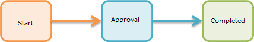

[[basic]]
== Basic Section
In the basics section, we will explain workflow functions using simple processing examples.

[[simple_approval]]
=== Simple Approval

This section mainly explains how to use the basic functionality of UserTask.
Consider a flow where a user registered data, and want someone to confirms and approve about it.

[[simple_approval_preparation]]
==== Preparation
.Creating User
Please refer to the following to prepare the user who will approve the workflow.

[options="header"]
|===
| Item name | Setting value
| User Id | authorizer@workflow
| Last Name | Authorizer
| Mail Address | workflow_authorizer@test.jp
| Member Of | GemUser
| Account Policy | Standard
|===

[[simple_approval_setting]]
==== Workflow Settings 
.Workflow Creation
Create the MetaData of Workflow as follows.

[options = "header"]
|===
| Item name | Setting value
| Name | basic/BasicWorkflow001
| DisplayName | BasicWorkflow001
| Description | Simple approval
|===

Display the created workflow and create the workflow shown below.
Refer to <<operation_method, operation method>> for specific operations.

image::images/simple_workflow_en.png[]

.Settings for each item
We will Configure about each item.
Setting is not required for items that are not listed.

* VariableItem +
+
image::images/simple_setting-variable_en.png[]
+
[options = "header"]
|===
| Item name | Setting value
| name | variableItem1
| displayName | VariableItem1
|===
+
*By setting the value of name to the variable when starting the workflow of EntityView, the data of the target Entity can be used in Workflow.

* StartEvent +
+

+
[options = "header"]
|===
| Item name | Setting value
| name | startEvent1
| displayName | StartEvent1
| historyLogging | true
|===

* EndEvent +
+

+
[options = "header"]
|===
| Item name | Setting value
| name | endEvent1
| displayName | EndEvent1
| historyLogging | true
|===

* UserTask +
+
image::images/simple_setting-user_en.png[]
+
[options = "header"]
|===
| Item name | Setting value
| name | userTask1
| displayName | UserTask1
| historyLogging | true
| assignRule | see assignRule below
| taskResultStatus | see taskResultStatus below
|===

** assignRule +
We will set assignRule.
assignRule sets who processes this UserTask.
+

+
[options="header"]
|===
| Item name | Setting value
| Type | ById
| Apply flow name | *
| Allocation type | ALL
| Completion conditions | ANYONE
| Definition Format | STRING
| ID acquisition logic | authorizer@workflow
|===

** taskResultStatus +
Set taskResultStatus.
By setting taskResultStatus, it is possible to branch the process by approval or rejection.
This time, use only approval.
+

+
[options="header"]
|===
| Item name | Setting value
| name | ok
| displayName | approved
|===
+
There is no need to branch this time, so we will only set ok (approval).
As shown below, the value set here is displayed as a button on the screen after starting the workflow.
If you check "Primary", the button will be highlighted.
+

The workflow settings are now complete. Click the `Save` button to save.
The next section will prepare you to actually use the workflow.

.EntityView settings
This part, the process are necessary to put the WorkFlow to use.

* Create Entity +
Prepare an entity called "basic.BasicWorkflowEntity001".
There is no need to do anything about the property.

[[simple_setting-detailview]]
* DetailFormView settings +
Right-click the created Entity: "basic.BasicWorkflowEntity001", open "DetailLayout", and click the `Standard Load` button. +
Click the gear icon on the details screen to display the "DetailFormView Setting" settings screen. Set the following in the workflow settings at the bottom of the screen, add the created Workflow, and then click the `Save` button to save it.
+

+
[options = "header"]
|===
| Item name | Setting value
| Workflow definition name | basic/BasicWorkflow001
| Workflow variable name | variableItem1
| Button display name | Start simple approval workflow
| Message of running process | Simple approval workflow is running.
|===
+
Up to this point, you are ready to use this Workflow.
Let's try it from the next section.

==== Using Workflow
[[simple_startworkflow]]
.Workflow startup
Open the search screen for "BasicWorkflowEntity001" from the GEM Entity registration screen, press the `Create New` button, and register any data. When you open the details screen of the registered Entity data, a button called `Start Simple Approval Workflow` is displayed. +
This button has the button name set in EntityView. Clicking this button will launch the workflow.

// リンク先のDEVELOPER GUIDEは英語版作成中のため、仮で日本語版のに設定中
TIP: There are two ways to start a workflow: ① start from the program, and ② start from the GEM screen. For details, see link:https://iplass.org/docs/developerguide/workflow/index.html#_%E5%88%A9%E7%94%A8%E6%96%B9%E6%B3%95[How to Use^]. +
For convenience, the workflow startup method in this tutorial uses the startup pattern from the GEM screen (the functionality of the workflow settings set in DetailFormView in the previous step), with the exception of some steps.

At the same time as the workflow start message, a message indicating that the process set in EntityView is "in progress" will be displayed.

[[simple_tasklist]]
.Workflow status check
Log in with user ID: authorizer@workflow and
When you check the task list on the top screen, you will see that it has been assigned based on the Workflow's assignRule.

.UserTask operations
It will operate the assigned UserTask and try the approval process.
Click the "Edit" link in the task list.
The following figure is displayed.
Enter comments if necessary and click the `Approve` button.
This `Approve` button is the value set in the taskResultStatus of Workflow.

When the approval was made, this screen will reloads.
Let's check each item. You can see that the approval process is complete.

Above all, is a simple approval workflow.

[[remand]]
=== Send Back

Now we will explain how to use branch process that use the result of UserTask.
It is so-called NG.
A user registers the data and makes an application.
The approver checks the data and approves if there is no problem and reject it back if there is a problem.

[[remand_preparation]]
==== Advance preparation
.Creating User
Please refer to the following to prepare the user who will approve the workflow.

[options="header"]
|===
| Item name | Setting value
| User Id | user001@workflow
| Last Name | User001
| Mail Address | user001@test.jp
| Member Of | GemUser
| Account Policy | Standard
|===

[[remand_setting]]
==== Workflow Settings

.Workflow Creation
Create Workflow MetaData as follows.

[options = "header"]
|===
| Item name |
| name | basic/BasicWorkflow002
| displayName | BasicWorkflow002
| description | Send back
|===

Display the created workflow and create the workflow shown below.
Refer to <<operation_method, operation method>> for specific operations.

.Settings for each item
We will configure about each item.
Setting is not required for item that are not listed.

* StartEvent +
+

+
[options = "header"]
|===
| Item name | Setting value
| historyLogging | true
|===

* EndEvent +
+

+
[options = "header"]
|===
| Item name | Setting value
| historyLogging | true
|===
+

* UserTask1 +
+
image::images/remand_setting-task1_en.png[]
+
[options = "header"]
|===
| Item name | Setting value
| historyLogging | true
| assignRule | See assignRule below
| taskResultStatus | See taskResultStatus below
|===

** assignRule +
+
[options = "header"]
|===
| Item name | Setting value
| Type | ById
| Apply flow name | *
| Allocation type | ALL
| Completion Conditions | ANYONE
| Definition format | STRING
| ID acquisition logic | user001@workflow
|===

** taskResultStatus +
+
[options = "header"]
|===
| Item name | Setting value
| name | post
| displayName | Apply
|===

* UserTask2 +
+
image::images/remand_setting-task2_en.png[]
+
[options = "header"]
|===
| Item name | Setting value
| historyLogging | true
| assignRule | See assignRule below
| taskResultStatus | See taskResultStatus below
|===

** assignRule +
+
[options = "header2]
|===
| Item name | Setting value
| Type | ById
| Apply flow name | *
| Allocation type | ALL
| Completion Conditions | ANYONE
| Definition format | STRING
| ID acquisition logic | authorizer@workflow
|===

** taskResultStatus +
This time, you need to register an `approval` button and a `send back` button.
+
[options="header"]
|===
| Item name | Setting value
| name | ok
| displayName | Approve
|===
+
[options = "header"]
|===
| Item name | Setting value
| name | ng
| displayName | Send back
|===
+
If the settings are correct, the status will be as shown below.
+

* SequenceFlow (UserTask2 → EndEvent1) +
+
image::images/remand_setting-flow1_en.png[]
+
This is the flow for approval.
+
[options = "header"]
|===
| Item name | Setting value
| nodeResultStatus | ok
|===

* SequenceFlow (UserTask2 → UserTask1) +
+
image::images/remand_setting-flow2_en.png[]
+
This is the flow for sending back.
+
[options = "header"]
|===
| Item name | Setting value
| nodeResultStatus | ng
|===

The workflow settings are now complete. Click the `Save` button to save.

.EntityView settings
From here on, we will explain the steps required to use the workflow.

* Create Entity +
Prepare an entity called "basic.BasicWorkflowEntity002".

* DetailFormView settings +
Right-click the created Entity: "basic.BasicWorkflowEntity002",
open "DetailLayout", after performing the standard load in the same way as <<simple_setting-detailview, simple approval>>, please set the following.
+
[options = "header"]
|===
| Item name | Setting value
| Workflow definition name | basic/BasicWorkflow002
| Workflow variable name | variableItem1
| Button display name | Return workflow activation
| Message of Running Process | Send-back workflow is running.
|===

Up to this point, you are ready to use this Workflow.
Let's try it from the next section.

==== Using Workflow
.Workflow startup
Please log in with an administrator account and start the workflow as well as a <<simple_startworkflow, simple approval>>.

.Workflow status check
Check your workflow as you would for a <<simple_tasklist, simple approval>>.

.UserTask operations
Log in again with user ID: user001@workflow and go to the task processing edit screen.
It will be in the state that you can apply, so please click the `Apply` button.

After completing the application, please log in again with the user ID: authorizer@workflow.
There is a request for approval for the task that was submitted earlier in the task list.
Click the edit link to approve or send back.

This time, two buttons, `Approve` and `Send back` will be displayed.
It is expected to be used in such a way as to check the task target data and check the data for approval.
Click "send back" here.

Once the remand is complete, log in again with user ID: user001@workflow and confirm that the task that was remanded earlier is in the task list.
Click the edit link and apply again.

Once you have finished re-applying, log in with your user ID: authorizer@workflow.
Approval requests have been received for tasks that have been properly submitted to the task list.
Click the edit link and now approve.

If you check the workflow history after approval, you will see the following figure.
You can confirm that the processing result has been returned and that the application has been reapplied and approved.

The above is the Workflow for sending back.

[[sendmail]]
=== Send Email Upon Approval

This section mainly explains how to send email.
Imagine such situation, the user registered the data and applied the approval workflow, now he also want to send an email to the on-duty user to remind about the workflow.

[[sendmail_preparation]]
==== Preparation
.Creating Email Template
Prepare a MailTemplate called "basic/SimpleWorkflow003".
Enter an arbitrary string for the subject and message.

.mtp-service-config.xml settings
You need to configure "mtp-service-config.xml" only if you want to check the mail locally.
Please enable the MailService listener as shown below.

[source,xml]
----
<!-- ■ for develop only (additional="true) ■ -->
<!-- To enable the debug mode for sending mails, Please uncomment the following code.-->
<!--
<property name="listener" class="org.iplass.mtp.mail.listeners.LoggingSendMailListener" additional="true"/> <1>
-->
----
<1> Uncomment. However, please use it only in the development environment.

[[sendmail_setting]]
==== Workflow settings
.Workflow creation
Create Workflow MetaData as follows.

[options = "header"]
|===
| Item name | Setting value
| name | basic/BasicWorkflow003
| displayName | BasicWorkflow003
| description | Send email
|===

Show the created workflow and modify it to the workflow shown below.
Refer to <<operation_method, operation method>> for specific operations.

image::images/mail_workflow_en.png[]

.Settings for each item
We will configure about each item.
Setting is not required for item that are not listed.

* UserTask1 +
+
image::images/mail_setting-task1_en.png[]
+
[options = "header"]
|===
| Item name | Setting value
| assignRule | See assignRule
| taskResultStatus | See taskResultStatus
|===

** assignRule +
+
[options = "header"]
|===
| Item name | Setting value
| Type | ById
| Apply flow name | *
| Allocation type | ALL
| Completion Conditions | ANYONE
| Definition format | STRING
| ID acquisition logic | authorizer@workflow
|===

** taskResultStatus +
+
[options = "header"]
|===
| Item name | Setting value
| name | ok
| displayName | Request and send
|===

* MailTask1 +
+

+
[cols="1,2a", options = "header"]
|===
| Item name | Setting value
| mailTemplateName | basic/SimpleWorkflow003
| to |[options="header"]
!===
!Item name!Setting value
!Definition format!STRING
!to get logic!test@test.jp
!===
|===

** to +
Set the destination.
This time, since we are not actually going to send the mail, we only want to confirmed in the log, set "test@test.jp".
+

The workflow settings are now complete. Click the `Save` button to save.

.EntityView settings +
From here on, we will explain the steps required to use the workflow.

* Create Entity +
Prepare an entity called "basic.BasicWorkflowEntity003".

* DetailFormView settings +
Right-click the created Entity: "basic.BasicWorkflowEntity003",
open "DetailLayout", after performing the standard load in the same way as <<simple_setting-detailview, simple approval>>, please set the following.
+
[options = "header"]
|===
| Item name | Setting value
| Workflow definition name | basic/BasicWorkflow003
| Workflow variable name | variableItem1
| Button display name | start email sending workflow 
| Message of running process | E-mail sending workflow is being executed.
|===

Up to this point, you are ready to use this Workflow.
Let's try it from the next section.

==== Using Workflow
.Workflow Startup
Please log in with an administrator account and start the workflow as well as a <<simple_startworkflow, simple approval>>.

.Workflow status check
Check your workflow as you would for a <<simple_tasklist, simple approval>>.

.UserTask operations
Click the `Send Approval` button.
The workflow is completed and an email is sent.
In the local environment, the mail contents are logged to the Eclipse console.

----
11:32:33.257 [http-nio-8080-exec-1] DEBUG 38 63312 CompositeCommand  o.i.m.m.l.LoggingSendMailListener -   From:test@contract.dentsusoken.com ReplyTo:test@contract.dentsusoken.com To:(1)test@test.jp; Cc:(0) Bcc:(0) Subject:Mail Sample FileName: PlainMessage:MailSample HtmlMessage: 
----

The above is the Workflow that includes the email transmission process.

[[updateentity]]
=== Entity Operation While Performing Approval

This section mainly explains the entity operation method.
Image the need to update Entity data at the same time when a user registered the data and made an request.

[[updateentity_setting]]
==== Workflow settings
.Workflow creation
Create Workflow MetaData as follows.

[options = "header"]
|===
| Item name | Setting value
| name | basic/BasicWorkflow004
| displayName | BasicWorkflow004
| description | Entity operation
|===

Display the created workflow and create the workflow shown below.
Refer to <<operation_method, operation method>> for specific operations.

image::images/entity_workflow_en.png[]

.Settings For Each Item
Set each item.
Setting is not required for item that are not listed.

* UserTask1 +
+
image::images/entity_setting-task1_en.png[]
+
[options = "header"]
|===
| Item name | Setting value
| assignRule | See assignRule
| taskResultStatus | See taskResultStatus
|===

** assignRule +
+
[options = "header"]
|===
|Item name | Setting value
| Type | ById
| Apply flow name | *
| Allocation type | ALL
| Completion Conditions | ANYONE
| Definition format | STRING
| ID acquisition logic | authorizer@workflow
|===

** taskResultStatus
+
[options = "header"]
|===
| Item name | Setting value
| name | ok
| displayName | Approve and update
|===

* UpdateEntityTask1 +
+

+
[cols="1,2a", options = "header"]
|===
| Item name | Setting value
| variableName | variableItem1
| updateRule | [options="header"]
!===
!Item name!Setting value
!Type!property
!Property name!description
!Updated value!Update workflow Sample
!===
|===

** updateRule +
When this workflow is executed and completed normally, the description of the target data will be updated with the desired value.
+

The workflow settings are now complete. Click the `Save` button to save.

.EntityView settings
From here on, we will explain the steps required to use the workflow.

* Create Entity +
Prepare an entity called "basic.BasicWorkflowEntity004".

* DetailFormView settings +
Right-click the created Entity: "basic.BasicWorkflowEntity004",
open "DetailLayout", after performing the standard load in the same way as <<simple_setting-detailview, simple approval>>, please set the following.
+
[options = "header"]
|===
| Item name | Setting value
| Workflow definition name | basic/BasicWorkflow004
| Workflow variable name | variableItem1
| Button display name | Activate Entity operation workflow
| Message of running process | The Entity operation workflow is being executed.
|===

Up to this point, you are ready to use this Workflow.
Let's try it from the next section.

==== Using Workflow
.Workflow startup
Please log in with an administrator account and start the workflow as well as a <<simple_startworkflow, simple approval>>.

.Workflow status check
Check your workflow as you would for a <<simple_tasklist, simple approval>>.

.UserTask operations
Let's search and check the data before and after updating from the search screen for "BasicWorkflowEntity004".
By clicking the `Approve and Update` button, the description field will be updated to the value set in updateRule.

Make sure that it is updated after the workflow is complete.

The above is the workflow that includes Entity operations.

[[customlogic]]
=== Custom Logic Process With Approval

This section mainly explains how to use custom logic.
Imagine the needs for the situation that the custom logic is triggered when the user registers the data and makes an request.

[[customlogic_preparation]]
==== Preparation
.Command creation
Prepare a command called "basic/BasicWorkflowCommand005".
The code only outputs a log as follows.

To create a command, select "Command" on the AdminConsole screen and select "Create command" from the right-click menu.
Create a Command as shown below.

[options="header"]
|===
| Item name | Setting value
| name | basic/BasicWorkflowCommand005
| displayName | BasicWorkflowCommand005
| type | Script
|===

Open the created Command, set the following contents using the `Edit` button, and then click the `Save` button to save.

[source,groovy]
----
import org.iplass.mtp.ManagerLocator;
import org.iplass.mtp.entity.Entity;
import org.iplass.mtp.entity.EntityManager;
import org.iplass.mtp.entity.GenericEntity;

EntityManager em = ManagerLocator.manager(EntityManager.class);

Entity e = new GenericEntity("basic.BasicWorkflowEntity005");
e.setName("create by CustomLogic");
em.insert(e);
----

[[customlogic_setting]]
==== Workflow Settings
.Workflow Creation
Create Workflow MetaData as follows.

[options = "header"]
|===
| Item name | Setting value
| name | basic/BasicWorkflow005
| displayName | BasicWorkflow005
| description | Custom logic processing
|===

Display the created workflow and create the workflow shown below.
Refer to <<operation_method, operation method>> for specific operations.

.Settings For Each Item
Set each item.
Setting is not required for item that are not listed.

* UserTask1 +
+

+
[options = "header"]
|===
| Item name | Setting value
| assignRule | See assignRule
| taskResultStatus | See taskResultStatus
|===

** assignRule +
+
[options = "header"]
|===
| Item name | Setting value
| Type | ById
| Apply flow name | *
| Allocation type | ALL
| Completion Conditions | ANYONE
| Definition format | STRING
| ID acquisition logic | authorizer@workflow
|===

** taskResultStatus +
+
[options = "header"]
|===
| Item name | Setting value
| name | ok
| displayName | Approve and initiate custom process
|===

* CommandTask1 +
+

+
[options = "header"]
|===
| Item name | Setting value
| commandConfig | basic/BasicWorkflowCommand005
|===

The workflow settings are now complete. Click the `Save` button to save.

.EntityView settings
From here on, we will explain the steps required to use the workflow.

* Create Entity +
Prepare an entity called "basic.BasicWorkflowEntity005".

* DetailFormView settings +
Right-click the created Entity: "basic.BasicWorkflowEntity005",
open "DetailLayout", after performing the standard load in the same way as <<simple_setting-detailview, simple approval>>, please set the following.
+
[options = "header"]
|===
| Item name | Setting value
| Workflow definition name | basic/BasicWorkflow005
| Workflow variable name | variableItem1
| Button display name | Custom logic processing workflow launcher
| Message of running process | Custom logic processing workflow is running.
|===

Up to this point, you are ready to use this Workflow.
Let's try it from the next section.

==== Using Workflow
.Workflow startup
Please log in with an administrator account and start the workflow as well as a <<simple_startworkflow, simple approval>>.

.Workflow status check
Check your workflow as you would for a <<simple_tasklist, simple approval>>.

.UserTask operations
Click the `Approve and initiate Custom Process` button.

Search for registered data from the "BasicWorkflowEntity005" search screen and check that the data has been added using custom logic.

This is the workflow that includes custom logic processing.

[[split]]
=== Split

This section mainly explains how to use Gateway (Split).
Imagine the needs for the situation that an email is sent and the application task for that data is triggered at the same time when a user registered the data.
And end the application task once it is executed.

[[split_setting]]
==== Workflow Settings
.Workflow Creation
Create Workflow MetaData as follows.

[options = "header"]
|===
| Item name | Setting value
| name | basic/BasicWorkflow006
| displayName | BasicWorkflow006
| description | Split
|===

Display the created workflow and create the workflow shown below.
Refer to <<operation_method, operation method>> for specific operations.

.Settings For Each Item
Set each item.
Setting is not required for item names that are not listed.

* StartEvent +
+

+
[options="header"]
|===
| Item name | Setting value
| historyLogging | true
|===

* EndEvent +
+

+
[options="header"]
|===
| Item name | Setting value
| historyLogging | true
|===

* SplitParallelGateway +
+
image::images/icon_gateway-splitparallel_en.png[]
+
[options="header"]
|===
|項目名|設定値
|historyLogging|true
|===

* JoinSyncGateway +
+
image::images/icon_gateway-joinsync_en.png[]
+
[options="header"]
|===
|項目名|設定値
|historyLogging|true
|===

* IntermediateEvent1 +
+

+
[options="header"]
|===
|項目名|設定値
|historyLogging|true
|===

* IntermediateEvent2 +
+

+
[options="header"]
|===
|項目名|設定値
|historyLogging|true
|===

* UserTask1 +
+
image::images/split_setting-task1_en.png[]
+
[options = "header"]
|===
| Item name | Setting value
| historyLogging | true
| assignRule | referring assignRule
| taskResultStatus | referring taskResultStatus
|===

** assignRule +
+
[options="header"]
|===
| Item name | Setting value
| Type | ById
| Apply flow name | *
| Allocation type | ALL
| Completion Conditions | ANYONE
| Definition format | STRING
| ID acquisition logic | authorizer@workflow
|===

** taskResultStatus +
+
[options = "header"]
|===
| Item name | Setting value
| name | post
| displayName | Apply
|===

* MailTask1 +
+
image::images/split_setting-task2_en.png[]
+
[cols="1,2a", options = "header"]
|===
| Item name | Setting value
| historyLogging | true
| mailTemplateName | basic/SimpleWorkflow003
.2+| to | [options="header"]
!===
!Item name!Setting value
!Definition format!STRING
!to acquisition logic!test@test.jp
!===
|===

The workflow settings are now complete. Click the `Save` button to save.

.EntityView settings
From here on, we will explain the steps required to use the workflow.

* Create Entity +
Prepare an entity called "basic.BasicWorkflowEntity006".

* DetailFormView settings +
Right-click the created Entity: "basic.BasicWorkflowEntity006",
open "DetailLayout", after performing the standard load in the same way as <<simple_setting-detailview, simple approval>>, please set the following.
+
[options = "header"]
|===
| Item name | Setting value
| Workflow definition name | basic/BasicWorkflow006
| Workflow variable name | variableItem1
| Button display name | Split workflow activation
| Message of running process | Split workflow is running.
|===

Up to this point, you are ready to use this Workflow.
Let's try it from the next section.

==== Using Workflow
.Workflow startup
Please log in with an administrator account and start the workflow as well as a <<simple_startworkflow, simple approval>>.
Confirm that an e-mail is sent at the same time as the workflow was started

.Workflow status check
Check your workflow as you would for a <<simple_tasklist, simple approval>>.

.UserTask operations
Click the `Apply` button.

Check from the workflow history that all the branched flows are executed.

The above is a workflow that includes splits.

[[timer]]
=== timer

This section mainly explains how to use Timer.
The situation is, we want the mail to be sent after a few minutes when a user registered the data and received approval.

[[timer_preparation]]
==== Preparation
.Settings for Using the Timer
Settings are required in mtp-service-config.xml.
Set useQueue to true as shown below. +
When changing settings, you will need to restart the Tomcat server.

[source,xml]
----
<!-- AsyncTask queue and counter setting -->
<service>
　　<interface>org.iplass.mtp.impl.async.rdb.RdbQueueService</interface>
　　<!-- if use async rdb service set to true -->
　　<property name="useQueue" value="true" />
</service>
----

[[timer_setting]]
==== Workflow Settings
.Workflow Creation
Create Workflow MetaData as follows.

[options = "header"]
|===
| Item name | Setting value
| name | basic/BasicWorkflow007
| displayName | BasicWorkflow007
| description | Timer
|===

Display the created workflow and create the workflow shown below.
Refer to <<operation_method, operation method>> for specific operations.

image::images/timer_workflow_en.png[]

.Settings for Each Item
Set each item.
Setting is not required for item that are not listed.

* StartEvent +
+

+
[options="header"]
|===
| Item name | Setting value
| historyLogging | true
|===

* EndEvent +
+

+
[options="header"]
|===
| Item name | Setting value
| historyLogging | true
|===

* UserTask1 +
+
image::images/timer_setting-task1_en.png[]
+
[options = "header"]
|===
| Item name | Setting value
| historyLogging | true
| assignRule | See  assignRule
| taskResultStatus | See taskResultStatus
|===

** assignRule +
+
[options = "header"]
|===
| Item name | Setting value
| Type | ById
| Apply flow name | *
| Allocation type | ALL
| Completion Conditions | ANYONE
| Definition format | STRING
| ID acquisition logic | authorizer@workflow
|===

** taskResultStatus +
+
|===
| Item name | Setting value
| name | post
| displayName | Email 3 minutes after applying
|===

* IntermediateTimerEvent1 +
+

+
[cols="1,2a", options="header"]
|===
| Item name | Setting value
| historyLogging | true
| timer | [options="header"]
!===
!Item name!Setting value
!Timer Type!Delay
!Timer Unit!Minuites
!Delay Expression!"3"
!===
|===

* MailTask1 +
+
image::images/timer_setting-task2_en.png[]
+
[cols="1,2a", options = "header"]
|===
| Item name | Setting value
| historyLogging | true
| mailTemplateName | basic/SimpleWorkflow003
| mailTemplateName | [options="header"]
!===
!Item name!Setting value
!Definition format!STRING
!to acquisition logic!test@test.jp
!===
|===

The workflow settings are now complete. Click the `Save` button to save.

.EntityView settings
From here on, we will explain the steps required to use the workflow.

* Create Entity +
Prepare an entity called "basic.BasicWorkflowEntity007".

* DetailFormView settings +
Right-click the created Entity: "basic.BasicWorkflowEntity007",
open "DetailLayout", after performing the standard load in the same way as <<simple_setting-detailview, simple approval>>, please set the following.
+
[options = "header"]
|===
| Item name | Setting value
| Workflow definition name | basic/BasicWorkflow007
| Workflow variable name | variableItem1
| Button display name | Timer workflow start
| Message of running process | Timer workflow is running.
|===

Up to this point, you are ready to use this Workflow.
Let's try it from the next section.

==== Using Workflow
.Workflow Startup
Please log in with an administrator account and start the workflow as well as a <<simple_startworkflow, simple approval>>.

.Workflow Status Check
Check your workflow as you would for a <<simple_tasklist, simple approval>>.

.UserTask Operations
Click the `Email after 3 minutes` button.

Make sure that the email is sent in 3 minutes.

This concludes the end of the basic workflow that includes a timer.

