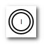

[[basic]]
== 基本編
基本編ではワークフローの機能を単純な処理を例に説明していきます。

[[simple_approval]]
=== 単純な承認

ここでは主にUserTaskの利用方法について説明します。
あるユーザーがデータを登録し、そのデータを確認して承認がほしい場合のフローを考えてみます。

image::images/simple_flow.png[]

[[simple_approval_preparation]]
==== 事前準備
.Userの作成
以下を参考に、ワークフローの承認を行うユーザを用意してください。

[options="header"]
|===
|項目名|設定値
|ユーザID|authorizer@workflow
|姓|承認者
|メールアドレス|workflow_authorizer@test.jp
|所属グループ|GemUser
|アカウントポリシー|標準
|===

[[simple_approval_setting]]
==== Workflowの設定
.Workflowの作成
下記の通りWorkflowのMetaDataを作成します。

[options="header"]
|===
|項目名|設定値
|name|basic/BasicWorkflow001
|displayName|BasicWorkflow001
|description|単純な承認
|===

作成したワークフローを表示し、下図のワークフローを作成してください。
具体的な操作は<<operation_method,操作方法>>を参考にして下さい。

.各Itemの設定
各Itemの設定をしていきます。
記載のない項目名については設定不要です。

* VariableItem +
+

+
[options="header"]
|===
|項目名|設定値
|name|variableItem1
|displayName|VariableItem1
|===
+
※nameの値をEntityViewのワークフロー起動時の変数に設定することで、対象EntityのデータをWorkflowで利用可能となります。

* StartEvent +
+
image::images/simple_setting-start.png[]
+
[options="header"]
|===
|項目名|設定値
|name|startEvent1
|displayName|StartEvent1
|historyLogging|true
|===

* EndEvent +
+

+
[options="header"]
|===
|項目名|設定値
|name|endEvent1
|displayName|EndEvent1
|historyLogging|true
|===

* UserTask +
+
image::images/simple_setting-user.png[]
+
[options="header"]
|===
|項目名|設定値
|name|userTask1
|displayName|UserTask1
|historyLogging|true
|assignRule|assignRule参照
|taskResultStatus|taskResultStatus参照
|===

** assignRule +
assignRuleを設定します。
assignRuleでは、誰がこのUserTaskを処理するかを設定します。
+
image::images/simple_setting-assignrule.png[]
+
[options="header"]
|===
|項目名|設定値
|タイプ|ById
|適用フロー名|*
|割当種別|ALL
|完了条件|ANYONE
|定義形式|STRING
|ID取得ロジック|authorizer@workflow
|===

** taskResultStatus +
taskResultStatusを設定します。
taskResultStatusを設定することで、承認、否認による処理の分岐が可能になります。
今回は承認だけとなります。
+

+
[options="header"]
|===
|項目名|設定値
|name|ok
|displayName|承認
|===
+
今回は分岐させる必要がないので、ok（承認）のみ設定します。
下図の通り、ここで設定した値がワークフロー起動後の画面でボタンとして表示されます。
「Primary」にチェックを入れると、ボタンが強調表示になります。
+

以上でWorkflowの設定は完了です。 `Save` ボタンをクリックして保存してください。 +
次項からはWorkflowを実際に利用する為の準備となります。

.EntityViewの設定
ここからは今までの操作で作成したWorkflowを利用するための準備となります。

* Entityの作成 +
「basic.BasicWorkflowEntity001」というEntityを作成してください。

[[simple_setting-detailview]]
* DetailFormViewの設定 +
作成した「basic.BasicWorkflowEntity001」を右クリックして「DetailLayout」を開き、 `標準ロード` ボタンをクリックします。 +
詳細画面の歯車アイコンをクリックすると「DetailFormView Setting」の設定画面が表示されるので、
画面下部にあるワークフロー設定に以下を設定し、作成したWorkflowを追加した後、 `保存` ボタンをクリックして保存してください。
+

+
[options="header"]
|===
|項目名|設定値
|ワークフロー定義名|basic/BasicWorkflow001
|ワークフロー変数名|variableItem1
|ボタン表示名|単純承認ワークフロー起動
|プロセス実行中のメッセージ|単純承認ワークフロー実行中です。
|===
+
ここまででWorkflow利用準備が完了しました。
次項からはWorkflowを利用してみましょう。

==== Workflowの利用
[[simple_startworkflow]]
.Workflowの起動
管理者アカウントでログインし、GEMのEntity登録画面から「BasicWorkflowEntity001」の検索画面を開き、 `新規作成` ボタンを押して任意のデータを登録してください。
登録したEntityデータの詳細画面を開くと、`単純承認ワークフロー起動` というボタンが表示されています。 +
このボタンはEntityViewで設定したボタン名となっています。
このボタンをクリックすることでワークフローが起動します。

TIP: ワークフローの起動方法は、①プログラムからの起動、②GEM画面からの起動の2パターンがあります。詳細は、link:https://iplass.org/docs/developerguide/workflow/index.html#_%E5%88%A9%E7%94%A8%E6%96%B9%E6%B3%95[利用方法^]を参照してください。 +
本チュートリアルでのワークフロー起動方法は、便宜上、一部手順を除いてGEM画面からの起動パターン（先の手順でDetailFormViewに設定したワークフロー設定の機能）を使用しています。

ワークフローの開始メッセージと同時に、EntityViewで設定したプロセス実行中のメッセージが表示されます。

[[simple_tasklist]]
.Workflowのステータス確認
ユーザーID: authorizer@workflow でログインし、
トップ画面のタスク一覧を確認すると、WorkflowのassignRuleに基づいて割り当てがなされた状態になっています。

.UserTaskの操作
割り当てられたUserTaskを操作し、承認処理をしてみます。
タスク一覧にある「編集」リンクをクリックします。
下図が表示されます。
必要に応じてコメントを記入し、 `承認` ボタンをクリックしてください。
この `承認` ボタンはWorkflowのtaskResultStatusで設定した値となります。

承認が完了すると、この画面がリロードされます。
各項目を確認してみましょう。承認処理が完了していることが分かります。

以上が単純な承認のWorkflowとなります。

[[remand]]
=== 差し戻し

ここではUserTaskの結果を利用した分岐処理を説明します。
いわゆる差し戻しについての説明となります。
あるユーザーがデータを登録した上で、申請を行います。
承認者はデータを確認し、問題なければ承認、問題があれば差し戻しを実行します。

[[remand_preparation]]
==== 事前準備
.Userの作成
以下を参考に、ワークフローの申請を行うユーザーを用意してください。

[options="header"]
|===
|項目名|設定値
|ユーザーID|user001@workflow
|姓|ユーザー００１
|メールアドレス|user001@test.jp
|所属グループ|GemUser
|アカウントポリシー|標準
|===

[[remand_setting]]
==== Workflowの設定

.Workflowの作成
下記の通りWorkflowのMetaDataを作成します。

[options="header"]
|===
|項目名|設定値
|name|basic/BasicWorkflow002
|displayName|BasicWorkflow002
|description|差し戻し
|===

作成したワークフローを表示し、下図のワークフローを作成してください。
具体的な操作は<<operation_method,操作方法>>を参考にして下さい。

image::images/remand_workflow.png[]

.各Itemの設定
各Itemの設定をしていきます。
記載のない項目名については設定不要です。

* StartEvent +
+
image::images/simple_setting-start.png[]
+
[options="header"]
|===
|項目名|設定値
|historyLogging|true
|===

* EndEvent +
+

+
[options="header"]
|===
|項目名|設定値
|historyLogging|true
|===

* UserTask1 +
+
image::images/remand_setting-task1.png[]
+
[options="header"]
|===
|項目名|設定値
|historyLogging|true
|assignRule|assignRule参照
|taskResultStatus|taskResultStatus参照
|===

** assignRule +
+
[options="header"]
|===
|項目名|設定値
|タイプ|ById
|適用フロー名|*
|割当種別|ALL
|完了条件|ANYONE
|定義形式|STRING
|ID取得ロジック|user001@workflow
|===

** taskResultStatus +
+
[options="header"]
|===
|項目名|設定値
|name|post
|displayName|申請
|===

* UserTask2 +
+

+
[options="header"]
|===
|項目名|設定値
|historyLogging|true
|assignRule|assignRule参照
|taskResultStatus|taskResultStatus参照
|===

** assignRule +
+
[options="header2]
|===
|項目名|設定値
|タイプ|ById
|適用フロー名|*
|割当種別|ALL
|完了条件|ANYONE
|定義形式|STRING
|ID取得ロジック|authorizer@workflow
|===

** taskResultStatus +
今回は `承認` ボタンと `差し戻し` ボタンが必要なのでそれぞれ登録します。
+
[options="header"]
|===
|項目名|設定値
|name|ok
|displayName|承認
|===
+
[options="header"]
|===
|項目名|設定値
|name|ng
|displayName|差し戻し
|===
+
正しく設定されていると下図のような状態になります。
+

* SequenceFlow(UserTask2 → EndEvent1) +
+

+
承認の場合のフローになります。
+
[options="header"]
|===
|項目名|設定値
|nodeResultStatus|ok
|===

* SequenceFlow(UserTask2 → UserTask1) +
+

+
差し戻しの場合のフローになります。
+
[options="header"]
|===
|項目名|設定値
|nodeResultStatus|ng
|===

以上でWorkflowの設定は完了です。 `Save` ボタンをクリックして保存してください。

.EntityViewの設定
ここからは今までの操作で作成したWorkflowを利用するための準備となります。

* Entityの作成 +
「basic.BasicWorkflowEntity002」というEntityを作成してください。

* DetailFormViewの設定 +
「basic.BasicWorkflowEntity002」の「DetailLayout」を開き、
<<simple_setting-detailview, 単純な承認>>と同様に標準ロードを実施後、以下を設定してください。
+
[options="header"]
|===
|項目名|設定値
|ワークフロー定義名|basic/BasicWorkflow002
|ワークフロー変数名|variableItem1
|ボタン表示名|差し戻しワークフロー起動
|プロセス実行中のメッセージ|差し戻しワークフロー実行中です。
|===

ここまででWorkflow利用準備が完了しました。
次項からはWorkflowを利用してみましょう。

==== Workflowの利用
.Workflowの起動
管理者アカウントでログインし<<simple_startworkflow, 単純な承認>>と同様にワークフローを起動してください。

.Workflowのステータス確認
<<simple_tasklist, 単純な承認>>と同様にワークフローを確認してください。

.UserTaskの操作
ユーザーID: user001@workflow でログインしなおし、タスク処理の編集画面を表示してください。
申請可能となっていますので、 `申請` ボタンをクリックします。

申請が終ったらユーザーID: authorizer@workflow でログインしなおしてください。
タスク一覧に先ほど申請されたタスクの承認依頼がきています。
編集リンクをクリックし、承認または差し戻しを行います。

今回は `承認` と `差し戻し` の2つのボタンが表示されています。
タスク対象データを確認し、承認可能かどうかデータを確認するような利用法が想定されます。
ここで「差し戻し」をクリックします。

差し戻しが終わったらユーザーID: user001@workflow でログインしなおし、タスク一覧に先ほど差し戻されたタスクがあることを確認します。
編集リンクをクリックし、再度申請を行います。

再申請が終ったらユーザーID: authorizer@workflow でログインしなおしてください。
タスク一覧に先ほど申請されたタスクの承認依頼がきています。
編集リンクをクリックし、今度は承認してみましょう。

承認後ワークフロー履歴を確認すると下図のようになっていると思います。
処理結果が差し戻しになり、再申請が行われた後承認されたことが確認出来ます。

以上が差し戻しのWorkflowとなります。

[[sendmail]]
=== 承認と同時にメール送信

ここでは主にメール送信方法について説明します。
あるユーザーがデータを登録した上で、申請を行います。同時に確認してほしいユーザーへメールを送信します。

[[sendmail_preparation]]
==== 事前準備
.メールテンプレートの作成
「basic/SimpleWorkflow003」というMailTemplateを準備しておいてください。
件名、メッセージ等は任意の文字列を入力してください。

[[set_local_mail_config]]
.mtp-service-config.xmlの設定
ローカルでメールの確認がしたい場合のみ「mtp-service-config.xml」の設定が必要になります。
下記の通りMailServiceのlistenerを有効にしてください。

[source, xml]
----
<!-- ■ for develop only (additional="true) ■ -->
<!-- 送信メールをデバッグ出力する場合、以下を有効にしてください。 -->
<!--
<property name="listener" class="org.iplass.mtp.mail.listeners.LoggingSendMailListener" additional="true"/> <1>
-->
----
<1> コメント化を解除します。ただし、開発環境での利用に留めてください。

[[sendmail_setting]]
==== Workflowの設定
.Workflowの作成
下記の通りWorkflowのMetaDataを作成します。

[options="header"]
|===
|項目名|設定値
|name|basic/BasicWorkflow003
|displayName|BasicWorkflow003
|description|メール送信
|===

作成したワークフローを表示し、下図のワークフローを作成してください。
具体的な操作は<<operation_method,操作方法>>を参考にして下さい。

.各Itemの設定
各Itemの設定をしていきます。
記載のない項目名については設定不要です。

* UserTask1 +
+
image::images/mail_setting-task1.png[]
+
[options="header"]
|===
|項目名|設定値
|assignRule|assignRule参照
|taskResultStatus|taskResultStatus参照
|===

** assignRule +
+
[options="header"]
|===
|項目名|設定値
|タイプ|ById
|適用フロー名|*
|割当種別|ALL
|完了条件|ANYONE
|定義形式|STRING
|ID取得ロジック|authorizer@workflow
|===

** taskResultStatus +
+
[options="header"]
|===
|項目名|設定値
|name|ok
|displayName|申請と送信
|===

* MailTask1 +
+

+
[cols="1,2a", options="header"]
|===
|項目名|設定値
|mailTemplateName|basic/SimpleWorkflow003
.2+|to|[options="header"]
!===
!項目名!設定値
!定義形式!STRING
!to取得ロジック!test@test.jp
!===
|===

** to +
送信先を設定します。
本チュートリアルでは実際に送信はせず、ログでの確認となるため、「test@test.jp」と設定します。
+

以上でWorkflowの設定は完了です。 `Save` ボタンをクリックして保存してください。 

.EntityViewの設定 +
ここからは今までの操作で作成したWorkflowを利用するための準備となります。

* Entityの作成 +
「basic.BasicWorkflowEntity003」というEntityを作成してください。

* DetailFormViewの設定 +
「basic.BasicWorkflowEntity003」の「DetailLayout」を開き、
<<simple_setting-detailview, 単純な承認>>と同様に標準ロードを実施後、以下を設定してください。
+
[options="header"]
|===
|項目名|設定値
|ワークフロー定義名|basic/BasicWorkflow003
|ワークフロー変数名|variableItem1
|ボタン表示名|メール送信ワークフロー起動
|プロセス実行中のメッセージ|メール送信ワークフロー実行中です。
|===

ここまででWorkflow利用準備が完了しました。
次項からはWorkflowを利用してみましょう。

==== Workflowの利用
.Workflowの起動
管理者アカウントでログインし<<simple_startworkflow, 単純な承認>>と同様にワークフローを起動してください。

.Workflowのステータス確認
<<simple_tasklist, 単純な承認>>と同様にワークフローを確認してください。

.UserTaskの操作
`申請と送信` ボタンをクリックします。
ワークフローは完了状態になり、メールが送信されます。
ローカル環境ではEclipseのコンソールにメール内容がログ出力されます。

----
11:32:33.257 [http-nio-8080-exec-1] DEBUG 38 63312 CompositeCommand  o.i.m.m.l.LoggingSendMailListener -   From:test@contract.dentsusoken.com ReplyTo:test@contract.dentsusoken.com To:(1)test@test.jp; Cc:(0) Bcc:(0) Subject:メール送信サンプル FileName: PlainMessage:メール送信サンプル HtmlMessage: 
----

以上がメール送信処理を含むWorkflowとなります。

[[updateentity]]
=== 承認と同時にEntity操作を実施

ここでは主にEntity操作方法について説明します。
あるユーザーがデータを登録した上で、申請を行います。
同時にEntityデータの更新を行います。

[[updateentity_setting]]
==== Workflowの設定
.Workflowの作成
下記の通りWorkflowのMetaDataを作成します。

[options="header"]
|===
|項目名|設定値
|name|basic/BasicWorkflow004
|displayName|BasicWorkflow004
|description|Entity操作
|===

作成したワークフローを表示し、下図のワークフローを作成してください。
具体的な操作は<<operation_method,操作方法>>を参考にして下さい。

.各Itemの設定
各Itemの設定をしていきます。
記載のない項目名については設定不要です。

* UserTask1 +
+
image::images/entity_setting-task1.png[]
+
[options="header"]
|===
|項目名|設定値
|assignRule|assignRule参照
|taskResultStatus|taskResultStatus参照
|===

** assignRule +
+
[options="header"]
|===
|項目名|設定値
|タイプ|ById
|適用フロー名|*
|割当種別|ALL
|完了条件|ANYONE
|定義形式|STRING
|ID取得ロジック|authorizer@workflow
|===

** taskResultStatus
+
[options="header"]
|===
|項目名|設定値
|name|ok
|displayName|承認して更新
|===

* UpdateEntityTask1 +
+

+
[cols="1,2a", options="header"]
|===
|項目名|設定値
|variableName|variableItem1
|updateRule|[options="header"]
!===
!項目名!設定値
!タイプ!Property
!プロパティ名!description
!更新値!更新ワークフローサンプル
!===
|===

** updateRule +
本ワークフローが実行され、正常に完了した際には対象データのdescriptionが更新値にて更新されています。
+

以上でWorkflowの設定は完了です。 `Save` ボタンをクリックして保存してください。 

.EntityViewの設定
ここからは今までの操作で作成したWorkflowを利用するための準備となります。

* Entityの作成 +
「basic.BasicWorkflowEntity004」というEntityを作成してください。

* DetailFormViewの設定 +
「basic.BasicWorkflowEntity004」の「DetailLayout」を開き、
<<simple_setting-detailview, 単純な承認>>と同様に標準ロードを実施後、以下を設定してください。
+
[options="header"]
|===
|項目名|設定値
|ワークフロー定義名|basic/BasicWorkflow004
|ワークフロー変数名|variableItem1
|ボタン表示名|Entity操作ワークフロー起動
|プロセス実行中のメッセージ|Entity操作ワークフロー実行中です。
|===

ここまででWorkflow利用準備が完了しました。
次項からはWorkflowを利用してみましょう。

==== Workflowの利用
.Workflowの起動
管理者アカウントでログインし<<simple_startworkflow, 単純な承認>>と同様にワークフローを起動してください。

.Workflowのステータス確認
<<simple_tasklist, 単純な承認>>と同様にワークフローを確認してください。

.UserTaskの操作
更新する前後のデータを「BasicWorkflowEntity004」の検索画面から検索して確認してみましょう。 
`承認して更新` ボタンをクリックすることにより、説明項目がupdateRuleで設定した値に更新されます。

ワークフロー完了後に更新されていることを確認しましょう。

以上がEntity操作を含むWorkflowとなります。

[[customlogic]]
=== 承認と同時にカスタムロジック処理を実施

ここでは主にカスタムロジックを利用する方法について説明します。
あるユーザーがデータを登録した上で、申請を行います。
同時にカスタムロジックの実行を行います。

[[customlogic_preparation]]
==== 事前準備
.Commandの作成
「basic/BasicWorkflowCommand005」というCommandを準備しておいてください。

コマンドの作成はAdminConsole画面で「Command」を選択し、右クリックメニューから「コマンドを作成する」を選択します。
下記の通りCommandを作成します。

[options="header"]
|===
|項目名|設定値
|name|basic/BasicWorkflowCommand005
|displayName|BasicWorkflowCommand005
|type|Script
|===

作成したCommandを開き、 `Edit` ボタンから下記の内容を設定後、 `Save` ボタンをクリックして保存してください。

[source, groovy]
----
import org.iplass.mtp.ManagerLocator;
import org.iplass.mtp.entity.Entity;
import org.iplass.mtp.entity.EntityManager;
import org.iplass.mtp.entity.GenericEntity;
 
EntityManager em = ManagerLocator.manager(EntityManager.class);
 
Entity e = new GenericEntity("basic.BasicWorkflowEntity005");
e.setName("create by CustomLogic");
em.insert(e);
----

[[customlogic_setting]]
==== Workflowの設定
.Workflowの作成
下記の通りWorkflowのMetaDataを作成します。

[options="header"]
|===
|項目名|設定値
|name|basic/BasicWorkflow005
|displayName|BasicWorkflow005
|description|カスタムロジック処理
|===

作成したワークフローを表示し、下図のワークフローを作成してください。
具体的な操作は<<operation_method,操作方法>>を参考にして下さい。

.各Itemの設定
各Itemの設定をしていきます。
記載のない項目名については設定不要です。

* UserTask1 +
+
image::images/custom_setting-task1.png[]
+
[options="header"]
|===
|項目名|設定値
|assignRule|assignRule参照
|taskResultStatus|taskResultStatus参照
|===

** assignRule +
+
[options="header"]
|===
|項目名|設定値
|タイプ|ById
|適用フロー名|*
|割当種別|ALL
|完了条件|ANYONE
|定義形式|STRING
|ID取得ロジック|authorizer@workflow
|===

** taskResultStatus +
+
[options="header"]
|===
|項目名|設定値
|name|ok
|displayName|承認してカスタム処理
|===

* CommandTask1 +
+

+
[options="header"]
|===
|項目名|設定値
|commandConfig|basic/BasicWorkflowCommand005
|===

以上でWorkflowの設定は完了です。 `Save` ボタンをクリックして保存してください。 

.EntityViewの設定
ここからは今までの操作で作成したWorkflowを利用するための準備となります。

* Entityの作成 +
「basic.BasicWorkflowEntity005」というEntityを作成してください。

* DetailFormViewの設定 +
「basic.BasicWorkflowEntity005」の「DetailLayout」を開き、
<<simple_setting-detailview, 単純な承認>>と同様に標準ロードを実施後、以下を設定してください。
+
[options="header"]
|===
|項目名|設定値
|ワークフロー定義名|basic/BasicWorkflow005
|ワークフロー変数名|variableItem1
|ボタン表示名|カスタムロジック処理ワークフロー起動
|プロセス実行中のメッセージ|カスタムロジック処理ワークフロー実行中です。
|===

ここまででWorkflow利用準備が完了しました。
次項からはWokflowを利用してみましょう。

==== Workflowの利用
.Workflowの起動
管理者アカウントでログインし<<simple_startworkflow, 単純な承認>>と同様にワークフローを起動してください。

.Workflowのステータス確認
<<simple_tasklist, 単純な承認>>と同様にワークフローを確認してください。

.UserTaskの操作
`承認してカスタム処理` ボタンをクリックします。

「BasicWorkflowEntity005」の検索画面から登録されているデータを検索し、
カスタムロジックによってデータが追加されていることを確認しましょう。

以上がカスタムロジック処理を含むWorkflowとなります。

[[split]]
=== スプリット

ここでは主にGateway（Split）の利用方法について説明します。
あるユーザーがデータを登録すると同時にメール送信と、そのデータの申請タスクが起動します。
申請タスクが実行されると終了します。

[[split_setting]]
==== Workflowの設定
.Workflowの作成
下記の通りWorkflowのMetaDataを作成します。

[options="header"]
|===
|項目名|設定値
|name|basic/BasicWorkflow006
|displayName|BasicWorkflow006
|description|スプリット
|===

作成したワークフローを表示し、下図のワークフローを作成してください。
具体的な操作は<<operation_method,操作方法>>を参考にして下さい。

image::images/split_workflow.png[]

.各Itemの設定
各Itemの設定をしていきます。
記載のない項目名については設定不要です。

* StartEvent +
+
image::images/simple_setting-start.png[]
+
[options="header"]
|===
|項目名|設定値
|historyLogging|true
|===

* EndEvent +
+

+
[options="header"]
|===
|項目名|設定値
|historyLogging|true
|===

* SplitParallelGateway +
+
image::images/icon_gateway-splitparallel.png[]
+
[options="header"]
|===
|項目名|設定値
|historyLogging|true
|===

* JoinSyncGateway +
+
image::images/icon_gateway-joinsync.png[]
+
[options="header"]
|===
|項目名|設定値
|historyLogging|true
|===

* IntermediateEvent1 +
+

+
[options="header"]
|===
|項目名|設定値
|historyLogging|true
|===

* IntermediateEvent2 +
+

+
[options="header"]
|===
|項目名|設定値
|historyLogging|true
|===

* UserTask1 +
+
image::images/split_setting-task1.png[]
+
[options="header"]
|===
|項目名|設定値
|historyLogging|true
|assignRule|assignRule参照
|taskResultStatus|taskResultStatus参照
|===

** assignRule +
+
[options="header"]
|===
|項目名|設定値
|タイプ|ById
|適用フロー名|*
|割当種別|ALL
|完了条件|ANYONE
|定義形式|STRING
|ID取得ロジック|authorizer@workflow
|===

** taskResultStatus +
+
[options="header"]
|===
|項目名|設定値
|name|post
|displayName|申請
|===

* MailTask1 +
+

+
[cols="1,2a", options="header"]
|===
|項目名|設定値
|historyLogging|true
|mailTemplateName|basic/SimpleWorkflow003
.2+|to|[options="header"]
!===
!項目名!設定値
!定義形式!STRING
!to取得ロジック!test@test.jp
!===
|===

以上でWorkflowの設定は完了です。 `Save` ボタンをクリックして保存してください。 

.EntityViewの設定
ここからは今までの操作で作成したWorkflowを利用するための準備となります。

* Entityの作成 +
「basic.BasicWorkflowEntity006」というEntityを作成してください。

* DetailFormViewの設定 +
「basic.BasicWorkflowEntity006」の「DetailLayout」を開き、
<<simple_setting-detailview, 単純な承認>>と同様に標準ロードを実施後、以下を設定してください。
+
[options="header"]
|===
|項目名|設定値
|ワークフロー定義名|basic/BasicWorkflow006
|ワークフロー変数名|variableItem1
|ボタン表示名|スプリットワークフロー起動
|プロセス実行中のメッセージ|スプリットワークフロー実行中です。
|===

ここまででWorkflow利用準備が完了しました。
次項からはWorkflowを利用してみましょう。

==== Workflowの利用
.Workflowの起動
管理者アカウントでログインし<<simple_startworkflow, 単純な承認>>と同様にワークフローを起動してください。
起動と同時にメールが送信されることを確認してください。

.Workflowのステータス確認
<<simple_tasklist, 単純な承認>>と同様にワークフローを確認してください。

.UserTaskの操作
`申請` ボタンをクリックします。

分岐したすべてのフローが実行されているかワークフロー履歴から確認します。

以上がスプリットを含むWorkflowとなります。

[[timer]]
=== タイマー

ここでは主にTimerの利用方法について説明します。
あるユーザーがデータを登録し、そのデータに対して確認が実施された数分後にメールが送信されます。

[[timer_preparation]]
==== 事前準備
.タイマー利用の設定
mtp-service-config.xmlに設定が必要になります。
下記の通りuseQueueをtrueにして下さい。 +
設定変更を行った際はTomcatサーバの再起動が必要になります。

[source, xml]
----
<!-- AsyncTask queue and counter setting -->
<service>
　　<interface>org.iplass.mtp.impl.async.rdb.RdbQueueService</interface>
　　<!-- if use async rdb service set to true -->
　　<property name="useQueue" value="true" />
</service>
----

[[timer_setting]]
==== Workflowの設定
.Workflowの作成
下記の通りWorkflowのMetaDataを作成します。

[options="header"]
|===
|項目名|設定値
|name|basic/BasicWorkflow007
|displayName|BasicWorkflow007
|description|タイマー
|===

作成したワークフローを表示し、下図のワークフローを作成してください。
具体的な操作は<<operation_method,操作方法>>を参考にして下さい。

.各Itemの設定
各Itemの設定をしていきます。
記載のない項目名については設定不要です。

* StartEvent +
+
image::images/simple_setting-start.png[]
+
[options="header"]
|===
|項目名|設定値
|historyLogging|true
|===

* EndEvent +
+

+
[options="header"]
|===
|項目名|設定値
|historyLogging|true
|===

* UserTask1 +
+
image::images/timer_setting-task1.png[]
+
[options="header"]
|===
|項目名|設定値
|historyLogging|true
|assignRule|assignRule参照
|taskResultStatus|taskResultStatus参照
|===

** assignRule +
+
[options="header"]
|===
|項目名|設定値
|タイプ|ById
|適用フロー名|*
|割当種別|ALL
|完了条件|ANYONE
|定義形式|STRING
|ID取得ロジック|authorizer@workflow
|===

** taskResultStatus +
+
|===
|項目名|設定値
|name|post
|displayName|申請3分後にメール
|===

* IntermediateTimerEvent1 +
+
image::images/timer_setting-event.png[]
+
[cols="1,2a", options="header"]
|===
|項目名|設定値
|historyLogging|true
|timer|[options="header"]
!===
!項目名!設定値
!Timer Type!Delay
!Timer Unit!Minuites
!Delay Expression!"3"
!===
|===

* MailTask1 +
+

+
[cols="1,2a", options="header"]
|===
|項目名|設定値
|historyLogging|true
|mailTemplateName|basic/SimpleWorkflow003
.2+|to|[options="header"]
!===
!項目名!設定値
!定義形式!STRING
!to取得ロジック!test@test.jp
!===
|===

以上でWorkflowの設定は完了です。 `Save` ボタンをクリックして保存してください。 

.EntityViewの設定
ここからは今までの操作で作成したWorkflowを利用するための準備となります。

* Entityの作成 +
「basic.BasicWorkflowEntity007」というEntityを作成してください。

* DetailFormViewの設定 +
「basic.BasicWorkflowEntity007」の「DetailLayout」を開き、
<<simple_setting-detailview, 単純な承認>>と同様に標準ロードを実施後、以下を設定してください。
+
[options="header"]
|===
|項目名|設定値
|ワークフロー定義名|basic/BasicWorkflow007
|ワークフロー変数名|variableItem1
|ボタン表示名|タイマーワークフロー起動
|プロセス実行中のメッセージ|タイマーワークフロー実行中です。
|===

ここまででWorkflow利用準備が完了しました。
次項からはWorkflowを利用してみましょう。

==== Workflowの利用
.Workflowの起動
管理者アカウントでログインし<<simple_startworkflow, 単純な承認>>と同様にワークフローを起動してください。

.Workflowのステータス確認
<<simple_tasklist, 単純な承認>>と同様にワークフローを確認してください。

.UserTaskの操作
`申請3分後にメール` ボタンをクリックします。

3分後にメールが送信されることを確認します。

以上がタイマーを含むWorkflowとなります。

