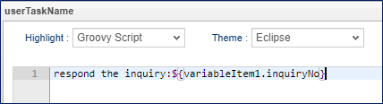
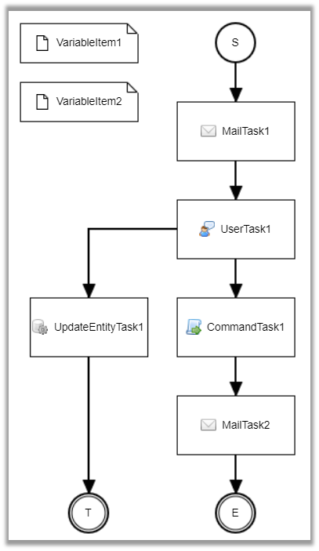

[[practice]]
== Practical Section
In the practical section, we will assemble complicated processes by combining multiple workflow functions.

[[inquiry]]
=== Inquiry

Imagine such workflow to deal with customer inquiry: When the inquiry comes, start a workflow and assign the employee to respond, and then let the superior to approve the result.
The simple flow is as follows.

[[inquiry_preparation]]
==== Preparation
.Create Entity
Prepare an entity named "practice.PracticeWorkflowEntity001".
The values to be set are as follows.

* Properties +
Open the created Entity and add the following properties from the Properties tab.

[cols="1,1,1,2a", options="header"]
|===
| Name | DisplayName | Type | Others
| inquiryNo | Inquiry number | AutoNumber | [cols="1,2", options="header"]
!===
!Item name!Setting value
!Format(Script)!in-${yyyy}${MM}-${nextVal()}
!===
| familyName | Last Name | String |
| firstName | First Name | String |
| familyNameReading | Last Name Reading | String |
| firstNameReading | First Name Reading | String |
| mail | email | String |
| content | Content | LongText |
| topic | type | Select | Add the following value to LocalValue. +
[cols="1,3", options="header"]
!===
!Value!Display Name
!1!About order
!2!About payment
!3!About receipt
!4!Others
!===
| inquiryStatus | Query Status | Select | Add the following value to LocalValue. +
[cols="1,3", options="header"]
!===
!Value!Display Name
!1!Waiting for response
!2!Responding
!3!Response completed
!4!Finished
!===
|===

* EventListeners +
Add the following settings from the EventListeners tab.

[options="header"]
|===
| Type | Script | Events
| Script | See below | afterInsert
|===

[source, groovy]
----
import java.util.LinkedHashMap;
import java.util.Map;
import org.iplass.mtp.workflow.WorkflowManager;

def wm = manager(WorkflowManager.class);

Map<String, Object> parameters = new LinkedHashMap<String, Object>();
parameters.put("variableItem1", entity);

wm.startProcess("practice/PracticeWorkflow001", parameters);
----

The Entity settings are now complete. Click the `Save` button to save. +
With this setting, Workflow will automatically starts after registering data in Entity.

.Creating Users
Please prepare the following users.
For users that have already been created, there is no need to prepare them again.

[options="header"]
|===
| User Id | Last Name | Mail Address | Member Of | Account Policy
| user001@workflow | user001 | user001@test.jp | GemUser | Standard
| user002@workflow | user002 | user002@test.jp | GemUser | Standard
| user003@workflow | user003 | user003@test.jp | GemUser | Standard
|===

[[inquiry_setting]]
==== Workflow Settings
.Workflow Creation

Create Workflow MetaData as follows.

[options = "header"]
|===
| Item name | Setting value
| name | practice/PracticeWorkflow001
| displayName | PracticeWorkflow001
| description | Query Management
|===

Display the created workflow and create the workflow shown below.
Refer to <<operation_method, operation method>> for specific operations.

image::images/inquiry_workflow_en.png[]

.Settings For Each Item
We are going set each item. Setting is not required for item that are not listed.

* StartEvent +
+
image::images/simple_setting-start.png[]
+
[options="header"]
|===
| Item name | Setting value
| historyLogging| true
|===

* EndEvent +
+
image::images/simple_setting-end.png[]
+
[options="header"]
|===
| Item name | Setting value
| historyLogging | true
|===

* UserTask1 +
+
image::images/inquiry_setting-task1_en.png[]
+
[options="header"]
|===
| Item name | Setting value
| historyLogging | true
| assignRule | referring assignRule
| taskResultStatus | referring taskResultStatus
| userTaskName | respond the inquiry:${variableItem1.inquiryNo}
|===
+

** assignRule +
+
[options = "header"]
|===
| Item name | Setting value
| Type | ById
| Apply flow name | *
| Allocation type | ALL
| Completion Conditions | ANYONE
| Definition Format | EQL
| ID acquisition logic | state = 'V'
|===

** taskResultStatus +
+
[options = "header"]
|===
| Item name | Setting value
| name | ok
| displayName | Done
|===

* UpdateEntityTask1 +
+

+
[cols="1,2a", options = "header"]
|===
| Item name | Setting value
| historyLogging | true
| variableName | variableItem1
.3+| updateRule | [options="header"]
!===
!Item name!Setting value
!Type!property
!Property name!inquiryStatus
!Updated value!3
!===
|===

* UserTask2 +
+

+
[options = "header"]
|===
| Item name | Setting value
| historyLogging | true
| assignRule |See  assignRule
| taskResultStatus | See taskResultStatus
| userTaskName | Approval for inquiries:${variableItem1.inquiryNo}
|===

** assignRule +
+
[options = "header"]
|===
| Item name | Setting value
| Type | ById
| Apply flow name | *
| Allocation type | ANYONE
| Completion Conditions | ANYONE
| Definition Format | EQL
| ID acquisition logic | state = 'V'
|===

** taskResultStatus +
+
[options = "header"]
|===
| Item name | Setting value
| name | ok
| displayName | Approve
|===
+
[options = "header"]
|===
| Item name | Setting value
| name | ng
| displayName | Send back
|===

* SequenceFlow (UserTask2 → UpdateEntityTask3) +
+
image::images/inquiry_setting-flow1_en.png[]
+
This is the flow for approval.
+
[options = "header"]
|===
| Item name | Setting value
| nodeResultStatus | ok
|===

* SequenceFlow (UserTask2 → UpdateEntityTask2) +
+

+
This is the flow for sending back.
+
[options = "header"]
|===
| Item name | Setting value
| nodeResultStatus | ng
|===

* UpdateEntityTask2 +
+

+
[cols="1,2a", options = "header"]
|===
| Item name | Setting value
| historyLogging | true
| variableName | variableItem1
.3+| updateRule | [options="header"]
!===
!Item name!Setting value
!Type!property
!Property name!inquiryStatus
!Updated value!2
!===
|===

* UpdateEntityTask3 +
+

+
[cols="1,2a", options = "header"]
|===
| Item name | Setting value
| historyLogging | true
| variableName | variableItem1
.3+| updateRule | [options="header"]
!===
!Item name!Setting value
!Type!property
!Property name!inquiryStatus
!Updated value!4
!===
|===
+
The workflow settings are now complete. Click the `Save` button to save.

Up to this point, you are ready to use this Workflow.
Let’s try it from the next section.

==== Using Workflow
.Workflow startup
Please log in with an administrator account and the workflow will start by registering data to "PracticeWorkflowEntity001". 

.Workflow status check
Check your workflow as you would for a <<simple_tasklist, simple approval>>.

.UserTask operations
Log in as any user who is in charge (such as user001@workflow) and click the `Done` button.

It will no longer be displayed in MY tasks.
Select "Created task".
You can confirm that you are no longer the person in charge.

Log in as the assigned user and click the `Approve` button to complete the task.

Log in as the person in charge and perform task processing.

The above is the query management management workflow.

[[delivery]]
=== Delivery Management

Create a workflow to perform the allocation process using the queue.

[[delivery_preparation]]
==== preparation
.Create Entity
Prepare an entity named "practice.PracticeWorkflowEntity002".
The values to be set are as follows.

* Properties +
Open the created Entity and add the following properties from the Properties tab.

[cols = "1,1,1,2a", options = "header"]
|===
| Name | DisplayName | Type |
| settlementNo | Request Number | AutoNumber | [cols="1,2", options="header"]
!===
!Item name!Setting value
!Format(Script)!se-${yyyy}${MM}-${nextVal()}
!===
| settlementStatus | Request Status | Select | Add the following value to LocalValue. +
[cols="1,3", options="header"]
!===
!Value!Display Name
!1!Before Payment
!2!Delivery completed
!3!Delivery not possible
!===
| deliverGoodsDate | Expected Delivery Date | Date |
| orderMail | Email | String |
|===

* EventListeners +
Add the following settings from the EventListeners tab.

[options="header"]
|===
|Type|Script|Events
|Script|See below|afterInsert
|===

[source, groovy]
----
import java.util.LinkedHashMap;
import java.util.Map;
import org.iplass.mtp.workflow.WorkflowManager;

def wm = manager(WorkflowManager.class);

Map<String, Object> parameters = new LinkedHashMap<String, Object>();
parameters.put("variableItem1", entity);
parameters.put("variableItem2", entity.orderMail);
wm.startProcess("practice/PracticeWorkflow002", parameters);
----

The Entity settings are now complete. Click the `Save` button to save. +
With this setting, Workflow will automatically starts after registering data in Entity.

[[create_user_task_queue]]
.Creating UserTaskQueue
This time we will use UserTaskQueue.
UserTaskQueue is a way to pool tasks into a queue without assigning them directly to users.

Perform the following steps to register the data for using UserTaskQueue in advance.

. AdminConsole +
From Menu under View Components, right-click EntityMenuItem to create the menu below and place it in the Menu Tree.
+

+
[options="header"]
|===
| Item name | Setting value
| name | mtp/workflow/UserTaskQueue
| displayName | UserTaskQueue
| entity | mtp.workflow.UserTaskQueue
|===
+
. GEM pages +
Please update the GEM top screen and register the following data from the added UserTaskQueue menu screen.
+

+
[options="header"]
|===
| Item name | Setting value
| BasicContents.Name | practiceWorkflowQueue002
| ObjectInformation.Code | practiceWorkflowQueue002
|===

.Creating Users
Please prepare the following users.
For users that have already been created, there is no need to prepare them again.

[options="header"]
|===
| User Id | Last Name | Mail Address | Member Of | Account Policy
| user001@workflow | User001 | user001@test.jp | GemUser | Standard
| user002@workflow | User002 | user002@test.jp | GemUser | Standard
| user003@workflow | User003 | user003@test.jp | GemUser | Standard
|===

.Creating MailTemplate
Prepare the following two MailTemplates.

* practice/PracticeWorkflow002_001

* practice/PracticeWorkflow002_002

[options="header"]
|===
| Name | Display Name | Description
| practice/PracticeWorkflow002_001 | PracticeWorkflow002_001 | Order Confirmation
| practice/PracticeWorkflow002_002 | PracticeWorkflow002_002 | Shipping your order
|===

Please set the Subject and Text message content as desired.

.Command creation
Prepare the following command.

* practice/PracticeWorkflowCommand002

[options="header"]
|===
|Name|Display Name|Description|Type|Command Attribute
|practice/PracticeWorkflowCommand002|PracticeWorkflowCommand002|Command to update the request|Script|See below
|===

[source, groovy]
----
import org.iplass.mtp.entity.UpdateOption;
import org.iplass.mtp.entity.SelectValue;
import org.iplass.mtp.impl.core.ExecuteContext;

def settlement = request.getAttribute("variableItem1");

// Request status
settlement.setValue("settlementStatus", new SelectValue("2"));

// Estimated delivery date
settlement.setValue("deliverGoodsDate", ExecuteContext.getCurrentContext().getCurrentTimestamp());

UpdateOption option = new UpdateOption(false);
option.setUpdateProperties("settlementStatus", "deliverGoodsDate");
em.update(settlement, option);
----

[[delivery_setting]]
==== Workflow Settings
.Workflow Creation
Create Workflow MetaData as follows.

[options = "header"]
|===
| Item name | Setting value
| name | practice/PracticeWorkflow002
| displayName | PracticeWorkflow002
| description | Shipping Management
|===

Display the created workflow and create the workflow shown below.
Refer to <<operation_method, operation method>> for specific operations.

.Settings for each item
Please set the properties for each item.
Setting is not required for items that are not listed.

* StartEvent +
+
image::images/simple_setting-start.png[]
+
[options="header"]
|===
| Item name | Setting value
| historyLogging | true
|===

* EndEvent +
+
image::images/simple_setting-end.png[]
+
[options="header"]
|===
| Item name | Setting value
| historyLogging | true
|===

* VariableItem2 +
+
image::images/delivery_setting-variable_en.png[]
+
[options = "header"]
|===
| Item name | Setting value
| name | variableItem2
| displayName | VariableItem2
|===
+
*This time, VariableItem is used separately from EntityData in order to retain the mail transmission destination.

* MailTask1 +
+

+
[cols="1,2a", options="header"]
|===
| Item name | Setting value
| historyLogging | true
| mailTemplateName | practice/PracticeWorkflow002_001
.2+| to |[options="header"]
!===
!Item name!Setting value
!Definition format!SCRIPT
!to acquisition logic!variableItem2
!===
|===

* UserTask1 +
+

+
[options = "header"]
|===
| Item name | Setting value
| historyLogging | true
| assignRule | referring assignRule
| taskResultStatus | referring taskResultStatus
| userTaskName | Delivery Processing: ${variableItem1.settlementNo}
|===
+

** assignRule +
+
[options = "header"]
|===
| Item name | Setting value
| Type | ToQueue
| Apply flow name | *
| Allocation type | ANYONE
| Completion Conditions | ANYONE
| QueueCode acquisition logic | return "practiceWorkflowQueue002";
|===
+
We will set assignRule like we did before.
This time we will use Queue.
Set as shown below.
+

+
Note that if the <<create_user_task_queue, UserTaskQueue registration work>>for this workflow is not completed, an error will occur when executing the workflow.

** taskResultStatus +
+
[options = "header"]
|===
| Item name | Setting value
| name | ok
| displayName | Delivery Completed
|===
+
[options = "header"]
|===
| Item name | Setting value
| name | ng
| displayName | Undeliverable
|===

* SequenceFlow (UserTask1 → CommandTask1) +
+

+
This is the flow for delivery completed.
+
[options = "header"]
|===
| Item name | Setting value
| nodeResultStatus | ok
|===

* SequenceFlow (UserTask1 → UpdateEntityTask1) +
+
image::images/delivery_setting-flow2_en.png[]
+
This is the flow for undeliverable.
+
[options = "header"]
|===
| Item name | Setting value
| nodeResultStatus | ng
|===

* UpdateEntityTask1 +
+
image::images/delivery_setting-task3_en.png[]
+
[cols="1,2a", options = "header"]
|===
| Item name | Setting value
| historyLogging | true
| variableName | variableItem1
.3+| updateRule | [options="header"]
!===
!Item name!Setting value
!Type!property
!Property name!settlementStatus
!Updated value!3
!===
|===

* CommandTask1 +
+
image::images/delivery_setting-task4_en.png[]
+
[options = "header"]
|===
| Item name | Setting value
| historyLogging | true
| commandConfig | practice/PracticeWorkflowCommand002
|===

* MailTask2 +
+
image::images/delivery_setting-task5_en.png[]
+
[cols="1,2a", options = "header"]
|===
| Item name | Setting value
| historyLogging | true
| mailTemplateName | practice/PracticeWorkflow002_002
.2+| to | [options="header"]
!===
!Item name!Setting value
!Definition format!SCRIPT
!to acquisition logic!variableItem2
!===
|===
+
The workflow settings are now complete. Click the `Save` button to save.

Up to this point, you are ready to use this Workflow.
Let’s try it from the next section.

==== Using Workflow
.Workflow startup
Please log in with an administrator account and the workflow will start by registering data to "PracticeWorkflowEntity002". +
Please be sure to set a value in the email field to confirm email transmission.

An email will be sent to you upon registration.

.Workflow status check
Check your workflow as you would for a <<simple_tasklist, simple approval>>.

.UserTask Operations
Check the created task from the top screen of the administrator account.

image::images/delivery_tasklist1_en.png[]

This time, since the assignment is to the task queue instead of the user, it will not be automatically added to MY tasks. +
Log in with user ID: user001@workflow and assign the target task from all tasks.

If you look at the MY task, you can see that it is already assigned.

Click the Edit MY Task link to process the task.

Click on `Delivery Completed` this time.
An email will be sent upon completion.
Additionally, if you click Undeliverable during task processing, the billing status will be treated as undeliverable.

The above is all for the delivery management workflow.

[[proceedings]]
=== Minutes Approval

Imagine this situation: The designer want to use the data lock function to prevent changes once the minutes are approved.

In the flow with notification, the mail sending task is executed after the task is completed.

[[proceedings_preparation]]
==== Preparation
.Create Entity
Prepare an entity named "practice.PracticeWorkflowEntity003".
The values to be set are as follows.

* Properties +
Open the created Entity and add the following properties from the Properties tab.

[cols = "1,1,1,1,2a", options = "header"]
|===
| Name | DisplayName | Type | multiple | Others
| minutes | Minutes | Binary | 1 |
| members | Circulation Destination | Reference | * |!===
!Item name!Setting value
!Reference Entity!mtp.auth.User
!===
| authorizerList | Authorizer List | Binary | 1 |
|===

The Entity settings are now complete. Click the `Save` button to save.

.Creating Users
Please prepare the following users.
For users that have already been created, there is no need to prepare them again.

[options="header"]
|===
| User Id | Last Name | Mail Address | Member Of | Account Policy
| user001@workflow | user001 | user001@test.jp | GemUser | Standard
| user002@workflow | user002 | user002@test.jp | GemUser | Standard
| user003@workflow | user003 | user003@test.jp | GemUser | Standard
|===

.Creating MailTemplate
Please prepare the following five MailTemplates.

[options="header"]
|===
| Name | Display Name | Description
| practice/PracticeWorkflow003_001 | PracticeWorkflow003_001 | Notice of minutes submission
| practice/PracticeWorkflow003_002 | PracticeWorkflow003_002 | Notification of approval/disapproval request
| practice/PracticeWorkflow003_003 | PracticeWorkflow003_003 | Approval notice
| practice/PracticeWorkflow003_004 | PracticeWorkflow003_004 | Notification of rejection
| practice/PracticeWorkflow003_005 | PracticeWorkflow003_005 | Completion notice
|===

Set the subject and content as desired.

.Command Creation
Prepare the following command.

[cols="4,3,2,1,2a", options="header"]
|===
|Name|Display Name|Description|Type|Script
|practice/PracticeWorkflowCommand003_001|PracticeWorkflowCommand003_001|Automatic approval process|Script|<<practice_command003_001, See below>>
|practice/PracticeWorkflowCommand003_002|PracticeWorkflowCommand003_002|Approver list generation process|Script|<<practice_command003_002, See below>>
|practice/PracticeWorkflowCommand003_003|PracticeWorkflowCommand003_003|freeze|Script|<<practice_command003_003, See below>>
|===

[[practice_command003_001]]
* practice/PracticeWorkflowCommand003_001 (Automatic approval process) +
It is a process to automatically setting the target registered in the to "approve" even if "not approved" for a certain period (timer setting).
This command is executed when the period set by the timer has passed.

[source, groovy]
----
import org.iplass.mtp.entity.query.Query;
import org.iplass.mtp.entity.query.condition.predicate.Equals;
import org.iplass.mtp.entity.EntityManager;
import org.iplass.mtp.entity.SearchResult;
import org.iplass.mtp.entity.SelectValue;
import org.iplass.mtp.entity.UpdateOption;
import org.iplass.mtp.workflow.Assignment;
import org.iplass.mtp.workflow.UserTask;

System.out.println("### START PracticeWorkflowCommand003_001");

// Retrieve the Workflow oid from the context
def workflowId = request.workflowInstanceId;

// Generate the definitionKey of UserTask(Workflow definition name + Usertask name + workflow ID)
def definitionKey = "practice/PracticeWorkflow003-" + "userTask3-" + workflowId;

// get UserTask
Query taskQuery = new Query()
    .selectAll("mtp.workflow.UserTask", false, false)
    .from("mtp.workflow.UserTask").where(new Equals("definitionKey", definitionKey));

UserTask userTask = (UserTask) em.searchEntity(taskQuery).getFirst();
String userTaskOid = userTask.getOid();

// get Assignment from UserTask.oid
Query assignmentQuery = new Query()
    .selectAll("mtp.workflow.Assignment", false, false)
    .from("mtp.workflow.Assignment")
    .where(new Equals("task.oid", userTaskOid));
SearchResult<Assignment> assignment = em.searchEntity(assignmentQuery);

for (Assignment e : assignment) {
  String assignState = e.getAssignState().getValue();
  System.out.println("assignState : " + assignState);

  // Update all assignments which no action were taken to Completed
  if ("ASSIGNED".equals(assignState)) {
    UpdateOption option = new UpdateOption();
    option.setUpdateProperties("assignState", "taskResult", "comment");
    e.setAssignState(new SelectValue("COMPLETED"));
    e.setComment("Automatic Approval");
    e.setTaskResult("ok");
    em.update(e, option);
  }
}
----

[[practice_command003_002]]
* practice/PracticeWorkflowCommand003_002(Approver list generation process) +
Acquire only "Approved" users (including automatic approval) and then create a CSV file.
It is also the process of registering the created file in the minutes workflow entity.

[source, groovy]
----
import org.iplass.mtp.entity.query.Query;
import org.iplass.mtp.entity.query.condition.predicate.Equals;
import org.iplass.mtp.entity.BinaryReference;
import org.iplass.mtp.entity.EntityManager;
import org.iplass.mtp.entity.SearchResult;
import org.iplass.mtp.entity.UpdateOption;
import org.iplass.mtp.workflow.Assignment;
import org.iplass.mtp.workflow.UserTask;

import java.io.ByteArrayInputStream;
import java.io.InputStream;
import java.io.IOException;

System.out.println("### PracticeWorkflowCommand003_002");

// Get wokrflow oid from context
def workflowId = request.workflowInstanceId;
System.out.println("### worflowId : " + workflowId);

// Generate the definitionKey of UserTask(Workflow definition name + Usertask name + workflow ID)
def definitionKey = "practice/PracticeWorkflow003-" + "userTask3-" + workflowId;

// get UserTask
Query taskQuery = new Query()
    .selectAll("mtp.workflow.UserTask", false, false)
    .from("mtp.workflow.UserTask")
    .where(new Equals("definitionKey", definitionKey));

UserTask userTask = (UserTask) em.searchEntity(taskQuery).getFirst();
String userTaskOid = userTask.getOid();

// Get Assignment from UserTask.oid
Query AssignmentQuery = new Query()
    .selectAll("mtp.workflow.Assignment", false, true)
    .from("mtp.workflow.Assignment")
    .where(new Equals("task.oid", userTaskOid));

SearchResult<Assignment> assignment = em.searchEntity(AssignmentQuery);

// Approver list generation
def authorizerList = "";
for (Assignment e : assignment) {
    if ("ok".equals(e.taskResult)) {
        authorizerList = authorizerList + e.user.name + "\r\n";
    }
}

// Create InputStream to use BinaryReference from Approver information String
InputStream is = new ByteArrayInputStream(authorizerList.getBytes());

// create BinaryReference
BinaryReference br = em.createBinaryReference("approverList.csv", "text/csv", is);

// Close stream
try {
  is.close();
} catch (IOException e) {
  e.printStackTrace();
}

// operation on Entity
def entity = request.getAttribute("variableItem1");
entity.setValue("authorizerList", br);

// update
UpdateOption option = new UpdateOption();
option.setUpdateProperties("authorizerList");
em.update(entity, option);
----

[[practice_command003_003]]
* practice/PracticeWorkflowCommand003_003(Freeze) +
This process locks the registered minutes, circulation user, and approver list so that they cannot be updated.

[source, groovy]
----
import org.iplass.mtp.entity.query.Query;
import org.iplass.mtp.entity.query.condition.predicate.Equals;
import org.iplass.mtp.entity.EntityManager;
import org.iplass.mtp.entity.UpdateOption;

System.out.println("### PracticeWorkflowCommand003_003");

// Get workflow oid from context
def workflowId = request.workflowInstanceId;

// Get WorkflowTarget from workflowId
Query workflowTargetQuery = new Query()
    .select("targetEntityOid")
    .from("mtp.workflow.WorkflowTarget")
    .where(new Equals("workflow.oid", workflowId));

def workflowTarget = em.searchEntity(workflowTargetQuery).getFirst();

// Entities to be freezed
def entity = em.lockByUser(workflowTarget.targetEntityOid, "practice.PracticeWorkflowEntity003");
----

[[proceedings_setting]]
==== Workflow Settings
.Workflow Creation
Create Workflow MetaData as follows.

[options = "header"]
|===
| Item name | Setting value
| name | practice/PracticeWorkflow003
| displayName | PracticeWorkflow003
| description | Meeting Approval
|===

Display the created workflow and create the workflow shown below.
Refer to <<operation_method, operation method>> for specific operations.

image::images/approval_workflow_en.png[]

.Settings for each item
Let's set the property for each item. Setting is not required for items that are not listed.

* UserTask1 +
+
image::images/approval_setting-task1_en.png[]
+
[options = "header"]
|===
| Item name | Setting value
| assignRule | See assignRule
| taskResultStatus | See taskResultStatus
|===

** assignRule +
+
[options = "header"]
|===
| Item name | Setting value
| Type | ById
| Apply flow name | *
| Allocation type | ANYONE
| Completion Conditions | ANYONE
| Definition format | STRING
| ID acquisition logic | authorizer@workflow
|===

** taskResultStatus +
+
[options = "header"]
|===
| Item name | Setting value
| name | post
| displayName | Submit minutes
|===

* MailTask1 +
+
image::images/approval_setting-task2_en.png[]
+
[cols="1,2a", options = "header"]
|===
| Item name | Setting value
| mailTemplateName | practice/PracticeWorkflow003_001
.2+| to | [options="header"]
!===
!Item name!Setting value
!Definition format!STRING
!to get logic!any address
!===
|===

* UserTask2 +
+
image::images/approval_setting-task3_en.png[]
+
[options = "header"]
|===
| Item name | Setting value
| assignRule | See  assignRule
| taskResultStatus | See taskResultStatus
|===

** assignRule +
+
[options = "header"]
|===
| Item name | Setting value
| Type | ById
| Apply flow name | *
| Allocation type | ALL
| Completion Conditions | ANYONE
| Definition format | STRING
| ID acquisition logic | authorizer@workflow
|===

** taskResultStatus +
+
[options = "header"]
|===
| Item name | Setting value
| name | memberset
| displayName | circulation destination set
|===
+
[options = "header"]
|===
| Item name | Setting value
| name | ngminutes
| displayName | Return the minutes
|===

* MailTask2 +
+

+
[cols="1,2a", options = "header"]
|===
| Item name | Setting value
| mailTemplateName | practice/PracticeWorkflow003_002
.2+| to | [options="header"]
!===
!Item name!Setting value
!Definition format!STRING
!to get logic!any address
!===
|===

* IntermediateTimerEvent1 +
+
image::images/approval_setting-event1_en.png[]
+
[cols="1,2a", options = "header"]
|===
| Item name | Setting value
| timer | [options="header"]
!===
!Item name!Setting value
!Timer Type!Delay
!Timer Unit!Minuites
!Delay Expression!"3"
!===
|===

* CommandTask1 +
+

+
[options = "header"]
|===
| Item name | Setting value
| commandConfig | practice/PracticeWorkflowCommand003_001
|===

* UserTask3 +
+
image::images/approval_setting-task6_en.png[]
+
[options = "header"]
|===
| Item name | Setting value
| assignRule | See assignRule
| taskResultStatus | See taskResultStatus
|===

** assignRule +
+
[options = "header"]
|===
| Item name | Setting value
| Type | ById
| Apply flow name | *
| Allocation type | ALL
| Completion Conditions | VOTE
| Definition Format | SCRIPT
| ID acquisition logic | See code below
|===
+
Obtaining account ID set in members of the target Entity.
+
[source, groovy]
----
import org.iplass.mtp.entity.query.Query;
import org.iplass.mtp.entity.query.condition.predicate.Equals;
import org.iplass.mtp.entity.EntityManager;

Query membersQuery = new Query()
    .select("members.accountId")
    .from("practice.PracticeWorkflowEntity003")
    .where(new Equals("oid", variableItem1.oid));

def em = manager(EntityManager.class);
def members = em.searchEntity(membersQuery).getList();

def result = [];
int cnt = 0;
for (def e : members) {
    System.out.println(e.members.accountId);
    result[cnt] = e.members.accountId;
    cnt ++;
}

return result;
----

** taskResultStatus +
+
[options = "header"]
|===
| Item name | Setting value
| name | ok
| displayName | Approve
|===
+
[options = "header"]
|===
| Item name | Setting value
| name | ng
| displayName | Reject
|===

* MailTask3 +
+

+
[cols="1,2a", options = "header"]
|===
| Item name | Setting value
| mailTemplateName | practice/PracticeWorkflow003_003
.2+| to | [options="header"]
!===
!Item name!Setting value
!Definition format!STRING
!to get logic!any address
!===
|===

* MailTask4 +
+
image::images/approval_setting-task8_en.png[]
+
[cols="1,2a", options = "header"]
|===
| Item name | Setting value
| mailTemplateName | practice/PracticeWorkflow003_004
.2+| to | [options="header"]
!===
!Item name!Setting value
!Definition format!STRING
!to get logic!any address
!===
|===

* CommandTask2 +
+

+
[options = "header"]
|===
| Item name | Setting value
| commandConfig | practice/PracticeWorkflowCommand003_002
|===

* CommandTask3 +
+

+
[options = "header"]
|===
| Item name | Setting value
| commandConfig | practice / PracticeWorkflowCommand003_003
|===

* MailTask5 +
+

+
[cols="1,2a", options = "header"]
|===
| Item name | Setting value
| mailTemplateName | practice/PracticeWorkflow003_005
.2+| to | [options="header"]
!===
!Item name!Setting value
!Definition format!STRING
!to get logic!any address
!===
|===

* SequenceFlow (UserTask2 → UserTask1) +
+

+
This is the flow for return the minutes.
+
[options = "header"]
|===
| Item name | Setting value
| nodeResultStatus | ngminutes
|===

* SequenceFlow (UserTask2 → SP) +
+
image::images/approval_setting-flow4.png[]
+
This is the flow for the circulation destination set (approval route).
+
[options="header"]
|===
| Item name | Setting value
| nodeResultStatus | memberset
|===

* SequenceFlow (UserTask3 → MailTask4 → UserTask2) +
+

+
The flow for reject.
+
[options="header"]
|===
| Item name | Setting value
| nodeResultStatus | ng
|===

* SequenceFlow (UserTask3 → MailTask3) +
+

+
[options = "header"]
|===
| Item name | Setting value
| nodeResultStatus | ok
|===
+
The workflow settings are now complete. Click the `Save` button to save.

Up to this point, you are ready to use this Workflow.
Let’s try it from the next section.

.EntityView Settings
From here, it will the prerequisite works so to use the workflow created in the previous operation.

* DetailFormView settings +
Open the "DetailLayout" of "practice.PracticeWorkflowEntity003" created in <<proceedings_preparation, Preparation>>,
After performing the standard load in the same way as <<simple_setting-detailview, simple approval>>, please set the following.
+
[options = "header"]
|===
| Item name | Setting value
| Workflow definition name | practice/PracticeWorkflow003
| Workflow variable name | variableItem1
| Button display name | Minute workflow launch
| Message of running process | The minutes workflow is running.
|===

* SearchLayout settings +
Open "SearchLayout" of "practice.PracticeWorkflowEntity003" and save after performing standard load.

Up to this point, you are ready to use this Workflow.
Let's use Workflow in the next section.

==== Using Workflow
.Workflow Startup
Log in with an administrator account, create any data in the Entity in the same way as <<simple_startworkflow, simple approval>>, and then start the workflow. +
Object information will be added in a later step, so leave it unset here.

.Workflow Status Check
Check your workflow as you would for a <<simple_tasklist, simple approval>>.

[[approval_create-data]]
.UserTask Operations
Log in with user ID: authorizer@workflow and
Click the "Edit" link for userTask1 in the task list on the top screen.
When you click the link in "Task target data" on the displayed "Task processing" edit screen, the Entity details screen will be displayed as a dialog, so click the `Edit` button.

On the edit screen that appears, register any file (docx, xlsx, txt, etc.) in the minutes and save it.
After that, enter any comments on the "Task Processing" edit screen and click the `Submit minutes` button to proceed with the flow.

You will be notified by email when you click the `Submit minutes` button.

Register the circulation destination and execute the circulation destination set.

Log in with user ID: authorizer@workflow,
Click the "Edit" link for userTask2 in the task list on the top screen. +
Similar to <<approval_create-data, when registering minutes>>, select the following circulation destination on the Entity data editing screen and save.

* user001@workflow
* user002@workflow
* user003@workflow

The user set here becomes the approver/denier.

After that, enter any comments on the userTask2 edit screen and click the `set circulation destination` button to proceed with the flow.

You will be notified by email when you click the `circulation destination set` button.

Approve the record with the specified user or wait for the time set by the timer.
An email notification will be sent when the approval judgment is completed.

When the workflow is complete, verify that the approver list is registered and locked.

The above is the minutes approval workflow.