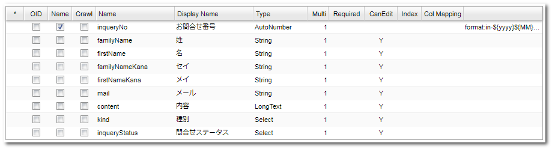
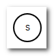
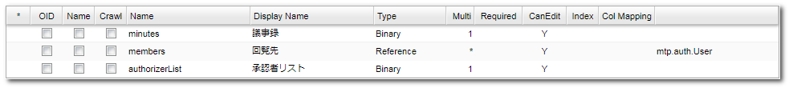

[[practice]]
== 実践編
実践編ではワークフローの複数の機能を組み合わせて複雑な処理を組み立てていきます。

[[inquiry]]
=== 問合せ管理

問合せがあった場合に、対応及び、上長の対応確認を実施するフローを実現します。
簡単な流れは以下のようになります。

[[inquiry_preparation]]
==== 事前準備
.Entityの作成
「practice.PracticeWorkflowEntity001」というEntityを作成してください。

* Properties +
作成したEntityを開き、Propertiesタブから以下のプロパティを追加してください。

[cols="1,1,1,2a", options="header"]
|===
|Name|Display Name|Type|その他
|inquiryNo|お問合せ番号|AutoNumber|[cols="1,2", options="header"]
!===
!項目!設定値
!書式(Script)!in-${yyyy}${MM}-${nextVal()}
!===
|familyName|姓|String|
|firstName|名|String|
|familyNameKana|セイ|String|
|firstNameKana|メイ|String|
|mail|メール|String|
|content|内容|LongText|
|kind|種別|Select|LocalValueに以下の値を追加します。 +
[cols="1,3", options="header"]
!===
!Value!Display Name
!1!注文について
!2!支払いについて
!3!受け取りについて
!4!その他
!===
|inquiryStatus|問合せステータス|Select|LocalValueに以下の値を追加します。 +
[cols="1,3", options="header"]
!===
!Value!Display Name
!1!未対応
!2!対応中
!3!対応完了
!4!終了
!===
|===

* EventListeners +
EventListenersタブから、以下の設定を追加してください。

[options="header"]
|===
|Type|Script|Events
|Script|下記を参照|afterInsert
|===

[source, groovy]
----
import java.util.LinkedHashMap;
import java.util.Map;
import org.iplass.mtp.workflow.WorkflowManager;

def wm = manager(WorkflowManager.class);

Map<String, Object> parameters = new LinkedHashMap<String, Object>();
parameters.put("variableItem1", entity);

wm.startProcess("practice/PracticeWorkflow001", parameters);
----

以上でEntityの設定は完了です。 `Save` ボタンをクリックして保存してください。 +
この設定により、Entityへのデータ登録後に自動的にWorkflowが起動するようになります。

.Userの作成
以下のユーザーを用意してください。
作成済のユーザーについては、改めて用意する必要はありません。

[options="header"]
|===
|ユーザーID|姓|メールアドレス|所属グループ|アカウントポリシー
|user001@workflow|ユーザー００１|user001@test.jp|GemUser|標準
|user002@workflow|ユーザー００２|user002@test.jp|GemUser|標準
|user003@workflow|ユーザー００３|user003@test.jp|GemUser|標準
|===

[[inquiry_setting]]
==== Workflowの設定
.Workflowの作成

下記の通りWorkflowのMetaDataを作成します。

[options="header"]
|===
|項目名|設定値
|name|practice/PracticeWorkflow001
|displayName|PracticeWorkflow001
|description|問合せ管理
|===

作成したワークフローを表示し、下図のワークフローを作成してください。
具体的な操作は<<operation_method,操作方法>>を参考にして下さい。

.各Itemの設定
各Itemの設定をしていきます。記載のない項目名については設定不要です。

* StartEvent +
+

+
[options="header"]
|===
|項目名|設定値
|historyLogging|true
|===

* EndEvent +
+
image::images/simple_setting-end.png[]
+
[options="header"]
|===
|項目名|設定値
|historyLogging|true
|===

* UserTask1 +
+
image::images/inquiry_setting-task1.png[]
+
[options="header"]
|===
|項目名|設定値
|historyLogging|true
|assignRule|assignRule参照
|taskResultStatus|taskResultStatus参照
|userTaskName|お問合せ対応:${variableItem1.inquiryNo}
|===
+

** assignRule +
+
[options="header"]
|===
|項目名|設定値
|タイプ|ById
|適用フロー名|*
|割当種別|ALL
|完了条件|ANYONE
|定義形式|EQL
|ID取得ロジック|state = 'V'
|===

** taskResultStatus +
+
[options="header"]
|===
|項目名|設定値
|name|ok
|displayName|完了
|===

* UpdateEntityTask1 +
+
image::images/inquiry_setting-task2.png[]
+
[cols="1,2a", options="header"]
|===
|項目名|設定値
|historyLogging|true
|variableName|variableItem1
.3+|updateRule|[options="header"]
!===
!項目名!設定値
!タイプ!property
!プロパティ名!inquiryStatus
!更新値!3
!===
|===

* UserTask2 +
+
image::images/inquiry_setting-task3.png[]
+
[options="header"]
|===
|項目名|設定値
|historyLogging|true
|assignRule|assignRule参照
|taskResultStatus|taskResultStatus参照
|userTaskName|お問合せ対応の承認:${variableItem1.inquiryNo}
|===

** assignRule +
+
[options="header"]
|===
|項目名|設定値
|タイプ|ById
|適用フロー名|*
|割当種別|ANYONE
|完了条件|ANYONE
|定義形式|EQL
|ID取得ロジック|state = 'V'
|===

** taskResultStatus +
+
[options="header"]
|===
|項目名|設定値
|name|ok
|displayName|承認
|===
+
[options="header"]
|===
|項目名|設定値
|name|ng
|displayName|差し戻し
|===

* SequenceFlow(UserTask2 → UpdateEntityTask3) +
+

+
承認の場合のフローになります。
+
[options="header"]
|===
|項目名|設定値
|nodeResultStatus|ok
|===

* SequenceFlow(UserTask2 → UpdateEntityTask2) +
+
image::images/inquiry_setting-flow2.png[]
+
差し戻しの場合のフローになります。
+
[options="header"]
|===
|項目名|設定値
|nodeResultStatus|ng
|===

* UpdateEntityTask2 +
+
image::images/inquiry_setting-task4.png[]
+
[cols="1,2a", options="header"]
|===
|項目名|設定値
|historyLogging|true
|variableName|variableItem1
.3+|updateRule|[options="header"]
!===
!項目名!設定値
!タイプ!property
!プロパティ名!inquiryStatus
!更新値!2
!===
|===

* UpdateEntityTask3 +
+
image::images/inquiry_setting-task5.png[]
+
[cols="1,2a", options="header"]
|===
|項目名|設定値
|historyLogging|true
|variableName|variableItem1
.3+|updateRule|[options="header"]
!===
!項目名!設定値
!タイプ!property
!プロパティ名!inquiryStatus
!更新値!4
!===
|===
+
以上でWorkflowの設定は完了です。 `Save` ボタンをクリックして保存してください。 

ここまででWorkflow利用準備が完了しました。
次項からはWorkflowを利用してみましょう。

==== Workflowの利用
.Workflowの起動
管理者アカウントでログインし、「practice.PracticeWorkflowEntity001」にデータを登録することでWorkflowが自動的に起動します。

.Workflowのステータス確認
<<simple_tasklist, 単純な承認>>と同様にワークフローを確認してください。

.UserTaskの操作
担当者になっている任意のユーザー（user001@workflow 等）でログインし、 `完了` ボタンをクリックします。

MYタスクには表示されなくなります。
「作成したタスク」を選択してください。
担当者が自分ではなくなっていることが確認できます。

image::images/inquiry_mytask.png[]

担当者になっているユーザーでログインし、 `承認` ボタンをクリックしてタスクを完了させます。

完了したタスクを確認すると、以下のようになっていると思います。

以上が問合せ管理Workflowとなります。

[[delivery]]
=== 配送管理

キューを利用した割り当て処理を行うワークフローを作成します。

[[delivery_preparation]]
==== 事前準備
.Entityの作成
「practice.PracticeWorkflowEntity002」というEntityを準備しておいてください。

* Properties +
作成したEntityを開き、Propertiesタブから以下のプロパティを追加してください。

[cols="1,1,1,2a", options="header"]
|===
|Name|Display Name|Type|その他
|settlementNo|請求番号|AutoNumber|[cols="1,2", options="header"]
!===
!項目!設定値
!書式(Script)!se-${yyyy}${MM}-${nextVal()}
!===
|settlementStatus|請求状況|Select|LocalValueに以下の値を追加します。 +
[cols="1,3", options="header"]
!===
!Value!Display Name
!1!入金前
!2!配送完了
!3!配送不可
!===
|deliverGoodsDate|納品予定日|Date|
|orderMail|メール|String|
|===

* EventListeners +
EventListenersタブから、以下の設定を追加してください。

image::images/delivery_listener.png[]

[options="header"]
|===
|Type|Script|Events
|Script|下記を参照|afterInsert
|===

[source, groovy]
----
import java.util.LinkedHashMap;
import java.util.Map;
import org.iplass.mtp.workflow.WorkflowManager;

def wm = manager(WorkflowManager.class);

Map<String, Object> parameters = new LinkedHashMap<String, Object>();
parameters.put("variableItem1", entity);
parameters.put("variableItem2", entity.orderMail);
wm.startProcess("practice/PracticeWorkflow002", parameters);
----

以上でEntityの設定は完了です。 `Save` ボタンをクリックして保存してください。 +
この設定により、Entityへのデータ登録後に自動的にWorkflowが起動するようになります。

[[create_user_task_queue]]
.UserTaskQueueの作成
今回はUserTaskQueueを利用します。
UserTaskQueueとは、ユーザーに直接タスクを割り当てずに、キューにタスクをプールする方法です。

以下の手順を実施し、事前にUserTaskQueueを利用するためのデータを登録しておきます。

. AdminConsole +
View Components配下にあるMenuから、EntityMenuItemを右クリックして以下のメニューを作成し、Menu Treeに設置します。
+

+
[options="header"]
|===
|項目名|設定値
|name|mtp/workflow/UserTaskQueue
|displayName|UserTaskQueue
|entity|mtp.workflow.UserTaskQueue
|===
+
. GEM画面 +
GEMのトップ画面を更新し、追加したUserTaskQueueのメニュー画面から以下のデータを新規登録してください。
+

+
[options="header"]
|===
|項目名|設定値
|基本項目.名前|practiceWorkflowQueue002
|オブジェクト情報.コード|practiceWorkflowQueue002
|===

.Userの作成
以下のユーザーを用意してください。
作成済のユーザーについては、改めて用意する必要はありません。

[options="header"]
|===
|ユーザーID|姓|メールアドレス|所属グループ|アカウントポリシー
|user001@workflow|ユーザー００１|user001@test.jp|GemUser|標準
|user002@workflow|ユーザー００２|user002@test.jp|GemUser|標準
|user003@workflow|ユーザー００３|user003@test.jp|GemUser|標準
|===

.MailTemplateの作成
以下の2つのMailTemplateを用意してください。

* practice/PracticeWorkflow002_001

* practice/PracticeWorkflow002_002

[options="header"]
|===
|Name|Display Name|Description
|practice/PracticeWorkflow002_001|PracticeWorkflow002_001|ご注文の確認
|practice/PracticeWorkflow002_002|PracticeWorkflow002_002|ご注文の発送
|===

件名、メッセージ内容は任意に設定して下さい。

.Commandの作成
以下のコマンドを用意してください。

* practice/PracticeWorkflowCommand002

[options="header"]
|===
|Name|Display Name|Description|Type|Command Attribute
|practice/PracticeWorkflowCommand002|PracticeWorkflowCommand002|請求更新コマンド|Script|下記を参照
|===

[source, groovy]
----
import org.iplass.mtp.entity.UpdateOption;
import org.iplass.mtp.entity.SelectValue;
import org.iplass.mtp.impl.core.ExecuteContext;

def settlement = request.getAttribute("variableItem1");

// 請求状況
settlement.setValue("settlementStatus", new SelectValue("2"));

// 納品予定日
settlement.setValue("deliverGoodsDate", ExecuteContext.getCurrentContext().getCurrentTimestamp());

UpdateOption option = new UpdateOption(false);
option.setUpdateProperties("settlementStatus", "deliverGoodsDate");
em.update(settlement, option);
----

[[delivery_setting]]
==== Workflowの設定
.Workflowの作成
下記の通りWorkflowのMetaDataを作成します。

[options="header"]
|===
|項目名|設定値
|name|practice/PracticeWorkflow002
|displayName|PracticeWorkflow002
|description|配送管理
|===

作成したワークフローを表示し、下図のワークフローを作成してください。
具体的な操作は<<operation_method,操作方法>>を参考にして下さい。

image::images/delivery_workflow.png[]

.各Itemの設定
各Itemの設定をしていきます。
記載のない項目名については設定不要です。

* StartEvent +
+

+
[options="header"]
|===
|項目名|設定値
|historyLogging|true
|===

* EndEvent +
+
image::images/simple_setting-end.png[]
+
[options="header"]
|===
|項目名|設定値
|historyLogging|true
|===

* VariableItem2 +
+

+
[options="header"]
|===
|項目名|設定値
|name|variableItem2
|displayName|VariableItem2
|===
+
※今回はメール送信先を保持するためにEntityDataとは別にVariableItemを利用します。

* MailTask1 +
+
image::images/delivery_setting-task1.png[]
+
[cols="1,2a", options="header"]
|===
|項目名|設定値
|historyLogging|true
|mailTemplateName|practice/PracticeWorkflow002_001
.2+|to|[options="header"]
!===
!項目名!設定値
!定義形式!SCRIPT
!to取得ロジック!variableItem2
!===
|===

* UserTask1 +
+
image::images/delivery_setting-task2.png[]
+
[options="header"]
|===
|項目名|設定値
|historyLogging|true
|assignRule|assignRule参照
|taskResultStatus|taskResultStatus参照
|userTaskName|配送処理：${variableItem1.settlementNo}
|===
+

** assignRule +
+
[options="header"]
|===
|項目名|設定値
|タイプ|ToQueue
|適用フロー名|*
|割当種別|ANYONE
|完了条件|ANYONE
|QueueCode取得ロジック|return "practiceWorkflowQueue002";
|===
+
今まで同様assignRuleを設定します。
今回はQueueを利用します。
下図のような設定にして下さい。
+

+
なお、事前準備の<<create_user_task_queue, UserTaskQueue登録作業>>が完了していない場合、ワークフロー実行時にエラーとなります。

** taskResultStatus +
+
[options="header"]
|===
|項目名|設定値
|name|ok
|displayName|配送完了
|===
+
[options="header"]
|===
|項目名|設定値
|name|ng
|displayName|配送不可
|===

* SequenceFlow(UserTask1 → CommandTask1) +
+
image::images/delivery_setting-flow1.png[]
+
配送完了の場合のフローになります。
+
[options="header"]
|===
|項目名|設定値
|nodeResultStatus|ok
|===

* SequenceFlow(UserTask1 → UpdateEntityTask1) +
+
image::images/delivery_setting-flow2.png[]
+
配送不可の場合のフローになります。
+
[options="header"]
|===
|項目名|設定値
|nodeResultStatus|ng
|===

* UpdateEntityTask1 +
+

+
[cols="1,2a", options="header"]
|===
|項目名|設定値
|historyLogging|true
|variableName|variableItem1
.3+|updateRule|[options="header"]
!===
!項目名!設定値
!タイプ!property
!プロパティ名!settlementStatus
!更新値!3
!===
|===

* CommandTask1 +
+

+
[options="header"]
|===
|項目名|設定値
|historyLogging|true
|commandConfig|practice/PracticeWorkflowCommand002
|===

* MailTask2 +
+
image::images/delivery_setting-task5.png[]
+
[cols="1,2a", options="header"]
|===
|項目名|設定値
|historyLogging|true
|mailTemplateName|practice/PracticeWorkflow002_002
.2+|to|[options="header"]
!===
!項目名!設定値
!定義形式!SCRIPT
!to取得ロジック!variableItem2
!===
|===
+
以上でWorkflowの設定は完了です。 `Save` ボタンをクリックして保存してください。 

ここまででWorkflow利用準備が完了しました。
次項からはWorkflowを利用してみましょう。

==== Workflowの利用
.Workflowの起動
管理者アカウントでログインし、「practice.PracticeWorkflowEntity002」にデータを登録することでWorkflowが自動的に起動します。 +
メール送信確認のため、メールの項目には必ず値を設定してください。

登録と同時にメールが送信されます。

.Workflowのステータス確認
<<simple_tasklist, 単純な承認>>と同様にワークフローを確認してください。

.UserTaskの操作
管理者アカウントのトップ画面から、作成したタスクを確認します。

image::images/delivery_tasklist1.png[]

今回は割り当てをユーザーではなくタスクキューにしている為、自動でMYタスクには入りません。 +
ユーザーID: user001@workflowでログインし、全てのタスクから対象タスクの割当を行います。

MYタスクをみると割り当て済みになってることが確認できます。

MYタスクの編集リンクをクリックし、タスク処理を実施します。

今回は `配送完了` ボタンをクリックします。
完了と同時にメールが送信されます。
なお、タスク処理において配送不可をクリックした場合は請求状況が配送不可として扱われます。

以上が配送管理Workflowとなります。

[[proceedings]]
=== 議事録承認

データのロック機能を利用して、議事録の承認後に変更できないようにします。

通知ありのフローではタスク完了後にメール送信タスクを実行します。

[[proceedings_preparation]]
==== 事前準備
.Entityの作成
「practice.PracticeWorkflowEntity003」というEntityを準備しておいてください。

* Properties +
作成したEntityを開き、Propertiesタブから以下のプロパティを追加してください。

[cols="1,1,1,1,2a", options="header"]
|===
|Name|Display Name|Type|multiple|その他
|minutes|議事録|Binary|1|
|members|回覧先|Reference|*|!===
!項目!設定値
!参照エンティティ!mtp.auth.User
!===
|authorizerList|承認者リスト|Binary|1|
|===

以上でEntityの設定は完了です。 `Save` ボタンをクリックして保存してください。

.Userの作成
以下のユーザーを用意してください。
作成済のユーザーについては、改めて用意する必要はありません。

[options="header"]
|===
|ユーザーID|姓|メールアドレス|所属グループ|アカウントポリシー
|user001@workflow|ユーザー００１|user001@test.jp|GemUser|標準
|user002@workflow|ユーザー００２|user002@test.jp|GemUser|標準
|user003@workflow|ユーザー００３|user003@test.jp|GemUser|標準
|===

.MailTemplateの作成
以下のMailTemplateを用意してください。

[options="header"]
|===
|Name|Display Name|Description
|practice/PracticeWorkflow003_001|PracticeWorkflow003_001|議事録提出通知
|practice/PracticeWorkflow003_002|PracticeWorkflow003_002|承認/否認依頼通知
|practice/PracticeWorkflow003_003|PracticeWorkflow003_003|承認通知
|practice/PracticeWorkflow003_004|PracticeWorkflow003_004|否認通知
|practice/PracticeWorkflow003_005|PracticeWorkflow003_005|完了通知
|===

件名、メッセージ内容は任意に設定して下さい。

.Commandの作成
以下のコマンドを用意してください。

[cols="4,3,2,1,2a", options="header"]
|===
|Name|Display Name|Description|Type|Script
|practice/PracticeWorkflowCommand003_001|PracticeWorkflowCommand003_001|自動承認処理|Script|<<practice_command003_001, 下記を参照>>
|practice/PracticeWorkflowCommand003_002|PracticeWorkflowCommand003_002|承認者リスト作成処理|Script|<<practice_command003_002, 下記を参照>>
|practice/PracticeWorkflowCommand003_003|PracticeWorkflowCommand003_003|凍結処理|Script|<<practice_command003_003, 下記を参照>>
|===

[[practice_command003_001]]
* practice/PracticeWorkflowCommand003_001(自動承認処理) +
回覧先セットで登録された承認対象者が一定期間（タイマー設定）「承認しなかった場合」も自動的に「承認」とする為の処理です。
タイマーで設定された期間が過ぎた場合に本コマンドが実行されます。

[source, groovy]
----
import org.iplass.mtp.entity.query.Query;
import org.iplass.mtp.entity.query.condition.predicate.Equals;
import org.iplass.mtp.entity.EntityManager;
import org.iplass.mtp.entity.SearchResult;
import org.iplass.mtp.entity.SelectValue;
import org.iplass.mtp.entity.UpdateOption;
import org.iplass.mtp.workflow.Assignment;
import org.iplass.mtp.workflow.UserTask;

System.out.println("### START PracticeWorkflowCommand003_001");

// コンテキストからworkflowのoidを取得
def workflowId = request.workflowInstanceId;

// UserTaskのdefinitionKeyを生成（ワークフロー定義名 + ユーザータスク定義名 + ワークフローID）
def definitionKey = "practice/PracticeWorkflow003-" + "userTask3-" + workflowId;

// UserTaskを取得
Query taskQuery = new Query()
    .selectAll("mtp.workflow.UserTask", false, false)
    .from("mtp.workflow.UserTask").where(new Equals("definitionKey", definitionKey));

UserTask userTask = (UserTask) em.searchEntity(taskQuery).getFirst();
String userTaskOid = userTask.getOid();

// UserTask.oidからAssignmentを取得
Query assignmentQuery = new Query()
    .selectAll("mtp.workflow.Assignment", false, false)
    .from("mtp.workflow.Assignment")
    .where(new Equals("task.oid", userTaskOid));
SearchResult<Assignment> assignment = em.searchEntity(assignmentQuery);

for (Assignment e : assignment) {
  String assignState = e.getAssignState().getValue();
  System.out.println("assignState : " + assignState);

  // Assignmentのうちタスクが処理されていないものはすべて完了に更新する
  if ("ASSIGNED".equals(assignState)) {
    UpdateOption option = new UpdateOption();
    option.setUpdateProperties("assignState", "taskResult", "comment");
    e.setAssignState(new SelectValue("COMPLETED"));
    e.setComment("自動承認");
    e.setTaskResult("ok");
    em.update(e, option);
  }
}
----

[[practice_command003_002]]
* practice/PracticeWorkflowCommand003_002(承認者リスト作成処理) +
「承認」したユーザー（自動承認含む）のみを取得し、CSVファイルを作成します。
また、作成したファイルを議事録ワークフロー用エンティティに登録する処理です。

[source, groovy]
----
import org.iplass.mtp.entity.query.Query;
import org.iplass.mtp.entity.query.condition.predicate.Equals;
import org.iplass.mtp.entity.BinaryReference;
import org.iplass.mtp.entity.EntityManager;
import org.iplass.mtp.entity.SearchResult;
import org.iplass.mtp.entity.UpdateOption;
import org.iplass.mtp.workflow.Assignment;
import org.iplass.mtp.workflow.UserTask;

import java.io.ByteArrayInputStream;
import java.io.InputStream;
import java.io.IOException;

System.out.println("### PracticeWorkflowCommand003_002");

// コンテキストからwokrflowのoidを取得
def workflowId = request.workflowInstanceId;
System.out.println("### workflowId : " + workflowId);

// UserTaskのdefinitionKeyを生成（ワークフロー定義名 + ユーザータスク定義名 + ワークフローID）
def definitionKey = "practice/PracticeWorkflow003-" + "userTask3-" + workflowId;

// UserTaskを取得
Query taskQuery = new Query()
    .selectAll("mtp.workflow.UserTask", false, false)
    .from("mtp.workflow.UserTask")
    .where(new Equals("definitionKey", definitionKey));

UserTask userTask = (UserTask) em.searchEntity(taskQuery).getFirst();
String userTaskOid = userTask.getOid();

// UserTask.oidからAssignmentを取得
Query AssignmentQuery = new Query()
    .selectAll("mtp.workflow.Assignment", false, true)
    .from("mtp.workflow.Assignment")
    .where(new Equals("task.oid", userTaskOid));

SearchResult<Assignment> assignment = em.searchEntity(AssignmentQuery);

// 承認者リスト作成
def authorizerList = "";
for (Assignment e : assignment) {
    if ("ok".equals(e.taskResult)) {
        authorizerList = authorizerList + e.user.name + "\r\n";
    }
}

// BinaryReferenceを利用するためのInputStreamを承認者情報のStringから作成
InputStream is = new ByteArrayInputStream(authorizerList.getBytes());

// BinaryReferenceの作成
BinaryReference br = em.createBinaryReference("承認者リスト.csv", "text/csv", is);

// Streamをclose
try {
  is.close();
} catch (IOException e) {
  e.printStackTrace();
}

// Entityの操作
def entity = request.getAttribute("variableItem1");
entity.setValue("authorizerList", br);

// 更新
UpdateOption option = new UpdateOption();
option.setUpdateProperties("authorizerList");
em.update(entity, option);
----

[[practice_command003_003]]
* practice/PracticeWorkflowCommand003_003(凍結処理) +
登録した議事録、回覧先ユーザー、承認者リストを更新できないようにロックする処理です。

[source, groovy]
----
import org.iplass.mtp.entity.query.Query;
import org.iplass.mtp.entity.query.condition.predicate.Equals;
import org.iplass.mtp.entity.EntityManager;
import org.iplass.mtp.entity.UpdateOption;

System.out.println("### PracticeWorkflowCommand003_003");

// コンテキストからworkflowのoidを取得
def workflowId = request.workflowInstanceId;

// workflowIdからWorkflowTargetを取得
Query workflowTargetQuery = new Query()
    .select("targetEntityOid")
    .from("mtp.workflow.WorkflowTarget")
    .where(new Equals("workflow.oid", workflowId));

def workflowTarget = em.searchEntity(workflowTargetQuery).getFirst();

// 凍結対象エンティティ
def entity = em.lockByUser(workflowTarget.targetEntityOid, "practice.PracticeWorkflowEntity003");
----

[[proceedings_setting]]
==== Workflowの設定
.Workflowの作成
下記の通りWorkflowのMetaDataを作成します。

[options="header"]
|===
|項目名|設定値
|name|practice/PracticeWorkflow003
|displayName|PracticeWorkflow003
|description|議事録承認
|===

作成したワークフローを表示し、下図のワークフローを作成してください。
具体的な操作は<<operation_method,操作方法>>を参考にして下さい。

.各Itemの設定
各Itemの設定をしていきます。記載のない項目名については設定不要です。

* UserTask1 +
+
image::images/approval_setting-task1.png[]
+
[options="header"]
|===
|項目名|設定値
|assignRule|assignRule参照
|taskResultStatus|taskResultStatus参照
|===

** assignRule +
+
[options="header"]
|===
|項目名|設定値
|タイプ|ById
|適用フロー名|*
|割当種別|ANYONE
|完了条件|ANYONE
|定義形式|STRING
|ID取得ロジック|authorizer@workflow
|===

** taskResultStatus +
+
[options="header"]
|===
|項目名|設定値
|name|post
|displayName|議事録提出
|===

* MailTask1 +
+

+
[cols="1,2a", options="header"]
|===
|項目名|設定値
|mailTemplateName|practice/PracticeWorkflow003_001
.2+|to|[options="header"]
!===
!項目名!設定値
!定義形式!STRING
!to取得ロジック!任意のアドレス
!===
|===

* UserTask2 +
+

+
[options="header"]
|===
|項目名|設定値
|assignRule|assignRule参照
|taskResultStatus|taskResultStatus参照
|===

** assignRule +
+
[options="header"]
|===
|項目名|設定値
|タイプ|ById
|適用フロー名|*
|割当種別|ALL
|完了条件|ANYONE
|定義形式|STRING
|ID取得ロジック|authorizer@workflow
|===

** taskResultStatus +
+
[options="header"]
|===
|項目名|設定値
|name|memberset
|displayName|回覧先セット
|===
+
[options="header"]
|===
|項目名|設定値
|name|ngminutes
|displayName|議事録差し戻し
|===

* MailTask2 +
+
image::images/approval_setting-task4.png[]
+
[cols="1,2a", options="header"]
|===
|項目名|設定値
|mailTemplateName|practice/PracticeWorkflow003_002
.2+|to|[options="header"]
!===
!項目名!設定値
!定義形式!STRING
!to取得ロジック!任意のアドレス
!===
|===

* IntermediateTimerEvent1 +
+

+
[cols="1,2a", options="header"]
|===
|項目名|設定値
|timer|[options="header"]
!===
!項目名!設定値
!Timer Type!Delay
!Timer Unit!Minuites
!Delay Expression!"3"
!===
|===

* CommandTask1 +
+
image::images/approval_setting-task5.png[]
+
[options="header"]
|===
|項目名|設定値
|commandConfig|practice/PracticeWorkflowCommand003_001
|===

* UserTask3 +
+

+
[options="header"]
|===
|項目名|設定値
|assignRule|assignRule参照
|taskResultStatus|taskResultStatus参照
|===

** assignRule +
+
[options="header"]
|===
|項目名|設定値
|タイプ|ById
|適用フロー名|*
|割当種別|ALL
|完了条件|VOTE
|定義形式|SCRIPT
|ID取得ロジック|下記コード参照
|===
+
対象EntityのmembersにセットされたアカウントIDを取得しています。
+
[source, groovy]
----
import org.iplass.mtp.entity.query.Query;
import org.iplass.mtp.entity.query.condition.predicate.Equals;
import org.iplass.mtp.entity.EntityManager;

Query membersQuery = new Query()
    .select("members.accountId")
    .from("practice.PracticeWorkflowEntity003")
    .where(new Equals("oid", variableItem1.oid));

def em = manager(EntityManager.class);
def members = em.searchEntity(membersQuery).getList();

def result = [];
int cnt = 0;
for (def e : members) {
    System.out.println(e.members.accountId);
    result[cnt] = e.members.accountId;
    cnt ++;
}

return result;
----

** taskResultStatus +
+
[options="header"]
|===
|項目名|設定値
|name|ok
|displayName|承認
|===
+
[options="header"]
|===
|項目名|設定値
|name|ng
|displayName|否認
|===

* MailTask3 +
+
image::images/approval_setting-task7.png[]
+
[cols="1,2a", options="header"]
|===
|項目名|設定値
|mailTemplateName|practice/PracticeWorkflow003_003
.2+|to|[options="header"]
!===
!項目名!設定値
!定義形式!STRING
!to取得ロジック!任意のアドレス
!===
|===

* MailTask4 +
+

+
[cols="1,2a", options="header"]
|===
|項目名|設定値
|mailTemplateName|practice/PracticeWorkflow003_004
.2+|to|[options="header"]
!===
!項目名!設定値
!定義形式!STRING
!to取得ロジック!任意のアドレス
!===
|===

* CommandTask2 +
+
image::images/approval_setting-task9.png[]
+
[options="header"]
|===
|項目名|設定値
|commandConfig|practice/PracticeWorkflowCommand003_002
|===

* CommandTask3 +
+
image::images/approval_setting-task10.png[]
+
[options="header"]
|===
|項目名|設定値
|commandConfig|practice/PracticeWorkflowCommand003_003
|===

* MailTask5 +
+
image::images/approval_setting-task11.png[]
+
[cols="1,2a", options="header"]
|===
|項目名|設定値
|mailTemplateName|practice/PracticeWorkflow003_005
.2+|to|[options="header"]
!===
!項目名!設定値
!定義形式!STRING
!to取得ロジック!任意のアドレス
!===
|===

* SequenceFlow(UserTask2 → UserTask1) +
+
image::images/approval_setting-flow1.png[]
+
議事録差し戻しの場合のフローになります。
+
[options="header"]
|===
|項目名|設定値
|nodeResultStatus|ngminutes
|===

* SequenceFlow(UserTask2 → SP) +
+

+
回覧先セット（承認ルート）の場合のフローになります。
+
[options="header"]
|===
|項目名|設定値
|nodeResultStatus|memberset
|===

* SequenceFlow(UserTask3 → MailTask4 → UserTask2) +
+
image::images/approval_setting-flow2.png[]
+
否認の場合のフローになります。
+
[options="header"]
|===
|項目名|設定値
|nodeResultStatus|ng
|===

* SequenceFlow(UserTask3 → MailTask3) +
+
image::images/approval_setting-flow3.png[]
+
[options="header"]
|===
|項目名|設定値
|nodeResultStatus|ok
|===
+
以上でWorkflowの設定は完了です。 `Save` ボタンをクリックして保存してください。

.EntityViewの設定
ここからは今までの操作で作成したWorkflowを実施に利用するための準備となります。

* DetailFormViewの設定 +
<<proceedings_preparation, 事前準備>>で作成した「practice.PracticeWorkflowEntity003」の「DetailLayout」を開き、
<<simple_setting-detailview, 単純な承認>>と同様に標準ロードを実施後、以下を設定してください。
+
[options="header"]
|===
|項目名|設定値
|ワークフロー定義名|practice/PracticeWorkflow003
|ワークフロー変数名|variableItem1
|ボタン表示名|議事録ワークフロー起動
|プロセス実行中のメッセージ|議事録ワークフロー実行中です。
|===

* SearchLayoutの設定 +
「practice.PracticeWorkflowEntity003」の「SearchLayout」を開き、標準ロードを実施後に保存してください。

ここまででWorkflow利用準備が完了しました。
次項からはWorkflowを利用してみましょう。

==== Workflowの利用
.Workflowの起動
管理者アカウントでログインし<<simple_startworkflow, 単純な承認>>と同様にEntityに任意のデータを作成後、ワークフローを起動してください。 +
オブジェクト情報は後述の手順で追加するため、ここでは未設定の状態にしておきます。

.Workflowのステータス確認
<<simple_tasklist, 単純な承認>>と同様にワークフローを確認してください。

[[approval_create-data]]
.UserTaskの操作
ユーザーID: authorizer@workflow でログインし、
トップ画面のタスク一覧にあるuserTask1の「編集」リンクをクリックします。
表示された「タスク処理」の編集画面にある「タスク対象データ」内のリンクをクリックするとEntity詳細画面がダイアログ表示されるので、 `編集` ボタンをクリックします。

表示された編集画面で、議事録に任意のファイル（docx、xlsx、txtなど）を登録して保存してください。
その後、「タスク処理」の編集画面で任意のコメントを入力し、 `議事録提出` ボタンをクリックしてフローを進めてください。

`議事録提出` ボタンをクリックした時点でメール通知がされます。

回覧先を登録し、回覧先セットを実施します。 

ユーザーID: authorizer@workflowでログインし、
トップ画面のタスク一覧にあるuserTask2の「編集」リンクをクリックします。 +
<<approval_create-data, 議事録の登録時>>と同様に、Entityデータの編集画面にて以下の回覧先を選択して保存します。

* user001@workflow
* user002@workflow
* user003@workflow

ここでセットしたユーザーが承認/否認実施者となります。

その後、userTask2の編集画面で任意のコメントを入力し、 `回覧先セット` ボタンをクリックしてフローを進めてください。

`回覧先セット` ボタンをクリックした時点でメール通知がされます。

セットしたユーザーで承認するか、タイマーで設定した時間待機します。
承認判定が完了した時点でメール通知がされます。

ワークフローが完了したら、承認者リストが登録され、ロックされていることを確認します。

以上が議事録承認Workflowとなります。
