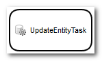
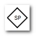
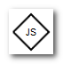

[[preparation]]
== Preparation Section
[[description]]
=== The Overview of WorkFlow
.What is WorkFlow
Workflow refers to a series of business processing procedures. +
For example, "An employee requests a vacation, the supervisor approves it, and the employee takes the vacation after confirming the supervisor's approval." 
Although the flow is simple, it is a workflow.

This flow is shown below.

.WorkFlow in iPLAss
An iPLAss workflow consists of objects called "workflow items" (hereinafter referred to as Items).
Items are classified into five categories: `Activity (Task)` `Event` `Gateway` `Flow` and `Variable`.s
A brief description of each category is provided in the table below.

[cols = "1,3", options = "header"]
|===
|Category|Description
|Activity (Task)|Item category that defines processing (task). This corresponds to the "leave request" and "supervisor approval" parts in the diagram above.
|Event|This is an Item category that defines the trigger and end of processing. This corresponds to the "Complete" part in the diagram above.
|Gateway|Item category that defines flow branches or connections.
|Flow|Item category that defines the processing order. This is the part corresponding to the arrow in the diagram above.
|Variable|This is an Item category that defines variables shared within the flow.
|===

Each category has several types of items. For details on Item, please refer to <<item, description of each item>> below.

[[item]]
=== Explanation for Each Item
[[activity]]
==== Activity(Task)

.CommandTask
A task that can call iPLAss commands.
Use this when you want to perform logical processing in a workflow.

.UserTask
This task assigns tasks to the specified users and distributes the processes based on the responsive result.
By assigning a user who will set approval or denial in the response, the workflow can select and continue on corresponding subsequent process.

.UpdateEntityTask
You can update the target Entity by specifying VariableItem, which will be explained later.

.MailTask
The task which define/specify the MailTemplate so to send mails.

.SubProcess
It is possible to call a predefined Workflow as a SubProcess.
This is not covered in this tutorial.

[[event]]
==== Event

.StartEvent
This event is executed first when the workflow is started.
When this event is started, the workflow status becomes "ACTIVE".
One and only one start event must be defined for each workflow.

.EndEvent
An event to end the workflow.
The workflow status becomes to "COMPLETED" once reaching this event.

.IntermediateEvent
The event to log the workflow history.
This event do nothing in particular, it just log the information and then proceeds to the subsequent flow.

image::images/icon_event-intermediate_en.png[]

.IntermediateTimerEvent
This event has a timer function.
You can specify the execution date and time and the execution delay time of subsequent events.

.TerminateEvent
An event to cancel the workflow.
The difference from EndEvent is the status after completion.
When Termination is executed, the status of the Workflow becomes "CANCELED".

[[gateway]]
==== Gateway

.SplitParallelGateway
Used in branching process.
It will execute all subsequent Flows(All branches).

.SplitExclusiveGateway
Used in branch processing.
Execute one of the subsequent Flow.
This will not covered in this tutorial.

.JoinAsyncGateway
Used in join process.
Subsequent process is performed when one of the preceding process reaches this node.
It is executed each time the previous process arrives.

.JoinSyncGateway
Used in join processing.
Subsequent processing is performed when all of the previous processing is completed.

[[flow]]
==== Flow

.SequenceFlow
It is used to link Activity (Task), Event, and Gateway items.
Processes are executed in the order connected by SequenceFlow.
Depending on the settings of the transition source Item, you can add conditions and branching processes.

[[variable]]
==== Variable

.VariableItem

You can store objects that are referenced in the Workflow.
When starting a workflow from an entity, the registered entity data can be used in the workflow by using variableItems.
Also, this variable must be configured to enable text messages during process execution and to decide whether buttons can be displayed.

[[operation_method]]
=== Method of Operation
Some operations are necessary to create objects for workflow with AdminConsole.

To start with the basic operations, please check the <<../basic/index.adoc#, Tutorial(Basics)>>.

[[create_workflow]]
==== Creating Workflow
Open AdminConsole, and right-click on Workflow like we did for Entity MetaData in previous tutorials, and click "Create Workflow".

Set any name of the MetaData in Name and click the `Save` button.

[[edit_workflow]]
==== Edit WorkFlow
Double-clicking the created MetaData, an empty Workflow setting screen will be displayed.

Click the frame icon in the upper right with red square to toggle the light blue grid line.

Drag items from the left pane of the screen and drop to the center pane to assemble the workflow.
Connect each item placed with SequenceFlow.
SequenceFlow is adsorbed by dragging near the item to be connected.

Click the target item to select it.
The setting properties of the selected item are displayed on the right side of the screen.
Click the "×" icon on the top right to delete the target item.
You can also delete by right-clicking the target item.

Right-clicking SequenceFlow not only allows you to "Delete item", it also has an option of "Change number of points".
With 3Point, SequenceFlow can be folded and bent to fit complicated flows.

[[usertasklist]]
==== Task Overview
A task list overview is provided as a tool to check the status of the workflow being executed and the target data of the workflow.
The task list is used to check the workflow completion and task execution history in both the basic and practical sections.
Follow the steps below to make the task list displayable.

.Enable the Task List Overview
By default, the task list is set to not displayed.
It is necessary to change this setting from TopView setting screen at AdminConsole.

* The settings of TopView +
Data called "DEFAULT" is registered in TopView of AdminConsole in advance.
+

+
The following screen will be displayed when double-clicking the node.
Drag and drop "UserTaskList" in the "Workflow" folder in Items on the right side of the screen to the MainArea.
"UserTaskList" will be added.
+

* Settings of UserTaskList +
The UserTaskList setting dialog is shown below.
This time, we will set UserTaskView.
Open the part settings screen and click "UserTaskView Setting".
+

+

+
By default, all the display items are not checked.
This time we want to see the workflow features such as the workflow history and the assignment status, so please check all of them.
+
Finally, click "OK" and click the `Save` button on the Topview itself to save the settings.

* Check The Display +
The task list is displayed on the top screen.
+

