[[preparation]]
== 準備編
[[description]]
=== ワークフロー概要
.ワークフローとは
ワークフローとは業務上の一連の処理手続きのことを指します。 +
例えば、『社員が休暇を申請し、上司がそれを承認し、社員は上司の承認を確認して休暇を取る』
といった流れも単純ですがワークフローとなります。

この流れを図にすると下記のようになります。

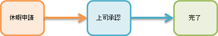

.iPLAssのワークフロー
iPLAssのワークフローは、「ワークフローアイテム（以降、Itemと記載）」というオブジェクトで構成されています。
Itemは、`Activity（Task）` `Event` `Gateway` `Flow` `Variable` という５つのカテゴリに分類されます。
各カテゴリの簡単な説明は下表の通りです。

[cols="1,3",options="header"]
|===
|カテゴリ|説明
|Activity（Task）|処理（タスク）を定義するItemのカテゴリです。 上図の「休暇申請」や「上司承認」の部分にあたります。
|Event|処理のきっかけや終了を定義するItemのカテゴリです。 上図の「完了」の部分にあたります。
|Gateway|フローの分岐、または結合を定義するItemのカテゴリです。
|Flow|処理順序を定義するItemのカテゴリです。上図の矢印にあたる部分です。
|Variable|フロー内で共有する変数を定義するItemのカテゴリです。
|===

各カテゴリには、それぞれ数種類のItemが存在します。Itemの詳細については、後述の<<item,各Itemの説明>>を参照してください。

[[item]]
=== 各Itemの説明
[[activity]]
==== Activity(Task)

.CommandTask
iPLAssのコマンドを呼び出すことができるタスクです。
ワークフロー内でロジカルな処理を行いたい場合に利用します。

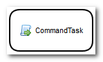

.UserTask
設定したユーザーに対してタスクを割り当て、回答結果で処理を振り分けるタスクです。
ユーザーAを割り当て、結果に承認、差し戻しをセットすることで、本処理に到達した際に、ユーザーAが承認、もしくは差し戻しを実行することで後続処理を進める等の利用が可能です。

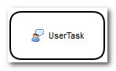

.UpdateEntityTask
後述するVariableItemを指定し、対象Entityの更新を行えます。

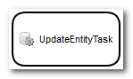

.MailTask
MailTemplateを指定し、メール送信するタスクです。

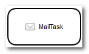

.SubProcess
定義済みのWorkflowをSubProcessとして呼び出すことが可能です。
なお、本チュートリアルでは扱いません。

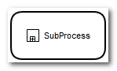

[[event]]
==== Event

.StartEvent
ワークフローが起動した際に一番初めに実行されるイベントです。
このイベントが起動することでワークフローの状態が「ACTIVE」となります。
ワークフローには必ず１つだけ定義する必要があります。

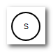

.EndEvent
ワークフローを終了させる為のイベントです。
Workflowの状態（ステータス）は「COMPLETED」になります。

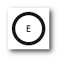

.IntermediateEvent
ワークフロー履歴への出力用イベントです。
特にこのイベントによる処理は実行されず、続けて後続のフローに遷移します。

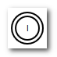

.IntermediateTimerEvent
タイマー機能をもつイベントです。
後続イベントの実行日時や実行遅延時間を指定することができます。

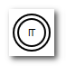

.TerminateEvent
ワークフローをキャンセルさせる為のイベントです。
EndEventとの違いは完了後のステータスとなります。
Terminateが実行されるとWorkflowの状態（ステータス）は「CANCELED」になります。

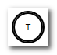

[[gateway]]
==== Gateway

.SplitParallelGateway
分岐処理で利用します。
後続の全てのSequenceFlowを実行します。

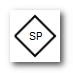

.SplitExclusiveGateway
分岐処理で利用します。
後続のいずれかのSequenceFlowを実行します。
なお、本チュートリアルでは扱いません。

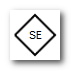

.JoinAsyncGateway
結合処理で利用します。
前段の処理のいずれかが到達した時点で後続処理を実施します。
前段の処理が到達するたびに実行されます。

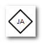

.JoinSyncGateway
結合処理で利用します。
前段の処理がすべて完了した時点で後続処理を実施します。

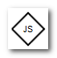

[[flow]]
==== Flow

.SequenceFlow
Activity（Task）、Event、Gatewayの各Itemを結び付ける為に利用します。
SequenceFlowで結んだ順番に処理が実行されます。
遷移元のItemの設定次第で、条件を加え、分岐処理が可能になります。

[[variable]]
==== Variable

.VariableItem

Workflow内で参照するオブジェクトを格納することができます。
Entityからワークフローを起動する場合、この変数を利用することで登録したEntityデータをワークフロー内で利用することができます。
また、Entityからワークフローを起動する際の、プロセス実行中のメッセージや、ボタンの表示可否を有効にする場合、この変数の設定が必須となります。

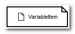

[[operation_method]]
=== 操作方法
AdminConsoleでWorkflowを作成する上で必要な操作となります。
これら操作を踏まえ、基本編をはじめて下さい。 +
また、その他MetaDataの基本操作については<<../basic/index.adoc#,チュートリアル（ベーシック）>>をご確認ください。

[[create_workflow]]
==== Workflowの作成
AdminConsoleを開き、他MetaData同様、Workflowで右クリックし、「Workflowを作成する」をクリックします。

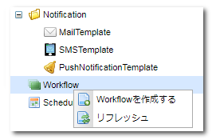

作成するWorkflowの名前をName項目に設定し、 `Save` ボタンをクリックします。

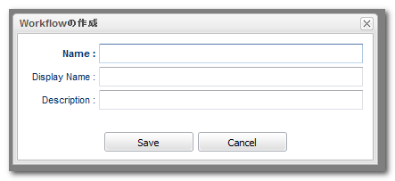

[[edit_workflow]]
==== Workflowの編集
作成したWorkflowをダブルクリックすると空のWorkflow設定画面が表示されます。

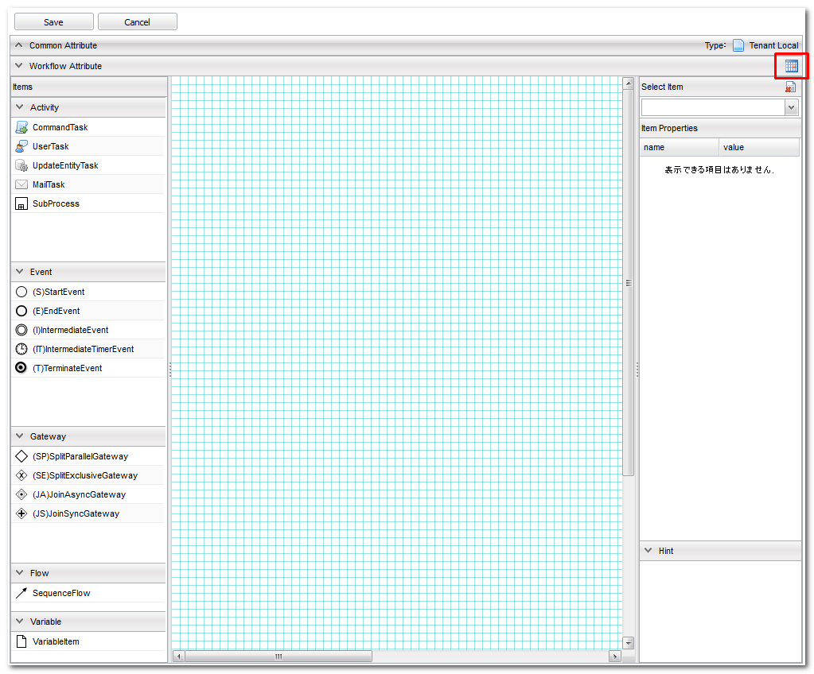

右上の赤枠のアイコンをクリックすると、水色のグリッド線が非表示となります。
もう一度クリックすると再表示されます。

画面左ペインからItemをドラッグ&ドロップしてWorkflowを組み立てていきます。
配置した各ItemをSequenceFlowで接続していきます。
SequenceFlowは接続対象Item付近にドラッグすることで吸着します。

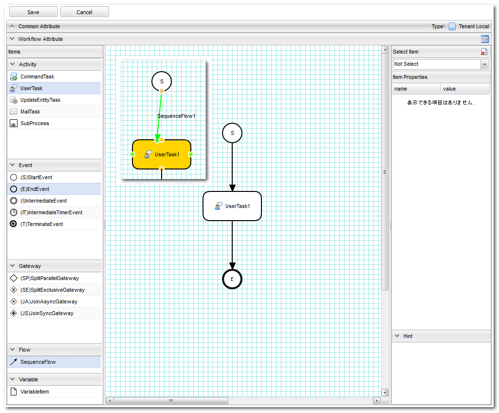

対象Itemをクリックし選択状態にします。
選択したItemの設定項目が画面右側に表示されます。
右上の「×」アイコンをクリックすることで対象Itemの削除が行えます。
対象Itemを右クリックすることでも削除が可能です。

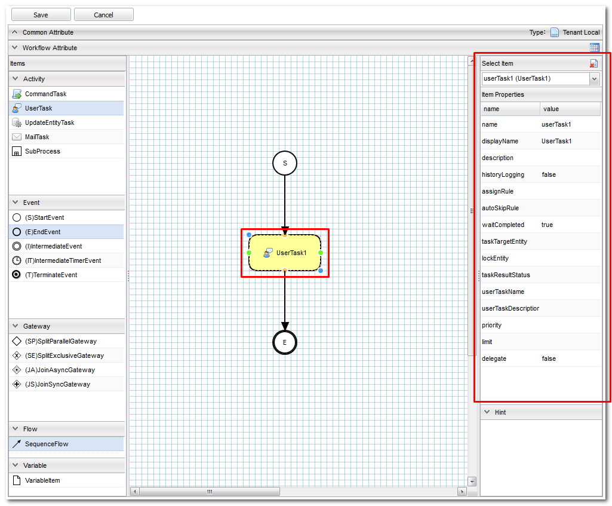

SequenceFlowを右クリックすると「Itemを削除する」以外に「Point数を変更する」が選択可能です。
3Pointにすると、SequenceFlowを折り曲げることが可能です。

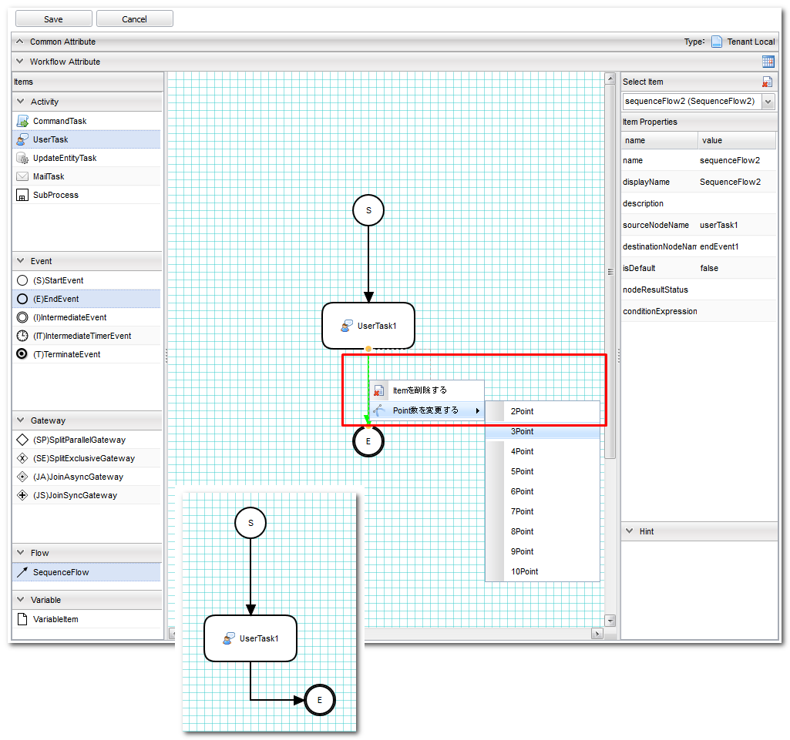

[[usertasklist]]
==== タスク一覧
ユーザーに割り当てられたタスク一覧をGEMのTop画面に表示するためのパーツが用意されています。
基本編、実践編ともに、ワークフロー終了やタスクの実行履歴を確認するにあたり、タスク一覧を利用します。
下記の手順に従い、タスク一覧を表示可能な状態にしておいてください。

.タスク一覧を有効にする
デフォルトではタスク一覧は表示されません。
AdminConsoleのTopView設定を行う必要があります。

* TopViewの設定 +
AdminConsoleのTopViewにはあらかじめ「DEFAULT」というデータが登録されています。
+
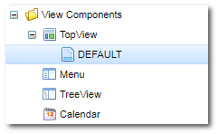
+
ダブルクリックすると下記画面が表示されます。
画面右側のItemsにある「Workflow」フォルダの中の「UserTask List」をMainAreaにドラッグ&ドロップして下さい。
「UserTask List」が追加された状態になります。
+
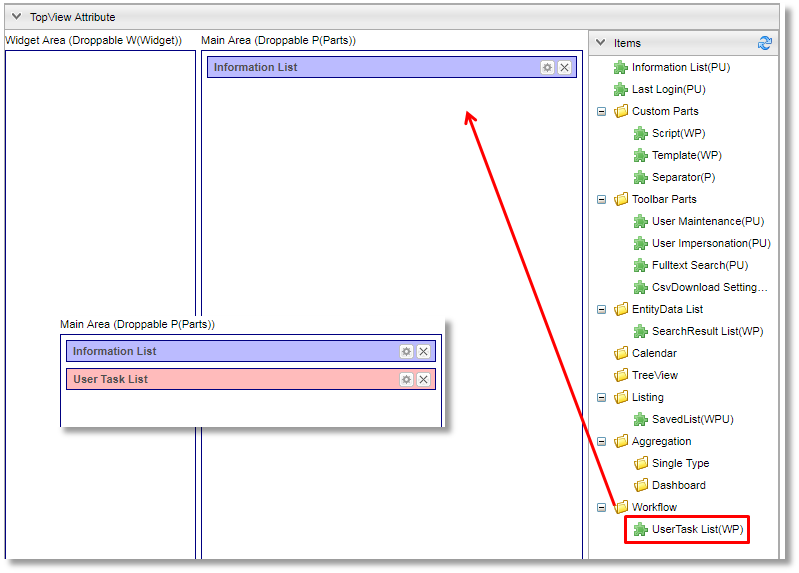

* UserTask Listの設定 +
UserTask Listの設定画面は下図のようになっています。
今回はUserTaskViewの設定をします。
パーツの設定画面を開き、「UserTaskView Setting」をクリックします。
+
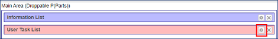
+
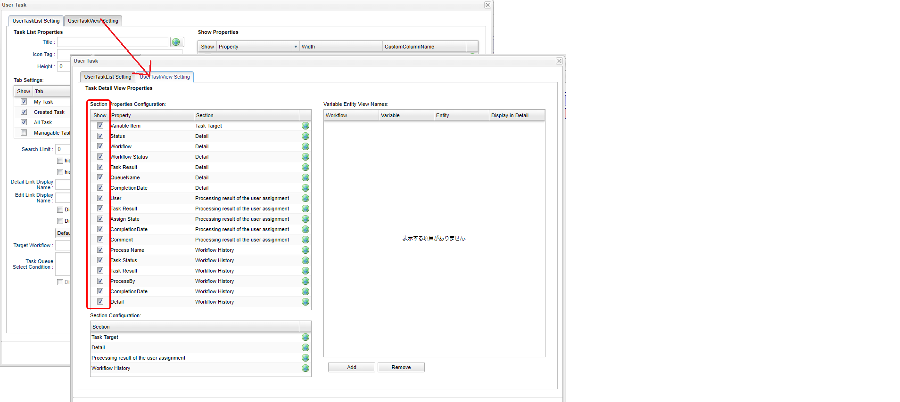
+
デフォルトだと表示項目が全てチェックされていない状態です。
今回はワークフロー履歴や担当割り当て状況等ワークフローの機能を確認したいので、全てチェックをいれてください。
+
最後に「OK」をクリックし、Topview自体の `Save` ボタンをクリックし保存することで設定が完了します。

* 表示確認 +
トップ画面にタスク一覧が表示されます。
+
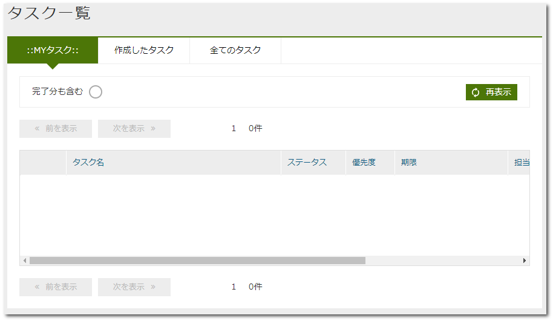
