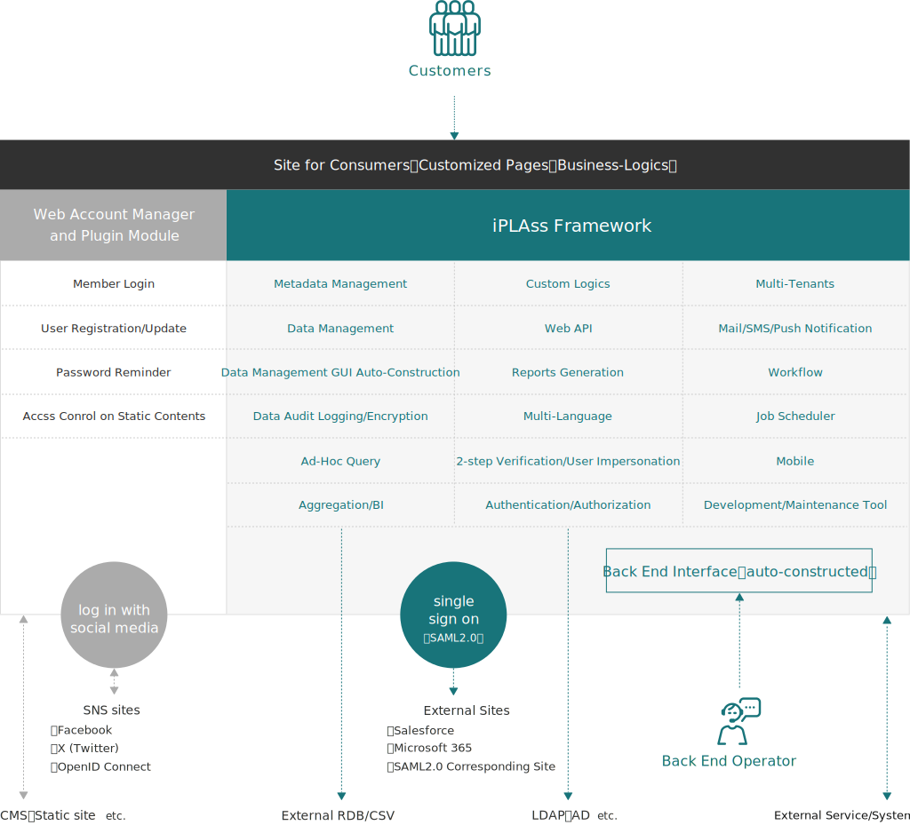

= Overview

== What is iPLAss?

iPLAss is an java-based enterprise class low-code web development platform, which have been focused on boosting the productivity of system development.
The MVC based framework with non-programming development mechanism ensures both Productivity and Customizability

It has the following features

* Just define the data on web browser, the applications are ready to use.
* Upon data definition, CRUD（Create/Read/Update/Delete）functions will be generated automatically.
* Modifying the data definition does not require a restart or interuption on the on going services to reflect the changes.
* Authentication, workflow, data aggregation, the on-demand utility functions for application development are provided
* Java／JavaEE(JakartaEE) technology stacks based environment made it multi-platform integratable
* Java／Groovy, JSP／GroovyTemplate technology suppoted
* Providing MVC framewok supporting the development of custom logics
* Providing a plugin to add membership functionality to existing webpages

== System Architecture
iPLAss can be divided into two parts. The first part is the iPLAss framework which is mainly based on JavaEE and Groovy technology-stacks. The second part is WAM (Web Account Manager) which serve as a HTTP server plugin module.

.iPLAss framework
ARCHITECTURE of iPLAss can be divided into two parts. The first part is the iPLAss framework which mainly based on JavaEE and Groovy technology-stacks. The second part is WAM (Web Account Manager) which serve as a HTTP server plugin module. iPLAss's framework has submodules such as GEM (Generic Entity Manager) and Admin Console. The developer can configure the actions, and customize the logics if needed, so to construct the desired Web applications. +

iPLAss usually store the data in RDB. LOB data (binary data) can also be stored in the file system on the OS or in [.eeonly]#Amazon S3# by configuration.

.WAM plugin module
WAM plugin module will run on HTTP server to hook up the contents (and also the external back end softwares if any) from accesses. As a customer membership management functionality implementation, WAM also help to redirect the unauthenticated user to the login pages, and manage the access authority depending on the roles of the user.

== Features

=== Define and Manage the Data
==== Managing the Metadata
The data that are administrated by iPLAss are named as 'Entity'. Entity is equivalent to the 'Table' of RDB. Each Entity has 'Properties', which are equivalent to the columns of a 'Table' in the concepts of RDB. Applicaion's managers can define and manage data on web browser. Besides defining data, the administrators can also configure on how the data are presented (such as which data should be visible, should it be an input field, pull-down button etc., and whether to show data in orders) to the customer. The modified changes will reflect on webpages immediately after a page refresh. In iPLAss, the objects which serve as the definition of the data and how the data behave in the application, are called as 'Metadata'. There are several more kinds of Metadata other than Entity. They can be managed from the web console.

==== Managing the Data
The user can create, update, delete, and search the defined Entities. In addition, the function of version control, full text search, automatic numbering, recycle bin, LOB data storages are provided. Entity has 'Event Listeners' property as the equivalent of 'trigger' in RDB. By defining event Listeners, the user can accomplish and customize the logics that are not provided by iPLAss.

==== Data Management GUI (Generic Entity Manager)
The control panel to manage data is constructed automatically. By defining the 'Role' from the security mechanisms, the developer can decide in detail about how an entity is presented to different viewers. The entity has several preset views to define how it is presented, such as Searching Overview, Detailed view, Calendar view, Tree View. Developers can create custom logic and functions if the given GUI does not meet specific requirements. In addition, We provide [.eeonly]#material-design based control panel to manage data (Material Design Components, commonly known as MDC)# . MDC is designed to be responsive to the display size.

=== Advanced Data Management
==== [.eeonly]#Data Audit Logging#

It records the history logs of the data operations. It is possible to display the history logs of the entities on the Data Management GUI of the web pages, or on the Web console for administrators.

==== [.eeonly]#Encryption#
The user can choose to encrypt the data when saving the entity data to the database. The encryption can be configured specific to each property. However, if the database provides their own encryption features, it is recommanded to use the entryption function provided by the database in priority. Please consider the iPLAss encryption mechanism as the secondary option in this case, and use it only when there is difficulty to utilize the encryption provied by the database.

=== Logic Customization
==== Embedding the Custom Logics
iPLAss supports the embedment of developer customized logics into the automatically constructed user interfaces. In addition, when building the websites for the consumers, the developer can fully customize the page view/functions with the given MVC based frameworks. In accompany with the frameworks, other mechanics such as the content cache mechanisms and the security coding support for XSS/CSRF solutions are also supported. The code implementation can be done by Java and Groovy. The view logic implementation can be done by JSP and Groovy Template (a JSP-like template languagge based on Groovy). In the case of Groovy/Groovy Template, the changes will instantly reflect on the site without the requirements of compilation or deployments.

==== Web API
RESTful WebAPI that manage the defined entities can be published if needed. In addition, the Web API with implemented custom logics can be published. The security feature such as CSRF Token, OAuth2 scope managements, CORS preflight reqest control, [.eeonly]#OData compliant service endpoint (reference only)# are supplied. Web API is in the form of REST or [.eeonly]#SOAP/WSDL#.

==== Reports Generation
The reports can be generated in form of PDF/Excel. The reports is generated by creating/inputting the templates and then inject the Entities' data into the given templates. JasperReports, Apache POI, JXLS are used as the engine of the report generator.

=== Security
==== Authentication
Built in authentication mechanism（ID/password based, Passkeys, RememberMe based）provided.
In addition, the authentication provider interfaces are provided for additional customized authentication functions.

==== Authorization
Role based Authorization mechanism provided.
The Authorization module can allocate/manage the authority over entity, action, WebApi etc. depending on the roles and groups of the user.

==== OAuth2 / OpenID Connect
OAuth2 Authorization Server/OpenID Connect Provider features are provided. For third party applications (OAuth2 Client/OpenID Connect Relying Party), it is possible to add the access control via custom WebApi（Resource）scopes and OpenID Connect based authentications.

=== Advanced Security
==== [.eeonly]#2-step Verification#
The provided 2-step verification functions include the one-time-code via mail/SMS, and the knowledge based verifications.

==== [.eeonly]#User Impersonation#
The on-behalf-of login access is provided. The administrator or the preset user can log in as specific user(authority-wise) to manipulate the data.

==== [.eeonly]#Single Sign On (SAML2.0)#
SAML2.0's Identity Provider, Service Provider are supplied with our system.
Single sign on and services under to SAML2.0 standards are available.

==== [.eeonly]#User Provisioning (SCIM)#
Provides user and group provisioning functionality based on SCIM (System for Cross-domain Identity Management).
It can act as both an Identity Provider and a Service Provider.

=== Multi-Language
==== Multi-Language
The pages auto-generated via definitions are implemented with multiple languages.
(The supported language includs: Japanese, English, Chinese (Simplified, traditional), Tai languages)
If additonal language is required, it can be added by preparing the language-corresponded resource files.
In addition, the utility function to add descriptions of custom logics in multiple languages is provided.

==== Multi-Language For Entity Data
It is possible to have the Entity Data to support multiple languages.
The Entity with multi-language enabled may display different values depending on the user languages.

=== Notification
==== Template Management
Mail, SMS, Push Notificaton, and Webhook are managed by the corresponding templates.
We povide the function to inject the dynamic parameters when sending the messages.
Parameter injection can be accomplished by the Groovy, and can also be accomplished by complicated hard coding logics.

==== Implementation of the Mail Messages
For the implementation of the mail messages, the port for JavaMail, [.eeonly]#Amazon SES#, [.eeonly]#SendGrid# are provided.

==== SMS Messages Implementation
For the implementation of the SMS message, the port of [.eeonly]#Twilio# is provided.

==== Push Notification Implementation
For the implementation of the push notifications, the support for Firebase Cloud Messaging is provided.

==== Webhook
It is possible to manage the endpoint, the authentication credential, and the payload of the webhook as metadata.

=== Multi-Tenant
==== Multi-Tenant
The mechanism allows the logical division of the data and logics base on tenants so having multiple tenants will not interfere each other even in a single application server/DataBase server.
Additional tenants can be created without interupting the server's availability.

==== Shared Data Amoung Tenants
It is possible to set the data shared accross multiple tenants.
For example, you can set the postal code master table a shared table for all tenant, so they can use the same data set.

=== Data Aggregation
==== [.eeonly]#Ad-Hoc Query#
The user can freely set the searching criteria and searching entries.
For the data output in lists, the user can either save the snapshot of the lists, or the searching criteria. The saved data and the criteria can be reused later.

==== [.eeonly]#Pre-defined Aggregation#
A preset custom search that the user can specify the aggregation methods and searching criteria, and also customize the output in the form of aggregations or graphics.
The application administrator can preset the customized searchs, which then can be distributed to the end-users.
Multiple aggregations/graphs can be ensembled and summarized to the dashboard.

==== [.eeonly]#Simple BI#
Simple BI was designed so that the end-user can input the targeting data and the corresponding searching criteria and then freely accquire the wanted graphics and aggregation results.

=== Workflow
==== [.eeonly]#The Definition and Implementation of the Workflow#
Workflow can be defined uppon entity data. The workflow provides variaty of utilities processes, such as the process to grant approval to specific user, to define mail-messages, to update the entity data, and to create custom logics to Workflow.
In addition, it is available to define the conditional forks, joins, and timer.

=== Job Scheduler
==== [.eeonly]#Job scheduler and Its Usage#
It is used to trigger specifc task in specified times intervals.
The intervals can be configured to many forms such as "cron" type from Linux.
Custom logics and workflow can be executed through job scheduler.

=== Developing/Managing Tools
==== Admin Console
Admin Console is the tools for the developers and administrators.
It provides the functions to accquire data and even the metadata; modifying and moving the data over environments; run the search queries and testing tools; accquiring the server logs and etc.

==== CUI based tools
We provided the CUI tools which help with the usage of iPLAss based systems.
The batch application that help with adding/deleting tenants is also provided.

==== Gradle Plugin
The Gradle Plugin for developers are provided.

==== [.eeonly]#Metrics Collecting#
We provides the feature to collect application metrics and link them to the monitoring system. A module using Micrometer is provided in the standard as an implementation of metric collection and linkage to the monitoring system.

==== [.eeonly]#Data integration using Amazon AppFlow#
Amazon AppFlow to provide data integration functionality between iPLAss and external systems (SaaS and AWS services). +
Provides a custom connector implementation (Zip file that can be deployed to AWS Lambda) as standard to integrate iPLAss into AppFlow as a data flow source or destination.

=== Web Account Manager & plugins
==== [.eeonly]#Member Login#
The login functionality for the consumer sites is provided.
The adminisrator can also enable the RememberMe and 2-step verification systems.

==== [.eeonly]#Login with Social Media#
The feature of login with social media are provided, such as login with Facebook and X (Twitter) accounts.
Depending on the settings, other services corresponding to Facebook, X (Twitter), OpenID Connect can be accomplished.

==== [.eeonly]#User Self-Registration/Update#
The registration page and functions for new customers to sign up are provided.
In addition, the functionalities like mail activation while signing up, and the user profiles update after the sign up are provided.

==== [.eeonly]#Password Reminder#
We provides the tool-pages to reset passwords for the users who forget about their own passwords.

==== [.eeonly]#Static Contents Access Control#
iPLAss provide the feature of access management on static sites, contents (or the dynamic contents output to CMS servers.) When anonymous user trying to access the limited static contents, they are redirected to the iPLAss login pages. In the case of a logged in user, the system will check whether the user possesses the authority.
There is no problem to have iPLAss deployed on a different server/ domain from the contents in need for protections.
The plugin was designed to meet the standards of Apache HTTP Server, IIS, JavaEE Server, Serverless(JavaScript) module (Agent).

== Next Step
If you are just starting to use iPLAss, please refer to<<../gettingstarted/index.adoc#,Starter's Guide>> .
It has the tutorials about installing and configuring the environments and also the sample use case on the basic features.
If you need a detailed content reference, please have a look at<<../developerguide/index.adoc#,Developer Guide>>.
