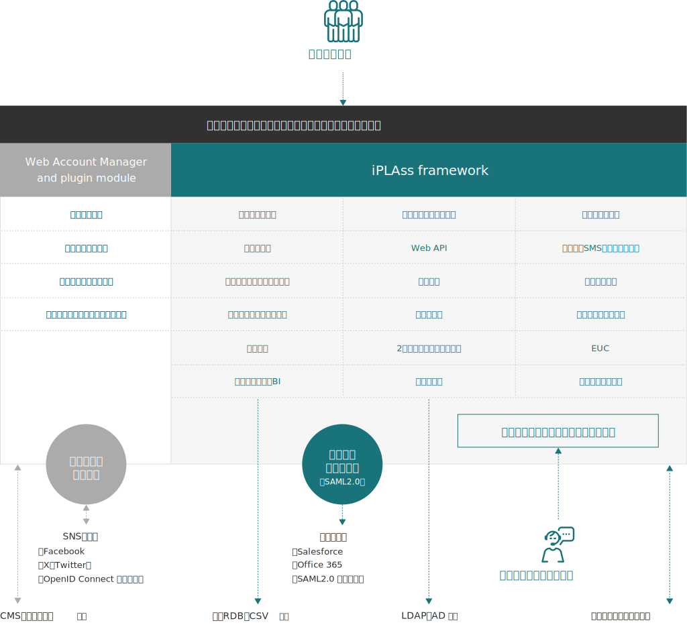

= Overview

== iPLAssとは

iPLAssとは、エンタープライズクラスのシステム開発における生産性向上を主目的とした、javaベースの開発プラットフォームです。
MVCパターンベースの開発フレームワーク上にノンプログラミングでの開発を可能とする機能を提供し、高い生産性とカスタマイズ性を両立させます。

次にあげるような特徴を持ちます。

* Webブラウザ上からデータ定義、設定を行うことでアプリケーションの構築が可能です
* データ定義から、CRUD（登録/参照/更新/削除）機能を自動的に構成します
* 定義の変更はサービスを止めることなく即座に反映可能です
* 認証、ワークフロー、集計など、アプリケーションの開発でよく利用する汎用機能を提供します
* Java／JavaEE(JakartaEE)のテクノロジスタック上で動作し様々な実行環境で動作します
* Java／Groovy、JSP／GroovyTemplateによるコーディングが可能です
* カスタムロジック開発をサポートするMVCパターンのフレームワークを提供します
* 既存のWebサイトを会員サイト化するプラグインを提供します

== システム構成概要
iPLAssは大きくJavaEEおよびGroovyのテクノロジスタック上で操作するiPLAss frameworkと、HTTPサーバ上のプラグインとして動作するWAM（Web Account Manager）プラグインモジュールに分かれます。

image::images/img-iplass-techstack.svg[]

.iPLAss framework
iPLAss framework上ではGEM（Generic Entity Manager）モジュール、Admin Consoleモジュールなどのサブモジュールが動作します。開発者は動作の設定、および必要に応じてカスタムロジックのコーディングを行うことにより、Webアプリケーションを構築することが可能です。 +
iPLAss上で保存されたデータはRDBに格納されます。LOBデータ（バイナリデータ）は、設定により、OS上のファイルシステムや [.eeonly]#Amazon S3# に格納させることも可能です。

.WAM plugin module
WAM（Web Account Manager）プラグインモジュールはHTTPサーバ上で動作し、コンテンツ（もしくはHTTPサーバのバックエンドで動作する外部システム）へのアクセスをフックします。未ログインユーザーのログイン画面へのリダイレクト、権限に応じたアクセス制御などを行います。

== 機能概要

=== データの定義と管理
==== メタデータ管理
iPLAss上で管理するデータは「エンティティ」と呼称します。エンティティはRDB上でのテーブルと同義のものです。エンティティは「プロパティ（属性）」を持ちます。プロパティはRDB上でのカラムと同義のものです。
エンティティの定義は、アプリケーションの管理者がWebブラウザ上から設定することが可能です。
また、定義されたエンティティをどのように画面に表示するか（入力フィールドなのか、プルダウンなのか、項目並び順、表示有無など）も設定可能です。
設定した定義内容は即座にアプリケーションに反映されます。 +
iPLAss上では、これら、アプリケーションで扱うデータや振る舞いを定義する設定情報を「メタデータ」と呼称します。 +
メタデータにはエンティティ定義以外にもいくつかの種類が存在します。
これらメタデータを管理する機能、Webコンソールを提供します。

==== データ管理
定義されたエンティティに対して、登録、更新、削除、検索を行うことが可能です。
また、データのバージョン管理機能、全文検索機能、自動採番機能、ごみ箱機能、LOBデータ保存機能などを提供します。
エンティティ定義にはイベントリスナ（RDB上でのトリガと同義）を設定でき、標準機能で提供されない機能をカスタムロジックにて拡張することが可能です。

==== データ操作画面の自動構成（Generic Entity Manager）
エンティティを操作する画面は定義に従って自動構成されます。
エンティティの見せ方は、セキュリティ機能にて定義される「ロール」毎に細やかな制御が可能です。
エンティティは設定により検索一覧、詳細画面、カレンダービュー、ツリービューなどの形式で表示が可能です。
標準機能で提供されない機能・見せ方をカスタムで作成し、それを個々の画面に組み込むことも可能です。
また、 [.eeonly]#マテリアルデザインに準拠したデータ操作画面（Material Design Components、通称：MDC）# を提供します。MDCはディスプレイサイズに応じたレスポンシブなデザインを特徴としています。

=== 高度なデータ管理
==== [.eeonly]#データ監査ログ#

エンティティの操作履歴を記録します。
記録された操作履歴はエンティティの操作画面上での表示、また管理者用のWebコンソール上からの表示・ダウンロードが可能です。

==== [.eeonly]#暗号化#
エンティティのデータ内容をデータベースに保存する際、暗号化することが可能です。
暗号化対象はプロパティ単位で指定が可能です。
データベースの暗号化オプションを利用可能な場合は、そちらを利用することを推奨しますが、データベースの暗号化オプションの利用が難しい場合の次善のソリューションとして利用可能です。

=== ロジックカスタマイズ
==== カスタムロジックの組込
iPLAssが自動構成する画面上にカスタムロジックを組み込むことが可能です。
また、コンシューマ向けサイトなどを構築する際に、フルカスタマイズした画面・機能を提供するためのMVCパターンベースの開発フレームワークを提供します。
あわせて、XSS/CSRF対策などセキュアコーディングをサポートする機能、コンテンツキャッシュ機能などのユーティリティも提供します。
コードは、JavaもしくはGroovy、Viewロジックに関してはJSPもしくはGroovy Template（Groovyで記述可能なJSPライクなテンプレート言語）で記述可能です。
Groovy/GroovyTemplateでカスタムロジックを作成した場合、それらのアプリケーションへの反映はコンパイル・warデプロイの必要なく即座に実行可能です。

==== Web API
定義したEntityを操作するRESTfulなWeb APIを公開することが可能です。
加えて、カスタムロジックを実装したWeb APIの定義、公開が可能です。
CSRF対策などセキュアコーディングをサポートする機能、CORS preflightリクエスト制御などのユーティリティ、 [.eeonly]#OData準拠のサービスエンドポイント（参照のみ）# も提供します。
Web APIはREST形式もしくは [.eeonly]#SOAP/WSDL# 形式に対応します。

==== 帳票出力
pdf/Excel形式での帳票出力が可能です。
帳票のテンプレートを作成・登録し、エンティティデータを埋め込むことが可能です。
帳票出力エンジンとして、JasperReports、Apache POI、JXLSを利用しています。

=== セキュリティ
==== 認証
ビルトインの認証機能（ID/パスワードによる認証、パスキーによる認証、RememberMe機能など）を提供します。
また、カスタムの認証機能を組み込むための認証プロバイダインタフェースも提供します。

==== 認可
ロールベースの権限制御機能を提供します。
ユーザーの属性やグループなどを条件にロールを定義し、そのロール単位にエンティティ権限、アクション権限、WebApi権限などを割り当て、制御することが可能です。

==== OAuth2 / OpenID Connect
OAuth2 Authorization Server/OpenID Connect Providerの機能を提供します。
サードパーティのアプリケーション（OAuth2 Client/OpenID Connect Relying Party）に対して、
カスタムWebApi（Resource）のscopeによるアクセス制御、OpenID Connectベースの認証情報連携が可能です。

=== 高度なセキュリティ
==== [.eeonly]#2段階認証#
メール・SMSによるワンタイムコード、ナレッジベースなどの方式を選択可能な2段階認証機能を提供します。

==== [.eeonly]#代理ログイン#
管理者や事前に指定したユーザーが特定のユーザー（の権限）に成り代わってログインし操作することを可能にする代理ログイン機能を提供します。

==== [.eeonly]#シングルサインオン（SAML2.0）#
SAML2.0のIdentity Provider、Service Providerの機能を提供します。
SAML2.0準拠のサービスとシングルサインオンが可能です。

==== [.eeonly]#ユーザプロビジョニング（SCIM）#
SCIM（System for Cross-domain Identity Management）ベースのユーザ、グループのプロビジョニング機能を提供します。
Identity ProviderおよびService Providerとしての動作が可能です。

=== 多言語対応
==== 多言語対応
定義から自動生成される画面は標準で日本語、英語、中国語（簡体字、繁体字）、タイ語に対応しています。
対応言語を増やしたい場合は、当該言語用のリソースファイルを準備することにより追加することが可能です。
また、カスタムロジック記述の際、多言語表示をサポートするユーティリティ機能を提供します。

==== エンティティデータの多言語化
エンティティのデータを多言語対応することが可能です。
多言語対応を有効化されたエンティティはユーザーの言語によって異なる値を表示させることが可能です。

=== 通知
==== テンプレート管理
メール、SMS、プッシュ通知、Webhookのためのテンプレート管理、および送信時の動的なパラメータ埋込機能を提供します。
パラメータの埋込にはGroovyにてコーディングが可能で、複雑なロジックによる埋込も可能です。

==== メール送信
メール送信機能の実装としてJavaMail、 [.eeonly]#Amazon SES#、 [.eeonly]#SendGrid# を利用する実装を標準で提供します。

==== SMS送信
SMS送信機能の実装として [.eeonly]#Twilio# を利用する実装を標準で提供します。

==== プッシュ通知
プッシュ通知機能の実装としてFirebase Cloud Messagingを利用する実装を標準で提供します。

==== Webhook
Webhookのエンドポイントや認証情報、送信するHTTPリクエスト内容をメタデータとして管理する機能を提供します。

=== マルチテナント
==== マルチテナント
単一のAPサーバ、DBサーバのスキーマを論理的に分割し複数のテナントのデータ、ロジックを隔離して動作させる機能を提供します。
テナントはシステムを停止することなく追加可能です。

==== テナント共有
複数のテナントから共通に利用可能とするデータ、メタデータを設定することが可能です。
たとえば、郵便番号マスタを、共有データとして設定し、複数のテナントで同一のデータセットを利用することが可能です。

=== データ集計
==== [.eeonly]#汎用検索#
検索条件、検索項目を自由に設定し、検索してリスト化する機能です。
リスト化したデータはその検索条件もしくはスナップショットを保存することが可能です。
保存したリストは後でそのデータ、条件を再利用することが可能です。

==== [.eeonly]#定型集計#
集計方式、検索条件などを指定し、データの集計、グラフ表示を行う機能です。
定型集計では、事前にアプリケーション管理者が定型の集計を定義し、エンドユーザーに公開することが可能です。
複数の集計、グラフをダッシュボードにまとめて表示することが可能です。

==== [.eeonly]#簡易BI#
簡易BIは集計対象のデータ、集計項目、検索条件、表示方法等をエンドユーザーが直接指定し、自由な集計、グラフ作成を行うための機能です。

=== ワークフロー
==== [.eeonly]#ワークフローの定義と実行#
エンティティデータを対象にワークフローを定義することが可能です。
特定ユーザーによる承認、メール通知、エンティティデータのステータス更新、カスタムロジックなどをワークフローに組み込むことが可能です。
また、処理の条件分岐、待ち合わせ、タイマーの定義などが可能です。

=== ジョブスケジューラ
==== [.eeonly]#ジョブスケジュールの定義と実行#
特定の処理を定期的に実行する機能です。
実行間隔はcron形式などいくつかの表現形式でWebブラウザから設定可能です。
起動する処理はカスタムロジック、もしくはワークフローを指定可能です。

=== 開発・運用ツール
==== Admin Console
Admin Consoleは開発者・運用者向けツールです。
Webブラウザ上からデータおよびメタデータを参照する機能、メタデータ・データの環境間の移行ツール、検索クエリ実行・検証ツール、サーバログ取得などの機能を提供します。

==== CUIベースの運用ツール
iPLAssベースのシステムの運用をサポートするCUIツールを提供します。
テナント追加・削除、ハウスキーピング用のバッチなどを提供します。

==== Gradleプラグイン
開発者向けにGradleプラグインを提供します。

==== [.eeonly]#メトリクス収集#
アプリケーションメトリクスを収集し、モニタリングシステムに連携する機能を提供します。メトリクス収集および、モニタリングシステムへの連携の実装として、Micrometerを利用したモジュールを標準で提供します。

==== [.eeonly]#Amazon AppFlowを利用したデータ連携#
Amazon AppFlowを利用したiPLAssと外部システム（SaaSやAWSサービス）とのデータ連携機能を提供します。 +
iPLAssをデータフローの送信元または送信先としてAppFlowに統合するためのカスタムコネクタ実装（AWS Lambdaにデプロイ可能なZipファイル）を標準で提供します。

=== Web Account Managerとプラグイン
==== [.eeonly]#会員ログイン#
コンシューマ向けサイト用のログイン機能、画面を提供します。
設定によりRememberMe機能、2段階認証を有効化することが可能です。

==== [.eeonly]#ソーシャルログイン#
Facebook、X（Twitter）などのアカウントでログインする機能を提供します。
設定によりFacebook、X（Twitter）、OpenIDConnectに対応するその他サービスでログイン可能です。

==== [.eeonly]#セルフ登録・更新#
新規ユーザーがセルフ登録するための機能、画面を提供します。
また、会員登録時のメールアクティベーション、会員登録後のユーザープロファイル情報更新機能、画面を提供します。

==== [.eeonly]#パスワードリマインダ#
パスワードを失念したユーザーが自らのパスワードをリセットするための機能、画面を提供します。

==== [.eeonly]#静的コンテンツへのアクセス制御#
静的サイト、コンテンツ（もしくは動的にコンテンツを出力するCMSサーバなど）へのアクセスをiPLAssで管理する機能を提供します。
閲覧制限されるコンテンツを表示しようとした場合、未ログインユーザーの場合は、iPLAssログイン画面にリダイレクトします。
ログイン済みユーザーの場合は、そのコンテンツを閲覧する権限があるかどうかを確認します。 +
コンテンツが配置されるサーバは、iPLAssが配置されるサーバ・ドメインと異なるものでも構いません。
Apache HTTP Server、IIS、JavaEE Server、Serverless(JavaScript)用のプラグインモジュール（エージェント）を標準で用意しています。

== 次のステップ
iPLAssに初めてふれる場合、<<../gettingstarted/index.adoc#,入門用ドキュメント>> を参照することをお勧めします。
インストーラを用いた簡単な動作環境構築手順、開発環境構築手順、チュートリアルなどが用意されています。 +
機能詳細を確認したい場合は <<../developerguide/index.adoc#,Developer Guide>> を参照してください。
