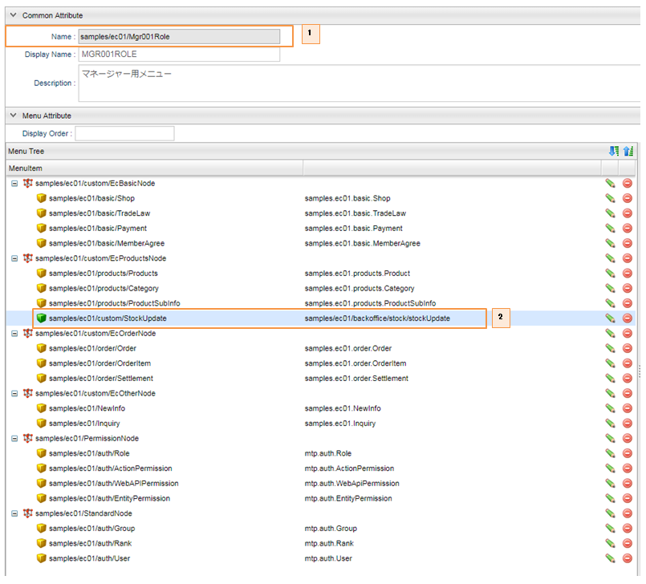

[[AdminConsole_Product_BulkUpdate]]
=== 一括更新画面

==== 設定方法

管理用画面にカスタムの画面を組み込むことが出来ます。 + 
マネージャーまたはオペレーターに属するユーザーが商品の在庫状況を一括更新できる機能を例として説明して行きます。

* Commandの定義
+
在庫一括表示用Commandクラス
+
[cols="1,2"]
|===
h|ファイル名|src/main/java/samples/ec01/command/backoffice/stock/StockBulkViewCommand.java
|===
+
[source,java]
----

@ActionMapping(
		name = "samples/ec01/backoffice/stock/stockUpdate", <1>
		displayName = "在庫一括表示", 
		privileged = false, <2>
		result = @Result(
				type = Type.TEMPLATE, 
				value = "samples/ec01/backoffice/stock/stockUpdate"))
@CommandClass(
		name = "samples/ec01/backoffice/stock/StockBulkViewCommand", 
		displayName = "在庫一括表示コマンド")
public class StockBulkViewCommand implements Command {
----------------------------------------以下略----------------------------------------
----
<1> 在庫一括表示用Action
<2> 特権実行モードをfalseに指定します。
+
在庫一括更新用Commandクラス
+
[cols="1,2"]
|===
h|ファイル名|src/main/java/samples/ec01/command/backoffice/stock/StockBulkUpdateCommand.java
|===
+
[source,Java]
----
@ActionMapping( 
		name = "samples/ec01/backoffice/stock/doStockUpdate",  <1>
		displayName = "在庫一括更新", 
		privileged = false, <2>
		result = @Result(
				type = Type.TEMPLATE, 
				value = "samples/ec01/backoffice/stock/stockUpdate"))
@CommandClass(
		name = "samples/ec01/backoffice/stock/StockBulkUpdateCommand", 
		displayName = "在庫一括更新コマンド")
public class StockBulkUpdateCommand implements Command {

	private final String RESULT_PRODUCT_LIST = "productList";

	@Override
	public String execute(RequestContext request) {
----------------------------------------以下略----------------------------------------
----
<1> 在庫一括更新用Action
<2> 特権実行モードをfalseに指定します。

* Templateの定義
** JSPを利用してテンプレートを作成してます。
+
[cols="1,2"]
|===
h|ファイル名|src/main/webapp/jsp/samples/ec01/backOffice/stock/stockUpdate.jsp
|===

** レイアウトテンプレートを指定します。
+
[cols="1,2"]
|===
h|ファイル名|src/main/resources/samples-ec01-ce-metadata.xml
|===
+
[source,xml]
----
	<!-- Backoffice pages start -->
	<metaDataEntry>
		<metaData xmlns:xsi="http://www.w3.org/2001/XMLSchema-instance"
			xsi:type="metaJspTemplate">
			<name>samples/ec01/backoffice/stock/stockUpdate</name>
			<displayName>在庫一括更新画面</displayName>
			<path>/jsp/samples/ec01/backOffice/stock/stockUpdate.jsp</path>
			<layoutId>/action/gem/layout/defaultLayout</layoutId> <1>
			<contentType>text/html; charset=utf-8</contentType>
		</metaData>
	</metaDataEntry>
	<!-- Backoffice pages end -->
----
<1> 利用するレイアウトテンプレートを管理用画面のものに指定します。

* Topメニュー画面
** 一括更新画面を表示するアクションメニューを新規作成します。
+
image::images/sample-ec_adminconsole-bulkupdate-actionmenu.png[align=left]
. 在庫一括表示用Actionクラスを指定します。

** 作成したアクションメニューをマネージャーとオペレーター用Topメニューに組み込みます。
+

. マネージャーに属するユーザー用Topメニュー画面の定義 + 
. マネージャーに属するユーザー用Topメニュー画面に在庫一括表示用Actionメニューを組み込みます。

==== 画面表示

image::images/sample-ec_adminconsole-bulkupdate-update.png[align=left]

. EC商品管理メニューを開き、在庫一括更新メニューをクリックします。
. 更新したい商品の在庫数を入力して一括更新ボタンをクリックします。
