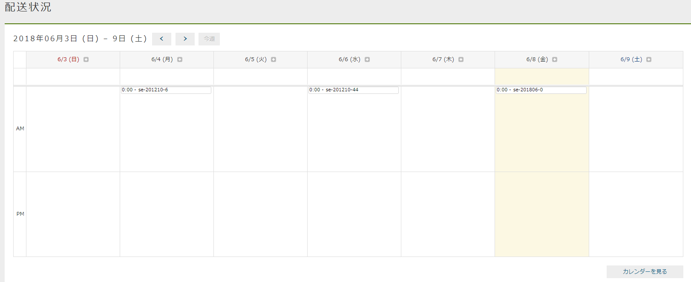

[[AdminConsole_Calendar]]
=== Calendar
サンプルアプリでは、Calendar機能を利用しています。マネージャーまたはオペレーターに属するユーザーは、運営者向け（管理画面）のTop画面に表示されているカレンダーで請求エンティティに登録された納品予定日を確認できます。 +
カレンダーを作成する方法の詳細は、開発者ガイドの<<../../developerguide/genericentitymanager/calendar/index#, Calendar>>の章を参照してください。

