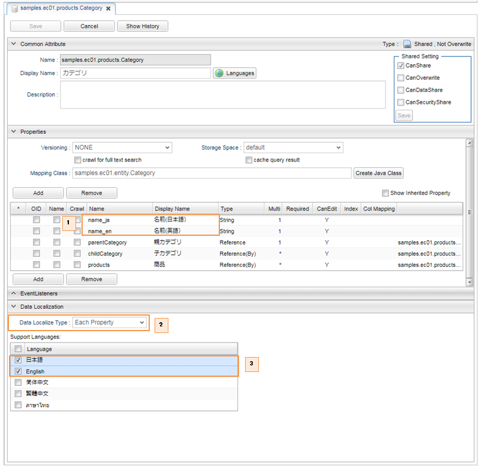
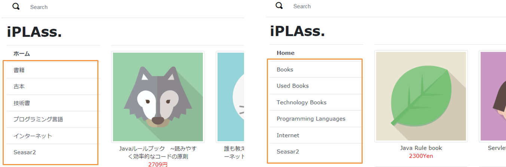
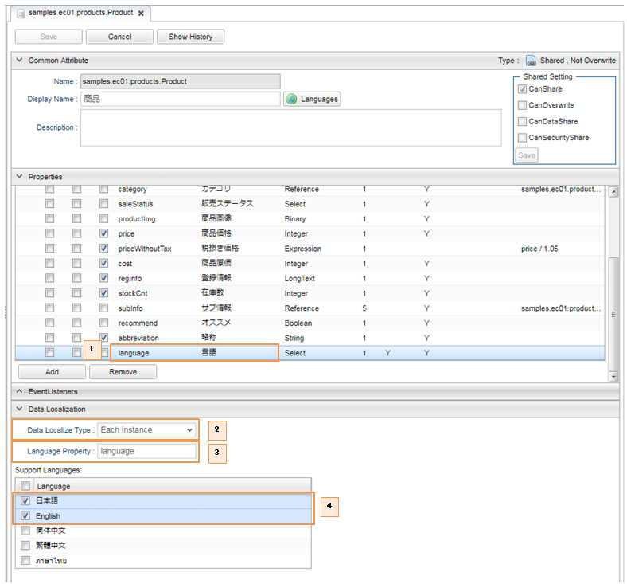
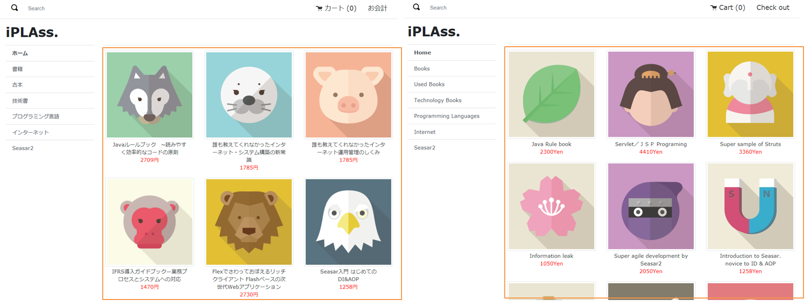

[[AdminConsole_Entity_Mutlilang]]
=== Entity多言語対応
画面に表示するメッセージは多言語対応が可能です。 +
Entity定義において、以下の2つの方法でEntityデータ自体に対する多言語設定ができます。詳しくは、開発者ガイドの<<../../developerguide/i18n/index#data_localize, データの多言語対応>>の章を参照してください。

==== プロパティ単位の多言語化

===== 設定方法

同一のEntity内に多言語用ラベルのプロパティを持つ方法です。 多言語用プロパティの命名ルールは以下の通りです。 +
`{property名}_{言語}`

. 多言語用のプロパティを作成します。
. `Data Localize Type` に `Each Property` を指定します。
. `Support Language` の言語項目にチェックを入れます。

===== 画面表示

Top画面の日本語表示（左）と英語表示（右）

==== レコード単位の多言語化 

===== 設定方法

言語毎にレコードを分ける方法です。 Entity定義に「多言語判別用プロパティ」および「対応言語」を設定することにより、 Entityデータ検索時に自動的に検索条件に `多言語判別用プロパティ = ユーザーの言語` を追加します。主に言語毎に対象とするデータの件数が異なる場合での利用を想定しています。

. 言語判別用プロパティを作成します。 
. `Data Localize Type` に `Each Instance` を指定します。
. `Language` に作成した言語判別用プロパティを指定します。
. `Support Language` の言語項目にチェックを入れます。

===== 画面表示

Top画面の日本語表示（左）と英語表示（右）

言語別に同じ画面で異なるEntityデータを表示することができます。