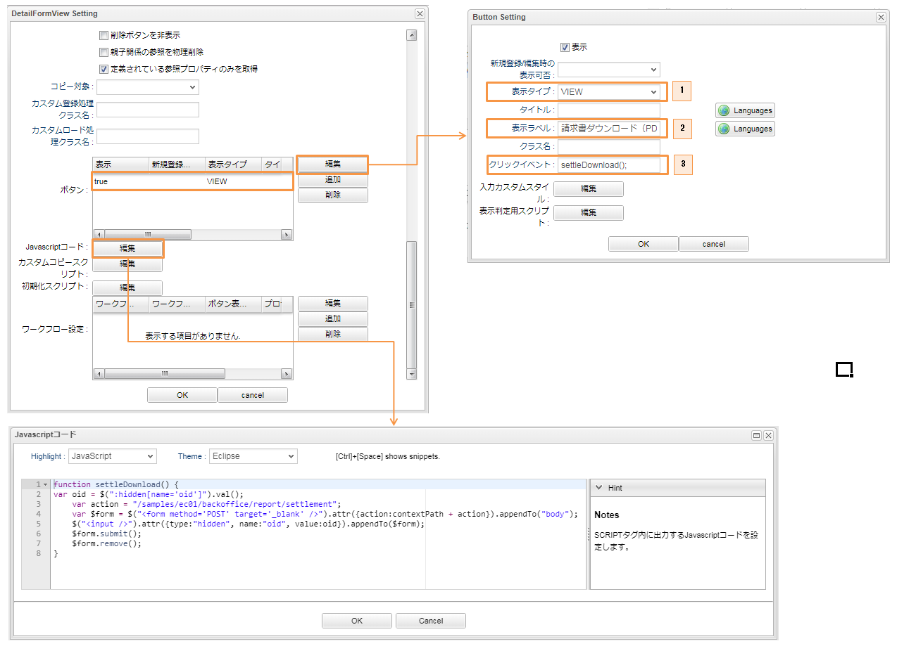

[[AdminConsole_Report]]
=== 帳票出力

このサンプルでは２種類の帳票出力機能（請求書ダウンロード（JasperReports）と注文明細ダウンロード（POI））が利用されています。 +
POIを利用した注文明細帳票(Excel形式)のダウンロード機能の実装はサンプルの実装方法によって異なっている為、詳細は各サンプルの説明を参照してください。 +

*  Java／JSP版 <<../javajsp/index#Java_JSP_ReportOutput, 注文明細ダウンロード>> +
* Groovy／GroovyTemplate版 <<../groovygtmpl/index#Groovy_GTmpl_ReportOutput, 注文明細ダウンロード>> +

==== 請求書ダウンロード(JasperReports)
JasperReportsを用いて、PDF形式の帳票出力を実行することが可能です。 +
以下では、このサンプルで利用されているPDF形式の請求書ダウンロード機能を実装する為に必要な一連の設定について説明します。

.設定方法

* Command
+
帳票出力の前に実行されるCommandクラス（ここではJavaの実装例）
+
[cols="1,2"]
|===
|ファイル名|src/main/java/samples/ec01/command/backoffice/report/SettlementViewCommand.java
|===
+
[source,java]
----
	@Override
	public String execute(RequestContext request) {
		String oid = request.getParam(PARAM_OID);
		// 汎用的な検索
		Query query = Query.newQuery("select oid, order.customer, order.orderItem.product.name,"
				+ " order.orderItem.quantity, order.orderItem.product.price, order.orderItem.price "
				+ " from samples.ec01.order.Settlement where oid = '" + StringUtil.escapeEql(oid) + "'"); <1>
		List<Object[]> result = EntityDaoHelper.search(query);
		// 初期化
		for (int cnt = 0; cnt < MAX_CNT; cnt++) {
			request.setAttribute(RESULT_PRODUCT + cnt, "");
			request.setAttribute(RESULT_QUANTITY + cnt, 0L);
			request.setAttribute(RESULT_ITEM_PRICE + cnt, 0L);
			request.setAttribute(RESULT_PRICE + cnt, 0L);
		}
		int cnt = 0;
		Long totalPrice = 0L;
		for (Object[] obj : result) {
			String customer = (String) obj[1];
			String product = (String) obj[2];
			Long quantity = (Long) obj[3];
			Long itemPrice = (Long) obj[4];
			Long price = (Long) obj[5];

			request.setAttribute(RESULT_CUSTOMER, customer); <2>
			request.setAttribute(RESULT_PRODUCT + cnt, product); <2>
			request.setAttribute(RESULT_QUANTITY + cnt, quantity); <2>
			request.setAttribute(RESULT_ITEM_PRICE + cnt, itemPrice); <2>
			request.setAttribute(RESULT_PRICE + cnt, price); <2>
			totalPrice = totalPrice + price;
			cnt++;
		}
		request.setAttribute(RESULT_TOTAL_PRICE, totalPrice); <2>

		return Constants.CMD_EXEC_SUCCESS;
	}
----
<1> データ検索処理を実行します。
<2> RequestContextに検索データをセットします。

* Template
+
帳票出力テンプレート定義を設定します。
+
※ 帳票テンプレート定義に関する各設定項目の詳細は、開発者ガイド<<../../developerguide/report/index#, 帳票出力（Jasper/JXLS/POI）>>の章を参照してください。
+

+
. 呼び出される請求書の帳票テンプレート定義
. jrxml（JasperでテンプレートとなるXMLファイル）テンプレートファイルを指定します。
. 事前のCommandクラスで検索データを格納したRequestContextのAttribute名を指定します。
. 言語別に帳票出力テンプレート定義を設定することが可能です。

+
* Action
+

+
. 帳票出力の前に実行するCommandクラス。
. 帳票テンプレート定義。

* EntityViewの詳細画面のカスタマイズ
+
請求エンティティを右クリックし、「Detail_Layoutを開く」ボタンをクリックします。 +
編集ボタンをクリックします。
+

+

. エンティティの詳細画面にカスタムのボタンを表示します。
. カスタムボタンのラベルを設定します。
. クリックイベント関数を設定します。

===== 画面表示

請求書ダウンロード機能の画面表示 +
管理用画面で請求検索一覧画面を開き、詳細リンクをクリックします。

「請求書ダウンロード」ボタンをクリックします。

ダウンロードしたPDF帳票の中身を確認します。 +
このサンプルでは、英語用の帳票テンプレートも別途用意しています。

