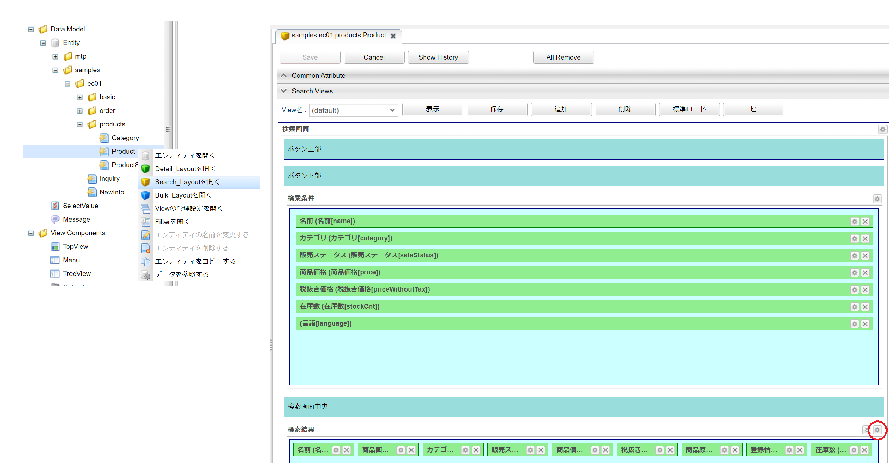
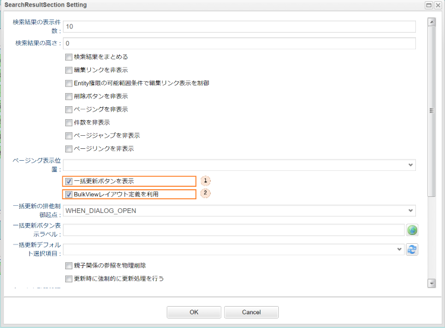
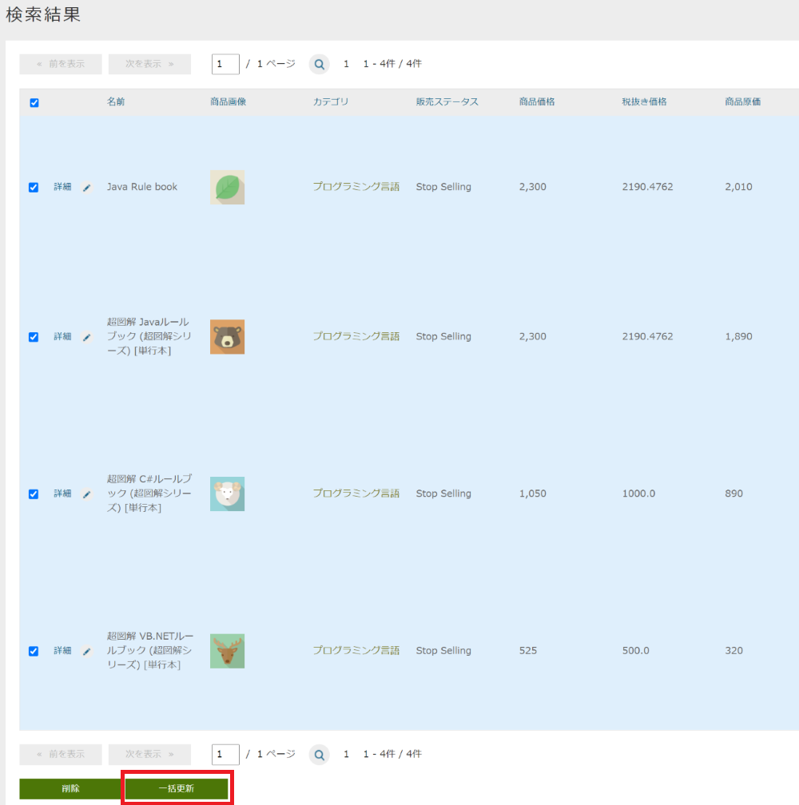
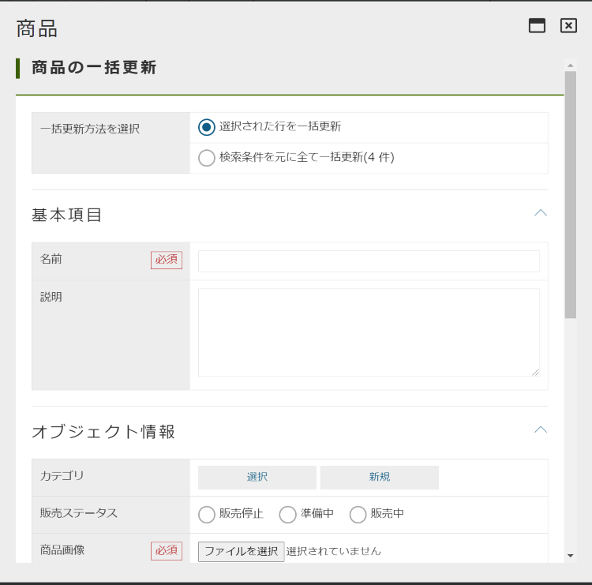

[[AdminConsole_Product_SearchView_BulkUpdate]]
=== 検索結果の一括更新機能

==== 設定方法

EntityViewの「Search_Layout」からEntityの検索画面をカスタマイズすることが可能です。 +
サンプルアプリでは、マネージャーまたはオペレーターに属するユーザーが、商品の検索結果の一覧から指定したレコードを一括更新できる機能をデフォルトで有効化しています。 +
この機能の詳細については、開発者ドキュメントの<<../../developerguide/genericentitymanager/entityview/index#bulkview,2.3. 一括更新画面>>を参照してください。

* EntityViewの検索画面の設定
** 商品エンティティの「Search_Layout」をカスタマイズし、検索画面の一括更新機能を有効化します。
+

. 「一括更新ボタンを表示」にチェックを入れます。

. サンプルアプリでは、「BulkViewレイアウト定義を利用」にチェックを入れています。 
+
この設定により、「Bulk_Layout」を利用して一括更新画面を生成し、複数項目を一括更新することが可能です。

==== 画面表示
商品の検索結果画面の下部に「一括更新」ボタンが追加されています。

検索結果のレコードを選択して、「一括更新」ボタンを押下すると、下図のように「Bulk_Layout」を利用した一括更新画面が表示されます（サンプルでは、デフォルトの「Bulk_Layout」を利用）。 +
任意の項目を入力し、一括更新画面下部の「一括更新」ボタンを押下することで、指定したレコードの任意の項目を一括で更新することが可能です。

