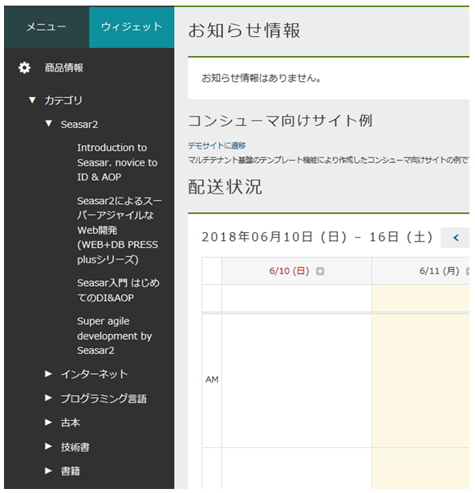

[[AdminConsole_TreeView]]
=== TreeView
サンプルアプリでは、TreeView機能を利用しています。マネージャーまたはオペレーターに属するユーザーは、運営者向け管理画面のメニューのウィジェットエリアでツリー表示された商品情報を確認できます。 +
TreeViewを作成する方法の詳細は、開発者ガイドの<<../../developerguide/genericentitymanager/treeview/index#, TreeView>>の章を参照してください。

