[[Application_Businessflow]]
== サンプルアプリの業務フロー

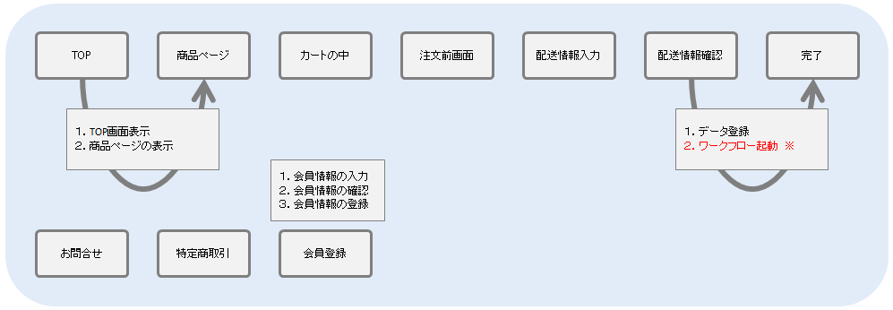

[red]*※ ワークフロー起動はEnterprise Editionの機能です。*

=== 一般消費者向け（ECサイト）画面

==== 商品の購入

ECサイトの画面で商品を購入することができます。

* 購入したい商品の詳細画面を開きます。「カートに入れる」ボタンをクリックすると、カートに商品が追加されます。
+
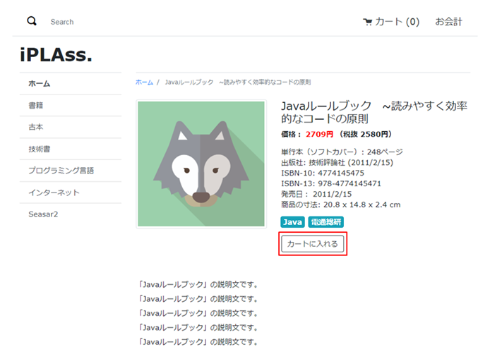

* 商品詳細画面の右上でカートに入れた商品の数量を確認できます。 +
「カートの中を見る」ボタンをクリックすると、カートの詳細画面に遷移します。
+
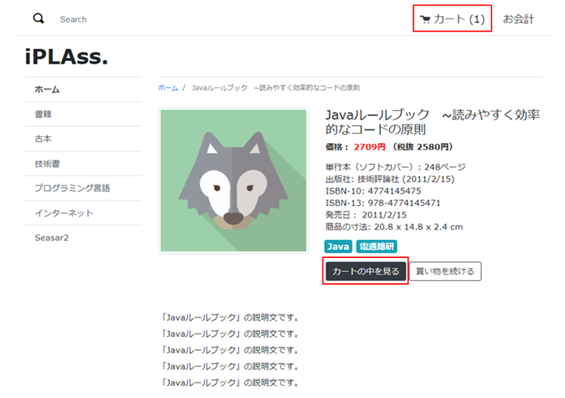

* カートの詳細画面では、カートに入れた商品を削除したり、商品の購入数量を更新したりすることができます。 +
商品数量を変更し、「リフレッシュ」アイコンをクリックすることで商品の合計金額を更新できます。 +
「お会計」ボタンをクリックすると、ログイン画面に遷移します。
+
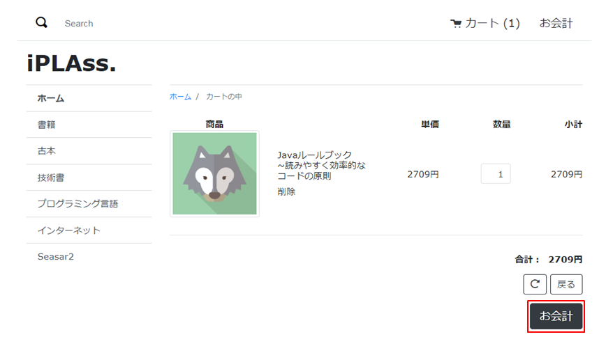

* ログイン画面では、会員アカウントでログインするか、または、会員登録せずに購入手続きへ進むかを選択できます。 +
会員アカウントでログインした場合、次の配送先情報入力画面で登録済みの情報が自動で入力された状態になっています。
+
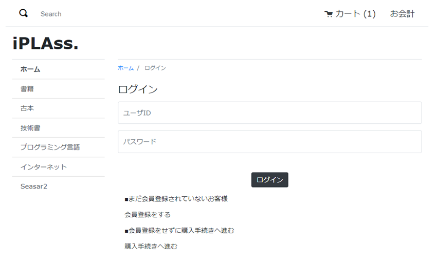

* 配送先情報を入力し、「上記の届き先に送る」ボタンをクリックします。 +
配送先情報入力画面には、<<./javajsp/index#Java_JSP_BeanValidation, Bean Validation>>機能が組み込まれており、入力値に対するバリデーションが行われます。
+
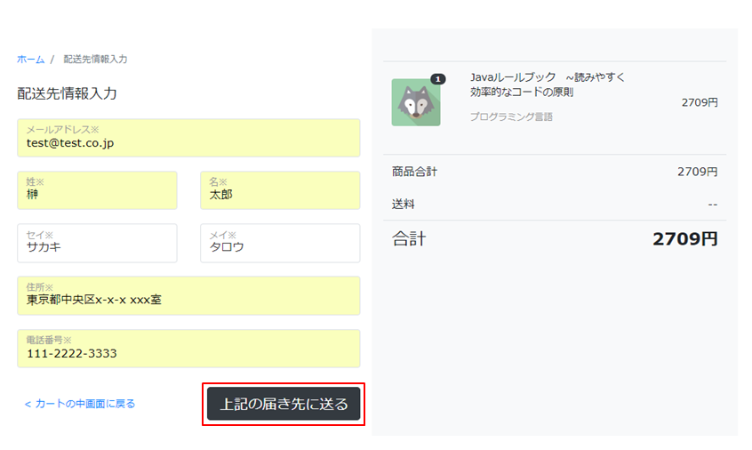

* 前画面で入力した配送先情報を確認できます。 +
「編集」ボタン、または、「配送先入力画面に戻る」ボタンをクリックすると、配送先情報を編集することができます。 +
「注文する」ボタンをクリックすると、注文処理が実行されます。
+
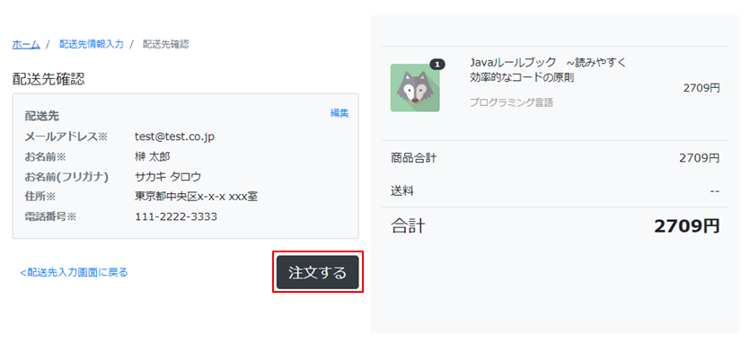

* 注文処理が正常に完了した場合、注文完了画面に遷移します。 +
新規注文が登録された場合、<<./eepackage/index#EEPackage_Order_Processing_Workflow, 注文処理ワークフロー>>が自動で起動します。 運営者は、管理画面でワークフローで振り当てられたタスクに対する操作が行えます。 +
「ホーム画面に戻る」ボタンをクリックすると、ECサイトのTop画面に遷移します。
+
[red]*※ ワークフロー起動はEnterprise Editionの機能です。*
+
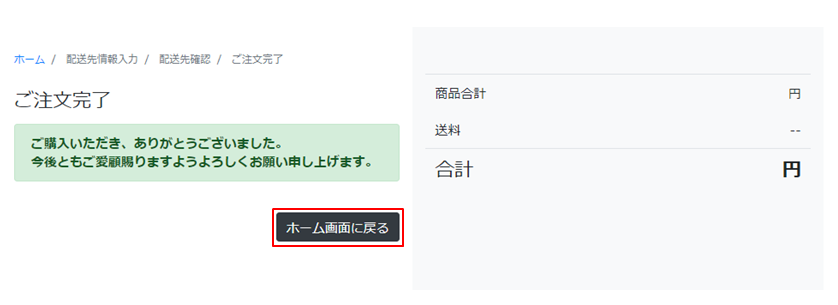

==== お問い合わせの登録

* 一般消費者向け（ECサイト）画面の下で「お問い合わせ」リンクをクリックすると、お問い合わせ登録画面に遷移することができます。
+
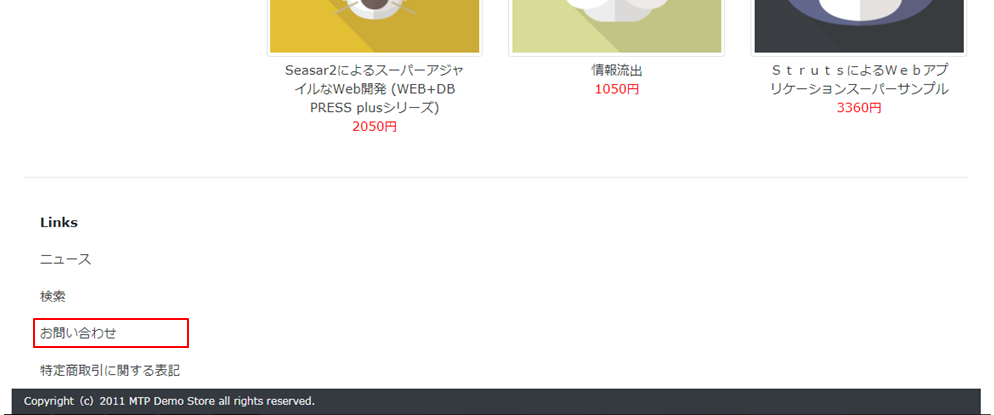

* お問い合わせ内容を入力し、｢上記の内容でお問い合わせをする｣ボタンをクリックすると、お問い合わせの登録処理が実行されます。 +
お問い合わせ登録画面には、<<./javajsp/index#Java_JSP_BeanValidation, Bean Validation>>機能が組み込まれており、入力値に対するバリデーションが行われます。
+
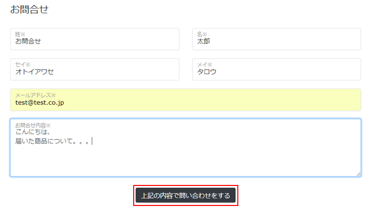

* お問い合わせ登録処理が正常に完了した場合、お問い合わせ登録完了画面に遷移します。 +
新規お問い合わせ情報が登録された場合、<<./eepackage/index#EEPackage_Inquriy_Processing_Workflow, お問い合わせ処理ワークフロー>>が自動で起動します。運営者は、管理画面でワークフローで振り当てられたタスクに対する操作が行えます。 +
「ホームに戻る」ボタンをクリックすると、ECサイトのTop画面に遷移します。
+
[red]*※ ワークフロー起動はEnterprise Editionの機能です。*
+
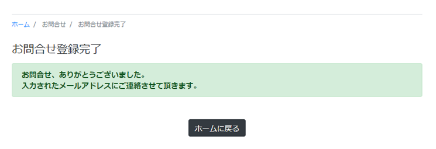

==== 会員登録

* 一般消費者向け（ECサイト）画面の右上で「お会計」ボタンをクリックすると、ログイン画面に遷移します。
+
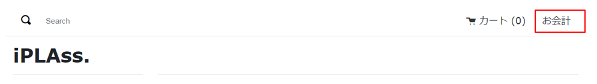

* ログイン画面で「会員登録をする」ボタンをクリックします。
+
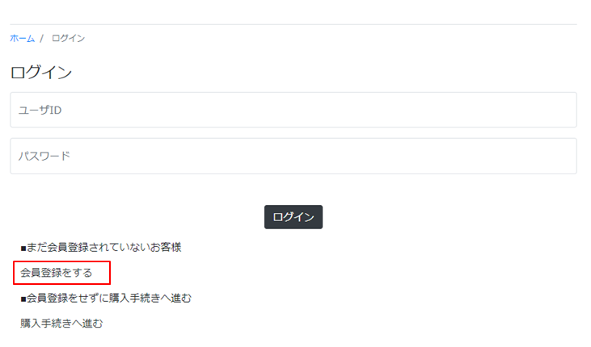

* 会員情報入力画面で会員情報を入力し、「会員規約に同意して登録」ボタンをクリックすると、会員情報確認画面に遷移します。 +
会員情報入力画面には、<<./javajsp/index#Java_JSP_BeanValidation, Bean Validation>>機能が組み込まれており、入力値に対するバリデーションが行われます。
+
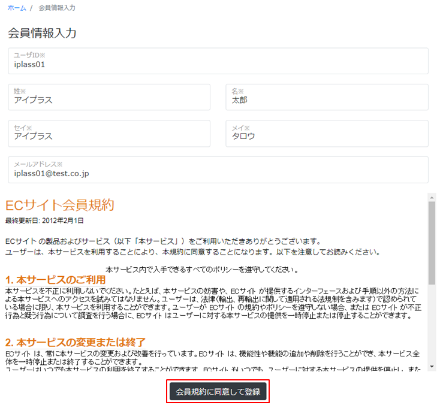

* 前画面で入力した会員情報を確認できます。 +
「登録」ボタンをクリックすると、会員情報の登録処理が実行されます。
+
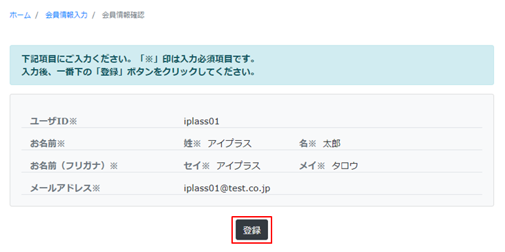

* 会員情報の登録処理が正常に完了した場合、会員登録完了画面に遷移します。 +
※ ECサイトの画面で登録した会員は、デフォルトで `Worker（利用ユーザー）` に属するユーザーとして登録されます。 +
※ ローカルの開発環境で送信されたメールの中身を確認したい場合、<<index#GlobalSettings_About_User,ユーザーについて>>を参照してください。
+
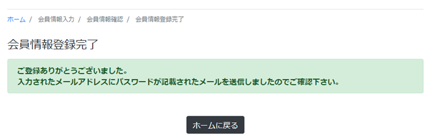

==== 商品検索

商品のキーワード検索ができます。 +
※ デフォルトの設定では商品検索に必要な全文検索機能が有効化されていません。全文検索機能を有効化するためには、<<./index#GlobalSettings_FullTextSearch_Settings, 全文検索について>>を参照してください。

* 一般消費者向け（ECサイト）画面の下で「検索」リンクをクリックすると、商品検索画面に遷移することができます。
+
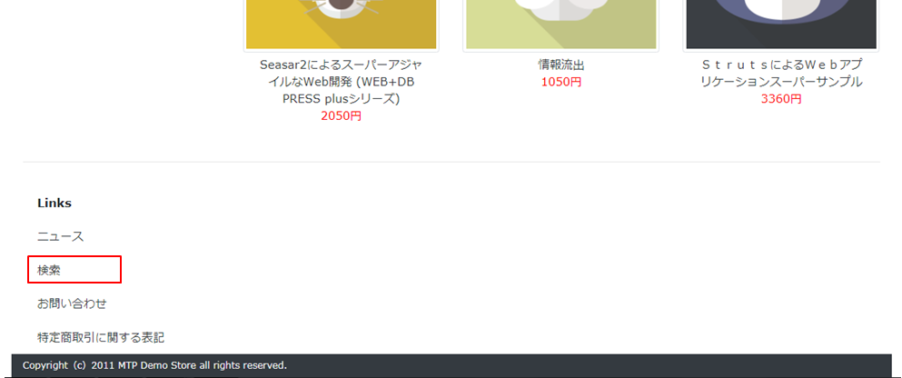

* キーワードを入力し、「検索」ボタンをクリックすると、キーワードにマッチした検索結果の一覧が表示されます。
+

* 検索結果一覧
+
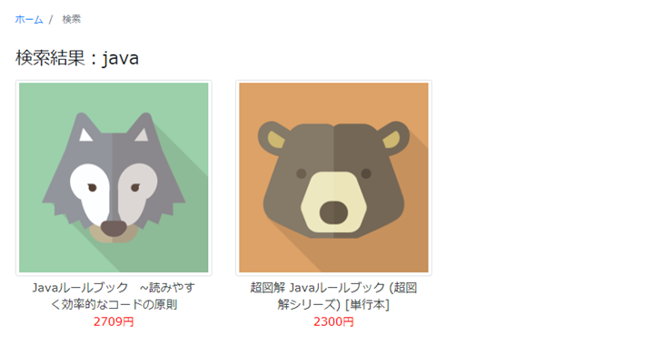

=== 運営者向け（管理）画面

運営者向けの管理画面は以下のiPLAss標準機能を利用して作られています。

* エンティティの汎用データ操作画面

* 管理画面へのカスタムテンプレートの組み込み +
Admin Consoleの共通設定の<<./adminconsole/index#AdminConsole_Product_BulkUpdate, 一括更新画面>>の章を参照してください。

* Calendar機能 +
Admin Consoleの共通設定の<<./adminconsole/index#AdminConsole_Calendar, Calender>>の章を参照してください。

* TreeView機能 +
Admin Consoleの共通設定の<<./adminconsole/index#AdminConsole_TreeView, TreeView>>の章を参照してください。

* [.eeonly]#EntityListing機能#
* [.eeonly]#Aggregation機能#
* [.eeonly]#Dashboard機能#
* [.eeonly]#Workflow機能#
+
Enterprise Edition機能の追加パッケージの<<./eepackage/index#EEPackage_Workflow, Workflow>>の章を参照してください。

* [.eeonly]#SavedList機能#

Admin Consoleで作成されたカスタムの機能を各ロールのメニューに組み込む形になっています。 +
マネージャー用メニューを例として説明します。

==== マネージャー用メニュー
===== EC基本情報管理

* ショップ情報管理
* 特定商取引法
* 支払方法設定
* 会員規約

===== EC商品管理

* 商品 +
商品画面のカスタマイズ（検索結果の一括更新機能の有効化） +
Admin Consoleの共通設定の<<./adminconsole/index#AdminConsole_Product_SearchView_BulkUpdate, 検索結果の一括更新機能>>の章を参照してください。
* カテゴリ
* 商品サブ情報
* 在庫一括更新 +
Admin Consoleの共通設定の<<./adminconsole/index#AdminConsole_Product_BulkUpdate, 一括更新画面>>の章を参照してください。

===== 注文管理
* 注文
* 注文明細
* [.eeonly]#注文明細カスタム検索# 
+
Enterprise Edition機能の追加パッケージの<<./eepackage/index#EEPackage_EntityListing, EntityListing>>の章を参照してください。
* 請求
* [.eeonly]#売上集計# 
+
Enterprise Edition機能の追加パッケージの<<./eepackage/index#EEPackage_Dashboard, DashBoard>>の章を参照しください。

===== お問合せ管理
* 新着情報
* お問い合わせ
* [.eeonly]#お問い合わせ状況#
+
Enterprise Edition機能の追加パッケージの<<./eepackage/index#EEPackage_CrossTab, クロス集計>>の章を参照してください。

===== 権限情報管理
* ロール
* Action権限
* WebApi権限
* Entity権限
* [.eeonly]#Workflow権限#
* [.eeonly]#Cube権限#

===== 基本情報管理
* グループ権限
+
<<./index#GlobalSettings_About_User, ユーザーについて>>を参照してください。
* ランク権限
* ユーザー情報

===== [.eeonly]#保存リスト#
Enterprise Edition機能の追加パッケージの<<./eepackage/index#EEPackage_SavedList, 保存リスト>>を参照してください。