[[EEPackage_Aggregation]]
== [.eeonly]#Aggregation#
Enterprise Editionの集計機能です。 +
サンプルアプリでは、 `Simple` 、 `Crosstab` 、`Cube` の3つの集計タイプを利用しています。管理画面で集計グラフを表示します。 +
Aggregationの作成方法と各設定項目の詳細については、開発者ガイドの<<../../developerguide/simplebi/index#aggregation_management, 集計の管理>>の章を参照してください。

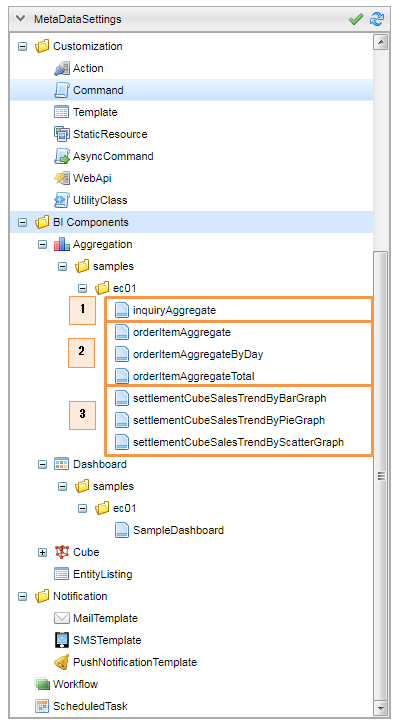

. CrossTab集計タイプ
. Simple集計タイプ
. Cube集計タイプ

[[EEPackage_CrossTab]]
=== [.eeonly]#クロス集計#
定型集計、Entityのデータをクロス集計、表示します。

==== Admin Consoleでの設定

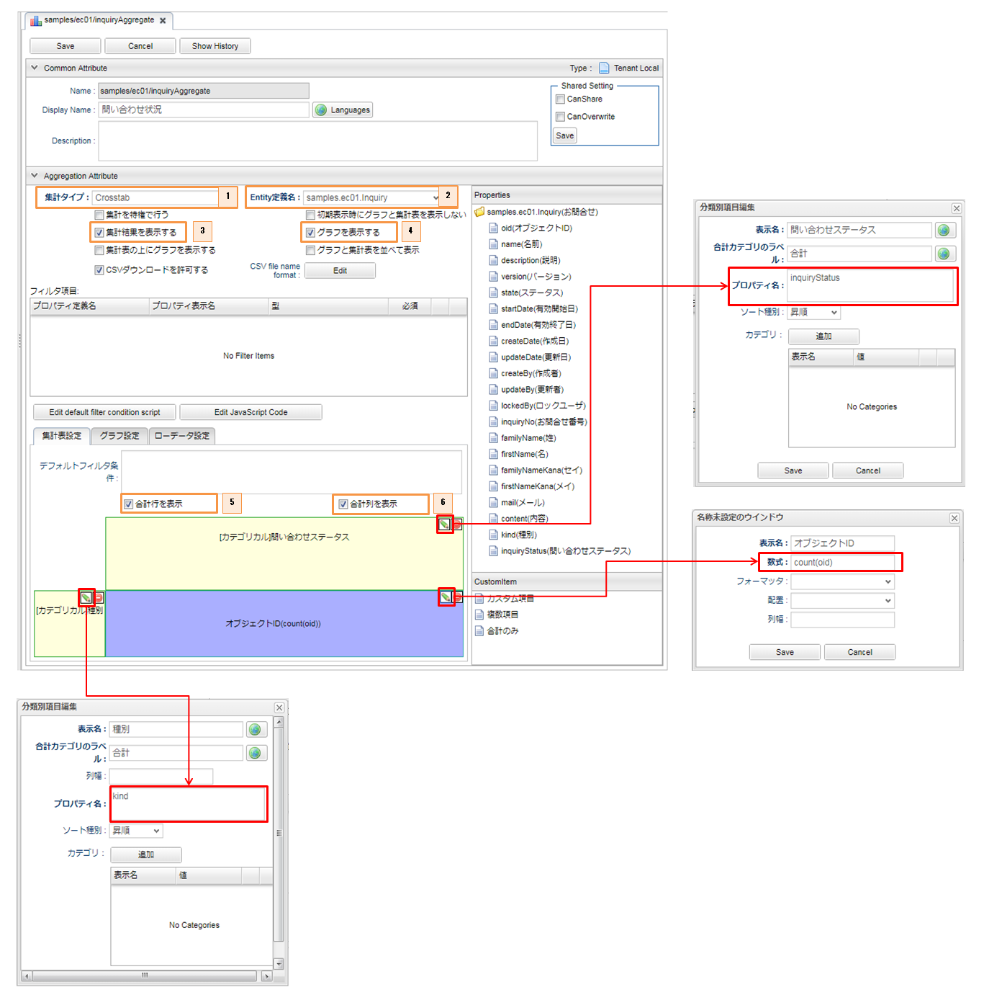

. 集計タイプに `Crosstab` を選択します。
. 集計対象となるエンティティに `お問合せエンティティ` を選択します。
. 集計結果の表を表示します。
. 集計結果のグラフを表示します。
. 集計表に各列の合計値を表示します。
. 集計表に各行の合計値を表示します。

※ 各設定項目の説明は、開発者ガイドの<<../../developerguide/simplebi/index#_クロス集計,クロス集計>>を確認してください。

.メニューへの登録

オペレーター用メニュー、またはマネージャー用メニューを開きます。

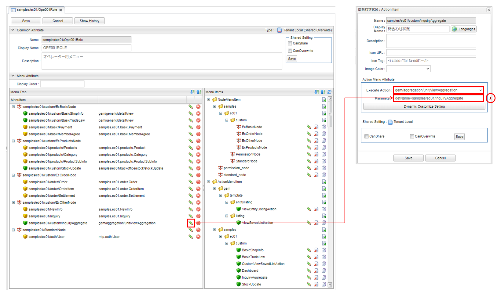

. アクションパラメーターに `defName=samples/ec01/inquiryAggregate` を設定します。

※ 作成されたAggregationをメニューに登録する方法については、開発者ガイドの<<../../developerguide/simplebi/index#viewaggregation, 表示方法>>の章を確認してください。

==== 画面表示

マネージャーまたはオペレーターに属するユーザーで「ECその他」メニューを開き、「問合わせ状況」アイテムをクリックします。

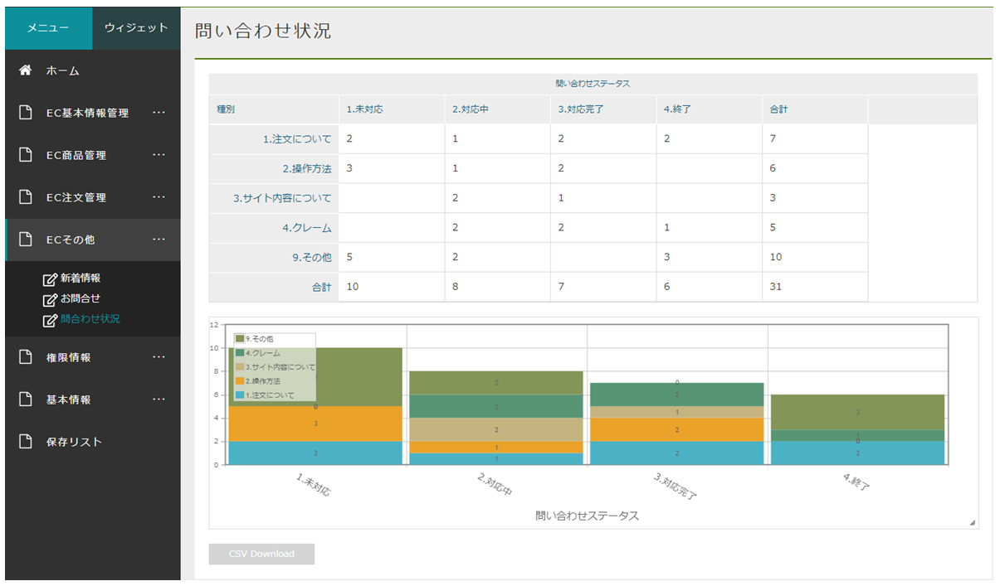

=== [.eeonly]#単純集計#
定型集計、Entityのデータを集計、一覧表示します。 + 
商品別売上集計（直近1カ月）の単純集計を例として説明していきます。

==== Admin Consoleでの設定

* 集計表設定
+
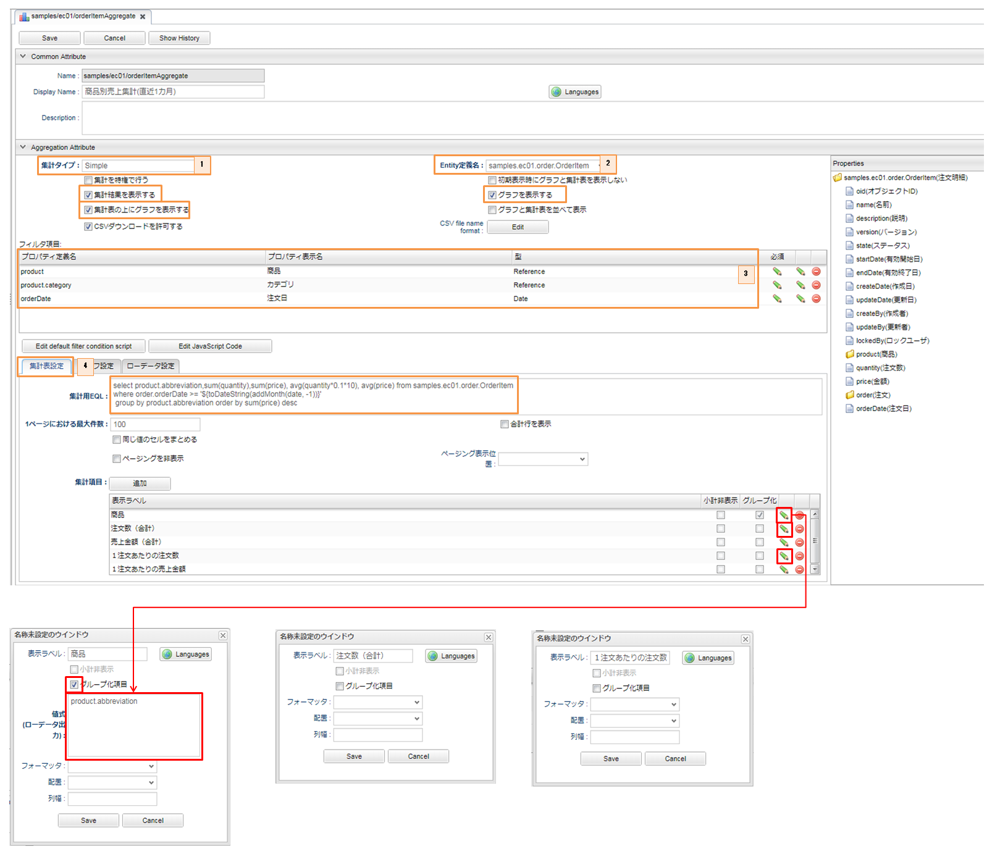

. 集計タイプに `Simple` を選択します。
. 対象となるエンティティに `注文明細エンティティ` を選択します。
. フィルター項目を指定します。
. 集計表設定で、集計用EQL文を指定します。

※ 各設定項目の詳細については、開発者ガイドの<<../../developerguide/aggregation/index#aggregation_simple_setting, 単純集計>>の章を確認してください。

* グラフ設定
+
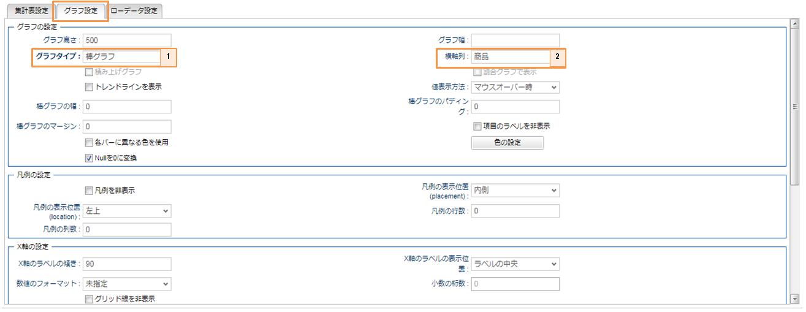
+
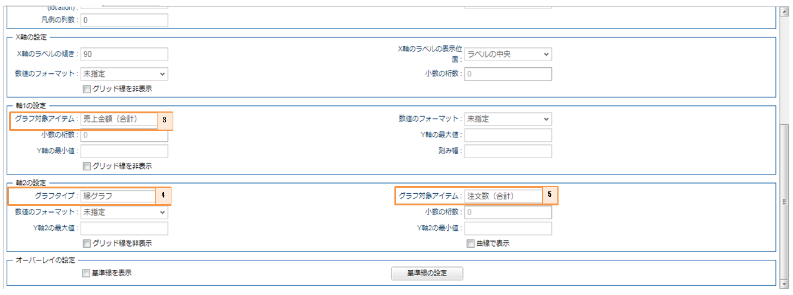

. グラフタイプに `棒グラフ` を選択します。
. 横軸列に `商品` を選択します。
. 軸１のグラフ対象アイテムに `売上金額（合計）` を選択します。
. 軸２のグラフタイプに `線グラフ` を選択します。
. 軸２のグラフ対象アイテムに `注文数（合計）` を選択します。

==== 画面表示

マネージャーに属するユーザーは、管理画面で集計情報を確認することができます。 +
｢集計画面を表示する｣ボタンをクリックすると、集計結果の表とフィルター条件が表示されます。

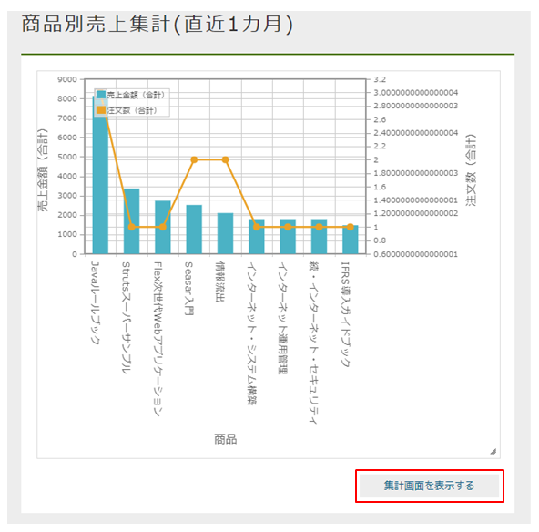

=== [.eeonly]#キューブ集計#
※ キューブ集計を利用するためには、あらかじめキューブ定義を作成しておく必要があります。<<./index#EEPackage_Cube, Cube>>を参照してください。 +
ここでは請求用Cubeを利用している売上傾向（棒グラフ）のキューブ集計を例として説明していきます。

==== Admin Consoleでの設定 +

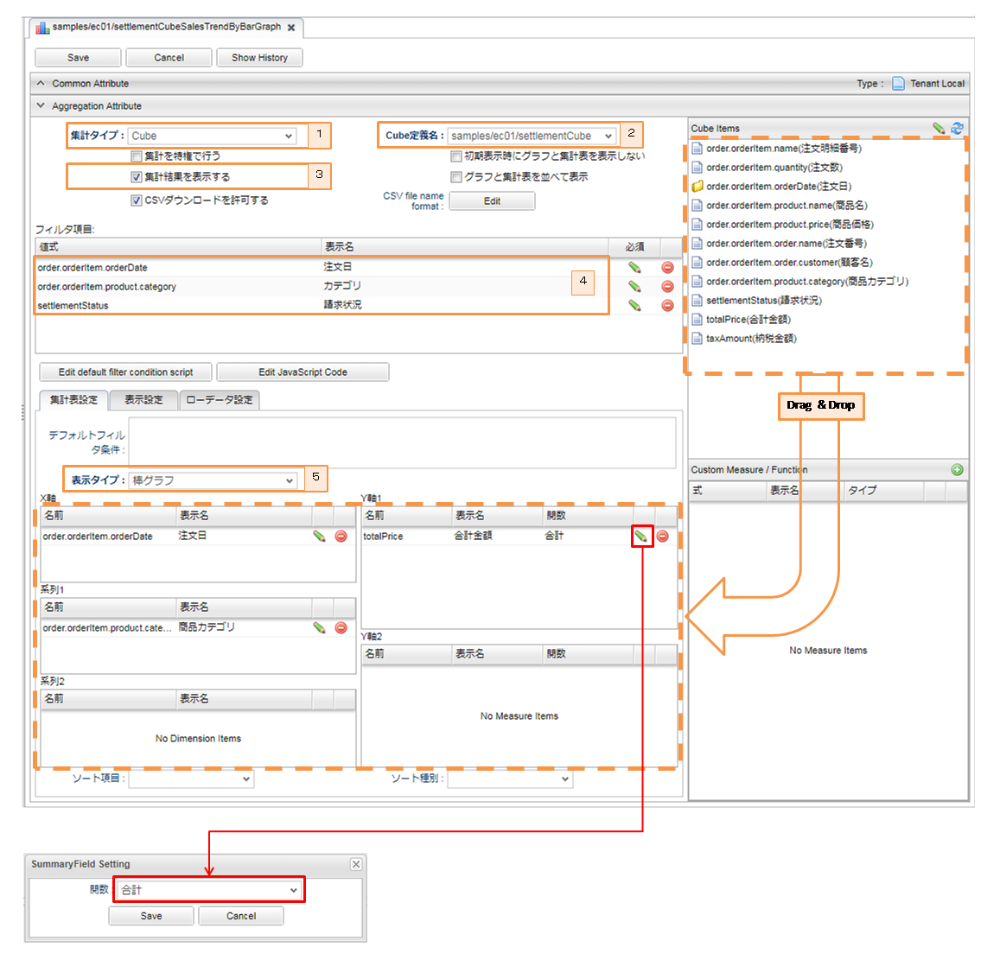

. 集計タイプに `Cube` を選択します。
. Cube定義名に作成済みの `請求用Cube` を選択します。
. 集計結果の表を表示します。
. フィルター項目を指定します。
. 集計表示タイプに `棒グラフ` を選択します。

※ 各設定項目の詳細については、開発者ガイドの<<../../developerguide/simplebi/index#aggregation_cube_setting, キューブ集計>>の章を確認してください。

==== 画面表示

マネージャーに属するユーザーで「EC注文管理」メニューを開き、「売上集計」アイテムをクリックします。 +
集計グラフ「売上傾向（棒グラフ）」を参照することができます。

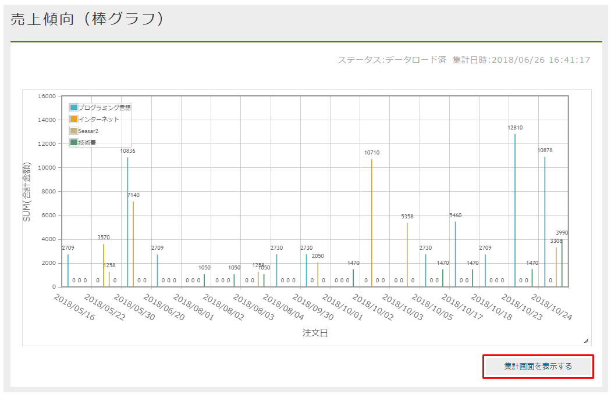

「集計画面を表示する」ボタンをクリックすると、集計設定画面が表示されます。

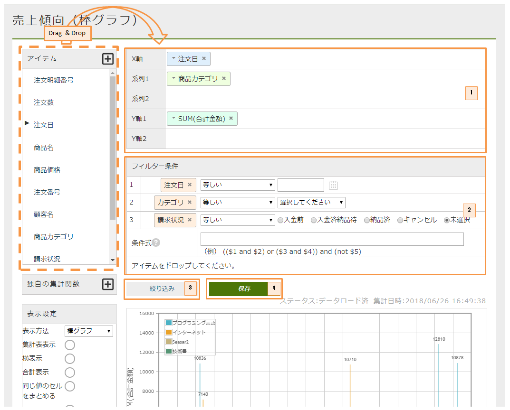

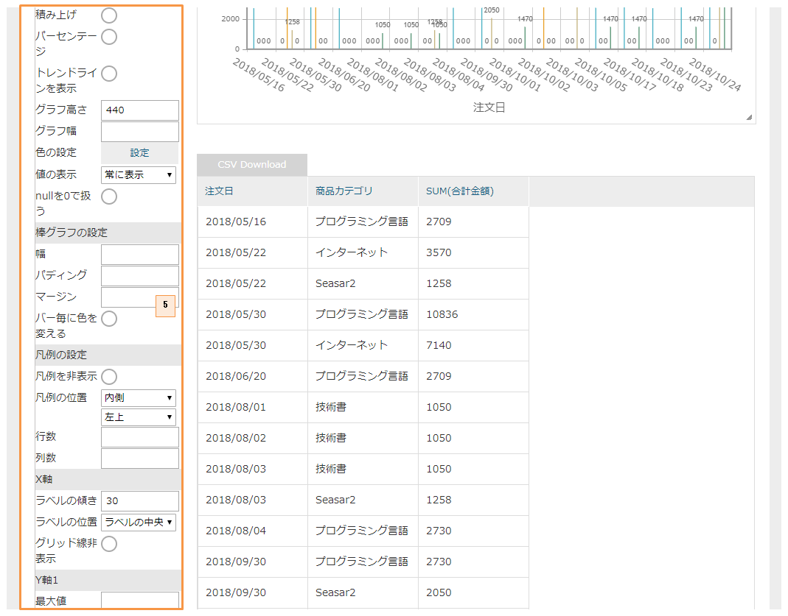

. アイテムからドラッグ&ドロップで集計設定が可能です。
. フィルター条件を画面上で設定可能です。
. クリックすると、絞り込みを行うためのダイアログが表示されます。
. クリックすると、保存リストダイアログが表示され、検索結果を保存リストに保存することができます。
. 各設定項目の詳細については、開発者ガイドの<<../../developerguide/simplebi/index#aggregation_cube_setting, キューブ集計>>の章を確認してください。
