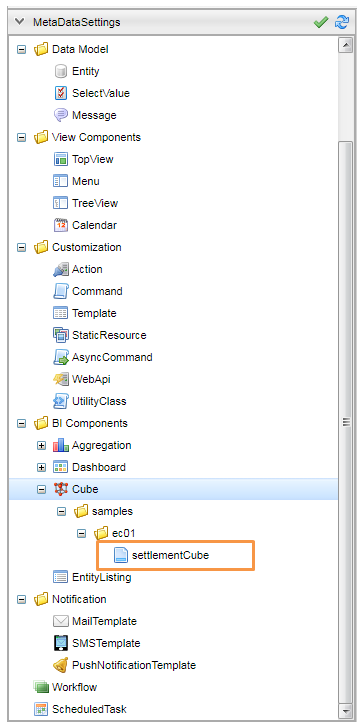
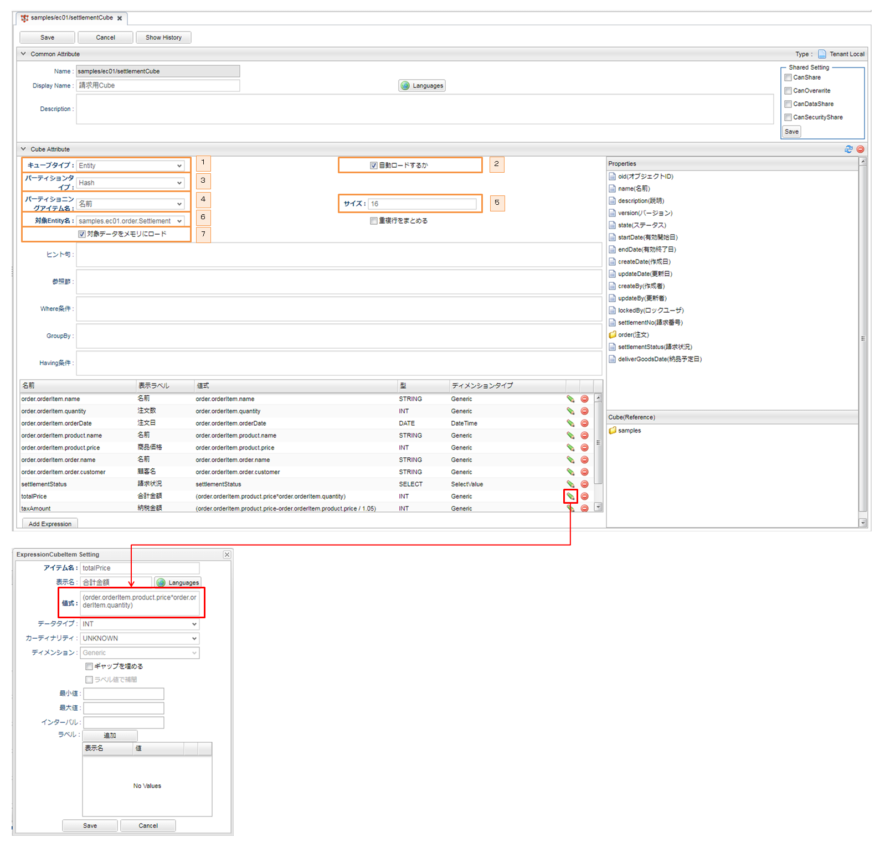

[[EEPackage_Cube]]
== [.eeonly]#Cube#

=== Cubeの作成例

このサンプルでは請求用Cubeを作成しています。 + 
以下は請求用CubeCubeを例として説明して行きます。

==== 注文明細用Cube

. キューブタイプをEntityに選択します。
. Cube表示時に最新データを自動的にロードにします。
. ハッシュ値を利用してパーティショニングします。
. パーティショニングアイテム名を名前（注文明細番号）に選択します。
. パーティション総数を指定します。
. 集計対象エンティティを請求エンティティに選択します。
. 集計に使用するデータをメモリにロードします。

※　設定項目の説明は開発者ガイド<<../../developerguide/simplebi/index#cube, Cubeの管理>>の章を参照してください。
