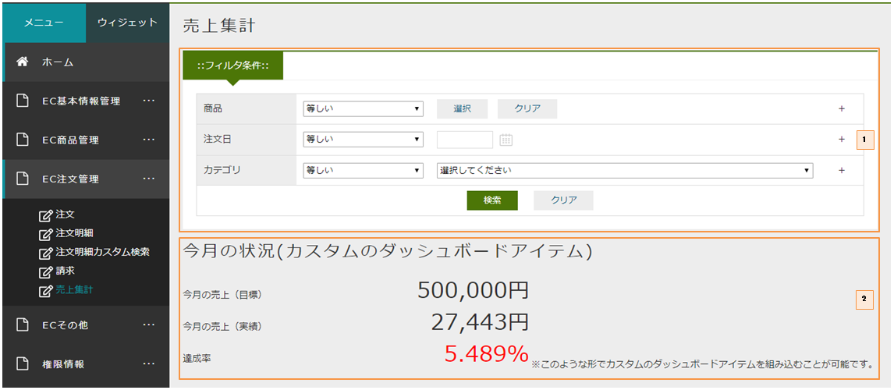

[[EEPackage_Dashboard]]
== [.eeonly]#DashBoard#

このサンプルでは作成したAggregationを複数選択し、ひとつの画面に表示しています。 + 
それに、複数のAggregationを跨いだフィルターを設定しています。

=== AdminConsoleでの設定

. 中心となる集計定義
. カスタムのダッシュボードアイテム
. このサンプルで作成している集計

※　設定項目の説明は開発者ガイド <<../../developerguide/aggregation/index#dashboard, ダッシュボードの管理>>の章を参照してください。

=== 画面表示

マネージャーに属するユーザーが「EC注文管理」メニューを開き、「売上集計」サブメニューをクリックすると、ダッシュボードを参照することが出来ます。

. 中心となる集計定義
. カスタムのダッシュボードアイテム

各集計グラフ

